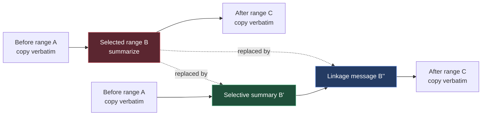
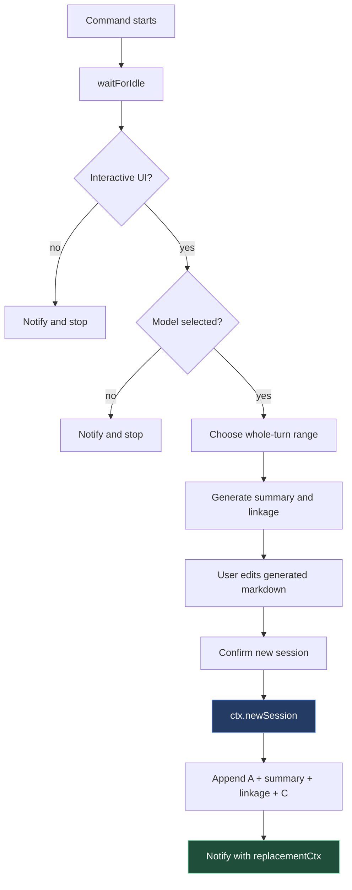

# Selective Compaction Extension: Rewriting Middle Session Context

Selective compaction is a Pi extension for replacing an older middle range of a coding-agent conversation with a concise summary while preserving the conversation before and after that range. The extension exists because normal session compaction solves a suffix problem, while long coding sessions often need a middle-range rewrite: earlier setup and later work both still matter, but a large exploratory section between them no longer needs to remain verbatim.

This report explains the extension as an implementation, not as a product announcement. The goal is to make the design easy to inspect and safe to extend. By the end, a reader should understand the session transformation, the turn-boundary safety rule, the dedicated summarization prompt, the new-session handoff, and the stale-context bug that appeared during interactive testing.

> [!summary]
> - Selective compaction rewrites a session from `A + B + C` into `A + summary(B) + linkage(B,C) + C`.
> - The MVP selects whole turns rather than arbitrary messages because provider contexts can become invalid if assistant tool calls and tool results are separated.
> - The extension creates a new session instead of mutating the current session, which keeps the source transcript recoverable and fits Pi's context-replacement lifecycle.
> - After `ctx.newSession(...)`, the original extension context is stale. Post-replacement work must happen inside `withSession` using the replacement context.

## Why this extension exists

Pi already has compaction machinery for preserving a useful suffix of a session while summarizing older context. That model is effective when the most recent part of the conversation is the only part that must remain verbatim. It is less effective when the conversation has the following shape:

```text
system prompt + A + B + C
```

In that shape, `A` is earlier setup that should stay exact, `C` is later work that should also stay exact, and `B` is an older middle range that consumed a large part of the context window. A suffix compactor can summarize a prefix and keep a suffix. It does not naturally express "keep the beginning, summarize the middle, keep the end."

The selective compaction extension implements that missing operation. It lets the user choose a compact start turn and a compact end turn. It then generates two replacement messages:

- `B'`: a structured summary of the selected range.
- `B''`: a short linkage message that explains how the preserved following messages should be read after the middle range has been replaced.

The resulting session has this shape:

```text
system prompt + A + B' + B'' + C
```

The system prompt is not copied as an ordinary session entry. Pi applies the current runtime system prompt to the new session. The extension operates on the message entries in the current branch and reconstructs a new branch with copied messages plus custom summary entries.

## The project artifact

The implementation lives in the Pi extensions repository:

```text
/home/manuel/code/wesen/2026-04-21--pi-extensions/extensions/selective-compaction/
├── README.md
├── index.ts
├── prompt.ts
└── session.ts
```

The extension is loaded by project settings:

```json
{
  "extensions": [
    "../extensions/selective-compaction/index.ts"
  ]
}
```

The code was committed in two focused commits:

| Commit | Purpose |
|---|---|
| `d056295309628073fbc6d1bf75a8f4856c555699` | Adds the selective compaction MVP, ticket docs, and project settings wiring. |
| `d5738995b1bddb10ddd6e334477007a130814ad8` | Fixes the stale extension context bug after `ctx.newSession(...)`. |

The design work is tracked under the docmgr ticket `PI-EXT-SELECTIVE-COMPACTION` in the same repository. The implementation guide is stored at:

```text
/home/manuel/code/wesen/2026-04-21--pi-extensions/ttmp/2026/05/11/PI-EXT-SELECTIVE-COMPACTION--pi-extension-for-selective-session-compaction/design/02-selective-compaction-intern-implementation-guide.md
```

## The central transformation

The extension is easiest to understand as a branch rewrite. It reads the visible branch from Pi's session manager, partitions the branch into three slices, and appends a new sequence of entries into a new session.



The important point is that this is not an in-place edit. The source session remains available. The replacement session has a parent pointer to the source session, and the inserted summary entries record metadata such as the source session path, compacted entry IDs, generated timestamp, and extracted file lists.

The practical result is conservative: a failed or low-quality summary does not destroy the original conversation. The user can inspect the new session, switch back if needed, and regenerate with a different range later.

## Extension entry point

The extension entry point is `extensions/selective-compaction/index.ts`. It registers the extension with the shared extension registry and also registers direct slash commands:

```typescript
const COMMAND = "selective-compact";
const ALIAS = "scompact";

export default function selectiveCompaction(pi: ExtensionAPI): void {
  registerPiExtension({
    id: "selective-compaction",
    name: "Selective Compaction",
    description: "Summarize a selected middle range of the current session into a new conversation.",
    commands: [COMMAND, ALIAS],
    tags: ["compaction", "session", "context"],
    run: async (ctx) => openSelectiveCompactionFlow(ctx),
    actions: [
      {
        id: "open",
        title: "Open selective compaction flow",
        default: true,
        run: async (ctx) => openSelectiveCompactionFlow(ctx),
      },
    ],
  });

  pi.registerCommand(COMMAND, {
    description: "Compact a selected middle range into a new session",
    handler: async (_args, ctx) => openSelectiveCompactionFlow(ctx),
  });
}
```

There are two user-facing paths into the same flow:

- `/px`, then selecting the Selective Compaction action from the shared launcher.
- `/selective-compact` or `/scompact` directly.

Keeping these entry points pointed at one function matters. A context-rewriting command has enough lifecycle constraints that duplicate flows would be a source of bugs.

## The command flow

The main flow is a sequence of decisions. Each step either produces data for the next step or exits without changing the session.



The implementation follows that sequence:

```typescript
async function openSelectiveCompactionFlow(ctx: ExtensionCommandContext): Promise<void> {
  await ctx.waitForIdle();

  if (!ctx.hasUI) {
    ctx.ui.notify("selective-compaction requires interactive mode", "error");
    return;
  }
  if (!ctx.model) {
    ctx.ui.notify("No model selected", "error");
    return;
  }

  const partition = await choosePartition(ctx);
  if (!partition) return;

  const generated = await generateWithLoader(ctx, partition);
  if (!generated) return;

  const edited = await ctx.ui.editor("Edit selective compaction output", generated.raw);
  if (edited === undefined) {
    ctx.ui.notify("Selective compaction cancelled", "info");
    return;
  }

  const finalGenerated = parseSelectiveCompactionResponse(edited);
  const create = await ctx.ui.confirm(
    "Create new selective-compaction session?",
    "This will switch to a new session containing A + compacted B + linkage + C. The current session will remain unchanged.",
  );
  if (!create) return;

  const sourceSession = ctx.sessionManager.getSessionFile();
  await ctx.newSession({
    parentSession: sourceSession,
    setup: async (sm) => {
      appendCompactedSession(sm, partition, finalGenerated, sourceSession);
    },
    withSession: async (replacementCtx) => {
      replacementCtx.ui.notify("Selective compaction session created.", "info");
    },
  });
  return;
}
```

Every step before `ctx.newSession(...)` uses the original command context because the current session is still active. After `ctx.newSession(...)`, the code returns. That final `return` is not cosmetic; it is a lifecycle boundary.

## Why whole-turn selection is the safety rule

The MVP selects whole turns rather than arbitrary individual messages. This is the most important correctness decision in the implementation.

Pi sessions contain more than plain user and assistant text. A realistic coding-agent turn may include assistant tool calls, tool result messages, bash execution messages, custom messages, branch summaries, and compaction entries. LLM providers are strict about the ordering of tool calls and tool results. If the extension cuts through the middle of such a sequence, the new session may contain a tool result without the corresponding assistant tool call, or a tool call without the corresponding result.

The extension avoids that by grouping message entries at user-message boundaries:

```typescript
export function buildTurns(entries: MessageEntry[]): SelectableTurn[] {
  if (entries.length === 0) return [];
  const turns: SelectableTurn[] = [];
  let start = 0;

  for (let i = 1; i < entries.length; i++) {
    if (entries[i]?.message.role === "user") {
      turns.push(createTurn(entries, start, i - 1, turns.length));
      start = i;
    }
  }

  turns.push(createTurn(entries, start, entries.length - 1, turns.length));
  return turns;
}
```

This rule does not prove that every provider context is valid. It is a conservative approximation that matches how interactive agent turns are usually structured: a user message begins a turn, and the assistant/tool cascade that follows belongs to that turn until the next user message. The result is safer than arbitrary message cutting and simple enough to explain to users.

The partition is then a direct slice over the message entries:

```typescript
export function buildPartition(
  entries: MessageEntry[],
  startTurn: SelectableTurn,
  endTurn: SelectableTurn,
): SelectivePartition {
  return {
    before: entries.slice(0, startTurn.startIndex),
    selected: entries.slice(startTurn.startIndex, endTurn.endIndex + 1),
    after: entries.slice(endTurn.endIndex + 1),
    startEntryId: startTurn.startEntryId,
    endEntryId: endTurn.endEntryId,
    startTurn,
    endTurn,
  };
}
```

The invariant is simple:

```text
entries == before ++ selected ++ after
selected starts at a selected turn boundary
selected ends at a selected turn boundary
```

That invariant is the basis for the rest of the extension.

## The prompt is not the stock compaction prompt

The extension uses a dedicated prompt because the task is different from normal compaction. A normal compaction summary can focus on preserving what the next assistant turn needs. Selective compaction must also explain how the later preserved context should be understood. That later context may contain references such as "continue from that implementation state" or "fix the bug above." If the middle range is removed, those references need a bridge.

The prompt in `prompt.ts` defines the job precisely:

```typescript
export const SELECTIVE_COMPACTION_SYSTEM_PROMPT = `You are Pi's selective session compaction summarizer.

Your job is to replace a selected middle range of a coding-agent conversation with a compact, technically precise summary and a linkage message. The messages before the selected range and after the selected range will remain verbatim in the new session.

Optimize for recovering context-window budget while preserving continuity. Do not continue the conversation. Do not solve new tasks. Summarize only the selected range.`;
```

The user message sent to the model contains three regions:

```text
previous-context-tail: last few messages from A
selected-range: full B
following-context-head: first few messages from C
```

Only the selected range is summarized in full. The previous tail and following head provide orientation. They are intentionally limited because the new session will already preserve `A` and `C` verbatim. The model does not need to re-summarize all of `A` and `C`; it needs enough context to decide which parts of `B` matter.

The prompt requires a stable markdown structure:

```text
## Selective Compaction Summary

### What happened
### Relevant outcomes and decisions
### Files, commands, and artifacts
### Errors, blockers, and corrected assumptions
### What is safe to forget
### What remains relevant going forward

<read-files>
...
</read-files>

<modified-files>
...
</modified-files>

## Linkage Message
...
```

The parser splits the model output at `## Linkage Message`:

```typescript
export function parseSelectiveCompactionResponse(raw: string): GeneratedSelectiveCompaction {
  const trimmed = raw.trim();
  const linkageMatch = trimmed.match(/\n##\s+Linkage Message\s*\n/i);
  let summary = trimmed;
  let linkage = "The previous middle section of the conversation was selectively compacted. Continue with the preserved following messages using the summary above as the bridge for any references to the compacted material.";

  if (linkageMatch?.index !== undefined) {
    summary = trimmed.slice(0, linkageMatch.index).trim();
    linkage = trimmed.slice(linkageMatch.index + linkageMatch[0].length).trim() || linkage;
  }

  return {
    summary,
    linkage,
    raw: trimmed,
    readFiles: extractTagLines(trimmed, "read-files"),
    modifiedFiles: extractTagLines(trimmed, "modified-files"),
  };
}
```

The fallback linkage is important. A summarization result should not fail solely because the model omitted the exact linkage heading. The user still gets the editor step and can repair the text before the new session is created.

## How the new session is assembled

The session assembly code is in `appendCompactedSession`. It receives a `SessionManager`, the partition, the generated summary, and the source session path.

```typescript
export function appendCompactedSession(
  sm: SessionManager,
  partition: SelectivePartition,
  generated: GeneratedSelectiveCompaction,
  sourceSession: string | undefined,
): void {
  appendMessages(sm, partition.before);

  const now = new Date().toISOString();
  const baseDetails = {
    sourceSession,
    compactedStartEntryId: partition.startEntryId,
    compactedEndEntryId: partition.endEntryId,
    compactedMessageCount: partition.selected.length,
    generatedAt: now,
    readFiles: generated.readFiles,
    modifiedFiles: generated.modifiedFiles,
  };

  sm.appendCustomMessageEntry(SUMMARY_CUSTOM_TYPE, generated.summary, true, baseDetails);
  sm.appendCustomMessageEntry(LINKAGE_CUSTOM_TYPE, generated.linkage, true, {
    ...baseDetails,
    followsSummary: true,
  });

  appendMessages(sm, partition.after);
  sm.appendCustomEntry(STATE_CUSTOM_TYPE, { ... });
}
```

There are three entry kinds in play:

| Entry | Displayed to user | Included in model context | Purpose |
|---|---:|---:|---|
| Copied message entries | Yes | Yes | Preserve `A` and `C` exactly as conversation messages. |
| Summary custom message | Yes | Yes | Replace the selected middle range with structured context. |
| Linkage custom message | Yes | Yes | Bridge from the summary into the preserved following context. |
| State custom entry | No ordinary message display | No | Record provenance and entry IDs for future tooling. |

The summary and linkage are appended with `appendCustomMessageEntry(..., true, details)`. The `true` display flag means they are visible, and because they are custom message entries they can be rendered by extension-specific renderers.

The source messages are copied with `structuredClone` before appending:

```typescript
function appendMessages(sm: SessionManager, entries: MessageEntry[]): void {
  for (const entry of entries) {
    sm.appendMessage(cloneMessage(entry.message));
  }
}

function cloneMessage(message: MessageEntry["message"]): MessageEntry["message"] {
  return structuredClone(message) as MessageEntry["message"];
}
```

This avoids sharing mutable message objects between the old session branch and the new session branch. The code copies messages, not original entry IDs. The inserted state entry records the old IDs separately for auditability.

## The stale-context bug

The first interactive test surfaced this runtime error:

```text
Extension "command:px:1" error: This extension ctx is stale after session replacement or reload. Do not use a captured pi or command ctx after ctx.newSession(), ctx.fork(), ctx.switchSession(), or ctx.reload(). For newSession, fork, and switchSession, move post-replacement work into withSession and use the ctx passed to withSession. For reload, do not use the old ctx after await ctx.reload().
```

The original code called `ctx.newSession(...)`, captured the returned result, and then used the old `ctx` to notify if the operation was cancelled:

```typescript
const result = await ctx.newSession({
  parentSession: sourceSession,
  setup: async (sm) => {
    appendCompactedSession(sm, partition, finalGenerated, sourceSession);
  },
  withSession: async (replacementCtx) => {
    replacementCtx.ui.notify("Selective compaction session created.", "info");
  },
});

if (result.cancelled) {
  ctx.ui.notify("New session creation cancelled", "info");
}
```

The problem is not the cancellation message itself. The problem is the use of the captured command context after a context-replacing operation. Once Pi replaces the active session, the old context can point at the wrong runtime state. Pi detects that and raises an error.

The fix is to treat `ctx.newSession(...)` as a boundary:

```typescript
await ctx.newSession({
  parentSession: sourceSession,
  setup: async (sm) => {
    appendCompactedSession(sm, partition, finalGenerated, sourceSession);
  },
  withSession: async (replacementCtx) => {
    replacementCtx.ui.notify("Selective compaction session created.", "info");
  },
});

// Do not touch `ctx` after `newSession()`: it may now be stale.
return;
```

This rule should be applied broadly in Pi extension code:

| Operation | Old context after operation | Safe place for post-operation work |
|---|---|---|
| `ctx.newSession(...)` | Stale after replacement | `withSession(replacementCtx)` |
| `ctx.fork(...)` | Stale after fork switch | `withSession` or replacement callback, depending on API shape |
| `ctx.switchSession(...)` | Stale after switch | Replacement callback/context |
| `ctx.reload(...)` | Stale after reload | Do not use old context after awaiting reload |

The extension now keeps all post-replacement work inside `withSession` and returns immediately after the new-session call.

## Failure modes and constraints

Selective compaction has a small implementation footprint, but it touches a hard part of agent systems: preserving a valid provider context while changing conversation history. The following constraints matter more than UI polish.

### Tool-call pairing

Assistant tool calls and tool results form ordered pairs. Removing one side can make the conversation invalid. Whole-turn selection reduces this risk by avoiding cuts inside the assistant/tool cascade following a user prompt.

### Existing compaction entries

The current implementation reads visible message entries from the current branch. If the branch already contains built-in compaction entries, the extension warns the user:

```typescript
if (branch.some((entry) => entry.type === "compaction")) {
  ctx.ui.notify(
    "This branch already contains one or more compaction entries. Selective compaction will copy visible message entries on the current branch, not reconstruct hidden pre-compaction history.",
    "warning",
  );
}
```

This is an honest boundary. The extension does not reconstruct hidden pre-compaction history. It operates on the branch Pi exposes.

### Empty or tiny ranges

The validator prevents empty selections and warns on ranges that are too small to recover meaningful context budget:

```typescript
if (partition.selected.length === 0) errors.push("Selected range is empty.");
if (partition.selected.length < 4) warnings.push("Selected range is small; compaction may not recover much context.");
```

This does not block small compactions. It tells the user that the operation may not be worth doing.

### Model output shape

The prompt asks for a strict markdown structure, but model output is not a type-safe protocol. The parser is tolerant and the UI exposes an editor before session creation. The user remains in control of the final text that enters the replacement session.

## Recommended testing sequence

The repository has no root `package.json`, so the practical automated validation is Pi startup loading:

```bash
timeout 30 pi --list-models
```

That check validates that the extension imports and registers successfully. It does not validate the interactive lifecycle. The manual test should be:

1. Start Pi in the project.
2. Reload extensions if necessary.
3. Open `/px` and select **Selective Compaction**, or run `/selective-compact`.
4. Choose a start turn and end turn that cover an older middle range.
5. Confirm the preview.
6. Let the model generate the summary and linkage.
7. Edit the generated markdown.
8. Confirm new-session creation.
9. Inspect the new session and verify the shape:

```text
A messages
selective-compaction-summary custom message
selective-compaction-linkage custom message
C messages
selective-compaction-state custom entry
```

10. Send one follow-up user prompt to confirm the provider accepts the resulting context.

The last step matters. Startup success is not enough. A context rewrite is only valid if the next provider request accepts the resulting message sequence.

## What should change next

The MVP deliberately uses simple UI primitives: select dialogs, confirmation prompts, a loader, and an editor. That is the right first version because the hard problem is session correctness. The next version should improve observability and selection confidence without changing the core transformation.

The strongest next steps are:

- Add a richer range picker that shows turn previews, message counts, estimated tokens, and tool-call presence.
- Add fixture tests for `buildTurns`, `buildPartition`, `validatePartition`, and `parseSelectiveCompactionResponse`.
- Add explicit provider-context validation if Pi exposes a suitable dry-run or serialization check.
- Decide whether summary and linkage should remain two custom messages or collapse into one custom message with two sections.
- Add a command option or settings field for prompt customization while preserving the default dedicated prompt.

## Working rules for future implementation

The extension should keep the following rules unless a future design deliberately replaces them:

- Preserve `A` and `C` verbatim.
- Replace only `B`.
- Use a dedicated selective-compaction prompt, not the stock compaction prompt.
- Select whole turns by default.
- Create a new session rather than mutating the current one.
- Do not use a command context after `ctx.newSession(...)`, `ctx.fork(...)`, `ctx.switchSession(...)`, or `ctx.reload(...)`.
- Keep the user edit step before creating the replacement session.

These rules are the core of the extension. The UI can change. The summary format can improve. The registry integration can grow new actions and settings. The safety rules are what make the feature usable in long, tool-rich coding sessions.

## Related notes

- [[ARTICLE - Playbook - Building and Testing Pi Extensions]]
- [[PROJ - Pi Extension - Hello World Before Thinking Blocks]]

## Source files

```text
/home/manuel/code/wesen/2026-04-21--pi-extensions/extensions/selective-compaction/index.ts
/home/manuel/code/wesen/2026-04-21--pi-extensions/extensions/selective-compaction/session.ts
/home/manuel/code/wesen/2026-04-21--pi-extensions/extensions/selective-compaction/prompt.ts
/home/manuel/code/wesen/2026-04-21--pi-extensions/extensions/selective-compaction/README.md
/home/manuel/code/wesen/2026-04-21--pi-extensions/.pi/settings.json
```
