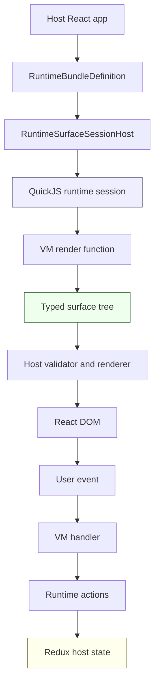
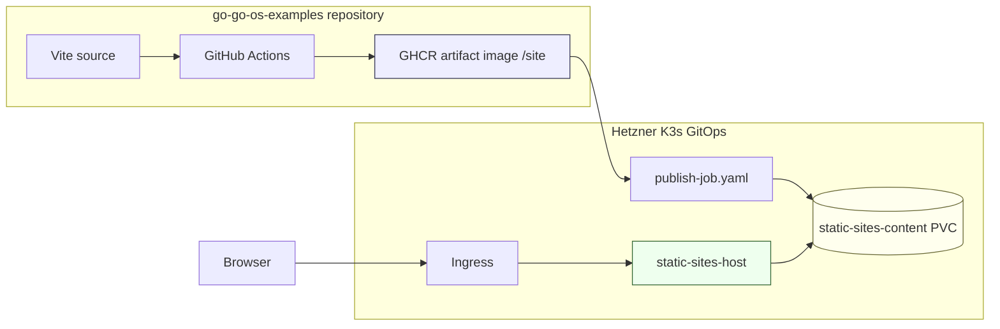

# go-go-os Examples: Public Packages, VM Runtime Demos, and Shared Static Hosting

This is the public-package and static-hosting branch of the [[go-go-os]] project map.

This report explains the technical path from reusable `go-go-os-frontend` packages to a public examples site running on the Hetzner K3s cluster. The work started as package publication: move UI, shell, REPL, and VM runtime code out of a monorepo-only context and prove that ordinary React applications can consume it from npm. It ended with a deployed static site served through a shared Caddy host, with the examples app published as an immutable GHCR artifact image.

The important point is not that a Vite app was deployed. The important point is that the deployment validates the package boundaries. The public site exercises the same package surfaces that a third-party consumer would use: theme imports, low-level primitives, rich widgets, a shell/window manager, a REPL, QuickJS runtime bundles, host-intent routing, and a Kanban runtime renderer. The site is therefore both documentation and integration test.

> [!summary]
> This project produced three durable engineering results.
> 1. The `@go-go-golems/*` frontend package family now has public npm package boundaries that are exercised by an independent consumer app.
> 2. The examples repository, `github.com/go-go-golems/go-go-os-examples`, builds a static artifact image that contains the Vite production output under `/site`.
> 3. The Hetzner K3s cluster now has a shared Caddy static-site host that can serve many sites from one Deployment, with each site contributing only an Ingress and a publish Job.

The live site is:

```text
https://go-go-os-examples.yolo.scapegoat.dev/
```

The source repository is:

```text
https://github.com/go-go-golems/go-go-os-examples
```

The current static artifact image is:

```text
ghcr.io/go-go-golems/go-go-os-examples-static:sha-e41d1c5ed7bc
```

---

## 1. What had to be proven

A package is not public merely because it has a name and a `package.json`. A frontend package becomes public when an application outside the source monorepo can install it, import it, build it, run it in development, render it in production, and understand its CSS and runtime side effects. This project treated those conditions as the definition of success.

The initial package family came from:

```text
/home/manuel/workspaces/2026-05-11/npm-packages-go-go-os/go-go-os-frontend
```

The independent consumer workspace started at:

```text
/home/manuel/workspaces/2026-05-11/npm-packages-go-go-os/2026-05-11--npm-go-go-os-test
```

and was later published as:

```text
github.com/go-go-golems/go-go-os-examples
```

The project had to prove these package surfaces:

| Package | Public role | Example stage that exercises it |
|---|---|---|
| `@go-go-golems/os-core` | Theme, primitive controls, notification slice, desktop primitives | Stages 00, 01, 02, 03 |
| `@go-go-golems/os-widgets` | Rich widgets, toolbar/status primitives, larger UI pieces | Stage 04 |
| `@go-go-golems/os-shell` | Desktop shell, launcher store, window manager boundary | Stage 05 |
| `@go-go-golems/os-repl` | REPL/terminal component and command driver contract | Stage 06 |
| `@go-go-golems/os-scripting` | QuickJS runtime sessions, bundle loading, host bridge | Stages 07, 08, 09 |
| `@go-go-golems/os-ui-cards` | Base `ui` VM package and `ui.card.v1` renderer | Stages 07, 08 |
| `@go-go-golems/os-kanban` | Higher-level `kanban` VM package and `kanban.v1` renderer | Stage 09 |

This table is the shape of the argument. Each stage is not a screenshot demo; it is a consumer contract. If a stage fails in a production build, the package boundary is incomplete.

---

## 2. The examples workspace as a package contract

The examples app is deliberately simple at the root. It is a navigator over numbered stages. That decision keeps the application from becoming a single custom product and makes each package boundary visible. A reader can move from stage 00 to stage 09 and see dependencies added one concept at a time.

The progression is:

| Stage | Purpose | Main lesson |
|---|---|---|
| 00 | Theme smoke test | Theme entrypoints and root wrapper class are required before components look correct. |
| 01 | `os-core` primitives | Low-level controls can be used without the source monorepo. |
| 02 | Local state forms | Package controls compose with ordinary React state. |
| 03 | RTK Query control panel | Package UI works with normal Redux Toolkit and RTK Query application state. |
| 04 | Rich widgets | Higher-level package widgets can be consumed from npm. |
| 05 | Window manager shell | Shell/window-manager concerns are exposed through `@go-go-golems/os-shell`, not private `os-core` internals. |
| 06 | REPL console | REPL drivers, completions, help, and host effects work directly from `@go-go-golems/os-repl`. |
| 07 | VM UI card | QuickJS bundle code renders a `ui.card.v1` surface. |
| 08 | VM events and intents | VM handlers update draft state and dispatch host notifications. |
| 09 | VM Kanban runtime | A higher-level VM package renders a semantic Kanban board. |

The root app's job is only selection and framing. The important files are the individual examples and their colocated stories:

```text
examples/00-theme-smoke
examples/01-os-core-primitives
examples/02-local-state-forms
examples/03-rtk-query-control-panel
examples/04-rich-widgets
examples/05-window-manager-shell
examples/06-repl-console
examples/07-vm-ui-card
examples/08-vm-events-and-intents
examples/09-vm-kanban-runtime
```

This shape was useful during debugging. When the REPL lost focus after Enter, stage 06 isolated the behavior. When the VM notification button appeared not to work, stage 08 isolated host-intent rendering. When the Kanban page deployed without correct CSS, stage 09 isolated the missing production stylesheet rules.

---

## 3. The VM runtime problem

The most technical part of the package family is the VM runtime. The runtime lets an application load JavaScript bundle code as data, evaluate it inside QuickJS, render a typed surface tree, and route event handlers back into host state. The browser does not execute VM bundle code directly. The bundle is source text passed into the runtime service.

A minimal host-side bundle definition looks like this:

```ts
import type { RuntimeBundleDefinition } from '@go-go-golems/os-shell';
import bundleCode from './bundle.vm.js?raw';

export const BUNDLE: RuntimeBundleDefinition = {
  id: 'hello-vm',
  name: 'Hello VM',
  icon: '🧪',
  homeSurface: 'home',
  plugin: {
    packageIds: ['ui'],
    bundleCode,
    capabilities: {
      domain: [],
      system: ['notify.show'],
    },
  },
  surfaces: {
    home: {
      id: 'home',
      type: 'ui.card.v1',
      title: 'Hello VM',
      icon: '🧪',
      ui: {},
    },
  },
};
```

The corresponding VM-side code is a data-producing program:

```js
defineRuntimeBundle(({ ui }) => ({
  id: 'hello-vm',
  title: 'Hello VM',
  packageIds: ['ui'],
  surfaces: {
    home: {
      packId: 'ui.card.v1',
      render({ state }) {
        return ui.panel([
          ui.text('Hello from QuickJS'),
          ui.button('Notify host', { onClick: { handler: 'notify' } }),
        ]);
      },
      handlers: {
        notify(ctx) {
          ctx.dispatch({
            type: 'notify.show',
            payload: { message: 'Hello from the VM' },
          });
        },
      },
    },
  },
}));
```

The runtime path is:



The host and VM have different responsibilities. The VM owns semantic UI construction and handler intent. The host owns validation, rendering, authorization, state storage, and side effects. This split is what makes the runtime package reusable: a bundle can describe what should be shown and what action occurred without receiving direct DOM or browser API access.

### Host notifications require host chrome

Stage 08 exposed a useful distinction. The VM handler for `Notify host` was dispatching the correct action:

```js
ctx.dispatch({
  type: 'notify.show',
  payload: { message: 'Notification dispatched from QuickJS' },
});
```

The runtime router converted that action into `showToast(message)`. The missing piece was not runtime routing. The missing piece was a React component inside the same Redux provider that read `notifications.toast` and rendered `Toast`.

The fix was to mount a small presenter in `VmExampleHost`:

```tsx
function VmExampleToast() {
  const dispatch = useDispatch();
  const toast = useSelector((state) => selectToast(state));

  if (!toast) {
    return null;
  }

  return <Toast message={toast} onDone={() => dispatch(clearToast())} />;
}
```

The rule is direct: if a runtime bundle dispatches host-facing system actions, the host must render the corresponding host chrome inside the same provider boundary.

---

## 4. Removing package-internal `?raw` imports

The first VM package release worked with a Vite workaround. That was acceptable for proving the surface, but not acceptable as the final consumer contract. Published packages should not require consumers to know that package internals import `.vm.js?raw` from `node_modules`.

The problematic pattern was:

```ts
import stackBootstrapSource from './stack-bootstrap.vm.js?raw';
import uiPackagePrelude from './runtime-packages/ui.package.vm.js?raw';
import kanbanPackagePrelude from './runtime-packages/kanban.package.vm.js?raw';
```

Vite can handle app-local raw imports, but package-internal raw imports from optimized dependencies created dev-server failures. The clean fix kept the `.vm.js` files as readable source of truth and generated TypeScript modules that export strings.

The generated files are:

```text
packages/os-scripting/src/plugin-runtime/stackBootstrapSource.generated.ts
packages/os-ui-cards/src/runtime-packages/uiPackageSource.generated.ts
packages/os-kanban/src/runtime-packages/kanbanPackageSource.generated.ts
```

The generator is:

```text
scripts/packages/generate-vm-source-modules.mjs
```

The invariant is enforced with:

```bash
npm run check:vm-sources
```

The package runtime now imports ordinary modules:

```ts
import stackBootstrapSource from './stackBootstrapSource.generated';
```

This fixes the consumer contract. Applications may still import their own local `*.vm.js?raw` files because they are authoring VM bundles as app data. But package internals no longer leak Vite-specific raw-query imports into the consumer's dependency optimizer.

The package releases that established this behavior were:

```text
@go-go-golems/os-scripting@0.1.1
@go-go-golems/os-ui-cards@0.1.1
@go-go-golems/os-kanban@0.1.1
```

The later README/documentation releases clarified this contract:

```text
@go-go-golems/os-scripting@0.1.2
@go-go-golems/os-ui-cards@0.1.2
@go-go-golems/os-kanban@0.1.2
```

---

## 5. The Kanban CSS failure and the meaning of side effects

The first deployed static site showed a real production-only failure. Stage 09 displayed the Kanban content, but it did not look like the Kanban component. Browser inspection showed that the DOM existed, but the CSS rules were absent from the final stylesheet.

Before the fix, computed styles looked like this:

```json
{
  "hasKb": true,
  "kbDisplay": "block",
  "boardDisplay": "block",
  "boardOverflowX": "visible",
  "hasKanbanCssRule": false
}
```

The consumer code already imported the theme:

```ts
import '@go-go-golems/os-kanban/theme';
```

The failure was in package metadata. The package marked CSS files as side effects:

```json
"sideEffects": ["**/*.css"]
```

But the public theme entry is a JavaScript module that imports CSS:

```js
import './kanban.css';
```

A production bundler can remove a JavaScript module if package metadata says it has no side effects. Once that module is removed, the CSS import inside it is never reached. The fix was to preserve both CSS files and the JavaScript theme entrypoints:

```json
"sideEffects": [
  "**/*.css",
  "./theme/index.js",
  "./theme/*.js"
]
```

This was published as:

```text
@go-go-golems/os-kanban@0.1.3
```

After the fix, the deployed site reported:

```json
{
  "kbDisplay": "flex",
  "boardDisplay": "flex",
  "boardOverflowX": "auto",
  "columnWidth": "200px",
  "hasKanbanCssRule": true
}
```

This failure is worth preserving because it is easy to miss in local development. A package theme can appear to work in Vite dev and Storybook, then disappear in a production bundle if the package side-effect contract is too narrow. The regression test should not only click stage 09. It should assert that the built stylesheet contains representative Kanban selectors such as `kb-board`, and that browser computed styles match the expected layout.

---

## 6. Why the static artifact image is not a web server

The examples repository publishes a static artifact image:

```text
ghcr.io/go-go-golems/go-go-os-examples-static:sha-<sha>
```

The final stage contains only `/site`:

```Dockerfile
FROM node:22-alpine AS build
WORKDIR /app

COPY package.json package-lock.json ./
RUN npm ci

COPY . .
RUN npm run build

FROM busybox:1.36
COPY --from=build /app/dist /site
CMD ["sh"]
```

This design separates build responsibility from serving responsibility. The source repository produces immutable content. The cluster platform serves content. That distinction matters because the K3s cluster can now serve additional static sites without adding one web-server Deployment per site.

The GitHub Actions workflow publishes two tags per commit:

```text
ghcr.io/go-go-golems/go-go-os-examples-static:sha-${GITHUB_SHA}
ghcr.io/go-go-golems/go-go-os-examples-static:sha-${GITHUB_SHA::12}
```

The short SHA is used in Kubernetes Job names. The full SHA remains available for provenance.

A clean Docker build also found a dependency hygiene issue. The first Docker build failed with:

```text
error TS2688: Cannot find type definition file for 'node'.
  The file is in the program because:
    Entry point of type library 'node' specified in compilerOptions
```

Local builds had passed because transitive packages made Node types available in the local `node_modules` tree. A clean `npm ci` inside Docker made the missing direct dependency visible. The fix was to add `@types/node` as a direct dev dependency.

---

## 7. The shared Caddy host

The K3s deployment uses a shared Caddy host. It is defined in:

```text
/home/manuel/code/wesen/2026-03-27--hetzner-k3s/gitops/kustomize/static-sites-host
```

It creates:

```text
Namespace: static-sites
Deployment: static-sites-host
Service: static-sites-host
PVC: static-sites-content
ConfigMap: static-sites-caddy-config
```

The Caddyfile is small because hostnames map directly to directories:

```caddyfile
:8080 {
  @health path /healthz
  respond @health "ok" 200

  root * /srv/sites/{host}/current

  @immutable path *.js *.css *.wasm *.svg *.ico *.png *.jpg *.jpeg *.gif *.webp
  header @immutable Cache-Control "public, max-age=31536000, immutable"
  header Cache-Control "no-cache"

  try_files {path} {path}/ /index.html
  file_server
}
```

The deployed layout is:

```text
/srv/sites/
  go-go-os-examples.yolo.scapegoat.dev/
    current -> releases/sha-e41d1c5ed7bc
    releases/
      sha-e41d1c5ed7bc/
        index.html
        assets/
        favicon.svg
        favicon.ico
```

The shared host does not need a config change when a new static site is added. A new site needs content under its host directory and an Ingress that routes that hostname to the shared service.



---

## 8. Per-site publishing with Kubernetes Jobs

The `go-go-os-examples` site package lives in:

```text
/home/manuel/code/wesen/2026-03-27--hetzner-k3s/gitops/kustomize/go-go-os-examples
```

It contains:

```text
ingress.yaml
publish-job.yaml
kustomization.yaml
```

The publish Job is the release mechanism. It copies `/site` from the artifact image into the PVC and updates the `current` symlink:

```sh
set -eu
host="go-go-os-examples.yolo.scapegoat.dev"
release="sha-e41d1c5ed7bc"
base="/srv/sites/${host}"
target="${base}/releases/${release}"
tmp="${target}.tmp"

rm -rf "${tmp}" "${target}"
mkdir -p "${tmp}"
cp -a /site/. "${tmp}/"
mv "${tmp}" "${target}"
ln -sfn "releases/${release}" "${base}/current"
```

The Job name includes the release SHA:

```text
publish-go-go-os-examples-sha-e41d1c5ed7bc
```

This is necessary because Kubernetes Jobs are effectively immutable for the fields that matter here. A new release should create a new Job rather than mutate the old one.

The live resources after deployment were:

```text
static-sites-host                                  Synced   Healthy
go-go-os-examples                                  Synced   Healthy

deployment.apps/static-sites-host                  1/1
persistentvolumeclaim/static-sites-content         Bound
ingress.networking.k8s.io/go-go-os-examples        91.98.46.169
job.batch/publish-go-go-os-examples-sha-e41d1c5ed7bc Complete 1/1
certificate.cert-manager.io/go-go-os-examples-tls  Ready=True
```

One operational detail surfaced after republishing. The per-site Argo Application uses `prune: false` so old publish Jobs can remain as release history. That caused Argo to report `OutOfSync` when the old Job remained but was no longer in desired manifests. The fix was to mark publish Jobs as extraneous-safe:

```yaml
metadata:
  annotations:
    argocd.argoproj.io/compare-options: IgnoreExtraneous
```

After deleting the older unannotated Job once, Argo returned to:

```text
go-go-os-examples   Synced   Healthy
```

---

## 9. Deployment sequence

The complete deployment sequence has four repositories or registries in play:

| System | Responsibility |
|---|---|
| `go-go-os-frontend` | Publishes npm packages such as `@go-go-golems/os-kanban`. |
| `go-go-os-examples` | Consumes public npm packages and builds the static artifact image. |
| GHCR | Stores immutable `/site` artifact images. |
| Hetzner K3s GitOps | Publishes artifact contents into the shared PVC and routes traffic. |

The sequence for a new demo release is:

```text
1. Update packages if needed.
2. Publish npm package patches.
3. Update go-go-os-examples package.json/package-lock.json.
4. Validate source build and production CSS.
5. Push go-go-os-examples main.
6. Wait for GHCR artifact image.
7. Update publish-job.yaml image tag and Job name.
8. Push Hetzner K3s GitOps main.
9. Sync go-go-os-examples Argo Application.
10. Browser-smoke the public URL.
```

A future release-bump script should automate steps 7 and 8. The script should take a short SHA, update the Job name, update the image tag, update the release label, and run `kubectl kustomize` before committing.

Pseudo-code for that script:

```text
input: short_sha
file = gitops/kustomize/go-go-os-examples/publish-job.yaml
old = parse current sha-* token
new = "sha-" + short_sha
replace old with new in:
  metadata.name
  metadata.labels.static.wesen.dev/release
  containers[0].image
  shell release variable
run kubectl kustomize gitops/kustomize/go-go-os-examples
```

---

## 10. Validation as part of the design

Validation was not a final step; it shaped the design. The package and deployment work produced several failures that only appeared under realistic conditions.

| Failure | Where it appeared | What it proved |
|---|---|---|
| `os-repl` input lost focus after Enter | Browser interaction in stage 06 | DOM `disabled` causes blur; package behavior needed a source fix, not an app workaround. |
| VM package raw imports failed in Vite dev | Consumer dev server | Published packages should not expose package-internal `?raw` imports to dependency optimization. |
| `Notify host` appeared not to work | Stage 08 | Runtime actions can dispatch correctly while host chrome is missing. |
| `/favicon.ico` 404 | Browser smoke | Clean smoke tests need static favicon assets, even if the app itself works. |
| Kanban page was unstyled | Public production deployment | Package theme entrypoints need side-effect metadata that preserves JS modules importing CSS. |
| Docker build missed Node types | Clean artifact build | Local `node_modules` can hide undeclared dev dependencies. |
| Argo stayed OutOfSync after republish | K3s release history Jobs | Keeping old Jobs requires compare behavior or cleanup policy. |

Each failure clarified a contract. The final system is better because the failures were addressed at the correct layer. The REPL focus bug was fixed in `os-repl`. Raw imports were fixed in VM packages. Host notification rendering was fixed in the demo host. Kanban CSS was fixed in `os-kanban` metadata. Favicon noise was fixed in the app. Static deployment concerns were fixed in GitOps.

---

## 11. The current state

The current live state is:

```text
Public URL: https://go-go-os-examples.yolo.scapegoat.dev/
Source repo: https://github.com/go-go-golems/go-go-os-examples
Artifact image: ghcr.io/go-go-golems/go-go-os-examples-static:sha-e41d1c5ed7bc
K3s namespace: static-sites
Shared host app: static-sites-host
Site app: go-go-os-examples
```

The currently important package versions are:

```text
@go-go-golems/os-core@0.1.1
@go-go-golems/os-widgets@0.1.2
@go-go-golems/os-shell@0.1.0
@go-go-golems/os-repl@0.1.5
@go-go-golems/os-scripting@0.1.2
@go-go-golems/os-ui-cards@0.1.2
@go-go-golems/os-kanban@0.1.3
```

The public browser validation for stage 09 now confirms the package CSS is present:

```json
{
  "kbDisplay": "flex",
  "boardDisplay": "flex",
  "boardOverflowX": "auto",
  "columnWidth": "200px",
  "hasKanbanCssRule": true
}
```

---

## 12. Working rules extracted from the project

The project produced rules that should be applied to the next static site and the next package release.

- A public package is not done until an independent consumer can run Vite dev, build production assets, build Storybook, and exercise browser behavior.
- A package theme entrypoint implemented as JavaScript must be listed as a side effect if its only purpose is to import CSS.
- App-local `?raw` VM bundle imports are acceptable, but package-internal `?raw` imports should be converted to generated source modules before publishing.
- Host-facing VM actions are not visible until the host renders the corresponding chrome inside the same state provider.
- Static Vite sites should publish immutable artifact images and let the cluster platform serve them.
- A shared Caddy host can serve many static sites if each hostname maps to `/srv/sites/{host}/current`.
- Kubernetes publish Jobs should include the release SHA in the Job name.
- Argo applications that keep old publish Jobs as history need either `IgnoreExtraneous` or a cleanup policy.
- Production CSS inspection is part of validation. A successful render is not enough when package styles are part of the contract.

---

## 13. Next steps

The next useful work is not more manual validation. The next useful work is to turn the observed failure modes into checks.

1. Add Playwright regressions for stages 06 through 09.
   - Stage 06 should assert REPL focus remains on the input after Enter.
   - Stage 08 should click `Notify host` and assert the toast text.
   - Stage 09 should assert Kanban computed styles, not only text content.

2. Add a production CSS regression.
   - Build the examples app.
   - Search the generated CSS for `kb-board`.
   - Fail if the selector is missing.

3. Add a release-bump script for static artifact deployments.
   - Input: short SHA.
   - Output: updated `publish-job.yaml` with matching name, image, label, and shell release variable.
   - Validation: `kubectl kustomize gitops/kustomize/go-go-os-examples`.

4. Audit all published theme entrypoints.
   - Packages with `./theme` exports should preserve both CSS files and JS theme entry modules in `sideEffects`.

5. Write a short operator playbook for adding another static site.
   - Build artifact image.
   - Add Ingress and publish Job.
   - Sync Argo.
   - Validate public URL.

These steps would turn the project from a successful first deployment into a repeatable static-site and package-validation system.
