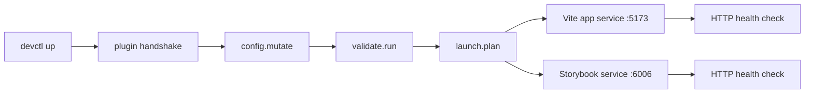

# go-go-os Frontend npm Packages: Publishing and Standalone Consumption

This article documents the full technical path from a private frontend monorepo to public npm packages and then to a real standalone consumer application. The source work happened across two repositories inside the same dated workspace:

- `/home/manuel/workspaces/2026-05-11/npm-packages-go-go-os/go-go-os-frontend`
- `/home/manuel/workspaces/2026-05-11/npm-packages-go-go-os/2026-05-11--npm-go-go-os-test`

The goal was not simply to publish tarballs. The goal was to prove that the low-level UI system in `go-go-os-frontend` can leave the source monorepo, survive npm publication, and function as an actual package surface inside a normal React application with independent tooling, independent dependency installation, and independent runtime orchestration.

The work therefore breaks into two problems. The first problem is package publication: identify reusable boundaries, convert package metadata from private/internal settings to public npm settings, fix the build pipeline, and publish the first versions. The second problem is package consumption: install those packages into a fresh application, use the exported APIs directly, theme the application with the OS1/macOS-1 visual system, and verify that the result works under Vite, Storybook, Redux Toolkit, RTK Query, and devctl supervision.

> [!summary]
> The journey had four decisive technical results:
> 1. `@go-go-golems/os-core`, `@go-go-golems/os-repl`, and `@go-go-golems/os-widgets` were successfully published to the public npm registry at version `0.1.0`.
> 2. The publication path required explicit fixes for TypeScript availability, public package metadata, registry targeting, and token/OTP behavior.
> 3. A standalone consumer app proved that the published packages work outside the source monorepo, both in production builds and in Storybook.
> 4. The consumer app was then wrapped in a devctl plugin so the Vite app and Storybook can be launched, supervised, and inspected as one local environment.

---

## Why this note exists

The immediate reason for this note is practical: future work on `go-go-os-frontend` package extraction should not have to rediscover the same registry, build, and consumer-integration constraints. The first publication of a package family always contains the highest concentration of friction because multiple systems are being aligned for the first time: workspace layout, TypeScript output, CSS side effects, npm auth, version rewriting, and the question of whether exported APIs are meaningful outside the original runtime.

The deeper reason is architectural. A frontend monorepo often accumulates reusable components long before it accumulates a reusable package boundary. Inside the monorepo, local path aliases and workspace dependencies conceal whether the public API is coherent. Publication removes those conveniences. Once the code leaves the monorepo, every assumption becomes explicit: what package owns what types, what CSS must be imported, what state helpers a consumer must wire, and which integrations are optional versus mandatory. This note records the process of making those assumptions visible and then testing them under realistic conditions.

---

## The source system: what existed before publication

Before publication, `go-go-os-frontend` already had the rough shape of a package monorepo. The root package declared workspaces for `packages/*` and `apps/*`, and the repository already contained multiple logical frontend packages. The most important package families for this effort were:

- `@go-go-golems/os-core`
- `@go-go-golems/os-repl`
- `@go-go-golems/os-widgets`
- `@go-go-golems/os-kanban` (investigated, but not part of the first public release)

What mattered is that the packages already existed as directories and already exported source entrypoints. What did **not** yet exist was a hardened publication path. The package metadata still reflected internal/private assumptions:

- packages were marked `private: true`
- publication targeted GitHub Packages rather than npmjs
- the build path depended on TypeScript being available in a way that the workspace did not yet guarantee
- the package family had never been validated in a fully independent consumer app

In other words, the repository had package **names**, **folders**, and **exports**, but not yet a demonstrated public package system.

### The first-wave package boundaries

The first decision was which packages should become public first. The answer was driven by reuse, dependency shape, and surface clarity.

| Package | Role in the system | Why it was included in the first wave |
|---|---|---|
| `@go-go-golems/os-core` | low-level primitives, theme entrypoints, core React UI components | it is the actual foundation for standalone use |
| `@go-go-golems/os-repl` | REPL/terminal-oriented components and CSS | it is a direct dependency of some richer widgets |
| `@go-go-golems/os-widgets` | higher-level widgets and widget primitives | it validates that the richer exported surface also works outside the monorepo |

The critical architectural judgment here is that `os-core` is the primary low-level package. It exports primitive building blocks such as buttons, checkboxes, radio buttons, tabs, data tables, forms, alerts, and the OS1 visual theme. `os-widgets` sits one level higher: it contains richer widgets and some widget-level primitives such as toolbars, status bars, search bars, separators, sparklines, and similar small pieces. That distinction matters because the standalone consumer application later used `os-core` as the main primitive layer and only used `os-widgets` selectively.

---

## The publication problem: turning workspace packages into public npm packages

The publication effort was not one change. It was a sequence of corrections. Each correction surfaced a hidden assumption in the original monorepo.

### 1. The TypeScript compiler was not actually available to the publication build

The existing publication build script in `go-go-os-frontend` already had a substantial amount of logic. It rewrote source exports into `dist` exports, copied CSS assets, generated `dist/package.json`, and rewrote `workspace:*` dependency specifiers into concrete versions. The build entrypoint was:

- `/home/manuel/workspaces/2026-05-11/npm-packages-go-go-os/go-go-os-frontend/scripts/packages/build-dist.mjs`

But the first validation attempt failed immediately because `npm exec -- tsc` could not find a usable TypeScript compiler in the workspace environment. That failure was important because it established that the package pipeline was only *nominally* ready.

The first instinct was to install TypeScript with npm. That failed because the repository already used `workspace:*` package specifiers, and npm rejected them during dependency installation. The exact practical lesson is simple: a monorepo can be buildable by one package manager and non-installable by another, even when package scripts still invoke `npm run`.

The fix was:

1. use pnpm for installation,
2. add `typescript` at the workspace level,
3. run `pnpm install` so the package-local dependency links are fully materialized.

Once that happened, the existing `build:dist` scripts began to work.

### 2. Public npm metadata had to replace private/internal metadata

The three published packages required the same category of metadata changes:

- set `private` to `false`
- change `publishConfig` to `{"access": "public"}`
- add keywords suitable for package discovery
- explicitly preserve CSS side effects

This was not a cosmetic change. It is what converted the package meaning from “internal workspace package” to “registry package that a stranger can install.”

A representative transformation looked like this conceptually:

```json
{
  "private": false,
  "publishConfig": {
    "access": "public"
  },
  "sideEffects": [
    "**/*.css",
    "./theme/index.js",
    "./theme/*.css"
  ]
}
```

The `sideEffects` field is especially important for frontend packages because CSS imports are side-effect imports by design. If the package metadata does not mark them appropriately, downstream bundlers may eliminate them in optimization passes.

### 3. Registry targeting had to be forced back to npmjs

There was a subtle but important registry problem. Even after the package metadata was rewritten for public npm, the CLI could still target GitHub Packages because the user's npm configuration had a scoped registry mapping for `@go-go-golems` pointing to `https://npm.pkg.github.com`.

That means public package metadata alone is not enough. The actual publish destination depends on the full npm configuration stack.

The fix was a repo-local `.npmrc` in `go-go-os-frontend`:

```ini
@go-go-golems:registry=https://registry.npmjs.org/
access=public
```

This mattered for two reasons:

- it made `npm publish --dry-run` actually target npmjs rather than GitHub Packages
- it made the repository self-describing for future publishing work

### 4. Publication still required the right authentication mechanism

The first real publish attempts still failed, even after package metadata, build output, and registry targeting were correct. The immediate failure mode was npm asking for a one-time password. A passkey alone was not sufficient for the CLI flow, and an initial token still triggered publish-time 2FA.

The underlying lesson is that “CLI is authenticated” and “CLI can publish without OTP” are different conditions.

The final successful path used an npm token that bypassed 2FA for publishing. The token was loaded from environment and injected into a temporary npm config so that it never needed to be written into the repository. That method mattered because it kept the repository clean while still proving a fully non-interactive publish path.

### Publication flow in sequence

The effective flow for the first successful public release was:

```text
1. Fix TypeScript availability and install dependencies with pnpm.
2. Rewrite package metadata for public npm publication.
3. Rebuild dist artifacts.
4. Dry-run npm publish against npmjs.
5. Build a standalone smoke app from local tarballs.
6. Retry authentication with a publish-capable npm token.
7. Publish os-core, then os-repl, then os-widgets.
8. Verify versions from the public registry.
```

---

## The publication architecture

The publication path becomes easier to reason about when reduced to a flow of transformations.

```mermaid
flowchart TD
  A[go-go-os-frontend package source] --> B[build-dist.mjs]
  B --> C[dist JS output]
  B --> D[dist d.ts output]
  B --> E[dist CSS assets]
  B --> F[dist package.json]
  F --> G[npm publish target selection]
  G --> H[npmjs registry]
  H --> I[@go-go-golems/os-core]
  H --> J[@go-go-golems/os-repl]
  H --> K[@go-go-golems/os-widgets]
```

The important point is that publication does not expose `src/` directly as the deliverable. The public contract is the `dist/` directory after rewriting and asset copying. The `src/` tree remains the authoring surface. The `dist/` tree becomes the distribution surface.

---

## What was actually published

The first public release produced three packages at version `0.1.0`:

```text
@go-go-golems/os-core@0.1.0
@go-go-golems/os-repl@0.1.0
@go-go-golems/os-widgets@0.1.0
```

The verification step queried npm directly:

```bash
npm view @go-go-golems/os-core version
npm view @go-go-golems/os-repl version
npm view @go-go-golems/os-widgets version
```

All three returned `0.1.0`.

This is a small detail, but it matters: publication is not finished when the CLI prints a success line. Publication is finished when the registry resolves the package and the consumer can install it.

---

## The consumer problem: proving the packages outside the monorepo

Publication only proves that package archives exist. It does not prove the exported APIs are useful. The second half of the work therefore moved into a fresh repository:

- `/home/manuel/workspaces/2026-05-11/npm-packages-go-go-os/2026-05-11--npm-go-go-os-test`

This repository had its own git history, its own docmgr ticket, its own package.json, its own TypeScript config, and its own Storybook configuration. That isolation is what makes the consumer result meaningful.

### Why the consumer app used low-level primitives rather than only rich widgets

The core question was not “can we render a large widget?” The more useful question was “do the low-level UI contracts actually behave like a package-level design system?”

That is why the consumer application focused on:

- `Btn`
- `Checkbox`
- `RadioButton`
- `TabControl`
- `ListBox`
- `DataTable`
- `FormView`
- `AlertDialog`
- `Toast`
- OS1/macOS-1 theme imports

These came primarily from `@go-go-golems/os-core`. The app also used some widget-level primitives from `@go-go-golems/os-widgets`, such as:

- `WidgetToolbar`
- `WidgetStatusBar`
- `SearchBar`
- `Separator`
- `Sparkline`
- `ButtonGroup`
- `LabeledSlider`

That package split is the real architectural proof: the consumer was able to build a coherent standalone UI by combining `os-core` primitives with a small amount of `os-widgets` surface, without needing the original monorepo.

---

## The consumer app: structure and intent

The standalone app was designed as an **OS1 Control Panel**. It was not just a demo page. It was a small but structured frontend with the following properties:

- React + Vite + TypeScript
- Redux Toolkit store
- RTK Query API layer using `fakeBaseQuery`
- Storybook with colocated component stories
- one directory per component
- OS1/macOS-1 themed shell

The important repository files include:

- `/home/manuel/workspaces/2026-05-11/npm-packages-go-go-os/2026-05-11--npm-go-go-os-test/package.json`
- `/home/manuel/workspaces/2026-05-11/npm-packages-go-go-os/2026-05-11--npm-go-go-os-test/src/services/controlPanelApi.ts`
- `/home/manuel/workspaces/2026-05-11/npm-packages-go-go-os/2026-05-11--npm-go-go-os-test/src/features/ControlPanelApp/ControlPanelApp.tsx`
- `/home/manuel/workspaces/2026-05-11/npm-packages-go-go-os/2026-05-11--npm-go-go-os-test/.storybook/preview.tsx`
- `/home/manuel/workspaces/2026-05-11/npm-packages-go-go-os/2026-05-11--npm-go-go-os-test/.devctl.yaml`

### Component structure

The consumer app adopted a strict component directory pattern:

```text
src/components/
  Os1Shell/
    Os1Shell.tsx
    Os1Shell.css
    Os1Shell.stories.tsx
    index.ts
  PrimitiveGallery/
    PrimitiveGallery.tsx
    PrimitiveGallery.css
    PrimitiveGallery.stories.tsx
    index.ts
  SettingsForm/
    SettingsForm.tsx
    SettingsForm.stories.tsx
    index.ts
  DeviceList/
    DeviceList.tsx
    DeviceList.css
    DeviceList.stories.tsx
    index.ts
  SystemStatusTable/
    SystemStatusTable.tsx
    SystemStatusTable.stories.tsx
    index.ts
  FeedbackDemo/
    FeedbackDemo.tsx
    FeedbackDemo.css
    FeedbackDemo.stories.tsx
    index.ts
```

This pattern was not arbitrary. It made each component independently storyable, independently reviewable, and easy to locate from the feature composition layer.

### RTK Query in a fully local consumer app

A useful part of the consumer experiment was proving that the app could have realistic state flow without any backend dependency. That is why the app used RTK Query with `fakeBaseQuery`. The point was not to simulate a network. The point was to validate the architectural shape of a real app:

- query hooks for loading state
- mutation hooks for updates
- reducer and middleware wiring
- feature components that read and write through RTK Query rather than direct prop-only toy state

This made the app more than a visual gallery. It became a small but structurally credible frontend.

---

## The consumer architecture

```mermaid
flowchart TD
  A[main.tsx] --> B[Redux Provider]
  B --> C[ControlPanelApp]
  C --> D[RTK Query hooks]
  D --> E[controlPanelApi fakeBaseQuery]
  C --> F[Os1Shell]
  F --> G[PrimitiveGallery]
  F --> H[SettingsForm]
  F --> I[DeviceList]
  F --> J[SystemStatusTable]
  F --> K[FeedbackDemo]
  G --> L[@go-go-golems/os-core]
  G --> M[@go-go-golems/os-widgets]
  H --> L
  I --> L
  J --> L
  K --> L
```

What this architecture proves is straightforward: the published packages are not only importable, but composable under ordinary React application patterns.

---

## Theme loading and scoping: the most important consumer-side rule

The consumer application depended on two theme imports:

```ts
import '@go-go-golems/os-core/theme';
import '@go-go-golems/os-core/desktop-theme-macos1';
```

And the app root had to apply the correct scope:

```tsx
<div data-widget="hypercard" className="theme-macos1">
  ...
</div>
```

This detail is fundamental. The OS1/macOS-1 theme is not a global CSS reset. It is scoped through the `data-widget="hypercard"` attribute plus the `theme-macos1` class. A consumer that imports the CSS but omits this wrapper will not get the intended theme behavior.

This is precisely the kind of rule that package publication exposes. Inside the original codebase, the scoping rule may be visually obvious from surrounding components. Outside the codebase, it has to become documentation.

---

## Storybook as package validation, not decoration

Storybook in the consumer repo served a real engineering purpose. It validated that the package API is usable at the component boundary, not only inside the final composed app. The consumer app therefore placed `.stories.tsx` files directly next to each component.

This mattered for two reasons.

First, it ensured that every component wrapper had an isolated usage example. A package consumer should be able to learn a component by reading a story and its props, not by navigating a monolithic application.

Second, Storybook flushed out real integration issues. One of the early failures was that the Storybook preview file contained JSX but was named `.ts` rather than `.tsx`. Another set of failures came from strict published type declarations: readonly arrays where mutable arrays were expected, widened `string` values where exact field config unions were required, and generic constraints around table row types.

Those are useful failures. They show that the package surface is strict enough to catch misuse early.

---

## Devctl support: making the consumer app operationally coherent

Once the standalone app and Storybook worked, the final operational step was adding devctl support so both processes could be launched and supervised together.

The consumer repo added:

- `.devctl.yaml`
- `scripts/devctl/os1_component_lab_plugin.py`

The plugin implements devctl protocol v2 and supports:

- `config.mutate`
- `validate.run`
- `launch.plan`

The launch plan defines two services:

```text
app       npm run dev -- --host 127.0.0.1 --port 5173
storybook npm run storybook -- --host 127.0.0.1
```

This is important because it turns the repo into a coherent local environment rather than two unrelated commands. The consumer app is no longer just buildable. It is operable.

### Operational diagram



The verification step confirmed that both URLs answered with HTTP 200 and that devctl status reported both services as alive.

---

## Failure modes that shaped the final result

This project is useful because the failures are concrete and generalizable.

### Failure mode 1: package existence is not package readiness

A folder under `packages/` with a `package.json` and an `exports` field is not the same thing as a public package.

A package is not ready until:

- it can build its distributable output
- its metadata matches the target registry model
- its CSS side effects are preserved
- its dependencies are rewritten correctly for external consumers
- a real external consumer has compiled it successfully

### Failure mode 2: registry metadata and CLI registry targeting are independent

Changing `publishConfig` is not enough if npm configuration still points the scope elsewhere.

This matters because publication bugs can look like authentication failures or permissions problems when the real issue is simply that the CLI is talking to the wrong registry.

### Failure mode 3: passkeys, OTP, and tokens are distinct mechanisms

Browser login, CLI authentication, CLI publication, and 2FA bypass are separate concerns. The work only completed once the distinction between “I can log in” and “I can publish non-interactively” was handled explicitly.

### Failure mode 4: strict exported types expose sloppy local assumptions

The standalone app hit exactly the kinds of type issues one wants to find early:

- wrong story args shape
- readonly arrays where mutable arrays were expected
- too-wide string typing for config structures
- generic constraints not satisfied by local interfaces

This is not noise. This is the package API doing its job.

### Failure mode 5: theme systems require usage rules, not just CSS files

The published theme worked because the consumer understood and applied the scoping contract. This is a reminder that a theme system is partly code and partly convention. Publication forces that convention into the open.

---

## The resulting working rules

The most valuable outcome of this journey is a set of rules that can be reused for future package work.

### Rule 1: publish the smallest coherent package family, not the whole monorepo

The first release succeeded because it focused on three packages with a clear dependency chain. A first release should minimize moving parts while still proving the core architecture.

### Rule 2: always validate with an external consumer repo

A tarball dry-run is necessary but insufficient. A separate repository with its own lockfile, Storybook, state wiring, and build output is the real test.

### Rule 3: package theme systems need a documented root wrapper contract

If a theme depends on scope attributes or classes, that contract belongs in both code examples and docs.

### Rule 4: treat Storybook as an integration test for package APIs

Stories are not only for screenshots. They verify that a consumer can understand and instantiate the package surface at the component boundary.

### Rule 5: operational polish matters after the build succeeds

The devctl step was not required for publication, but it made the consumer repository substantially more useful. Once package consumption works, local orchestration becomes the next multiplier.

---

## Pseudocode summary of the full journey

```text
investigate monorepo
identify reusable packages
fix build pipeline prerequisites
rewrite package metadata for public npm
ensure scoped registry points at npmjs
run dry-run publish
create standalone smoke app from tarballs
solve npm publish authentication
publish package family in dependency order
verify registry versions
create standalone consumer repository
install public packages from npm
build OS1-themed app with low-level primitives
add RTK Query and Storybook
validate production and Storybook builds
add devctl support for multi-process local operation
verify service health and URLs
```

---

## Important repository and document references

### Publication work

- repo: `/home/manuel/workspaces/2026-05-11/npm-packages-go-go-os/go-go-os-frontend`
- ticket docs:
  - `ttmp/2026/05/11/npm-widget-packages--extract-widgets-and-theme-packages-as-public-npm-packages/`
- key package files:
  - `packages/os-core/package.json`
  - `packages/os-repl/package.json`
  - `packages/os-widgets/package.json`
- build script:
  - `scripts/packages/build-dist.mjs`

### Consumer app work

- repo: `/home/manuel/workspaces/2026-05-11/npm-packages-go-go-os/2026-05-11--npm-go-go-os-test`
- ticket docs:
  - `ttmp/2026/05/11/os1-component-lab--build-standalone-os1-component-lab-with-published-npm-packages/`
- key app files:
  - `package.json`
  - `src/services/controlPanelApi.ts`
  - `src/features/ControlPanelApp/ControlPanelApp.tsx`
  - `.storybook/preview.tsx`
  - `.devctl.yaml`
  - `scripts/devctl/os1_component_lab_plugin.py`

### Consumer app commit history

```text
080b628 Document OS1 component lab plan
744d593 Scaffold OS1 component lab app
e447e32 Build RTK Query OS1 component lab
daeab9e Add devctl support for OS1 lab
5017a80 Record devctl service verification
```

---

## What remains unfinished

A useful report should end by describing what is still not done.

The package family is public and consumable, but several follow-up items remain structurally important:

- README quality for the published packages still matters; public packages need public onboarding, not only working code
- npm Trusted Publishers should be configured so future releases can rely on OIDC-based publication rather than ad hoc manual token handling
- additional packages such as `@go-go-golems/os-shell`, `@go-go-golems/os-kanban`, or `@go-go-golems/os-ui-cards` still require their own publication decisions
- the source repository currently contains the publication changes as working tree modifications rather than a clean final commit sequence; that is acceptable for the experiment, but not ideal for long-term traceability

This last point is worth being explicit about. The package publication was technically successful, but the source-repository history is not yet the clean narrative that the consumer repository now has. If this package line becomes durable, the publication repo should be normalized into reviewable commits as well.

---

## Closing

The most important result of this work is not that three packages were published. The important result is that the `go-go-os-frontend` UI system now has evidence of external life. It has moved from “components that happen to be in package-shaped folders” to “a package family that can be published, installed, themed, composed, built, storybooked, and supervised outside its source monorepo.”

That change is architectural. It means future work on the system can be evaluated against an external consumer standard. If a new component, type surface, or theme rule cannot survive that external boundary, it is not yet a package-level abstraction. If it can, then the project is no longer only building an app. It is building a frontend system.
