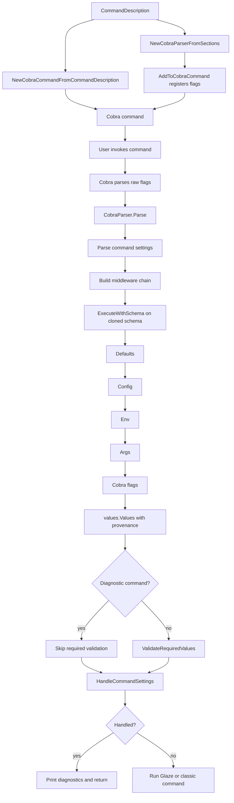

# Glazed Chain: From Cobra Flags to Typed Values

This article explains the Glazed command parsing chain: how a command description becomes Cobra flags, how defaults, config files, environment variables, positional arguments, and explicit flags are merged into one typed value tree, and why final validation happens only after that merge is complete. The goal is not to memorize every function name. The goal is to understand the shape of the system well enough that you can add a source, debug a precedence problem, or explain why `--print-parsed-fields` shows the provenance it shows.

> [!summary]
> - Glazed separates **field declarations** from **value sources**. A field says what a value is; a source says where a value came from.
> - The parser runs a middleware chain over a cloned schema. Sources call `next` first, so lower-precedence values are applied before higher-precedence values.
> - The final result is `values.Values`: sections containing typed `FieldValue` objects with parse-step logs.
> - Required fields are now validated against the final merged value, not against one source such as Cobra flags.

The reference implementation is the `glazed` repository at `/home/manuel/code/wesen/go-go-golems/glazed`. The most important files are:

| Area | File |
|---|---|
| Cobra parser construction | `/home/manuel/code/wesen/go-go-golems/glazed/pkg/cli/cobra-parser.go` |
| Cobra command execution | `/home/manuel/code/wesen/go-go-golems/glazed/pkg/cli/cobra.go` |
| Middleware execution | `/home/manuel/code/wesen/go-go-golems/glazed/pkg/cmds/sources/middlewares.go` |
| Defaults, env, maps | `/home/manuel/code/wesen/go-go-golems/glazed/pkg/cmds/sources/update.go` |
| Cobra and positional args source | `/home/manuel/code/wesen/go-go-golems/glazed/pkg/cmds/sources/cobra.go` |
| Config file source | `/home/manuel/code/wesen/go-go-golems/glazed/pkg/cmds/sources/load-fields-from-config.go` |
| Section/Cobra bridge | `/home/manuel/code/wesen/go-go-golems/glazed/pkg/cmds/schema/section-impl.go` |
| Field parsing from Cobra | `/home/manuel/code/wesen/go-go-golems/glazed/pkg/cmds/fields/cobra.go` |
| Field values and provenance | `/home/manuel/code/wesen/go-go-golems/glazed/pkg/cmds/fields/field-value.go` |
| Parsed value tree | `/home/manuel/code/wesen/go-go-golems/glazed/pkg/cmds/values/section-values.go` |
| Final required validation | `/home/manuel/code/wesen/go-go-golems/glazed/pkg/cmds/sources/validate_required.go` |

## 1. The problem Glazed is solving

A command-line program looks simple from the outside. You type a command, pass flags, maybe set an environment variable, and expect the program to run. Inside a framework, that simplicity hides a hard question: where did each value come from, and what should win when multiple sources provide the same value?

Consider a command with an `api-key` field. The application author may want the user to provide that key in several ways:

```bash
myapp run --api-key explicit-value
MYAPP_API_KEY=env-value myapp run
myapp run --config-file local.yaml
```

Those three invocations should not require three separate application code paths. The command author wants to declare the field once and let the framework resolve the value. Glazed's parsing chain is the answer to that problem. It turns many possible sources into one typed value tree.

The important architectural choice is that Glazed does not treat Cobra as the source of truth. Cobra is one source. Defaults are another source. Config files and environment variables are sources too. The final value is not "the Cobra flag value"; it is the result of a source-resolution pipeline.

That pipeline is why `--print-parsed-fields` can show a history like this:

```yaml
default:
  api-key:
    log:
      - source: defaults
        value: ""
      - source: env
        metadata:
          env_key: MYAPP_API_KEY
        value: env-value
      - source: cobra
        metadata:
          flag: api-key
        value: explicit-value
    value: explicit-value
```

This log is not decorative. It is the main debugging tool. It tells you not only what the value is, but also how it became that value.

## 2. The core data model: fields, sections, schemas, and values

Before looking at the chain, we need the vocabulary. Glazed uses four closely related concepts:

- A **field definition** describes one value: its name, type, default, help text, choices, and whether it is required.
- A **section** groups field definitions. A command usually has a default section, but it can also have named sections such as command settings, profile settings, or output settings.
- A **schema** is an ordered collection of sections.
- A **values tree** is the parsed result: section values containing field values.

A field definition is created with `fields.New`:

```go
fields.New(
    "api-key",
    fields.TypeString,
    fields.WithDefault(""),
    fields.WithRequired(true),
    fields.WithHelp("API key; can also be set through MYAPP_API_KEY"),
)
```

That declaration is intentionally source-neutral. It does not say "this value must come from Cobra" or "this value must come from env." It says: if a source provides a value for `api-key`, parse it as a string; if the final command run requires this value, it must be non-empty.

A section gives fields a namespace and, optionally, a prefix:

```go
section, err := schema.NewSection(
    "demo",
    "Demo",
    schema.WithPrefix("demo-"),
    schema.WithFields(
        fields.New("api-key", fields.TypeString),
        fields.New("threshold", fields.TypeInteger, fields.WithDefault(10)),
    ),
)
```

The prefix matters for Cobra flags and environment variables. A section prefix of `demo-` plus a field name of `api-key` yields a Cobra flag such as `--demo-api-key` and an environment suffix such as `DEMO_API_KEY`.

The parsed result lives in `values.Values`. Conceptually it looks like this:

```text
values.Values
└── section slug: "demo"
    └── fields.FieldValues
        ├── "api-key"   -> FieldValue{Value: "...", Log: [...]}
        └── "threshold" -> FieldValue{Value: 10,    Log: [...]}
```

The `FieldValue` is the key object. It stores both the current typed value and the parse log that explains how the current value was reached. The relevant code is in `pkg/cmds/fields/field-value.go`:

```go
type FieldValue struct {
    Value      interface{}
    Definition *Definition
    Log        []ParseStep
}
```

A parse step has a source and optional metadata. `fields.WithSource("env")` and `fields.WithMetadata(...)` are not just labels; they are how Glazed preserves provenance through merges.

## 3. The Cobra entry point

Most users enter the chain through `BuildCobraCommandFromCommand`. That function lives in `pkg/cli/cobra.go`. It takes a Glazed command description, builds a Cobra command, adds flags, and installs the run function.

The high-level flow is:

```text
CommandDescription
      |
      v
NewCobraCommandFromCommandDescription
      |
      v
NewCobraParserFromSections
      |
      v
CobraParser.AddToCobraCommand
      |
      v
runCobraCommand installs cmd.Run
      |
      v
user executes command
      |
      v
parser.Parse(cmd,args)
      |
      v
HandleCommandSettings or command business logic
```

The builder does two different jobs that are easy to confuse.

First, it registers command-line syntax with Cobra. This is what makes `--api-key` show up in help output and lets Cobra parse raw command-line tokens.

Second, it installs the Glazed parse-and-run flow. When the command runs, Cobra has already parsed flags syntactically, but Glazed still needs to turn those flags, plus env/config/defaults, into `values.Values`.

The split matters. Cobra owns CLI syntax. Glazed owns semantic value resolution.

## 4. How fields become Cobra flags

`CobraParser.AddToCobraCommand` walks the schema and asks each section to add its fields to the Cobra command. The section-level bridge is in `pkg/cmds/schema/section-impl.go`:

```go
func (p *SectionImpl) AddSectionToCobraCommand(cmd *cobra.Command) error {
    err := p.Definitions.AddFieldsToCobraCommand(cmd, p.Prefix)
    if err != nil {
        return err
    }

    AddFlagGroupToCobraCommand(cmd, p.Slug, p.Name, p.Definitions, p.Prefix)
    return nil
}
```

This step does not produce parsed values. It only registers flags and help metadata with Cobra. The command now knows that `--api-key` exists, what type it accepts, and how to display it in help.

Later, during parsing, `FromCobra` asks each `CobraSection` to gather changed flags:

```go
sectionValuesFromCobra, err := cobraSection.ParseSectionFromCobraCommand(cmd, options_...)
```

That method eventually calls `GatherFlagsFromCobraCommand`. The important detail is that Cobra source collection now ignores requiredness:

```go
cmd, true, true, p.Prefix, options...
```

The two booleans are:

- `onlyProvided = true`: only collect flags the user actually changed.
- `ignoreRequired = true`: do not fail just because a required flag was not changed.

Why ignore requiredness here? Because Cobra is only one source. A required field may be satisfied by config or env. If Cobra rejects the command before those sources run, the source pipeline is broken.

## 5. The source middleware chain

The heart of Glazed parsing is the middleware chain in `pkg/cmds/sources`. A source middleware has this shape:

```go
type HandlerFunc func(schema_ *schema.Schema, parsedValues *values.Values) error
type Middleware func(HandlerFunc) HandlerFunc
```

A middleware receives the next handler and returns a new handler. That handler can:

- modify the schema before later middlewares see it,
- call `next`,
- update parsed values after lower-precedence sources have run,
- or combine these behaviors.

The central execution function is `ExecuteWithSchema`:

```go
func ExecuteWithSchema(schema_ *schema.Schema, parsedValues *values.Values, middlewares ...Middleware) (*schema.Schema, error) {
    handler := Identity
    reversedMiddlewares := make([]Middleware, len(middlewares))
    for i, m_ := range middlewares {
        reversedMiddlewares[len(middlewares)-1-i] = m_
    }
    for _, m_ := range reversedMiddlewares {
        handler = m_(handler)
    }

    clonedSchema := schema_.Clone()
    return clonedSchema, handler(clonedSchema, parsedValues)
}
```

There are two subtleties here.

First, the schema is cloned. Middlewares may whitelist or blacklist fields, and those mutations should not destroy the command's original schema.

Second, the middleware list is reversed before wrapping. This lets the parser express precedence in a readable way while still allowing each source to call `next` before it applies its values.

A source that only adds values usually looks like this:

```go
func FromEnv(prefix string, options ...fields.ParseOption) Middleware {
    return func(next HandlerFunc) HandlerFunc {
        return func(schema_ *schema.Schema, parsedValues *values.Values) error {
            err := next(schema_, parsedValues)
            if err != nil {
                return err
            }
            return updateFromEnv(schema_, parsedValues, prefix, options...)
        }
    }
}
```

The source calls `next` first. That means lower-precedence sources run first, then this source overwrites or augments their values.

## 6. Precedence: the order in which values win

The built-in parser chain in `NewCobraParserFromSections` appends sources like this:

```go
middlewares_ := []cmd_sources.Middleware{}

middlewares_ = append(middlewares_, cmd_sources.FromCobra(cmd, fields.WithSource("cobra")))
middlewares_ = append(middlewares_, cmd_sources.FromArgs(args, fields.WithSource("arguments")))

if cfgCopy.AppName != "" {
    middlewares_ = append(middlewares_, cmd_sources.FromEnv(envPrefix, fields.WithSource("env")))
}

if cfgCopy.ConfigPlanBuilder != nil {
    middlewares_ = append(middlewares_, cmd_sources.FromConfigPlanBuilder(...))
}

middlewares_ = append(middlewares_, cmd_sources.FromDefaults(fields.WithSource(fields.SourceDefaults)))
```

At first glance this appears backwards. Cobra is appended first, but Cobra should have the highest precedence. The answer is the `next`-first middleware rule. Because `ExecuteWithSchema` reverses the list and each value source calls `next` first, the actual update order is:

```text
defaults -> config -> env -> positional args -> Cobra flags
```

This is exactly the desired precedence. Defaults provide a baseline. Config files override defaults. Env overrides config. Positional args override env. Explicit flags override everything else.

A useful way to picture the chain is as nested function calls:

```text
FromCobra(
  FromArgs(
    FromEnv(
      FromConfig(
        FromDefaults(
          Identity
        )
      )
    )
  )
)
```

When execution enters `FromCobra`, it immediately calls `next`. That descends all the way to `Identity`, then unwinds:

```text
Identity returns
FromDefaults applies defaults
FromConfig applies config
FromEnv applies env
FromArgs applies args
FromCobra applies flags
```

The order of application is the order of increasing authority.

## 7. A concrete example: one field, five sources

Suppose the field is declared as:

```go
fields.New(
    "proc-file",
    fields.TypeString,
    fields.WithDefault(""),
    fields.WithRequired(true),
)
```

The application configures:

```go
cli.WithParserConfig(cli.CobraParserConfig{
    AppName: "devmux",
})
```

The environment variable name becomes:

```text
DEVMUX_PROC_FILE
```

That derivation happens in `updateFromEnv`:

```go
base := sectionPrefix + p.Name
envKey := strings.ToUpper(strings.ReplaceAll(base, "-", "_"))
if prefix != "" {
    envKey = strings.ToUpper(prefix) + "_" + envKey
}
```

Now imagine this invocation:

```bash
DEVMUX_PROC_FILE=/tmp/from-env.json \
  devmux proc list --proc-file /tmp/from-flag.json --print-parsed-fields
```

The final value is `/tmp/from-flag.json`, but the log explains why:

```yaml
default:
  proc-file:
    log:
      - source: defaults
        value: ""
      - source: env
        metadata:
          env_key: DEVMUX_PROC_FILE
        value: /tmp/from-env.json
      - source: cobra
        metadata:
          flag: proc-file
        value: /tmp/from-flag.json
    value: /tmp/from-flag.json
```

This example shows the central benefit of Glazed's design. The application code does not need to know where `proc-file` came from. The framework records that. The application receives typed values.

## 8. Why `FieldValue.Merge` is provenance-preserving

When one source overrides another, Glazed does not simply replace the old value and throw away history. `FieldValues.Merge` calls `UpdateWithLog`, which appends the incoming field's parse log and updates the value.

The essential behavior is:

```go
func (p *FieldValues) Merge(other *FieldValues) (*FieldValues, error) {
    err := other.ForEachE(func(k string, v *FieldValue) error {
        return p.UpdateWithLog(k, v.Definition, v.Value, v.Log...)
    })
    return p, err
}
```

This is why `--print-parsed-fields` can show defaults and env even when Cobra overrides both. The final value is one thing; the path to the final value is another thing. Glazed keeps both.

The distinction is important during debugging. If a user says "my flag is being ignored," the parsed-field log can answer several different questions:

- Did the default apply?
- Did a config file load?
- Did the environment variable name match the derived key?
- Did the explicit Cobra flag override everything?
- Did a custom middleware filter the field out of the schema before parsing?

Without provenance, every one of those questions becomes guesswork.

## 9. Config files are a source, not a special mode

Config loading follows the same source pattern. `FromConfigPlanBuilder` receives the current parsed values after lower-precedence sources have run. It resolves a `config.Plan`, loads resolved files, maps their data into section/field maps, and merges those values into `values.Values`.

The key signature is:

```go
type ConfigPlanResolver func(ctx context.Context, parsedValues *values.Values) (*glazedconfig.Plan, error)
```

The resolver receives `parsedValues`. That means config resolution can depend on values that were already parsed from lower-precedence sources. For example, an early command setting might influence which config files are loaded.

The conceptual flow is:

```text
lower-precedence values exist
        |
        v
ConfigPlanBuilder resolves files
        |
        v
files are read into map[section]map[field]value
        |
        v
field definitions validate and type-check values
        |
        v
values are merged with source=config metadata
```

Config does not bypass the field system. It still uses field definitions to parse and validate values. That is what keeps the meaning of `api-key` consistent across CLI, env, and config.

## 10. Environment variables are mechanically derived

The environment source is deliberately mechanical. For each section and field, it constructs the key from:

```text
APP_PREFIX + "_" + UPPERCASE(section prefix + field name, hyphen -> underscore)
```

If the field is in the default section and has no section prefix:

```text
field: proc-file
app:   devmux
key:   DEVMUX_PROC_FILE
```

If the section has prefix `demo-`:

```text
field: api-key
prefix: demo-
app: MYAPP
key: MYAPP_DEMO_API_KEY
```

The parser then uses the field type to parse the string. Scalar fields use one input string. List-like fields split on commas, with support for optional surrounding brackets:

```text
MYAPP_NAMES=alice,bob
MYAPP_NAMES=[alice,bob]
```

Both can become a string list, depending on the field type.

The important rule is that env values are not untyped strings after parsing. They are parsed through the same `Definition.ParseField` machinery that Cobra uses. If an env value cannot be parsed as an integer, date, choice, or list, parsing fails early with a source-specific error.

## 11. The new required-field rule

The issue that motivated the latest parser change was simple: a required field supplied by env failed before env had a chance to run.

The old behavior was effectively:

```text
FromCobra sees required flag not changed
        |
        v
error: Field proc-file is required
        |
        v
env/config never get to apply their values
```

That behavior treats `Required` as "the Cobra flag must be typed on the command line." But Glazed's value model says something different: values may come from several sources. Therefore `Required` must mean "after source resolution, the final value must be present."

The new behavior is:

```text
Cobra source collects only changed flags
        |
        v
config/env/args/Cobra all merge into values.Values
        |
        v
ValidateRequiredValues checks final values
        |
        v
normal command execution continues or fails
```

This is implemented in two places.

First, `ParseSectionFromCobraCommand` calls `GatherFlagsFromCobraCommand` with `ignoreRequired=true`. Cobra source collection no longer rejects missing required fields.

Second, `CobraParser.Parse` calls final validation after the source chain completes:

```go
parsedSchema, err := cmd_sources.ExecuteWithSchema(c.Sections, parsedSections, middlewares_...)
if err != nil {
    return nil, err
}

validateRequired, err := shouldValidateRequiredFields(cmd, parsedCommandSections)
if err != nil {
    return nil, err
}
if validateRequired {
    if err := cmd_sources.ValidateRequiredValues(parsedSchema, parsedSections); err != nil {
        return nil, err
    }
}
```

Notice that validation uses `parsedSchema`, not `c.Sections`. This matters because middlewares can whitelist or blacklist fields before parsing. If validation used the original schema, it could require a field that a middleware intentionally removed. `ExecuteWithSchema` returns the cloned schema after middleware mutation, so final validation uses the same view of the world that parsing used.

## 12. What counts as missing?

Required validation is not just a map lookup. A field can be present but empty. In particular, this declaration should not satisfy requiredness by itself:

```go
fields.New(
    "proc-file",
    fields.TypeString,
    fields.WithDefault(""),
    fields.WithRequired(true),
)
```

The final validator treats these as missing:

- `nil`,
- empty or whitespace-only strings for string-like fields,
- empty slices, arrays, and maps,
- nil pointers and nil interfaces.

It treats these as valid provided values:

- `false` for booleans,
- `0` for integers and floats,
- non-empty strings,
- non-empty collections,
- non-nil structs.

That policy lives in `isRequiredValueEmpty` in `pkg/cmds/sources/validate_required.go`. The reason for the policy is practical. `false` may be a meaningful value; `0` may be a meaningful value. An empty string for a required file path is almost never meaningful.

## 13. Diagnostic paths skip final validation

A command can be invoked not to execute business logic, but to inspect or describe itself. Glazed has several such paths:

```bash
myapp run --help
myapp run --print-parsed-fields
myapp run --print-yaml
myapp run --print-schema
```

These should not be blocked by missing application-level required fields. If `--print-parsed-fields` failed just because a required value was missing, it would be much less useful as a diagnostic tool. The same applies to schema and YAML printing: the user is asking the command to explain itself, not to run.

The skip policy is in `shouldValidateRequiredFields`:

```go
if isHelpRequested(cmd) {
    return false, nil
}

commandSettings := &CommandSettings{}
if err := parsedCommandSections.DecodeSectionInto(CommandSettingsSlug, commandSettings); err != nil {
    return false, err
}
if commandSettings.PrintParsedFields || commandSettings.PrintYAML || commandSettings.PrintSchema {
    return false, nil
}
```

The order is deliberate. Glazed parses command settings first. Those settings control how the rest of parsing and command handling behaves. Final required validation is only appropriate for normal command execution.

## 14. Command settings are parsed first

`CobraParser.Parse` begins by parsing command settings:

```go
parsedCommandSections, err := ParseCommandSettingsSection(cmd)
```

This is a smaller parse over only the command-control sections:

- `command-settings`,
- `profile-settings`,
- `create-command-settings`.

The reason is that these settings influence the rest of the parse. `--print-parsed-fields`, `--config-file`, and related controls need to be known before the full command values are interpreted.

This gives the parser a two-stage shape:

```text
Stage 1: parse command-control settings
        |
        v
Stage 2: build source middleware chain
        |
        v
Stage 3: parse all command sections through sources
        |
        v
Stage 4: maybe validate required fields
        |
        v
Stage 5: run command settings handler or business logic
```

This two-stage shape is why diagnostic skips can be implemented cleanly. The parser knows the diagnostic intent before it enforces final required values.

## 15. After parsing: command settings, glaze mode, classic mode

Once parsing succeeds, `runCobraCommand` handles command settings before business logic:

```go
if handled, err := HandleCommandSettings(s, parsedValues, os.Stdout); handled || err != nil {
    cobra.CheckErr(err)
    return
}
```

This is where `--print-parsed-fields`, `--print-yaml`, and `--print-schema` actually produce output. Required validation has already been skipped for those modes, so they can run even when the application field set is incomplete.

If command settings do not handle the invocation, Glazed chooses one of two execution paths:

- **Glaze mode**, for commands implementing `cmds.GlazeCommand`, sets up a table processor and streams structured rows into it.
- **Classic mode**, for bare/writer commands, calls the provided `runFunc` with the parsed values.

The parser chain is common to both. That is another important design point: output mode is separate from value resolution.

## 16. The whole chain as a diagram

The full command path looks like this:



The diagram is dense, but it tells the main story. Glazed does not parse once. It stages parsing so command controls can affect value resolution. It does not resolve values from one source. It merges sources. It does not validate required fields too early. It validates after merge, unless the user asked for a diagnostic path.

## 17. How to debug the chain

When a Glazed command behaves unexpectedly, resist the temptation to start in application code. First ask where the value should have come from.

A practical debugging sequence:

1. Run with `--print-parsed-fields`.
2. Check whether the field appears in the expected section.
3. Read the parse log for that field.
4. Confirm whether defaults, config, env, args, and Cobra appear in the expected order.
5. If env is missing, confirm the derived env key.
6. If config is missing, confirm `ConfigPlanBuilder` is configured and the file maps to the right section slug.
7. If a field is missing entirely, check for whitelist/blacklist middlewares.
8. If required validation fails, check whether the final value is absent or empty.

The `--print-parsed-fields` output is a trace. Treat it like one. It shows the system's reasoning.

## 18. Common failure modes

### Failure mode: replacing the built-in middleware chain

If a caller supplies `CobraParserConfig.MiddlewaresFunc`, it replaces the built-in parser chain. That means `AppName` and `ConfigPlanBuilder` are not automatically wired unless the custom function adds equivalent sources.

Symptom:

```text
Environment variable is set, but parsed fields never show source: env.
```

Likely cause:

```go
CobraParserConfig{
    AppName: "myapp",
    MiddlewaresFunc: customFunc, // replaces built-in env/config chain
}
```

Fix: add `sources.FromEnv` and any config source inside the custom chain, or leave `MiddlewaresFunc` nil and use the built-in path.

### Failure mode: wrong section slug in config

Config files map by section slug. If the file says:

```yaml
default:
  api-key: abc
```

but the field lives in section `demo`, Glazed will not apply that value to `demo.api-key`.

Fix: match the config section to the schema section:

```yaml
demo:
  api-key: abc
```

### Failure mode: env key derived differently than expected

Env keys use section prefix plus field name, with hyphens converted to underscores. A section slug is not necessarily the same as a section prefix.

If the field is:

```go
schema.NewSection("demo", "Demo", schema.WithPrefix("demo-"), ...)
fields.New("api-key", fields.TypeString)
```

then the env suffix is:

```text
DEMO_API_KEY
```

With `AppName: "myapp"`, the final key is:

```text
MYAPP_DEMO_API_KEY
```

### Failure mode: required field with empty default

A required string with `WithDefault("")` is still missing unless another source provides a non-empty value. This is correct. The empty default is useful because it can document the zero value and help UI/schema generation, but it is not a real value.

### Failure mode: schema filtering and validation mismatch

If a middleware filters a required field out of the schema before parsing, final validation must use the filtered schema. That is why `CobraParser.Parse` uses `ExecuteWithSchema` and validates against `parsedSchema`.

If you add a new validation stage, ask: should it validate the original schema or the middleware-mutated schema? For source parsing, the answer is usually the mutated schema.

## 19. Pseudocode for the entire parser

Here is the chain as pseudocode, with details stripped away:

```go
func Parse(cmd, args):
    commandSettingsValues = parseCommandSettings(cmd)

    middlewares = buildMiddlewares(commandSettingsValues, cmd, args)

    parsedValues = values.New()
    parsedSchema, err = ExecuteWithSchema(originalSchema, parsedValues, middlewares...)
    if err != nil:
        return nil, err

    if shouldValidateRequired(cmd, commandSettingsValues):
        err = ValidateRequiredValues(parsedSchema, parsedValues)
        if err != nil:
            return nil, err

    return parsedValues, nil
```

And here is how a typical source middleware behaves:

```go
func Source(next):
    return func(schema, values):
        err = next(schema, values)
        if err != nil:
            return err

        provided = readThisSource(schema)
        merge(values, provided)
        return nil
```

And here is the merge rule:

```go
func Merge(existing, incoming):
    for each field in incoming:
        existing[field].value = incoming[field].value
        existing[field].log += incoming[field].log
```

This is the shortest accurate mental model of the chain.

## 20. Design rules to remember

The key points to internalize:

- A field definition describes a value, not a source. Do not encode source-specific behavior into `fields.New` unless the field type itself requires it.
- Cobra is syntax and one source of values. It is not the whole parser.
- Source middlewares should collect what they can and avoid making final claims about missing values.
- Required validation belongs after source resolution because only the final merged value can answer whether a required field is missing.
- Diagnostics should be available even when application values are incomplete. `--print-parsed-fields`, `--print-yaml`, `--print-schema`, and help are control paths, not normal execution paths.
- Provenance is part of the product. A parsed value without its parse log is much harder to debug.
- Middleware schema mutations matter. If a middleware filters the schema, validation should usually validate the filtered schema.

## 21. Why this architecture is worth the complexity

The Glazed chain is more complex than a direct `cmd.Flags().GetString("api-key")` call. That complexity buys three things.

First, it gives command authors a declarative interface. They describe fields once, and Glazed handles flags, env, config, defaults, parsing, provenance, and diagnostics.

Second, it gives users flexible value sources with predictable precedence. A user can keep defaults in code, persistent settings in config, secrets in env, and one-off overrides in flags.

Third, it gives maintainers a place to put cross-cutting behavior. Required validation, diagnostic skipping, schema filtering, config provenance, and env derivation all live in the parser chain rather than being reimplemented in every command.

The cost is that you must understand the chain. Once you do, the system becomes much easier to reason about. A value flows from declarations through sources into a typed tree. Each source leaves a trace. Validation happens when enough information exists to make a correct decision. The rest of Glazed builds on that idea.

## 22. Further reading in the repository

Use these files as a guided source tour:

1. Start with `/home/manuel/code/wesen/go-go-golems/glazed/pkg/cli/cobra.go` to see command construction and execution.
2. Read `/home/manuel/code/wesen/go-go-golems/glazed/pkg/cli/cobra-parser.go` to see parser configuration, middleware construction, command-settings parsing, and final validation.
3. Read `/home/manuel/code/wesen/go-go-golems/glazed/pkg/cmds/sources/middlewares.go` to understand middleware execution and schema cloning.
4. Read `/home/manuel/code/wesen/go-go-golems/glazed/pkg/cmds/sources/update.go` to see defaults, env, and map-based updates.
5. Read `/home/manuel/code/wesen/go-go-golems/glazed/pkg/cmds/sources/load-fields-from-config.go` to see config plan loading.
6. Read `/home/manuel/code/wesen/go-go-golems/glazed/pkg/cmds/fields/field-value.go` to understand provenance and merge behavior.
7. Read `/home/manuel/code/wesen/go-go-golems/glazed/pkg/cmds/sources/validate_required.go` to understand final required-field validation.

The best exercise is to create a small command with one required string field, a default, an env var, and an explicit flag. Run it with `--print-parsed-fields` under different combinations. The printed parse log will teach the architecture faster than any diagram can.
