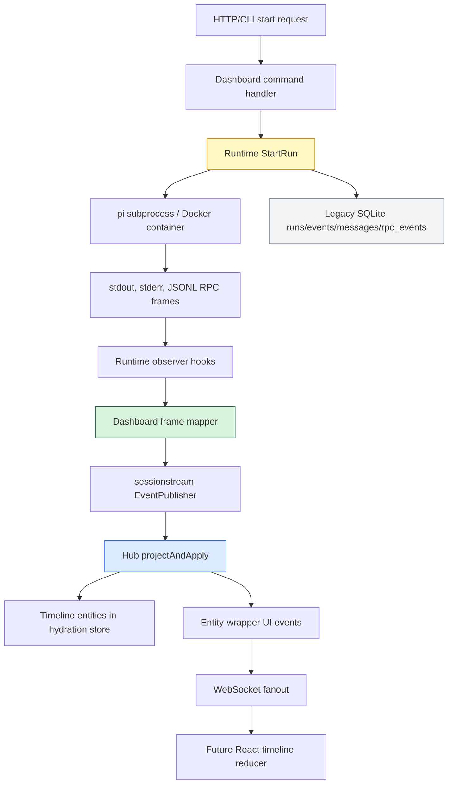
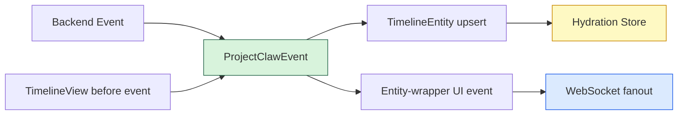
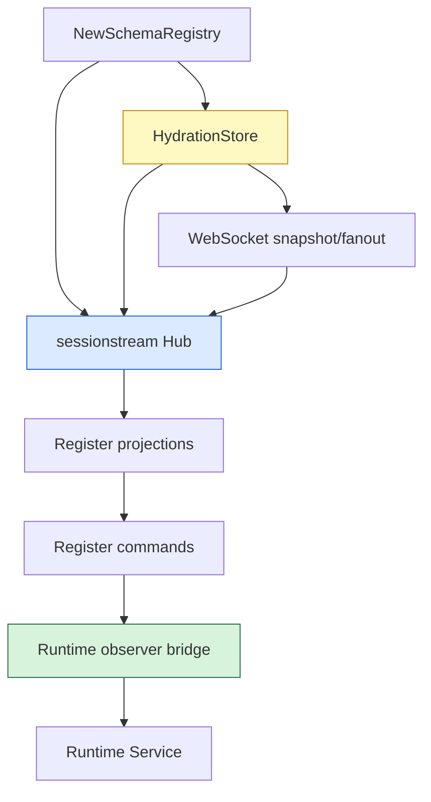
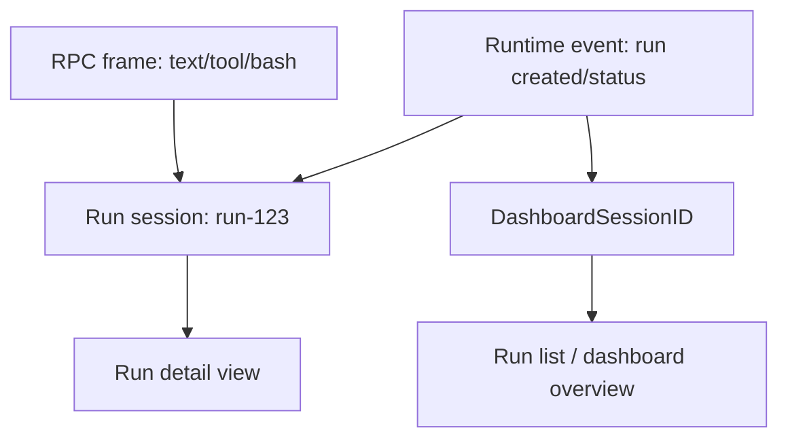
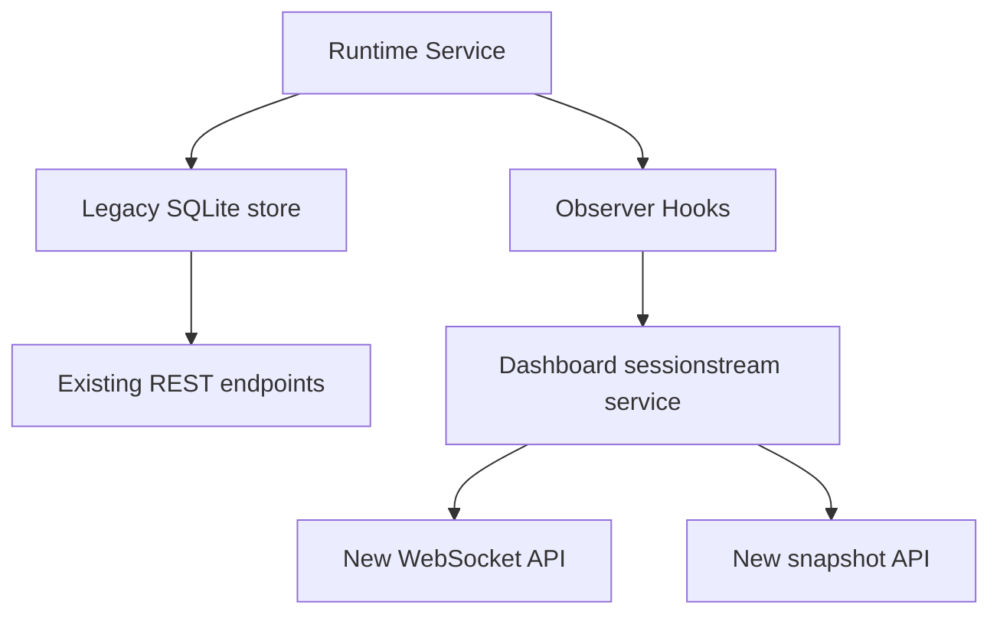

# Streaming Agent Dashboard: Server-Side Implementation Deep Dive

This report explains the server-side implementation of the streaming agent dashboard in `go-go-claw`. It is written as a living technical article: the current version covers the backend foundations through the dashboard service and sessionstream Hub wiring, and it is intended to be amended as HTTP routes, CLI wiring, and the frontend arrive.

The immediate project lives in `/home/manuel/workspaces/2026-05-12/pi-agent-dashboard/2026-04-28--go-go-claw`. The design and implementation diary live under the docmgr ticket `CLAW-STREAMING-DASHBOARD`, at `ttmp/2026/05/12/CLAW-STREAMING-DASHBOARD--streaming-agent-dashboard-with-sessionstream-protobuf-react-rtk-storybook`. The branch currently contains the backend foundation commits from protobuf schema generation through dashboard service wiring.

> [!summary]
> - The central design move is to treat an agent run as a sessionstream session: `run_id == sessionstream.SessionId`.
> - The central implementation move is to keep the legacy SQLite run store while adding typed sessionstream events through runtime observer hooks.
> - The central correctness move is to derive timeline entities and WebSocket UI events from one shared projector, so snapshots and live updates speak the same entity language.

## Why this project exists

The existing `claw-agent-runtime` already knows how to start a pi coding agent, pass it a prompt, and persist what happened. Its first dashboard is intentionally simple: a Go HTTP server exposes REST endpoints, embeds a small HTML page, and the browser polls every second for new rows in SQLite. That model is good enough to prove that the runtime works. It is not good enough for a dashboard whose purpose is to watch an agent think, stream text, execute tools, and finish.

Polling has two problems. The first is latency: the browser sees the world in one-second chunks, while the pi agent emits frames as soon as work happens. The second is semantic drift: the current store records rows such as `rpc_event`, `message`, and `process_stderr`, but the UI has to infer what those rows mean. A dashboard should not reconstruct tool lifecycle state by guessing at raw JSON. It should receive typed events and render typed entities.

The server-side implementation therefore introduces a streaming substrate without throwing away the working runtime. The old store remains. The old `/v1/runs` style world can continue to exist. The new dashboard path listens to the same runtime activity, maps it into protobuf messages, projects those messages into durable timeline entities, and fans out entity-wrapper UI events over WebSocket.

The design is conservative in a useful way. It does not ask the runtime to become sessionstream all at once. It puts a seam between the runtime and the dashboard, then builds the streaming model on the far side of that seam.

## The core mental model

The easiest way to understand the backend is to separate three ideas that are easy to blur together:

1. **The runtime performs work.** It starts pi, writes legacy SQLite rows, reads stdout/stderr, receives pi RPC frames, and updates run status.
2. **The dashboard observes work.** It receives runtime callbacks, maps them into typed dashboard events, and publishes those events into sessionstream.
3. **sessionstream materializes work.** It assigns ordinals, runs projections, stores timeline entities, and sends UI events to subscribed WebSocket clients.

The runtime should not know about React. The runtime should not know what a tool card is. The runtime should not know how the browser stores entities. Its job is to run the agent and report what happened. The dashboard adapter translates those reports into the vocabulary that the streaming UI will consume.



The important arrow in this diagram is not the WebSocket arrow. It is the observer arrow. That is the boundary that lets the project add streaming behavior without breaking existing behavior. Once the runtime emits observer callbacks, the dashboard can evolve independently: it can change frame mapping, projection rules, storage, and WebSocket behavior without rewriting how pi is started.

## What was implemented so far

The backend foundation was built in six phases. Each phase landed as a separate commit and each phase left the tree testable.

| Phase | Commit | What landed |
|---|---|---|
| Design baseline | `3ecaafd` | The docmgr ticket, V2 design, backend-only task plan, and implementation diary. |
| Phase 1 | `7f4d557` | Protobuf schema, buf config, and generated Go protobuf code. |
| Phase 2 | `1eaaaac` | Dashboard name constants, schema registration, and schema registry tests. |
| Phase 3 | `1187cc0` | Shared projector, UI/timeline projection adapters, and parity tests. |
| Phase 4 | `d4272d6` | Pi RPC frame mapper and immediate coalescing seam. |
| Phase 5 | `248bbb6` | Runtime observer hooks while preserving legacy SQLite writes. |
| Phase 6 | `b896aec` | Dashboard service, Hub wiring, command handlers, and runtime observer bridge. |

The code is not yet a complete product. HTTP integration is next. But the backend substrate now has the important pieces: a typed schema, a registry, a projector, a frame mapper, runtime hooks, and a service that wires those pieces together.

## The protobuf contract: naming the things that happen

Streaming systems become easier to reason about when the events have names that reflect real lifecycle boundaries. The schema lives at `proto/claw/dashboard/v1/dashboard.proto`, and the generated Go code lives at `internal/pb/proto/claw/dashboard/v1/dashboard.pb.go`.

The schema separates commands, backend events, timeline entities, and UI events.

Commands are requests entering the system:

```protobuf
message StartRunCommand {
  string run_id = 1;
  string input_db_path = 2;
  string output_db_path = 3;
  string agent_image = 4;
  string prompt = 5;
  string session_path = 6;
  string pi_home_path = 7;
  bool pi_home_read_only = 8;
  bool no_docker = 9;
  string pi_mode = 10;
}
```

The `run_id` field is deliberate. The dashboard invariant is that `run_id` and `sessionstream.SessionId` are the same string. This removes a class of bookkeeping bugs. If a browser, server, store, and WebSocket all refer to the run by the same id, there is no hidden mapping table to synchronize.

Backend events describe things that happened. They include run lifecycle events such as `ClawRunCreated` and `ClawRunStatusChanged`, agent lifecycle events such as `ClawAgentStarted` and `ClawAgentEnded`, stream events such as `ClawAgentTextDelta`, tool events, bash events, process output, and `ClawRawFrameEvent` as a protocol-evolution escape hatch.

Timeline entities describe current materialized state:

- `ClawRunEntity` is the current status and metadata for a run.
- `ClawMessageEntity` is an assistant/user/tool message as displayed in the timeline.
- `ClawThinkingEntity` captures reasoning or thinking content separately from answer text.
- `ClawToolExecutionEntity` captures tool lifecycle state.
- `ClawBashExecutionEntity` gives bash commands first-class dashboard representation.
- `ClawRawFrameEntity` preserves frames that are not yet modeled.

UI events wrap entities rather than describing deltas. This is one of the most important design choices in the implementation.

```protobuf
message ClawMessageUpsert {
  ClawMessageEntity message = 1;
}

message ClawToolExecutionUpsert {
  ClawToolExecutionEntity tool_execution = 1;
}
```

Why wrap entities instead of sending text deltas to the browser? Because snapshots and live updates should reduce through the same frontend path. If the WebSocket sends a complete `ClawMessageEntity`, the frontend can use one operation: upsert entity by kind and id. It does not need separate logic for “snapshot entity,” “text delta,” “tool update,” and “finish patch.” The backend owns accumulation. The frontend owns rendering.

## Schema registration: making types executable

A protobuf file by itself is not enough. sessionstream needs to know which logical event name corresponds to which protobuf message type. That registry is built in `internal/dashboard/schema.go`, with names centralized in `internal/dashboard/names.go`.

The constants file looks mundane, but it is important. Without it, names such as `ClawMessageUpsert` and `ClawToolExecutionStarted` would appear as string literals across handlers, projectors, and tests. A typo would compile and fail at runtime. Centralized names make the protocol reviewable.

The registry code registers four categories:

- commands via `RegisterCommand`,
- backend events via `RegisterEvent`,
- UI events via `RegisterUIEvent`,
- timeline entities via `RegisterTimelineEntity`.

The test file `internal/dashboard/schema_test.go` verifies that every registered name can be looked up, that command JSON decoding works, that proto JSON marshaling works, and that registry lookups return clones.

This is a small phase, but it changes the system from “we have structs” to “the framework can validate and route typed payloads.”

## The projector: one event, two consequences

The projector is the heart of the server-side design. It lives in `internal/dashboard/projector.go` and answers this question: given one backend event and the current timeline view, what should change?

sessionstream has two projection concepts:

- A **timeline projection** produces durable `TimelineEntity` values that are applied to the hydration store.
- A **UI projection** produces `UIEvent` values that are sent over WebSocket.

It would be tempting to implement those as two separate switch statements. That would be a mistake. The Hub computes both projections before applying timeline changes to the store. If the two switches drift, the store might persist one entity while the browser receives a different version of that entity.

The implementation avoids that by using one shared helper:

```go
type ProjectedUpsert struct {
    Entity  sessionstream.TimelineEntity
    UIEvent sessionstream.UIEvent
}

func ProjectClawEvent(
    ctx context.Context,
    ev sessionstream.Event,
    view sessionstream.TimelineView,
    now time.Time,
) ([]ProjectedUpsert, error) {
    // inspect ev.Payload,
    // merge with current entity from view,
    // return entity plus matching UI upsert
}
```

The adapters are intentionally boring. The timeline adapter extracts `Entity` fields. The UI adapter extracts `UIEvent` fields. The real logic lives in one place.



Text streaming shows why this matters. A `ClawAgentTextDelta` can carry either a small chunk or an authoritative accumulated text field. The projector reads the current message entity from the view, then either appends the chunk or replaces the text with the accumulated value. The output is a complete `ClawMessageEntity`. The store and browser receive the same materialized message.

Tool output uses the same pattern. Thinking content uses the same pattern. Run status changes use the same pattern. This is the design rule: the backend events are the log; the projector turns the log into state.

The tests in `internal/dashboard/projector_test.go` encode that rule. The helper `assertEntityAndUIParity` checks that every UI upsert wraps the same protobuf entity that the timeline projection will persist. This test is more valuable than it looks. It protects the implementation against the natural tendency to “just add a quick UI patch” later.

## Mapping pi RPC frames to dashboard events

The pi RPC client emits `pirpc.Frame` values. A frame has a type, maybe an id, maybe a command name, and always the raw JSON. The dashboard cannot render `pirpc.Frame` directly; it needs domain events. The mapper in `internal/dashboard/frame_mapper.go` is the adapter.

Its job is not to perfectly understand every possible pi frame forever. Its job is to interpret the frames we care about and preserve the rest.

```go
func MapRPCFrame(
    runID string,
    frame pirpc.Frame,
    opts FrameMapOptions,
) ([]sessionstream.Event, error)
```

The mapper handles the obvious lifecycle frames:

| pi frame | dashboard event |
|---|---|
| `agent_start` | `ClawAgentStarted` |
| `agent_end` | `ClawAgentEnded` and `ClawRunStatusChanged` |
| `message_start` | initial `ClawAgentTextDelta` |
| `message_update` | text, thinking, bash, or raw fallback |
| `message_end` | `ClawAgentTextFinished` / `ClawAgentThinkingFinished` |
| `tool_execution_start` | `ClawToolExecutionStarted` |
| `tool_execution_update` | `ClawToolExecutionUpdate` |
| `tool_execution_end` | `ClawToolExecutionFinished` |
| unknown frame | `ClawRawFrameEvent` |

The most interesting case is `message_update`. Its content can be a plain string, or it can be an array of blocks. Blocks may be text blocks, thinking blocks, tool-call-like blocks, or shapes not yet known. The implementation parses both forms.

In pseudocode, the mapper does this:

```go
if content is string:
    emit ClawAgentTextDelta(chunk = content)

if content is block array:
    for each block:
        if type == "text": emit ClawAgentTextDelta
        if type == "thinking": emit ClawAgentThinkingDelta
        if type == "bashExecution": emit ClawBashExecution

if nothing matched:
    emit ClawRawFrameEvent
```

The raw-frame fallback is essential. The pi protocol is a living boundary. If a future pi version emits `compaction_progress` or `extension_widget_update`, the dashboard should not silently drop it. It should preserve the raw frame so an operator or developer can inspect it and decide whether to add a typed event later.

There is also an explicit coalescing seam:

```go
type DeltaCoalescer interface {
    MapFrame(runID string, frame pirpc.Frame) ([]sessionstream.Event, error)
    Flush(runID string) ([]sessionstream.Event, error)
}
```

The current implementation uses `ImmediateCoalescer`, which maps each frame immediately. That is intentionally simple. The important thing is that runtime wiring will depend on an interface. If token streams become too noisy, the system can insert a timed accumulator that flushes every 33–100ms without rewriting the rest of the dashboard.

## Runtime observer hooks: adding streaming without breaking polling

The runtime implementation existed before the streaming dashboard. It opens the output SQLite database, inserts a run row, starts pi, reads stdout/stderr or RPC frames, and writes legacy rows. The dashboard needed to observe that process without taking it over.

That seam is `internal/runtime/observer.go`.

```go
type Observer interface {
    RunCreated(ctx context.Context, run store.Run)
    RunStatusChanged(ctx context.Context, runID string, status string, errMsg string, finished bool)
    ProcessOutput(ctx context.Context, runID string, source string, line string)
    RPCFrame(ctx context.Context, runID string, frame pirpc.Frame)
}
```

The runtime calls these hooks at the same points where it already updates the old store. That gives us dual-write behavior:

- The old tables `runs`, `events`, `messages`, and `rpc_events` continue to be written.
- The observer can publish typed sessionstream events for the new dashboard.

This is not glamorous code, but it is the correct migration move. It lets us keep the existing REST endpoints working while the streaming path grows next to them.

The implementation also recovers from observer panics. It does not yet make observers asynchronous or enforce a timeout, so observer implementations must return quickly. That is a known design constraint. The dashboard observer should publish quickly or enqueue internally if it becomes expensive.

One small but important runtime change was adding `RunID` to `runtime.StartRequest`. Previously the runtime always generated its own run id. That would break the invariant `run_id == sessionstream.SessionId`, because the dashboard would submit a command under one session id and the runtime would create a different run id. The optional `RunID` field lets the dashboard choose the id at the API boundary.

## Dashboard service: assembling the backend

The service in `internal/dashboard/service.go` is the first place where all the pieces come together.

It owns:

- a `runtime.Service`,
- a populated `sessionstream.SchemaRegistry`,
- a sessionstream `HydrationStore`,
- a WebSocket transport server,
- a sessionstream `Hub`,
- a runtime observer bridge.

The constructor does the assembly in a stable order:

1. Build and populate the schema registry.
2. Apply service options such as runtime or SQLite store configuration.
3. Create a default in-memory sessionstream SQLite store if no store is supplied.
4. Create the WebSocket server with the store as snapshot provider.
5. Create the Hub with schema, store, and UI fanout.
6. Register UI and timeline projection adapters.
7. Register command handlers.
8. Install the runtime observer bridge.



The command handler for `start_run` is the main command path. It validates that the command payload is a `StartRunCommand`, derives or validates the run id, enforces that `run_id` matches the session id, registers the publisher with the runtime observer, and then calls `runtime.StartRun`.

```go
func (s *Service) handleStartRun(
    ctx context.Context,
    cmd sessionstream.Command,
    _ *sessionstream.Session,
    pub sessionstream.EventPublisher,
) error {
    payload := cmd.Payload.(*dashboardv1.StartRunCommand)
    runID := payload.GetRunId()

    if runID == "" {
        runID = string(cmd.SessionId)
    }
    if cmd.SessionId != sessionstream.SessionId(runID) {
        return fmt.Errorf("run_id/session mismatch")
    }

    s.obs.register(runID, pub, payload)
    _, err := s.runtime.StartRun(ctx, runtime.StartRequest{RunID: runID, ...})
    return err
}
```

The observer bridge is the asynchronous half of that command. The command receives an `EventPublisher` while handling `Hub.Submit`; runtime events arrive later from goroutines. The bridge stores the publisher by run id and uses it when the runtime reports lifecycle changes or RPC frames.

This is a subtle design point. The command handler starts the long-running work, but it does not produce the whole stream itself. It registers a publication path, starts the runtime, and returns. The stream continues through observer callbacks.

## The hybrid session model

The V2 design uses two kinds of sessions:

- A **run session** whose id is the run id. This session receives high-volume run detail: text, thinking, tools, bash output, process output, raw frames, and final status.
- A **dashboard session** whose id is `DashboardSessionID`. This session receives aggregate updates that a run list or overview page needs.

The runtime observer publishes run creation and status changes to both places. It publishes high-volume stream detail only to the run session. This division matters because dashboard overview pages should not subscribe to every token from every run just to know that a run changed from `running` to `completed`.



The model is intentionally hybrid rather than purely global. A single global session would be easy to connect to, but it would become noisy and hard to replay. A session per run is precise, but it does not help the browser discover new runs. The hybrid model gives the UI both views.

## Unsupported controls are explicit

The command registry already exposes names for `start_run`, `stop_run`, `abort_run`, and `get_run_state`. Only `start_run` is implemented. The others return explicit errors:

```go
return fmt.Errorf("dashboard command %q is not supported by current runtime", name)
```

This is not a missing polish item; it is a correctness choice. The current runtime does not yet keep a live process registry with cancellation handles. Pretending to support stop or abort would create a dangerous UI: the browser would believe that a run can be stopped, while the server would not actually own the subprocess lifecycle needed to enforce that promise.

The honest backend contract is better. A future phase can add a runtime registry, associate each run with a cancel function or process handle, and then implement `stop_run` and `abort_run` for real. Until then, the API should fail loudly.

## How this preserves legacy behavior

The migration rule for this backend is: do not break the old dashboard while building the new one.

That rule appears in several design decisions:

- Runtime observer hooks are additive. They do not replace legacy SQLite writes.
- The runtime still inserts `runs`, `events`, `messages`, and `rpc_events` rows.
- The new dashboard code lives under `internal/dashboard`, not inside `internal/sessionstream` or the old store package.
- The server integration phase will mount new `/api/dashboard/...` endpoints next to existing `/v1/runs...` endpoints.

The old and new paths can be drawn as two consumers of the same runtime facts:



This shape lets a developer validate the new stream by comparing it with the old tables. If a run appears in SQLite but not in sessionstream, the observer bridge is suspect. If a frame appears in `rpc_events` but becomes a raw frame in the dashboard, the mapper needs a new typed case. If a typed event appears but the UI entity is wrong, the projector is the place to inspect.

## Testing strategy so far

The backend has been built with small, local tests at each seam.

| Test file | What it protects |
|---|---|
| `internal/dashboard/schema_test.go` | Schema registration, lookup, command decoding, and proto JSON behavior. |
| `internal/dashboard/projector_test.go` | Projection semantics and UI/timeline parity. |
| `internal/dashboard/frame_mapper_test.go` | Mapping of pi RPC frames to dashboard events, including raw fallback. |
| `internal/runtime/observer_test.go` | Runtime observer delivery and panic recovery. |
| `internal/dashboard/service_test.go` | Service construction, command handling, snapshots, and unsupported control behavior. |

The repeated validation command has been `go test ./...`. The docmgr ticket has also been checked with:

```bash
docmgr doctor --ticket CLAW-STREAMING-DASHBOARD --stale-after 30
```

The tests are intentionally not only end-to-end. End-to-end tests are useful, but the risky parts of this system are seams: schema names, projector parity, frame interpretation, observer behavior, and Hub wiring. Those seams need direct tests because they are where future changes will accidentally drift.

## A guided walk through one run

Imagine a browser asks the future API server to start a run. The HTTP handler will build a `StartRunCommand` and submit it to the dashboard service. The important server-side path is already implemented even before the HTTP route exists.

1. The API chooses or receives a run id.
2. The dashboard submits `CommandStartRun` to the Hub under `SessionId(runID)`.
3. The Hub decodes and dispatches the command to `handleStartRun`.
4. `handleStartRun` verifies `run_id == session_id`.
5. The handler registers the sessionstream publisher with the runtime observer.
6. The handler calls `runtime.StartRun` with `RunID: runID`.
7. The runtime creates the legacy run row and calls `RunCreated` on the observer.
8. The observer publishes `ClawRunCreated` to both the run session and `DashboardSessionID`.
9. The Hub projects that event into a `ClawRunEntity` and `ClawRunUpsert`.
10. As pi emits RPC frames, the runtime writes legacy rows and calls `RPCFrame`.
11. The dashboard mapper converts frames into text/tool/bash/thinking/raw events.
12. The projector turns those events into current entities.
13. The WebSocket fanout sends entity-wrapper UI events to subscribers.
14. The hydration store can later serve a snapshot for reconnect or initial load.

This path explains why the publisher registration happens before `StartRun`. If the runtime reports `RunCreated` immediately, the observer must already know where to publish it.

## Design tradeoffs

### Why sessionstream instead of ad hoc WebSockets?

An ad hoc WebSocket endpoint could send JSON messages quickly. It would also force this project to reinvent schema registration, command dispatch, projection, snapshotting, and hydration. sessionstream already has these concepts. The dashboard needs exactly those concepts because it is not merely a terminal log; it is a materialized interactive timeline.

The cost is that the backend must be more disciplined. Events need names. Protobuf payloads need registration. Projection semantics must be explicit. That cost is desirable because it turns implicit UI assumptions into server-side protocol.

### Why protobuf?

The dashboard crosses language and package boundaries. Go produces events. TypeScript will consume them. Protobuf gives the protocol stable field numbers, generated Go types, and a future path to generated TypeScript types. It also discourages the “just put a map in JSON” habit that makes streaming protocols hard to evolve.

The implementation still preserves raw frames as protobuf messages. Strong typing does not mean pretending every future frame is known today.

### Why entity-wrapper UI events?

A streaming UI can be built as a pile of deltas: append this token, mark that tool finished, update that status string. That is efficient but brittle. It requires the browser to replay every patch in exactly the right order and to duplicate accumulation logic that the backend already understands.

Entity-wrapper events take the opposite tradeoff. They send the current materialized entity. The message may contain the full text-so-far. The tool entity may contain its current status and accumulated output. The run entity may contain the current status. The browser upserts entities.

This is easier to reason about, easier to snapshot, and easier to test. If bandwidth becomes a problem, coalescing can reduce frequency without changing the semantic model.

### Why keep raw frame fallback?

A dashboard for an agent runtime is also a debugging instrument. Dropping unknown frames would make the dashboard look cleaner but less useful. A raw fallback means the system can expose novel protocol events before a developer has written a first-class card for them.

Raw events are not a failure. They are a staging area for protocol discovery.

## Known limitations

This report should not imply that the backend is finished. The main limitations are known and deliberate.

- HTTP/WebSocket API integration is still pending. `internal/api/server.go` needs to mount dashboard routes.
- Real stop/abort/get-state controls are blocked by missing runtime live-run state and cancellation handles.
- Strict replay from `sinceOrdinal` is not implemented as a transport guarantee; current reconnect behavior relies on sessionstream snapshots.
- The runtime observer callbacks are synchronous. Heavy future observers should enqueue work rather than block runtime progress.
- The frontend reducer, RTK Query integration, Storybook stories, and React dashboard components are intentionally deferred.

## What Phase 7 should add

The next backend phase is API integration. It should wire the dashboard service into the existing server without breaking legacy endpoints.

The likely new endpoints are:

| Method | Path | Purpose |
|---|---|---|
| `POST` | `/api/dashboard/sessions` | Start a run session by submitting `StartRunCommand`. |
| `GET` | `/api/dashboard/sessions/{sessionId}` | Return a snapshot for a run session. |
| `POST` | `/api/dashboard/sessions/{sessionId}/stop` | Return explicit unsupported error until runtime stop exists. |
| `POST` | `/api/dashboard/sessions/{sessionId}/abort` | Return explicit unsupported error until runtime abort exists. |
| `GET` | `/api/dashboard/ws` | Upgrade to the sessionstream WebSocket transport. |

The server should also keep these legacy routes working:

- `/v1/runs`
- `/v1/runs/{id}`
- `/v1/runs/{id}/events`
- `/v1/runs/{id}/messages`
- `/v1/runs/{id}/rpc-events`

The implementation checklist for that phase is short but important:

1. Add an optional `*dashboard.Service` field to the API server.
2. Initialize the dashboard service from command/root serve setup.
3. Mount the WebSocket handler.
4. Translate HTTP JSON requests into protobuf command payloads.
5. Return snapshots using the hydration store.
6. Add tests that prove new dashboard endpoints and old REST endpoints coexist.
7. Update the docmgr diary, tasks, and changelog.
8. Commit Phase 7 as a focused change.

## Appendix: files to read next

For future amendments, these are the most useful files to inspect first:

| File | Why it matters |
|---|---|
| `proto/claw/dashboard/v1/dashboard.proto` | The protocol contract. |
| `internal/dashboard/names.go` | Canonical command, event, UI event, and entity names. |
| `internal/dashboard/schema.go` | sessionstream registration. |
| `internal/dashboard/projector.go` | The shared event-to-entity projector. |
| `internal/dashboard/projections.go` | Thin sessionstream adapters around the projector. |
| `internal/dashboard/frame_mapper.go` | pi RPC frame interpretation. |
| `internal/runtime/observer.go` | Runtime observation seam. |
| `internal/runtime/runtime.go` | Where observer hooks are called. |
| `internal/dashboard/service.go` | Dashboard service assembly and Hub wiring. |
| `internal/dashboard/commands.go` | Command handling and `start_run` behavior. |
| `internal/dashboard/observer.go` | Runtime observer bridge into sessionstream publishers. |
| `internal/api/server.go` | Next integration target. |

## Amendment log

### 2026-05-12

Initial article created after Phase 6. It documents the server-side architecture through protobuf schema generation, schema registration, projector design, pi RPC mapping, runtime observer hooks, and dashboard service wiring. HTTP/WebSocket API integration remains the next backend phase.
