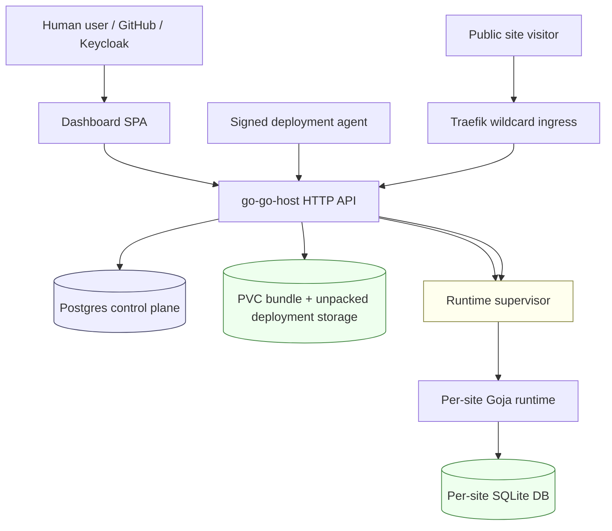

# go-go-host Beta Bringup — From Local MVP to Public Hosted Runtime

This report explains how `go-go-host` moved from a local Goja hosting prototype into a working public beta deployment. It is written as a technical deep dive rather than a changelog. The goal is to teach the system: what pieces had to exist, why they were necessary, how they interact, what failed along the way, and what the next engineer should understand before changing it.

> [!summary]
> We brought up `go-go-host` as a public beta at `https://hosting.yolo.scapegoat.dev`, backed by Keycloak OIDC, Argo CD, Vault Secrets Operator, Postgres, Traefik, cert-manager wildcard TLS, and a Goja runtime supervisor. The beta now serves a real demo app at `https://hello.hosting.yolo.scapegoat.dev`, supports browser OIDC and access-token API auth, restores active runtimes on daemon restart, and has both human and signed-agent deployment smoke paths.

## The shortest version

The system now works end to end:

```text
GitHub / Keycloak login
  -> dashboard at hosting.yolo.scapegoat.dev/app
  -> create org/site
  -> upload Goja bundle
  -> validate and activate deployment
  -> generated site host hello.hosting.yolo.scapegoat.dev
  -> Traefik wildcard ingress and TLS
  -> go-go-host runtime supervisor
  -> Goja app serving HTML, JSON, assets, and SQLite-backed state
```

The live demo app is:

```text
https://hello.hosting.yolo.scapegoat.dev/
```

Its source is now preserved in:

```text
/home/manuel/workspaces/2026-05-11/go-go-host-v1/go-go-host/examples/hello-beta
```

The repeatable public smoke is:

```bash
scripts/beta-smoke.sh
```

The repeatable authenticated signed-agent smoke is:

```bash
GO_GO_HOST_BETA_BEARER_TOKEN='<access-token>' scripts/beta-agent-smoke.sh
```

The live image after this bringup is:

```text
ghcr.io/go-go-golems/go-go-host:sha-6911d87
```

The app branch continues beyond that with documentation/smoke-script commits. The live image includes the root redirect, access-token support, startup runtime restoration, and agent bundle-path semantics.

## Why this project exists

`go-go-host` is a small hosting platform for JavaScript applications running inside Go. A user uploads a bundle containing a manifest, scripts, and optional assets. The platform validates the bundle, stores it as an immutable deployment, and activates it for a site. A Goja runtime then executes the JavaScript app inside a host-mediated environment.

The important idea is that a hosted app does not own the HTTP server, the database file, or the deployment lifecycle. The platform owns those. The app registers routes and asks for capabilities. The host decides what is allowed.

A minimal bundle looks like this:

```text
hello-beta/
├── go-go-host.json
├── scripts/
│   └── app.js
└── assets/
    └── style.css
```

The manifest says where the script and assets live:

```json
{
  "name": "hello-beta",
  "scriptsDir": "scripts",
  "assetsDir": "assets",
  "entrypoint": "app.js",
  "smokePath": "/",
  "capabilities": ["express", "ui.dsl", "database", "assets"],
  "channel": "default"
}
```

The host validates this bundle before it can serve traffic. That validation step is not cosmetic. It is the boundary between "someone uploaded a tarball" and "this is a deployment the runtime may load." It checks archive paths, manifest paths, bundle size, requested capabilities, channel consistency, and a dry-run runtime smoke path.

## The mental model

It is easiest to understand `go-go-host` as four systems stacked on top of each other.



The layers have different jobs:

| Layer | Responsibility | Example files |
|---|---|---|
| Identity | Prove who the human user is | Keycloak realm `go-go-host`, `internal/httpapi/oidc.go` |
| Control plane | Store users, orgs, sites, deployments, agents, grants, audit | `internal/store`, sqlc queries, Postgres |
| Runtime plane | Load active deployments and route requests by host | `internal/runtime`, `internal/control/deployments.go` |
| Delivery plane | Put the service on the public internet | K3s GitOps, Traefik, cert-manager, DNS, Vault |

The useful design rule is: **Keycloak authenticates humans; go-go-host authorizes application actions.** Keycloak can say "this is Manuel" and can carry a coarse role such as `go-go-host-admin`. It does not decide which site an agent may deploy to, which bundle path a CI runner may use, or whether a deployment can activate traffic. Those decisions live in go-go-host's own database.

## The deployment target

The beta runs in the Hetzner K3s cluster managed by:

```text
/home/manuel/code/wesen/2026-03-27--hetzner-k3s
```

Identity and DNS live in:

```text
/home/manuel/code/wesen/terraform
```

The app source lives in:

```text
/home/manuel/workspaces/2026-05-11/go-go-host-v1/go-go-host
```

The public control-plane host is:

```text
https://hosting.yolo.scapegoat.dev
```

The public demo site host is:

```text
https://hello.hosting.yolo.scapegoat.dev
```

The Keycloak issuer is:

```text
https://auth.yolo.scapegoat.dev/realms/go-go-host
```

## What had to be built first: real browser auth

The first production-readiness gap was authentication. A local dev-auth header is good for backend iteration, but it is not a beta login system. A beta user should go through the same browser OIDC path locally and in staging.

The local and beta auth shape became:

```text
Browser
  -> go-go-host dashboard
  -> Keycloak Authorization Code + PKCE
  -> token response with id_token and access_token
  -> dashboard calls API with bearer access token
  -> backend validates token locally through OIDC/JWKS
  -> backend maps (issuer, subject) to local user
  -> backend bootstraps platform admin by subject/email/role when configured
```

The browser implementation stores both ID and access tokens. The access token is what APIs should receive. During bringup we discovered the frontend originally sent the ID token and the backend verified every bearer token as if it were an ID token. That worked for the dashboard but failed for future CLI/API semantics.

The failure was concrete:

```text
verify id token: oidc: expected audience "go-go-host-dashboard" got []
```

The Keycloak access token carried `azp: go-go-host-dashboard`, but did not carry the dashboard client in `aud`. The fix was not to stop validating tokens. The fix was to keep issuer, signature, and expiry validation through the OIDC provider, then perform a local client binding check using either `aud` or `azp`.

The resulting rule is:

```pseudocode
token = Authorization bearer token
verified = provider.verify_signature_issuer_expiry(token)
claims = decode(verified)

if clientID not in verified.audience
   and clientID not in claims.aud
   and clientID != claims.azp:
    reject

user = upsert_user(issuer, verified.subject, claims.email, display_name)
if claims match platform-admin bootstrap config:
    ensure_platform_admin(user)
```

This matters because the next step — CLI OAuth Device Flow — will produce access tokens, not browser ID tokens.

## Keycloak and GitHub login

The Keycloak realm is `go-go-host`. It has a public browser client:

```text
go-go-host-dashboard
```

and the platform-admin role:

```text
go-go-host-admin
```

GitHub was added as a Keycloak identity provider. That does not change how go-go-host sees authentication. go-go-host still sees only Keycloak-issued tokens. A GitHub login becomes platform admin if Keycloak emits one of the configured admin signals:

```yaml
platformAdminOIDCRoles:
  - go-go-host-admin
platformAdminEmails:
  - wesen@ruinwesen.com
```

The important separation is:

```text
GitHub proves identity to Keycloak.
Keycloak issues a token.
go-go-host maps token claims to local users and permissions.
```

This is the right shape because go-go-host remains independent of GitHub-specific APIs. GitHub can be replaced, linked, or supplemented without changing the application authorization model.

## Building the first beta image

The first cluster deployment needed an image. That exposed a mundane but important rule: the container build environment must match `go.mod`.

The Dockerfile originally used Go 1.24:

```dockerfile
FROM golang:1.24-bookworm AS build
```

but the module declared:

```text
go 1.26.1
```

The Docker build failed with:

```text
go: go.mod requires go >= 1.26.1 (running go 1.24.13; GOTOOLCHAIN=local)
```

The fix was to move the build image to:

```dockerfile
FROM golang:1.26-bookworm AS build
```

The first beta image was then built and pushed as:

```text
ghcr.io/go-go-golems/go-go-host:sha-4187ea3
```

Later images were built as implementation continued:

```text
ghcr.io/go-go-golems/go-go-host:sha-23b66ec  # access-token support
ghcr.io/go-go-golems/go-go-host:sha-f137ff9  # startup runtime restore
ghcr.io/go-go-golems/go-go-host:sha-0b70bdd  # agent bundle-path semantics
ghcr.io/go-go-golems/go-go-host:sha-6911d87  # dashboard-root redirect
```

The GHCR package was private, so the K3s deployment needed a Vault-backed image pull secret rather than assuming anonymous pulls.

## GitOps deployment shape

The K3s repo gained an Argo CD application:

```text
gitops/applications/go-go-host.yaml
```

and a Kustomize package:

```text
gitops/kustomize/go-go-host/
```

The package contains the usual production surface:

```text
namespace
service accounts
VaultConnection / VaultAuth / VaultStaticSecret
Postgres bootstrap job
ConfigMap with daemon config
PVC for runtime/bundle/site data
Deployment
Service
Ingress
Certificate
```

The control-plane database is Postgres. Runtime bundles and per-site SQLite DBs live on the namespace PVC. Runtime secrets, including the Postgres DSN and the private GHCR image pull secret, come from Vault through Vault Secrets Operator.

The daemon config uses environment expansion:

```yaml
controlDbDsn: "${GO_GO_HOST_CONTROL_DB_DSN}"
```

This small app change matters. It lets Git store the shape of the config while Vault provides the secret value at runtime.

## The first Argo failure: the PVC deadlock

The initial Argo sync appeared to be missing the Service and Ingress. The visible symptom was:

```text
Resource not found in cluster: v1/Service:go-go-host
Resource not found in cluster: networking.k8s.io/v1/Ingress:go-go-host
```

The actual cause was earlier in the sync wave sequence:

```text
waiting for healthy state of /PersistentVolumeClaim/go-go-host-data
```

The PVC was in sync wave `1`. The Deployment that would consume it was later. With K3s `local-path` storage, a PVC can remain pending until a pod is scheduled that uses it. Argo was waiting for the PVC to become healthy before creating the Deployment, but the PVC needed the Deployment to bind.

The fix was to move the PVC into the same wave as the Deployment:

```yaml
argocd.argoproj.io/sync-wave: "2"
```

This was a useful reminder: in GitOps, ordering is not just about dependency existence. It is also about controller behavior. A PVC is a declarative object, but its health may depend on a later consumer.

## The hostname correction

The initial target was `yolo.scapegoat.dev`. The correct product host became:

```text
hosting.yolo.scapegoat.dev
```

That change touched three systems:

1. K3s GitOps, because the Ingress and app config needed the new public URL.
2. Terraform Keycloak, because redirect URIs and web origins must match the browser origin exactly.
3. Terraform DNS, because generated site hosts require wildcard DNS.

The final DNS shape is:

```text
*.yolo.scapegoat.dev              -> cluster IP
*.hosting.yolo.scapegoat.dev      -> cluster IP
```

The apex `yolo.scapegoat.dev` was intentionally not left as the app host.

## Wildcard TLS and generated site hosts

The dashboard host is one thing:

```text
hosting.yolo.scapegoat.dev
```

Hosted app sites are another:

```text
<site-slug>.hosting.yolo.scapegoat.dev
```

A site with slug `hello` receives primary host:

```text
hello.hosting.yolo.scapegoat.dev
```

The code path is straightforward:

```go
host := slug
baseDomain := strings.Trim(s.baseDomain, ".")
if baseDomain != "" && baseDomain != "localhost" {
    host = slug + "." + baseDomain
}
```

The runtime supervisor then uses the request Host header to choose the active site runtime.

Wildcard DNS alone is not enough. Browsers need a valid TLS certificate for arbitrary subdomains. The existing cluster issuer was HTTP-01 only:

```yaml
solvers:
  - http01:
      ingress:
        ingressClassName: traefik
```

HTTP-01 cannot issue wildcard certificates. The cluster already had a DigitalOcean DNS token secret, so the fix was to add a DNS-01 ClusterIssuer:

```text
letsencrypt-prod-dns01-digitalocean
```

and a wildcard certificate:

```text
hosting.yolo.scapegoat.dev
*.hosting.yolo.scapegoat.dev
```

The Ingress now routes both the dashboard host and wildcard site hosts to the go-go-host service. The application decides what to do with the Host header.

This is a good example of layered responsibility:

| Layer | Job |
|---|---|
| DNS | Send wildcard names to the cluster |
| cert-manager DNS-01 | Get a wildcard certificate |
| Traefik | Terminate TLS and forward requests |
| go-go-host | Route by Host header to the active site runtime |

## The demo site

The live demo site belongs to org `beta-demo`:

```text
org_36cc42ac-d5d7-441a-809d-6fefb7e3c761
```

The site is:

```text
site_0fcba219-8bc9-412f-a0e0-41a4066c7a21
slug: hello
host: hello.hosting.yolo.scapegoat.dev
```

The demo source is:

```text
examples/hello-beta/
```

The root page uses the UI DSL and includes a real stylesheet link:

```js
return ui.page(
  { title: "go-go-host beta demo" },
  ui.link({ rel: "stylesheet", href: "/assets/style.css" }),
  ui.main(
    ui.h1("Hello from go-go-host beta"),
    ui.p("This is a live hosted Goja app served through wildcard DNS, wildcard TLS, Traefik, and go-go-host runtime routing."),
    ui.p("Host: " + (req.platform.host || "unknown")),
    ui.p("Site ID: " + (req.platform.siteId || "unknown")),
    ui.p("Deployment ID: " + (req.platform.deploymentId || "unknown"))
  )
);
```

It also exposes:

```text
/platform          JSON platform context
/db                SQLite/DB guard stats
/assets/style.css  static CSS
```

That combination is deliberate. It proves more than "a page returned 200." It proves route registration, platform context injection, UI rendering, static assets, database access, and per-site quota stats.

## The startup restoration bug

After one image rollout, the public demo site returned 404 even though the database still showed an active deployment. Health checks passed. TLS and Ingress passed. The problem was inside the process.

The runtime supervisor keeps an in-memory map:

```text
host -> active site runtime
```

Activation updates both the database and that in-memory map. A pod restart preserves the database but loses the map. Before the fix, daemon startup reconciled stale runtime status records but did not restore active deployments into the supervisor.

The result was a classic split-brain-of-state bug:

```text
Postgres: deployment is active
Supervisor memory: no runtime registered for hello.hosting.yolo.scapegoat.dev
Public request: 404
```

The fix was to restore database-active deployments on startup:

```pseudocode
on daemon startup:
    apply migrations
    mark stale runtime statuses stopped
    core = new control core with supervisor
    for each active deployment in database:
        rebuild runtime spec
        supervisor.activate(spec)
    start HTTP server
```

This is one of the most important lessons from the bringup: if activation has a persistent half and an in-memory half, restart must reconstruct the in-memory half from the persistent half.

## Human deploys and agent deploys

There are two deployment identities.

A human deploy is authenticated by an OIDC access token:

```text
human browser login -> Keycloak access token -> API upload -> deployment -> activation
```

An agent deploy is authenticated by an app-native machine identity:

```text
human creates agent + grant
  -> agent generates Ed25519 key
  -> agent enrolls with one-time token
  -> agent signs deploy-run request
  -> server validates signature, key, nonce, timestamp, grant
  -> server returns short-lived upload token
  -> agent uploads bundle
  -> server validates bundle
  -> server auto-activates if grant allows
```

The signed-agent model is intentionally not OAuth Device Flow. Device Flow is a good future fit for human CLI login. It is not the best durable identity for CI runners. Agents need first-class records, revocable keys, grants, deploy-run audit, nonces, timestamps, and scoped activation rights.

The current working rule is:

```text
Browser dashboard: OIDC Authorization Code + PKCE
Human CLI, future: OAuth Device Flow
Deploy agents: enrollment token + Ed25519 signed requests
```

## The `bundlePath` lesson

The first live agent smoke exposed a confusing policy name. The old flag was:

```bash
go-go-host-agent deploy --path bundles/site.tar.gz
```

The grant had:

```text
allowedPaths: ["bundles/**"]
```

We intended that to mean: "this agent may publish logical artifacts under `bundles/`." But the implementation also passed that policy into the archive validator. A normal bundle contains:

```text
go-go-host.json
scripts/app.js
assets/style.css
```

Those paths do not match `bundles/**`, so the upload was rejected.

The fix was conceptual and then mechanical. The concept is:

```text
--bundle       = local tar/zip file on disk
--bundle-path  = logical artifact path authorized by the agent grant
```

The API names now reflect that:

```json
{
  "allowedBundlePaths": ["bundles/**"]
}
```

and:

```json
{
  "bundlePath": "bundles/hello-beta-agent-smoke.tar.gz"
}
```

The old `allowedPaths` and `path` names are still accepted for beta compatibility. The database column remains `allowed_paths` internally, but the public model is now clear.

The live proof was a signed agent deploy with:

```text
allowedBundlePaths: ["bundles/**"]
--bundle-path bundles/hello-beta-bundlepath-smoke.tar.gz
```

It produced an active deployment and served publicly.

## Repeatable smoke tests

Two scripts now preserve the operational knowledge.

The public read-only smoke:

```bash
scripts/beta-smoke.sh
```

checks:

```text
https://hosting.yolo.scapegoat.dev/healthz
https://hosting.yolo.scapegoat.dev/readyz
https://hosting.yolo.scapegoat.dev/api/v1/config
https://hello.hosting.yolo.scapegoat.dev/
https://hello.hosting.yolo.scapegoat.dev/platform
https://hello.hosting.yolo.scapegoat.dev/db
https://hello.hosting.yolo.scapegoat.dev/assets/style.css
```

The authenticated agent smoke:

```bash
GO_GO_HOST_BETA_BEARER_TOKEN='<access-token>' scripts/beta-agent-smoke.sh
```

packages `examples/hello-beta`, creates a temporary scoped agent, enrolls it, deploys through signed credentials, verifies the public site, and revokes the agent.

The only remaining friction is token acquisition. Today we manually extract a browser access token. The right future fix is:

```bash
go-go-host login
```

using OAuth Device Flow, so scripts and CLI commands can obtain access tokens without browser-localStorage copy/paste.

## The dashboard root redirect

A small UX fix came late: visiting the dashboard host root should not look broken.

Now:

```bash
curl -I https://hosting.yolo.scapegoat.dev/
```

returns:

```text
HTTP/2 302
location: /app
```

But hosted app roots still work:

```bash
curl -I https://hello.hosting.yolo.scapegoat.dev/
```

returns:

```text
HTTP/2 200
```

The redirect must be host-aware. A blanket root redirect would steal `/` from every hosted app. The handler derives the dashboard host from `publicBaseUrl` and only redirects root requests for that host.

## Chronology of the main commits

Application repo:

```text
58cbc15 Implement Keycloak OIDC phase one
3680d62 Make OIDC smoke repeatable
083e76c Prepare beta image publishing
4187ea3 Use Go 1.26 for Docker builds
77fb614 Record wildcard TLS deployment
23b66ec Add beta smoke and OIDC access token support
f137ff9 Restore active runtimes on daemon startup
0b70bdd Implement agent bundle path semantics
6911d87 Redirect dashboard root to app
efd41f7 Add beta agent smoke script
```

K3s GitOps repo:

```text
984048e Add go-go-host beta GitOps deployment
c86389a Fix go-go-host PVC sync wave
3bf74d3 Move go-go-host beta to hosting.yolo
4d521ef Add DigitalOcean DNS01 wildcard TLS
13ac467 Deploy go-go-host startup runtime restore
035e5ef Deploy go-go-host agent bundle path semantics
647dd17 Deploy go-go-host root redirect
```

Terraform repo:

```text
5c2f61e Add go-go-host Keycloak beta realm
1a39dfb Move go-go-host beta identity to hosting.yolo
```

## What broke, and what each break taught us

| Failure | Symptom | Root cause | Lesson |
|---|---|---|---|
| Docker build failed | Go version error | Dockerfile used Go 1.24 while `go.mod` required 1.26.1 | Container toolchains must match module requirements |
| Argo missed Service/Ingress | Resources not found | PVC health blocked sync wave before Deployment could bind it | Argo sync waves must account for controller health behavior |
| Apex hostname did not resolve | `curl: Could not resolve host` | `*.yolo` wildcard did not cover `yolo.scapegoat.dev` apex | Wildcards do not cover their parent name |
| Wildcard site TLS was missing | Subdomains had DNS but not browser-valid wildcard cert | Existing cert-manager issuer was HTTP-01 only | Wildcard certs require DNS-01 |
| Access token rejected | `expected audience ... got []` | Backend verified bearer tokens as ID tokens | APIs should accept access tokens and check `aud`/`azp` correctly |
| Demo site 404 after rollout | Health OK, site root 404 | Supervisor runtime map was in memory and not restored after restart | Active runtime state must be reconstructed from persistent deployments |
| Agent `bundles/**` grant rejected normal bundle | Archive entries did not match `bundles/**` | Logical artifact path policy was reused as archive-entry allowlist | Name and enforce `bundlePath` semantics separately |
| Root redirect initially broke tests | ServeMux conflict / hosted site roots redirected | Root route was too broad | Dashboard root redirect must be host-aware |

## Current status

The beta is live:

```text
Dashboard/API: https://hosting.yolo.scapegoat.dev
Demo site:     https://hello.hosting.yolo.scapegoat.dev
```

The live cluster is healthy through Argo CD. The public demo site is actively served through wildcard DNS, wildcard TLS, Traefik, and the go-go-host runtime supervisor. The demo has been deployed through both human OIDC API upload and signed agent publishing.

The most important current files are:

```text
App repo:
  internal/httpapi/oidc.go
  internal/httpapi/agents_audit.go
  internal/httpapi/deployments.go
  internal/control/deployments.go
  cmd/go-go-hostd/main.go
  examples/hello-beta/
  scripts/beta-smoke.sh
  scripts/beta-agent-smoke.sh

K3s repo:
  gitops/kustomize/go-go-host/deployment.yaml
  gitops/kustomize/go-go-host/ingress.yaml
  gitops/kustomize/go-go-host/certificate.yaml
  gitops/kustomize/platform-cert-issuer/clusterissuer-dns01-digitalocean.yaml

Terraform repo:
  keycloak/apps/go-go-host/envs/k3s-beta/
  dns/zones/scapegoat-dev/envs/prod/main.tf
```

## What should happen next

The next obvious step is OAuth Device Flow for the human CLI. We now have access-token API semantics, and the authenticated smoke script still needs a manually supplied token. Device Flow would turn that into:

```bash
go-go-host login
go-go-host agents create ...
scripts/beta-agent-smoke.sh
```

without browser-token copy/paste.

The second step is runtime hardening. The system can serve beta traffic, but arbitrary user-uploaded JavaScript needs stricter limits:

- Goja interrupt support for infinite loops,
- per-site concurrency limits,
- stronger request body limits,
- crash-loop and restart behavior,
- security tests for denied capabilities and CPU-bound handlers.

The third step is backup and restore. The beta now has meaningful state: Postgres rows, uploaded bundles, per-site SQLite DBs, and agent/audit history. Before inviting real users, the restore path should be exercised.

The fourth step is cleanup and polish:

- add tests for startup runtime restoration,
- prune old demo deployments or keep only the latest N,
- decide how long to keep `allowedPaths` / `path` compatibility aliases,
- decide whether the DB column `allowed_paths` should be renamed to `allowed_bundle_paths`,
- hide or remove deprecated `--path` flags when the beta API stabilizes.

## The working rule

The working rule for the beta is simple:

> A user-visible hosting platform is not one feature. It is a chain. Authentication, deployment, runtime restoration, wildcard routing, TLS, signed agents, and smoke tests all have to line up. The fastest way to find the next missing piece is to deploy a real site and then automate the smoke that proves it still works.

That is what happened here. Each failure pointed to the next missing invariant. The result is not just a running service, but a clearer model of what the service must guarantee.

## Related local documentation

The implementation diaries and guides live in the app repo under:

```text
/home/manuel/workspaces/2026-05-11/go-go-host-v1/go-go-host/ttmp/2026/05/12/
```

Important tickets:

```text
HOST-006-PRODUCTION-READINESS
HOST-007-BETA-SMOKE-AUTH-CLEANUP
```

The HOST-007 guide is the most focused explanation of the auth/smoke cleanup:

```text
ttmp/2026/05/12/HOST-007-BETA-SMOKE-AUTH-CLEANUP--beta-smoke-and-oidc-access-token-cleanup/design-doc/01-beta-smoke-and-oidc-access-token-cleanup-guide.md
```
