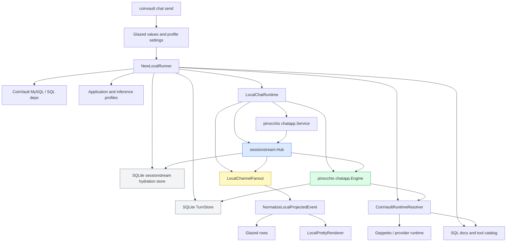
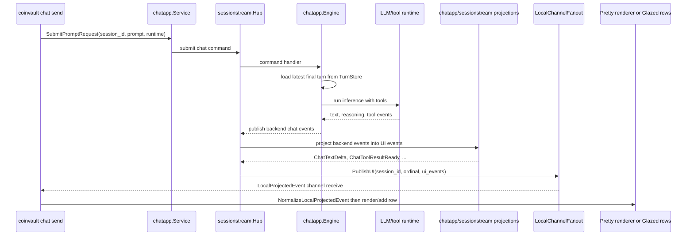

# Building a Sessionstream CLI Chat Runner: CoinVault, Pinocchio Chatapp, and Glazed

This article explains the implementation of the CoinVault CLI chat runner built under `COINVAULT-040`. The result is a `coinvault chat send` command that can start or continue a chat session, send one prompt, run a real LLM/tool loop through Pinocchio `chatapp`, stream sessionstream-projected UI events, render readable terminal output by default, and still expose structured Glazed rows for tests and scripts.

The implementation lives in `/home/manuel/workspaces/2026-05-13/coinvault-loop-analysis/2026-03-16--gec-rag`. It was built as a local in-process runner first, rather than as an HTTP/websocket client. That decision is the central design choice in the project. The command does not start an HTTP server and does not connect to `/api/chat/ws`. It builds the same backend runtime graph inside the CLI process, uses a `sessionstream.Hub`, sends the prompt through `pinocchio/pkg/chatapp.Service`, receives projected UI events through an in-process `UIFanout`, and exits when the current run emits a terminal event.

> [!summary]
> - The CLI runner is not a second chat engine. It reuses the same Pinocchio `chatapp.Engine`, CoinVault runtime resolver, tool catalog, turn store, sessionstream Hub, projections, and plugin stack as the backend chat path.
> - The key implementation seam is `sessionstream.UIFanout`. The browser path uses a websocket fanout; the CLI path uses `LocalChannelFanout`, which delivers projected UI events through a Go channel.
> - The command has two output modes. Classic mode renders terminal-agent-style text; Glazed mode emits structured rows for tests and automation.
> - Continuation works by passing the same `--session-id` and the same turns DB. The CLI does not replay history. Pinocchio `chatapp.Engine` loads the latest final turn from the configured turn store.
> - Real provider smoke tests exercised `sql_doc` and `sql_query` against the Docker MySQL database, wrote durable timeline/turn DBs, and exposed subtle streaming-output issues that were fixed in the pretty renderer.

## Why this project exists

CoinVault already had a browser chat UI. The browser path is important because it exercises the deployed HTTP routes, the websocket transport, and frontend state handling. It is not ideal for tight backend iteration. When the work being tested is an LLM loop with tools, a browser introduces extra steps that do not help answer the immediate engineering question. An engineer wants to ask: did the model call the SQL tool, did the tool run against the configured database, did the run finish, did continuation load the previous turn, and can I see the event stream without inspecting browser state?

A one-shot CLI command answers those questions directly. The target user interaction is simple:

```bash
coinvault chat send \
  --session-id coinvault-cli-e2e \
  --message "Use sql_query to count active products" \
  --show-tool-args
```

The command prints the session ID, the accepted prompt, tool lifecycle lines, streamed assistant text, and final timing. The same command can also emit Glazed rows:

```bash
coinvault chat send \
  --message "Reply with only OK" \
  --with-glaze-output \
  --output json
```

Those two modes serve different users. The human operator needs readable terminal output. The test harness needs structured rows that can be filtered, counted, and asserted. The implementation keeps both modes connected to the same event stream so they do not drift.

## The original transport question

The first design for `COINVAULT-040` described a CLI that behaves like a minimal browser client. It would create or resume a session over HTTP, subscribe to `/api/chat/ws`, submit a message, stream websocket frames, and exit on `ChatRunFinished`, `ChatRunFailed`, or `ChatRunStopped`. That design remains valid for deployed transport testing.

The implementation took a different first path: an in-process Hub runner. This was not a rejection of the websocket client. It was a sequencing decision. The no-HTTP runner gave faster feedback while still exercising the backend chat stack. It also avoided several concerns that matter for a deployed-server smoke test but not for the first local CLI:

- HTTP server lifecycle management.
- Websocket frame parsing and subscribe/hydration ordering.
- Auth cookies or bearer tokens.
- Root prefix handling.
- Network timing around fast runs that might finish before the CLI subscribes.

The important engineering requirement was that the CLI must not become a manually replayed or manually mocked chat path. It must still use the backend abstractions that own chat execution. The in-process runner satisfies that requirement because the command submits through `chatapp.Service`, runs through `chatapp.Engine`, resolves runtimes through CoinVault, persists turns through the configured `TurnStore`, stores timeline state through the sessionstream hydration store, and receives UI events after projection.

The resulting architecture has two possible transports over the same domain behavior:

| Mode | HTTP server required | Websocket required | Uses sessionstream Hub | Uses Pinocchio chatapp | Uses CoinVault tools | Best use |
|---|---:|---:|---:|---:|---:|---|
| Browser/deployed websocket | Yes | Yes | Yes | Yes | Yes | End-to-end transport and UI validation |
| Local in-process Hub runner | No | No | Yes | Yes | Yes | Fast terminal LLM/tool-loop testing |

The local path is not a replacement for the deployed path. It is a shorter path into the same runtime graph.

## The system boundaries

A useful way to understand the implementation is to name each boundary explicitly. The command crosses several layers, and each layer has a distinct responsibility.

| Layer | Main files | Responsibility |
|---|---|---|
| CLI command | `cmd/coinvault/cmds/chat_send.go`, `root.go`, `command_shape_test.go` | Parse flags, build settings, choose output mode, call the local runner. |
| Shared profile settings | `cmd/coinvault/cmds/profile_settings.go`, `serve.go` | Resolve application profile files, selected application profile, inference registry, inference profile, and registry sources. |
| Local runtime construction | `internal/webchat/local_runner.go` | Build database dependencies, app profiles, inference profiles, SQL docs, tool catalog, turn store, runtime resolver, Hub, engine, service, fanout, and plugins. |
| Local fanout and event normalization | `internal/webchat/local_events.go` | Receive projected UI events from sessionstream and normalize protobuf payloads into CLI-facing events. |
| Pretty rendering | `internal/webchat/local_pretty.go` | Render chat events as terminal-agent-style text, including tool status and mixed delta streams. |
| Pinocchio chatapp | `pinocchio/pkg/chatapp/service.go`, `runtime_inference.go` | Own command submission, runtime inference execution, turn loading, and turn persistence. |
| sessionstream | `sessionstream/pkg/sessionstream/hub.go`, `fanout.go`, `projection.go` | Route commands, publish events, assign ordinals, run projections, store timeline state, and fan out UI events. |
| CoinVault runtime resolver | `internal/webchat/sessionstream_runtime_resolver.go`, `runtime.go` | Compose application prompt, LLM profile, SQL tools, projection tools, and Geppetto engine runtime. |

The boundary that made the local runner small is `sessionstream.UIFanout`. The canonical server already had a Hub, projections, and a websocket fanout. The CLI uses the same Hub/projection architecture but supplies a different fanout.



## The command surface

The user-facing command is `coinvault chat send`. It is registered as a subcommand under a new `chat` group. The command implements both `cmds.BareCommand` and `cmds.GlazeCommand`, which is what gives it its dual behavior.

Classic mode goes through `Run`:

```go
func (c *ChatSendCommand) Run(ctx context.Context, vals *values.Values) error {
    settings, req, opts, timeout, err := prepareChatSend(vals)
    if err != nil { return err }

    runCtx, cancel := context.WithTimeout(ctx, timeout)
    defer cancel()

    runner, err := coinwebchat.NewLocalRunner(runCtx, vals, opts)
    if err != nil { return err }
    defer func() { _ = runner.Close() }()

    renderer := coinwebchat.NewLocalPrettyRenderer(
        os.Stdout,
        coinwebchat.LocalPrettyOptions{
            ShowReasoning: settings.ShowReasoning,
            ShowToolArgs:  settings.ShowToolArgs,
            ShowEvents:    settings.ShowEvents,
        },
    )

    result, err := runner.RunPrompt(runCtx, req, renderer.Render)
    if err != nil { return err }
    if result.TerminalEvent == "ChatRunFailed" {
        return fmt.Errorf("chat run failed: %s", result.Error)
    }
    return nil
}
```

Structured mode goes through `RunIntoGlazeProcessor`. The local runner is the same. The event callback is different. Instead of rendering to stdout, it converts each `LocalChatEvent` into a `types.Row` and adds it to the Glazed processor. At the end it emits a final `done` row containing the terminal event, status, message ID, and error.

This split matters. It keeps output policy out of runtime policy. The runner does not know whether a human or a test harness is consuming events. It just emits normalized events.

The most important flags are:

| Flag | Meaning |
|---|---|
| `--session-id` | Continue an existing session/conversation or create a generated session ID when omitted. |
| `--message` / `--message-file` | Prompt body. Exactly one source is required. |
| `--run-timeout` | Overall timeout for local execution. This avoided a collision with Geppetto's existing `--timeout` flag. |
| `--timeline-db` / `--timeline-dsn` | Durable sessionstream hydration store for timeline snapshots and events. |
| `--turns-db` / `--turns-dsn` | Durable Pinocchio chat turn store for conversation history. |
| `--application-profile` | CoinVault application profile, such as `analyst`, which controls system prompt and allowed tools. |
| `--registry` | Selected inference registry slug. This is not the registry source list. |
| `--profile` | Geppetto inference profile slug. |
| `--profile-registries` | Registry source list, such as YAML files or SQLite registry sources. |
| `--show-tool-args` | Stream tool-call argument bodies in pretty mode. |
| `--show-reasoning` | Render reasoning deltas in pretty mode. |
| `--show-events` | Print otherwise-suppressed unknown event names. |

## Glazed sections and why registry placement mattered

A subtle part of the implementation was flag ownership. CoinVault already had profile-related concepts, and Geppetto also has profile-related concepts. The names are similar, but the meanings are different.

Geppetto owns inference profile source selection:

- `--profile`
- `--profile-registries`

CoinVault owns application/runtime selection around its own chat app:

- `--application-profile`
- `--application-profiles`
- `--registry`

The `--registry` flag is a selected inference registry slug. It chooses which loaded registry should be used by default. It is not the list of registry files to load; that is `--profile-registries`.

The first implementation placed `--registry` in the default section. That worked mechanically, but it did not match the shape of the rest of the command. The next attempt also exposed a collision: CoinVault used the section slug `profile-settings`, and Geppetto also used `profile-settings`. Because Glazed sections are keyed by slug, the two sections conflicted. CoinVault-specific fields such as `--application-profile` disappeared from help output.

The fix was to give CoinVault its own section slug:

```go
const profileSettingsSectionSlug = "coinvault-profile-settings"
```

That section owns only CoinVault-specific fields:

```go
func newProfileSettingsSection() (schema.Section, error) {
    return schema.NewSection(
        profileSettingsSectionSlug,
        "CoinVault profile settings",
        schema.WithFields(
            fields.New("application-profile", fields.TypeString, ...),
            fields.New("application-profiles", fields.TypeString, ...),
            fields.New("registry", fields.TypeString, ...),
        ),
    )
}
```

`resolveProfileSettings` then merges three sources:

1. CoinVault's `coinvault-profile-settings` section.
2. Geppetto's `profile-settings` section.
3. A default-section fallback for compatibility and tests.

This is the final ownership model:

| Section | Owner | Flags |
|---|---|---|
| `coinvault-profile-settings` | CoinVault | `application-profile`, `application-profiles`, `registry` |
| `profile-settings` | Geppetto | `profile`, `profile-registries` |
| `default` | Command-local fallback | chat-specific flags such as `session-id`, `message`, `turns-db`, `timeline-db` |

The lesson is not specific to CoinVault. When two libraries both expose Glazed sections, section slugs are part of the API. A slug collision can remove flags even when every field definition looks correct.

## Constructing the local runtime

`NewLocalRunner` is the function that turns parsed CLI settings into a fully assembled CoinVault chat runtime. Its job is not to run the prompt. Its job is to build the same dependency graph the server would need, but without creating HTTP handlers or a websocket server.

The construction sequence is deliberate:

```text
Parsed values and ServerOptions
  -> database deps
  -> application profiles
  -> inference profile registry chain
  -> Geppetto inference settings
  -> observability settings
  -> projection runtime
  -> SQL documentation library
  -> tool catalog
  -> turn store
  -> observer engine factory
  -> CoinVaultRuntimeResolver
  -> LocalChatRuntime
```

The relevant code is in `internal/webchat/local_runner.go`. The runner opens the application database through the same database dependency helper used by the server. It loads application profiles from `application-profiles.yaml` or a local override. It opens inference profiles from `profile-registry.yaml`, `profile-registry.local.yaml`, or explicit registry sources. It builds the SQL doc library and tool catalog. It opens the turns store. It creates the runtime resolver with the same pieces used by the HTTP path.

The final step is `NewLocalChatRuntime`:

```go
runtime, err := NewLocalChatRuntime(LocalChatRuntimeOptions{
    TimelineDSN: strings.TrimSpace(opts.TimelineDSN),
    TimelineDB:  strings.TrimSpace(opts.TimelineDB),
    TurnStore:   turnStore,
    Resolver:    runtimeResolver,
    Features: []chatapp.ChatPlugin{
        NewCoinVaultProjectionFeature(dbDeps.DB),
        plugins.NewReasoningPlugin(),
        plugins.NewToolCallPlugin(),
    },
})
```

The feature list is important. The local runner installs the CoinVault projection feature and the Pinocchio reasoning/tool-call plugins. Those plugins define the projected event vocabulary the CLI receives. A CLI that bypassed these plugins would run a different event language from the browser path.

## The Hub, Engine, Service, and Fanout

`NewLocalChatRuntime` is the smallest expression of the runtime core:

```go
reg := sessionstream.NewSchemaRegistry()
chatapp.RegisterSchemas(reg, features...)
store := newSessionstreamHydrationStore(opts.TimelineDSN, opts.TimelineDB, reg)
fanout := NewLocalChannelFanout(1024)
engine := chatapp.NewEngine(chatapp.WithPlugins(features...), chatapp.WithTurnStore(opts.TurnStore))
hub := sessionstream.NewHub(
    sessionstream.WithSchemaRegistry(reg),
    sessionstream.WithHydrationStore(store),
    sessionstream.WithUIFanout(fanout),
)
chatapp.Install(hub, engine)
service := chatapp.NewService(hub, engine)
```

Each component owns a separate concern:

| Component | Role |
|---|---|
| `SchemaRegistry` | Knows the protobuf schemas for chatapp and feature events. |
| `HydrationStore` | Persists sessionstream timeline state so sessions can be hydrated later. |
| `LocalChannelFanout` | Receives projected UI events in-process. |
| `chatapp.Engine` | Executes chat commands, loads previous turns, calls runtime inference, persists final turns. |
| `sessionstream.Hub` | Routes commands, applies projections, stores timeline state, and invokes the UI fanout. |
| `chatapp.Service` | Provides the app-facing API for prompt submission and idle waiting. |

The decision to submit through `chatapp.Service.SubmitPromptRequest` rather than directly constructing lower-level Hub commands is important. `chatapp.Service` preserves application-facing behavior such as idempotency, pending runtime handling, and command conventions. The CLI is a local app client, not a handwritten command injector.

## Event delivery without a websocket

The browser receives UI events through websocket fanout. The CLI receives UI events through a channel fanout:

```go
type LocalChannelFanout struct {
    ch chan LocalProjectedEvent
}

func (f *LocalChannelFanout) PublishUI(ctx context.Context, sid sessionstream.SessionId, ord uint64, events []sessionstream.UIEvent) error {
    for _, event := range events {
        out := LocalProjectedEvent{SessionID: string(sid), Ordinal: ord, Name: event.Name}
        if event.Payload != nil {
            out.Payload = proto.Clone(event.Payload)
        }
        select {
        case f.ch <- out:
        case <-ctx.Done():
            return ctx.Err()
        }
    }
    return nil
}
```

This code is short because `UIFanout` is already the correct abstraction. The local fanout does not need to understand chat. It receives projected UI events after the Hub has handled command routing, backend event publication, projection, and ordinal assignment. The fanout clones protobuf payloads before sending them into the channel so the CLI consumer receives stable values.

The local event path is:



This sequence is the core of the local runner. No HTTP server participates. The command still observes the projected UI event stream rather than private engine internals.

## Normalizing projected UI events

`LocalProjectedEvent` is the in-process equivalent of one live websocket UI event after Hub projection:

```go
type LocalProjectedEvent struct {
    SessionID string
    Ordinal   uint64
    Name      string
    Payload   proto.Message
}
```

The CLI does not render protobuf payloads directly. It converts them into `LocalChatEvent`:

```go
type LocalChatEvent struct {
    Kind         string
    SessionID    string
    Ordinal      uint64
    EventName    string
    MessageID    string
    ToolCallID   string
    ToolName     string
    Text         string
    Status       string
    Error        string
    ShortSummary string
    PayloadType  string
    PayloadJSON  map[string]any
    Terminal     bool
}
```

This normalized shape serves both output modes. Pretty output uses fields such as `Text`, `ToolName`, `ShortSummary`, and `Terminal`. Glazed output serializes the same fields into rows, including `PayloadJSON` for deeper inspection.

`NormalizeLocalProjectedEvent` switches on the concrete protobuf payload type:

- `ChatUserMessageAccepted` becomes a user message event.
- `ChatRunStarted` records the run message ID.
- `ChatTextDelta` extracts `chunk`, `text`, or `content`.
- `ChatReasoningDelta` extracts reasoning text.
- `ChatToolCallStarted` records tool call ID and tool name.
- `ChatToolCallArgumentsDelta` extracts argument text.
- `ChatToolResultReady` stores the result and a shortened summary.
- `ChatRunFinished`, `ChatRunFailed`, and `ChatRunStopped` are marked terminal.

The normalizer deliberately preserves unknown event payloads as generic UI events. This matters for future extensions. The pretty renderer can suppress unknown events by default, while Glazed output still has enough information for debugging.

## Running one prompt to completion

`LocalChatRuntime.RunPrompt` submits the prompt and then reads events until it sees the terminal event for the current run. The algorithm has three concurrent concerns:

1. Receive projected UI events from the local fanout.
2. Wait for `chatapp.Service.WaitIdle` to report that the session is no longer doing work.
3. Respect the caller's context timeout.

The simplified algorithm is:

```go
sessionID := SubmitPrompt(ctx, req)
start goroutine: idleCh <- Service.WaitIdle(ctx, sessionID)
runMessageID := ""
idleGrace := nil

for {
    select {
    case projected := <-Events():
        event := NormalizeLocalProjectedEvent(projected)
        emit(event)

        if event.EventName == ChatRunStarted && event.MessageID != "" {
            runMessageID = event.MessageID
        }
        if event.Terminal && terminalMatchesRun(event, runMessageID) {
            return LocalRunResult{...}, nil
        }

    case err := <-idleCh:
        if err != nil { return err }
        if idleGrace == nil {
            idleGrace = time.After(200 * time.Millisecond)
        }

    case <-idleGrace:
        return error("idle before terminal event")

    case <-ctx.Done():
        return ctx.Err()
    }
}
```

The message ID check avoids exiting on an unrelated terminal event if there are old events in the session stream. The idle grace period protects against a different failure mode: the engine might finish and become idle, but the local event loop might not yet have received the terminal UI event. The grace period gives the fanout a short window to deliver that event before treating the run as anomalous.

## Continuation and the turn store

The CLI does not load prior messages. It passes `--session-id` and the configured turn store to the runtime. Pinocchio `chatapp.Engine` owns history loading.

This decision prevents a common class of bugs. If the CLI tried to replay history itself, it would need to know the internal turn representation, persistence format, status rules, and accumulator semantics. That knowledge already belongs in `chatapp.Engine`. The CLI only supplies the same session ID and the same `TurnStore`.

A focused test verifies the behavior. It creates a temporary SQLite turns DB, saves a prior final turn, runs a new prompt with the same session ID, and asserts that the fake inference engine sees the previous user block, previous assistant block, and new user prompt in order.

Conceptually, the test establishes this invariant:

```text
TurnStore(session_id) contains latest final turn:
  user:      What products do we have?
  assistant: We have American Gold Eagles.

CLI sends:
  --session-id session_id
  --message "Tell me more about the first one"

Runtime receives turn blocks:
  user:      What products do we have?
  assistant: We have American Gold Eagles.
  user:      Tell me more about the first one
```

The real smoke test later confirmed the same behavior with a provider. The first run counted active products. The second run used the same session ID and turns DB, asked a follow-up question, and the assistant referred to the previous active-product total before running a new SQL query.

## Pretty output as a separate renderer

The default output is intentionally not raw JSON. The user-facing target is a terminal-agent style stream:

```text
session: coinvault-cli-e2e

You: Use sql_query to count active products.

→ tool sql_query started
  tool call_... args: {"sql":"SELECT COUNT(*) ..."}
→ tool sql_query requested
→ tool sql_query executing
✓ tool sql_query result ready: {"canonical_sql":"SELECT COUNT(1) ..."}
✓ tool sql_query finished
Assistant: There are 2 active products with 'Canadian Maple Leaf' in the name, and I used sql_query.

finished in 4.752s
```

The pretty renderer is an event consumer. It does not know how to run a model, how to execute a tool, or how to persist turns. It only knows how to map `LocalChatEvent` values to terminal text.

The renderer has explicit cases for the main chat event vocabulary:

| Event | Pretty behavior |
|---|---|
| `ChatUserMessageAccepted` | Print `You: ...`. |
| `ChatTextSegmentStarted` | Print `Assistant: ` if needed. |
| `ChatTextDelta` | Append assistant text. |
| `ChatTextSegmentFinished` | Ensure a blank line. |
| `ChatReasoningDelta` | Suppress by default; print with `[thinking]` under `--show-reasoning`. |
| `ChatToolCallStarted` | Print `→ tool <name> started`. |
| `ChatToolCallArgumentsDelta` | Under `--show-tool-args`, stream arguments on one readable line. |
| `ChatToolCallRequested` | Print `→ tool <name> requested`. |
| `ChatToolExecutionStarted` | Print `→ tool <name> executing`. |
| `ChatToolResultReady` | Print `✓ tool <name> result ready: <summary>`. |
| `ChatToolCallFinished` | Print `✓ tool <name> finished`. |
| `ChatRunFinished` | Print elapsed time. |
| `ChatRunFailed` | Print failure and return non-zero upstream. |

The final renderer contains more state than the first version because real provider streams exposed cases that unit tests did not initially cover.

## The mixed delta problem

The first pretty renderer assumed that `ChatTextDelta` and `ChatToolCallArgumentsDelta` events contained true deltas. It printed each event's text directly. A real provider smoke test showed repeated output:

```text
Assistant: I used the SQL tooling ...
I used the SQL tooling ...
I used the SQL tooling ...
```

The next version assumed cumulative snapshots. It remembered the previous payload and printed only the suffix when the new payload started with the previous payload. That fixed some repetition. Another real smoke test showed a more complex stream: some events looked cumulative, while others looked like true deltas or overlapping fragments. Tool-call metadata also changed mid-stream, from call ID to tool name, which caused argument chunks for one tool call to be treated as separate streams.

The final renderer uses rendered-aggregate tracking. The key logic is:

```go
func (r *LocalPrettyRenderer) deltaText(seen map[string]string, key, text string) string {
    previous := seen[key]
    if previous == "" {
        seen[key] = text
        return text
    }
    if text == previous {
        return ""
    }
    if strings.HasPrefix(text, previous) {
        delta := strings.TrimPrefix(text, previous)
        seen[key] = previous + delta
        return delta
    }
    if overlap := suffixPrefixOverlap(previous, text); overlap > 0 {
        delta := text[overlap:]
        seen[key] = previous + delta
        return delta
    }
    seen[key] = previous + text
    return text
}
```

The renderer now handles four cases:

| Case | Example | Behavior |
|---|---|---|
| First payload | `There are` | Print all of it. |
| Exact duplicate | `There are` after `There are` | Print nothing. |
| Cumulative snapshot | `There are 2` after `There are` | Print ` 2`. |
| Overlapping fragment | `2 active products` after `There are 2` | Print ` active products`. |
| True delta | ` active products` after `There are 2` | Print as-is. |

This is a pragmatic renderer-level solution. A more explicit protocol would mark payload mode as `delta` or `snapshot`. The renderer cannot rely on that metadata today, so it must be tolerant.

## Tool argument streams

Tool-call argument rendering needed its own improvement. Even after de-duplication, printing one line per argument chunk was hard to read:

```text
  tool sql_query args: SELECT
  tool sql_query args:  COUNT
  tool sql_query args: (*)
```

The renderer now opens one argument line per active tool call and streams only new suffixes into that line:

```text
  tool call_... args: {"sql":"SELECT COUNT(*) AS cnt FROM products WHERE inactive = 0 ..."}
```

When a status event arrives, `ensureLineBreak` closes the argument line before printing `requested`, `executing`, or `result ready`.

The subtle part is stream identity. The early chunks may carry a `tool_call_id`; later chunks may carry a `tool_name`; some chunks may have one but not the other. The renderer tracks an `activeToolArgsKey` and uses it when metadata changes during a single active tool argument stream. This keeps fragments from one tool call on one line and under one delta accumulator.

The final smoke test confirmed the behavior:

```text
→ tool sql_query started
  tool call_2Zx5jJ0LgtqpKgLnrQ5GyVwH args: {"sql":"SELECT COUNT(*) AS cnt FROM gec_dev.products WHERE inactive = 0 AND name LIKE '%Canadian Maple Leaf%';","args":[],"max_rows":1,"result_format":"row_arrays","queries":[] }
→ tool sql_query requested
→ tool sql_query executing
✓ tool sql_query result ready: {"canonical_sql":"SELECT COUNT(1) AS `cnt` FROM `gec_dev`.`products` WHERE `inactive`=0 AND `name` LIKE _UTF8MB4'%Canadian Maple Leaf%'",...}
✓ tool sql_query finished
Assistant: There are 2 active products with 'Canadian Maple Leaf' in the name, and I used sql_query.
```

That output is the desired terminal shape. It shows the tool lifecycle and the tool arguments without overwhelming the answer.

## Real provider smoke testing

The project was validated with real provider calls and a real Docker MySQL database. The smoke command used explicit timeline and turns DB paths, a real application profile, a real inference registry/profile, and the SQL connection settings read from the running Docker container environment.

The command shape was:

```bash
go run ./cmd/coinvault chat send \
  --session-id "$SESSION_ID" \
  --timeline-db "$TIMELINE_DB" \
  --turns-db "$TURNS_DB" \
  --host 127.0.0.1 \
  --port 3306 \
  --database "$DB_NAME" \
  --user "$DB_USER" \
  --password "$DB_PASS" \
  --application-profile analyst \
  --profile-registries ./profile-registry.local.yaml,./profile-registry.yaml \
  --registry coinvault-local \
  --profile gpt-5-nano-low \
  --show-tool-args \
  --run-timeout 4m \
  --message '...'
```

The first full E2E run initialized the expected tools:

```text
available_tools=["sql_doc","sql_query"]
```

It called `sql_doc`, then `sql_query`, and returned live database results:

```text
Total active products: 18,091
Example active products:
- ID 2048: 2008 American Gold Eagle 1 oz Uncirculated
- ID 2049: 2007 American Gold Eagle 1oz Uncirculated
- ID 2050: 2006 American Gold Eagle 1oz Uncirculated
```

A continuation run reused the same session ID and turns DB. It asked for active products containing `American Gold Eagle` and asked the assistant to refer to the previous result. The assistant used the previous context and called `sql_query` again:

```text
From the previous run, there were 18,091 active products.
New count of active products with "American Gold Eagle" in the name: 312
```

Persistence checks showed the expected durable artifacts:

```text
turns row count: 2
sessionstream event count: 490
timeline DB size: 1.8M
turns DB size: 156K
```

Later smoke tests targeted output behavior. They counted active products containing `American Silver Eagle` and `Canadian Maple Leaf`. These tests exposed and then confirmed fixes for cumulative assistant text, one-line tool argument streaming, and mixed cumulative/true delta overlap handling.

## The local registry migration issue

The local smoke tests copied registry files from `/home/manuel/code/gec/2026-03-16--gec-rag/` into the workspace:

- `profile-registry.yaml`
- `profile-registry.local.yaml`

The copied local registry used an older Geppetto settings shape:

```yaml
inference_settings:
  api_keys:
    api_keys:
      openai-api-key: ...
```

Current Geppetto rejects that shape with:

```text
legacy inference_settings.api_keys wrapper is no longer supported; rename it to inference_settings.api
```

The local ignored copy was patched to use:

```yaml
inference_settings:
  api:
    api_keys:
      openai-api-key: ...
```

No secret-bearing registry file was committed. The issue is worth recording because it affects reproducibility. If another developer copies old local profile registries, the CLI may fail before it reaches the chat runtime. The fix is not in the CLI; it is in the registry file schema.

## Tests that made the implementation safe

The implementation added tests at several levels.

| Area | Test purpose |
|---|---|
| Local events | Normalize projected UI events; deliver channel fanout events. |
| Local runtime | Submit through local Hub; receive projected events; report failed terminal events; preserve provided session ID. |
| History loading | Use a file-backed turns DB to prove same-session continuation loads prior final turns through `chatapp.Engine`. |
| Pretty renderer | Render assistant text and tool status lines; suppress reasoning by default; de-duplicate cumulative text; stream tool args on one line; handle mixed cumulative/true deltas; handle changing tool metadata. |
| Command shape | Verify `chat send` exposes Glazed output flags and expected CoinVault/Geppetto profile flags. |
| Profile settings | Verify default fallback, CoinVault section values, Geppetto section values, string-list normalization, and registry resolution. |

The most important test is the history-loading test because it protects a user-visible correctness property. A CLI that streams text but forgets context is not a chat continuation command. The test creates a real SQLite turns DB, saves a prior final turn, runs the local runtime with the same session ID, and verifies the fake engine receives the accumulated history.

The renderer tests became important after real smokes. Provider streams are not always shaped the way a local fake engine emits them. The final renderer tests encode the observed failure modes so they do not regress silently.

## Commit sequence

The work landed in focused commits:

| Commit | Purpose |
|---|---|
| `e0348ef` | Design documentation baseline for the CoinVault CLI chat runner. |
| `7bccc55` | Local chat event fanout and normalization substrate. |
| `c7e45ea` | Local CoinVault chat runtime and dependency runner. |
| `8ca3017` | Local run loop and first pretty terminal renderer. |
| `67eb2b3` | `coinvault chat send`, Glazed command integration, and shared profile/registry section fixes. |
| `b9536f1` | File-backed turns DB history-loading test for local continuation. |
| `fbe7d84` | Documentation of real-provider E2E smoke testing. |
| `52d3983` | Cumulative assistant/tool delta de-duplication. |
| `e7ccd0d` | One-line tool argument streaming in pretty output. |
| `a1f8c54` | Mixed cumulative/true delta and tool metadata overlap handling. |

The implementation sequence is worth noting. It did not start with the Cobra command. It started by creating a local event substrate, then a runtime, then a run loop, then the command. That order kept the CLI layer thin. By the time `chat_send.go` arrived, most of the hard behavior already had package-level tests.

## What the architecture gets right

The strongest property of the design is reuse of backend ownership boundaries. The CLI does not know how to build a Geppetto engine from profile overlays. It asks CoinVault's runtime resolver. The CLI does not know how to execute SQL tools. It builds the same tool catalog and lets the runtime call tools. The CLI does not know how to load conversation history. It provides the turn store and session ID, then lets Pinocchio `chatapp.Engine` load the latest final turn. The CLI does not know how backend events become UI events. It lets sessionstream projections do that work and consumes projected UI events.

This keeps the command from becoming a parallel implementation of chat. The command is a host for the chat stack.

The second strong property is output separation. `LocalChatEvent` is the stable normalized event shape. Pretty rendering and Glazed rows are two consumers of that shape. Fixing pretty output did not affect structured output. Structured output remains useful precisely because it preserves raw-ish event data, including payload JSON.

The third strong property is explicit persistence. The command accepts both timeline and turns DB settings. This lets a smoke test prove not only that one run works, but that state is written where expected and can be reused by a second invocation.

## Current limitations and future work

The local runner is useful now, but several follow-up tasks remain.

### Add a reusable smoke script

The real smoke commands are long. They include DB credentials, registry paths, profile flags, timeline DB paths, turns DB paths, and prompt text. A script such as `scripts/smoke_chat_send_tools.sh` should:

- read MySQL connection settings from the Docker container;
- create a unique session ID;
- write timeline and turns DBs under `var/e2e/`;
- run a first tool-call prompt;
- optionally run a continuation prompt;
- assert that logs contain `tool sql_query started`, `result ready`, and `finished in`;
- avoid embedding secrets.

### Implement the deployed websocket transport

The in-process runner validates the backend chat graph, but it does not validate HTTP routes or websocket framing. A later `--transport websocket` mode can reuse the original design: connect to a running server, subscribe to `/api/chat/ws`, submit the prompt over HTTP, and stream the same event rows.

### Improve protocol-level delta metadata

The pretty renderer now contains robust heuristics for cumulative and overlapping text. The stronger design is to expose explicit payload mode metadata from the projection layer. If an event is a true delta, the renderer should know that. If it is a cumulative snapshot, the renderer should know that. Until that metadata exists, renderer-level overlap handling is the right defensive implementation.

### Improve final tool argument presentation

`--show-tool-args` currently streams raw JSON fragments into one line. That is useful for observing live construction. A later mode could render the final parsed JSON body on `ChatToolCallRequested`, producing a stable block such as:

```json
{
  "sql": "SELECT COUNT(*) AS cnt FROM products WHERE inactive = 0",
  "args": [],
  "max_rows": 1,
  "result_format": "row_arrays"
}
```

Both modes have value. Streaming shows what the model is doing as it happens. Final pretty JSON is easier to read after completion.

### Sanitize registry examples

The local registry migration issue should become a small documented example. A committed sanitized registry file could show the current `inference_settings.api` shape without containing provider secrets.

## Implementation rules to preserve

The most important rules for future work are these:

- Keep the CLI as a host for the backend chat stack, not as a second chat implementation.
- Continue sessions by `--session-id` and the configured turns DB; do not manually replay prior turns in the CLI.
- Keep CoinVault application profile settings separate from Geppetto inference profile settings.
- Treat `--registry` as selected registry and `--profile-registries` as registry source configuration.
- Keep pretty output and structured Glazed rows as separate consumers of the same normalized event stream.
- Preserve raw event data in structured rows even when pretty output suppresses or summarizes it.
- Prefer small package-level tests before CLI-level tests; the CLI should remain a thin assembly layer.
- Validate terminal behavior with real provider smokes because fake streams may not expose mixed cumulative/true deltas.

## Closing

The `coinvault chat send` implementation is small at the command boundary because most of the work is delegated to the correct subsystems. Glazed parses and structures settings. CoinVault resolves application and runtime configuration. Pinocchio `chatapp` owns prompt submission, inference execution, turn loading, and turn persistence. sessionstream owns command routing, projection, timeline storage, and fanout. The CLI adds a local fanout, a normalized event shape, and a renderer.

That is the main architectural result of `COINVAULT-040`: a terminal command that feels direct, but does not bypass the system it is meant to test. It can run real LLM/provider calls, execute real SQL tools, persist timeline and turns state, continue sessions across invocations, and show a readable event stream. The same design leaves room for a later deployed websocket transport because the core event vocabulary and command semantics already exist outside the terminal renderer.
