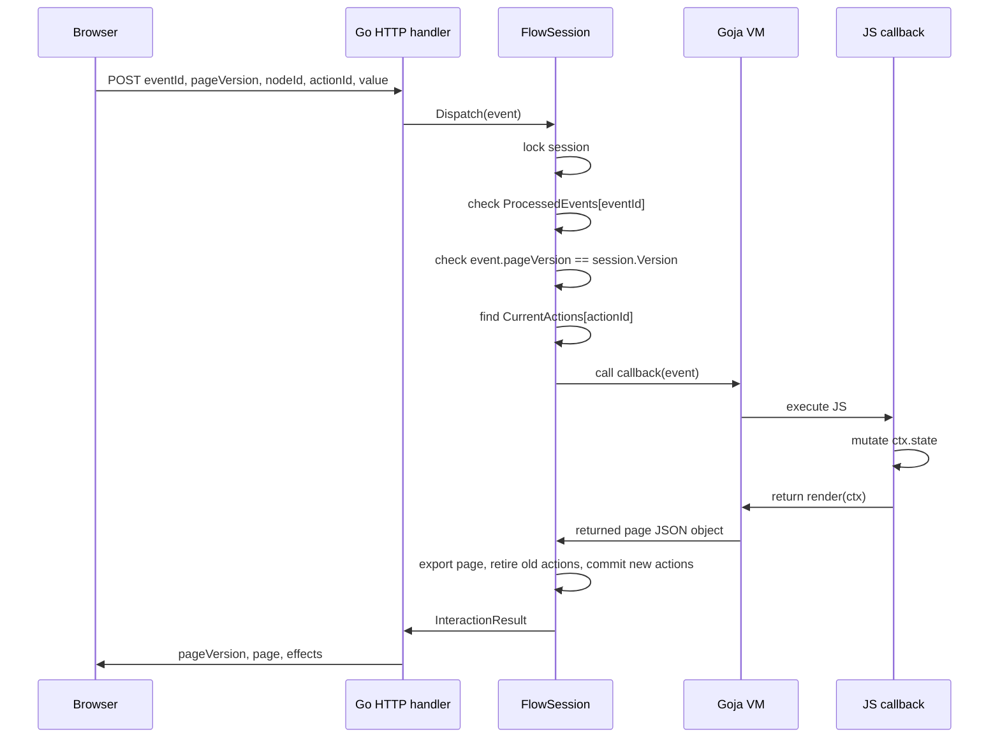

# Fringe Interactive DSL and Goja Backend Runtime Deep Dive

This report explains the technical arc of the Fringe hair-booking work from static visual components to an interactive backend-driven DSL runtime. It is not a changelog. The goal is to make the architecture understandable enough that a future engineer can continue the implementation without reconstructing the decisions from commits, Storybook stories, and ticket notes.

The repository is `/home/manuel/workspaces/2026-04-21/hair-v2/hair-booking`. The work spans three connected tickets. HAIR-031 rebuilt the visual language and React component structure for the intake pages. HAIR-032 introduced a JSON-emitting page DSL and a React interpreter. HAIR-033 made the widgets app-ready, added interactive DSL action routing, and then moved the backend design from ordinary Go handlers to JavaScript flow scripts running inside a Goja sandbox hosted by Go.

> [!summary]
> The central frontend move was to split the interface into app-ready atoms, molecules, group components, and page-level JSON rendering. Components now expose controlled values and callbacks rather than only visual props.
>
> The central DSL move was to keep the page description as JSON. Builder APIs may be ergonomic JavaScript or TypeScript, but the browser receives a data structure, not executable page code.
>
> The central backend move was to run the DSL authoring code inside Goja in the Go backend. A flow script registers callbacks through `ctx.action(...)`; the browser receives opaque action ids; later browser events are dispatched back into the registered Goja callbacks.
>
> The central correctness rule is that Goja VMs may be long-running per active flow session, but action callbacks are page-version scoped. Old actions become stale after a successful render.

## 1. What was built

The current implementation has four layers. Each layer solves one specific problem and provides the next layer with a narrower interface.

```mermaid
flowchart TD
  subgraph Visual[Visual component system]
    Tokens[Fringe design tokens]
    Atoms[Atoms: Chip, Segmented, RatingBar]
    Molecules[Molecules: ServiceOption, BudgetOption, TimeSlot, DayCell, PhotoTile]
    Groups[Group components: ChipGroup, ServiceOptionGroup, BudgetOptionGroup, TimeSlotGroup, DayPickerGrid]
  end

  subgraph FrontendDSL[Browser JSON DSL renderer]
    TSSchema[web/src/page-dsl/schema.ts]
    TSBuilder[web/src/page-dsl/builder.ts]
    Renderer[web/src/page-dsl/render.tsx]
    Stories[Interactive Storybook pages]
  end

  subgraph BackendRuntime[Go backend DSL runtime]
    GoSchema[pkg/dslgoja/schema.go]
    Runtime[pkg/dslgoja/runtime.go]
    JSModule[pkg/dslgoja/modules_dsl.go]
    Flow[pkg/dslgoja/flows/intake.flow.js]
  end

  subgraph HTTP[HTTP transport]
    Start[POST /api/dsl/flows/{flowId}/start]
    Get[GET /api/dsl/flows/{sessionId}]
    Event[POST /api/dsl/flows/{sessionId}/events]
  end

  Tokens --> Atoms --> Molecules --> Groups
  Groups --> Renderer
  TSSchema --> Renderer
  TSBuilder --> Stories
  GoSchema --> Runtime
  JSModule --> Runtime
  Flow --> Runtime
  Runtime --> HTTP
  HTTP --> Renderer
```

The browser-side code can already render local JSON DSL pages and interactive Storybook examples. The backend-side code can now start a Goja-hosted flow, render the initial page, register opaque action ids, dispatch events into Goja callbacks, and expose that through HTTP endpoints. The remaining work is to connect the browser renderer to the HTTP endpoints so that backend-produced action references drive real frontend events.

## 2. The original pressure: visual parity was not enough

The Fringe redesign began as a visual restyling project. HAIR-031 extracted standalone HTML prototypes, captured screenshots, analyzed components, created overlays, and rebuilt the React app around the new design system. That work produced a component library with atoms, molecules, organisms, and page stories. It also introduced visual-diff review infrastructure and Storybook phone-frame rendering.

Visual parity did not make the components usable in the application. A component can look correct and still be incomplete for product code. A `Chip` that accepts `selected` but cannot tell the application how selection changed is a visual component, not a form control. A service card that calls `onClick` without a value payload forces each page to reconstruct meaning from closure context. A page DSL that renders JSON but only logs actions proves layout, not runtime behavior.

HAIR-033 addressed that by turning visual widgets into app-ready controls. The implementation added controlled values, disabled states, callback payloads, group components, and tests. The important shift was to make each widget report the next state explicitly.

For example, `ChipGroup` established the first reusable pattern:

```tsx
<ChipGroup
  label="Tone family"
  selectionMode="multiple"
  value={tones}
  options={[
    { value: "neutral", label: "Neutral" },
    { value: "warm", label: "Warm" },
    { value: "cool", label: "Cool" },
    { value: "dimensional", label: "Dimensional" },
  ]}
  onChange={(nextValues, meta) => setTones(nextValues)}
/>
```

This contract matters because the rest of the DSL architecture depends on value-bearing events. The backend cannot dispatch a meaningful callback if the browser only reports that something was clicked. It needs to report which node changed, which action reference was used, what event occurred, and what value was selected.

## 3. The widget layer: controls before pages

The first HAIR-033 implementation pass made the leaf widgets interactive. The second pass introduced group components that hold the repeated controlled/uncontrolled selection logic.

The current important files are:

| File | Role |
|---|---|
| `web/src/fringe-ui/interactions.ts` | Shared interaction metadata types. |
| `web/src/fringe-ui/selection.ts` | `useControllableValue` helper for controlled/uncontrolled groups. |
| `web/src/atoms/Chip/Chip.tsx` | Accessible chip button with `onSelectedChange`. |
| `web/src/atoms/Chip/ChipGroup.tsx` | Single/multiple chip selection group. |
| `web/src/atoms/Segmented/Segmented.tsx` | Controlled segmented selector. |
| `web/src/atoms/RatingBar/RatingBar.tsx` | Display or interactive rating control. |
| `web/src/molecules/ServiceOption/ServiceOption.tsx` | Selectable service card. |
| `web/src/molecules/ServiceOption/ServiceOptionGroup.tsx` | Single-select service group. |
| `web/src/molecules/BudgetOption/BudgetOptionGroup.tsx` | Single-select budget group. |
| `web/src/molecules/TimeSlot/TimeSlotGroup.tsx` | Single-select time-slot grid. |
| `web/src/molecules/DayCell/DayPickerGrid.tsx` | Single-select day grid. |
| `web/src/molecules/PhotoTile/PhotoTile.tsx` | Upload/remove tile callback surface. |

The common callback shape is intentionally simple. Widgets report the next value and metadata. The group owns how a click changes selection; the page owns what that selected value means.

```ts
type SelectionChangeMeta<TValue extends string = string, TItem = unknown> = {
  value?: TValue;
  label?: ReactNode;
  item?: TItem;
  action: "select" | "deselect" | "toggle" | "clear" | "edit" | "upload" | "remove";
  source: "pointer" | "keyboard" | "programmatic";
  previousValue?: TValue | TValue[] | number | null;
};
```

This is not just a frontend convenience. It is the event vocabulary the backend will receive. If `ServiceOptionGroup` emits `value = "highlights"`, the backend DSL callback can update `ctx.state.service` without knowing how many cards were rendered or which DOM node was clicked.

The tests reflect this responsibility. `web/src/SelectionGroups.test.tsx` verifies group callbacks, uncontrolled state, disabled option behavior, and day selection metadata. `web/src/InteractiveWidgets.test.tsx` verifies value-bearing callbacks for segmented controls, ratings, service cards, and photo tiles. These tests are not visual tests. They verify the data contract between user action and application state.

## 4. The frontend JSON DSL: a page as data

HAIR-032 introduced the first page DSL. The authoring API is JavaScript/TypeScript, but the output is JSON. That distinction is the foundation for server-driven rendering.

A local DSL page can be built with code such as:

```ts
const pageJson = page("dsl-service", "Service DSL")
  .intake({
    step: 1,
    total: 9,
    eyebrow: "Chapter I · The Ask",
    title: "What brings you in?",
    onNext: "next",
  })
  .add(
    n.text("Pick one to start — you can add more later.", { variant: "editorial" }),
    n.serviceOptionGroup(serviceOptions, "highlights", { action: "serviceChanged" }),
  )
  .toJSON();
```

The builder is not the runtime contract. The JSON is the runtime contract. The renderer consumes data shaped by `web/src/page-dsl/schema.ts`:

```ts
export interface DslPage {
  schemaVersion: 1;
  id: string;
  title: string;
  description?: string;
  shell: {
    kind: "intake" | "bare";
    props?: JsonObject;
  };
  nodes: DslNode[];
}

export interface DslNode<P extends JsonObject = JsonObject> {
  kind: DslNodeKind;
  props?: P;
  children?: DslNode[];
  meta?: {
    id?: string;
    dataComponent?: string;
    dataSection?: string;
    dataPart?: string;
  };
}
```

The renderer in `web/src/page-dsl/render.tsx` maps each `kind` to an existing widget. That mapping is direct: `chipGroup` renders `ChipGroup`, `serviceOptionGroup` renders `ServiceOptionGroup`, `dayPickerGrid` renders `DayPickerGrid`, and so on. The renderer does not know business rules. It turns JSON into React elements and routes interactions through an action mechanism.

The local Storybook implementation used action names:

```json
{
  "kind": "chipGroup",
  "props": {
    "value": ["dimensional"],
    "action": "tonesChanged"
  }
}
```

The browser-local renderer resolved `tonesChanged` through `context.actions`. That proved that DSL nodes could be interactive, but it still kept the state transition in the browser. The later backend work changes where those actions are resolved.

## 5. The backend change: JavaScript in Goja, not browser-local JavaScript

The important design correction was that the backend API is JavaScript running inside a Goja sandbox inside the Go server. This is different from a Go-only handler registry and different from browser-local DSL code.

The intended authoring experience is a JavaScript flow script:

```js
const { page, n } = require("fringe/dsl");

function initialState() {
  return {
    step: "service",
    category: "color",
    service: "highlights",
    tones: ["dimensional"],
    damage: 2,
  };
}

function render(ctx) {
  switch (ctx.state.step) {
    case "color": return colorStep(ctx);
    case "service":
    default: return serviceStep(ctx);
  }
}
```

The script runs inside Go. It receives a host-created `ctx` object. It reads and writes `ctx.state`. It registers callbacks with `ctx.action(...)`. It returns JSON pages that the browser can render.

The browser never receives callback functions. It receives action references:

```json
"actions": {
  "change": { "id": "act_...", "event": "change" }
}
```

The Go session stores the real callback:

```go
type ActionRegistration struct {
    ID       string
    Name     string
    Event    string
    NodeID   string
    Version  int64
    Callback goja.Callable
}
```

When the browser sends an event with `actionId = "act_..."`, the Go runtime looks up the callback in the current flow session and invokes it inside the session's Goja VM.

## 6. The Go schema: matching the browser contract

The backend package starts with schema types in `pkg/dslgoja/schema.go`. These types mirror the TypeScript JSON contract. They are deliberately independent of Goja so the JSON boundary remains clear.

```go
type Page struct {
    SchemaVersion int            `json:"schemaVersion"`
    ID            string         `json:"id"`
    Title         string         `json:"title"`
    Description   string         `json:"description,omitempty"`
    Shell         Shell          `json:"shell"`
    Nodes         []Node         `json:"nodes"`
    Meta          map[string]any `json:"meta,omitempty"`
}

type Node struct {
    Kind     string         `json:"kind"`
    Props    map[string]any `json:"props,omitempty"`
    Children []Node         `json:"children,omitempty"`
    Meta     *NodeMeta      `json:"meta,omitempty"`
}

type ActionRef struct {
    ID    string `json:"id"`
    Event string `json:"event"`
}
```

The use of `map[string]any` for props is intentional. The DSL has a fixed outer structure and variable node-specific props. Encoding every node prop type in Go would add safety in one place but slow down the design while the widget set is still changing. The outer contract is typed; the node payload remains flexible.

The first tests in `pkg/dslgoja/schema_test.go` verify JSON field names. This matters because Go field names and browser field names differ. The frontend expects `schemaVersion`, not `SchemaVersion`; `nodeId`, not `NodeID`; `actionId`, not `ActionID`. These tests are small, but they protect the boundary that every later layer depends on.

## 7. The Goja runtime: sessions, state, and action registration

The runtime lives in `pkg/dslgoja/runtime.go`. It currently implements a long-running VM per active flow session. That session owns the Goja VM, the JavaScript flow object, the current state object, the current page, and the action registry.

The core session shape is:

```go
type FlowSession struct {
    ID      string
    FlowID  string
    Version int64

    VM          *goja.Runtime
    flow        *goja.Object
    state       goja.Value
    CurrentPage Page

    CurrentActions  map[string]ActionRegistration
    RetiredActions  map[string]RetiredActionInfo
    ProcessedEvents map[string]InteractionResult
    activeTx        *renderTransaction

    mu sync.Mutex
    rt *Runtime
}
```

The session has a mutex because Goja runtimes are not safe for concurrent use. HTTP requests can arrive concurrently. The runtime therefore serializes access to each session. This is the correct first implementation because a single intake flow should process one event at a time.

Starting a flow performs five operations:

1. Create a Goja VM.
2. Install the DSL module.
3. Load the flow source.
4. Call `initialState()` if present.
5. Call `render(ctx)` and commit the first page.

The flow source wrapper currently expects top-level functions:

```js
function initialState() { ... }
function render(ctx) { ... }
```

The wrapper returns them to Go as a plain object. This is sufficient for the prototype. It can later be replaced with a stricter `module.exports` shape if the flow packaging needs to evolve.

The host context exposes `ctx.action`. In the current implementation, `ctx.action(name, callback, event)` generates an opaque action id, stores the Goja callback in the active render transaction, and returns an action reference object to JavaScript.

```go
_ = obj.Set("action", func(call goja.FunctionCall) goja.Value {
    name := call.Argument(0).String()
    callback, ok := goja.AssertFunction(call.Argument(1))
    if !ok { panic(...) }

    event := name
    if len(call.Arguments) >= 3 { event = call.Argument(2).String() }

    id := "act_" + uuid.NewString()
    s.activeTx.NextActions[id] = ActionRegistration{
        ID:       id,
        Name:     name,
        Event:    event,
        Version:  s.Version + 1,
        Callback: callback,
    }

    ref := s.VM.NewObject()
    _ = ref.Set("id", id)
    _ = ref.Set("event", event)
    return ref
})
```

The active transaction is essential. Actions registered during a render are not installed into `CurrentActions` until the page successfully exports. If the render fails, the previous page and previous current actions remain valid.

## 8. Page-version-scoped actions

A long-running VM does not mean every callback remains valid for the lifetime of the intake. The VM and `ctx.state` live for the flow session. The current action map belongs to one rendered page version.

The rule is:

```text
VM lifetime: whole active flow session
State lifetime: whole active flow session
Current action lifetime: current page version only
Old action behavior: stale recovery, not invocation
```

This rule prevents old browser events from mutating newer state. A user may double-click. A request may retry. A user may have an old tab. If the backend silently executes old action callbacks, the flow can move backward or apply a value to a page that no longer exists.

The runtime therefore has three action/event structures:

| Field | Purpose |
|---|---|
| `CurrentActions` | Live callbacks for the current page version. |
| `RetiredActions` | Metadata for old actions, used to recognize stale action ids without retaining old Goja closures as active callbacks. |
| `ProcessedEvents` | Idempotency cache keyed by `eventId`. |

Render commit retires old actions and installs new ones:

```go
func (s *FlowSession) commitRenderTransaction(tx *renderTransaction, page Page, effects []Effect) *InteractionResult {
    now := time.Now()
    for id, action := range s.CurrentActions {
        s.RetiredActions[id] = RetiredActionInfo{
            ID:        action.ID,
            Name:      action.Name,
            Event:     action.Event,
            NodeID:    action.NodeID,
            Version:   action.Version,
            RetiredAt: now,
        }
    }

    s.Version++
    s.CurrentPage = page
    s.CurrentActions = tx.NextActions
    return &InteractionResult{SessionID: s.ID, PageVersion: s.Version, Page: page, Effects: effects}
}
```

The current implementation records retired metadata but does not yet prune it. The design document specifies a bounded retention window. That is one of the next production-hardening steps.

## 9. The `fringe/dsl` module inside Goja

Flow authors should not hand-write JSON for every node. The Goja runtime installs a small JavaScript module in `pkg/dslgoja/modules_dsl.go`:

```js
const { page, n } = require("fringe/dsl");
```

The module provides a builder API similar to the frontend builder. It is currently implemented as JavaScript source installed into the VM. That is enough for the prototype and keeps the authoring surface close to the browser-local DSL examples.

The module exports helpers such as:

```js
page(id, title)
n.text(text, props)
n.segmented(options, value, props)
n.chipGroup(options, value, props)
n.serviceOptionGroup(options, value, props)
n.budgetOptionGroup(options, value, props)
n.timeSlotGroup(options, value, props)
n.dayPickerGrid(days, value, props)
n.photoTile(label, props)
n.ratingBar(value, props)
```

The module implements `toJSON()` methods that remove builder methods and return JSON-compatible objects. This is not cosmetic. The browser contract must not contain functions. The action references returned by `ctx.action` are JSON objects, and the node builders must preserve them while excluding builder methods.

A flow step can now be written in the intended style:

```js
function serviceStep(ctx) {
  return page("intake-service", "Service")
    .intake({
      step: 1,
      total: 2,
      eyebrow: "Chapter I · The Ask",
      title: "What brings you in?",
      actions: {
        next: ctx.action("next", function () { return goto(ctx, "color"); }, "next"),
        skip: ctx.action("skip", function () { return goto(ctx, "color"); }, "skip"),
      },
    })
    .add(
      n.segmented(options, ctx.state.category, {
        actions: {
          change: ctx.action("setCategory", function (event) {
            ctx.state.category = event.value;
            return render(ctx);
          }, "change"),
        },
      }).id("category-tabs"),
      n.serviceOptionGroup(serviceOptions, ctx.state.service, {
        actions: {
          change: ctx.action("setService", function (event) {
            ctx.state.service = event.value;
            return render(ctx);
          }, "change"),
        },
      }).id("service-options"),
    )
    .toJSON();
}
```

The important point is not the exact method names. The important point is that page authoring is JavaScript, page transport is JSON, and callbacks remain server-side.

## 10. The embedded intake flow

The current backend prototype embeds a two-step flow at `pkg/dslgoja/flows/intake.flow.js`. It is exposed to Go as `DemoIntakeFlowSource` in `pkg/dslgoja/flows.go`.

The flow state is compact:

```js
function initialState() {
  return {
    step: "service",
    category: "color",
    service: "highlights",
    tones: ["dimensional"],
    damage: 2,
  };
}
```

The render function dispatches by `ctx.state.step`:

```js
function render(ctx) {
  switch (ctx.state.step) {
    case "color":
      return colorStep(ctx);
    case "service":
    default:
      return serviceStep(ctx);
  }
}
```

The `service` page renders:

- an introductory text node,
- segmented Cut / Color / Extensions tabs,
- a service option group,
- shell next and skip actions.

The `color` page renders:

- a tone chip group,
- an interactive damage rating bar,
- shell back and next actions.

This is deliberately a two-step slice. It proves the runtime shape without requiring all intake screens. The next steps can add photos, budget, booking, and confirm using the same pattern.

## 11. Dispatch: browser event to Goja callback

The dispatch path is implemented by `FlowSession.Dispatch`. It takes an `InteractionEvent`, validates it against the session, invokes the registered Goja callback, and returns an `InteractionResult`.

The event shape is the backend equivalent of what the browser will send:

```go
type InteractionEvent struct {
    EventID     string         `json:"eventId"`
    SessionID   string         `json:"sessionId,omitempty"`
    PageVersion int64          `json:"pageVersion"`
    NodeID      string         `json:"nodeId"`
    NodeKind    string         `json:"nodeKind,omitempty"`
    ActionID    string         `json:"actionId"`
    Event       string         `json:"event"`
    Value       any            `json:"value,omitempty"`
    Meta        map[string]any `json:"meta,omitempty"`
}
```

Dispatch follows this sequence:



One subtle implementation point was the event object passed to JavaScript. Passing the Go struct directly exposed Go-style field names. JavaScript callbacks expected `event.value`, not `event.Value`. The runtime now converts the event to a lowerCamelCase map before passing it into Goja:

```go
func interactionEventObject(event InteractionEvent) map[string]any {
    return map[string]any{
        "eventId":     event.EventID,
        "sessionId":   event.SessionID,
        "pageVersion": event.PageVersion,
        "nodeId":      event.NodeID,
        "nodeKind":    event.NodeKind,
        "actionId":    event.ActionID,
        "event":       event.Event,
        "value":       event.Value,
        "meta":        event.Meta,
    }
}
```

This is a general rule for the project: every Go-to-JavaScript boundary should be treated as a JSON API boundary. The JavaScript-facing shape should use JavaScript names.

## 12. HTTP endpoints

The backend now exposes the Goja runtime through HTTP in `pkg/server/handlers_dsl.go` and route registration in `pkg/server/http.go`.

The endpoints are:

```http
POST /api/dsl/flows/{flowId}/start
GET  /api/dsl/flows/{sessionId}
POST /api/dsl/flows/{sessionId}/events
```

The first flow id is `fringe.intake.v1`. The start endpoint loads `DemoIntakeFlowSource`, creates a session, renders the first page, stores the session in an in-memory flow store, and returns:

```json
{
  "data": {
    "sessionId": "flow_...",
    "pageVersion": 1,
    "page": {
      "schemaVersion": 1,
      "id": "intake-service",
      "shell": { "kind": "intake", "props": {} },
      "nodes": []
    }
  }
}
```

The event endpoint accepts an interaction event and delegates to `session.Dispatch`. The endpoint does not interpret the widget. It does not decide what `extensions` means. The Goja callback registered by the page decides that.

This separation is important. The HTTP layer owns transport and API envelopes. The runtime owns session and callback semantics. The flow script owns business state transitions.

The current server store is intentionally simple:

```go
type dslFlowStore struct {
    mu       sync.RWMutex
    runtime  *dslgoja.Runtime
    sessions map[string]*dslgoja.FlowSession
}
```

This is a development implementation. Before production, it needs user/session ownership checks, expiry, pruning, and a persistence or sticky-session strategy.

## 13. Test coverage

The current tests now cover the backend runtime, the HTTP endpoint layer, and the frontend renderer/container bridge. The tests are important because this architecture has several boundaries where a field-name mismatch or action-routing mistake can make the system appear correct while silently failing to update state.

Important backend tests include:

| Test file | Coverage |
|---|---|
| `pkg/dslgoja/schema_test.go` | JSON field contract for pages and events. |
| `pkg/dslgoja/runtime_test.go` | Flow start, initial render, action refs, missing initial state. |
| `pkg/dslgoja/modules_dsl_test.go` | `require("fringe/dsl")` builder output and unknown module rejection. |
| `pkg/dslgoja/action_lifecycle_test.go` | Successful render retires actions; failed render preserves actions. |
| `pkg/dslgoja/intake_flow_test.go` | Embedded intake flow service and color page rendering. |
| `pkg/dslgoja/dispatch_test.go` | Dispatch into callbacks, navigation, stale actions, duplicate idempotency. |
| `pkg/dslgoja/dispatch_errors_test.go` | Unknown action errors and callback exceptions. |
| `pkg/server/handlers_dsl_test.go` | HTTP start/get/event dispatch round trip. |

The most important backend endpoint test starts a flow, extracts a real action id from the returned page JSON, posts a `change` event selecting `extensions`, and verifies the returned page has `category-tabs.props.value = "extensions"`. That test exercises the core backend design:

```text
HTTP start -> Goja render -> page JSON -> action id extraction -> HTTP event -> Goja callback -> updated page JSON
```

The frontend bridge adds a second test layer:

| Test file | Coverage |
|---|---|
| `web/src/page-dsl/BackendDslPage.test.tsx` | Backend action refs from nodes, shell navigation refs, `BackendDslPage` flow start/fetch/event client behavior. |
| `web/src/page-dsl/InteractiveDsl.test.tsx` | Browser-local interactive DSL action routing for group nodes and photo tiles. |
| `web/src/InteractiveWidgets.test.tsx` | App-ready widget callback contracts. |
| `web/src/SelectionGroups.test.tsx` | Group component selection state and metadata. |
| `web/src/atoms/Chip/ChipGroup.test.tsx` | Chip and ChipGroup selection behavior. |

The most recent full validation sequence passed:

```bash
go test ./... -count=1
cd web && pnpm test -- --runInBand
cd web && npx tsc --noEmit
cd web && npx storybook build --test
```

At the time of the frontend bridge update, the web test run reported 5 test files and 19 passing tests. The Storybook build also passed after adding the backend-shaped flow demo.

## 14. The frontend bridge is now implemented

The earlier version of this report described the frontend backend bridge as the missing piece. That bridge now exists.

The new files are:

| File | Role |
|---|---|
| `web/src/page-dsl/backendClient.ts` | Fetch client for `startDslFlow`, `getDslFlow`, and `postDslEvent`. |
| `web/src/page-dsl/BackendDslPage.tsx` | React container that owns backend flow state and posts renderer events to Go. |
| `web/src/page-dsl/BackendDslPage.test.tsx` | Tests for backend action refs and container/client behavior. |
| `web/src/page-dsl/BackendDslPage.stories.tsx` | Storybook demo under `Page DSL / Backend Goja Flow`. |

The renderer was updated in:

```text
web/src/page-dsl/render.tsx
```

The schema was extended in:

```text
web/src/page-dsl/schema.ts
```

The new client speaks the endpoint contract introduced in `pkg/server/handlers_dsl.go`:

```ts
export async function startDslFlow(flowId = "fringe.intake.v1"): Promise<DslFlowState>
export async function getDslFlow(sessionId: string): Promise<DslFlowState>
export async function postDslEvent(sessionId: string, event: DslInteractionEvent): Promise<DslFlowState>
```

The container owns the state that the renderer should not know about:

```tsx
export function BackendDslPage({ flowId = "fringe.intake.v1", sessionId, client }) {
  const [state, setState] = useState<DslFlowState | null>(null);

  // Start or fetch a session.
  // Render the returned page.
  // Attach backendDispatch to the renderer.
}
```

The separation is deliberate. `DslPageRenderer` renders a page and reports node-level interactions. It does not know how sessions are started, how page versions are tracked, or how event ids are generated. `BackendDslPage` owns those transport responsibilities.

## 15. Backend action refs in the renderer

The renderer now supports two action models:

1. Local Storybook actions, where a node has a string such as `action: "tonesChanged"` and the renderer calls `context.actions.tonesChanged(...)`.
2. Backend action refs, where a node has `props.actions.change = { id: "act_...", event: "change" }` and the renderer calls `context.backendDispatch(...)`.

Backend refs are preferred when present. Local action names remain as a fallback so all existing Storybook examples keep working.

The core helper has this shape:

```ts
function dispatchAction(ctx, node, props, eventName, localKey, value, meta) {
  const ref = actionRef(props, eventName);
  if (ref && ctx?.backendDispatch) {
    return ctx.backendDispatch({
      nodeId: node.meta?.id || "",
      nodeKind: node.kind,
      actionId: ref.id,
      event: ref.event,
      value,
      meta,
    });
  }

  const localName = props[localKey];
  if (localName) {
    return ctx.actions?.[localName]?.({ node, action: localName, value, meta });
  }
}
```

The shell needed its own path because `IntakeShell` is not a normal node in the page tree. The renderer now dispatches shell actions such as `shell.next` with node kind `intakeShell`:

```ts
function dispatchShellAction(ctx, props, eventName, localKey) {
  const ref = actionRef(props, eventName);
  if (ref && ctx?.backendDispatch) {
    return ctx.backendDispatch({
      nodeId: `shell.${eventName}`,
      nodeKind: "intakeShell",
      actionId: ref.id,
      event: ref.event,
    });
  }

  return localActionFallback(...);
}
```

This shell path matters because bottom navigation is one of the user's explicit requirements. Pressing the bottom button should tell the backend exactly which button was pressed, and the backend should look up the registered handler for that page.

## 16. Storybook now has a backend-shaped flow demo

The new Storybook story lives at:

```text
Page DSL / Backend Goja Flow / Mocked Backend Flow
```

The story uses `BackendDslPage` with a mocked `BackendDslClient`. It does not require the Go server to be running, but it uses the same data contract as the real backend:

- `startDslFlow` returns `{ sessionId, pageVersion, page }`.
- widget interactions produce `{ nodeId, nodeKind, actionId, event, value, meta }`.
- `postDslEvent` returns a new `{ sessionId, pageVersion, page, effects }`.

The mocked story is not a replacement for the Go HTTP tests. It is a review surface for the frontend contract. It lets a reviewer click Cut / Color / Extensions, service options, tone chips, rating controls, and shell navigation while watching the action id and value that would be posted to the backend.

The distinction between the two test/demo surfaces is useful:

| Surface | What it proves |
|---|---|
| Go HTTP tests | The actual backend endpoints start sessions and dispatch events into Goja callbacks. |
| Storybook mocked backend flow | The frontend renderer/container can consume backend-shaped pages and produce backend-shaped events. |

A future dev route can connect `BackendDslPage` to the live Go server. The current story is intentionally isolated so the component build remains deterministic.

## 17. Design decisions worth preserving

### The JSON boundary is the contract

Builders can exist in TypeScript, JavaScript inside Goja, or later as code generation. The browser renderer should not care. It receives a `DslPage`. This makes the renderer stable while authoring environments evolve.

### The backend owns callbacks

The browser receives action ids, not handler names and not functions. This prevents the browser from choosing arbitrary handlers. It also keeps business transitions in the flow runtime.

### The VM is per active flow session

A per-flow VM isolates state and action registries. A user can have multiple flow sessions. Each one has its own VM, mutex, state, page version, and action map.

### Actions are page-version scoped

Old action ids should not mutate current state. A stale action should return the current page and an informational effect. This rule is stricter than simply checking whether an action id exists somewhere in the session.

### Render is transactional

A render failure must not leave the session with half-installed actions. New actions are collected in `NextActions` and committed only after the returned page exports successfully.

### JavaScript-facing data uses JavaScript names

Go structs use Go field names. JSON and JavaScript use lowerCamelCase names. The runtime explicitly converts events to lowerCamelCase maps before invoking callbacks.

### The renderer is not the session manager

The renderer should not know how to start flows, generate event ids, or track page versions. It should report interactions. `BackendDslPage` should attach transport-level fields and replace the page with the backend response.

## 18. Failure modes and current protections

| Failure mode | Current protection | Remaining work |
|---|---|---|
| Duplicate browser POST retries. | `ProcessedEvents` returns cached results by `eventId`. | Add pruning and possibly persisted idempotency. |
| Old tab posts stale action. | Page-version check and retired action recognition return current page with info effect. | Decide HTTP status policy for stale events. |
| JavaScript callback throws. | Runtime returns current page with danger toast effect. | Add structured error codes and logging. |
| Render fails after state mutation. | Current actions remain installed because new actions commit only after successful export. | State rollback is not implemented; JS authors should keep render pure. |
| Goja VM accessed concurrently. | Session mutex serializes `Render` and `Dispatch`. | Consider actor loop if callbacks become long-running. |
| Infinite JavaScript loop. | `callWithTimeout` uses `vm.Interrupt`. | Add configurable limits and operational logging. |
| Memory growth from old sessions/actions. | Action lifecycle exists. | Add expiry, pruning, cleanup goroutine. |
| Browser sends unknown action id. | Runtime returns error; HTTP maps to `dsl_dispatch_failed`. | Add more precise error code mapping. |
| Browser sends action for wrong user. | Not implemented in prototype. | Add ownership checks when auth/session integration is added. |
| Frontend loses backend session state. | `BackendDslPage` can fetch by `sessionId` if one is supplied. | Add route-level session persistence/recovery policy. |

The most important unresolved production issue remains session lifecycle. The current in-memory store is acceptable for a prototype because it proves the event model. It is not a production session manager.

## 19. Implementation sequence so far

The implementation followed a useful sequence. It is worth preserving because each step established one invariant before adding the next.

1. **Schema first.** `pkg/dslgoja/schema.go` defined the JSON contract and DTOs.
2. **Runtime second.** `StartFlow` loaded JavaScript, called `initialState`, called `render`, and exposed `ctx.action`.
3. **Action lifecycle third.** Render transactions and current/retired actions prevented partial render mutation.
4. **Builder module fourth.** `require("fringe/dsl")` made flow scripts readable.
5. **Flow script fifth.** `intake.flow.js` made the architecture concrete.
6. **Dispatch sixth.** `FlowSession.Dispatch` connected browser events to Goja callbacks.
7. **Endpoint seventh.** HTTP handlers exposed the runtime to clients.
8. **Frontend bridge eighth.** `backendClient`, `BackendDslPage`, and backend action-ref support connected the React renderer to the endpoint contract.

This sequence is the right order. Reversing it would have created broad HTTP or frontend surfaces before the runtime invariants were tested.

## 20. Current status

The project is active and now has the first end-to-end architectural slice. The backend can start and dispatch a two-step Goja-authored flow through HTTP. The frontend can consume backend-shaped page state and route widget/shell interactions through `backendDispatch`. The Storybook demo uses a mocked backend client, while Go tests cover the real HTTP endpoints.

Current code commits for the runtime and bridge slice include:

| Commit | Meaning |
|---|---|
| `6d4e7e9` | Go DSL JSON schema types. |
| `7dac9ed` | Minimal Goja flow runtime. |
| `343626e` | Page-version action lifecycle. |
| `8bffef1` | `fringe/dsl` module in Goja. |
| `553d115` | Embedded two-step intake flow. |
| `d6298c4` | Event dispatch into Goja callbacks. |
| `d81d233` | Expanded dispatch tests. |
| `2396d07` | HTTP endpoints for Goja DSL flows. |
| `3942190` | Frontend backend client, `BackendDslPage`, renderer action refs, tests, and Storybook demo. |

The final HAIR-033 documentation bundle was uploaded to reMarkable at:

```text
/ai/2026/05/13/HAIR-033/HAIR_033_Interactive_Widgets_and_Goja_DSL_Final_Bundle.pdf
```

The most recent full validation sequence was:

```bash
go test ./... -count=1
cd web && pnpm test -- --runInBand
cd web && npx tsc --noEmit
cd web && npx storybook build --test
```

This means the project has crossed the key boundary: a JavaScript flow in Goja inside Go can drive a React UI contract through JSON pages and opaque action ids. The remaining work is production hardening and expanding the prototype flow, not proving the central mechanism.

## 21. Near-term next steps

The next work should be productionization, not another redesign of the core loop.

1. Add flow-session lifecycle management:
   - idle expiry,
   - absolute expiry,
   - cleanup goroutine,
   - processed event pruning,
   - retired action pruning.
2. Add user/session ownership checks for DSL sessions before exposing the runtime beyond dev/demo contexts.
3. Extend `pkg/dslgoja/flows/intake.flow.js` from two steps to the full sequence:
   - service,
   - color,
   - photos,
   - budget,
   - booking,
   - confirm.
4. Add a live dev route or app route that renders `BackendDslPage` against the real Go backend, not only the mocked Storybook client.
5. Add a safe `fringe/intake` host module that wraps existing Go intake services for estimates and final submission.
6. Decide the persistence strategy:
   - keep in-memory sessions for local/dev,
   - add durable state and recreated/symbolic handlers for production,
   - or use sticky sessions with explicit operational constraints.
7. Add structured logging for:
   - session id,
   - page version,
   - action id,
   - node id,
   - callback duration,
   - error effects.

The near-term objective is a full intake flow that can run in development through the live Go server. The production objective is a bounded, authorized, observable session runtime.

## 22. Working rules for future contributors

- Keep flow state JSON-serializable. Do not store Goja functions, file handles, or host objects in `ctx.state`.
- Treat `render(ctx)` as a pure page-construction step. Mutate state in callbacks, then return a render.
- Never send handler names or callbacks to the browser. Send opaque action ids.
- Do not invoke retired actions. Return the current page and a stale-page effect.
- Do not modify `CurrentActions` during render. Register into `NextActions` and commit only after the page exports.
- Keep Go-to-JavaScript event objects lowerCamelCase.
- Keep widget callbacks value-oriented. The backend needs selected values, not only click notifications.
- Add tests at the runtime layer before adding HTTP or frontend code for the same behavior.
- Keep the frontend renderer a data interpreter. Business transitions belong in the backend flow runtime.
- Keep `BackendDslPage` responsible for transport state. Do not push session ids and page versions into widget components.

## 23. Why this architecture matters

The resulting system gives the project a server-driven UI architecture without discarding React components. React remains responsible for rendering and user interaction. Go remains responsible for HTTP, sessions, domain services, and hosting the JavaScript runtime. Goja provides the programmable middle layer: flow authors can write concise JavaScript state machines that emit JSON pages and register callbacks.

The architecture is valuable because it separates three responsibilities that are often mixed together:

- **Page authoring** happens in JavaScript flow scripts.
- **Page rendering** happens in React from JSON.
- **State transitions** happen in backend-hosted callbacks registered during page construction.

That separation is the reason the system can support multi-step intake flows. A step is not a hard-coded React route. It is a function of backend flow state. An interaction is not a local browser state update. It is an event delivered to the backend flow session. The page that comes back is the next authoritative state of the interaction.

The current implementation proves the central mechanics on both sides of the boundary. The backend can produce and dispatch Goja pages. The frontend can render backend-shaped pages and post backend-shaped events. The next phase is to make the runtime durable, authorized, observable, and complete enough for the full intake flow.
