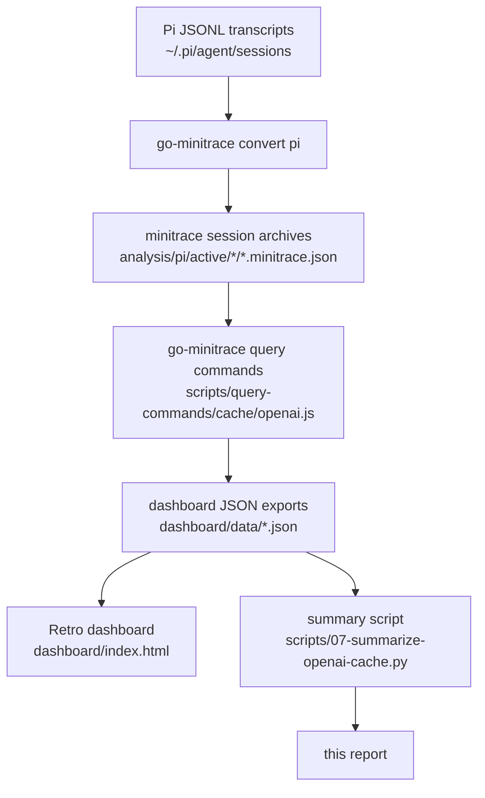
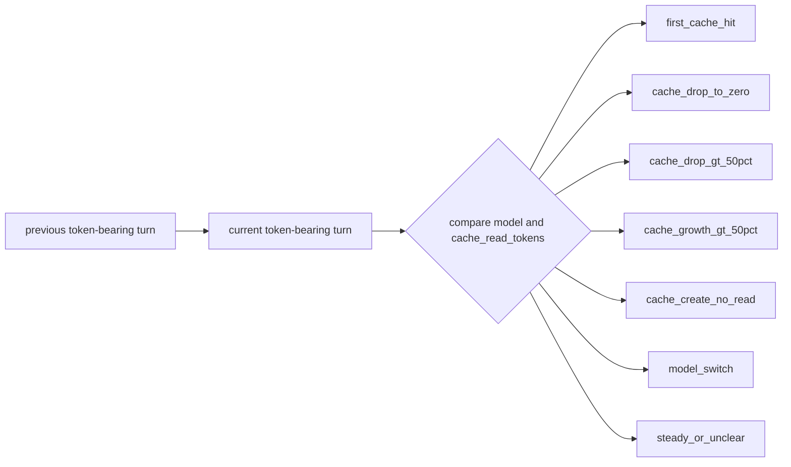

# GPT-5 Cache Behavior — Prompt Cache Analysis with go-minitrace

## 1. Purpose and conclusions

This note is the Parc vault version of the docmgr ticket report. The source ticket is `CACHE-HITS-PROGRESSION-2026-05-13` in `/home/manuel/code/wesen/trace-analysis`. The committed scripts and dashboard remain in that repository; this note preserves the project-level narrative and conclusions for the vault.

This project report captures the cache-behavior investigation for Pi coding-agent conversations that used OpenAI Codex GPT-5-family models. It is stored in the Parc vault as a durable technical report: a future reader should be able to understand the source transcripts, the go-minitrace analysis pipeline, the derived cache metrics, the dashboard artifacts, and the current interpretation without reopening the original ticket.

> [!summary]
> GPT-5-family Pi sessions are high-cache workloads in the available transcript corpus: 10.2B cache-read tokens out of 10.5B effective prompt tokens, or 96.9% cache-read share.
>
> Cache drops are common but often short-lived. Complete drops average 0.0% cache-read share on the event turn and rebound to 91.4% one token-bearing turn later.
>
> The current data is observational. It supports practical conclusions about cache reuse in long coding sessions, but it does not prove an exact provider-side cache TTL.


The short conclusion is that GPT-5-family Pi discussions show strong and persistent prompt-cache reuse. Across the OpenAI Codex sessions currently exported for the dashboard, the effective prompt-token volume is dominated by cache reads: 10.2 billion cache-read tokens out of 10.5 billion effective prompt tokens, or 96.9%. Most substantial sessions settle into a high-cache regime where individual token-bearing turns report approximately 99% cache-read share. Cache drops do occur, but the event-window analysis shows that many drops recover on the next token-bearing turn. That means a large fraction of observed drops should be treated as transient misses, prompt-shape changes, or reporting boundaries rather than proven cache expiry.

The strongest operational conclusions are:

- GPT-5-family Pi conversations usually benefit from very high prompt-cache reuse after the first cache hit.
- Session-level cache-read share is high for every major GPT-5-family model in this corpus: `gpt-5.5`, `gpt-5.4`, `gpt-5.4-mini`, and `gpt-5.3-codex`.
- Short conversations have lower cache-read percentages because they contain less repeated context and fewer opportunities to amortize warm-up.
- `cache_drop_to_zero` is common, but the average cache-read percentage rebounds from 0.0% at the event turn to 91.4% one token-bearing turn later.
- Model switches are rare in the OpenAI-filtered corpus, but when they occur they often coincide with low cache-read percentage on the switch turn.
- Wall-clock gaps are relevant but not sufficient by themselves. Some drops happen after long gaps, while many drops also happen within seconds or minutes. Expiry analysis needs event windows plus timestamp gaps, not timestamp gaps alone.

The report does not claim to prove provider-side cache TTL. The data is observational: it comes from transcript usage counters reported by providers or adapters and normalized by go-minitrace. We can identify likely cache behavior and suspicious events; proof of exact TTL would require controlled experiments with identical request shapes and known provider cache policies.

## 2. Data source

The source data is local Pi transcript history under:

```text
~/.pi/agent/sessions
```

The ticket converted those native Pi JSONL transcripts into go-minitrace archives under the ticket analysis directory:

```text
ttmp/2026/05/13/CACHE-HITS-PROGRESSION-2026-05-13--analyze-prompt-cache-hits-across-conversation-progression/analysis/pi
```

The generated archive files are intentionally ignored by Git. They are reproducible from the local transcript store and may contain large transcript-derived JSON documents. The reusable logic lives in the ticket `scripts/` directory and is committed.

The OpenAI dashboard data was generated from the converted minitrace archives into ignored JSON files under:

```text
dashboard/data/openai-sessions.json
dashboard/data/openai-turns.json
dashboard/data/openai-events.json
dashboard/data/openai-event-windows.json
dashboard/data/meta.json
```

The summary script that produced the aggregate numbers for this report is:

```text
scripts/07-summarize-openai-cache.py
```

Its current output is stored in:

```text
analysis/08-openai-cache-summary.md
```

## 3. System architecture

The analysis pipeline has four stages. Each stage reduces the raw transcript material into a more specific representation.



The important design decision is to keep the provider-specific extraction in go-minitrace query commands rather than hard-coding everything in the dashboard. The dashboard should visualize a stable row shape. The query command should own the interpretation of minitrace schema, provider filtering, turn usage extraction, and event classification.

### File reference

| File | Role |
|---|---|
| `scripts/query-commands/cache/openai.js` | Defines OpenAI-specific go-minitrace verbs: `sessions`, `turns`, `events`, `event-windows`. |
| `scripts/05-generate-openai-dashboard-data.sh` | Calls the go-minitrace verbs and writes dashboard JSON files. |
| `scripts/06-serve-openai-dashboard.sh` | Serves the dashboard locally with Python `http.server`. |
| `dashboard/index.html` | No-dependency local dashboard in a monochrome retro Mac style. |
| `scripts/07-summarize-openai-cache.py` | Reads dashboard JSON and produces aggregate Markdown summaries. |
| `analysis/08-openai-cache-summary.md` | Current generated summary from the Python script. |
| `analysis/09-gpt-5-cache-behavior-field-report.md` | This report. |

## 4. The minitrace schema fields that matter

A minitrace session has session-level metadata and an ordered array of turns. Cache analysis uses both.

At the session level:

```text
environment.provider_hint
environment.model
metrics.turn_count
metrics.total_input_tokens
metrics.total_cache_read_tokens
metrics.total_cache_creation_tokens
metrics.model_switches
timing.started_at
```

At the turn level:

```text
turns[].index
turns[].timestamp
turns[].role
turns[].model
turns[].usage.input_tokens
turns[].usage.output_tokens
turns[].usage.cache_read_tokens
turns[].usage.cache_creation_tokens
```

The OpenAI dashboard focuses on token-bearing assistant turns from sessions where:

```text
environment.provider_hint = openai-codex
```

The OpenAI query command also requires a GPT-like turn model:

```sql
COALESCE(t.unnest->>'model', s.environment->>'model') LIKE 'gpt-%'
```

This extra filter matters because some sessions classified as OpenAI Codex can contain earlier mixed turn-model labels from provider changes or adapter transitions. Without this filter, an OpenAI-only analysis can accidentally include non-OpenAI turn rows.

## 5. Normalized metrics

The analysis uses `effective_prompt_tokens` as the denominator for cache percentages:

```text
effective_prompt_tokens = input_tokens + cache_read_tokens + cache_creation_tokens
```

Then:

```text
cache_read_pct_effective = 100 * cache_read_tokens / effective_prompt_tokens
new_input_pct_effective  = 100 * input_tokens / effective_prompt_tokens
```

This denominator is used because provider token fields are not guaranteed to have identical semantics across providers. Even inside one provider family, it is safer to make the denominator explicit. A cache-read percentage above 90% means the reported prompt for that turn was mostly served from cache. A low percentage means the provider reported mostly new input or no cache read for that turn.

Pseudocode:

```pseudo
for each session:
    if session.environment.provider_hint != "openai-codex":
        skip

    for each turn in session.turns:
        if turn.usage is missing:
            skip
        if turn.model does not start with "gpt-":
            skip

        input  = turn.usage.input_tokens or 0
        read   = turn.usage.cache_read_tokens or 0
        create = turn.usage.cache_creation_tokens or 0

        effective = input + read + create
        if effective == 0:
            skip

        cache_pct = 100 * read / effective
        emit token_turn_row
```

## 6. Event classification

Events are local comparisons between adjacent token-bearing turns in the same session. The classifier does not look at the full transcript. It compares the current turn against the previous token-bearing turn after filtering.



Definitions:

- `first_cache_hit`: the current token-bearing turn has `cache_read_tokens > 0`, while the previous token-bearing turn had zero or null cache-read tokens.
- `cache_drop_to_zero`: the previous token-bearing turn had `cache_read_tokens > 0`, while the current token-bearing turn has zero or null cache-read tokens.
- `cache_drop_gt_50pct`: the current cache-read token count is less than half of the previous token-bearing turn's cache-read token count.
- `cache_growth_gt_50pct`: the current cache-read token count is more than 1.5 times the previous token-bearing turn's cache-read token count.
- `cache_create_no_read`: the current turn reports cache-creation tokens but no cache-read tokens.
- `model_switch`: the current turn model differs from the previous token-bearing turn model.
- `steady_or_unclear`: none of the above matched.

The classifier is intentionally simple. It is designed to produce event candidates for inspection. It should not be read as a complete causal model.

Pseudocode:

```pseudo
prev = previous_token_turn_in_same_session
cur  = current_token_turn

if prev.model exists and prev.model != cur.model:
    event = "model_switch"
elif cur.cache_creation_tokens > 0 and cur.cache_read_tokens == 0:
    event = "cache_create_no_read"
elif cur.cache_read_tokens > 0 and prev.cache_read_tokens == 0:
    event = "first_cache_hit"
elif prev.cache_read_tokens > 0 and cur.cache_read_tokens == 0:
    event = "cache_drop_to_zero"
elif prev.cache_read_tokens > 0 and cur.cache_read_tokens < prev.cache_read_tokens * 0.5:
    event = "cache_drop_gt_50pct"
elif cur.cache_read_tokens > prev.cache_read_tokens * 1.5:
    event = "cache_growth_gt_50pct"
else:
    event = "steady_or_unclear"
```

The order of these checks matters. For example, a model switch that also drops cache to zero is classified as `model_switch`, because model switch is treated as a stronger explanation candidate than a generic drop.

## 7. Corpus summary

The current OpenAI/GPT dashboard export contains:

| Metric | Value |
|---|---:|
| Sessions | 198 |
| Token-bearing turns | 69,582 |
| Heuristic events | 3,547 |
| Event-window rows | 44,577 |
| Total effective prompt tokens | 10,537,402,399 |
| Total cache-read tokens | 10,206,481,024 |
| Total new-input tokens | 330,921,375 |
| Overall cache-read share | 96.9% |

The aggregate cache-read share is the most important corpus-level observation. If these counters are accurate, GPT-5-family Pi discussions are overwhelmingly cache-backed after normalization. Only about 3.1% of effective prompt tokens are new-input tokens in this exported corpus.

## 8. Model-level observations

| Model | Sessions | Turns | Effective prompt | Cache read | New input | Cache-read share | Median session cache % | Median turn cache % | Drops/session |
|---|---:|---:|---:|---:|---:|---:|---:|---:|---:|
| `gpt-5.3-codex` | 4 | 1,747 | 191,031,377 | 184,248,960 | 6,782,417 | 96.4% | 96.6% | 99.7% | 9.0 |
| `gpt-5.3-codex-spark` | 2 | 57 | 795,042 | 705,024 | 90,018 | 88.7% | 88.1% | 94.2% | 0.5 |
| `gpt-5.4` | 44 | 28,266 | 3,078,059,609 | 2,972,097,152 | 105,962,457 | 96.6% | 95.7% | 99.7% | 11.7 |
| `gpt-5.4-mini` | 17 | 5,517 | 531,905,779 | 504,327,936 | 27,577,843 | 94.8% | 94.2% | 99.1% | 8.2 |
| `gpt-5.5` | 131 | 60,937 | 6,735,610,592 | 6,545,101,952 | 190,508,640 | 97.2% | 96.3% | 99.0% | 6.1 |

The main models behave similarly. `gpt-5.5` has the largest sample and the highest aggregate cache-read share. `gpt-5.4` is close. `gpt-5.4-mini` is lower but still strongly cache-backed. `gpt-5.3-codex-spark` has too few sessions and turns to treat as a stable comparison point.

The median turn cache percentage is higher than the median session cache percentage. This means many individual turns are nearly fully cache-backed, while session totals are pulled down by warm-up turns, drops, short sessions, and occasional large new-input turns.

## 9. Session-level distribution

Session cache-read share distribution:

| Quantile | Cache-read share |
|---|---:|
| min | 0.0% |
| p10 | 88.6% |
| p25 | 93.9% |
| median | 96.0% |
| p75 | 97.0% |
| p90 | 97.7% |
| max | 98.9% |

The minimum is not representative. The lowest sessions are short or anomalous. For example, one `gpt-5.5` session had 34 turns and 0 cache-read tokens across 71,443 effective prompt tokens. Several other low-cache sessions have 10 to 24 turns. These sessions matter as edge cases, but they should not drive the main conclusion about long coding sessions.

For normal multi-hundred-turn and multi-thousand-turn discussions, cache-read share is usually in the mid-to-high 90s. The large sessions are especially cache-heavy:

| Model | Turns | Cache % | Drops | Switches | Session |
|---|---:|---:|---:|---:|---|
| `gpt-5.5` | 5,127 | 97.5% | 81 | 0 | `019e02a5-4fb8-72bb-a3d1-a1e7d27f1ad0` |
| `gpt-5.5` | 4,010 | 97.3% | 50 | 0 | `019dcef8-38e7-716d-81f8-5df3fe0c1a42` |
| `gpt-5.5` | 3,368 | 97.8% | 26 | 0 | `019e1900-d74f-7339-b67e-85ce6d92e3a5` |
| `gpt-5.4` | 2,285 | 97.7% | 41 | 0 | `c15b59fd-cb2c-4c51-98a1-048e22196e16` |
| `gpt-5.4` | 2,265 | 96.4% | 61 | 0 | `bbf1bdf1-364a-44cb-8cd0-ebcba86dd1ad` |

The long-session pattern is clear: cache drops happen, but they do not prevent the full session from remaining highly cache-backed.

## 10. Event observations

Event counts:

| Event type | Count |
|---|---:|
| `first_cache_hit` | 1,230 |
| `cache_drop_to_zero` | 1,016 |
| `cache_growth_gt_50pct` | 801 |
| `cache_drop_gt_50pct` | 472 |
| `model_switch` | 28 |

`first_cache_hit` is the most common event. This is expected because the classifier creates a `first_cache_hit` whenever a turn follows a zero/null cache-read turn and resumes cache reads. The event count is high because drops are often followed by recovery. In other words, many first hits are not the first hit of the whole session; they are first hits after a local miss.

`cache_drop_to_zero` is also common. The average event-window shape is more informative than the raw count:

| Event | Offset -1 | Offset 0 | Offset +1 | Offset +2 | Offset +3 |
|---|---:|---:|---:|---:|---:|
| `cache_drop_to_zero` | 96.3% | 0.0% | 91.4% | 93.1% | 93.6% |
| `cache_drop_gt_50pct` | 98.5% | 25.0% | 91.0% | 91.7% | 93.9% |
| `model_switch` | 92.8% | 13.4% | 93.6% | 93.1% | 97.3% |
| `first_cache_hit` | 0.0% | 93.7% | 91.3% | 92.0% | 93.8% |

The event-window pattern says that many drops are short-lived. At offset 0, `cache_drop_to_zero` is exactly 0.0% by definition. One token-bearing turn later, the average is already 91.4%. This is a strong signal that a drop event does not necessarily mean durable cache loss.

The model-switch window is also important. The switch turn averages 13.4% cache-read share, but the following turn averages 93.6%. That suggests the switch turn often disrupts cache reuse, while subsequent turns regain it. The sample is small, with only 28 model-switch events, so the conclusion should be treated as a hypothesis.

## 11. Wall-clock gaps and expiry signals

The event data includes `seconds_since_prev_token_turn`. This lets us separate immediate drops from drops after long elapsed time.

`cache_drop_to_zero` gap distribution:

| Gap bucket | Count |
|---|---:|
| <=10s | 175 |
| 10-60s | 234 |
| 1-5m | 165 |
| 5-30m | 165 |
| 30-120m | 151 |
| >2h | 126 |

`cache_drop_gt_50pct` gap distribution:

| Gap bucket | Count |
|---|---:|
| <=10s | 40 |
| 10-60s | 103 |
| 1-5m | 192 |
| 5-30m | 114 |
| 30-120m | 16 |
| >2h | 7 |

The gap distribution does not support a simple rule such as "cache drops only after long inactivity." Many `cache_drop_to_zero` events happen within one minute. However, long gaps are overrepresented among complete drops compared with large partial drops: 277 complete drops happen after more than 30 minutes, while only 23 large partial drops do.

The best current interpretation is:

- A long wall-clock gap is a meaningful risk factor for a cache miss.
- A short wall-clock gap does not protect against a cache miss.
- A drop after a long gap is a better candidate for provider cache expiry than a drop after a few seconds.
- A drop that recovers immediately should not be classified as durable expiry without additional evidence.

The next dashboard view should make this explicit by plotting drop probability and recovery probability by elapsed-time bucket.

## 12. What this implies about GPT-5 discussion behavior

The GPT-5-family discussion pattern appears to have three phases.

### Phase 1: Warm-up

At the beginning of a session, the provider may report no cache read or a small cache read. This is normal. The cache cannot be reused until the request shape and stable prefix exist in a form the provider can cache. Short sessions spend a larger fraction of their lifetime in this phase, which explains why many low-cache sessions are short.

### Phase 2: Stable high-cache operation

Most long sessions enter a regime where individual turns report very high cache-read percentages. Median turn cache-read percentages are around 99% for the major models. During this phase, new input is usually a small incremental addition relative to the cached context.

This is the dominant mode for long Pi coding-agent discussions. It is why a 5,127-turn `gpt-5.5` session can still report a 97.5% aggregate cache-read share despite 81 drop markers.

### Phase 3: Local disruptions

Cache behavior is disrupted by some turns. The disruptions appear as `cache_drop_to_zero`, `cache_drop_gt_50pct`, or `model_switch` events. The important observation is that many disruptions are local. The average recovery after a complete drop is immediate: one token-bearing turn later, the average cache-read percentage is above 90%.

This suggests that cache reuse is resilient across long discussions, but individual turns can fall outside the reusable cache path. Possible causes include provider cache TTL, request-shape changes, model/configuration changes, summarization/compaction behavior, adapter reporting quirks, or tool/result payload changes.

## 13. What not to conclude

The data does not prove exact cache expiration time. It also does not prove that every zero cache-read turn is a provider cache miss. The observed counters pass through provider APIs, adapters, Pi transcript capture, go-minitrace conversion, and dashboard normalization. Each layer can introduce missing fields or changed semantics.

Do not conclude:

- "The cache expires after N minutes." The current data is not controlled enough for that statement.
- "Every cache drop is provider TTL expiry." Many drops recover immediately and many happen after short gaps.
- "Model switches always lose cache." The sample is small and some switch turns recover on the next turn.
- "Short low-cache sessions represent normal long-session behavior." Short sessions are structurally different because they have less opportunity to amortize warm-up.

## 14. How to reproduce the analysis

From the ticket root:

```bash
# Generate dashboard JSON from converted minitrace archives.
scripts/05-generate-openai-dashboard-data.sh

# Generate the aggregate Markdown summary used in this report.
scripts/07-summarize-openai-cache.py > analysis/08-openai-cache-summary.md

# Serve the dashboard.
scripts/06-serve-openai-dashboard.sh
```

The generator calls go-minitrace query commands roughly equivalent to:

```bash
go-minitrace query commands \
  --query-repository scripts/query-commands \
  cache openai sessions \
  --archive-glob 'analysis/pi/active/*/*.minitrace.json' \
  --output json
```

The other verbs are:

```text
cache openai turns
cache openai events
cache openai event-windows
```

Important environment overrides:

```bash
MODEL_FILTER=gpt-5.5 scripts/05-generate-openai-dashboard-data.sh
MIN_TURNS=100 scripts/05-generate-openai-dashboard-data.sh
WINDOW_BEFORE=12 WINDOW_AFTER=12 scripts/05-generate-openai-dashboard-data.sh
```

Avoid setting `TURN_LIMIT` too low unless you intentionally want a partial export. If `openai-sessions.json` includes a session but `openai-turns.json` does not include its turns, the dashboard can list the session but cannot draw its timeline.

## 15. Dashboard API reference

The dashboard reads four JSON arrays plus metadata.

### `openai-sessions.json`

One row per session. Important fields:

```text
session_id
title
session_model
started_at
turn_count
token_turn_count
input_tokens
cache_read_tokens
cache_creation_tokens
effective_prompt_tokens
cache_read_pct_effective
median_turn_cache_read_pct
cache_drop_to_zero_count
cache_drop_gt_50pct_count
cache_growth_gt_50pct_count
model_switch_event_count
first_cache_hit_turn
```

Use this file for scatterplots, overview cards, and session tables.

### `openai-turns.json`

One row per token-bearing turn. Important fields:

```text
session_id
turn_index
token_seq
timestamp
seconds_since_prev_token_turn
turn_model
prev_model
input_tokens
output_tokens
cache_read_tokens
cache_creation_tokens
effective_prompt_tokens
cache_read_pct_effective
prev_cache_read_pct_effective
event_type
```

Use this file for timelines and per-session inspection.

### `openai-events.json`

One row per non-steady event. Important fields:

```text
session_id
turn_index
token_seq
timestamp
seconds_since_prev_token_turn
event_type
cache_read_tokens
prev_cache_read_tokens
cache_read_pct_effective
prev_cache_read_pct_effective
```

Use this file for event counts, event tables, and gap-bucket analysis.

### `openai-event-windows.json`

One row per turn in an event-aligned window. Important fields:

```text
session_id
event_type
event_turn_index
event_token_seq
window_offset
turn_index
timestamp
cache_read_pct_effective
window_turn_event_type
```

Use this file to study recovery before and after events.

## 16. Recommended next work

The next work should focus on separating transient drops from likely expiry.

1. Add a long-gap analysis view to the dashboard.
   - X-axis: elapsed time since previous token-bearing turn.
   - Y-axis: cache-read percentage delta or probability of `cache_drop_to_zero`.
   - Bucket boundaries: `<=10s`, `10-60s`, `1-5m`, `5-30m`, `30-120m`, `>2h`.

2. Add recovery classification to the event command.
   - `recovered_next_turn`: next token-bearing turn has cache-read percentage above 80%.
   - `recovered_within_3_turns`: any of the next three token-bearing turns is above 80%.
   - `durable_low_cache`: next three token-bearing turns remain below 50%.

3. Add controlled experiments.
   - Send equivalent request shapes after known time gaps.
   - Keep model, provider, system prompt, tools, and stable prefix fixed.
   - Vary only elapsed time.

4. Compare raw JSONL against minitrace for selected anomalies.
   - Pick one low-cache short session.
   - Pick one long session with many complete drops.
   - Pick one model-switch session.
   - Confirm that provider usage fields were captured and converted correctly.

5. Backport the OpenAI dashboard pattern to other providers only after documenting provider-specific token semantics.

## 17. Final interpretation

GPT-5-family Pi coding-agent discussions behave as high-cache workloads. Once a session has warmed up, the reported effective prompt is usually almost entirely served from cache. The cache path is not perfectly continuous: complete drops, large partial drops, and model-switch disruptions occur. The current event-window evidence shows that many of these disruptions recover quickly.

For engineering purposes, the practical conclusion is that long GPT-5 coding-agent sessions appear to preserve useful cache reuse across thousands of turns. The cost and latency profile of these discussions is therefore likely dominated by a small amount of new input plus output generation, not by reprocessing the entire transcript every turn. The remaining open question is not whether caching is useful; it clearly is. The open question is how to distinguish transient misses from true expiry and which request changes cause each miss.
