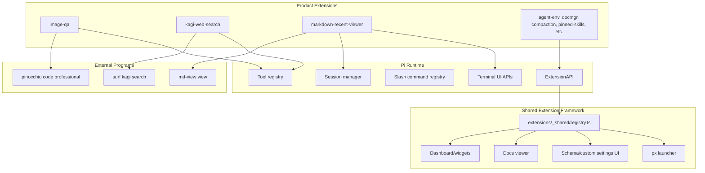

# Pi Extensions Shared Framework and Tool Surface Deep Dive

This report explains the current state of the Pi extensions repository after the recent work on the shared extension framework, LLM-callable tools, TUI overlays, testing practice, and repository documentation. It is written as a technical article rather than a changelog. The goal is to make the architecture legible: what the extension framework is for, how extensions declare themselves, how tools delegate to external programs safely, how terminal UI fits into the model, and how we now validate the whole system in a repeatable way.

The source repository is `/home/manuel/code/wesen/2026-04-21--pi-extensions`. The recent work added three product-shaped extensions: `image-qa`, `kagi-web-search`, and `markdown-recent-viewer`. It also produced a testing guide and rewrote the repository README so the project describes itself as an extension collection and framework, not as transcript-analysis notes.

> [!summary]
> The central design move is that every extension registers its product surface through `registerPiExtension()`: metadata, actions, docs, settings, widgets, commands, and tools all become discoverable contributions.
>
> The central implementation move is to keep extensions thin at the boundary: `image-qa` delegates image interpretation to `pinocchio`, `kagi-web-search` delegates search to `surf`, and `markdown-recent-viewer` delegates rendered Markdown viewing to `md-view`.
>
> The central correctness move is that each extension chooses a precise source of truth: explicit tool parameters for image/search calls, Pi session history for recently edited Markdown files, and tmux smoke tests for live validation.

## The project in one paragraph

The Pi extensions repository is now a local product surface for the Pi coding agent. It contains extensions that change how Pi behaves, extensions that add tools the model can call, extensions that render state in terminal UI, and documentation that explains how to build and test the next one. The repository is organized around a shared registry in `extensions/_shared/registry.ts`. An extension does not only register slash commands. It declares its capabilities in a common shape. The launcher (`/px`) and dashboard can then present those capabilities through one coherent interface.

That one decision changes the project. Without a registry, every extension has to invent its own discovery path: a command name, a settings command, a status command, a README somewhere, and maybe a widget. With the registry, those pieces become fields on one registration object. The extension remains free to use Pi's low-level APIs, but it also describes itself to the rest of the system.

## Why the shared framework exists

A coding agent accumulates local affordances quickly. At first, adding one more slash command is cheap. After ten extensions, the user has to remember command names, aliases, status commands, reset commands, and help locations. That is not a scaling problem in TypeScript; it is a scaling problem in the interaction model.

The shared framework solves that by separating extension implementation from extension presentation. The implementation still lives in an ordinary Pi extension module. The presentation is declared as data:

```ts
registerPiExtension({
  id: "my-extension",
  name: "My Extension",
  description: "What this extension does.",
  commands: ["my-extension"],
  tags: ["demo"],
  run: async (ctx) => ctx.ui.notify("ready", "info"),
  actions: [/* named user-facing verbs */],
  docs: [/* help pages */],
  settings: {/* schema or custom UI */},
  widgets: [/* dashboard/status surfaces */],
});
```

The registry does not execute business logic by itself. It stores a stable description of what each extension contributes. The launcher and dashboard read that registry and decide how to render it. This keeps extension code small while giving the user one place to discover actions, documentation, settings, and status.

The registry contract lives at:

```text
/home/manuel/code/wesen/2026-04-21--pi-extensions/extensions/_shared/registry.ts
```

The important types are:

| Type | Role |
|---|---|
| `PiExtensionRegistration` | The complete contribution record for one extension. |
| `PiExtensionAction` | A named user-facing verb with a stable id and callback. |
| `PiExtensionDoc` | Inline, file-backed, or dynamically loaded documentation. |
| `PiExtensionSettingsContribution` | Either schema settings or a custom settings component. |
| `PiDashboardWidget` | A cheap render function for status/dashboard surfaces. |

The shared registry uses `Symbol.for("wesen.pi.extensions.registry.v1")` to store global registry state. That detail matters because extensions are loaded independently, but they need to contribute to the same shared list. The registry is deliberately small: a map keyed by extension id, plus helper functions such as `listPiExtensions()` and `listPiDashboardWidgets()`.

## The architecture after the recent work

The repository now has three layers:



The framework layer is not a replacement for Pi. It is a local product layer on top of Pi's documented extension API. Pi still owns model streaming, session persistence, tool execution, terminal rendering, cancellation, and reload. The shared framework owns discovery and consistency across extensions.

## How an extension is shaped

A normal extension in this repository has three responsibilities.

First, it registers with the shared framework. This makes it visible in `/px`, connects docs/settings/actions, and gives it a stable identity. The stable id matters because dashboard layout and user references depend on it.

Second, it uses Pi's native extension APIs for the behavior that Pi itself must know about. If the extension exposes an LLM-callable tool, it calls `pi.registerTool()`. If it needs a command, it calls `pi.registerCommand()`. If it needs session history, it reads `ctx.sessionManager`. If it needs a modal, it uses `ctx.ui.custom()`.

Third, it keeps its user-facing documentation next to the code and registers that documentation through the shared framework. The docs are not an afterthought; they are part of the extension's UI. A user should be able to open `/px`, select an extension, press `?`, and understand what it does.

A minimal product-shaped extension therefore looks like this:

```text
extensions/my-extension/
  index.ts      # registration and runtime behavior
  README.md     # user-facing documentation
```

A richer extension that owns TUI or nontrivial extraction logic splits those responsibilities:

```text
extensions/markdown-recent-viewer/
  index.ts      # registration, commands, settings, md-view invocation
  history.ts    # session-history extraction
  ui.ts         # picker component
  README.md     # user-facing docs
```

This split is not about ceremony. It protects the main registration file from becoming an unreviewable mixture of UI rendering, data extraction, settings, and process execution.

## Case study 1: Image QA as a stateless VLM boundary

The `image-qa` extension adds a tool called `ask_questions_about_images`. The tool lets the model ask a vision-capable model questions about one or more image files. It delegates to Pinocchio:

```bash
pinocchio code professional \
  --profile <profile> \
  --images img1.png,img2.png \
  --non-interactive \
  "question text"
```

The implementation lives in:

```text
extensions/image-qa/index.ts
extensions/image-qa/README.md
```

The extension has two settings:

| Setting | Default | Meaning |
|---|---:|---|
| `profile` | `gpt-5-low` | Pinocchio profile used for the VLM call. |
| `timeout` | `120` | Maximum seconds to wait for Pinocchio. |

The tool's core logic is deliberately simple:

```ts
const resolved = images.map((p) => resolve(ctx.cwd, p));
const missing = resolved.filter((p) => !existsSync(p));
if (missing.length > 0) return errorResult(...);

const args = [
  "code", "professional",
  "--profile", state.profile,
  "--images", resolved.join(","),
  "--non-interactive",
  question,
];

const result = await pi.exec("pinocchio", args, {
  signal,
  timeout: state.timeout * 1000,
});
```

Two details make this extension safe and useful.

The first is that it uses `pi.exec("pinocchio", args, ...)` rather than shell interpolation. Search queries, filenames, and questions can contain spaces and punctuation. Passing argv directly avoids an entire class of quoting mistakes.

The second is that the tool description teaches the caller how to use the boundary. The Pinocchio call is non-interactive. Each call starts fresh. The VLM does not remember previous images, previous questions, or the current Pi conversation. The tool metadata therefore says that the `question` must contain surrounding context. It also says that multiple images can be provided in one call for before/after comparisons, diagram comparisons, or related photos.

The extension also documents the limits of the VLM. The output is an interpretation, not a ground-truth visual measurement. The VLM may miss small details, misread text, hallucinate objects, or describe a comparison imperfectly. This warning belongs in the tool metadata, not only in the README, because the LLM sees the tool description when deciding how to call it.

The tool contract teaches the model three rules:

- Include all relevant context in the `question` because the tool is stateless.
- Use multiple images in one call when the task is comparative.
- Treat the answer as a VLM interpretation and verify important details when possible.

Those rules are part of the API. They are not documentation decoration.

## Case study 2: Kagi Web Search as a browser-backed search tool

The `kagi-web-search` extension adds a tool called `kagi_web_search`. It delegates web search to the local Surf CLI:

```bash
surf kagi search --query "search terms"
```

The implementation lives in:

```text
extensions/kagi-web-search/index.ts
extensions/kagi-web-search/README.md
```

The tool exposes a small schema:

| Parameter | Required | Meaning |
|---|---:|---|
| `query` | yes | Search query to run on Kagi. |
| `max_results` | no | Per-call result limit; defaults to extension setting. |

The extension settings are similarly small:

| Setting | Default | Meaning |
|---|---:|---|
| `maxResults` | `10` | Default number of rows returned. |
| `timeoutMs` | `120000` | Surf socket timeout and execution budget. |

The implementation trims the query, rejects an empty query, computes the result limit, and calls Surf with argv:

```ts
const args = [
  "kagi", "search",
  "--query", query,
  "--max-results", String(maxResults),
  "--timeout-ms", String(timeoutMs),
];

const result = await pi.exec("surf", args, {
  signal,
  timeout: timeoutMs + 5_000,
});
```

The important design choice is that the extension returns Surf's default Markdown report. That output is already suitable for an agent: titles, URLs, display URLs, snippets, and result counts are all text. The extension does not try to invent a second search-result model unless there is a consumer that needs structured rows.

A live tmux smoke test proved the full path:

```text
Pi agent -> kagi_web_search -> pi.exec -> surf kagi search -> Kagi markdown -> agent summary
```

The test query was `Kagi search test` with `max_results=1`. The tool returned Kagi's Markdown report and the agent summarized the top result. This matters because `timeout 20 pi --list-models` only proves registration. It does not prove that Surf can reach the browser/native host, that Kagi is accessible, or that output flows back through Pi's tool result path.

## Case study 3: Markdown Recent Viewer as session-history UI

The `markdown-recent-viewer` extension is the most interesting of the new extensions because it uses Pi's session history as its source of truth. It opens a TUI picker listing Markdown files that the agent edited or wrote in the current session. Pressing Enter runs:

```bash
md-view view /absolute/path/to/file.md
```

The implementation lives in:

```text
extensions/markdown-recent-viewer/index.ts
extensions/markdown-recent-viewer/history.ts
extensions/markdown-recent-viewer/ui.ts
extensions/markdown-recent-viewer/README.md
```

The first design tried to scan the filesystem and sort Markdown files by `mtime`. That was wrong for the product. Filesystem modification time answers the question “what changed on disk recently?” The user wanted “what Markdown files did the agent edit or write in this session?” Those are different questions.

The corrected extractor reads Pi session history:

```ts
const entries = options.currentBranchOnly
  ? ctx.sessionManager.getBranch()
  : ctx.sessionManager.getEntries();
```

It then walks session messages in order. Assistant messages contain tool call blocks. Tool result messages confirm whether those tool calls succeeded. The target path is in the assistant tool-call arguments. The success flag is in the later tool result. The extractor must join those two facts by `toolCallId`.

The algorithm is:

```text
pendingById = empty map
latestByPath = empty map
occurrence = 0

for each session entry in branch order:
  if entry is an assistant message:
    for each content block:
      if block is toolCall and block.name is edit/write:
        path = block.arguments.path
        if path extension is .md or .markdown:
          pendingById[block.id] = normalized path + tool name

  if entry is a toolResult message:
    if toolName is edit/write and isError is false:
      pending = pendingById[toolCallId]
      if pending exists and file exists:
        occurrence += 1
        latestByPath[pending.path] = item with occurrence

return latestByPath values sorted by occurrence descending
```

The implementation is in `history.ts`:

```ts
if (message.role === "assistant" && Array.isArray(message.content)) {
  for (const block of message.content) {
    if (!isToolCallBlock(block)) continue;
    if (!isMarkdownToolName(block.name)) continue;
    const rawPath = block.arguments.path;
    if (typeof rawPath !== "string" || !rawPath.trim()) continue;
    const absolutePath = resolve(ctx.cwd, rawPath);
    if (!isMarkdownPath(absolutePath, includeExtensions)) continue;
    pendingById.set(block.id, { ... });
  }
}

if (message.role !== "toolResult") continue;
if (!isMarkdownToolName(message.toolName)) continue;
if (message.isError === true) continue;
const pending = pendingById.get(message.toolCallId);
if (!pending) continue;
```

This is the right model because it uses semantic history rather than incidental filesystem state. A Markdown file written by `bash` does not appear. A failed `write` call does not appear. A file edited on disk by another process does not appear. The picker is a view over the agent's actual session work.

The UI component in `ui.ts` follows Pi's component contract. It owns query state, selected index, scroll position, and cached render lines. It renders a framed modal and handles keyboard input:

| Key | Behavior |
|---|---|
| `Enter` | Open selected file. |
| `↑` / `↓` | Move selection. |
| `PageUp` / `PageDown` | Jump selection. |
| `/` | Enter search mode. |
| `r` | Refresh from session history. |
| `Esc` / `Ctrl+C` | Close. |

The smoke test used a real Pi session. The agent was asked to create `/tmp/mdview-smoke.md` using the `write` tool. Then `/md-recent` opened the picker, which showed `/tmp/mdview-smoke.md` as a `write` entry. Pressing Enter produced the notification:

```text
Opened /tmp/mdview-smoke.md with md-view
```

That test matters because a shell-created file would not prove the extension. The source of truth is session tool history, so the test had to produce a real session `write` tool call.

## The common pattern across the three tools

The three new extensions are different in purpose, but they share one implementation pattern: they choose a narrow boundary, validate inputs, delegate to a tool that already owns the domain, and return a result in the most useful shape for Pi.

| Extension | Boundary | Source of truth | External command | Result shape |
|---|---|---|---|---|
| `image-qa` | VLM image interpretation | Explicit image paths + question | `pinocchio code professional --images` | Text answer from VLM. |
| `kagi-web-search` | Current web search | Explicit query | `surf kagi search --query` | Markdown search report. |
| `markdown-recent-viewer` | Rendered Markdown viewing | Pi session `edit`/`write` history | `md-view view` | Browser rendering + Pi notification. |

The extensions do not duplicate Pinocchio, Surf, or md-view. They make those tools available at the right Pi boundary. This keeps the extension code small and makes the failure modes easier to reason about.

The common execution pattern is:

```ts
const args = [/* command-specific argv */];
const result = await pi.exec(binary, args, { signal, timeout });
if (result.code !== 0) return errorResult(result);
return successResult(result.stdout);
```

The important detail is `args`. The code builds argv arrays rather than command strings. This is a correctness rule. Questions, search queries, and file paths are user-controlled text. They should not be placed into shell strings unless the extension deliberately implements shell escaping and tests it.

## TUI as a first-class extension surface

The repository's TUI work is no longer only demonstration code. `markdown-recent-viewer` uses TUI for a concrete workflow: inspect session history, filter paths, select a file, and trigger an external viewer.

Pi TUI components have a simple contract:

```ts
interface Component {
  render(width: number): string[];
  handleInput?(data: string): void;
  invalidate(): void;
}
```

A component is a state machine plus a renderer. It does not create DOM nodes. It receives terminal width and returns terminal rows. Keyboard input mutates component state and requests a redraw. That model is direct enough that complex overlays can be built without a large UI framework.

The `RecentMarkdownPicker` component owns these fields:

```ts
private query = "";
private searchActive = false;
private selected = 0;
private scroll = 0;
private cachedWidth: number | undefined;
private cachedLines: string[] | undefined;
```

That state is enough to implement selection, filtering, scrolling, caching, and modal close behavior. The component does not open `md-view` itself. It returns a result to `index.ts`:

```ts
export type RecentMarkdownPickerResult =
  | { action: "open"; item: RecentMarkdownItem }
  | { action: "refresh" }
  | { action: "cancel" };
```

This separation is important. UI components should select intent. The extension command handler should perform side effects. That keeps rendering code testable and avoids burying process execution inside terminal drawing logic.

## Testing practice: from load checks to live proof

The testing guide in `docs/pi-testing-guide.md` came out of real friction. The repository now has a practical validation sequence.

The first validation step is the load check:

```bash
timeout 20 pi --list-models
```

This loads extensions, resolves TypeScript imports, runs registration code, and exits. It catches import errors and registration crashes. It does not execute tools, render overlays, or prove external CLIs work.

The second validation step is a direct command/tool check. For example:

```bash
surf kagi search --query "Kagi search test" --max-results 1 --timeout-ms 30000
```

This proves the external dependency works outside Pi. If this fails, debugging the extension first is a waste of time.

The third validation step is a tmux smoke test. A tmux session lets us start Pi, send keystrokes, and capture terminal output:

```bash
SESSION="pi-smoke"
tmux new-session -d -s "$SESSION" -x 120 -y 40
tmux send-keys -t "$SESSION" "pi" Enter
sleep 5
tmux capture-pane -t "$SESSION" -p -S -80 | grep "extension-id"
```

The new extensions were tested this way:

| Extension | Live proof |
|---|---|
| `image-qa` | A red PNG was analyzed and described as solid bright red. |
| `kagi-web-search` | A Kagi search returned Markdown results and the agent summarized the top result. |
| `markdown-recent-viewer` | A live `write` tool call created a Markdown file; `/md-recent` listed it; Enter opened it with `md-view`. |

This testing sequence matters because extension bugs often happen at boundaries. A tool can register correctly but fail when the external CLI is missing. A TUI can load correctly but fail to handle Enter. A session-history extractor can type-check but fail against real persisted messages. The smoke test must exercise the actual boundary the extension owns.

## Documentation as part of the product

The README rewrite was not cosmetic. The old README still contained a large go-minitrace section. That content was useful in another context, but it did not describe this repository anymore. The repository is now about extensions and the shared framework.

The new README explains:

- what the repository contains;
- what the shared framework does;
- which extensions currently exist;
- how local symlink installation works;
- how to create a new extension;
- how to validate and smoke test;
- how docmgr tickets fit into extension work;
- what conventions every extension should follow.

This matters because extension authoring is repetitive in a useful way. Each new extension should not rediscover the same framework concepts. The README is now the first page of that workflow, and the deeper docs are the next layer.

The documentation hierarchy is:

| Document | Purpose |
|---|---|
| `README.md` | Project orientation and current extension inventory. |
| `docs/pi-shared-extension-framework-guide.md` | How to write extensions with the shared framework. |
| `docs/pi-tui-ui-authoring-guide.md` | How to write Pi TUI components. |
| `docs/pi-testing-guide.md` | How to validate load, commands, tools, settings, and overlays. |
| `docs/pi-compaction-textbook.md` | How compaction works and how compaction-aware extensions should behave. |
| `ttmp/.../reference/01-diary.md` | Chronological implementation record for each ticket. |

The documentation is deliberately layered. The README should not become the full framework textbook. It should route readers to the right source.

## The implementation diary as engineering memory

Each non-trivial extension was tracked through docmgr tickets and diary entries:

| Ticket | Extension/work | What the diary preserved |
|---|---|---|
| `IMGQA-001` | `image-qa` | Tool contract, stateless VLM semantics, Pinocchio invocation, tmux smoke test, VLM caveats. |
| `KAGI-001` | `kagi-web-search` | Surf CLI contract, tool schema, symlink deployment, live search proof. |
| `MDVIEW-001` | `markdown-recent-viewer` | Design correction from filesystem mtime to session history, extractor algorithm, TUI picker, md-view smoke test. |

The diaries are valuable because they preserve decisions that are not obvious from final code. The most important example is `MDVIEW-001`. The final `history.ts` simply reads session messages and correlates tool calls with tool results. Without the diary, a future maintainer might ask why the extension does not scan the filesystem. The diary records the reason: filesystem mtime was the wrong source of truth for the user's desired workflow.

A good diary entry records the prompt context, implementation work, what failed, what was tricky, and how to validate. That is not bureaucracy. It is an engineering memory structure for agent-assisted development.

## Failure modes and corrected assumptions

The recent work surfaced several useful failure modes.

### Load success is not tool success

`timeout 20 pi --list-models` proves that an extension loads. It does not prove that `pinocchio`, `surf`, or `md-view` works. Tool extensions need live tool execution tests.

### Filesystem recency is not session recency

The first `markdown-recent-viewer` design sorted Markdown files by filesystem modification time. That would have shown files touched by unrelated processes and hidden the semantic fact that the user wanted files edited or written by Pi in the current session. The corrected design reads `edit` and `write` tool history.

### Tool descriptions are part of the runtime contract

The `image-qa` extension initially needed stronger docs for multi-image comparisons and VLM limitations. That information had to live in the tool metadata because the model reads tool metadata when deciding what to call. A README-only warning would help humans but not the calling model.

### tmux-driving `/px` is fragile

The testing work showed that direct commands and explicit tool-use prompts are more reliable in tmux than driving every launcher interaction with keystrokes. `/px` should still be tested, but the test guide now treats tmux timing and search matching as real operational concerns.

### `pi.exec` returns `code`, not `exitCode`

The initial `image-qa` design sketch used `exitCode`. The actual `ExecResult` type uses `code`. Verifying against type declarations before implementation avoided a runtime mistake.

## Working rules that emerged

The current project has a set of practical rules. These are more important than any single extension.

- Every extension should call `registerPiExtension()` and provide a clear name, description, docs, and default action.
- Direct commands are compatibility and speed paths; `/px` is the discovery surface.
- Tool extensions should keep schemas small and document important operational constraints in tool metadata.
- External commands should be invoked through `pi.exec(binary, args, ...)` with argv arrays.
- A tool should validate local preconditions before delegating, such as image file existence or non-empty queries.
- TUI components should return intent to the extension handler; side effects belong in the handler.
- Session-derived features should use `ctx.sessionManager` rather than reconstructing state from the filesystem.
- Dashboard widgets should render cheap state, not perform scans or expensive external calls.
- Every extension should pass `timeout 20 pi --list-models` before commit.
- Every extension with a tool, overlay, or external process should receive a live tmux smoke test.

## What changed in the repository

The recent commit sequence shows the project moving from individual extension work toward a documented extension platform:

| Commit | Meaning |
|---|---|
| `2d8a111` | Added `image-qa` and the `ask_questions_about_images` tool. |
| `8a4e7b8` | Added `docs/pi-testing-guide.md`. |
| `e299797` | Added `kagi-web-search` and the `kagi_web_search` tool. |
| `ff2d7bd` | Clarified image multi-image and VLM limitations. |
| `20db822` | Corrected Markdown viewer design to use session edit/write history. |
| `c5c1ce7` | Implemented `markdown-recent-viewer`. |
| `ef2cec4` | Rewrote `README.md` around the extension framework. |

The resulting project is easier to enter. A future extension author can read the README, follow the shared framework guide, use the TUI guide when needed, validate with the testing guide, and inspect recent extensions as working examples.

## Current status

The repository now contains a mature local extension set. The core framework is already in use by many extensions: `agent-env`, `direnv-bash`, `docmgr`, `pinned-skills`, compaction extensions, session tooling, demos, and the three new product extensions. The newest extensions demonstrate three extension classes:

- a tool that delegates to an AI/VLM CLI (`image-qa`);
- a tool that delegates to browser-backed web search (`kagi-web-search`);
- a TUI workflow that reads Pi session history and launches a viewer (`markdown-recent-viewer`).

All three are symlinked into `~/.pi/agent/extensions` and were validated in live sessions. The repository README now accurately describes that state.

## Near-term next steps

The next useful improvements are incremental.

1. **Make `/px` smoke testing less fragile.** Direct command and tool tests work well through tmux. Launcher testing still depends on timing and search behavior. A small helper script or Pi-side inspection command would make this more reliable.
2. **Add headless options where useful.** `markdown-recent-viewer` could expose an `md-view --no-browser` setting for test sessions where opening a browser is not desired.
3. **Add focused unit tests for pure extractors.** The `markdown-recent-viewer` history extractor is pure enough to test with synthetic session entries. That would complement the live smoke test.
4. **Keep tool metadata sharp.** The image and search tools show that metadata is runtime behavior. Future tools should treat descriptions, snippets, and guidelines as part of the implementation.
5. **Continue using docmgr diaries.** The diaries captured several design corrections that would otherwise be lost.

## Closing

The Pi extensions repository has become a small extension platform. The important change is not only that there are more extensions. The important change is that there is now a repeatable way to build them: register contributions through the shared framework, keep side effects at narrow Pi or external-tool boundaries, document the tool contract where the model can see it, validate with a fast load check, and prove the live behavior with tmux.

That process is now visible in code, docs, tickets, and the README. A future extension can be smaller because the framework, patterns, and tests are already in place.
