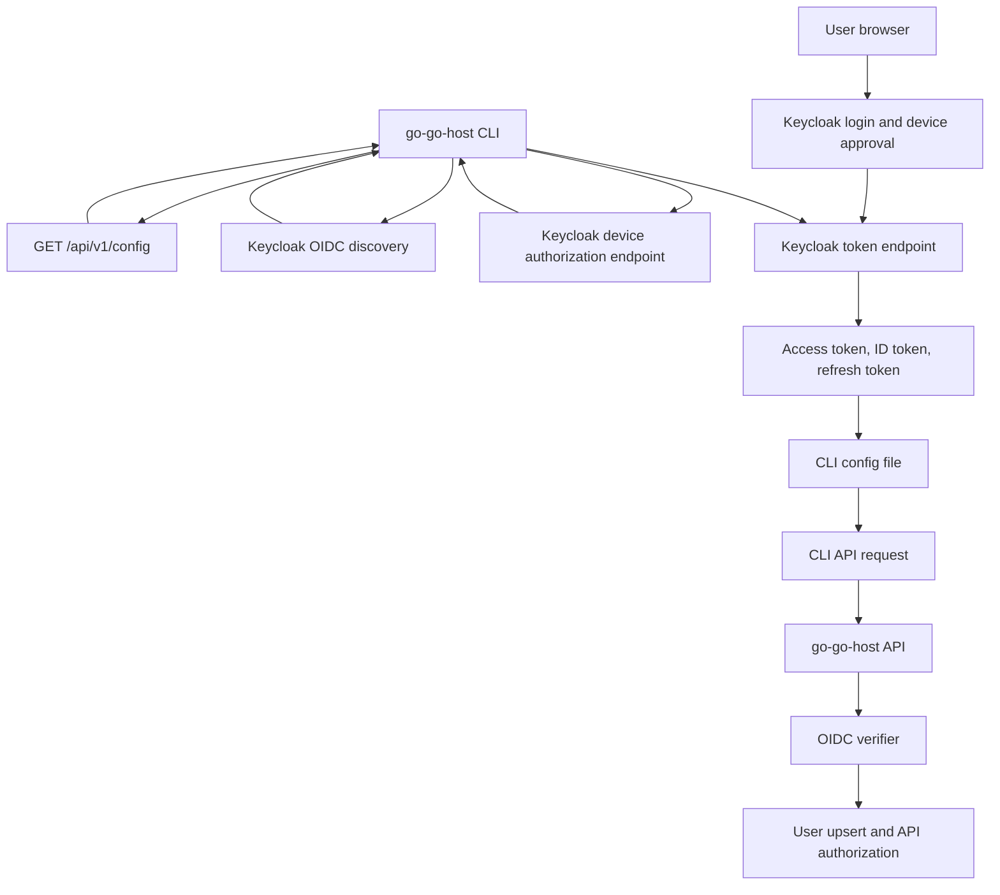

# go-go-host OAuth Device Flow CLI — A Technical Deep Dive

This report explains how `go-go-host` gained production-grade human CLI login through OAuth 2.0 Device Authorization Grant. The work connected the Go CLI, the Go API token verifier, Keycloak client configuration, Terraform-managed realm state, K3s GitOps deployment, and operator validation into one authentication path.

The main result is that a user can run `go-go-host login --api-url https://hosting.yolo.scapegoat.dev`, approve the login in Keycloak from a browser, and then use ordinary CLI commands without manually copying an OIDC token. The CLI never receives the user's password. It receives OAuth tokens only after Keycloak completes the browser-side login and device-code approval.

> [!summary]
> HOST-011 completed the human CLI authentication path for `go-go-host`.
> 1. Production Keycloak now has a public `go-go-host-cli` client with Device Authorization Grant enabled.
> 2. The API accepts OIDC tokens issued for both `go-go-host-dashboard` and `go-go-host-cli` while keeping issuer, signature, expiry, and client matching checks.
> 3. The CLI implements device authorization, token polling, refresh-aware request setup, and logout revocation.
> 4. The beta deployment now publishes `oidc.deviceClientId = go-go-host-cli` from `/api/v1/config`.

## The problem this work solved

The first `go-go-host` CLI supported two authentication inputs. Local development could use `--dev-user`, which sends an `X-Go-Go-Host-User` header to a server running with development authentication enabled. Non-development smoke tests could use `--bearer-token`, which stores a pasted OIDC token. Those modes were sufficient for early API development, but neither is the correct production login experience for a human user.

A production CLI user should authenticate through the same identity system as the dashboard. That identity system is Keycloak. Keycloak already owns GitHub social login, account linking, session policy, refresh-token policy, required actions, and future MFA policy. If the CLI asks for a password directly, the CLI bypasses those controls. If the CLI asks the user to paste a bearer token, the user must extract a security-sensitive value from a browser or another tool. Both approaches move authentication knowledge out of Keycloak and into places that should not own it.

OAuth Device Authorization Grant solves this specific problem. The terminal program starts the login process by requesting a `device_code`, a human-readable `user_code`, and a verification URL from Keycloak. The user completes login in a browser. The CLI polls Keycloak until the browser-side approval is complete, then stores the returned access and refresh tokens for later API calls.

The important design constraint is that Device Authorization Grant is for human CLI sessions. It is not the deploy-agent authentication model. Durable deploy agents in `go-go-host` use enrollment tokens and Ed25519 signed requests. HOST-011 did not change that machine identity model.

## Final user experience

The production login path is now:

```bash
go-go-host login --api-url https://hosting.yolo.scapegoat.dev
```

The command prints a browser URL and user code:

```text
Open this URL in your browser:
  https://auth.yolo.scapegoat.dev/realms/go-go-host/device?user_code=BYCK-WOKB

Enter this code if prompted:
  BYCK-WOKB

Waiting for browser authorization...
```

The user opens the URL, authenticates through Keycloak, and confirms the code. After approval, the CLI receives tokens, writes its local config file, and validates the token against the API by calling `/api/v1/me`.

The config file defaults to:

```text
~/.config/go-go-host/config.yaml
```

Tests and isolated sessions can use a different file:

```bash
export GO_GO_HOST_CLI_CONFIG=$(mktemp)
```

Once logged in, existing commands use the stored OIDC session:

```bash
go-go-host me --output table
go-go-host org list
go-go-host site list --org-id org_...
go-go-host deploy --site-id site_... --path ./bundle.tar.gz
```

The command `go-go-host logout` clears local authentication state. When the current session has a refresh token and Keycloak publishes a revocation endpoint, logout best-effort revokes the refresh token before clearing local state.

## Architecture at completion

The finished system has four cooperating parts. Each part has a separate responsibility, and the implementation keeps those responsibilities explicit.



The API does not issue the CLI tokens. Keycloak issues them. The API publishes enough public configuration for the CLI to know which issuer and client ID to use, and then the API verifies the resulting bearer token on each protected request.

The production configuration endpoint now returns the device client ID:

```json
{
  "devAuth": false,
  "oidc": {
    "clientId": "go-go-host-dashboard",
    "deviceClientId": "go-go-host-cli",
    "issuer": "https://auth.yolo.scapegoat.dev/realms/go-go-host",
    "logoutRedirectPath": "/app",
    "redirectPath": "/app/auth/callback",
    "scopes": ["openid", "profile", "email"]
  }
}
```

This field matters because the dashboard and CLI are distinct OAuth clients. The dashboard uses authorization code with PKCE. The CLI uses Device Authorization Grant. They share one issuer and one API, but they should not be forced into one Keycloak client definition.

## Why the CLI has a separate Keycloak client

The implementation uses a public Keycloak client named `go-go-host-cli`. This is deliberate. A browser dashboard client and a CLI client have different allowed grant types, redirect requirements, and threat assumptions.

The dashboard client is named `go-go-host-dashboard`. It uses authorization code with PKCE and has browser redirect URIs such as `/app/auth/callback`. It also has browser web-origin settings because it is used from JavaScript.

The CLI client is named `go-go-host-cli`. It has no browser redirect URI requirement for the login path implemented here. It has Device Authorization Grant enabled. It is still a public client, because a distributed CLI binary cannot keep a client secret. Its important Terraform settings are:

```hcl
resource "keycloak_openid_client" "cli" {
  realm_id                                  = module.realm.id
  client_id                                 = var.cli_client_id
  name                                      = var.cli_client_id
  enabled                                   = true
  access_type                               = "PUBLIC"
  standard_flow_enabled                     = false
  implicit_flow_enabled                     = false
  direct_access_grants_enabled              = false
  service_accounts_enabled                  = false
  use_refresh_tokens                        = true
  oauth2_device_authorization_grant_enabled = true
  oauth2_device_code_lifespan               = var.cli_device_code_lifespan
  oauth2_device_polling_interval            = var.cli_device_polling_interval
}
```

The explicit disabling of other grants is part of the design. The CLI client should not accidentally become a password-grant client or a service-account client. It is a public client for human device login.

The production defaults are:

| Setting | Value | Reason |
|---|---:|---|
| Client ID | `go-go-host-cli` | Separates CLI token issuance from dashboard token issuance. |
| Device code lifespan | `600` seconds | Gives a user enough time to open the browser and approve the login. |
| Polling interval | `5` seconds | Matches RFC 8628 defaults and avoids unnecessary token endpoint load. |
| Access type | `PUBLIC` | The CLI cannot safely store a client secret. |
| Direct access grants | disabled | The CLI must not collect the user's password. |
| Service accounts | disabled | Human CLI login is not machine-to-machine identity. |

## Backend token acceptance

The backend originally accepted OIDC tokens for the dashboard client. HOST-011 extended that rule so the API can accept tokens from both the dashboard client and the CLI client.

The implementation added these configuration fields:

```go
type Config struct {
    OIDCClientID           string
    OIDCDeviceClientID     string
    OIDCAcceptedClientIDs  []string
}
```

The default behavior is conservative. If no explicit accepted-client list is configured, the server uses the dashboard client and the device client. Production GitOps sets the list directly:

```yaml
oidcDeviceClientId: "go-go-host-cli"
oidcAcceptedClientIds:
  - "go-go-host-dashboard"
  - "go-go-host-cli"
```

The verifier still performs issuer, signature, and expiry checks through `go-oidc`. It intentionally skips the library's built-in single-client check and enforces local client matching afterward:

```go
a.verifier = provider.Verifier(&oidc.Config{
    ClientID: clientID,
    SkipClientIDCheck: true,
})
```

This is not a weakening of token verification by itself. It changes where the client match happens. The token still must be issued by the configured issuer, must have a valid signature, and must not be expired. After that, `go-go-host` checks whether the token belongs to one of the accepted clients.

The local match accepts either `aud` or `azp`:

```go
func tokenMatchesAnyClient(clientIDs []string, tokenAudience []string, claims oidcClaims) bool {
    for _, clientID := range clientIDs {
        if tokenMatchesClient(clientID, tokenAudience, claims) {
            return true
        }
    }
    return false
}
```

The `azp` check is important for Keycloak access tokens. Browser and public-client access tokens do not always include the client ID in `aud` unless an audience mapper is configured. They do include `azp`, the authorized party. The backend accepts either claim because both can represent the client for this purpose.

The acceptance rule is therefore:

1. The token must be issued by `https://auth.yolo.scapegoat.dev/realms/go-go-host`.
2. The token signature and expiry must verify against that issuer.
3. The token must match one configured accepted client in `aud` or `azp`.
4. The API upserts the user from OIDC subject, email, and display-name claims.

## The CLI implementation

The CLI implementation lives primarily in:

```text
cmd/go-go-host/cmds/login.go
cmd/go-go-host/cmds/oidc_device.go
cmd/go-go-host/cmds/cli_config.go
cmd/go-go-host/cmds/logout.go
cmd/go-go-host/cmds/support.go
```

The login command keeps its previous development and manual-token behavior. If `--dev-user` or `--bearer-token` is present, login writes a simple config file and returns. If neither is present, login starts Device Authorization Grant.

The production path is:

```go
func (c *LoginCommand) runDeviceLogin(ctx context.Context, settings *LoginSettings, gp middlewares.Processor) error {
    apiCfg, err := fetchPublicConfig(ctx, settings.APIURL)
    clientID := chooseDeviceClientID(settings, apiCfg)
    scopes := chooseScopes(settings, apiCfg)
    discovery, err := discoverOIDC(ctx, apiCfg.OIDC.Issuer)
    device, err := startDeviceAuthorization(ctx, discovery.DeviceAuthorizationEndpoint, clientID, scopes)
    printDeviceInstructions(device)
    tok, err := pollDeviceToken(ctx, discovery.TokenEndpoint, clientID, device)
    cfg := CLIConfig{APIURL: settings.APIURL, OIDC: sessionWithToken(apiCfg.OIDC.Issuer, clientID, scopes, tok, "")}
    saveCLIConfig(cfg)
    validateWithMeEndpoint(cfg)
}
```

The real code includes error handling and Glazed row output, but this pseudocode shows the sequence. The CLI starts from the API rather than from a hard-coded Keycloak URL. That keeps hosted environments configurable: local development, staging, and production can publish different issuers and client IDs.

### Device authorization request

The request to the device authorization endpoint is form encoded:

```go
form := url.Values{}
form.Set("client_id", clientID)
form.Set("scope", strings.Join(scopes, " "))
```

The response must include:

```json
{
  "device_code": "opaque value for the CLI",
  "user_code": "short code for the human",
  "verification_uri": "browser URL",
  "verification_uri_complete": "browser URL with code, when present",
  "expires_in": 600,
  "interval": 5
}
```

The CLI stores only the values needed to poll and to instruct the user. It prints `verification_uri_complete` when Keycloak provides it, while also printing the `user_code` as a fallback.

### Polling behavior

RFC 8628 defines polling as a protocol with specific error handling. The CLI must not treat every HTTP 400 response as a terminal failure. During device flow, HTTP 400 with `authorization_pending` is normal. It means the user has not approved the request yet.

The implementation handles the relevant OAuth errors:

| Error | CLI behavior |
|---|---|
| `authorization_pending` | Continue polling after the current interval. |
| `slow_down` | Increase the interval by five seconds and continue polling. |
| `access_denied` | Stop and report that browser approval was denied. |
| `expired_token` | Stop and tell the user to run login again. |
| Other OAuth error | Stop and include the provider's error description. |
| Network error | Back off up to thirty seconds and continue until the device code expires. |

The testable polling function accepts a sleeper:

```go
type pollSleeper func(context.Context, time.Duration) error

func pollDeviceTokenWithSleeper(
    ctx context.Context,
    tokenEndpoint string,
    clientID string,
    device deviceAuthorizationResponse,
    sleep pollSleeper,
) (tokenResponse, error)
```

This design makes the polling behavior unit-testable without waiting real seconds. The tests inject a no-op sleeper, record requested intervals, and verify that `authorization_pending` and `slow_down` are handled correctly.

### Token storage and refresh

The CLI config schema now has an optional structured OIDC session:

```go
type CLIConfig struct {
    APIURL      string          `yaml:"apiUrl"`
    DevUser     string          `yaml:"devUser,omitempty"`
    BearerToken string          `yaml:"bearerToken,omitempty"`
    OIDC        *CLIOIDCSession `yaml:"oidc,omitempty"`
}

type CLIOIDCSession struct {
    Issuer       string    `yaml:"issuer"`
    ClientID     string    `yaml:"clientId"`
    Scopes       []string  `yaml:"scopes,omitempty"`
    AccessToken  string    `yaml:"accessToken"`
    IDToken      string    `yaml:"idToken,omitempty"`
    RefreshToken string    `yaml:"refreshToken,omitempty"`
    TokenType    string    `yaml:"tokenType,omitempty"`
    ExpiresAt    time.Time `yaml:"expiresAt,omitempty"`
}
```

The file is written with mode `0600`. That is the correct beta behavior for a local CLI token file. It does not make the file equivalent to a system credential store, but it prevents accidental read access by other local users on normal Unix systems.

The shared settings resolver now refreshes tokens before command execution when the access token is close to expiry:

```go
if tokenExpiresSoon(cfg.OIDC.ExpiresAt) && cfg.OIDC.RefreshToken != "" {
    refreshed, err := refreshOIDCToken(ctx, cfg.OIDC)
    cfg.OIDC = refreshed
    saveCLIConfig(cfg)
}
cfg.BearerToken = cfg.OIDC.AccessToken
```

The important detail is that existing CLI commands do not need to implement OIDC refresh themselves. They continue using the shared request helpers. The resolved bearer token comes from the OIDC session when no development user or manual bearer token overrides it.

### Logout and revocation

Logout has two responsibilities:

1. Remove local authentication material from the config file.
2. Ask Keycloak to revoke the refresh token when possible.

The command intentionally clears local state even if network revocation fails. A failed revocation should not trap the user in a locally authenticated state. The command reports `revoke_error` in its output so the operator can see whether the network-side cleanup succeeded.

```bash
go-go-host logout
```

Output shape:

```text
+---------------------+---------+---------+--------------+
| config_path         | cleared | revoked | revoke_error |
+---------------------+---------+---------+--------------+
| /tmp/tmp.zOBPJnpG7K | true    | true    |              |
+---------------------+---------+---------+--------------+
```

## Environment variables and command flags

One practical failure mode appeared during manual validation. The user created a clean config file with `GO_GO_HOST_CLI_CONFIG=$(mktemp)`, ran `logout`, and then ran login without `--dev-user`. The output still showed `auth_mode = dev-user` and `dev_user = foobar-23`.

The cause was not the config file. It was the process environment:

```bash
env | grep GO_GO_HOST
GO_GO_HOST_DEV_USER=foobar-23
GO_GO_HOST_CLI_CONFIG=/tmp/tmp.zOBPJnpG7K
```

The Glazed/Cobra command layer can populate command settings from environment variables. `GO_GO_HOST_DEV_USER` is therefore equivalent to providing `--dev-user foobar-23`. Since the login command preserves the rule that explicit dev-user mode wins over device flow, the CLI correctly wrote a dev-user config instead of starting Keycloak device login.

The correct production smoke setup is:

```bash
unset GO_GO_HOST_DEV_USER
export GO_GO_HOST_CLI_CONFIG=$(mktemp)

go run ./cmd/go-go-host logout
go run ./cmd/go-go-host login --api-url https://hosting.yolo.scapegoat.dev
go run ./cmd/go-go-host me --api-url https://hosting.yolo.scapegoat.dev
```

This failure mode is worth documenting because it is easy to misdiagnose. A clean config file does not override environment-provided command defaults. If `GO_GO_HOST_DEV_USER` is present, the command is still receiving a dev-user setting.

## Local development configuration

The local Keycloak realm import now includes the CLI client. The file is:

```text
/home/manuel/workspaces/2026-05-11/go-go-host-v1/go-go-host/deployments/dev/keycloak/realm-go-go-host.json
```

The local client has the same intended shape as production:

- public client,
- device authorization grant enabled,
- refresh tokens enabled,
- password/direct grants disabled for this login path,
- client ID `go-go-host-cli`.

Local development can still use `--dev-user` when the local API is configured with development authentication. That mode is faster for API work. Device flow exists for testing the real Keycloak path and for production human CLI use.

## Production deployment path

Production required changes in three repositories.

| Repository | Responsibility | Key changes |
|---|---|---|
| `go-go-host` app repo | Backend verifier, CLI implementation, docs, local Keycloak realm | Commits `94e8a6a`, `982f799`, `0614a5f`, `5d6a28e`. |
| Terraform repo | Durable Keycloak realm/client state | Commit `7da4671` adds `keycloak_openid_client.cli`. |
| K3s GitOps repo | Runtime deployment config and app image | Commits `99bff08` and `3db8bf8`. |

The application image deployed for the first complete beta implementation was:

```text
ghcr.io/go-go-golems/go-go-host:sha-0614a5f
```

Argo CD applied the GitOps commit and the deployment reached:

```text
Synced Healthy
```

The running deployment image was verified with:

```bash
kubectl -n go-go-host get deployment go-go-host \
  -o jsonpath='{.spec.template.spec.containers[0].image}{"\n"}'
```

Result:

```text
ghcr.io/go-go-golems/go-go-host:sha-0614a5f
```

## Validation performed

The implementation was validated at several levels.

### Unit and package tests

The full Go test suite passed:

```bash
go test ./... -count=1
```

The new CLI tests cover the most important protocol behavior:

- `authorization_pending` continues polling.
- `slow_down` increases the interval by five seconds.
- successful token response returns an access token.
- `access_denied` terminates the login attempt.
- scope parsing accepts comma-separated and space-separated input and removes duplicates.

### Terraform validation

Terraform validation passed after adding the production CLI client:

```bash
terraform validate
```

The production apply created the CLI client, and the final plan was clean:

```text
No changes. Your infrastructure matches the configuration.
```

### Keycloak endpoint validation

Before the Terraform change, production Keycloak advertised the device authorization endpoint but rejected the dashboard client for device flow:

```json
{
  "error": "unauthorized_client",
  "error_description": "Client is not allowed to initiate OAuth 2.0 Device Authorization Grant. The flow is disabled for the client."
}
```

After the Terraform change, the production endpoint returned a valid device authorization response for `client_id=go-go-host-cli`:

```json
{
  "device_code": "...",
  "user_code": "...",
  "verification_uri": "https://auth.yolo.scapegoat.dev/realms/go-go-host/device",
  "verification_uri_complete": "https://auth.yolo.scapegoat.dev/realms/go-go-host/device?user_code=...",
  "expires_in": 600,
  "interval": 5
}
```

### Production API config validation

After deploying image `sha-0614a5f`, the production API published:

```json
{
  "clientId": "go-go-host-dashboard",
  "deviceClientId": "go-go-host-cli",
  "issuer": "https://auth.yolo.scapegoat.dev/realms/go-go-host"
}
```

This confirmed that the deployed backend binary understood the new config fields and that the GitOps config was applied.

### Interactive login validation

A bounded smoke test confirmed that the CLI can start production device authorization:

```bash
timeout 8s go run ./cmd/go-go-host login --api-url https://hosting.yolo.scapegoat.dev
```

It printed a live Keycloak device URL and code, then timed out before browser approval. After clearing `GO_GO_HOST_DEV_USER`, an interactive login completed successfully.

## Failure modes and diagnostic rules

Device flow crosses several systems, so failures should be diagnosed by the step that failed.

| Symptom | Likely cause | Diagnostic command | Fix |
|---|---|---|---|
| `login` writes `auth_mode = dev-user` | `--dev-user` or `GO_GO_HOST_DEV_USER` is set | `env | grep GO_GO_HOST` | `unset GO_GO_HOST_DEV_USER` before production login. |
| API config has no `oidc` object | API is running in development auth mode or OIDC config is incomplete | `curl -fsS $API/api/v1/config | jq` | Configure issuer/client settings or use `--dev-user` locally. |
| Device endpoint returns `unauthorized_client` | Keycloak client does not allow Device Authorization Grant | POST to device endpoint with `client_id` | Enable `oauth2_device_authorization_grant_enabled` for `go-go-host-cli`. |
| CLI prints URL but never completes | User did not approve before `expires_in` or browser approval failed | Watch terminal error after expiry | Re-run login and approve the code. |
| API rejects token after login | API accepted-client list does not include `go-go-host-cli` | Inspect `/api/v1/config` and GitOps config | Add `go-go-host-cli` to `oidcAcceptedClientIds` and redeploy. |
| Refresh fails later | Refresh token expired or was revoked | Run command with fresh login | Run `go-go-host login` again. |

The environment-variable failure deserves special attention. It can look like a stale config problem, but it is actually command input supplied by the shell environment. In this codebase, local development variables such as `GO_GO_HOST_DEV_USER` are useful, but they must be unset for production device-flow tests.

## Security properties

The implementation has several security properties worth preserving.

First, the CLI never handles the user's password. Authentication happens in Keycloak. GitHub social login, account linking, and future MFA remain inside the identity provider.

Second, the CLI client is public and has only the grant type it needs. It does not have service accounts enabled. It does not have direct access grants enabled. A distributed CLI binary cannot keep a client secret, so using `access_type = "PUBLIC"` is the correct model.

Third, the API verifies tokens by issuer, signature, expiry, and accepted client. Supporting multiple clients does not mean accepting any token from the realm. The accepted client list remains explicit.

Fourth, local token persistence uses a `0600` YAML config file. This is acceptable for beta and straightforward to inspect during development. A future hardening pass can move refresh tokens into the OS credential store while keeping the same higher-level CLI behavior.

Fifth, logout revokes the refresh token when Keycloak supports revocation. Local cleanup does not depend on successful network revocation, which avoids leaving stale local credentials in place after a transient network failure.

## The key implementation choices

Several choices shaped the final implementation.

### The CLI starts from `/api/v1/config`

The CLI does not hard-code Keycloak URLs. It asks the API for public OIDC configuration. This lets one binary work against local, staging, and production environments. It also keeps API ownership clear: the API declares which issuer and client IDs it will accept.

### Dashboard and CLI clients are separate

A separate `go-go-host-cli` client avoids mixing browser redirect configuration with device-flow configuration. It also gives Terraform a clear place to enable only the CLI grant type.

### The backend accepts a list of clients

The API is the protected resource. It must decide which clients may call it. `oidcAcceptedClientIds` makes that decision explicit and reviewable in GitOps.

### Refresh belongs in shared CLI config resolution

Existing commands should not know when access tokens expire. They should ask for resolved CLI settings and receive a usable bearer token. Centralizing refresh makes the behavior consistent across `me`, `org`, `site`, `deploy`, and later commands.

### Polling is tested without sleeping

Protocol timing logic should be tested directly. Injecting the sleeper keeps the production behavior simple and makes unit tests fast.

## Recommended implementation sequence for similar projects

A future project can reproduce this pattern with the following order:

1. Add a dedicated public CLI client in the identity provider.
2. Enable Device Authorization Grant only on that CLI client.
3. Publish issuer, dashboard client ID, device client ID, and scopes from the API's public config endpoint.
4. Extend the API token verifier to accept a bounded list of client IDs by `aud` or `azp`.
5. Implement CLI discovery, device authorization, user-code printing, token polling, token storage, refresh, and logout.
6. Add tests for polling errors and refresh behavior.
7. Deploy identity-provider state before deploying the CLI-dependent app configuration.
8. Deploy the backend/app binary that understands the new fields.
9. Run a non-interactive endpoint smoke, then a browser-approved login smoke.
10. Document environment variables that can override command flags.

This order avoids a common deployment problem: the API cannot publish or accept the device client until the backend code supports the fields, and the CLI cannot complete login until Keycloak allows the grant.

## Important source locations

Application repository:

```text
/home/manuel/workspaces/2026-05-11/go-go-host-v1/go-go-host
```

Core implementation files:

```text
cmd/go-go-host/cmds/login.go
cmd/go-go-host/cmds/logout.go
cmd/go-go-host/cmds/oidc_device.go
cmd/go-go-host/cmds/oidc_device_test.go
cmd/go-go-host/cmds/cli_config.go
cmd/go-go-host/cmds/support.go
internal/config/config.go
internal/httpapi/handler.go
internal/httpapi/oidc.go
deployments/dev/keycloak/realm-go-go-host.json
cmd/go-go-host/doc/login-and-config.md
```

Ticket docs:

```text
ttmp/2026/05/13/HOST-011-OAUTH-DEVICE-FLOW-CLI--oauth-device-flow-for-go-go-host-cli/design-doc/01-oauth-device-flow-cli-analysis-design-and-implementation-guide.md
ttmp/2026/05/13/HOST-011-OAUTH-DEVICE-FLOW-CLI--oauth-device-flow-for-go-go-host-cli/reference/01-investigation-diary.md
```

Terraform production Keycloak config:

```text
/home/manuel/code/wesen/terraform/keycloak/apps/go-go-host/envs/k3s-beta/main.tf
/home/manuel/code/wesen/terraform/keycloak/apps/go-go-host/envs/k3s-beta/variables.tf
/home/manuel/code/wesen/terraform/keycloak/apps/go-go-host/envs/k3s-beta/outputs.tf
```

K3s GitOps config:

```text
/home/manuel/code/wesen/2026-03-27--hetzner-k3s/gitops/kustomize/go-go-host/configmap.yaml
/home/manuel/code/wesen/2026-03-27--hetzner-k3s/gitops/kustomize/go-go-host/deployment.yaml
```

## Current status

HOST-011 is implemented, tested, documented, deployed to beta, and validated through the production configuration and Keycloak device endpoint. The final interactive login path was confirmed after unsetting the local `GO_GO_HOST_DEV_USER` development override.

The deployed beta app image is:

```text
ghcr.io/go-go-golems/go-go-host:sha-0614a5f
```

The current app branch also includes the final documentation commit:

```text
5d6a28e HOST-011: record deployment and final validation
```

The operational login command is:

```bash
unset GO_GO_HOST_DEV_USER
go-go-host login --api-url https://hosting.yolo.scapegoat.dev
go-go-host me --api-url https://hosting.yolo.scapegoat.dev
```

## Future hardening

The beta implementation is intentionally direct and inspectable. The next hardening steps are clear:

- Store refresh tokens in the OS credential store instead of YAML while keeping non-secret session metadata in the config file.
- Add an optional browser-opening flag for environments where automatic browser launch is appropriate.
- Add a small operator smoke script that starts device flow, prints the verification URL, and waits for manual approval.
- Add integration tests that run against local Keycloak after `devctl up`.
- Consider a dedicated Keycloak theme pass for the device verification page so it matches the OS1 login surface.
- Add structured CLI errors that distinguish device expiry, user denial, refresh expiry, and API audience mismatch.

## Closing notes

HOST-011 changed CLI login from a development convenience into a production authentication path. The implementation keeps user authentication centralized in Keycloak, keeps the API responsible for token acceptance policy, keeps Terraform responsible for durable Keycloak client state, and keeps GitOps responsible for the running beta configuration. That separation is the main engineering result. Each layer owns one part of the authentication system, and the CLI now uses those layers rather than bypassing them.
