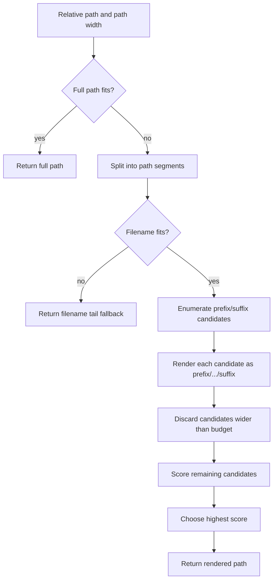
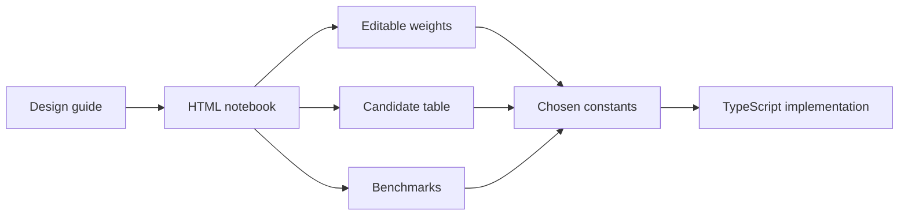

# md-recent Path Elision - From Prototype to Interactive Notebook

This report explains the design work around path elision in `markdown-recent-viewer`, a Pi extension that lists Markdown files touched by the current session and opens the selected file with `md-view`. The immediate user-facing problem is narrow: long file paths in the picker should reveal the filename and enough surrounding folder context to let the user choose the right document. The engineering work is larger than that. It shows how a small UI defect can move from a local prototype, through explicit algorithm design, into an interactive review notebook before the final implementation is committed.

The source repository is `/home/manuel/code/wesen/2026-04-21--pi-extensions`. The active ticket is `PI-EXT-MD-RECENT-ELISION`, with its working documents under `/home/manuel/code/wesen/2026-04-21--pi-extensions/ttmp/2026/05/13/PI-EXT-MD-RECENT-ELISION--improve-md-recent-path-elision`. The current TypeScript extension has a middle-elision prototype in `extensions/markdown-recent-viewer/ui.ts`. The ticket design guide and the self-contained HTML playground describe the next algorithm: enumerate all fitting middle-elided path candidates, score them with an explicit suffix bias, and render the highest-scoring candidate.

> [!summary]
> The user-facing rule is simple: when a path is too long, keep the filename, keep nearby parent folders when possible, and keep the path beginning only when it does not crowd out more useful suffix context.
>
> The algorithmic rule is explicit: generate complete-segment candidates of the form `<prefix>/.../<suffix>`, discard candidates that do not fit, and choose the candidate with the highest suffix-biased score.
>
> The process lesson is that a messy but useful prototype should not be polished blindly. When the behavior becomes policy-heavy, stop, name the policy, write the design, and build an interactive notebook that lets the policy be inspected.

## Why this project exists

The Markdown Recent Viewer exists to answer a frequent local question: “Which Markdown file did this Pi session just edit, and can I open it quickly?” It does not scan the filesystem or sort by modification time. It reads Pi session history, extracts successful `edit` and `write` tool calls that targeted `.md` or `.markdown` files, deduplicates them by latest occurrence, and displays the result in a terminal picker.

That source of truth is useful because it matches the agent workflow. The files in the picker are not merely recent files on disk. They are files the session actually touched. The extension then delegates display to `md-view`:

```bash
md-view view /absolute/path/to/file.md
```

The row-level problem appears after the extraction work is already correct. A picker row contains a fixed prefix and a variable path:

```text
> 08:41  edit   ttmp/2026/05/13/PI-EXT-MD-RECENT-ELISION--improve-md-recent-path-elision/design/01-path-elision-algorithm-design-guide.md
```

The fixed prefix communicates selection state, time, and tool name. The path communicates identity. When terminal width is limited, ordinary end truncation removes the filename, which is the part the user most needs before pressing Enter. Front-only elision preserves the filename, but can hide the top-level folder and too much project context. The path needs an algorithm that understands it as structured data, not as an opaque string.

## Current project status

The work is currently in a design-and-review state.

| Artifact | Status | Role |
|---|---|---|
| `extensions/markdown-recent-viewer/ui.ts` | prototype changed | Contains a first middle-elision helper that preserves the filename side better than plain truncation. |
| `design/01-path-elision-algorithm-design-guide.md` | written | Defines the systematic candidate-enumeration algorithm and its scoring policy. |
| `playbooks/01-path-elision-playground.html` | written | Implements the proposed algorithm in standalone HTML/CSS/JS with controls, candidate table, and benchmark. |
| `reference/01-diary.md` | active | Records the work sequence, failures, design decisions, and validation notes. |
| final TypeScript scoring implementation | pending | The playground algorithm still needs to be ported into the Pi extension. |

This distinction matters. The extension already improved from raw end truncation to a hand-built middle-elision prototype. The final design, however, is not the prototype. The design guide and playground represent the more systematic target.

## The extension context

The Markdown Recent Viewer has three main files:

```text
extensions/markdown-recent-viewer/
  index.ts      # command registration, settings, picker opening, md-view invocation
  history.ts    # session-history extraction and item formatting
  ui.ts         # terminal picker component and path rendering
```

`index.ts` registers the extension through the shared Pi extension framework and exposes two commands:

```text
/markdown-recent-viewer
/md-recent
```

It opens a custom TUI picker and, when the user selects a file, runs `md-view view` on the absolute path. `history.ts` owns the history query. It finds successful `edit` and `write` tool calls, filters by Markdown extension, hides missing files when configured, and returns `RecentMarkdownItem` values. `ui.ts` owns the interactive picker: search, selection movement, scrolling, frame rendering, row rendering, and path elision.

The path algorithm belongs in `ui.ts` because it is a presentation problem. It should not affect how history is collected, how files are opened, or how settings are stored. The clean boundary is:

```ts
const fixedPrefix = `${prefix} ${formatItemTime(item)}  ${tool}  `;
const pathWidth = Math.max(0, width - visibleWidth(fixedPrefix));
const renderedPath = elidePathForWidth(item.relativePath, pathWidth);
const line = `${fixedPrefix}${renderedPath}`;
```

That boundary is the right one. The row renderer computes the path budget. The elision helper receives only a path and a width. The helper returns a string that fits. It does not know about selection styling, borders, time formatting, `md-view`, or session history.

## The first prototype

The first implementation step was deliberately local. It added a helper that preserved the filename by cutting from the beginning of the path. That solved the most visible defect: the filename no longer disappeared when paths were long. The first useful shape was:

```text
…/01-path-elision-algorithm-design-guide.md
```

The user then clarified the requirement. The filename matters most, but both ends of the path are useful. A better rendering should keep the beginning when possible and retain the filename-side folders:

```text
foo/.../bar/bla.md
```

The prototype changed to a greedy middle-elision algorithm:

```text
1. If the full path fits, return it.
2. Start with first/.../filename.
3. Add trailing parent folders while the result fits.
4. If trailing growth stops, add leading folders while the result fits.
5. Fall back to .../filename, filename, or filename tail.
```

For the path:

```text
foo/one/two/three/four/bar/bla.md
```

it tries to grow the suffix first:

```text
foo/.../bla.md
foo/.../bar/bla.md
foo/.../four/bar/bla.md
foo/.../three/four/bar/bla.md
foo/.../two/three/four/bar/bla.md
```

Only after suffix growth stops does it add more prefix folders:

```text
foo/one/.../three/four/bar/bla.md
```

This is a reasonable prototype. It is better than end truncation, better than front-only elision, and easy to implement. It also exposes the next problem: the desired behavior is no longer just string clipping. It is a policy about which parts of a structured path deserve display budget.

## Why the prototype was not enough

The greedy prototype encodes product policy through loop order. A reviewer has to infer the rule from control flow: suffix folders are added first, prefix folders are added later, and fallback cases are scattered around the helper. That makes the function hard to tune. If the user asks for “more bias toward folders on the end,” the implementation answer is not obvious. Should the prefix loop be removed? Should suffix growth reserve more space? Should first-folder preservation be mandatory? Should a longer suffix without a prefix beat a shorter suffix with a prefix?

The underlying issue is that greedy growth answers only one question at a time: “Can I add this next segment?” The UI requirement asks a different question: “Among all renderings that fit, which one best expresses the display policy?”

That is the point where the work changed from patching to design. The algorithm needed a unified model with two separate phases:

1. Generate every candidate that could be shown.
2. Score candidates according to the display policy.

This separation makes the code easier to reason about. Candidate generation is mechanical. Scoring is where product preference lives.

## The final algorithm design

The proposed algorithm treats a path as a list of segments. A candidate is made from a prefix slice, an elision marker, and a suffix slice:

```text
<prefix segments>/.../<suffix segments>
```

The suffix always includes the filename when the filename fits. The prefix is optional. The prefix and suffix never overlap. The full path is handled before candidate generation, so candidate enumeration only considers genuinely elided renderings.

For this path:

```text
foo/one/two/three/four/bar/bla.md
```

candidate generation can produce:

```text
.../bla.md
.../bar/bla.md
.../four/bar/bla.md
foo/.../bla.md
foo/.../bar/bla.md
foo/.../four/bar/bla.md
foo/one/.../bla.md
foo/one/.../bar/bla.md
foo/one/two/.../bla.md
```

The algorithm discards every candidate whose visible terminal width is greater than the available path budget. It then scores every remaining candidate and chooses the highest-scoring candidate.



The important design move is that every candidate is complete-segment-based. The normal case does not cut folder names in half. Partial slicing is reserved for the last-resort filename fallback, when even the filename itself is too wide.

## The scoring rule

The proposed scoring rule is intentionally small:

```text
score = suffixCharsWeight    * suffixChars
      + prefixCharsWeight    * prefixChars
      + suffixSegmentsWeight * suffixSegmentCount
      + prefixSegmentsWeight * prefixSegmentCount
      + prefixPresenceBonus  if prefixSegmentCount > 0
```

With the current defaults, that becomes:

```text
score = 4 * suffixChars
      + 1 * prefixChars
      + 8 * suffixSegmentCount
      + 2 * prefixSegmentCount
      + 12 if a prefix is shown
```

The rule says five things.

- Suffix characters are worth more than prefix characters.
- Complete suffix segments receive a bonus because folder boundaries matter.
- Complete prefix segments receive a smaller bonus.
- Showing at least one prefix segment receives a one-time bonus.
- The first folder is useful, but it should not force the algorithm to discard stronger filename-side context.

The score does not count slashes or the `.../` marker as meaningful path content. Those characters affect whether a candidate fits, but they do not represent preserved segment names. This distinction keeps scoring focused on semantic path content while width filtering remains responsible for terminal layout.

### Worked scoring example

Using the path:

```text
foo/one/two/three/four/bar/bla.md
```

and the default weights, these candidates receive the following scores:

| Candidate | Calculation | Score | Interpretation |
|---|---:|---:|---|
| `.../four/bar/bla.md` | `4×15 + 1×0 + 8×3 + 2×0 + 0` | `84` | No beginning context, strong filename-side context. |
| `foo/.../bar/bla.md` | `4×10 + 1×3 + 8×2 + 2×1 + 12` | `73` | Keeps the top-level folder, but shows less suffix context. |
| `foo/.../four/bar/bla.md` | `4×15 + 1×3 + 8×3 + 2×1 + 12` | `101` | Keeps the top-level folder and richer suffix context. |
| `foo/one/.../bla.md` | `4×6 + 1×6 + 8×1 + 2×2 + 12` | `54` | Spends width on the beginning and loses too much suffix context. |

The decisive comparison is between `foo/.../four/bar/bla.md` and `foo/one/.../bla.md`. Both preserve beginning context, but the first candidate preserves more filename-side information. The score makes that preference explicit.

## Pseudocode for the target implementation

The target TypeScript helper can remain small. The full-path and fallback cases are handled first. The main loop then enumerates candidates and chooses the best fitting candidate.

```ts
function elidePathForWidth(path: string, width: number): string {
  if (width <= 0) return "";
  if (visibleWidth(path) <= width) return path;

  const normalized = path.replace(/\\/g, "/");
  const segments = normalized.split("/").filter(Boolean);
  const filename = segments.at(-1) ?? path;

  if (visibleWidth(filename) > width) {
    return elideFilenameTail(filename, width);
  }

  if (segments.length <= 1) return filename;

  let best = filename;
  let bestScore = scoreCandidate({ prefix: [], suffix: [filename] });

  for (let prefixCount = 0; prefixCount < segments.length; prefixCount++) {
    const maxSuffixCount = segments.length - prefixCount - 1;

    for (let suffixCount = 1; suffixCount <= maxSuffixCount; suffixCount++) {
      const prefix = segments.slice(0, prefixCount);
      const suffix = segments.slice(segments.length - suffixCount);
      const rendered = renderCandidate(prefix, suffix);

      if (visibleWidth(rendered) > width) continue;

      const score = scoreCandidate({ prefix, suffix });
      if (score > bestScore || score === bestScore && betterTieBreak(rendered, best)) {
        best = rendered;
        bestScore = score;
      }
    }
  }

  return best;
}
```

The helper is deterministic. The loop order can be stable, but correctness should not depend on loop order. The scoring function and tie-breaker determine the selected candidate.

## Width is a correctness property

Terminal UI code must measure visible width, not JavaScript string length. ANSI styles, Unicode glyphs, and wide characters can make `.length` disagree with terminal columns. The existing picker already imports `visibleWidth()` and `truncateToWidth()` from `@mariozechner/pi-tui`. The final implementation should keep using those utilities.

The row renderer should enforce this invariant:

```ts
visibleWidth(renderedPath) <= pathWidth
visibleWidth(fixedPrefix + renderedPath) <= rowWidth
```

The algorithm should not return a path that is merely “probably short enough.” It must return a path that fits the budget computed by the row renderer. This is why width filtering is a separate algorithm stage. Scoring chooses among candidates after layout has already rejected the candidates that cannot be displayed.

## Fallback behavior

Fallbacks are not exceptional. They define what the user sees in the narrowest cases.

| Condition | Output |
|---|---|
| Full path fits | Full path unchanged. |
| Filename fits and candidates fit | Highest-scoring middle-elided candidate. |
| Filename fits but no marker candidate fits | Filename alone. |
| Filename does not fit | Tail-preserving filename fallback such as `…ending.markdown`. |
| Width cannot fit even the ellipsis | Empty string or truncated ellipsis, depending on exact width. |

The filename-tail fallback is the only place where partial string slicing is expected. It should preserve the file extension when possible because the extension still communicates file type.

```ts
function elideFilenameTail(filename: string, width: number): string {
  if (width <= 0) return "";
  if (visibleWidth(filename) <= width) return filename;
  if (width <= visibleWidth("…")) return truncateToWidth("…", width, "");
  return `…${takeTailToWidth(filename, width - visibleWidth("…"))}`;
}
```

## Complexity and performance

The algorithm enumerates prefix/suffix combinations. If a path has `n` segments, the candidate count is bounded by `O(n²)`. In this UI, `n` is small. Paths with 6 to 15 segments are common enough to matter visually, but not large enough to make enumeration expensive.

The playground includes a benchmark because the performance claim should be inspectable. It can generate tens of thousands of random paths and run the algorithm across one width or a width sweep. The benchmark reports elapsed time, paths per second, average candidates considered, average valid candidates, and average rendered width.

The expected conclusion is not that enumeration is free. The expected conclusion is that enumeration is cheap enough for picker rendering, and its clarity is worth the cost. The picker is not recomputing millions of paths per frame. It renders a visible list of recent Markdown files, with `maxResults` defaulting to 50.

## The interactive notebook

The self-contained playground lives at:

```text
/home/manuel/code/wesen/2026-04-21--pi-extensions/ttmp/2026/05/13/PI-EXT-MD-RECENT-ELISION--improve-md-recent-path-elision/playbooks/01-path-elision-playground.html
```

It is a single HTML file with inline CSS and JavaScript. It uses a monochrome, early-Macintosh-inspired visual style: black borders, white panels, square controls, a dithered background, and no menu bar or window chrome. The styling is not the central point. The central point is that the page is an executable design document.

The notebook has five review surfaces:

| Surface | Purpose |
|---|---|
| Textbook explanation | Introduces the row-width problem, candidate generation, and scoring rule. |
| Inputs panel | Lets the user change row width, fixed prefix, focused path, and sample paths. |
| Scoring weights panel | Makes the policy constants editable and repeats the formula. |
| Focused result panel | Shows path budget, chosen width, reason, rendered path, and rendered row. |
| Candidate table | Shows every fitting candidate, its width, score, prefix count, and suffix count. |
| Benchmark panel | Runs random-path benchmarks and width sweeps. |

The notebook also includes worked scoring examples. This matters because the algorithm is not only a function. It is a policy. A reviewer should be able to see why `foo/.../four/bar/bla.md` wins over `foo/one/.../bla.md`, and should be able to change the weights when that preference is wrong for real paths.



The notebook turns the algorithm into something that can be reviewed before integration. That reduces the chance of baking accidental behavior into the extension.

## The process: from patching to policy

The process is worth recording because it is a useful pattern for UI algorithms.

### 1. Start with the visible defect

The visible defect was that long paths hid filenames. The first question was not whether the final algorithm should be globally optimal. The first question was whether the row could be improved quickly. A front-elision helper answered that question.

That first helper was not wrong. It made the UI better and revealed the next requirement. The user could now see the filename, but wanted both ends of the path because top-level folders also carry meaning.

### 2. Let the prototype expose the policy

The second prototype introduced middle elision and suffix-first growth. It showed the right direction:

```text
foo/.../bar/bla.md
```

It also exposed that the real question was priority. When there is not enough space for everything, which complete segments should survive? The phrase “bias more towards folders on the end” is a product policy. It should not be hidden in nested loops.

### 3. Stop and write the design

The work then moved into a docmgr ticket and a design guide. That was the key process shift. Instead of editing `ui.ts` until the examples looked right, the design guide named the requirements, compared alternatives, defined the candidate space, specified scoring, and listed test cases.

This step matters because a simple algorithm can still have unclear behavior. Writing the design forces the author to answer questions that code can otherwise postpone:

- Is the first folder mandatory or optional?
- Is a longer suffix without a prefix better than a shorter suffix with a prefix?
- Are complete folder names more valuable than raw character count?
- What happens when the filename itself is too long?
- Should slashes and ellipsis markers affect score or only width?

### 4. Build an executable review artifact

The HTML playground came after the design guide. It made the design executable without requiring Pi reloads or terminal resizing. The page lets a reviewer change row width, paste real paths, alter score weights, inspect the candidate table, and run benchmarks.

This is the right artifact for an algorithm whose behavior is visual and policy-driven. Unit tests can assert selected cases. The notebook helps choose the cases and the constants.

### 5. Port only after inspection

The final TypeScript port is intentionally still a pending task. The next implementation should be informed by the notebook, not by the earlier greedy prototype. The expected port should preserve the current clean row-rendering boundary but replace the internal `elidePathForWidth()` logic with candidate enumeration and scoring.

## Failure modes and review risks

The main failure modes are not difficult to identify.

| Failure mode | Symptom | Mitigation |
|---|---|---|
| End truncation returns through a fallback path | Filename disappears again. | Assert filename preservation whenever filename width fits. |
| Scoring overvalues prefix context | Rows show `foo/one/.../bla.md` when `foo/.../bar/bla.md` would be more useful. | Tune suffix weights and inspect candidate tables. |
| Scoring ignores complete segments | Output preserves more characters but fewer meaningful folders. | Keep segment-count bonuses. |
| Width calculation uses string length | Rows overflow or truncate incorrectly in terminal. | Use `visibleWidth()` and `truncateToWidth()` from `@mariozechner/pi-tui`. |
| Browser notebook differs from terminal implementation | Playground-selected constants do not behave exactly in Pi. | Treat browser `visibleWidth()` as approximate and use Pi's width helper in final code. |
| Tie-breaking is unstable | Equal-score candidates change unexpectedly. | Define deterministic tie-breaking and test it. |

The most important review point is the scoring constants. The defaults are plausible, not sacred. They encode current preference: suffix characters dominate prefix characters, complete suffix segments matter, and a single prefix segment is useful when affordable.

## Recommended implementation sequence

The next implementation should be small and testable.

1. Keep the current row-level budget calculation in `renderItem()`.
2. Replace the greedy helper with a pure candidate-scored `elidePathForWidth()`.
3. Add helpers for candidate rendering, segment character counting, scoring, and filename-tail fallback.
4. Use `visibleWidth()` for every width decision.
5. Add pure-function examples for representative paths and budgets.
6. Run `timeout 20 pi --list-models` to catch extension loading errors.
7. Smoke-test `/md-recent` at normal and narrow terminal widths.

The core implementation should stay independent of Pi state. That makes it easy to test and easy to reason about.

## Test cases to preserve the design

A useful test suite should check properties, not only exact strings.

| Case | Expected property |
|---|---|
| Full path fits | Returned path equals input path. |
| Long multi-segment path | Returned path contains the filename in full when filename fits. |
| Medium width | Candidate keeps more suffix folders before extra prefix folders. |
| Width for `foo/.../bar/bla.md` | Result keeps both the first folder and `bar/bla.md`. |
| Width too small for `foo/.../bla.md` | Result falls back to `.../bla.md` or `bla.md`. |
| Overlong filename | Result preserves the filename tail and extension when possible. |
| Windows-style separators | Display normalizes separators to `/`. |
| Wide Unicode path | `visibleWidth(result) <= width`. |

Exact expected outputs are useful for stable examples, but property tests capture the important invariants. The invariants are filename preservation, width safety, suffix bias, and deterministic fallback behavior.

## What this work teaches

The technical lesson is that path elision is a structured selection problem. A path is not just a string. It is an ordered list of meaningful segments. If the UI has a narrow display budget, the implementation should choose which segments to preserve, not merely where to cut characters.

The process lesson is that prototypes are useful when they are allowed to remain prototypes. The first helper improved the UI. The second helper clarified the desired shape. The design guide then separated mechanism from policy. The notebook made the policy inspectable. This sequence produced a better algorithm than continued local patching would have produced.

The engineering rule is concise:

> When UI behavior depends on a visible policy, make the policy explicit before finalizing the code.

For `md-recent`, the visible policy is suffix-biased path preservation. The final implementation should reflect that policy directly: enumerate what can fit, score what matters, and render the best candidate.

## Important files

| File | Why it matters |
|---|---|
| `/home/manuel/code/wesen/2026-04-21--pi-extensions/extensions/markdown-recent-viewer/ui.ts` | Current TUI picker and path-rendering implementation target. |
| `/home/manuel/code/wesen/2026-04-21--pi-extensions/extensions/markdown-recent-viewer/index.ts` | Registers commands, settings, actions, and opens selected Markdown files with `md-view`. |
| `/home/manuel/code/wesen/2026-04-21--pi-extensions/extensions/markdown-recent-viewer/history.ts` | Extracts recent Markdown files from Pi session history. |
| `/home/manuel/code/wesen/2026-04-21--pi-extensions/ttmp/2026/05/13/PI-EXT-MD-RECENT-ELISION--improve-md-recent-path-elision/design/01-path-elision-algorithm-design-guide.md` | Textbook-style design guide for candidate enumeration and scoring. |
| `/home/manuel/code/wesen/2026-04-21--pi-extensions/ttmp/2026/05/13/PI-EXT-MD-RECENT-ELISION--improve-md-recent-path-elision/playbooks/01-path-elision-playground.html` | Self-contained interactive notebook for tuning and benchmarking the algorithm. |
| `/home/manuel/code/wesen/2026-04-21--pi-extensions/ttmp/2026/05/13/PI-EXT-MD-RECENT-ELISION--improve-md-recent-path-elision/reference/01-diary.md` | Chronological process record, including the design shift and notebook updates. |

## Open questions

- What final scoring constants feel best on real `md-recent` paths from several sessions?
- Should the first path segment receive a fixed presence bonus, or should it compete only through prefix character and segment weights?
- Should the final implementation expose constants as local named values, extension settings, or fixed internal policy?
- Should the notebook become a reusable artifact for other terminal-width algorithms, or remain ticket-local?

## Near-term next steps

1. Use the playground with real paths from the current repository and choose final scoring constants.
2. Port the candidate-scored helper into `extensions/markdown-recent-viewer/ui.ts`.
3. Add focused tests or a small script that verifies the algorithm against representative widths.
4. Run Pi extension load validation.
5. Smoke-test `/md-recent` interactively and inspect the row output at narrow widths.
