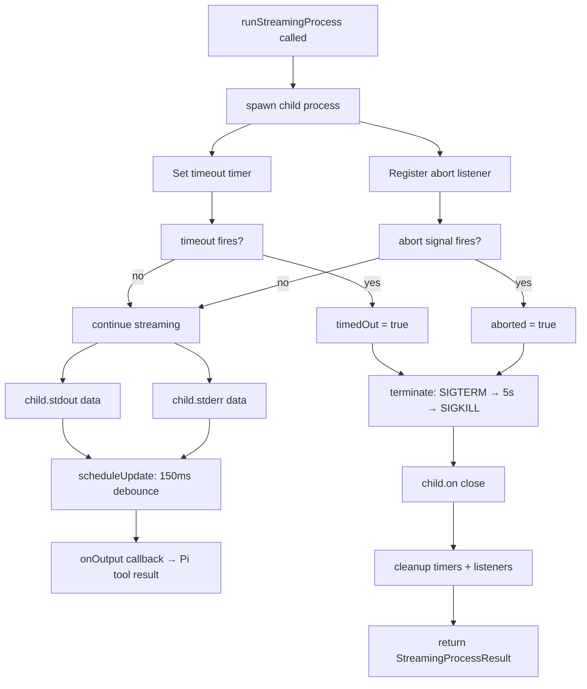
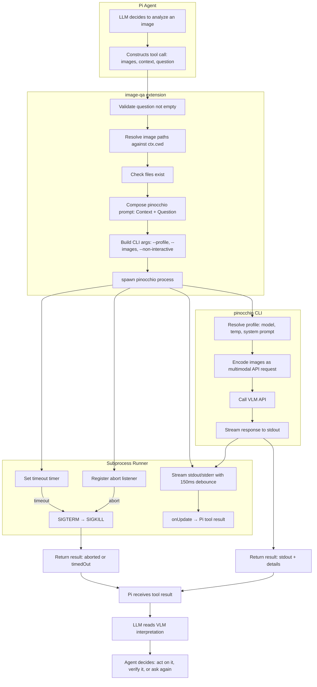

# Image QA: A Deep Dive into Bridging Vision-Language Models and Coding Agents

This report explains the design and implementation of the `ask_questions_about_images` tool — a Pi extension that gives a text-based coding agent the ability to see. The extension is small (one file, ~300 lines of TypeScript), but the problems it solves are not. A coding agent operates in a text world. It reads files, runs shell commands, and writes code. The moment the agent needs to understand what a screenshot shows, whether a rendered page matches a design spec, or how two diagrams differ, the text-only model breaks down. The Image QA extension bridges that gap by delegating visual analysis to a vision-language model (VLM) through an external CLI called `pinocchio`.

The implementation lives in `/home/manuel/code/wesen/2026-04-21--pi-extensions/extensions/image-qa/index.ts`. This report covers the tool's parameter contract, its stateless execution model, the streaming subprocess architecture, error handling, and the design decisions that make the tool safe to expose to an autonomous agent.

> [!summary]
> - The central design decision is statelessness: every VLM call starts a fresh session with no memory of prior calls, which forces the calling agent to provide all context explicitly.
> - The central architectural decision is subprocess delegation: the extension does not call any VLM API directly. It shells out to `pinocchio code professional --non-interactive`, keeping the extension thin and the model configuration external.
> - The central safety decision is that VLM output is treated as interpretation, not ground truth. The tool's description and prompt guidelines teach the calling agent to verify visual claims rather than trust them.

## Why this extension exists

A coding agent that cannot see is blind to an entire class of problems. When a user asks "does this screenshot match the expected layout," the agent has two choices without a vision tool: guess based on the source code, or ask the user to describe what they see. Both options defeat the purpose of having an agent.

The need becomes concrete in several real scenarios:

- **Before/after comparison.** The agent changes CSS or layout code, takes a screenshot before and after, and asks whether the change had the intended visual effect.
- **Error screenshot diagnosis.** A user pastes an error dialog or a broken page. The agent needs to read the error text and describe the visible state.
- **Diagram understanding.** The agent encounters an architecture diagram, flowchart, or schema visualization and needs to extract structural relationships from it.
- **Multi-image comparison.** Two versions of a design, two browser renders of the same page, or several photos of the same object from different angles.

None of these require the agent to have native vision capabilities. They require the agent to have a tool that can delegate to a model that does.

## The tool contract

The extension registers an LLM-callable tool through `pi.registerTool()`. The tool has three parameters, each with a distinct role.

### Parameters

| Parameter | Type | Required | Purpose |
|-----------|------|----------|---------|
| `images` | `string[]` | Yes | File paths to analyze. Relative paths resolve against `ctx.cwd`. |
| `context` | `string` | Yes | Background information the VLM needs to interpret the images. |
| `question` | `string` | Yes | The focused question to answer about the images. |

The separation of `context` and `question` is deliberate. The `context` parameter carries everything the VLM needs to know about the situation: what the user asked, what the agent already knows, what prior questions were asked, how the images relate to each other. The `question` parameter carries the single thing the agent wants answered in this call.

This separation exists because the tool is stateless. Each invocation starts a fresh `pinocchio` process with a fresh model session. The VLM has no access to the Pi conversation, no memory of previous tool calls, and no knowledge of what the agent has already asked or learned. If the agent asks three questions about the same image, each call must include all the context the VLM needs to answer that specific question.

### The JSON schema

The parameters are defined using `Type.Object` from `@mariozechner/pi-ai`, which produces a JSON Schema that the LLM uses to decide when and how to call the tool:

```ts
parameters: Type.Object({
  images: Type.Array(Type.String(), {
    description:
      "One or more image file paths (relative to cwd or absolute) to analyze. " +
      "Pass multiple images in the same call for comparisons such as before/after screenshots, " +
      "two versions of a diagram, or related photos.",
  }),
  context: Type.String({
    description:
      "Surrounding context for this stateless image-analysis call. Include what is already known, " +
      "why these images matter, relevant prior questions/answers, ordering such as before/after, " +
      "and any uncertainty or constraints the VLM should be aware of. Every invocation is a fresh session.",
  }),
  question: Type.String({
    description:
      "The specific question to ask about the images. Keep this focused on the answer you want; " +
      "put background and surrounding details in context. Remember that answers come from a VLM " +
      "interpretation and may miss or misread visual details.",
  }),
}),
```

The descriptions are long because they serve a dual purpose. They describe the parameter to the LLM, and they teach the LLM how to use the tool correctly. The phrase "Every invocation is a fresh session" in the `context` description is the most important instruction the schema carries. Without it, the agent might assume the VLM remembers what was asked two turns ago.

## The stateless execution model

Statelessness is the defining constraint of this tool, and understanding why it exists requires understanding what the alternative would cost.

If the tool maintained a persistent session with the VLM, the agent could ask follow-up questions without repeating context. That would save tokens and produce more natural multi-turn analysis. But a persistent session requires state management: session identifiers, session timeouts, session cleanup, and the question of what happens when the agent switches to a different image set mid-conversation. The complexity grows, and the failure modes become harder to reason about.

The stateless model eliminates all of that. Each call is independent. The `pinocchio` process starts, receives a prompt, produces output, and exits. There is no session to clean up, no state to corrupt, and no ambiguity about what the VLM does or does not know.

The trade-off is token overhead. If the agent asks five questions about the same screenshot, the context field will contain overlapping information five times. The extension accepts this cost because correctness is more important than efficiency for a tool that produces interpretations rather than facts.

### How the prompt is composed

The extension composes a text prompt from the `context` and `question` parameters using a simple format:

```ts
function composePinocchioPrompt(context: string, question: string): string {
  return [
    promptSection("Context", context),
    promptSection("Question", question),
  ].join("\n\n");
}

function promptSection(title: string, value: string): string {
  return `${title}:\n${value.trim() || "(none provided)"}`;
}
```

This produces a prompt shaped like:

```
Context:
These two screenshots show the same UI before and after a CSS change. The first image is before; the second image is after.

Question:
Compare the screenshots and describe the visible layout, spacing, and color differences.
```

The prompt is intentionally plain. It does not include system instructions, role definitions, or chain-of-thought scaffolding. The `pinocchio code professional` profile already configures the system prompt, temperature, and model. The extension trusts the profile to do its job and limits itself to composing the user-facing prompt from the tool parameters.

### The pinocchio invocation

The extension builds the following command line:

```bash
pinocchio code professional \
  --profile <profile> \
  --images img1.png,img2.png \
  --non-interactive \
  $'Context:\n<context text>\n\nQuestion:\n<question text>'
```

Three flags matter:

- `--profile` selects the pinocchio inference profile, which determines the model, temperature, system prompt, and other inference settings. The default is `gpt-5-low`, configurable through the extension settings.
- `--images` accepts a comma-separated list of file paths. Pinocchio passes these to the underlying model's multimodal API.
- `--non-interactive` prevents pinocchio from entering chat mode. The process receives the prompt, runs inference, prints the result, and exits.

The `--non-interactive` flag is essential. Without it, `pinocchio` would wait for the user to type follow-up messages, and the subprocess would hang until the timeout kills it.

## The streaming subprocess architecture

The extension does not call any VLM API directly. It delegates everything to the `pinocchio` CLI. This decision has consequences for how the tool processes output, handles errors, and respects cancellation.

### Why subprocess delegation

A direct API call would be faster and would avoid the process spawning overhead. But direct API integration would require the extension to know about API keys, model endpoints, request formats, and response schemas. Every time the model provider changes an API detail, the extension would need updating.

Subprocess delegation moves that complexity to `pinocchio`, which already handles model selection, authentication, prompt formatting, and response parsing. The extension only needs to know how to invoke `pinocchio` and read its stdout.

This is the same design principle that makes Unix pipelines work: each program does one thing well, and the combination emerges from composition rather than integration.

### The streaming process runner

The `runStreamingProcess` function manages the subprocess lifecycle. It handles five concerns: output streaming, timeout enforcement, abort signaling, force-kill escalation, and settled-state protection.



**Output streaming.** The child process emits stdout and stderr as `data` events. The runner debounces these at 150ms intervals. Rather than forwarding each chunk to Pi immediately, the runner accumulates output and schedules an update callback every 150ms. This prevents the Pi tool result from being updated hundreds of times per second during fast output, which would overwhelm the rendering pipeline.

```ts
const scheduleUpdate = () => {
  if (updateTimer) return;
  updateTimer = setTimeout(emitUpdate, 150);
};
```

**Timeout enforcement.** The timeout timer fires after `state.timeout * 1000` milliseconds (default: 120 seconds). When it fires, the runner sets `timedOut = true` and sends SIGTERM to the child. If the child does not exit within 5 seconds, the runner escalates to SIGKILL.

**Abort signaling.** Pi can cancel a running tool call by triggering the `AbortSignal` passed to the `execute` function. When the signal fires, the runner sets `aborted = true` and sends SIGTERM. The escalation path is the same: SIGTERM, then SIGKILL after 5 seconds.

**Force-kill escalation.** SIGTERM allows the process to clean up (flush output, close files, release ports). But a hung process may ignore SIGTERM. The 5-second grace period gives the process time to exit gracefully before SIGKILL forces termination.

**Settled-state protection.** The `settled` boolean prevents the promise from being resolved or rejected more than once. A process can emit both an `error` event and a `close` event. Without the guard, the second event would attempt to resolve an already-resolved promise.

```ts
child.on("error", (error) => {
  if (settled) return;
  settled = true;
  cleanup();
  reject(error);
});

child.on("close", (code) => {
  if (settled) return;
  settled = true;
  cleanup();
  options.onOutput(stdout, stderr);
  resolve({ code: code ?? -1, stdout, stderr, aborted, timedOut });
});
```

### Cleanup

The `cleanup` function clears all timers and removes the abort listener. It runs once — either in the `error` handler or in the `close` handler, whichever fires first. Forgetting to clean up any of these resources causes subtle bugs: a timeout timer that fires after the process has already exited, an abort listener that accumulates across calls, or a force-kill timer that kills an already-dead process.

## Error handling

The extension handles six categories of error, each with a distinct response shape.

### Empty question

If the `question` parameter is empty or whitespace-only, the tool returns immediately with an error message. This is a validation error, not a runtime error. The VLM cannot answer a question that was not asked.

```ts
if (!question.trim()) {
  return {
   	content: [{ type: "text", text: "Error: question must not be empty." }],
   	details: { error: true },
  };
}
```

### Missing image files

The extension resolves all image paths against `ctx.cwd` and checks that every file exists before starting the subprocess. Missing files produce an error listing the paths that were not found.

```ts
const resolved = images.map((p) => resolve(ctx.cwd, p));
const missing = resolved.filter((p) => !existsSync(p));
if (missing.length > 0) {
  return {
    content: [{ type: "text", text: `Error: Image file(s) not found: ${missing.join(", ")}` }],
    details: { error: true },
  };
}
```

Validating before spawning the process is important because `pinocchio` might not produce a clear error message for a missing file — it might silently skip it, or it might produce a confusing API error. The extension catches this early and returns a message the agent can understand and act on.

### Process abort

If the Pi agent cancels the tool call (via the `AbortSignal`), the streaming process runner terminates the child and returns a result with `aborted: true`. The response includes any partial output collected before the abort, because that partial output might contain useful information.

```ts
if (result.aborted) {
  const partial = result.stdout.trim() ? `\n\nPartial output:\n${result.stdout}` : "";
  return {
    content: [{ type: "text", text: `Image QA call aborted.${partial}` }],
    details: { ...baseDetails, error: true, aborted: true, stderr: result.stderr || undefined },
  };
}
```

### Process timeout

If the process exceeds the configured timeout (default: 120 seconds), the runner terminates it and returns a result with `timedOut: true`. Like the abort case, partial output is included if available.

### Non-zero exit code

If `pinocchio` exits with a non-zero code, the extension returns both stderr and stdout. The stderr often contains the actual error message, while stdout may contain partial output that helps diagnose what went wrong.

### Spawn failure

If the `spawn` call itself fails (for example, because `pinocchio` is not installed), the `child.on("error")` handler catches the error and the `try/catch` wrapper in `execute` converts it to a tool error response.

```ts
} catch (err: unknown) {
  const message = err instanceof Error ? err.message : String(err);
  return {
    content: [{ type: "text", text: `Error running pinocchio: ${message}` }],
    details: { ...baseDetails, error: true },
  };
}
```

## The `renderCall` function

When the LLM decides to call `ask_questions_about_images`, Pi displays the call in the terminal before the result arrives. The `renderCall` function produces that display. It is a TUI rendering function that formats the call arguments for human readability.

```ts
renderCall(args, theme) {
  const images = argImages(args);
  const context = argString(args, "context").trim();
  const question = argString(args, "question").trim();
  const text = [
    `${theme.fg("toolTitle", theme.bold("ask_questions_about_images"))} ${theme.fg("dim", `${images.length} image(s)`)}`,
    `${theme.fg("accent", "Context:")} ${context || theme.fg("warning", "(empty)")}`,
    `${theme.fg("accent", "Question:")} ${question || theme.fg("warning", "(empty)")}`,
  ].join("\n");
  return new Text(text, 0, 0);
},
```

The rendering shows three things: the tool name with the image count, the context (or a warning if empty), and the question (or a warning if empty). The warning for empty context is particularly important because it signals to the user that the agent may not be providing enough background to the VLM — a common mistake when the agent first starts using the tool.

The `argImages` and `argString` helper functions exist because `renderCall` receives the raw argument object before JSON parsing or validation. The helpers safely extract typed values from the raw arguments without throwing.

## Extension registration and settings

The extension registers itself with the shared Pi extension framework through `registerPiExtension()`. This makes the extension discoverable through the `/px` launcher and gives it a settings surface.

### Actions

The extension exposes one action: "Show status." This action displays the current profile and timeout values. It is the default action because it is safe and unsurprising.

### Settings

Settings use the schema kind with two fields:

| Field | Type | Default | Description |
|-------|------|---------|-------------|
| `profile` | `string` | `gpt-5-low` | Pinocchio profile name (controls model, temperature, system prompt) |
| `timeout` | `number` | `120` | Maximum seconds to wait for a pinocchio response |

The `load` function returns the current in-memory state. The `onApply` function updates the state and notifies the user. There is no persistence — the state resets when the Pi session restarts. This is intentional: profile and timeout values are session-level configuration, not project-level defaults.

### Docs

The extension registers one doc entry that points to its README at `extensions/image-qa/README.md`. The launcher opens this when the user presses `?` on the extension.

### Compatibility command

The extension registers a `/image-qa` command that shows the current status. This exists for backward compatibility with users who remember the command name.

## Prompt guidelines and agent education

The most important part of this extension is not the code. It is the instruction text that teaches the LLM how to use the tool correctly. The extension provides four prompt guidelines that shape the agent's behavior:

1. **"Put all relevant surrounding information in the context argument — the tool has no memory of past calls."** This is the core statelessness rule. Without it, the agent would treat the VLM as a conversational partner and omit context from follow-up questions.

2. **"Keep question focused on the specific visual answer you want; do not bury the question inside the context field."** This prevents the common mistake of writing a long context paragraph that ends with "so tell me everything about the images." A focused question produces a focused answer.

3. **"Provide multiple images in one call when comparing before/after states, alternatives, screenshots, or related visual evidence."** This teaches the agent to use the multi-image capability rather than making separate calls for each image and then trying to synthesize the results itself.

4. **"Treat results as VLM interpretations rather than perfect visual ground truth; verify important details when possible."** This is the safety rule. VLMs hallucinate, miss small details, misread text, and give confident but wrong comparisons. The agent must not treat VLM output as verified fact.

These guidelines are embedded in the tool's `promptGuidelines` field, which Pi injects into the system prompt when the tool is available. The LLM reads them before deciding whether and how to call the tool. This is prompt engineering at the tool interface level: the tool does not just describe what it does, it teaches the agent how to use it responsibly.

## Architecture diagram

The full data flow from user request to VLM response:



## A worked example: before/after screenshot comparison

Consider a user who asks the agent to fix a CSS layout problem. The agent takes a screenshot before making changes, applies the fix, and takes another screenshot after. It then calls the tool to verify the fix.

**Tool call:**

```json
{
  "images": ["/tmp/layout-before.png", "/tmp/layout-after.png"],
  "context": "These two screenshots show the same page before and after a CSS fix. The first image (layout-before.png) shows the original broken layout where the sidebar overlaps the main content area. The second image (layout-after.png) shows the page after applying 'margin-left: 240px' to the main content div. The user reported that the sidebar was overlapping the content.",
  "question": "Does the after screenshot show the sidebar correctly positioned to the left without overlapping the main content? Describe any remaining layout issues you can see."
}
```

**What the extension does:**

1. Resolves both paths against `ctx.cwd`.
2. Checks that both files exist.
3. Composes the prompt:
   ```
   Context:
   These two screenshots show the same page before and after a CSS fix. [...]

   Question:
   Does the after screenshot show the sidebar correctly positioned [...]
   ```
4. Spawns `pinocchio code professional --profile gpt-5-low --images /tmp/layout-before.png,/tmp/layout-after.png --non-interactive '<prompt>'`.
5. Streams pinocchio's stdout to the Pi tool result at 150ms intervals.
6. Returns the VLM's response as the tool result.

**What the agent does next:**

The agent reads the VLM interpretation. If the VLM says the fix worked, the agent confirms this to the user. If the VLM identifies remaining issues, the agent can make additional CSS changes and repeat the comparison. If the VLM's answer seems uncertain or contradicts the user's report, the agent may ask a more specific follow-up question — but it must include all context again because the VLM has no memory of the previous call.

## Design decisions and their rationale

### Decision: subprocess delegation over direct API calls

**Why.** The extension avoids coupling to any specific VLM API. Model selection, authentication, prompt formatting, and response parsing all live in `pinocchio`. When a new model becomes available, the user changes the pinocchio profile. The extension does not need to change.

**Trade-off.** Process spawning adds latency (typically 200–500ms for the `pinocchio` startup) and requires `pinocchio` to be installed. The extension accepts this cost because it makes the extension durable across API changes.

### Decision: stateless over stateful sessions

**Why.** A stateless model has no session state to corrupt, leak, or clean up. Each call is self-contained and reproducible. The agent can reason about what the VLM knows by looking at the `context` field it provided.

**Trade-off.** Repeated context costs tokens. A five-question investigation of the same image sends the same background information five times. The extension accepts this because correctness is more important than token efficiency for VLM calls.

### Decision: separated context and question parameters

**Why.** The `context`/`question` split teaches the agent to separate background from intent. A merged prompt parameter would be simpler in the schema, but it would not guide the agent toward providing context. The agent would likely write a short question without background, producing worse VLM output.

**Trade-off.** The agent sometimes puts question-relevant information in the context field or repeats itself across both fields. The prompt guidelines mitigate this by instructing the agent to keep the question focused.

### Decision: early path validation before subprocess spawn

**Why.** `pinocchio` does not always produce clear errors for missing files. It might skip them, or it might produce an API-level error that does not mention the file path. The extension catches missing files early and returns a message the agent can act on directly.

**Trade-off.** The extension does a synchronous `existsSync` check for each image. For local files this is fast. For network paths it would block, but the tool contract specifies local file paths.

### Decision: 150ms debounce on output streaming

**Why.** VLM inference can produce output in rapid bursts. Without debouncing, the tool result would be updated on every `data` event — potentially hundreds of times per second. The Pi rendering pipeline is not designed for that update frequency. The 150ms debounce batches output into human-readable chunks.

**Trade-off.** The final output may be delayed by up to 150ms after the last chunk arrives. The extension calls `onOutput` one final time in the `close` handler to ensure no output is lost.

## Common failure modes

### The agent omits context

The most common failure mode is the agent calling the tool with minimal or empty context. This produces vague or incorrect VLM answers because the VLM does not know what the agent already understands about the images. The `renderCall` function highlights empty context with a warning color, making it visible to the user that the agent skipped this step.

### The agent trusts VLM output uncritically

VLMs can misread text in screenshots, hallucinate UI elements that do not exist, or confidently describe differences that are not actually present. The tool's prompt guidelines instruct the agent to verify important claims, but the agent may not always follow this instruction. The risk is highest when the agent is making a decision based solely on VLM output (for example, deciding that a bug is fixed because the VLM says the screenshot looks correct).

### The agent uses separate calls instead of multi-image comparison

If the agent calls the tool separately for each image instead of passing both in one call, it loses the ability to compare. The VLM in the second call does not know what the first call showed, because each call is stateless. The prompt guidelines address this explicitly, but the agent still makes this mistake when it is new to the tool.

### pinocchio is not installed or not authenticated

If `pinocchio` is not on the PATH, or if the API key for the configured profile is missing, the subprocess fails with a non-zero exit code or a spawn error. The extension catches this and returns a clear error message, but the agent cannot fix the problem itself. The user must install or configure `pinocchio`.

### Timeout during long inference

Large images or complex questions can produce inference times exceeding the 120-second default timeout. The extension returns a timeout error with any partial output that was collected. The user can increase the timeout through the extension settings.

## Implementation details: the full execute flow

The `execute` function is the entry point that Pi calls when the LLM decides to use the tool. Here is the complete flow, annotated:

```ts
async execute(_toolCallId, params, signal, onUpdate, ctx) {
  const { images, context, question } = params;

  // 1. Validate question
  if (!question.trim()) {
    return { content: [{ type: "text", text: "Error: question must not be empty." }],
             details: { error: true } };
  }

  // 2. Compose the prompt
  const pinocchioPrompt = composePinocchioPrompt(context, question);

  // 3. Resolve and validate image paths
  const resolved = images.map((p) => resolve(ctx.cwd, p));
  const missing = resolved.filter((p) => !existsSync(p));
  if (missing.length > 0) {
    return { content: [{ type: "text", text: `Error: Image file(s) not found: ${missing.join(", ")}` }],
             details: { error: true } };
  }

  // 4. Build CLI arguments
  const imagesFlag = resolved.join(",");
  const args = [
    "code", "professional",
    "--profile", state.profile,
    "--images", imagesFlag,
    "--non-interactive",
    pinocchioPrompt,
  ];

  // 5. Emit initial streaming status
  const baseDetails = { profile: state.profile, context, question };
  onUpdate?.({
    content: [{ type: "text", text: "Starting image QA via pinocchio..." }],
    details: { ...baseDetails, streaming: true },
  });

  // 6. Run the subprocess with streaming, timeout, and abort support
  try {
    const result = await runStreamingProcess("pinocchio", args, {
      cwd: ctx.cwd,
      signal,
      timeoutMs: state.timeout * 1000,
      onOutput: (stdout, stderr) => {
        const text = stdout || (stderr ? `pinocchio stderr:\n${stderr}` : "Waiting for pinocchio output...");
        onUpdate?.({
          content: [{ type: "text", text }],
          details: { ...baseDetails, streaming: true, stderr: stderr || undefined },
        });
      },
    });

    // 7. Handle abort, timeout, and exit-code errors
    // ... (see Error handling section)

    // 8. Return successful result
    return {
      content: [{ type: "text", text: result.stdout }],
      details: { ...baseDetails, streaming: false, stderr: result.stderr || undefined },
    };
  } catch (err) {
    // 9. Handle spawn failures
    const message = err instanceof Error ? err.message : String(err);
    return { content: [{ type: "text", text: `Error running pinocchio: ${message}` }],
             details: { ...baseDetails, error: true } };
  }
}
```

The `details` object attached to every result carries structured metadata: the profile used, the context and question as provided, and flags for streaming state, errors, aborts, and timeouts. This metadata is available to the Pi framework for logging and debugging, even though the LLM only sees the `content` text.

## Key points

- The tool gives a text-based coding agent the ability to delegate visual analysis to a VLM. The agent does not gain vision. It gains a channel to a model that has vision.
- Statelessness is the defining constraint. Every call is independent. The `context` parameter must carry all background the VLM needs because the VLM has no other source of information about the current conversation.
- The extension is a thin subprocess wrapper around `pinocchio`. It composes a prompt, spawns a process, streams the output, and handles errors. It does not call any VLM API directly.
- The `context`/`question` separation is not just a schema convenience. It is a prompt engineering decision that teaches the agent to separate what it knows from what it wants to know.
- The streaming process runner handles five concerns (output streaming, timeout, abort, force-kill escalation, settled-state protection) that any long-running subprocess integration must address.
- VLM output is interpretation, not ground truth. The tool's prompt guidelines and description text teach the agent to verify important visual claims rather than trust them.
- The `renderCall` function provides visibility into what context the agent chose to send, making it possible for the user to catch agents that skip the context step.

## Where the code lives

| File | Purpose |
|------|---------|
| `extensions/image-qa/index.ts` | Full extension: registration, tool, streaming runner, render |
| `extensions/image-qa/README.md` | User-facing documentation |
| `extensions/_shared/registry.ts` | Shared extension framework contracts |

## Related notes

This extension is one tool in a larger Pi extension ecosystem. The patterns it uses — `registerPiExtension()`, schema settings, action registration, TUI rendering — are documented in the shared framework guide and apply to every extension in the repository.

The stateless tool-call pattern used here is relevant to any tool that delegates to an external service. The lessons about context separation, early validation, streaming debouncing, and agent education through prompt guidelines transfer directly.
