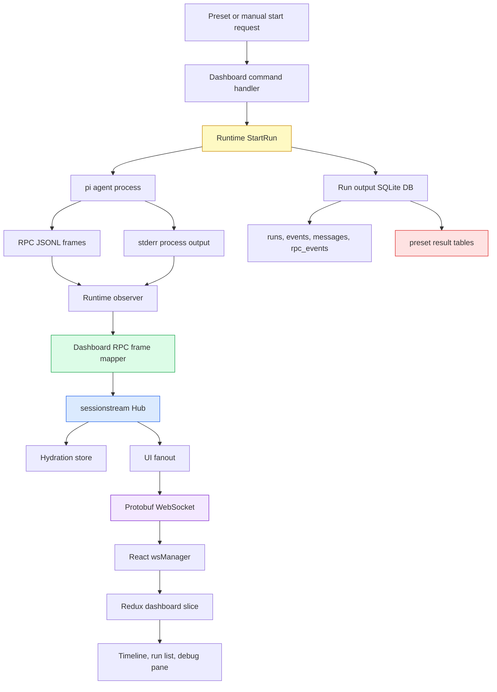
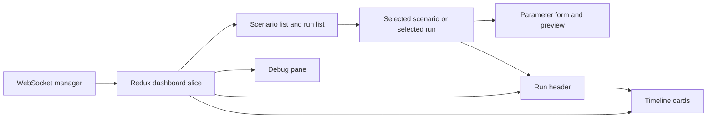

# Pi Agent Dashboard: RPC Streaming, Presets, and Protobuf Deep Dive

This report explains the full body of work completed on the pi agent dashboard in `go-go-claw`: the backend streaming substrate, the React dashboard, preset-driven scenario launching, protobuf contracts, the hard WebSocket transport cutover, RPC-mode streaming, prompt hardening, and the `devctl` workflow that starts the stack. The goal is to give a future maintainer enough context to understand the system without reconstructing it from individual commits.

The implementation lives in `/home/manuel/workspaces/2026-05-12/pi-agent-dashboard/2026-04-28--go-go-claw`. The work was tracked through docmgr tickets under `ttmp/2026/05/12` and `ttmp/2026/05/13`. The final system is not only a dashboard. It is a contract between a running pi agent, a Go runtime, a sessionstream event store, a protobuf WebSocket transport, a React entity reducer, and preset materializers that create reproducible SQLite tasks.

> [!summary]
> - The central backend invariant is `run_id == sessionstream.SessionId`; every dashboard run is also a sessionstream session.
> - The central transport decision is a hard protobuf WebSocket cutover: generated `sessionstream.v1.ClientFrame` and `ServerFrame` JSON frames, with dashboard payloads packed as `google.protobuf.Any`.
> - The central execution decision is that RPC mode is now the default pi mode, because RPC emits rich live frames for messages, thinking, tool execution, and lifecycle events.
> - The central preset decision is that agents may use scratch tables, but final results must be written into backend-provided output tables without changing their schema.

## 1. What the project had to make possible

The original runtime could start a pi coding agent, give it an input database, mount an output database, and record what happened. That was enough to prove the runtime path. It was not enough for a dashboard that should show an agent run while it is happening.

A useful agent dashboard needs to answer several questions in real time:

- Which runs exist, and what is their current status?
- What prompt and input/output databases belong to this run?
- What is the agent currently saying?
- What is the agent thinking, when the provider exposes that stream?
- Which tools are running, what arguments were used, and what output did they produce?
- What raw protocol frames arrived that the dashboard does not yet understand?
- Did a scenario run produce the expected output artifacts and database rows?

These questions require more than polling a table of messages. They require a live event model with stable identifiers, typed payloads, replayable snapshots, and frontend entities that can be updated incrementally.

The final design therefore has four layers:

1. **Runtime execution.** The Go runtime starts pi, mounts databases, reads stdout/stderr, and, in RPC mode, reads JSONL protocol frames from pi.
2. **Dashboard event translation.** Runtime observer hooks publish typed dashboard events such as `ClawRunCreated`, `ClawAgentTextDelta`, and `ClawToolExecutionStarted`.
3. **Sessionstream projection.** The sessionstream Hub assigns ordinals, stores events, derives timeline entities, and fans out UI events.
4. **Frontend entity rendering.** React receives protobuf WebSocket frames, unpacks dashboard payloads, normalizes them into Redux view entities, and renders a macOS1-style dashboard.



The diagram shows the two persistent records of a run. The sessionstream hydration store exists for live dashboard state and replay. The output SQLite database exists for runtime bookkeeping and scenario results. Both are useful. They answer different questions.

## 2. The run identity invariant

The first stabilizing decision was to make a run id and a sessionstream session id the same value.

```text
run_id == sessionstream.SessionId
```

This removed a class of mapping problems. If the dashboard creates a run with id `invoice-audit-v1-20260514T185544.944463951`, then:

- the runtime run id is `invoice-audit-v1-20260514T185544.944463951`,
- the per-run sessionstream session id is `invoice-audit-v1-20260514T185544.944463951`,
- the WebSocket client subscribes to `invoice-audit-v1-20260514T185544.944463951`,
- timeline entities for that run carry the same run id,
- SQLite run-log rows use the same run id.

There is also a dashboard aggregate session named `dashboard`. That session receives run-level updates so the left-side run list can update even when the user has not selected the run session. High-volume message and tool events belong to the individual run session.

The resulting session model is simple:

| Session | Purpose | Example events |
|---|---|---|
| `dashboard` | Aggregate run list and global dashboard state. | `ClawRunUpsert` for created/running/succeeded runs. |
| `<run_id>` | Detailed per-run timeline. | `ClawMessageUpsert`, `ClawThinkingUpsert`, `ClawToolExecutionUpsert`, raw frames. |

This split keeps the dashboard responsive. The aggregate session does not need every token-level message update. The selected run session carries the high-volume stream.

## 3. Protobuf as the dashboard contract

The dashboard uses protobuf in two places:

1. **Dashboard domain payloads** live in `proto/claw/dashboard/v1/dashboard.proto`.
2. **Preset API payloads** live in `proto/claw/presets/v1/presets.proto`.

Generated Go code lives under `internal/pb/proto/claw/...`. Generated TypeScript code lives under `web/src/pb/proto/claw/...`. The WebSocket transport frame types come from generated sessionstream TypeScript under `web/src/pb/external/sessionstream/transport_pb.ts`.

The dashboard schema separates commands, events, timeline entities, and UI event wrappers.

A command starts work:

```protobuf
message StartRunCommand {
  string run_id = 1;
  string input_db_path = 2;
  string output_db_path = 3;
  string agent_image = 4;
  string prompt = 5;
  string session_path = 6;
  string pi_home_path = 7;
  bool pi_home_read_only = 8;
  bool no_docker = 9;
  string pi_mode = 10;
}
```

Backend events describe work that happened. Timeline entities describe the current state after projection. UI events wrap entity updates so the frontend can reduce snapshots and live updates through the same path.

For example, the event `ClawAgentTextDelta` projects into a `ClawMessageEntity`, and the WebSocket sends a `ClawMessageUpsert` UI event. The store/view type on the frontend is not the generated protobuf type. Generated types are wire/domain contracts; Redux view types remain plain TypeScript objects.

This separation matters because protobuf types carry transport semantics. View types carry rendering semantics. The mapper boundary converts between them, including `int64`/`uint64` values that arrive as `bigint` in generated TypeScript.

## 4. The shared projector

The shared projector is the code path that prevents snapshot/live drift. It lives in `internal/dashboard/projector.go` and maps one typed dashboard event into both a timeline entity and a matching UI event.

The pattern is:

```go
type ProjectedUpsert struct {
    Entity  sessionstream.TimelineEntity
    UIEvent sessionstream.UIEvent
}

func ProjectClawEvent(
    ctx context.Context,
    ev sessionstream.Event,
    view sessionstream.TimelineView,
    now time.Time,
) ([]ProjectedUpsert, error)
```

A text delta takes the existing message entity from the view, updates text, marks streaming state, and returns a message entity plus `ClawMessageUpsert`.

```go
case *dashboardv1.ClawAgentTextDelta:
    entity := currentMessageEntity(view, payload.GetMessageId())
    entity.MessageId = payload.GetMessageId()
    entity.RunId = payload.GetRunId()
    entity.Role = payload.GetRole()
    if payload.GetAccumulatedText() != "" {
        entity.Text = payload.GetAccumulatedText()
    } else {
        entity.Text += payload.GetChunk()
    }
    entity.Streaming = payload.GetStreaming()
    return wrapMessage(entity), nil
```

The important rule is that projection owns accumulated entity state. The frontend does not append deltas as a separate semantic operation. It upserts the authoritative entity payload that the backend projected.

This rule was tested directly. The projector tests assert that entity payloads and UI event payloads match for run, message, thinking, tool, bash, raw-frame, and process-output projections. This is the code-level expression of the design rule: snapshots and live updates must speak the same entity language.

## 5. Runtime observer hooks

The runtime remains responsible for running pi and writing legacy SQLite rows. It should not know how React renders a tool card. The bridge is the observer interface in `internal/runtime/observer.go`.

The observer receives callbacks such as:

```go
type Observer interface {
    RunCreated(ctx context.Context, run store.Run)
    RunStatusChanged(ctx context.Context, runID string, status string, errMsg string, finished bool)
    ProcessOutput(ctx context.Context, runID string, source string, line string)
    RPCFrame(ctx context.Context, runID string, frame pirpc.Frame)
}
```

The dashboard service installs a runtime observer. When the runtime creates a run, changes status, sees process output, or receives an RPC frame, the observer maps that information into sessionstream events.

This preserves the old behavior. The runtime still writes:

- `runs`,
- `events`,
- `messages`,
- `rpc_events`.

The dashboard is an observer, not a replacement for the runtime store.

## 6. RPC mode is now the main pi mode

The most important late change was making RPC mode the default. Print mode can show stdout/stderr, but it cannot provide rich semantic events while the agent is running. RPC mode emits structured JSONL frames on stdout and accepts commands over stdin.

The runtime path now defaults to:

```go
const DefaultPiMode = "rpc"

if req.PiMode == "" {
    req.PiMode = DefaultPiMode
}
```

The dashboard command handler also normalizes empty `StartRunCommand.pi_mode` before registering the observer. This makes logs and runtime behavior agree: if a frontend or preset API omits `piMode`, the run is still an RPC run.

The RPC subprocess path is:

```go
name, args := s.buildRPCCommandArgs(req)
client := pirpc.NewRPCClient(ctx, name, args...)
client.SetStderrHandler(...)
client.Start()
client.Send(pirpc.PromptCommand("initial-prompt", req.Prompt))

for {
    select {
    case frame := <-client.Frames():
        s.notifyRPCFrame(ctx, runID, frame)
        s.handleRPCFrame(ctx, st, runID, frame)
    case <-client.Done():
        ...
    }
}
```

When Docker is used, the command includes `-i` because RPC mode requires stdin to remain open:

```text
docker run --rm -i \
  --mount type=bind,src=<input>,dst=/data/input.db,readonly \
  --mount type=bind,src=<output>,dst=/data/output.db \
  --mount type=bind,src=<session-dir>,dst=/session \
  claw-pi-agent:latest \
  --mode rpc --session /session/session.jsonl
```

A real smoke run without an explicit `piMode` proved the default:

```text
invoice-audit-v1-20260514T185544.944463951
status=succeeded
rpc_events=1940
```

The frame mix showed the value of RPC mode:

| RPC frame type | Count |
|---|---:|
| `agent_start` | 1 |
| `agent_end` | 1 |
| `message_start` | 19 |
| `message_update` | 1439 |
| `message_end` | 19 |
| `tool_execution_start` | 11 |
| `tool_execution_update` | 28 |
| `tool_execution_end` | 11 |
| `turn_start` | 7 |
| `turn_end` | 7 |
| `extension_ui_request` | 396 |

After mapper fixes, the hydration store had bounded entity counts:

| Entity kind | Count |
|---|---:|
| `ClawMessage` | 16 |
| `ClawThinking` | 6 |
| `ClawToolExecution` | 11 |
| `ClawRun` | 1 |

The difference between `1439` `message_update` frames and `16` message entities is the projection model working correctly. Token-level or partial-update frames update stable entities; they do not create a new message per token.

## 7. The RPC frame mapper

RPC frames are raw JSONL records emitted by pi. The dashboard does not send those raw records directly to the frontend as its primary contract. It maps known frames into typed dashboard events and preserves unknown frames as raw-frame entities when useful.

The mapper lives in `internal/dashboard/frame_mapper.go`.

Known frame mappings include:

| pi RPC frame | Dashboard event |
|---|---|
| `agent_start` | `ClawAgentStarted` |
| `agent_end` | `ClawAgentEnded`, `ClawRunStatusChanged` |
| `message_start` | initial streaming message event |
| `message_update` | `ClawAgentTextDelta`, `ClawAgentThinkingDelta`, `ClawBashExecution` |
| `message_end` | `ClawAgentTextFinished`, `ClawAgentThinkingFinished` |
| `tool_execution_start` | `ClawToolExecutionStarted` |
| `tool_execution_update` | `ClawToolExecutionUpdate` |
| `tool_execution_end` | `ClawToolExecutionFinished` |
| `turn_start` | `ClawTurnStarted` |
| `turn_end` | `ClawTurnFinished` |
| `extension_ui_request` | ignored for the main dashboard timeline |
| unknown frame | `ClawRawFrameEvent` |

The mapper had to be adjusted after real RPC validation. The initial version could map synthetic test frames, but real `message_update` frames often looked like this:

```json
{
  "type": "message_update",
  "assistantMessageEvent": {
    "type": "thinking_delta",
    "delta": " me start by examining",
    "partial": {
      "role": "assistant",
      "content": [
        {"type": "thinking", "thinking": "Let me start by examining"}
      ],
      "responseId": "2eeb4928fcc3417393f5c111127271cf"
    }
  },
  "message": {
    "role": "assistant",
    "content": [
      {"type": "thinking", "thinking": "Let me start by examining"}
    ],
    "responseId": "2eeb4928fcc3417393f5c111127271cf"
  }
}
```

Two details matter:

1. The top-level frame may not contain a stable `id`.
2. The `message.content` partial is accumulated state, not only the new delta.

The mapper therefore chooses stable message identity from `message.id`, frame id, `responseId`, or tool-call id before falling back to a hash. It also passes accumulated text/thinking to the projector, rather than asking the projector to append token chunks.

```go
func rpcMessageID(runID, frameType, frameID string, msg messageFrame) string {
    return firstNonEmpty(
        msg.ID,
        frameID,
        msg.ResponseID,
        msg.ToolCallID,
        stableID(runID, firstNonEmpty(msg.Role, "message"), msg.Timestamp),
        stableID(runID, frameType, string(msg.Content)),
    )
}
```

Noisy `extension_ui_request` frames are ignored by the dashboard mapper. The runtime still records them in `rpc_events`, so they are available for debugging. They do not become hundreds of `ClawRawFrame` cards in the main dashboard timeline.

## 8. Protobuf WebSocket hard cutover

The frontend and backend were cut over to generated protobuf JSON WebSocket frames. There is no compatibility path for legacy dashboard frames like:

```json
{"type":"subscribe","sessionId":"dashboard"}
```

The client now sends generated sessionstream client frames in protobuf JSON form:

```json
{
  "subscribe": {
    "sessionId": "dashboard",
    "sinceSnapshotOrdinal": "0"
  }
}
```

The server responds with protobuf JSON oneof frames such as:

```json
{
  "uiEvent": {
    "sessionId": "dashboard",
    "eventOrdinal": "7",
    "name": "ClawRunUpsert",
    "payload": {
      "@type": "type.googleapis.com/claw.dashboard.v1.ClawRunUpsert",
      "run": {
        "runId": "run-1",
        "status": "running"
      }
    }
  }
}
```

The dashboard currently uses a local protobuf WebSocket adapter in `internal/dashboard/ws_proto.go`. That adapter exists because the active workspace version of `sessionstream` still emitted the older WebSocket shape. The adapter implements `http.Handler` and `sessionstream.UIFanout`, so the dashboard can hard-cut its public transport without changing the sibling `sessionstream` workspace first.

The frontend side is organized around generated transport and payload decoding:

| File | Role |
|---|---|
| `web/src/ws/protobuf.ts` | Generated schema helpers and `Any` unpacking. |
| `web/src/ws/wsManager.ts` | WebSocket lifecycle, subscribe/unsubscribe, hydration buffering. |
| `web/src/ws/snapshotMapping.ts` | Snapshot entity decoding into view entities. |
| `web/src/ws/uiEventMapping.ts` | UI event decoding into Redux actions/entities. |
| `web/src/ws/debugFrames.ts` | Compact debug-pane representation of frames. |

The frontend intentionally keeps generated wire types under `web/src/pb` and view types under `web/src/types`. This prevents generated transport details from spreading into component props.

## 9. Frontend structure and visual system

The frontend is a React/Vite/Redux Toolkit application under `web/`. It uses RTK Query for REST calls, Redux for dashboard state, MSW for Storybook fixtures, and a macOS1/HyperCard-inspired theme from `@go-go-golems/os-core`.

The component organization follows the atomic directory pattern:

```text
web/src/components/
  atoms/
  molecules/
  organisms/
```

Each component keeps its implementation, CSS, stories, and barrel export together. Examples:

```text
components/molecules/ParameterField/
  ParameterField.tsx
  ParameterField.css
  ParameterField.stories.tsx
  index.ts

components/organisms/DashboardShell/
  DashboardShell.tsx
  DashboardShell.css
  DashboardShell.stories.tsx
  DashboardShell.msw.stories.tsx
  index.ts
```

The design rules were made explicit during the frontend work:

- Use `@go-go-golems/os-core` and the macOS1/HyperCard theme.
- Use `var(--hc-*)` CSS tokens.
- Avoid hardcoded dark colors.
- Use square corners and 2px borders.
- Keep Storybook and MSW fixtures as first-class validation tools.

The UI has three main regions:

1. **Scenario/run column.** Lists available presets and existing runs.
2. **Main detail area.** Shows scenario launcher, preview, or selected run timeline.
3. **Debug pane.** Shows recent WebSocket/debug events with ordinals and compact payload previews.



The debug pane was essential during validation. It showed when only `ClawRunUpsert` events were arriving, when `ClawMessageUpsert` started arriving after process-output projection, and when RPC mode produced the richer stream.

## 10. Preset-driven scenario launcher

The preset system turns a vague instruction like “run invoice audit” into a reproducible agent scenario. A preset defines:

- parameter schema,
- input database schema,
- output database schema,
- seed materializer,
- prompt template,
- preview behavior,
- start-run behavior.

The core files are:

| File | Role |
|---|---|
| `internal/presets/types.go` | Preset, parameter, schema, summary, materialization types. |
| `internal/presets/catalog.go` | Catalog of available presets. |
| `internal/presets/validation.go` | Parameter validation and normalization. |
| `internal/presets/preview.go` | Prompt rendering and preview response generation. |
| `internal/presets/sqlite.go` | Schema application and SQLite helpers. |
| `internal/presets/materializer.go` | Run directory, input/output DB, prompt, preset artifact creation. |
| `internal/presets/invoice_audit.go` | Invoice audit seed data. |
| `internal/presets/support_inventory.go` | Support triage and inventory reorder seed data. |
| `internal/api/dashboard_presets.go` | HTTP handlers for preset list/detail/preview/start. |

The materialized run layout is:

```text
.claw-runs/.../preset-runs/{runId}/
  input.db
  output.db
  preset.json
  prompt.md
  session.jsonl
```

The default materializable presets are:

| Preset id | Domain | Result tables |
|---|---|---|
| `invoice-audit-v1` | Finance collections | `findings`, `recommended_actions`, `email_drafts`, `agent_notes` |
| `support-triage-v1` | Support operations | `triage_items`, `escalations`, `draft_replies` |
| `inventory-reorder-v1` | Inventory planning | `stockout_risks`, `purchase_orders`, `purchase_order_lines` |

The preset REST API uses protobuf JSON:

```text
GET  /api/dashboard/presets
GET  /api/dashboard/presets/{presetId}
POST /api/dashboard/presets/{presetId}/preview
POST /api/dashboard/presets/{presetId}/start
```

The backend encodes responses with `protojson`. The frontend decodes with generated `@bufbuild/protobuf` TypeScript helpers. This removed the older hand-written DTO layer and aligned Go and TypeScript on one schema source of truth.

## 11. Prompt hardening and the output database contract

RPC validation showed that the agent could use SQLite successfully, but it could also decide to drop and recreate output tables with its own preferred schema. That is not a streaming problem. It is an output-contract problem.

The preset materializer creates output tables that downstream code expects. For invoice audit, the expected `findings` table is:

```text
findings
- id TEXT (primary key)
- run_id TEXT
- severity TEXT
- customer_id TEXT
- invoice_id TEXT
- title TEXT
- explanation TEXT
- evidence_json TEXT
```

During one smoke run, the agent recreated `findings` with columns such as `customer_name`, `invoice_number`, `days_overdue`, and `priority_rank`. Those columns were useful for the task, but they broke the backend-provided contract.

The prompt now appends a mandatory output database contract generated from `Preset.OutputSchema`:

```text
Output database contract (mandatory):
- /data/output.db has already been initialized with the required result tables listed below.
- You may create and use additional scratch/work tables if helpful.
- You MUST write your final results into the required result tables using exactly the provided columns.
- Do NOT DROP, CREATE OR RECREATE, ALTER, RENAME, TRUNCATE, or otherwise change the schema of the required result tables.
- Do NOT delete rows from the required result tables except to correct rows you inserted during this run.
- Before inserting final results, inspect the existing schema with `.schema` or `PRAGMA table_info(...)`, then use INSERT statements that name the target columns explicitly.
- If you need extra intermediate structure, use separate scratch table names that are not any of the required result table names.
```

This is prompt-level enforcement, not mechanical enforcement. It is still the right immediate step because it gives the model a precise rule: scratch tables are allowed, final results must land in the required schema, and required tables are not editable schema objects.

The next step should be post-run validation. The backend should verify that required tables still exist, required columns still match, and minimum expected rows exist.

## 12. Process output fallback

Before RPC mode became the default, print-mode smoke testing exposed a projection gap. The runtime observed process stdout/stderr and persisted those lines, but `ClawProcessOutput` events were ignored by the dashboard projector. The UI showed run status transitions but little task activity.

The projector now maps process output to per-source message entities. A `stdout` stream and a `stderr` stream each become a `ClawMessageEntity` with accumulated text.

```go
case *dashboardv1.ClawProcessOutput:
    messageID := stableID(payload.GetRunId(), "process", payload.GetSource())
    entity := currentMessageEntity(view, messageID)
    entity.MessageId = messageID
    entity.RunId = payload.GetRunId()
    entity.Role = firstNonEmpty(payload.GetSource(), "process")
    if entity.GetText() == "" {
        entity.Text = payload.GetLine()
    } else {
        entity.Text += "\n" + payload.GetLine()
    }
    entity.Streaming = true
    return wrapMessage(entity), nil
```

This path is now a fallback. It remains valuable because stderr still carries process-level information in RPC mode, and print mode may still be useful for debugging. It is not the primary semantic stream.

## 13. The `devctl` workflow

The project added a `devctl` plugin so the full stack can be started with one command. The active profiles are:

| Profile | Services | Purpose |
|---|---|---|
| `fullstack` | backend + Vite web | Normal dashboard development. |
| `backend` | backend only | API and WebSocket testing. |
| `storybook` | Storybook only | Component development. |

The plugin is `scripts/devctl-plugin.py`. It implements the devctl protocol operations:

- `config.mutate`,
- `validate.run`,
- `prepare.run`,
- `build.run`,
- `launch.plan`.

A subtle bug surfaced in `devctl up`: the plugin read `ctx.deadline_ms`, treated it as an absolute deadline, and derived subprocess timeouts from it. For later build steps, the value was effectively already expired, so `make docker-build` received a one-second timeout and failed.

The fix was to treat missing or nearly expired deadlines as unreliable for subprocess timeout purposes:

```python
def deadline_timeout(ctx, default):
    deadline = ctx.get("deadline_ms")
    if not deadline:
        return default
    remaining = (int(deadline) / 1000) - time.time() - 1
    if remaining <= 5:
        log(f"deadline nearly expired ({remaining:.1f}s remaining); using step timeout {default}s")
        return default
    return min(default, remaining)
```

After the fix, `devctl up --force --timeout 900s` completed successfully:

```text
service started pid=241552 service=claw-dashboard
service started pid=241565 service=claw-web
up complete services=2
ok
```

The running services were:

```text
Backend: http://127.0.0.1:8787
Web:     http://127.0.0.1:5173
```

## 14. Validation history and evidence

The work was validated repeatedly at several levels.

Backend validation:

```bash
go test ./...
go test ./internal/dashboard ./internal/api
go test ./internal/presets ./internal/api
buf lint
buf generate
```

Frontend validation:

```bash
cd web && pnpm typecheck
cd web && pnpm test -- src/ws
cd web && pnpm build
cd web && pnpm build-storybook
```

Operational validation:

```bash
devctl plan --timeout 60s
devctl up --force --timeout 900s
curl -fsS http://127.0.0.1:8787/healthz
```

RPC smoke validation used a preset start request without explicit `piMode`:

```bash
curl -fsS -X POST http://127.0.0.1:8787/api/dashboard/presets/invoice-audit-v1/start \
  -H 'content-type: application/json' \
  -d '{
    "parameters": {
      "task": "Find overdue invoices above $500, prioritize high-value accounts, and draft concise collection next actions.",
      "minimum_amount_cents": 50000,
      "include_email_drafts": true,
      "tone": "firm",
      "today": "2026-05-14"
    }
  }'
```

The run succeeded and recorded rich RPC events. The key finding was not only that RPC worked. It was that the mapper had to treat `responseId` as stable message identity and accumulated partial content as authoritative state.

## 15. Commit map

The work spanned many focused commits. The main implementation arc is easier to read in groups.

### Backend dashboard substrate

| Commit | Purpose |
|---|---|
| `7f4d557` | Add dashboard protobuf schema. |
| `1eaaaac` | Register dashboard sessionstream schemas. |
| `1187cc0` | Add dashboard event projector. |
| `d4272d6` | Map pi RPC frames to dashboard events. |
| `248bbb6` | Add runtime observer hooks. |
| `b896aec` | Wire dashboard sessionstream service. |
| `1b96a7b` | Mount dashboard API routes. |
| `a09e826` | Add dashboard serve flags. |

### Frontend dashboard

| Commit | Purpose |
|---|---|
| `693ed7f` | Add dashboard frontend scaffold. |
| `f890e78` | Add remaining components, MSW, and RTK Query. |
| `c14d116` | Apply macOS1 theme and wire app shell. |
| `ded4a27` | Convert CSS to theme tokens. |
| `445ae25` | Add responsive layout and ignore build output. |
| `3aaeff6` | Polish mobile layout. |
| `d71cf87` | Add dashboard WebSocket integration test. |

### Presets and scenario launcher

| Commit | Purpose |
|---|---|
| `5960609` | Add preset backend type model. |
| `e3fcf07` | Add preset catalog and validation. |
| `5f1a810` | Add prompt preview support. |
| `43d270e` | Add SQLite schema helpers. |
| `a86fe2c` | Add invoice audit seed materializer. |
| `e8aadd5` | Initialize preset output databases. |
| `cd69263` | Add preset materialization service. |
| `1c519d9` | Add dashboard preset API routes. |
| `1aaf804` | Launch preset runs through dashboard service. |
| `97a4bff` | Add support and inventory preset materializers. |

### Protobuf migration and hard WebSocket cutover

| Commit | Purpose |
|---|---|
| `edd3cb6` | Add preset protobuf schema and codegen. |
| `f1a8518` | Add preset protobuf adapters. |
| `e10d746` | Use protojson for preset API. |
| `32ca938` | Use generated preset protobuf types in frontend. |
| `f41967a` | Add dashboard WebSocket protobuf bindings. |
| `fd31046` | Hard cut dashboard WebSocket to protobuf frames. |
| `74419f0` | Use protobuf dashboard WebSocket frontend. |

### Final streaming and operations fixes

| Commit | Purpose |
|---|---|
| `5bf2314` | Show process output in dashboard stream. |
| `e8eaf91` | Default dashboard runs to pi RPC mode. |
| `8c9f448` | Harden preset output schema prompts. |
| `07272b6` | Fix devctl build step deadline fallback. |

## 16. Current state

The system can now be started with:

```bash
devctl up --force --timeout 900s
```

The dashboard backend starts on `http://127.0.0.1:8787`. The Vite frontend starts on `http://127.0.0.1:5173`. The default preset run path uses RPC mode and emits rich frames into sessionstream. The frontend decodes protobuf WebSocket frames and renders run state, messages, thinking, tool executions, process output, and raw debug information.

The most important implemented capabilities are:

- typed dashboard protobuf schema,
- generated Go and TypeScript protobuf bindings,
- sessionstream schema registration,
- shared projector for timeline and UI events,
- runtime observer hooks,
- local protobuf WebSocket adapter,
- hard frontend/backend protobuf WS transport,
- React dashboard with macOS1 styling,
- preset catalog, preview, materialization, and start API,
- protobuf preset API and generated frontend types,
- RPC mode as default execution path,
- prompt-level output schema contract,
- devctl fullstack/backend/storybook profiles.

## 17. Open problems

Several open problems remain. They are now narrower and better defined than they were at the start of the project.

### Output schema enforcement

Prompt hardening is in place, but enforcement is not. The backend should validate after a run:

- required output tables still exist,
- required columns still match,
- forbidden schema changes did not occur,
- expected minimum rows exist,
- result JSON fields are parseable where required.

A later version could avoid direct SQL writes by giving the agent a guarded output writer or by accepting structured result frames over RPC and letting the backend insert rows.

### Stop, abort, and get-state controls

The HTTP routes and command names exist, but real control behavior is still not implemented. The runtime needs live process handles, cancellation wiring, and run-state registry support before stop/abort/get-state can be correct.

### Sessionstream adapter duplication

The dashboard-local protobuf WebSocket adapter exists because the active local `sessionstream` workspace did not yet provide the required protobuf WebSocket transport. Once sessionstream is aligned, `internal/dashboard/ws_proto.go` can be removed or replaced by the upstream implementation.

### RPC event volume and coalescing

RPC mode can produce thousands of frames in a short run. The mapper now keeps entity counts bounded, but fanout still processes many events. A future coalescer can batch token updates while preserving low latency for lifecycle and tool boundary events.

### Extension UI frames

`extension_ui_request` is currently ignored by the dashboard mapper. That is correct for noisy widget heartbeat frames. It may be too coarse for future extension UI events that carry useful operator information.

## 18. Working rules for future work

The project is now structured enough that future work should follow explicit rules.

- Treat RPC mode as the primary execution path. Print mode is a fallback/debug path.
- Keep `run_id == sessionstream.SessionId` unless there is a documented migration plan.
- Keep generated protobuf wire types separate from frontend view types.
- Add new dashboard payloads to protobuf first, then map them in Go and TypeScript.
- Project backend events through the shared projector. Do not create separate live-update and snapshot semantics.
- Preserve the preset output schema. Scratch tables are allowed; required result tables are contracts.
- Validate with both unit tests and a real preset smoke run.
- Keep `devctl up` working as the default operator entry point.

## 19. The main lesson

The project became simpler when each boundary was made explicit. The runtime executes. The observer reports. The mapper translates. The Hub projects. The WebSocket transports. The frontend reduces and renders. The preset materializer creates reproducible inputs and output contracts. The agent performs the task inside those contracts.

This separation is what made the late fixes possible. Process output could be made visible by changing projection. RPC could become the default by changing runtime and command defaults. The WebSocket shape could be hard-cut without rewriting the runtime. Prompt hardening could be centralized in `RenderPrompt`. The devctl timeout bug could be fixed in the plugin without changing application code.

The current dashboard is therefore not just a UI around an agent. It is a typed execution and observation system for pi agent runs, with enough structure to support richer controls, stricter validation, and more reusable scenario workflows.
