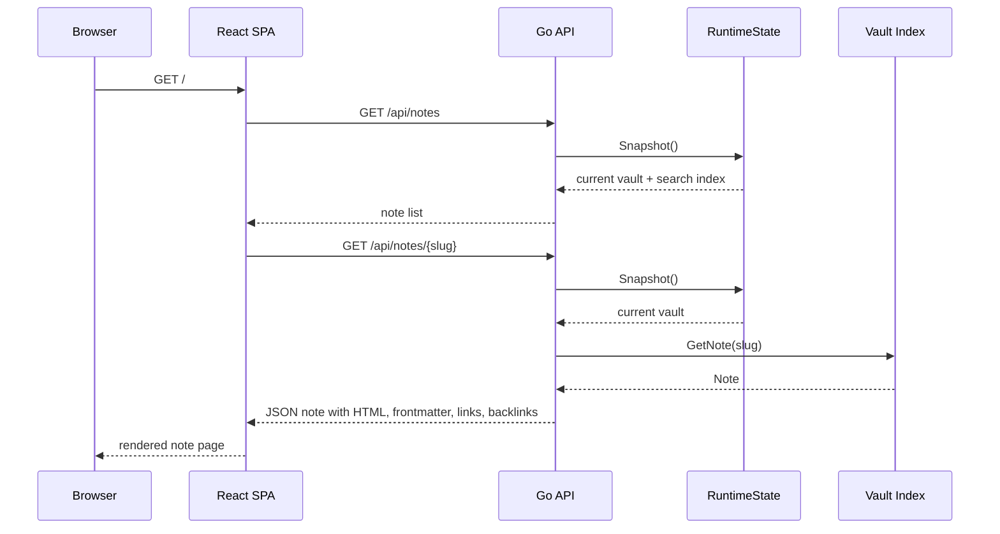

# Go-Go Parc Website: Implementation, Deployment, and Git-Sync Runtime

The Go-Go Parc website publishes this Obsidian vault as a searchable, cross-linked web application. The production URL is `https://parc.yolo.scapegoat.dev`. The deployed system has three repositories with separate responsibilities: the application repository builds the web server and user interface, the vault repository stores the Markdown content, and the k3s GitOps repository declares how the service runs in Kubernetes. This report explains the whole system from first principles: how a Markdown file becomes an API object, how the React application renders it, how the Go binary is built and deployed, and how `git-sync` updates the running site when new vault commits are pushed.

The central design choice is that content updates and application deployments are different operations. Application code changes produce a new container image and a new Kubernetes rollout. Content changes produce a new Git commit in the vault repository. The running Pod tracks the vault repository through `git-sync`, resolves the current checkout through a symlink, and asks the application to rebuild its in-memory vault and search index. Keeping these two loops separate is what makes the site operationally simple: the website can receive new notes without rebuilding or redeploying the application image.

## 1. The System Boundary

The production website is built from these components:

| Component | Location | Responsibility |
|---|---|---|
| Application | `/home/manuel/code/wesen/2026-05-13--retro-obsidian-publish` | Go API server, Markdown parser, search index, embedded React application, Docker image. |
| Vault content | `/home/manuel/code/wesen/go-go-golems/go-go-parc` | Markdown files, frontmatter, wiki links, project reports, articles, source notes. |
| GitOps deployment | `/home/manuel/code/wesen/2026-03-27--hetzner-k3s` | Kubernetes manifests, Argo CD Application, Vault Secrets Operator resources, ingress, service, deployment. |
| Container image | `ghcr.io/go-go-golems/retro-obsidian-publish:sha-6c22a66` | Immutable application artifact currently deployed. |
| Public site | `https://parc.yolo.scapegoat.dev` | TLS-terminated ingress served by the k3s cluster. |

The application process serves both the API and the static web application. The browser requests `/` and receives the embedded React application. The React application then calls `/api/notes`, `/api/notes/{slug}`, `/api/search`, `/api/tree`, and `/api/tags` from the same origin. The Go process handles those requests from in-memory data structures built from the mounted vault checkout.

The production vault path inside the container is:

```text
/git/root/current
```

That path is not an ordinary directory. It is the stable symlink published by `git-sync`. Each successful sync creates or updates a concrete worktree under `/git/root/.worktrees/{commit}` and then points `current` at that worktree. The application must resolve the symlink before loading the vault so that file walking happens against the concrete directory.

## 2. The Request Path

A request for a note has a short path through the system. The browser receives the initial application shell, selects a slug, and asks the API for the full note. The API reads from the active runtime snapshot. The runtime snapshot contains a `vault.Vault` and a Bleve search index. Those objects are replaced atomically during reloads.



This path has no database query at request time. The expensive work happens when the process starts and when a reload runs. During normal reads, handlers take a snapshot pointer and serialize existing data.

The API package represents this separation with a small interface:

```go
type SnapshotProvider interface {
    Snapshot() (*vault.Vault, *search.Index)
}
```

Handlers do not own the vault directly. They ask the provider for the current pair of objects. This indirection is what allows the reload endpoint to build a replacement vault and search index, then swap both into service without changing the request handlers.

## 3. Loading the Vault

The vault loader turns a filesystem tree into a set of note objects. Each Markdown file becomes one `Note`.

```go
type Note struct {
    Slug        string                 `json:"slug"`
    Title       string                 `json:"title"`
    Path        string                 `json:"path"`
    Frontmatter map[string]interface{} `json:"frontmatter"`
    Tags        []string               `json:"tags"`
    Excerpt     string                 `json:"excerpt"`
    HTML        string                 `json:"html"`
    WikiLinks   []WikiLinkRef          `json:"wikiLinks"`
    Backlinks   []string               `json:"backlinks"`
    ModTime     time.Time              `json:"modTime"`
}
```

The fields are chosen to serve the frontend directly. The `HTML` field contains rendered Markdown. The `WikiLinks` field preserves link structure for metadata and backlinks. The `Backlinks` field is computed after all notes are loaded, because a backlink is a relation from one note to another, not a property that a single note can know while it is being parsed.

The loader performs four phases:

1. Walk the vault directory and parse every `.md` file.
2. Build a wiki-link resolution index from note slugs, path suffixes, and title slugs.
3. Compute backlinks by resolving each extracted wiki link against the index.
4. Rewrite rendered HTML so wiki links point to real note slugs and unaliased links display target note titles.

The order matters. Wiki links cannot be resolved until every note is known. Backlinks cannot be computed until wiki links resolve. HTML cannot be finalized until target slugs and titles are available.

### 3.1 Slugs

A slug is the URL identity of a note. It is derived from the note path. For example:

```text
Projects/00-project-index-repos-and-concepts.md
```

becomes:

```text
projects/00-project-index-repos-and-concepts
```

The slug is stable across rendering and API requests. The UI navigates to `/note/{slug}`, and the API serves the note from `/api/notes/{slug}`.

### 3.2 Wiki-Link Resolution

Obsidian links are often written using short paths. A note may link to `[[Tribal/App-Auth]]` even though the full vault slug is `research/kb/tribal/app-auth`. The application builds a suffix index so short links resolve to full vault slugs.

For a note path such as:

```text
Research/KB/Tribal/App-Auth.md
```

resolution entries include:

```text
research/kb/tribal/app-auth -> research/kb/tribal/app-auth
kb/tribal/app-auth          -> research/kb/tribal/app-auth
tribal/app-auth             -> research/kb/tribal/app-auth
app-auth                    -> research/kb/tribal/app-auth
```

The first registered suffix wins if two notes claim the same short form. This is simple and predictable, but it means ambiguous links should be written with more path context.

### 3.3 Backlinks

Backlinks are computed from resolved wiki links. Each note starts with an empty backlink slice so the API always returns `[]`, not `null`. Then every source note contributes its slug to each target it links to.

The important invariant is that the API shape is stable for TypeScript consumers. Slices and maps that represent collections should be empty collections, not nullable values. This prevents UI code from needing defensive checks for every collection field.

## 4. Markdown Parsing and Frontmatter Normalization

Markdown parsing uses `goldmark` with GitHub-flavored Markdown extensions and `goldmark-meta` for frontmatter. The parser extracts four kinds of information from each file:

- rendered HTML;
- YAML frontmatter;
- wiki links and embeds;
- title, tags, and excerpt.

The parser also transforms Obsidian-specific constructs that normal Markdown parsers do not understand. Wiki links become anchor placeholders with `data-target`, `data-raw`, and `data-alias` attributes. Embeds become placeholder nodes that the frontend can populate with fetched note content.

A recent production bug clarified an important constraint: parsed YAML must be JSON-safe before the API serves it. `goldmark-meta` may return nested values with type `map[interface{}]interface{}`. Go's standard JSON encoder cannot serialize maps whose keys are not strings. A note with frontmatter such as this can trigger the problem:

```yaml
RelatedFiles:
  - Path: pkg/media/gst/recording.go
    Note: Direct recording builder with x264enc
```

The top-level object can be `map[string]interface{}`, while the nested list entries can still be `map[interface{}]interface{}`. The fix is recursive normalization:

```go
func normalizeYAMLValue(value interface{}) interface{} {
    switch v := value.(type) {
    case map[string]interface{}:
        out := make(map[string]interface{}, len(v))
        for key, child := range v {
            out[key] = normalizeYAMLValue(child)
        }
        return out
    case map[interface{}]interface{}:
        out := make(map[string]interface{}, len(v))
        for key, child := range v {
            out[fmt.Sprint(key)] = normalizeYAMLValue(child)
        }
        return out
    case []interface{}:
        out := make([]interface{}, len(v))
        for i, child := range v {
            out[i] = normalizeYAMLValue(child)
        }
        return out
    default:
        return value
    }
}
```

This change moved the invariant into the parser: every note loaded by the vault now carries JSON-encodable frontmatter. The API no longer needs special cases for nested metadata.

## 5. Search

The search subsystem uses Bleve. On startup or reload, the application builds a fresh search index from the loaded vault. Each note contributes fields such as title, path, tags, excerpt, and content. Search requests call `/api/search?q={query}` and return ranked results to the frontend.

The production runtime treats the search index as part of the same snapshot as the vault. This matters because a search result must refer to notes that exist in the active vault. If the vault and search index were swapped independently, there would be a short interval where search could return stale slugs or miss newly loaded notes. The reload path avoids that by building both objects first and swapping them together.

```go
func (s *RuntimeState) Reload() error {
    configured := s.ConfiguredRoot()
    v, si, resolved, err := loadVaultAndSearch(configured)
    if err != nil {
        return err
    }

    s.mu.Lock()
    s.vault = v
    s.search = si
    s.resolvedRoot = resolved
    s.mu.Unlock()
    return nil
}
```

A failed reload leaves the old state active. This is the correct behavior for a public website: serving slightly older content is better than replacing a working snapshot with a broken one.

## 6. The Frontend

The frontend is a React and Vite application. It uses Redux Toolkit and RTK Query for API access. It is built into static assets and embedded into the Go binary for production.

The UI has three primary page concepts:

| Page or component | Responsibility |
|---|---|
| `VaultLayout` | Overall layout, side tree, menu controls, panel state. |
| `NotePage` | Fetches a note, coordinates right panel and navigation. |
| `NoteRenderer` | Renders server-provided HTML and enriches it with client-side behavior. |
| `SearchPage` | Runs search queries and renders result lists. |

`NoteRenderer` is the component where most Markdown presentation behavior becomes interactive. The backend sends rendered HTML. The frontend then performs browser-side enhancements:

- intercept wiki-link clicks and route them through the single-page application;
- render Mermaid code blocks into SVG;
- highlight non-Mermaid code blocks with `highlight.js`;
- add copy buttons to code blocks;
- fetch and insert embedded notes for `![[...]]` placeholders;
- add heading permalink anchors;
- implement collapsible callout toggles.

The split is intentional. The backend owns durable document semantics: Markdown parsing, wiki-link extraction, link resolution, backlinks, and search indexing. The frontend owns browser presentation: syntax highlighting, clipboard operations, Mermaid rendering, hash scrolling, and interaction state.

### 6.1 Homepage Selection

The homepage currently chooses a note from `/api/notes`. The intended production home note is:

```text
projects/00-project-index-repos-and-concepts
```

The first implementation used a broad heuristic that selected the first slug ending in `/index`. In the production vault, that selected a nested source note:

```text
research/institute/technical-reports/2026-04-15-x264-go-page-fault-analysis/sources/index
```

The fix made the heuristic more explicit. It prefers known home slugs, excludes `/sources/index` notes from fallback index selection, and only then falls back to other candidates.

```ts
const preferredHomeSlugs = [
  "index",
  "home",
  "readme",
  "projects/00-project-index-repos-and-concepts",
  "research/institute/guidelines/guidelines-index",
];
```

This is a useful improvement, but a future version should move the home slug into runtime configuration. A production homepage is configuration, not a property that the browser should infer from note names.

## 7. Single-Binary Build

The production target is a single Go binary. The build has three stages:

1. Build the React application with pnpm and Vite.
2. Copy `web/dist` into `backend/internal/web/embed/public`.
3. Build the Go binary with the `embed` tag so the static assets are compiled into the executable.

The Dockerfile expresses this as a multi-stage build:

```dockerfile
FROM node:22-alpine AS web-builder
WORKDIR /src/web
RUN corepack enable
COPY web/package.json web/pnpm-lock.yaml ./
COPY web/patches ./patches
RUN pnpm install --frozen-lockfile
COPY web ./
RUN pnpm build

FROM golang:1.25-alpine AS go-builder
RUN apk add --no-cache build-base
WORKDIR /src/backend
COPY backend/go.mod backend/go.sum ./
RUN go mod download
COPY backend ./
COPY --from=web-builder /src/web/dist ./internal/web/embed/public
RUN CGO_ENABLED=1 go build -tags embed -o bin/retro-obsidian-publish ./cmd/retro-obsidian-publish

FROM alpine:3.20
RUN apk add --no-cache ca-certificates
WORKDIR /app
COPY --from=go-builder /src/backend/bin/retro-obsidian-publish ./retro-obsidian-publish
ENTRYPOINT ["./retro-obsidian-publish"]
```

CGO is enabled because the dependency set includes SQLite-related code through the CLI framework stack. The final runtime image contains only the compiled binary and CA certificates.

The deployed image at the time of this report is:

```text
ghcr.io/go-go-golems/retro-obsidian-publish:sha-6c22a66
```

## 8. Runtime Configuration

The production container starts the application with these arguments:

```text
serve
--port 8080
--serve-web
--watch=false
--reload-allow-loopback
--vault /git/root/current
```

Each flag has a specific purpose:

| Flag | Purpose |
|---|---|
| `serve` | Start the HTTP server. |
| `--port 8080` | Listen inside the Pod on port 8080. |
| `--serve-web` | Serve the embedded React application from `/`. |
| `--watch=false` | Disable local fsnotify watching in production. |
| `--reload-allow-loopback` | Allow the in-Pod git-sync sidecar to call the reload endpoint without a bearer token. |
| `--vault /git/root/current` | Load content from git-sync's published checkout symlink. |

Disabling the watcher is important in the git-sync deployment. The production update mechanism is not individual filesystem events. It is a complete checkout update followed by an explicit reload. That means the application should rebuild its vault and search index from the current symlink target, not react to partial file events during a Git checkout update.

## 9. Health and Reload Endpoints

The server exposes two deployment-oriented endpoints:

| Method | Path | Purpose |
|---|---|---|
| `GET` | `/api/healthz` | Report process health, note count, configured vault root, and resolved vault root. |
| `POST` | `/api/admin/reload` | Rebuild the vault and search index from the current git-sync symlink. |

A live health response after the verified git-sync update was:

```json
{
  "ok": true,
  "notes": 516,
  "vaultRoot": "/git/root/.worktrees/e468e03cf578db6e600251034b7a96bff0324a3c",
  "configuredRoot": "/git/root/current"
}
```

The distinction between `configuredRoot` and `vaultRoot` is essential. The configured root is stable and appears in the Kubernetes manifest. The resolved root changes when `git-sync` publishes a new commit. The health response makes the current content revision observable without requiring shell access to the Pod.

The reload endpoint has two authorization modes:

1. A bearer token can be supplied through `RETRO_RELOAD_TOKEN`.
2. Loopback requests can be allowed with `--reload-allow-loopback`.

Production uses loopback authorization for `git-sync`. External reload requests are rejected. A direct public request to the reload endpoint returns `401`.

## 10. Kubernetes Deployment

The k3s deployment lives under:

```text
/home/manuel/code/wesen/2026-03-27--hetzner-k3s/gitops/kustomize/retro-obsidian-publish
```

The Deployment has one replica and three workload containers: one initContainer and two regular containers.

| Container | Type | Responsibility |
|---|---|---|
| `git-sync-init` | initContainer | Clone the vault once before the app starts. |
| `app` | application container | Run the Go server and serve the API and frontend. |
| `git-sync` | sidecar | Poll the vault Git repository and call the reload webhook after updates. |

The shared volume is an `emptyDir` mounted at `/git`. The initContainer and sidecar mount it read-write. The application mounts it read-only. This gives the application access to content without allowing it to mutate the Git checkout.

```yaml
volumes:
  - name: vault-git
    emptyDir: {}
  - name: git-ssh
    secret:
      secretName: retro-obsidian-publish-vault-git
      defaultMode: 0440
```

The pod-level security context includes:

```yaml
securityContext:
  fsGroup: 65533
```

This was required because the `git-sync` container runs as a non-root user. The SSH key and `known_hosts` files must be readable by that user. The first rollout failed because the secret files were mounted with mode `0400`; the files existed, but the process could not read them. The working deployment uses `0440` plus `fsGroup: 65533`.

## 11. The Git-Sync Mechanism

The content sync loop is the most important operational part of the site. The sidecar is configured with:

```text
--repo=git@github.com:go-go-golems/go-go-parc.git
--ref=main
--root=/git/root
--link=current
--period=60s
--depth=1
--ssh-key-file=/etc/git-secret/ssh
--ssh-known-hosts=true
--ssh-known-hosts-file=/etc/git-secret/known_hosts
--webhook-url=http://127.0.0.1:8080/api/admin/reload
--webhook-method=POST
--webhook-success-status=204
--webhook-timeout=30s
```

The update sequence is:

1. `git-sync` polls `main` in `git@github.com:go-go-golems/go-go-parc.git`.
2. If the remote commit changed, it fetches the new commit into a worktree under `/git/root/.worktrees/{commit}`.
3. It updates `/git/root/current` to point to the new worktree.
4. It sends `POST http://127.0.0.1:8080/api/admin/reload`.
5. The application resolves `/git/root/current` to the concrete worktree.
6. The application builds a new vault and search index.
7. The application atomically swaps the active runtime state.
8. `/api/healthz` reports the new resolved worktree path and note count.

```mermaid
sequenceDiagram
  participant GitHub as go-go-parc GitHub repo
  participant Sync as git-sync sidecar
  participant Link as /git/root/current
  participant App as Go app
  participant State as RuntimeState

  Sync->>GitHub: poll main
  GitHub-->>Sync: new commit hash
  Sync->>Sync: fetch shallow worktree
  Sync->>Link: publish current symlink
  Sync->>App: POST /api/admin/reload
  App->>Link: EvalSymlinks(/git/root/current)
  App->>App: load vault and build search index
  App->>State: atomic swap
  App-->>Sync: 204 No Content
```

A real update verified this sequence. Before the test, health reported 513 notes from commit `5d5d5bd...`. After pushing a new article to the vault, `git-sync` detected remote commit `e468e03cf578db6e600251034b7a96bff0324a3c`, updated the checkout, and the app logged:

```text
reload: loaded 516 notes from /git/root/.worktrees/e468e03cf578db6e600251034b7a96bff0324a3c
```

The note count increased by three because the deployed checkout was behind by three vault commits total. Search immediately found the new article:

```text
projects/2026/05/14/article-providence-therapist-search-a-retro-monochrome-research-dashboard
Providence Therapist Search: A Retro Monochrome Research Dashboard
```

## 12. Secrets and Registry Access

The deployment uses HashiCorp Vault through Vault Secrets Operator. There are two runtime secret categories:

| Secret | Vault path | Kubernetes destination | Purpose |
|---|---|---|---|
| Vault Git SSH credential | `kv/apps/retro-obsidian-publish/prod/vault-git` | `retro-obsidian-publish-vault-git` | Lets `git-sync` read the private vault repository. |
| GHCR image pull credential | `kv/apps/retro-obsidian-publish/prod/image-pull` | `retro-obsidian-publish-ghcr-pull` | Lets the kubelet pull the private GHCR image. |

The Git credential secret is mounted as files:

```text
/etc/git-secret/ssh
/etc/git-secret/known_hosts
```

The image pull secret is transformed into Docker config JSON:

```yaml
destination:
  name: retro-obsidian-publish-ghcr-pull
  create: true
  overwrite: true
  type: kubernetes.io/dockerconfigjson
  transformation:
    templates:
      .dockerconfigjson:
        text: |
          {"auths":{"{{ .Secrets.server }}":{"username":"{{ .Secrets.username }}","password":"{{ .Secrets.password }}","auth":"{{ .Secrets.auth }}"}}}
```

The image pull secret was added after the first deployment reached `ImagePullBackOff`. GHCR returned `401 Unauthorized` for anonymous pulls. The working system keeps the image private and gives Kubernetes a dedicated pull credential.

## 13. Ingress and TLS

The Kubernetes Service exposes the application internally on port 80 and forwards to container port 8080. The Ingress uses Traefik and cert-manager:

```yaml
spec:
  ingressClassName: traefik
  tls:
    - hosts:
        - parc.yolo.scapegoat.dev
      secretName: retro-obsidian-publish-tls
  rules:
    - host: parc.yolo.scapegoat.dev
      http:
        paths:
          - path: /
            pathType: Prefix
            backend:
              service:
                name: retro-obsidian-publish
                port:
                  number: 80
```

cert-manager issued the certificate through the `letsencrypt-prod` ClusterIssuer. The final ingress state served `HTTP/2 200` for the root page and valid JSON from `/api/healthz`.

## 14. Rollout Failures and Their Fixes

The deployment did not become healthy on the first attempt. Each failure identified a missing production constraint.

| Failure | Symptom | Cause | Fix |
|---|---|---|---|
| SSH host verification failure | `Init:CrashLoopBackOff` in `git-sync-init` | Secret files were not readable by git-sync's non-root user. | Add `fsGroup: 65533` and set secret `defaultMode: 0440`. |
| Private image pull failure | `ImagePullBackOff` for the app container | GHCR image required authentication. | Add Vault-backed `kubernetes.io/dockerconfigjson` image pull secret. |
| App restart with exit 137 | App loaded notes, then restarted. | Memory and startup/reload timing were too tight for the vault load and webhook retry behavior. | Increase memory limit to `1536Mi`, set webhook timeout to `30s`, relax readiness and liveness probes. |
| Homepage selected a source index | `/` opened a nested `sources/index` note. | The fallback heuristic selected the first slug ending with `/index`. | Prefer explicit home slugs and exclude `/sources/index` candidates. |
| Full note endpoint returned 500 | `/api/notes/{slug}` returned `encoding failed`. | Nested YAML maps were `map[interface{}]interface{}`. | Recursively normalize frontmatter before storing it in notes. |

Each fix became part of the deployed configuration or application code. The current system is not just a successful manual deployment; it encodes the constraints that were discovered during rollout.

## 15. Operational Commands

These commands inspect the deployed state:

```bash
cd /home/manuel/code/wesen/2026-03-27--hetzner-k3s
export KUBECONFIG="$PWD/.cache/kubeconfig-tailnet.yaml"

kubectl -n argocd get app retro-obsidian-publish
kubectl -n retro-obsidian-publish get pods
kubectl -n retro-obsidian-publish logs deploy/retro-obsidian-publish -c app --tail=80
kubectl -n retro-obsidian-publish logs deploy/retro-obsidian-publish -c git-sync --tail=80
```

These commands inspect the public API:

```bash
curl -fsS https://parc.yolo.scapegoat.dev/api/healthz
curl -fsS https://parc.yolo.scapegoat.dev/api/notes/projects/00-project-index-repos-and-concepts | jq '{slug,title,path}'
curl -fsS 'https://parc.yolo.scapegoat.dev/api/search?q=Providence%20Therapist' | jq '.[0] | {slug,title}'
```

These commands publish a vault content update:

```bash
cd /home/manuel/code/wesen/go-go-golems/go-go-parc
git add Projects/2026/05/14/new-note.md
git commit -m "Add new note"
git push origin main
```

Within roughly one `git-sync` period, the app should report a new resolved worktree in `/api/healthz`.

## 16. Why This Architecture Works

The system works because each layer has one primary job.

- The vault repository stores content and history.
- The application parses content, computes derived data, and serves HTTP.
- The frontend renders documents and browser interactions.
- The container image packages application code and embedded static assets.
- Argo CD reconciles Kubernetes resources.
- `git-sync` reconciles runtime content.
- Vault Secrets Operator materializes runtime credentials.
- The reload endpoint converts a content checkout update into an application state update.

The separation prevents a common deployment problem: rebuilding the whole application for every content change. A vault commit is not an application release. It should update the content snapshot, not the container image. The `git-sync` plus reload design implements that distinction directly.

The current result is a working production website with these verified properties:

- The public site serves over HTTPS at `parc.yolo.scapegoat.dev`.
- The app and API run from one Go binary.
- The vault content comes from `git@github.com:go-go-golems/go-go-parc.git`.
- New vault commits are pulled by `git-sync` and loaded without rebuilding the image.
- The active content commit is visible through `/api/healthz`.
- Nested YAML frontmatter is safe to serve as JSON.
- The homepage opens the project index rather than an incidental source index.

## 17. Remaining Improvements

The deployment is functional, but several improvements would make it easier to operate and extend.

1. Add an explicit `--home-slug` configuration option. The current frontend heuristic works, but production should not need to infer its homepage from note names.
2. Add reload metrics. Useful fields include last reload time, last reload duration, last reload error, and current content commit.
3. Debounce reloads. If several commits arrive quickly, the app can avoid redundant reloads by serializing or coalescing reload requests.
4. Add a startup probe. The current liveness and readiness settings are stable, but a separate startup probe would express initial loading more directly.
5. Reduce frontend bundle size. Mermaid and related diagram dependencies produce large chunks. Dynamic imports would keep the first load smaller.
6. Add ambiguity reporting for wiki-link suffix resolution. If two notes claim the same short target, the loader could report the conflict for cleanup.
7. Add a small admin status page. It could show health, content commit, note count, reload history, and git-sync status extracted from logs or an internal state endpoint.

These are refinements, not prerequisites. The important boundary is already in place: application releases and vault content updates now move through separate, observable paths.
