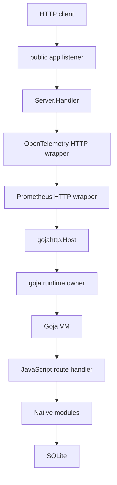
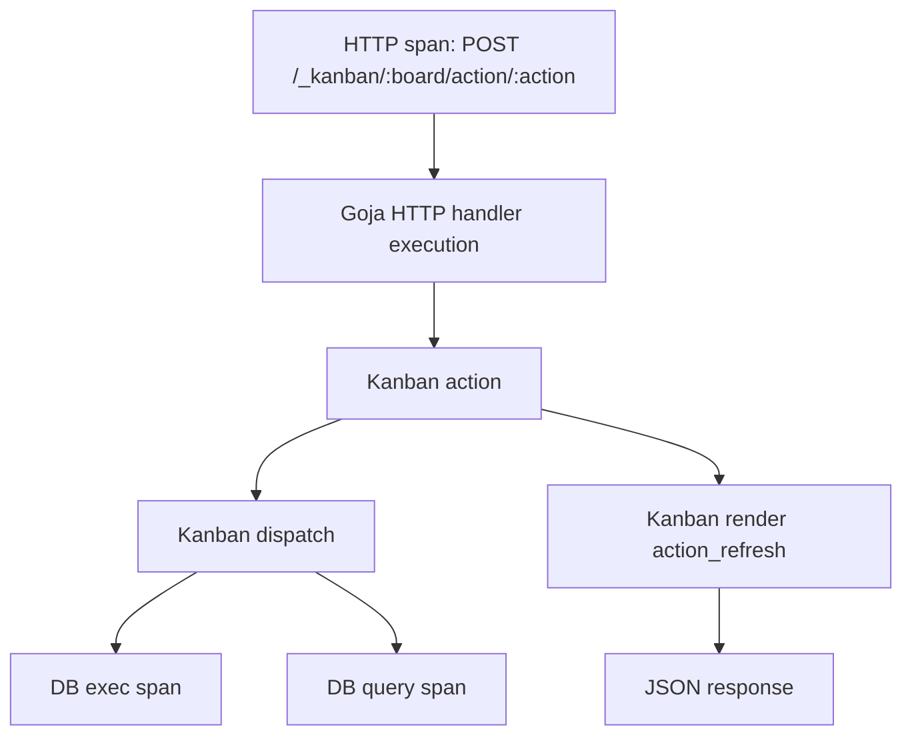
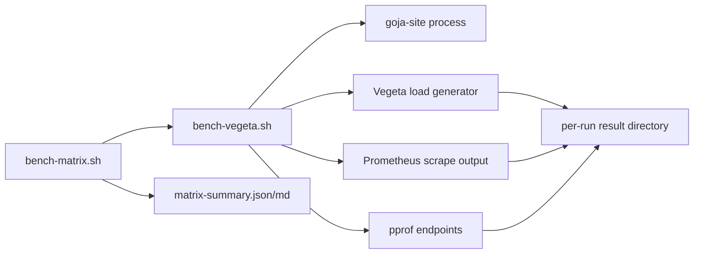
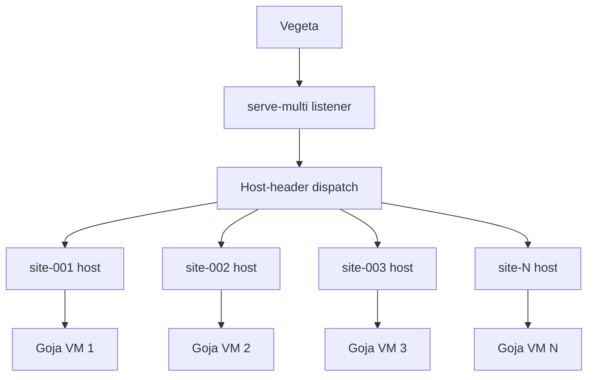

# Goja Site Observability, Benchmarking, and Stress Testing Deep Dive

This report explains the performance and observability work done for `goja-site`, a Go service that hosts JavaScript applications inside Goja runtimes. The immediate goal was to stop guessing about performance. The deeper goal was to build a measurement system that can answer where request time is spent, whether database and native-module work belongs to the correct request trace, and what happens when a hosted site is pushed past its useful throughput range.

The source repository is `/home/manuel/code/wesen/2026-05-03--goja-hosting-site`. The work is recorded in two ticket workspaces:

- `ttmp/2026/05/14/GOJA-PERF-BENCH--stress-test-benchmark-and-performance-measurement-plan-for-goja-hosting`
- `ttmp/2026/05/15/GOJA-STRESS-TEST--stress-testing-breakdown-experiments-for-goja-site`
- `ttmp/2026/05/15/GOJA-MULTI-VM-STRESS--multi-vm-serve-multi-stress-testing-for-goja-site`

> [!summary]
> The project now has a private Prometheus diagnostics listener, optional pprof capture, OpenTelemetry tracing, request-context propagation from HTTP into Goja native modules, a Vegeta benchmark matrix, SQLite-backed result storage, SQL-backed Markdown reports, single-VM stress evidence showing that the Kanban action path begins to saturate around 80 requests per second, and multi-VM `serve-multi` evidence showing that Kanban fragment rendering saturates through shared rendering, allocation, GC, and large-response costs rather than Host-header dispatch.

## 1. What was being measured

The first important decision was to define the system under test accurately. The benchmark harness does not measure a pool of many Goja runtimes, and it does not create a new JavaScript VM per request. The ordinary `serve` command starts one Go process, one `Server`, one SQLite database connection pool, one `gojahttp.Host`, one `go-go-goja` engine runtime, one Goja VM, and one runtime-owner event loop. HTTP requests may arrive concurrently through Go's HTTP server, but JavaScript execution is serialized through the runtime owner.

That distinction changes how the results should be read. The numbers describe saturation of one already-started JavaScript site backed by one long-lived Goja VM. They do not yet describe many-site hosting, cold VM startup, VM reload time, VM pooling, or many idle VMs with one hot site. Each matrix cell starts a fresh `goja-site` process, creates a fresh VM and database, warms it up if requested, then reuses that VM throughout the measured load interval.

The initial scenarios were designed to separate layers:

| Scenario | Fixture | Purpose |
|---|---|---|
| `null` | `bench/scripts/null-route` | Measure minimal HTTP plus Goja handler overhead. |
| `render` | `bench/scripts/render-route` | Measure server-side UI DSL rendering with a controlled route. |
| `db-read` | `bench/scripts/db-read-write` | Measure SQLite read paths and DB metrics. |
| `db-write` | `bench/scripts/db-read-write` | Measure SQLite write paths and DB exec instrumentation. |
| `kanban-fragment` | `bench/scripts/kanban-board` | Measure mounted Kanban fragment rendering for a 120-card board. |
| `kanban-action` | `bench/scripts/kanban-board` | Measure a valid `cardMoved` action followed by refreshed HTML. |
| `kanban-mixed` | `bench/scripts/kanban-board` | Approximate a UI workload with mostly fragments and some actions. |

The scenarios are documented in `bench/scenarios.yaml`. The benchmark runner also supports `multi`, but the short and stress matrices discussed here focused on the single-site `serve` path.

## 2. The runtime architecture

A single-site server is constructed in `pkg/app/server.go`. The server owns the database, Goja runtime, Goja HTTP host, and the public HTTP server. During construction, it opens SQLite, creates a route host, configures database modules, registers native modules, builds a Goja runtime, attaches the runtime owner to the host, and loads JavaScript scripts from the fixture directory.

The shape is:



The handler wrapping order matters. `Server.Handler()` starts with `s.host`, optionally wraps it with HTTP metrics, and optionally wraps that result with the OpenTelemetry HTTP handler. This means the HTTP span encloses the measured Goja route execution. Database spans can then become children of that HTTP span if the request context reaches the database module.

The simplified path is:

```go
func (s *Server) Handler() http.Handler {
    handler := http.Handler(s.host)
    if s.cfg.Observability != nil && s.cfg.Observability.HTTP != nil {
        handler = s.cfg.Observability.HTTP.Wrap(s.cfg.SiteName, handler)
    }
    if s.cfg.Observability != nil {
        handler = s.cfg.Observability.WrapTrace(s.cfg.SiteName, handler)
    }
    return handler
}
```

Script loading also goes through the runtime owner:

```go
_, err = s.runtime.Owner.Call(ctx, "load-script", func(_ context.Context, vm *goja.Runtime) (any, error) {
    _, err := vm.RunScript(file, string(data))
    return nil, err
})
```

The owner boundary is the key concurrency boundary. It protects the Goja VM by executing VM work on the owner event loop. It also means high-rate request load can create queueing even while Go's HTTP server continues accepting requests.

## 3. Observability foundation

The first implementation phase added a dedicated `pkg/observability` package rather than scattering Prometheus and OpenTelemetry code through product packages. The package owns registry setup, diagnostics serving, HTTP middleware, database instrumentation, guard instrumentation, Kanban instrumentation, label normalization, and tracing setup.

The diagnostics listener is separate from the public app listener. This is a security and correctness choice. `/metrics` and `/debug/pprof/*` are operational endpoints, not application routes. They should be private, opt-in, and bound to an address such as `127.0.0.1:19090` unless an operator deliberately exposes them.

The implemented Prometheus surfaces include:

| Area | Metric examples |
|---|---|
| HTTP | `goja_site_http_requests_total`, `goja_site_http_request_duration_seconds`, `goja_site_http_response_bytes`, `goja_site_http_in_flight_requests` |
| Multi-site dispatch | `goja_site_hosts_configured`, `goja_site_site_up`, `goja_site_unknown_host_requests_total`, `goja_site_multi_dispatch_duration_seconds` |
| Database | `goja_site_db_operations_total`, `goja_site_db_operation_duration_seconds`, `goja_site_db_errors_total` |
| Guard | `goja_site_db_guard_checks_total`, `goja_site_db_guard_check_duration_seconds`, `goja_site_db_guard_limit_exceeded_total`, `goja_site_db_size_bytes` |
| Kanban | `goja_site_kanban_fragment_duration_seconds`, `goja_site_kanban_action_duration_seconds`, `goja_site_kanban_dispatch_duration_seconds`, `goja_site_kanban_render_duration_seconds`, `goja_site_kanban_rendered_html_bytes`, `goja_site_kanban_errors_total` |

The HTTP middleware in `pkg/observability/http.go` records request count, duration, response size, and in-flight count. Labels are bounded: site name, normalized method, coarse route, and status class. It deliberately avoids raw paths, raw query strings, user identifiers, session identifiers, and arbitrary error text.

```go
m.Requests.WithLabelValues(site, method, route, StatusClass(status)).Inc()
m.Duration.WithLabelValues(site, method, route).Observe(time.Since(start).Seconds())
m.ResponseBytes.WithLabelValues(site, method, route).Observe(float64(rec.Bytes()))
```

This label discipline is fundamental. Metrics are long-lived time series. A raw path, Host header, SQL string, user ID, or JavaScript error string can create unbounded cardinality. High-cardinality labels degrade Prometheus performance and make dashboards harder to interpret. The project therefore uses helpers such as `CoarseRoute`, `SiteLabel`, `MethodLabel`, `StatusClass`, `SQLKindLabel`, and `ErrorClass`.

## 4. OpenTelemetry and request context propagation

Tracing began with an OpenTelemetry slice in `pkg/observability/tracing.go`. The implementation uses OTLP over HTTP, not Jaeger-specific APIs. Jaeger can receive traces through an OpenTelemetry Collector, but the application exports OTLP. This keeps the application backend-neutral.

The tracing setup creates a tracer provider with a parent-based trace-id-ratio sampler:

```go
provider := sdktrace.NewTracerProvider(
    sdktrace.WithBatcher(exporter),
    sdktrace.WithSampler(sdktrace.ParentBased(sdktrace.TraceIDRatioBased(sampleRatio))),
    sdktrace.WithResource(res),
)
```

The HTTP handler is wrapped with `otelhttp.NewHandler`, using the coarse route as the span name:

```go
return otelhttp.NewHandler(next, "goja-site.http.request",
    otelhttp.WithSpanNameFormatter(func(_ string, r *http.Request) string {
        return r.Method + " " + CoarseRoute(r.URL.Path)
    }),
)
```

The non-obvious part was database span parentage. The existing `go-go-goja` architecture already passed `r.Context()` into the owner call that invokes JavaScript HTTP handlers. The gap was that native modules called from JavaScript had no standard way to retrieve the active owner-call context. The database module exposed `Query` and `Exec` without `context.Context`, so `goja-site` could create DB spans but initially had to use `context.Background()`. That produced disconnected traces.

The fix was made in the local `go-go-goja` repository. The runtime bridge gained a current-call context mechanism:

```go
func WithCallContext(vm *goja.Runtime, ctx context.Context, fn func() (any, error)) (any, error)
func WithCallContextVoid(vm *goja.Runtime, ctx context.Context, fn func() error) error
func CurrentContext(vm *goja.Runtime) context.Context
```

The runtime owner wraps owner-call invocation with the active context. Native modules can call `runtimebridge.CurrentContext(vm)` to retrieve the request context active for the current JavaScript call. The database module then grew context-aware execution support while preserving the old API shape.

The desired trace structure became:



The database wrapper in `pkg/observability/sql.go` now supports both context-aware and legacy execution. If the wrapped object implements `databasemod.QueryExecerContext`, the request context is forwarded into `QueryContext` and `ExecContext`; otherwise it falls back to the older interface.

```go
func queryContext(ctx context.Context, inner databasemod.QueryExecer, query string, args ...any) (*sql.Rows, error) {
    if innerContext, ok := inner.(databasemod.QueryExecerContext); ok {
        return innerContext.QueryContext(ctx, query, args...)
    }
    return inner.Query(query, args...)
}
```

`simpleDB` and `dbguard.MeteredDB` implement context-aware methods, so request cancellation and trace parentage both reach SQLite. A regression test, `TestServerDBSpansAreChildrenOfHTTPSpan`, verifies that DB spans are children of HTTP spans.

The rule that came out of this work is simple: JavaScript authors should keep writing normal calls such as `db.query(...)`. The native module should discover the active Go context implicitly. Exposing Go `context.Context` as a user-facing JavaScript value would make every script author responsible for plumbing an implementation detail through their application.

## 5. Domain instrumentation: database, guard, and Kanban

Database metrics are implemented as a wrapper around the database module's `QueryExecer` interface. This keeps the instrumentation at the boundary where JavaScript calls turn into SQL operations. The wrapper records operation kind, SQL kind, duration, and coarse error class. It does not record raw SQL text.

The SQL kind classifier strips comments and inspects the first SQL token. It emits labels such as `select`, `insert`, `update`, `delete`, `pragma`, or `other`. This is enough to understand workload shape without creating a metric series per query.

Guard metrics are exposed through an observer interface in `pkg/dbguard`. This avoids importing Prometheus into the guard package. The guard package reports events such as checks, cleanup attempts, limit exceedances, current DB size, configured limit, and writes since last check. The observability package implements the observer.

Kanban metrics use the same pattern. `pkg/kanbanddsl/observer.go` defines an observer interface, and `pkg/observability/kanban.go` implements it. The mounted Kanban routes measure several distinct phases:

1. Fragment request handling.
2. Action request handling.
3. Action dispatch.
4. Refresh rendering after an action.
5. Rendered HTML bytes.

The action route in `pkg/kanbanddsl/mount.go` is where the saturation finding later became understandable. A `POST /_kanban/bench/action/cardMoved` request dispatches the action. If the action result requests refresh, the server calls `b.Render(...)`, converts the UI DSL node to HTML through `uidsl.RenderAny`, stores that HTML in the JSON response as `out["html"]`, and then sends the JSON response.

The core path is:

```go
result, err := b.Dispatch(action, bodyObj)
// ...
refresh := shouldRefresh(out["refresh"])
if refresh {
    node, err := b.Render(...)
    html, err := uidsl.RenderAny(b.vm, b.vm.ToValue(node))
    out["html"] = html
}
res.json(out)
```

This is not a small acknowledgement response. It is a full action plus a refreshed HTML payload. In the benchmark fixture, that refreshed board contains 120 cards.

## 6. Benchmark harness design

The benchmark harness has two layers. `scripts/bench-vegeta.sh` runs one scenario at one rate. `scripts/bench-matrix.sh` runs a matrix of scenarios, rates, and repeat counts.

`bench-vegeta.sh` is responsible for the lifecycle of a single measured run:

1. Build or receive a `goja-site` binary.
2. Create a temporary SQLite database.
3. Write a Vegeta target file for the selected scenario.
4. Start `goja-site` with the right fixture scripts.
5. Wait until the app and metrics endpoint are ready.
6. Optionally run a warmup load.
7. Capture Prometheus metrics before measurement.
8. Run Vegeta for the measured duration.
9. Capture Prometheus metrics after measurement.
10. Diff selected metric values into `metrics-delta.txt`.
11. Optionally capture pprof profiles.
12. Write `vegeta.bin`, `vegeta.json`, `vegeta.txt`, `metadata.json`, copied `targets.txt`, metrics snapshots, and logs.

The pprof mode is part of the same script. When `--pprof` is passed, the server starts with private pprof enabled, and the script downloads CPU, heap, allocs, and goroutine diagnostics from the diagnostics listener.

The command used for the Kanban 80/s profile was:

```bash
scripts/bench-vegeta.sh \
  --scenario kanban-action \
  --duration 30s \
  --warmup-duration 5s \
  --rate 80/s \
  --port 18700 \
  --metrics-port 19700 \
  --out-dir ttmp/2026/05/15/GOJA-STRESS-TEST--stress-testing-breakdown-experiments-for-goja-site/archive/pprof-kanban-action-80rps-20260515T151521Z \
  --pprof \
  --pprof-seconds 20
```

`bench-matrix.sh` repeats this process across cells. It increments app and metrics ports per run, writes `runs.tsv`, and produces a `matrix-summary.json` and `matrix-summary.md`. The matrix script intentionally shells out to the single-run script rather than reimplementing its logic.

The data flow is:



The benchmark fixtures are real JavaScript sites. The Kanban action target is a valid action endpoint:

```text
POST /_kanban/bench/action/cardMoved
Content-Type: application/json
Cookie: goja_session=bench-session

{"cardId":"1","to":{"columnId":"done","index":0}}
```

The Prometheus deltas confirmed that the mixed and action scenarios hit the intended route classes and Kanban observer paths. For example, `kanban-action` increments `goja_site_kanban_action_duration_seconds_count` with action `cardMoved`, board `bench`, and refresh `true`.

## 7. SQLite-backed reporting

The project originally had a reporting direction that mentioned MySQL, but the corrected requirement was to use SQLite. That was the right storage format for this project because benchmark results are local, portable, easy to commit when small, and easy to query from scripts without running a server.

The schema has three tables:

```sql
CREATE TABLE benchmark_matrices (
  matrix_id TEXT PRIMARY KEY,
  created_at_utc TEXT NOT NULL,
  imported_at_utc TEXT NOT NULL DEFAULT (strftime('%Y-%m-%dT%H:%M:%SZ', 'now')),
  out_root TEXT NOT NULL,
  repo_commit TEXT NOT NULL,
  git_dirty INTEGER NOT NULL DEFAULT 0,
  duration TEXT NOT NULL,
  warmup_duration TEXT NOT NULL,
  scenarios TEXT NOT NULL,
  rates TEXT NOT NULL,
  repeat_count INTEGER NOT NULL,
  command_line TEXT NOT NULL,
  source_summary_json TEXT NOT NULL,
  source_summary_md TEXT NOT NULL
);

CREATE TABLE benchmark_runs (
  id INTEGER PRIMARY KEY AUTOINCREMENT,
  matrix_id TEXT NOT NULL REFERENCES benchmark_matrices(matrix_id) ON DELETE CASCADE,
  scenario TEXT NOT NULL,
  rate_target TEXT NOT NULL,
  run_number INTEGER NOT NULL,
  out_dir TEXT NOT NULL,
  duration TEXT NOT NULL,
  warmup_duration TEXT NOT NULL,
  requests INTEGER NOT NULL,
  throughput REAL NOT NULL,
  success_ratio REAL NOT NULL,
  p50_ms REAL NOT NULL,
  p95_ms REAL NOT NULL,
  p99_ms REAL NOT NULL,
  max_ms REAL NOT NULL,
  status_codes_json TEXT NOT NULL,
  errors_json TEXT NOT NULL,
  metadata_json TEXT NOT NULL,
  vegeta_json TEXT NOT NULL,
  metrics_delta_text TEXT NOT NULL,
  UNIQUE(matrix_id, scenario, rate_target, run_number)
);

CREATE TABLE benchmark_metric_deltas (
  id INTEGER PRIMARY KEY AUTOINCREMENT,
  run_id INTEGER NOT NULL REFERENCES benchmark_runs(id) ON DELETE CASCADE,
  matrix_id TEXT NOT NULL,
  scenario TEXT NOT NULL,
  rate_target TEXT NOT NULL,
  metric_name TEXT NOT NULL,
  labels_json TEXT NOT NULL,
  delta_value REAL NOT NULL
);
```

The importer reads `runs.tsv`, `metadata.json`, `vegeta.json`, and `metrics-delta.txt` for every run. It stores raw JSON and parsed numeric columns. The parsed columns make common queries simple; the raw JSON preserves the original source material.

The reporting scripts render Markdown from SQL queries. A report section contains the SQL first, then the result table. This is important because it makes every number in a report reproducible. The reader can inspect the exact grouping, filters, thresholds, and ordering used to produce each table.

A typical aggregate query is:

```sql
SELECT
  scenario,
  rate_target,
  COUNT(*) AS runs,
  SUM(requests) AS requests,
  ROUND(AVG(throughput), 2) AS throughput_avg,
  ROUND(AVG(success_ratio), 4) AS success_avg,
  ROUND(AVG(p95_ms), 2) AS p95_avg_ms,
  ROUND(AVG(p99_ms), 2) AS p99_avg_ms,
  ROUND(MAX(max_ms), 2) AS max_ms
FROM benchmark_runs
WHERE matrix_id = :matrix_id
GROUP BY scenario, rate_target
ORDER BY scenario, CAST(REPLACE(rate_target, '/s', '') AS REAL);
```

This query is not hidden in the implementation. It appears in the report before the table it generated.

## 8. Baseline benchmark results

The main short matrix was `phase7-short-20260515T125010Z`. It ran seven scenarios at three rates with three repeats, for sixty-three measured runs. Each run had a ten-second warmup and sixty seconds of measured load.

All sixty-three runs succeeded with HTTP 200 only and no Vegeta error sets. The headline p95 averages were:

| Scenario | p95 range in short matrix |
|---|---:|
| `null` | about 0.91-1.18 ms |
| `render` | about 2.91-3.39 ms |
| `db-read` | about 3.17-3.57 ms |
| `db-write` | about 4.87-5.96 ms |
| `kanban-fragment` | about 19.81-20.71 ms |
| `kanban-action` | about 26.71-35.24 ms |
| `kanban-mixed` | about 21.29-24.52 ms |

This established a useful baseline. At 5/s, 10/s, and 25/s, the Kanban fixture is slower than the minimal and database fixtures, but it is still healthy. The slowest individual short-matrix run was `kanban-action` at 25/s, run 3, with p95 51.73 ms, p99 98.07 ms, max 130.76 ms, and 100% success.

The short matrix answered the first question: the benchmark harness works, the fixtures are valid, the instrumentation captures route and domain metrics, and the system has a stable low-rate baseline.

## 9. Stress testing and the first breakdown

The stress work was separated into its own ticket, `GOJA-STRESS-TEST`, because the question changed from "what is the baseline?" to "where does this break down?" The first stress script was deliberately short. It tested four scenarios at three higher rates for one repeat each:

```text
scenarios: null, render, db-write, kanban-action
rates:     50/s, 100/s, 200/s
duration:  10s measured
warmup:    3s
```

The quick sweep found a clear split. `null`, `render`, and `db-write` remained healthy through 200/s. `kanban-action` saturated between 50/s and 100/s.

| Scenario/rate | Throughput ratio | p95 | max | Success |
|---|---:|---:|---:|---:|
| `kanban-action` 50/s | 1.001 | 27.02 ms | 53.95 ms | 100% |
| `kanban-action` 100/s | 0.862 | 1527.67 ms | 1607.18 ms | 100% |
| `kanban-action` 200/s | 0.480 | 10347.13 ms | 10829.10 ms | 100% |

This result matters because success remained 100%. The server did not fail by returning errors. It failed by queueing. Offered load exceeded the useful service rate of the expensive path, and latency accumulated. This is a different failure mode from crashes, 500s, or connection errors. It is also a mode that p95 and p99 expose earlier than average latency.

The quick sweep led to a targeted knee search rather than an immediate hour-scale sweep. The targeted script ran only `kanban-action` at 60/s, 70/s, 80/s, 90/s, and 100/s, with three repeats at each rate and thirty seconds of measured load.

The result narrowed the first clear knee to around 80/s:

| Rate | Throughput ratio | p50 avg | p95 avg | p99 avg | max |
|---:|---:|---:|---:|---:|---:|
| 60/s | 1.000 | 12.99 ms | 88.63 ms | 140.97 ms | 285.69 ms |
| 70/s | 0.999 | 11.86 ms | 57.32 ms | 114.19 ms | 199.61 ms |
| 80/s | 0.996 | 81.68 ms | 616.79 ms | 670.21 ms | 1034.30 ms |
| 90/s | 0.980 | 308.79 ms | 838.29 ms | 940.24 ms | 1265.01 ms |
| 100/s | 0.960 | 1480.67 ms | 1746.78 ms | 1789.84 ms | 4040.89 ms |

The adjacent-rate growth query showed the main jump:

```text
70/s -> 80/s: p95 growth factor 10.76
```

Again, every request was HTTP 200. The breakdown was a tail-latency and throughput-ratio problem.

## 10. Profiling the slow path

Once the knee search identified 80/s as the first clear latency-threshold breach, the next step was pprof. The profile was acquired with `bench-vegeta.sh --pprof`, which starts the diagnostics listener with pprof enabled and downloads profiles during the measured load run.

The pprof artifacts are in:

```text
ttmp/2026/05/15/GOJA-STRESS-TEST--stress-testing-breakdown-experiments-for-goja-site/archive/pprof-kanban-action-80rps-20260515T151521Z
```

The key files are:

| File | Meaning |
|---|---|
| `cpu.pprof` | Raw CPU profile. |
| `cpu-top.txt` | Text top view from `go tool pprof -top`. |
| `heap.pprof` | Raw in-use heap profile. |
| `heap-top.txt` | Text heap top view. |
| `allocs.pprof` | Raw allocation profile. |
| `allocs-top.txt` | Text allocation top view. |
| `goroutine.txt` | Goroutine dump. |
| `metrics-delta.txt` | Prometheus deltas for that run. |

The raw `vegeta.bin` file was removed before committing because it was approximately 891 MiB. The large size came from storing binary Vegeta results for responses that include large Kanban HTML payloads.

The profile run itself was healthier than the worst knee-search repeats at 80/s:

```text
2400 requests
80/s target
80.00 throughput
100% success
p95 178.339 ms
p99 221.485 ms
max 251.72 ms
```

Even so, the CPU profile showed the shape of the expensive path:

```text
encoding/json.appendString                                      2.06s cumulative, 7.98%
github.com/go-go-golems/go-go-goja/modules/uidsl.renderNode     5.79s cumulative, 22.42%
github.com/go-go-golems/goja-site/pkg/kanbanddsl.(*Board).preciseMoveForm 5.27s cumulative, 20.41%
github.com/go-go-golems/go-go-goja/modules/uidsl.renderAttrs    4.62s cumulative, 17.89%
runtime.gcDrain                                                 6.85s cumulative, 26.53%
runtime.mallocgc                                                5.03s cumulative, 19.48%
```

The profile supports the diagnosis: `kanban-action` is expensive because each action refresh renders a large board and returns the refreshed HTML inside a JSON response. UI DSL node rendering, attribute rendering, precise move form generation, JSON string encoding, allocation, and garbage collection all appear in the hot path.

`preciseMoveForm` is especially important because it is not just one form. In the fixture, the board has many cards, and each card can include controls and options for precise movement. Repeating that work for every action response creates a cost proportional to the rendered board, not just the moved card.


## 11. Multi-VM testing with `serve-multi`

The single-VM stress results answered one question: how far can one already-started Goja VM go for each fixture? The next question was different. We needed to know what happens when one process hosts multiple Goja VMs at the same time.

The existing `serve-multi` command gave us the first correct testing surface. In `pkg/app/multi_server.go`, `NewMultiServer` loops over configured sites and creates one `Server` per site. Since each `Server` constructs its own `engine.Runtime`, each configured site gets its own Goja runtime and VM. Requests are dispatched by normalized `Host:` header.

The architecture is:



This is not a transparent VM pool behind one logical host. It is a multi-site configuration where each site can run the same script directory. That is sufficient for testing many loaded VMs and many hot VMs, but it does not answer session-affinity or request-balancing questions for a future same-host VM pool.

A new ticket, `GOJA-MULTI-VM-STRESS`, was created for this work. Its scripts live under:

```text
ttmp/2026/05/15/GOJA-MULTI-VM-STRESS--multi-vm-serve-multi-stress-testing-for-goja-site/scripts
```

The main single-run script is `01-run-multi-vm-vegeta.sh`. It generates a temporary `serve-multi` config, creates one site per requested VM, writes Vegeta targets with matching `Host:` headers, runs load, captures metrics before and after, diffs selected metrics into `metrics-delta.txt`, writes Vegeta JSON/text summaries, and optionally captures pprof.

A generated config has this shape:

```yaml
addr: "127.0.0.1:18820"
dataDir: "/tmp/goja-site-multi-data"
baseDomain: "multi-vm.bench.test"
dev: false
sites:
  - name: site-001
    host: site-001.multi-vm.bench.test
    dbPolicy: simple
    allowWrites: true
    scripts:
      - bench/scripts/kanban-board
  - name: site-002
    host: site-002.multi-vm.bench.test
    dbPolicy: simple
    allowWrites: true
    scripts:
      - bench/scripts/kanban-board
```

The target file selects the VM through the `Host:` header:

```text
GET http://127.0.0.1:18820/_kanban/bench/fragment
Host: site-001.multi-vm.bench.test

GET http://127.0.0.1:18820/_kanban/bench/fragment
Host: site-002.multi-vm.bench.test
```

The script supports three distributions. `even-hot` includes all sites in the target file, so traffic is distributed across all configured VMs. `one-hot` includes only `site-001`, so the remaining VMs are loaded but idle. `skewed` repeats `site-001` more often than the other sites.

The quick validation sweep used:

```text
null even-hot:             1,2,4,8 VMs at 200/s
null one-hot:              2,4,8 VMs at 200/s
kanban-fragment even-hot:  1,2,4,8 VMs at 50/s
```

All eleven runs returned HTTP 200 only with 100% Vegeta success and no error sets. The `null` route stayed below 1 ms p95 in all quick cells. The `kanban-fragment` route stayed healthy at 50/s total across 1, 2, 4, and 8 VMs, with p95 between 16.95 ms and 20.31 ms. This established that the generated configs, Host-header routing, per-site metrics, and result summaries were working.

## 12. Multi-VM saturation results

The higher-rate multi-VM sweep was designed to find an inflection point. It intentionally tested the minimal `null` path and the real `kanban-fragment` render path, but not `kanban-action`. The single-VM action test had already shown an action-refresh knee around 80/s; the multi-VM saturation pass first needed a rendering workload without action mutation.

The saturation sweep shape was:

```text
null even-hot:
  vm_count: 1,2,4,8
  rates:    400/s,800/s,1200/s,2000/s

kanban-fragment even-hot:
  vm_count: 1,2,4,8
  rates:    100/s,200/s,400/s
```

All twenty-eight runs returned HTTP 200 only with 100% success. Once again, the failure mode was not request failure. It was throughput shortfall and tail latency.

The `null` route did not saturate through 2000/s total offered rate. Across 1, 2, 4, and 8 VMs, p95 stayed below 0.6 ms and throughput matched the offered rate. That result is important because it separates Host-header dispatch and minimal route execution from the expensive render path. If dispatch were the bottleneck, the minimal route would have shown it.

The `kanban-fragment` route produced the real inflection point:

| VMs | Rate | Throughput | p50 | p95 | p99 | Interpretation |
|---:|---:|---:|---:|---:|---:|---|
| 1 | 100/s | 100.04/s | 12.18 ms | 58.91 ms | 77.78 ms | Healthy. |
| 1 | 200/s | 124.64/s | 2736.46 ms | 5901.66 ms | 6009.52 ms | Saturated. |
| 2 | 100/s | 100.02/s | 7.36 ms | 65.83 ms | 190.53 ms | Mostly healthy with tail variance. |
| 2 | 200/s | 183.80/s | 429.62 ms | 720.15 ms | 831.36 ms | Degraded. |
| 4 | 200/s | 199.87/s | 13.81 ms | 179.41 ms | 214.69 ms | Usable but elevated. |
| 4 | 400/s | 246.53/s | 3126.74 ms | 5861.77 ms | 6097.19 ms | Saturated. |
| 8 | 200/s | 198.41/s | 20.75 ms | 564.94 ms | 665.56 ms | Throughput holds, tail latency degraded. |
| 8 | 400/s | 249.44/s | 2804.86 ms | 5559.25 ms | 6235.44 ms | Saturated. |

The approximate useful ceilings from this run are:

- One VM bends between 100/s and 200/s.
- Two VMs are already degraded at 200/s.
- Four VMs remain usable at 200/s but saturate at 400/s.
- Eight VMs still show high p95 at 200/s and saturate at 400/s.

The 400/s rows converged around 240-250 achieved requests per second with multi-second p95 latency. That is the most important multi-VM result. Adding VMs helps, but the improvement is not linear. The likely limit is process-level rendering, allocation, GC, and large response work. Each `kanban-fragment` response is about 246 KB, so high-rate tests are also high response-output tests.

## 13. Multi-VM pprof and the shared bottleneck

The next diagnostic target was the degraded `kanban-fragment` cell with four VMs at 400/s. This cell was saturated, but it still represented a multi-VM configuration rather than the one-VM collapse case.

The valid pprof run used:

```bash
ttmp/2026/05/15/GOJA-MULTI-VM-STRESS--multi-vm-serve-multi-stress-testing-for-goja-site/scripts/01-run-multi-vm-vegeta.sh \
  --scenario kanban-fragment \
  --vm-count 4 \
  --distribution even-hot \
  --rate 400/s \
  --duration 10s \
  --warmup-duration 3s \
  --port 19001 \
  --metrics-port 20001 \
  --out-dir ttmp/2026/05/15/GOJA-MULTI-VM-STRESS--multi-vm-serve-multi-stress-testing-for-goja-site/archive/pprof-kanban-fragment-4vm-400rps-20260515T170138Z \
  --pprof \
  --pprof-seconds 10
```

One harness bug was found during this step. The first multi-VM pprof attempt collected the CPU profile after the measured attack had already completed, which produced a zero-sample CPU profile. The script was fixed so `/debug/pprof/profile` starts just before the Vegeta attack and overlaps the measured load window. Heap, allocs, and goroutine snapshots still run after the measured load.

The valid run reproduced the degraded behavior:

```text
3999 requests
400/s offered
214.66/s achieved throughput
100% success
HTTP 200 only
p50 4.725s
p95 8.066s
p99 8.516s
max 8.632s
```

The CPU profile captured 41.10 seconds of samples over 10 seconds of wall-clock time, so the process was using roughly four cores during the profile window. The main cumulative costs were:

```text
github.com/go-go-golems/go-go-goja/modules/uidsl.renderNode      12.57s cumulative, 30.58%
github.com/go-go-golems/goja-site/pkg/kanbanddsl.(*Board).preciseMoveForm 11.57s cumulative, 28.15%
github.com/go-go-golems/go-go-goja/modules/uidsl.renderAttrs     10.09s cumulative, 24.55%
github.com/go-go-golems/go-go-goja/modules/uidsl.attrValue        4.04s cumulative, 9.83%
github.com/dop251/goja.(*vm).run                                  3.47s cumulative, 8.44%
```

Allocation and GC were also prominent:

```text
runtime.mallocgc                         9.42s cumulative, 22.92%
runtime.gcDrain                          9.09s cumulative, 22.12%
runtime.mallocgcSmallScanNoHeader        7.11s cumulative, 17.30%
runtime.newobject                        4.81s cumulative, 11.70%
runtime.scanSpan                         4.49s cumulative, 10.92%
```

The heap profile was dominated by HTTP buffering:

```text
bufio.NewReaderSize  11308.06kB, 32.86%
bufio.NewWriterSize   9764.08kB, 28.37%
runtime.mallocgc      4612.42kB, 13.40%
```

This profile confirms the interpretation from the saturation sweep. Multi-VM `serve-multi` is not primarily blocked by Host-header dispatch. The expensive work is still per-request rendering and response construction. Multiple VMs let multiple owner loops execute in parallel, but every request still renders a large board fragment, serializes attributes, constructs precise movement controls, allocates heavily, and writes a large response.

## 14. How to read the saturation behavior

The stress results should be read through queueing and serialized JavaScript execution. The server can accept concurrent HTTP requests, but Goja VM execution is protected by the runtime owner. If a request requires JavaScript and native rendering work, it must wait for owner-loop availability. When the service time of the expensive path approaches the inter-arrival time of requests, queueing grows. The observed p95 growth between 70/s and 80/s is consistent with a single hot serialized path approaching its useful capacity.

This is also why `null`, `render`, and `db-write` can remain healthy at 200/s while `kanban-action` bends earlier. The hot path is not generic HTTP overhead. It is domain-specific work in the Kanban action refresh path.

The important facts are:

- Success ratio is not enough. All requests can return 200 while p95 and p99 become unacceptable.
- Throughput ratio is useful. It shows when achieved throughput falls below offered rate.
- p95 growth between adjacent rates is useful. It identifies the knee before hard failures appear.
- pprof should be taken near or slightly beyond the knee. Profiles far below the knee show normal costs; profiles too far beyond the knee can mostly show queueing symptoms.

## 15. Testing and validation

The implementation was tested at several levels.

Unit tests cover low-level label and SQL classification behavior. These tests protect the cardinality rules: routes are coarse, SQL is classified by kind, and errors are classified into bounded categories.

Integration tests cover observability behavior at the server level. The most important regression test verifies trace parentage: a request enters through the HTTP handler, JavaScript calls the database module, and the resulting DB span is a child of the HTTP span. That test would fail if a future change accidentally returned to `context.Background()` inside the DB wrapper.

The harness was validated with smoke runs before long runs. For example:

```bash
scripts/bench-vegeta.sh --scenario null --duration 2s --rate 5/s --port 18180 --metrics-port 19190
scripts/bench-vegeta.sh --scenario db-read --duration 2s --rate 5/s --port 18181 --metrics-port 19191
scripts/bench-vegeta.sh --scenario null --duration 2s --rate 5/s --port 18182 --metrics-port 19192 --pprof --pprof-seconds 1
```

The matrix runner was validated with a smoke matrix before the full short matrix. The stress ticket followed the same rule: run a short quick sweep before any hour-scale experiment. This avoided wasting time on an hour-scale sweep whose rates were already known to push `kanban-action` far beyond its useful range.

The final validation commands for the current state were:

```bash
go test ./...
docmgr doctor --ticket GOJA-STRESS-TEST --stale-after 30
```

Those checks passed after the targeted single-VM knee-search and pprof artifacts were committed. The multi-VM ticket used the same validation rule: `docmgr doctor --ticket GOJA-MULTI-VM-STRESS --stale-after 30` and `go test ./...` passed after the quick sweep, saturation sweep, pprof timing fix, and multi-VM pprof report.

## 16. What we learned about the system

The work produced several durable findings.

First, the observability spine is now strong enough to support performance work. Metrics identify route classes, SQL operation kinds, guard behavior, and Kanban phases. Tracing can connect HTTP requests to database spans. pprof can be captured from the same private diagnostics listener used for metrics.

Second, the benchmark harness now produces reproducible artifacts. A benchmark result is not just terminal output. It is a directory containing raw Vegeta data, JSON summaries, copied targets, metrics snapshots, metric deltas, server logs, metadata, and optional pprof profiles. A matrix result can be imported into SQLite and rendered into Markdown with embedded SQL.

Third, the short baseline showed that the system is healthy at modest rates. The single-VM fixture handled the main scenarios cleanly at 5/s, 10/s, and 25/s.

Fourth, the first meaningful stress limit is domain-specific. `kanban-action` bends far earlier than `null`, `render`, and `db-write`. The slow path is not the database write itself. It is the action-refresh response path that performs full-board rendering and JSON encoding.

Fifth, the initial result should not be overgeneralized. It is a single-site, single-VM result. It says little about many-site dispatch overhead, memory per VM, cold-start time, or fairness among sites. Those require separate experiments.

Sixth, the first multi-VM experiments show that `serve-multi` itself is not the bottleneck for the tested ranges. The minimal route stayed healthy through 2000/s total across up to 8 VMs. The Kanban fragment route saturated because of rendering, allocation, GC, and large response output. The pprof evidence for 4 VMs at 400/s points to the same functions as the single-VM action profile: `uidsl.renderNode`, `uidsl.renderAttrs`, `attrValue`, and `kanbanddsl.(*Board).preciseMoveForm`.

## 17. Recommended next implementation work

The highest-impact optimization is to reduce the work done by a Kanban action response. The current action path returns refreshed HTML for the full board. If the UI can accept a smaller response, the server should return a patch, an affected column, or enough structured state for the client to update the moved card without full-board re-rendering.

The next candidates are inside rendering:

1. Make `preciseMoveForm` lazy or optional when drag/drop is the primary interaction path.
2. Cache static column and move-option markup where board configuration is stable.
3. Reduce allocation in `uidsl.renderNode` and `uidsl.renderAttrs`.
4. Reuse buffers in HTML rendering and JSON response construction.
5. Run a second pprof at 90/s or 100/s if optimization work needs a profile from a consistently degraded state.

The multi-VM results change the next implementation priority. Before building a transparent VM pool, it is worth reducing per-request render cost. A pool would multiply the number of owner loops, but it would not remove the cost of rendering and returning a 246 KB board fragment for every request.

The next benchmarking work should separate these dimensions:

| Dimension | Required experiment |
|---|---|
| Many configured sites | Already started with `serve-multi`; extend to 16, 32, and 64 VMs. |
| Many idle VMs | Extend `one-hot` runs with many loaded idle sites and one hot site. |
| Many hot VMs | Already started with `even-hot`; add longer repeats and pprof at degraded cells. |
| VM startup | Time from process start or site load to first successful request. |
| Reload behavior | Runtime replacement or script reload under controlled request load. |
| Long soak | Lower rate, longer duration, heap/goroutine/DB-size tracking. |

The broad hour-scale stress script should not be run unchanged if the goal is a healthy soak. It includes rates that push `kanban-action` past the knee. That may be useful for a saturation experiment, but it is not a good default production soak. A safer hour-scale run would cap `kanban-action` near or below 70/s, or split it into a separate known-saturation run.

## 18. Working rules that came out of the project

The most important working rules are now explicit:

- Diagnostics endpoints must stay private and opt-in.
- Prometheus labels must be bounded; do not label by raw path, raw SQL, unknown Host header, session ID, user ID, request body, or arbitrary error string.
- JavaScript authors should not pass Go contexts manually; native modules should retrieve the current call context through runtime infrastructure.
- Benchmark reports should include the exact SQL that generated each table.
- Stress tests should start with a short validation sweep before hour-scale experiments.
- Single-VM results should be described as single-VM results.
- Multi-VM `serve-multi` results should be described as Host-header-dispatched multi-site results, not as a transparent same-host VM pool.
- pprof artifacts should be kept, but huge raw load-result files should not be committed when they are not needed.
- A 100% success ratio does not mean the system is healthy; tail latency and throughput ratio matter.

## 19. File map

The most important implementation files are:

```text
pkg/observability/config.go
pkg/observability/registry.go
pkg/observability/diagnostics.go
pkg/observability/http.go
pkg/observability/multi.go
pkg/observability/sql.go
pkg/observability/guard.go
pkg/observability/kanban.go
pkg/observability/tracing.go
pkg/app/server.go
pkg/app/database.go
pkg/dbguard/guard.go
pkg/dbguard/metered.go
pkg/kanbanddsl/observer.go
pkg/kanbanddsl/mount.go
scripts/bench-vegeta.sh
scripts/bench-matrix.sh
bench/scenarios.yaml
ttmp/2026/05/15/GOJA-MULTI-VM-STRESS--multi-vm-serve-multi-stress-testing-for-goja-site/scripts/01-run-multi-vm-vegeta.sh
ttmp/2026/05/15/GOJA-MULTI-VM-STRESS--multi-vm-serve-multi-stress-testing-for-goja-site/scripts/02-run-multi-vm-quick-sweep.sh
ttmp/2026/05/15/GOJA-MULTI-VM-STRESS--multi-vm-serve-multi-stress-testing-for-goja-site/scripts/04-run-multi-vm-saturation-sweep.sh
bench/scenarios.yaml
bench/scripts/kanban-board/app.js
```

The most important report artifacts are:

```text
ttmp/2026/05/14/GOJA-PERF-BENCH--stress-test-benchmark-and-performance-measurement-plan-for-goja-hosting/reference/04-phase7-short-sqlite-benchmark-report.md
ttmp/2026/05/15/GOJA-STRESS-TEST--stress-testing-breakdown-experiments-for-goja-site/reference/02-quick-stress-sweep-sqlite-report.md
ttmp/2026/05/15/GOJA-STRESS-TEST--stress-testing-breakdown-experiments-for-goja-site/reference/03-kanban-action-knee-sqlite-report.md
ttmp/2026/05/15/GOJA-STRESS-TEST--stress-testing-breakdown-experiments-for-goja-site/reference/04-kanban-action-pprof-report.md
ttmp/2026/05/15/GOJA-MULTI-VM-STRESS--multi-vm-serve-multi-stress-testing-for-goja-site/reference/02-multi-vm-quick-sweep-report.md
ttmp/2026/05/15/GOJA-MULTI-VM-STRESS--multi-vm-serve-multi-stress-testing-for-goja-site/reference/03-multi-vm-saturation-sweep-report.md
ttmp/2026/05/15/GOJA-MULTI-VM-STRESS--multi-vm-serve-multi-stress-testing-for-goja-site/reference/04-multi-vm-kanban-fragment-pprof-report.md
```

The `go-go-goja` context-propagation work lives in the adjacent repository:

```text
/home/manuel/code/wesen/go-go-golems/go-go-goja/pkg/runtimebridge/runtimebridge.go
/home/manuel/code/wesen/go-go-golems/go-go-goja/pkg/runtimeowner/runner.go
/home/manuel/code/wesen/go-go-golems/go-go-goja/modules/database/database.go
```

The local `goja-site` repository currently uses a temporary local `go.mod` replace for that dependency. That should eventually be replaced by a released version or pseudo-version.

## 20. Closing assessment

The project moved `goja-site` from informal performance checks to an evidence-producing measurement system. The important result is not only the `kanban-action` knee at roughly 80/s. The more durable result is the instrumentation and reporting path that made that finding explainable: HTTP metrics, domain metrics, request-parented DB spans, SQLite-backed benchmark storage, SQL-rendered reports, and pprof capture all point to the same interpretation.

The current data says that the single-VM host is healthy for the tested low-rate baseline, that the first single-VM high-rate stress failure is full Kanban action refresh rendering, and that the first multi-VM stress failure is full Kanban fragment rendering plus large response output. The next engineering decision is not whether to run a bigger benchmark. It is whether Kanban requests should continue to render and return an entire board-sized HTML response for high-frequency interactions. If that behavior changes, the same harness can measure the improvement with the same scenarios, rates, reports, and profiling workflow.
