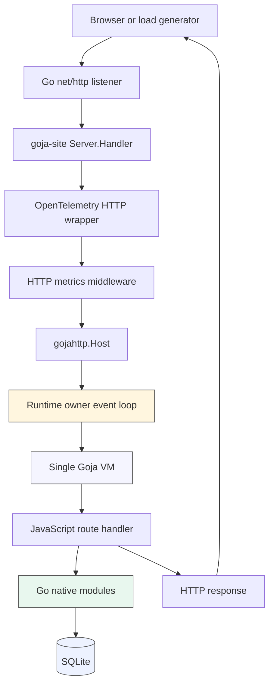
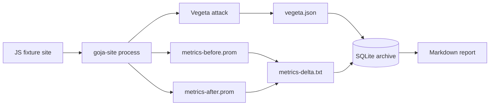

# Goja Site Rendering Performance Internals and Export Boundary Deep Dive

This article records the rendering-performance investigation for `goja-site`, starting from broad observability work and ending at the current stopping point: the `render-attrs-1000` benchmark still saturates because the hot path crosses the Goja JavaScript-to-Go boundary thousands of times per request. The work produced useful optimizations, but the remaining problem is representation-level. Solving it cleanly may require changing the JavaScript-facing UI DSL, adding a Go-owned builder representation, or designing a deeper Goja internals API for faster property iteration.

The goal of this report is to teach the system as a coherent set of mechanisms. A future engineer should be able to read this and understand what was built, what was measured, where the bottlenecks moved, how Goja export works, and why the next step should be designed carefully rather than patched casually.

> [!summary]
> We built a measurement stack for `goja-site`, found an expensive Kanban rendering path, removed eager server-rendered movement forms, validated the improvement with single-VM and multi-VM benchmarks, broadened the benchmark suite to avoid overfitting, then identified a deeper generic UI DSL bottleneck in `render-attrs-1000`. The final profiler evidence points at repeated JavaScript object construction and `goja.Value.Export()` across the native `ui.dsl` boundary, not just final HTML rendering.

## 1. Why this work existed

`goja-site` hosts JavaScript applications inside Go processes. A site author writes route handlers and UI code in JavaScript, while the host process provides Go-owned native modules for HTTP serving, SQLite access, UI rendering, Kanban boards, observability, and operational controls. This architecture is powerful because it gives JavaScript authors a compact application surface while keeping the hosting and operational concerns in Go.

The same architecture also creates a performance question. Every request may cross between Go and JavaScript several times. A route starts in Go's HTTP server, enters a Goja VM, calls JavaScript route code, calls back into Go native modules, renders Go-owned UI nodes, and returns through Go's HTTP response path. Without measurement, it is easy to optimize the wrong layer.

The project therefore started with a discipline: build observability first, benchmark second, profile third, optimize fourth, and then repeat with broader workloads. That discipline prevented the work from stopping at the first improvement. The first major optimization fixed Kanban-specific markup generation. The anti-overfit matrix then showed that a generic attribute-heavy render workload still had a serious bottleneck.

## 2. The main repositories and tickets

The work spans three local repositories:

| Repository | Role |
|---|---|
| `/home/manuel/code/wesen/2026-05-03--goja-hosting-site` | The `goja-site` host application, benchmark harnesses, tickets, reports, and Kanban DSL. |
| `/home/manuel/code/wesen/go-go-golems/go-go-goja` | The Goja integration library and native modules, including `modules/uidsl`. |
| `/home/manuel/code/others/goja` | Local checkout of Goja source used to study `Value.Export`, object export, array export, and object internals. |

The main ticket workspace for the rendering optimization is:

```text
ttmp/2026/05/15/GOJA-KANBAN-RENDER-OPT--kanban-render-performance-optimization-design-for-goja-site
```

The supporting benchmark and stress tickets are:

```text
ttmp/2026/05/14/GOJA-PERF-BENCH--stress-test-benchmark-and-performance-measurement-plan-for-goja-hosting
ttmp/2026/05/15/GOJA-STRESS-TEST--stress-testing-breakdown-experiments-for-goja-site
ttmp/2026/05/15/GOJA-MULTI-VM-STRESS--multi-vm-serve-multi-stress-testing-for-goja-site
```

The important docs inside the optimization ticket are:

```text
design/01-kanban-render-optimization-implementation-guide.md
design/02-holistic-goja-hosting-performance-architecture-guide.md
design/03-anti-overfit-benchmark-plan.md
design/04-render-attrs-1000-performance-investigation.md
design/05-goja-ui-dsl-export-boundary-internals-and-next-optimization-design.md
reference/02-post-simplification-benchmark-report.md
reference/03-anti-overfit-benchmark-report.md
reference/04-anti-overfit-follow-up-pprof-report.md
reference/05-render-attrs-first-optimization-report.md
reference/06-render-attrs-attr-list-cutover-report.md
```

## 3. The runtime model: one process, one site, one VM

The first important technical fact is that the ordinary `serve` benchmark path is not a pool of many JavaScript VMs. It is one process, one site, one Goja VM, and one runtime owner loop. Go's HTTP server can accept concurrent requests, but JavaScript execution is serialized through the owner that protects the VM.

The simplified request architecture is:



This architecture is safe for a single Goja runtime because all VM access happens on the owner loop. It also means queueing is a normal failure mode. If the route handler takes too long, requests pile up behind the VM even if the HTTP listener is still responsive.

For `serve-multi`, one process contains multiple sites. Each configured site has its own server/runtime shape and is dispatched by Host header. That tests many site VMs in one Go process, but it is still not a same-host VM pool for one site. This distinction mattered when interpreting multi-VM stress results.

## 4. The observability foundation

The first implementation phase added a private diagnostics spine. It included:

- Prometheus metrics for HTTP requests, DB operations, DB guard checks, multi-site dispatch, and Kanban domain operations.
- A private diagnostics listener controlled by `--metrics-addr` and `--metrics-path`.
- Optional pprof endpoints controlled by `--pprof`.
- OpenTelemetry HTTP tracing and DB spans.
- Request-context propagation from Go HTTP request contexts into Goja native modules.

The core implementation files in `goja-site` include:

```text
pkg/observability/config.go
pkg/observability/registry.go
pkg/observability/diagnostics.go
pkg/observability/http.go
pkg/observability/sql.go
pkg/observability/guard.go
pkg/observability/kanban.go
pkg/observability/tracing.go
pkg/app/server.go
pkg/app/database.go
pkg/dbguard/guard.go
pkg/dbguard/metered.go
pkg/kanbanddsl/observer.go
pkg/kanbanddsl/mount.go
```

The design rule was to keep metrics labels bounded. Metrics do not include raw paths, raw SQL strings, session IDs, request bodies, raw unknown hosts, or arbitrary error strings. This matters because the hosted-site system may run many user-defined applications. Operational telemetry must remain useful when application behavior is not fully controlled.

The private diagnostics listener was also deliberate. `/metrics` and `/debug/pprof/*` are operational endpoints, not application routes. They belong on a private or explicitly configured listener, not on the public hosted site.

## 5. The benchmark harness

The benchmark harness is built around Vegeta and shell scripts. The main runner is:

```text
scripts/bench-vegeta.sh
```

The matrix runner is:

```text
scripts/bench-matrix.sh
```

The scenario registry is documented in:

```text
bench/scenarios.yaml
```

The harness starts a fresh `goja-site` process for each run, waits for readiness, optionally performs warmup, captures Prometheus metrics before and after, runs Vegeta, writes `vegeta.json` and text reports, and optionally captures pprof artifacts.

The benchmark data path is:



SQLite-backed reporting was added so benchmark matrices could be compared and queried. Reports include the SQL used to produce each table, which made the results auditable rather than just pasted summaries.

## 6. The first bottleneck: Kanban precise movement forms

The first severe bottleneck appeared in Kanban action and fragment rendering. The Kanban DSL originally rendered per-card precise movement forms. That meant every card carried a large amount of server-generated movement UI. On larger boards, the cost multiplied by card count and column count.

The stress tests found that `kanban-action` saturated between `50/s` and `100/s`. A targeted knee search found a sharp bend around `80/s`. pprof showed CPU in:

```text
uidsl.renderNode
kanbanddsl.(*Board).preciseMoveForm
uidsl.renderAttrs
encoding/json.appendString
runtime.gcDrain
runtime.mallocgc
```

The important design decision was not to make precise forms configurable. The DSL was simplified instead. The old server-rendered precise movement forms were removed, and movement became a semantic `cardMoved` action exposed through drag/drop and a frontend accessible action menu.

The implementation removed:

```text
FeatureSpec.PreciseMove
features.preciseMove()
preciseMoveForm
client handler for [data-kb-move-form]
```

and added:

```text
compact per-card Actions button
role="listitem"
tabindex="0"
card aria-label
aria-haspopup="menu"
aria-expanded
frontend action menu
keyboard Enter/Space opening
Escape close and focus restoration
ArrowUp/ArrowDown navigation
Move up/down/top/bottom/to-column actions
aria-live announcements
```

The improvement was large. The previous multi-VM `kanban-fragment` 4VM 400/s run had p95 around `5861 ms` and throughput around `246/s`. After simplification, the same shape reached roughly `399.76/s` with p95 around `7.76 ms` and response size reduced from about `245,946` bytes to about `60,831` bytes.

## 7. Browser accessibility validation

The frontend action menu changed behavior, so we validated it in a browser rather than only through Go tests.

The dedicated Playwright script is:

```text
ttmp/2026/05/15/GOJA-KANBAN-RENDER-OPT--kanban-render-performance-optimization-design-for-goja-site/scripts/03-run-kanban-accessibility-playwright.sh
```

It starts `goja-site` against the benchmark Kanban board and verifies:

- card 1 has `role="listitem"`, `tabindex="0"`, and an informative `aria-label`,
- keyboard focus plus Enter opens the action menu,
- the menu has `role="menu"`,
- ArrowDown and Escape work,
- selecting `Move to Done` posts the action,
- the DOM refresh shows card 1 in the `done` column,
- focus returns to card 1,
- the live region announces the move,
- the browser console has no warnings or errors.

The older example smoke test was also updated:

```text
scripts/playwright-kanban-smoke.sh
examples/kanban/scripts/app.js
```

This matters because performance changes that remove server-rendered accessibility controls must replace them with tested browser behavior. The optimization was not accepted until the keyboard path worked.

## 8. Avoiding overfit: the anti-overfit matrix

After the Kanban improvement, the next risk was overfitting. The optimized Kanban fixture could look good while other UI shapes still performed badly. To avoid that, we created an anti-overfit benchmark plan and matrix.

The plan is:

```text
design/03-anti-overfit-benchmark-plan.md
```

The first matrix used seven scenarios:

```text
kanban-fragment-10
kanban-fragment
kanban-fragment-500
render-flat-1000
render-attrs-1000
db-read-100
db-write-batch-10
```

with rates:

```text
25/s
100/s
250/s
```

and three repeats per cell. That produced 63 measured runs.

The new fixtures included:

```text
bench/scripts/kanban-board-10/app.js
bench/scripts/kanban-board-500/app.js
bench/scripts/render-shapes/app.js
```

The key result was that Kanban was no longer the only important workload. `render-attrs-1000` saturated hard. At `100/s`, it achieved only about half the target throughput with p95 in seconds. At `250/s`, it timed out. `db-write-batch-10` and large Kanban also showed queueing at higher rates, but `render-attrs-1000` was the clearest generic render bottleneck.

## 9. What `render-attrs-1000` measures

The fixture is in:

```text
bench/scripts/render-shapes/app.js
```

The relevant route is:

```javascript
app.get("/attrs", (req, res) => {
  res.html(attrPage(Number(req.query.n || 1000)));
});
```

The page builder creates 1000 outer `div` elements, each with many attributes and one inner `span`:

```javascript
children.push(ui.div({
  class: "attr-node state-" + (i % 5),
  id: "attr-node-" + i,
  "data-index": String(i),
  "data-kind": "benchmark",
  "data-group": String(i % 17),
  "data-label": "attribute heavy node " + i,
  "aria-label": "Attribute heavy node " + i,
  role: "listitem",
  tabindex: "0"
}, ui.span({ class: "label" }, "node-" + i)));
```

The benchmark is synthetic, but the shape is ordinary. Real server-rendered pages often contain repeated rows, list items, cards, table cells, and controls with `class`, `id`, `data-*`, `aria-*`, and `role` attributes. The benchmark isolates this shape so it can be measured without Kanban-specific logic.

## 10. The UI DSL boundary

The UI DSL is implemented in `go-go-goja`:

```text
../go-go-golems/go-go-goja/modules/uidsl/module.go
../go-go-golems/go-go-goja/modules/uidsl/node.go
../go-go-golems/go-go-goja/modules/uidsl/render.go
```

The JavaScript API looks like this:

```javascript
ui.div({ class: "x", id: "node-1" }, ui.span("hello"))
```

The Go native module registers one function per HTML tag:

```go
func Loader(vm *goja.Runtime, moduleObj *goja.Object) {
    exports := moduleObj.Get("exports").(*goja.Object)
    for _, tag := range tags {
        tag := tag
        _ = exports.Set(tag, func(call goja.FunctionCall) goja.Value {
            return vm.ToValue(elementFromCall(vm, tag, call))
        })
    }
}
```

At runtime, each `ui.div(...)` call crosses from JavaScript into Go. The Go function receives a `goja.FunctionCall` containing raw `goja.Value` arguments. It then decides whether the first argument is attrs, normalizes the remaining arguments into child nodes, and returns a Go-owned `Element` value wrapped back into the VM.

The current representation after the attr-list cutover is:

```go
type Attr struct {
    Key   string
    Value string
    Bool  bool
}

type Element struct {
    Tag      string
    Attrs    []Attr
    Children []Node
}
```

This representation is efficient for final HTML writing. It does not eliminate the cost of constructing JavaScript object literals and converting them into Go values.

## 11. The request timeline with the bottleneck highlighted

The important timeline is:

```text
Browser
  |
  |  HTTP GET /attrs?n=1000
  v
Go net/http
  |
  |  route dispatch
  v
goja-site server
  |
  |  call JS handler in single site VM / owner loop
  v
Goja VM
  |
  |  JS app route runs attrPage(1000)
  |
  |  loop 1000 times:
  |    ui.div({ many attrs }, ui.span(...))
  |       |
  |       | native Go function call
  |       v
  |    uidsl.elementFromCall
  |       |
  |       | HOT BOUNDARY:
  |       | - JS object literal exists in Goja
  |       | - native call receives goja.Value
  |       | - attrs object crosses JS -> Go
  |       | - Value.Export / Object.Export enumerates keys
  |       | - Go maps/slices/strings are allocated
  |       | - Go Element and []Attr are built
  |       v
  |    Go uidsl.Element
  |
  |  returns full page node tree
  v
Go uidsl renderer
  |
  |  renderNode / renderAttrs
  |  now faster after []Attr cutover
  v
bytes.Buffer / response string
  |
  |  allocate/grow ~250 KB response
  v
HTTP response
  |
  v
Browser receives HTML
```

The profiler says the hot boundary is not one big export at the end. It is thousands of small exports and object constructions inside the page-building loop.

## 12. What the profiler showed

Before the attr-list cutover, the `render-attrs-1000` pprof run at `100/s` showed:

```text
goja.(*vm).run
goja.(*baseObject).export
goja.(*Object).Export
goja.(*baseObject).stringKeys
uidsl.elementFromCall
uidsl.renderAttrs
runtime.mallocgc
runtime.gcDrain
bytes.growSlice
```

The allocation profile was more decisive than the CPU profile. It showed large cumulative allocation under:

```text
goja.(*baseObject).export
uidsl.elementFromCall
goja.(*Object).Export
uidsl.renderAttrs
bytes.growSlice
gojahttp.(*Response).writeString
```

The first implementation slice removed a double export. The original code classified attrs by calling `Export()` in `isAttrs`, then called `Export()` again to get the map. That was changed to a single `attrsFromValue` path. This reduced one avoidable cost but did not improve the macro benchmark.

The second implementation changed `Element.Attrs` from `map[string]any` to `[]Attr`, with no compatibility map field. That made final `renderAttrs` much cheaper. The microbenchmark improved from roughly `2.2–2.6 us/op`, `936 B/op`, `12 allocs/op` to roughly `0.73–0.90 us/op`, `680 B/op`, `5 allocs/op`. The macro benchmark improved from `67.91/s` to `71.79/s` in the comparable pprof runs, but p95 was still around `11.222s` at `100/s`.

That outcome is useful. It means final attr writing was a real cost, but not the dominant cost. The dominant cost remains earlier at JavaScript object construction and export.

## 13. How `Value.Export()` works

To understand the remaining bottleneck, we studied Goja source in:

```text
/home/manuel/code/others/goja
```

The public value interface is in `value.go`:

```go
type Value interface {
    ToInteger() int64
    ToString() Value
    String() string
    ToFloat() float64
    ToNumber() Value
    ToBoolean() bool
    ToObject(*Runtime) *Object
    SameAs(Value) bool
    Equals(Value) bool
    StrictEquals(Value) bool
    Export() interface{}
    ExportType() reflect.Type
}
```

For primitive values, `Export()` is simple:

```go
func (i valueInt) Export() interface{}   { return int64(i) }
func (b valueBool) Export() interface{}  { return bool(b) }
func (f valueFloat) Export() interface{} { return float64(f) }
func (s asciiString) Export() interface{} { return string(s) }
```

For objects, it delegates to the object's implementation:

```go
func (o *Object) Export() interface{} {
    return o.self.export(&objectExportCtx{})
}
```

The ordinary object export path is in `object.go`:

```go
func (o *baseObject) export(ctx *objectExportCtx) interface{} {
    if v, exists := ctx.get(o.val); exists {
        return v
    }
    keys := o.stringKeys(false, nil)
    m := make(map[string]interface{}, len(keys))
    ctx.put(o.val, m)
    for _, itemName := range keys {
        itemNameStr := itemName.String()
        v := o.val.self.getStr(itemName.string(), nil)
        if v != nil {
            m[itemNameStr] = exportValue(v, ctx)
        } else {
            m[itemNameStr] = nil
        }
    }

    return m
}
```

This means ordinary object export does this:

```text
Object.Export
  -> check cycle cache
  -> enumerate own enumerable string keys
  -> allocate Go map
  -> cache map before recursion
  -> for each key:
       - convert key to Go string
       - read property by name
       - recursively export property value
       - store value in Go map
  -> return map[string]interface{}
```

This is correct for arbitrary JavaScript objects. It is expensive for a hot UI attribute object whose shape is known and repetitive.

## 14. Why object export has to be general

Goja's export context exists to handle object graphs, not just flat objects:

```go
type objectExportCtx struct {
    cache map[*Object]interface{}
}
```

The cache prevents infinite recursion on cyclic objects:

```javascript
const a = {};
a.self = a;
```

A general JavaScript-to-Go export function must also support different object implementations: ordinary objects, arrays, typed arrays, dynamic objects, Go-reflect objects, functions, promises, maps, sets, and proxies. The UI DSL attr object does not need most of this generality, but `Value.Export()` cannot know that.

That is why the hot path is expensive. The system is using a general conversion tool for a narrow repeated data shape.

## 15. Object construction is also part of the cost

The profiler also showed costs in object construction:

```text
goja.(*baseObject)._put
goja.(*baseObject)._putProp
goja.newBaseObjectObj
goja.(*baseObject).init
goja.asciiString.Concat
goja.stringValueFromRaw
```

These appear before export. Every JavaScript object literal must be allocated and populated. Goja's ordinary object representation stores values and property names:

```go
type baseObject struct {
    class      string
    val        *Object
    prototype  *Object
    extensible bool

    values    map[unistring.String]Value
    propNames []unistring.String

    lastSortedPropLen, idxPropCount int
}
```

When JavaScript creates an object literal with nine properties, Goja stores values in a map and tracks property order. Later, `Export()` enumerates those same properties and creates a Go map. The work is duplicated conceptually: first build a JavaScript object, then convert it into a Go representation.

The key lesson is:

```text
Even a perfect Object.Export replacement would not remove the cost of constructing thousands of JavaScript object literals.
```

A larger fix probably needs a different representation at the UI DSL boundary.

## 16. Arrays may help, but only if the shape is flat

Arrays are not automatically faster, but they change the cost model. Goja's dense array export path can iterate backing storage directly when the array is simple:

```go
func (a *arrayObject) export(ctx *objectExportCtx) interface{} {
    arr := make([]interface{}, a.length)
    if a.propValueCount == 0 && a.length == uint32(len(a.values)) && uint32(a.objCount) == a.length {
        for i, v := range a.values {
            if v != nil {
                arr[i] = exportValue(v, ctx)
            }
        }
    } else {
        for i := uint32(0); i < a.length; i++ {
            v := a.getIdx(valueInt(i), nil)
            if v != nil {
                arr[i] = exportValue(v, ctx)
            }
        }
    }
    return arr
}
```

A nested pair representation like this:

```javascript
ui.div([
  ["class", "x"],
  ["id", "y"]
], child)
```

would create many arrays: one outer array plus one inner array per attribute. That may still be costly.

A flatter representation is more promising:

```javascript
ui.div(ui.attrs(
  "class", "x",
  "id", "y",
  "role", "listitem"
), child)
```

The `ui.attrs(...)` function could be a native Go function that immediately returns a Go-owned attrs wrapper. That would avoid constructing a JavaScript object literal and avoid generic object export for the attrs.

## 17. Why `Object.Keys()` plus `Get()` was not enough

One obvious idea is to avoid `Export()` by doing:

```go
obj := v.ToObject(vm)
for _, key := range obj.Keys() {
    value := obj.Get(key)
    // decode primitive
}
```

We tried a version of this during the first optimization slice. It was not better for this workload. The cost shifted into:

```text
goja.(*Object).Keys
goja.(*enumerableIter).next
goja.(*objectPropIter).next
per-property conversion
```

This is an important negative result. Public `Object.Keys()` still performs generic key enumeration and allocates a key slice. Public `Get()` performs property lookup for each key. The approach avoids creating a Go map, but it does not avoid the ordinary object machinery.

The lesson is:

```text
Keeping JavaScript object literals but switching public APIs may not be enough.
```

## 18. Candidate next designs

The next optimization should not be another small `renderAttrs` tweak. It needs to change the representation at the boundary.

### 18.1 `ui.attrs(...)` returning Go-owned attrs

A possible API:

```javascript
ui.div(ui.attrs(
  "class", "attr-node state-" + (i % 5),
  "id", "attr-node-" + i,
  "data-index", String(i),
  "role", "listitem"
), child)
```

Go sketch:

```go
type AttrsValue struct {
    Attrs []Attr
}

exports.Set("attrs", func(call goja.FunctionCall) goja.Value {
    attrs := decodeFlatPairs(call.Arguments)
    return vm.ToValue(&AttrsValue{Attrs: attrs})
})

func attrsFromValue(v goja.Value) ([]Attr, bool) {
    if wrapper, ok := v.Export().(*AttrsValue); ok {
        return wrapper.Attrs, true
    }
    return nil, false
}
```

This keeps the DSL readable while avoiding object-literal export. It still creates an attrs wrapper per element, so it needs measurement.

### 18.2 Flat-pair constructors

A more direct API could be:

```javascript
ui.el("div",
  "class", "x",
  "id", "y",
  "role", "listitem",
  ui.children(child1, child2)
)
```

This avoids attrs object literals entirely. The challenge is API clarity: the boundary between attrs and children must be explicit, or the parser becomes error-prone.

### 18.3 Go-side builder

A builder would mutate a Go-owned structure directly:

```javascript
const b = ui.builder();
b.open("div");
b.attr("class", "x");
b.attr("id", "y");
b.text("hello");
b.close();
return b.node();
```

A builder avoids JS object graphs but may increase the number of native calls. A batched builder API may be better:

```javascript
b.open("div", "class", "x", "id", "y");
b.text("hello");
b.close();
```

### 18.4 Direct rendering from compact JS values

Another approach is to avoid a Go node tree and render from a compact JavaScript representation:

```javascript
["div", ["class", "x", "id", "y"], [
  ["span", ["class", "label"], ["node-1"]]
]]
```

This may reduce Go-side node allocation, but public indexed reads from Goja values may still be expensive. It should be prototyped before being adopted.

### 18.5 Goja internals API for fast property iteration

The most invasive option is a Goja API for fast ordinary-object property iteration:

```go
// Hypothetical API.
func (o *Object) ForEachOwnEnumerableStringProperty(fn func(name string, value Value) bool)
```

This could preserve object-literal ergonomics while avoiding full `Export()` and avoiding `Object.Keys()` allocation. It is difficult because Goja supports many object implementations and JavaScript semantics around property order, enumerability, accessors, and proxies. It may still be worth exploring if the UI DSL must keep object-literal attrs as the primary API.

## 19. What we should do next, later

The current decision is to stop implementation here. The next step is invasive enough that it should be designed and benchmarked as a separate project.

When this work resumes, the recommended sequence is:

1. Prototype `ui.attrs(...)` returning a Go-owned attrs wrapper.
2. Prototype a flat-pair constructor or `ui.el(tag, attrs, children...)` form.
3. Compare both with `BenchmarkRenderPageAttrs1000` and `render-attrs-1000` at `100/s`.
4. Validate against Kanban workloads to avoid overfitting.
5. Only then consider a Goja internals API for fast property iteration.

The acceptance criteria should include both micro and macro evidence:

```text
render-attrs-1000 100/s throughput ratio should materially improve
p95 should fall out of multi-second queueing
alloc-space profile should no longer be dominated by Object.Export/baseObject.export
Kanban fragment benchmarks should not regress
```

## 20. Working rules preserved by this investigation

The project produced several durable engineering rules:

- Benchmark the exact runtime shape. Single-site `serve` is one long-lived VM, not a VM pool.
- Add observability before interpreting stress results.
- Use pprof to identify whether a bottleneck is domain logic, rendering, allocation, GC, response writing, or database work.
- After fixing one benchmark, add anti-overfit workloads before continuing to optimize.
- Do not preserve compatibility paths by default when the DSL should become simpler and more opinionated.
- Treat JavaScript-to-Go conversion as a first-class performance boundary.
- Do not assume `Value.Export()` is cheap for objects. It is a general conversion mechanism with correct semantics, not a hot-path UI representation.
- Prefer representation changes over micro-optimizing around an unsuitable representation.

## 21. Final state

The project now has a strong measurement foundation, a fixed Kanban movement rendering path, an anti-overfit benchmark suite, a documented `render-attrs-1000` bottleneck, and a clear explanation of Goja's export boundary. The remaining performance work is not blocked by lack of evidence. It is blocked by design scope: the next likely improvements change the UI DSL representation or require deeper Goja internals.

That is the right place to stop for now. The evidence is preserved, the reports are in the ticket, the artifacts are committed, and the next engineer can resume with a specific experiment plan rather than rediscovering the bottleneck from scratch.
