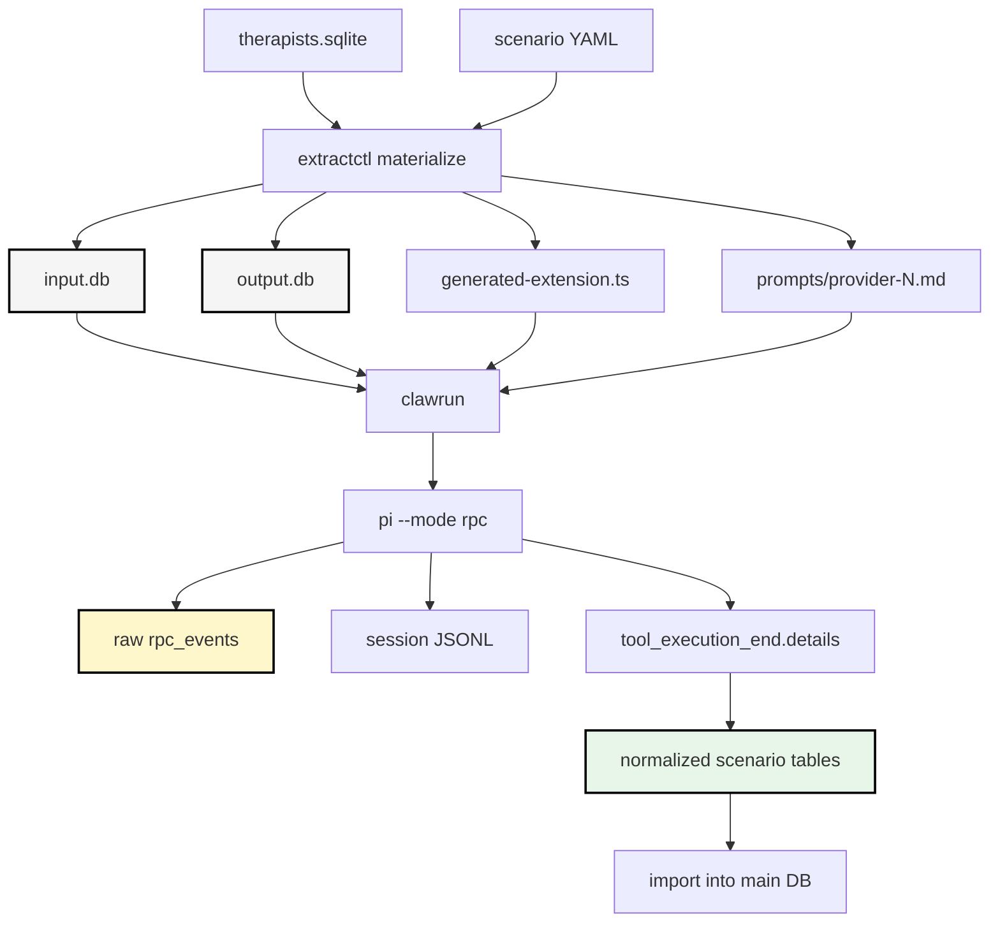

# Pi Claw Runtime Packaging: Scenario Driven LLM Extraction and Auditable Agent Runs

This article explains how the Providence therapist search project turned an ad hoc set of LLM extraction experiments into a reusable run system built around pi, Claw, SQLite, generated tools, and scenario files. The work matters because LLM extraction is not just a prompt. It is a data production pipeline. A useful extraction run must record what data went in, which model and prompt were used, which tool schema was available, what raw events came back from the agent process, what structured result was accepted, and how that result was normalized into tables that other systems can use.

> [!summary]
> - Claw was refactored into reusable Go packages: `pkg/pirpc` for pi RPC subprocess control and `pkg/clawrun` for run ledgers around SQLite input/output databases.
> - `therapist-search` now owns domain orchestration through `extractctl`: scenario YAML, provider selection, generated TypeScript tools, prompt rendering, run execution, normalization, import, and reports.
> - The extraction system produces two complementary kinds of data: classification labels for filtering/ranking and full profile enrichments for RAG/search documents.
> - The central engineering rule is auditability: every normalized row should trace back to a provider, scenario, model, prompt, tool result, raw RPC frame, and session file.

## Why this note exists

The project began as a practical search task: find therapists in Providence, Rhode Island who are autism-informed, ADHD-informed, LGBTQ-friendly, and Medicaid-compatible. The first implementation scraped provider profiles, stored evidence in SQLite, and showed providers in a retro curation dashboard. That dashboard answered the browsing and review question, but it did not solve the data preparation question. Raw profile text is messy. It contains page navigation, repeated names, call-to-action boilerplate, insurance lists, specialties, and clinical prose in one flattened string. Search needs a cleaner representation.

The first LLM scripts proved that models could extract useful information. They also proved that free-text JSON is the wrong production interface. Models wrap JSON in Markdown fences, add prose, vary schemas, and behave differently depending on session strategy. The system therefore moved to pi RPC mode with custom tools. A tool result is not assistant prose. It is a typed payload emitted in a `tool_execution_end` event. That difference is the foundation of the later architecture.

The next problem was packaging. A Python REST wrapper around pi worked for experiments, but it was not the right long-term runtime boundary. We needed a reusable execution substrate that could run pi locally or in Docker, store a raw ledger, write input/output SQLite databases, and let domain projects keep their own schemas. That is where Claw entered the system.

## The core design problem

An LLM extraction run has more state than a normal function call. A normal function has arguments and a return value. A therapist extraction run has at least these inputs:

- the selected provider rows,
- the raw scraped profile text,
- the scenario YAML file,
- the rendered prompt,
- the generated TypeScript tool schema,
- the model identifier,
- the pi extension environment,
- the session strategy,
- the timeout and retry policy.

It also has several outputs:

- raw pi RPC frames,
- pi session JSONL files,
- tool result payloads,
- normalized run-local tables,
- optional imported main-database observations,
- Markdown reports,
- benchmark results and disagreement reports in later phases.

The important point is that the raw model response is not the final artifact. The extraction run is the artifact. The model response is one event inside it.

The design therefore uses SQLite as a run boundary. A run receives an `input.db`, writes to an `output.db`, and stores a session file and generated artifacts beside those databases. This makes a run portable, inspectable, and reproducible enough for an exploratory project.



## The Claw split: execution substrate versus domain logic

The external Claw repository lives at:

```text
/home/manuel/workspaces/2026-05-12/pi-agent-dashboard/2026-04-28--go-go-claw
```

The therapist project lives at:

```text
/home/manuel/code/wesen/claw-stuff/therapist-search
```

A major decision was not to move therapist extraction wholesale into Claw. Claw should not know what a therapist is. It should not know what `autism_informed` means. It should not know how to normalize insurance, profile Markdown, modalities, or hypothetical questions. Claw owns execution and observability. The therapist project owns domain interpretation.

That boundary produced two reusable Claw packages.

| Package | Responsibility | What it deliberately does not own |
|---|---|---|
| `pkg/pirpc` | Starts and manages `pi --mode rpc`, sends commands, reads JSONL frames, waits for `agent_end`, extracts tool results. | Scenario YAML, provider selection, extraction schemas, imports. |
| `pkg/clawrun` | Wraps a pi RPC run with input/output SQLite paths, session paths, run/event/message/RPC ledgers, local/Docker execution, and observer hooks. | Domain tables, benchmark logic, dashboard-specific imports. |

The split matters because reusable agent runtimes become fragile when they absorb domain schemas. A reusable runtime should provide stable primitives: process control, event capture, storage, and hooks. The caller should decide what the frames mean.

## `pkg/pirpc`: the low-level pi RPC client

Pi RPC mode is a JSONL protocol over standard input and standard output. A client starts a process like:

```bash
pi --mode rpc --session run/provider-18.session.jsonl --model kimi-coding/kimi-for-coding
```

Then it sends a prompt command and reads frames until `agent_end`. The raw stream contains frames such as:

```text
response
agent_start
message_start
message_update
tool_execution_start
tool_execution_end
agent_end
```

The reusable `pkg/pirpc` package was extracted from Claw's original internal pi client. It exposes a managed session API:

```go
sess, err := pirpc.StartSession(ctx, pirpc.StartOptions{
    Command: "pi",
    Args: []string{"--mode", "rpc", "--session", "run/session.jsonl"},
})
result, err := sess.PromptAndWait(ctx, prompt, pirpc.PromptOptions{
    Timeout: 5 * time.Minute,
})
for _, tool := range result.ToolResults {
    // tool.Details contains tool_execution_end.result.details.
}
```

Several details are important:

- The frame reader avoids `bufio.Scanner` limits so large JSONL frames do not get truncated.
- Raw frames are preserved before interpretation.
- `PromptAndWait` waits for `agent_end`, not just the first assistant message.
- `ParseToolResult` extracts `tool_execution_end.details` without knowing the domain schema.
- `CloseStdin` and `Kill` are separate operations. Closing input and killing the process are different lifecycle events.

The client exists because pi is not just a library call in this architecture. It is a subprocess with a streaming protocol. The caller must treat stdout as the event log, not as a final response string.

## `pkg/clawrun`: the reusable run substrate

`pkg/clawrun` adds a run ledger around pi RPC. A Claw run has:

- an input SQLite database,
- an output SQLite database,
- a pi session file,
- a local or Docker pi execution mode,
- model/provider/extension arguments,
- standard output tables for runs, events, messages, and raw RPC frames.

The API shape is intentionally small:

```go
rt := clawrun.New(".claw-runs")
run, err := rt.StartRun(ctx, clawrun.StartRequest{
    RunID:        "example-run",
    InputDBPath:  "input.db",
    OutputDBPath: "output.db",
    SessionPath:  "session.jsonl",
    Prompt:       "Read the input DB and call the generated tool.",
    PiMode:       "rpc",
    NoDocker:     true,
    Model:        "kimi-coding/kimi-for-coding",
    Extensions:   []string{"generated-extension.ts"},
    Wait:         true,
})
```

The run substrate writes operational data into `output.db`. Domain packages can add their own tables into the same database. This is how `extractctl` gets both generic run observability and therapist-specific normalized results in one file.

For Docker mode, `clawrun` preserves a crucial detail: RPC mode needs open stdin. Docker must be run with `-i`; otherwise pi exits before the client can send commands. This was one of the runtime lessons from the Claw work.

## `extractctl`: the therapist-domain command

`extractctl` is the therapist-search command that sits on top of Claw. It lives at:

```text
therapist-search/cmd/extractctl/main.go
```

Its internal packages are:

| Package | Role |
|---|---|
| `scenario` | Loads and validates scenario YAML. |
| `provider` | Defines provider snapshots used by materialization and prompt rendering. |
| `prompt` | Renders Go templates for provider prompts. |
| `pigen` | Generates TypeScript pi extensions from scenario tool schemas. |
| `materialize` | Creates run directories, input DBs, output DBs, generated extension files, and rendered prompts. |
| `extractrun` | Orchestrates provider attempts through `clawrun`, normalizes tool results, writes reports. |
| `importer` | Imports selected run-local rows back into the main therapist database. |

The command exposes several subcommands:

```text
extractctl scenario validate
extractctl scenario render-tool
extractctl scenario render-prompt
extractctl materialize
extractctl run
extractctl import
extractctl runtime init-output
extractctl runtime start
```

The `runtime` commands expose Claw primitives. The other commands are therapist-domain commands.

## Scenario YAML as the experiment registry

A scenario is the unit of extraction design. It records the model, provider selection query, session strategy, prompt template, tool schema, output migrations, and benchmark configuration. This is more durable than a script because it separates the extraction definition from the runner implementation.

A simplified scenario shape looks like this:

```yaml
id: classify-v2
version: 2026-05-15.1
agent:
  backend: clawrun
  model: kimi-coding/kimi-for-coding
  timeout_seconds: 240
session:
  strategy: fresh_per_provider
providers:
  query: |
    SELECT id, canonical_name, credentials, organization, profile_url,
           fit_score, accepts_medicaid, accepts_new_clients,
           service_modes, profile_text
    FROM providers
    WHERE profile_text != ''
prompts:
  user_template: |
    Classify this provider.
    Provider ID: {{ .Provider.ProviderID }}
    Profile text:
    """
    {{ truncate .Provider.ProfileText .Scenario.Session.MaxProfileChars }}
    """
tool:
  name: classify_therapist_v2
  schema_version: classify_therapist.v2
  fields:
    provider_id:
      type: integer
      required: true
    autism_informed:
      $ref: classification_evidence
```

The scenario system has already grown beyond scalar fields. It now supports arrays, object definitions, `$ref`, enum-like unions, and generated TypeScript tools. That was necessary to recover the full profile enrichment scenario.

## Generated pi tools

The runner does not ask the model to emit JSON in prose. Instead, it generates a TypeScript pi extension from the scenario tool schema. The generated extension registers a tool and returns structured data through `details`:

```ts
return {
  content: [{ type: "text", text: "Saved classify_therapist_v2 result" }],
  details: record,
  terminate: true,
}
```

The generated extension also writes the record to `tool-results.jsonl`. The JSONL file is a useful artifact, but the authoritative source is now the raw pi RPC ledger in `output.db`. The runner first reads successful `tool_execution_end.result.details` from `rpc_events`, then falls back to JSONL if needed.

This design has two important consequences:

- The model can only submit fields that validate against the tool schema.
- The runner receives structured data without parsing Markdown, fences, or assistant summaries.

The tool surface is also restricted during extraction:

```bash
--tools classify_therapist_v2
```

This was needed after Kimi used built-in tools to inspect local schema details during a run. Provider extensions remain enabled, so Kimi OAuth works, but the model is only allowed to call the generated extraction tool.

## Materialization: turning a scenario into a run directory

`extractctl materialize` creates the concrete artifacts for a run. For a run ID such as `classify-v2-20260515T200318.944156846`, the run directory contains:

```text
run/
  input.db
  output.db
  scenario.yaml
  scenario.json
  generated-extension.ts
  tool-results.jsonl
  prompts/
    provider-18.md
    provider-20.md
  provider-18-attempt-1.session.jsonl
  provider-20-attempt-1.session.jsonl
  reports/
    summary.md
```

The input database stores scenario metadata, prompt templates, selected provider snapshots, and artifact paths. The output database stores Claw's generic run ledger plus scenario-specific extraction tables.

This is why materialization is its own step. It lets a human inspect the generated tool and rendered prompts before spending model time. It also means a run can be reconstructed later from its files.

## Run execution: fresh sessions per provider

The production strategy is `fresh_per_provider`. Each provider gets its own pi session and its own attempt row. This is slower than batching, but it avoids context contamination and produces clearer audit trails.

The runner processes providers like this:

```text
for provider in selected providers:
    render prompt path
    for attempt in 1..max_attempts:
        create provider-specific session file
        start clawrun with generated extension and prompt
        wait until agent_end or timeout
        parse tool_execution_end.details
        normalize into scenario tables
        mark attempt succeeded or failed
```

The attempt table records the operational status:

```sql
CREATE TABLE extraction_provider_runs (
  run_external_id TEXT NOT NULL,
  provider_id INTEGER NOT NULL,
  attempt INTEGER NOT NULL,
  provider_name TEXT,
  status TEXT NOT NULL,
  prompt_path TEXT,
  session_file TEXT,
  claw_run_id TEXT,
  started_at TEXT NOT NULL,
  completed_at TEXT,
  elapsed_ms INTEGER,
  error TEXT,
  result_external_id TEXT,
  PRIMARY KEY (run_external_id, provider_id, attempt)
);
```

This turns a multi-provider extraction run from an all-or-nothing process into a set of inspectable provider attempts. A 79-provider run can succeed for 76 providers and still tell the operator exactly which 3 failed and why.

## The two extraction scenarios

The project now has two complementary extraction scenarios.

### `classify-v2`

`classify-v2` produces search-relevant labels:

```text
autism_informed
adhd_informed
lgbtq_affirming
medicaid
new_clients
trauma_informed
neurodivergent_affirming
bipoc_affirming
```

Each category contains:

```text
value: yes | no | implicit
confidence
evidence_kind
evidence_quote
rationale
```

The normalized table is:

```sql
CREATE TABLE extracted_classifications_v2 (
  external_id TEXT NOT NULL,
  provider_id INTEGER NOT NULL,
  category TEXT NOT NULL,
  value TEXT NOT NULL CHECK(value IN ('yes', 'no', 'implicit')),
  evidence_kind TEXT,
  evidence_quote TEXT,
  rationale TEXT,
  confidence REAL,
  PRIMARY KEY (external_id, category)
);
```

This scenario is fast enough for baseline labels and filters.

### `full-entities-v1`

`full-entities-v1` recovers the broader plan. It extracts:

- identity fields,
- contact fields,
- cleaned `profile_markdown`,
- display/RAG `summary`,
- `hypothetical_questions`,
- specialties,
- populations,
- communities,
- modalities,
- insurance,
- treatment approaches,
- availability, fees, session modes, and languages.

The run-local normalized tables are:

```sql
CREATE TABLE extracted_provider_profiles_v1 (...);
CREATE TABLE extracted_provider_entities_v1 (...);
```

A one-provider Kimi validation for provider 20 produced:

```text
extracted_provider_profiles_v1 = 1
extracted_provider_entities_v1 = 33
profile_markdown length = 2690
summary length = 456
hypothetical_questions = 4
```

Entity counts from that run were:

| Entity type | Count |
|---|---:|
| communities | 5 |
| insurance | 8 |
| modalities | 3 |
| populations | 4 |
| specialties | 8 |
| treatment_approaches | 5 |

This scenario is richer than `classify-v2`. It is the input to RAG preprocessing and search document construction.

## Import into the main therapist database

Run-local databases are experiment artifacts. The dashboard and search service need selected results in the main database:

```text
therapist-search/data/therapists.sqlite
```

`extractctl import` copies normalized rows into main-DB tables. It does not update curation fields such as `starred`, `emailed`, `called`, `contact_notes`, or `notes`.

Classification imports create:

```text
extraction_import_runs
provider_entity_observations
provider_entity_overrides
```

Full profile imports create:

```text
provider_profile_enrichments
provider_extracted_entities
```

The distinction between observations and overrides is deliberate. Model output is an observation. A human correction is an override. The dashboard can later display the selected model observation unless a human override exists.

A dry-run import reports what would be written:

```bash
extractctl import \
  --output-db /path/to/run/output.db \
  --target-db data/therapists.sqlite \
  --dry-run
```

For the full profile validation run, dry-run import reported:

```text
would_import=34
```

A real import into a copied database inserted:

```text
provider_profile_enrichments = 1
provider_extracted_entities = 33
```

## Search and RAG preprocessing

The vector-search design requires more than labels. It needs a document representation. The intended search document combines scraped provider fields, model labels, cleaned Markdown, summary, questions, entities, and evidence snippets.

```json
{
  "provider_id": 20,
  "name": "Carmel Lombardi",
  "profile_markdown": "# Carmel Lombardi\n\n## About\n...",
  "summary": "...",
  "hypothetical_questions": ["..."],
  "specialties": ["Autism", "ADHD", "Trauma"],
  "insurance": ["Medicaid", "Aetna"],
  "labels": {
    "autism_informed": "yes",
    "medicaid": "yes"
  },
  "evidence_snippets": ["..."]
}
```

The earlier search research validated a hybrid retrieval design:

- BM25 for exact text precision.
- Fireworks `qwen3-embedding-8b` for cloud embeddings, using 1024 dimensions.
- `fastembed-go` with BGE-small-en-v1.5 as local fallback.
- Bleve v2.5.4 plus `go-faiss` v1.0.25 and `blevesearch/faiss@b3d4e00` as the validated vector stack.
- Reciprocal Rank Fusion for combining BM25 and vector results.
- Fireworks `qwen3-reranker-8b` for second-stage reranking.

The enriched extraction tables are the missing bridge between provider scraping and hybrid search. They let the search indexer avoid embedding raw scraped chrome and instead embed denser, cleaner fields.

## Provider and model configuration lessons

The project exposed two provider/runtime lessons.

First, Kimi works through the `pi-provider-kimi-code` extension and OAuth credentials. Passing `--no-extensions` disables that provider extension and causes pi to fall back to a path that expects an API key. The MVP fix was not a large extension policy system. It was simpler:

- remove the conflicting duplicate therapist extension,
- allow provider extension discovery,
- explicitly load the generated scenario extension,
- restrict available tools with `--tools <scenario-tool>`.

Second, Fireworks failures came from model/provider metadata. A local provider override used an OpenAI-compatible base URL with `/v1`, while built-in Fireworks Anthropic-style entries append `/v1/messages`. Combining those paths produced `/v1/v1/messages`. The working short-term paths are Wafer/Qwen and the configured Fireworks router. The extraction pipeline does not depend on resolving every provider issue before it can run.

## Testing the system

Testing happened at several levels.

### Unit and package tests

The Go module is validated with:

```bash
cd therapist-search && go test ./...
```

Tests cover materialization, prompt rendering, generated TypeScript extension rendering, and runtime smoke behavior.

### Scenario validation

Before spending model time, a scenario can be checked with:

```bash
go run ./cmd/extractctl scenario validate \
  --scenario scenarios/extraction/full-entities-v1.yaml
```

The validator checks required fields, referenced definitions, and schema node types. Array support was added as part of recovering full-profile enrichment.

### Render-before-run inspection

The runner can render tools and prompts without invoking a model:

```bash
go run ./cmd/extractctl scenario render-tool \
  --scenario scenarios/extraction/full-entities-v1.yaml \
  --out /tmp/full-entities.ts \
  --tool-output /tmp/full-entities.jsonl

go run ./cmd/extractctl scenario render-prompt \
  --scenario scenarios/extraction/full-entities-v1.yaml \
  --provider-id 20
```

This is an important operational pattern. Generated tools and prompts are part of the run contract, so they should be inspectable before execution.

### Real pi smoke tests

The first real smoke test used text-only pi RPC through `clawrun`. It verified that:

- `runs.status = succeeded`,
- a session file was created,
- `rpc_events` contained expected frame types,
- assistant error frames were absent,
- the assistant produced the expected smoke text.

The next smoke test loaded a generated extension and confirmed that `tool_execution_end.details` was captured.

### One-provider and two-provider extraction tests

The runner was validated with Kimi on one and two providers.

For classification:

```text
providers = 2
succeeded = 2
failed = 0
extraction_results = 2
extracted_classifications_v2 = 16
```

For full enrichment:

```text
providers = 1
succeeded = 1
failed = 0
extracted_provider_profiles_v1 = 1
extracted_provider_entities_v1 = 33
```

### Import tests

Imports were tested with `--dry-run` and then against copied SQLite databases. This avoids mutating the real dashboard database during validation.

```bash
cp data/therapists.sqlite "$tmpdb"
extractctl import --output-db run/output.db --target-db "$tmpdb" --replace
```

The import test checks row counts and sample rows, not only command exit status.

## Failure modes and fixes

The project found several failures that shaped the design.

| Failure | Symptom | Fix |
|---|---|---|
| Free-text JSON was brittle. | Models returned Markdown fences or prose around JSON. | Use pi tools and consume `tool_execution_end.details`. |
| Duplicate extensions conflicted. | Both therapist extraction extensions registered `classify_therapist`. | Remove the no-terminate duplicate extension. |
| `--no-extensions` broke Kimi. | Kimi provider extension and OAuth were disabled. | Allow provider discovery and restrict tools with `--tools`. |
| Fireworks base URL mismatch. | `/v1/v1/messages` 404. | Use known-good model config; avoid mixing OpenAI and Anthropic base URLs under one provider override. |
| SQLite source DB locked. | Materialization failed with `SQLITE_BUSY`. | Add SQLite `busy_timeout` pragmas. |
| Kimi used built-in tools during extraction. | Run wandered into schema inspection instead of final tool call. | Pass `--tools <generated-tool-name>`. |
| Evidence kind enum was too strict. | Valid tool calls failed because model chose useful unseen labels. | Relax `evidence_kind` to string and normalize later. |
| Import assumed every scenario had classification tables. | Full-profile import failed on missing `extracted_classifications_v2`. | Treat missing scenario tables as zero rows. |

These are not incidental bugs. They are evidence about where the system boundaries should be. Provider extensions, generated tool schemas, raw frame storage, and scenario-specific tables all need explicit handling.

## What has been built so far

The current implementation includes:

- reusable Claw packages `pkg/pirpc` and `pkg/clawrun`,
- therapist-side `extractctl` with scenario loading, materialization, execution, normalization, and import,
- generated pi TypeScript extensions from YAML schemas,
- `classify-v2` for label extraction,
- `full-entities-v1` for profile/RAG enrichment,
- per-provider attempt tracking and summaries,
- dry-run and copied-DB import validation,
- diary and docmgr ticket documentation.

Recent therapist-search commits include:

```text
3087594 Docs: recover provider enrichment extraction design
694540f extractctl: add full provider enrichment scenario
42a8048 extractctl: normalize provider profile enrichments
de54464 extractctl: import full profile enrichments
b155276 Diary: record full provider enrichment recovery
```

External Claw commits include:

```text
7554abc pirpc: expose reusable managed RPC session
61457dc clawrun: expose reusable run substrate
```

## What remains

The next work should make the extraction results visible and searchable.

1. Add a baseline run selection mechanism. The dashboard and search indexer need to know which classification/enrichment run is the current source of truth.
2. Add dashboard API endpoints for `provider_entity_observations`, `provider_profile_enrichments`, and `provider_extracted_entities`.
3. Build the search document builder from providers, evidence, classifications, and profile enrichments.
4. Build the Bleve/Faiss hybrid search server using the previously validated dependency versions.
5. Add benchmark support for extraction and retrieval quality.
6. Add a run management dashboard for Claw/extractctl runs, showing input DBs, output DBs, provider attempts, raw frames, tool results, reports, and import status.

The run management dashboard is the natural next interface. The system now creates durable run artifacts, but inspecting them still requires command-line SQLite queries and filesystem navigation. A dashboard should make runs visible as first-class objects: planned, running, succeeded, failed, imported, and selected as baseline.

## Working rules

The project should keep these rules as it evolves:

- Keep raw scraped `profile_text` unchanged for audit.
- Treat `profile_markdown` and summaries as generated artifacts, not ground truth.
- Keep Claw generic and keep therapist schemas in `therapist-search`.
- Store every run's input, generated tool, rendered prompt, raw RPC frames, session file, and normalized rows.
- Prefer typed pi tool results over prose JSON.
- Use fresh sessions for production extraction unless a batch strategy is being tested deliberately.
- Do not overwrite dashboard curation fields from extraction runs.
- Import model outputs as observations and keep human corrections as overrides.
- Benchmark changes before treating them as improvements.

## Closing

The important result is not only that Kimi or Wafer can classify a therapist profile. The important result is the packaging around that model call. The project now has a reusable runtime layer, a domain scenario layer, generated typed tools, per-provider run ledgers, normalized tables, and explicit import boundaries. That packaging is what turns an LLM prompt into an auditable data production system.

The next phase should use the same discipline for visibility. Once extraction runs become dashboard-visible objects, the system will have the operational surface needed for full 79-provider runs, disagreement review, baseline selection, and search indexing.
