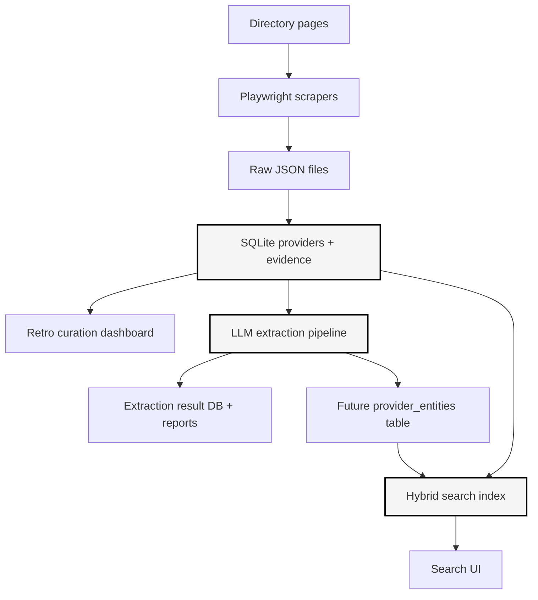
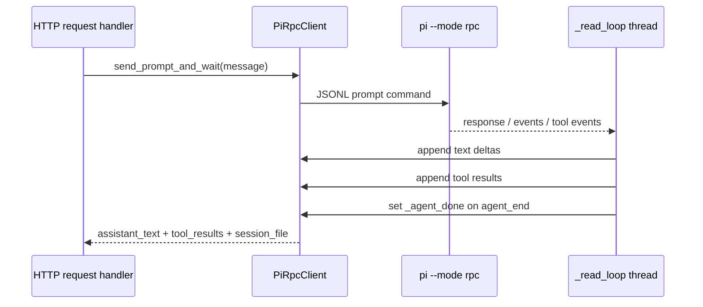
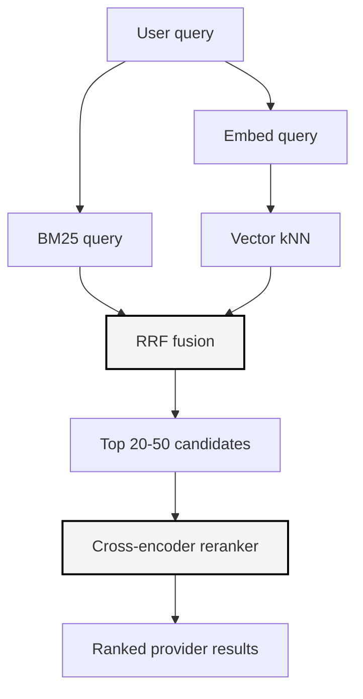

# Providence Therapist Search: End-to-End Research System and LLM Extraction Lab

This article is a technical reconstruction of the Providence Therapist Search project as it stands after the scraping, dashboard, vector search research, pi RPC wrapper, custom extraction tools, model comparisons, session-strategy experiments, and extraction inspection UI. It is written for a future reader who needs to understand the system well enough to maintain it, extend it, or rebuild it from the source artifacts.

The project began with a concrete research task: find therapists in Providence, Rhode Island who are plausibly autism-informed, ADHD-informed, LGBTQ-friendly, and Medicaid-compatible. The implementation grew into a larger research system. It now includes Playwright scrapers, an evidence-oriented SQLite database, a retro monochrome curation dashboard, an LLM extraction pipeline using pi's RPC mode, custom pi tools for structured output, extraction benchmark reports, and a planned hybrid search engine using Bleve, embeddings, RRF fusion, and reranking.

> [!summary]
> - The core data model is evidence-based: raw directory profiles are scraped, normalized into providers, and annotated with evidence rows that preserve claim type, claim value, quote, and source.
> - The dashboard is not just a browser for data; it is a curation workstation with review state, contact state, source evidence, profile text, and photo inspection.
> - The LLM extraction work evolved from parsing JSON out of prose to using pi custom tools that return typed data through `tool_execution_end` events.
> - The experiments show that model choice, session strategy, and tool termination behavior materially affect extraction labels such as `new_clients`, `autism_informed`, and `neurodivergent_affirming`.

The central lesson is that the interesting part of the system is not any single component. The important design is the chain of custody from source page to evidence, from evidence to curation, from curation to extracted entities, and from extracted entities to search. Every stage must preserve enough context for later review, because the difference between a useful research assistant and an untrustworthy automation is the ability to explain why a provider was classified a certain way.

## 1. What the project is trying to accomplish

The project answers a search problem that ordinary directory search handles poorly. The user is not simply searching for "therapist Providence Medicaid." The actual query has several constraints, some explicit and some semantic:

- The provider should be in or near Providence, Rhode Island.
- The provider should accept Medicaid or a relevant Medicaid-like insurance plan.
- The provider should be autism-informed, ADHD-informed, or at least plausibly neurodivergent-affirming.
- The provider should be LGBTQ-friendly or explicitly affirming of queer, trans, nonbinary, or related communities.
- The provider should be worth contacting, which requires review state, notes, and contact tracking.

A naive keyword search can find pages that contain the words `autism`, `ADHD`, `LGBTQ`, and `Medicaid`, but it cannot decide whether those words occur as clinical expertise, directory tags, boilerplate, insurance labels, negated statements, or unrelated navigation text. A useful system therefore needs to carry both raw evidence and interpreted labels. It needs to let the user inspect the underlying profile text, not just accept a score.

The current system has three major layers:



The first layer gathers and preserves source material. The second layer supports manual review. The third layer adds semantic structure and future retrieval. Each layer is useful by itself, but the full system depends on the handoff between them.

## 2. Repository map and durable artifacts

The working repository is:

```text
/home/manuel/code/wesen/claw-stuff
```

The project-specific subtree is:

```text
therapist-search/
├── data/
│   ├── therapists.sqlite                  # Main provider/evidence database
│   ├── extraction_results.json             # Free-text LLM extraction experiment
│   ├── strategy_benchmark_kimi.json        # Kimi fresh vs batch benchmark
│   ├── strategy_benchmark_wafer.json       # Wafer fresh vs batch benchmark
│   ├── extraction_report.md                # Batch extraction report
│   ├── model_comparison_report.md          # Kimi vs Wafer report
│   ├── experiment_strategy_benchmark.md    # Session strategy report
│   ├── extractions.sqlite                  # Extraction inspection UI database
│   ├── raw/                                # Scraped JSON source files
│   └── pi-sessions/                        # pi JSONL session files
├── dashboard/
│   └── src/                                # React + Redux curation dashboard
├── scripts/
│   ├── init_db.py                          # Main DB initialization
│   ├── import_json.py                      # Raw scrape import + evidence generation
│   ├── serve_dashboard.py                  # Provider dashboard API
│   ├── batch_extract.py                    # Free-text extraction experiment runner
│   ├── extraction_strategy_benchmark.py    # Fresh-vs-batch benchmark runner
│   ├── serve_extractions.py                # Extraction Lab inspection server
│   ├── scrape-psychology-today.spec.js     # Listing scraper
│   └── scrape-profile-pages.spec.js        # Profile-page scraper
└── scripts/extraction_viewer/index.html    # Retro macOS-style extraction UI
```

The pi-related ticket workspace contains the REST wrapper:

```text
ttmp/2026/05/15/PI-LLM-TOOL--pi-agent-llm-processing-tool-rest-api-wrapper-for-rpc-mode/
└── scripts/pi_rpc_rest_server.py
```

The vector-search ticket workspace contains experiments and the implementation guide:

```text
ttmp/2026/05/15/THERAPIST-VEC-2026--therapist-vector-search-entity-extraction-and-bleve-hybrid-search/
├── design-doc/01-implementation-guide.md
├── reference/01-diary.md
└── scripts/
    ├── 01-bleve-basic/
    ├── 02-fastembed-go/
    ├── 03-bleve-hybrid/
    ├── 04-bleve-real-data/
    ├── 05-fireworks-embedding-rerank/
    └── benchmark_dataset.json
```

The custom pi extension lives at the project root:

```text
.pi/extensions/therapist-extract.ts
.pi/extensions/therapist-extract-noterminate.ts
```

The first file contains final-answer extraction tools with `terminate: true`. The second exists for batch experiments where a model must call a tool repeatedly in one agent run.

## 3. Source acquisition with Playwright

The source acquisition step uses Playwright because the directory pages are rendered web pages rather than simple static documents. The scraper needs browser behavior: page navigation, selectors, rendered text extraction, and profile-page loading. The project uses two categories of scraper:

1. Listing scrapers that search Psychology Today for relevant queries such as autism, LGBTQ, and Medicaid in Providence.
2. Profile-page scrapers that visit provider profile URLs, extract full profile text, and capture photo URLs.

The raw outputs are stored under:

```text
therapist-search/data/raw/
├── psychology_today_autism_providence.json
├── psychology_today_lgbtq_providence.json
├── psychology_today_medicaid_providence.json
└── psychology_today_profile_pages.json
```

The important design decision is that scraping does not try to decide everything. It captures source material. The import step decides how to merge, deduplicate, and score. This separation matters because directory pages change, scraping can fail partially, and classification rules evolve. If raw scrape files are preserved, the import pipeline can be rerun without revisiting the website.

The profile text is intentionally stored even though it is messy. A typical raw profile contains navigation chrome, repeated provider names, repeated calls to action, insurance sections, specialty lists, and footer material. This is not clean prose. It is evidence material. Later stages can clean it, but the original profile text should remain available for inspection.

The scrape count after the initial collection was:

| Metric | Count |
|---|---:|
| Providers in SQLite | 79 |
| Evidence rows | 538 |
| Providers with profile text | 79 |
| Providers with photo URLs | 79 |

This is small enough that expensive per-provider LLM work is viable, but large enough that manual review benefits from a real dashboard and ranking system.

## 4. The SQLite evidence model

The main database is `therapist-search/data/therapists.sqlite`. It is deliberately simple. The schema has three base tables and one view.

```sql
CREATE TABLE providers (
  id INTEGER PRIMARY KEY AUTOINCREMENT,
  canonical_name TEXT NOT NULL,
  credentials TEXT,
  organization TEXT,
  phone TEXT,
  email_url TEXT,
  website_url TEXT,
  profile_url TEXT UNIQUE,
  city TEXT DEFAULT 'Providence',
  state TEXT DEFAULT 'RI',
  accepts_medicaid TEXT DEFAULT 'unknown',
  accepts_new_clients TEXT DEFAULT 'unknown',
  service_modes TEXT,
  fit_score INTEGER DEFAULT 0,
  status TEXT DEFAULT 'needs_review',
  notes TEXT DEFAULT '',
  starred INTEGER NOT NULL DEFAULT 0,
  emailed INTEGER NOT NULL DEFAULT 0,
  called INTEGER NOT NULL DEFAULT 0,
  email_date TEXT,
  call_date TEXT,
  last_contacted_at TEXT,
  contact_notes TEXT NOT NULL DEFAULT '',
  profile_text TEXT NOT NULL DEFAULT '',
  photo_url TEXT NOT NULL DEFAULT '',
  created_at TEXT NOT NULL DEFAULT CURRENT_TIMESTAMP,
  updated_at TEXT NOT NULL DEFAULT CURRENT_TIMESTAMP
);

CREATE TABLE evidence (
  id INTEGER PRIMARY KEY AUTOINCREMENT,
  provider_id INTEGER REFERENCES providers(id) ON DELETE CASCADE,
  source_name TEXT NOT NULL,
  source_url TEXT NOT NULL,
  captured_at TEXT NOT NULL DEFAULT CURRENT_TIMESTAMP,
  claim_type TEXT NOT NULL,
  claim_value TEXT NOT NULL,
  quote TEXT NOT NULL
);

CREATE TABLE source_runs (
  id INTEGER PRIMARY KEY AUTOINCREMENT,
  source_name TEXT NOT NULL,
  source_url TEXT NOT NULL,
  started_at TEXT NOT NULL DEFAULT CURRENT_TIMESTAMP,
  completed_at TEXT,
  status TEXT NOT NULL,
  notes TEXT DEFAULT ''
);
```

The view aggregates provider-level evidence for dashboard consumption:

```sql
CREATE VIEW provider_summary AS
SELECT
  p.*,
  group_concat(DISTINCT e.claim_type || ':' || e.claim_value) AS evidence_tags,
  count(e.id) AS evidence_count
FROM providers p
LEFT JOIN evidence e ON e.provider_id = p.id
GROUP BY p.id;
```

The evidence table is the important table. It does not only record that a provider matched `autism` or `medicaid`; it also records the source URL, the claim value, and the quote. A classification that cannot be traced back to text is hard to audit. A classification that can be traced back to a quote can be corrected, downgraded, or confirmed.

The current import pipeline uses keyword evidence rules. Examples include:

| Claim type | Examples of matched values |
|---|---|
| `autism` | `autism`, `neurodiverg`, `developmental disorders` |
| `adhd` | `adhd`, `executive function`, `executive functioning` |
| `lgbtq` | `lgbt`, `queer`, `trans`, `nonbinary` |
| `medicaid` | `medicaid`, `MassHealth`, `MBHP` |
| `new_clients` | `accepting`, `new patients`, `consultation` |

The keyword rules are intentionally not the final truth. They are a first-pass index into evidence. LLM extraction exists because keyword matches do not understand semantic distinctions such as:

- `autism` as an explicit specialty versus `neurodivergent` as an identity-affirming umbrella term.
- `Queer Allied` as a directory tag versus a practice statement that centers queer and trans clients.
- `call for a free consultation` as a contact invitation versus a reliable statement that the provider is accepting new clients.
- `Trauma and PTSD` as a listed expertise versus explicit trauma-informed training.

The database design supports both layers. The evidence table stores the cheap deterministic layer. Future `provider_entities` tables can store LLM-interpreted structure.

## 5. The curation dashboard

The first UI is the provider dashboard. It is built in React and styled as a retro monochrome interface. The backend is `therapist-search/scripts/serve_dashboard.py`, listening on port `8766`. The frontend runs through Vite on port `8765`, with API proxying to the Python backend.

The dashboard uses Redux Toolkit Query rather than ad hoc `fetch` calls. That choice matters because provider state changes frequently during review. Starred, called, emailed, contact notes, and selected provider state should update without manual cache plumbing.

The API surface is small:

| Endpoint | Purpose |
|---|---|
| `GET /api/progress` | Return providers from `provider_summary` with evidence counts and curation fields. |
| `POST /api/provider` | Patch provider curation fields such as `starred`, `emailed`, `called`, and `contact_notes`. |

The frontend evolved through several usability decisions:

- The main view became a split-pane layout: provider list on the left, detail sidebar on the right.
- Provider cards and table/list views are both available.
- The detail sidebar shows photo, profile text, source evidence, curation state, and contact controls.
- The source runs and evidence section is collapsible by default to keep the profile readable.
- The review modal supports arrow-key navigation, `S` to star, and Escape to close.
- The selected provider is persisted in the URL hash so the page can be reloaded or shared without losing context.

The retro style is not decorative in the codebase. It creates a dense, low-distraction review environment. Monochrome borders, high-contrast badges, compact tables, and window-like sections make the tool usable when scanning many providers. Color accents are reserved for information weight rather than visual branding.

## 6. Why entity extraction became necessary

The dashboard answers the first question: what did we scrape, and which providers look promising? It does not answer the second question well enough: how should these providers be represented for search?

A search system needs structured data. The profile text is too raw to be indexed directly without losing meaning. Consider these labels:

```text
autism_informed
autism_informed = implicit
neurodivergent_affirming
lgbtq_affirming
bipoc_affirming
new_clients
trauma_informed
```

Each label has a different semantics. `autism_informed: yes` means explicit autism expertise. `autism_informed: implicit` means the profile suggests relevance, often through `neurodivergent` language, but does not literally list autism. `neurodivergent_affirming: yes` means the profile self-describes around neurodivergent care or identity, not merely that the profile lists ADHD as a condition. These distinctions matter because a search engine should rank explicit evidence differently from implicit evidence.

The first extraction experiment used three prompt styles:

| Prompt | Purpose | Output |
|---|---|---|
| V1 | Comprehensive structured extraction | JSON with name, credentials, specialties, populations, communities, modalities, insurance, availability, fee, and summary. |
| V2 | Search-relevant classification | JSON with eight `yes`/`no`/`implicit` categories. |
| V3 | Human-readable summary | Prose summary for display cards. |

The V2 classification became the most important for search because it directly answers the filtering question. The V1 extraction is better for enriching records. The V3 summary is better for displaying concise provider cards.

The first version returned JSON in assistant text. That worked, but it exposed a class of problems that recur in LLM systems:

- The model may wrap JSON in markdown fences despite being told not to.
- The pi agent may append `<summary>` blocks to assistant text.
- A prose-oriented prompt may include explanatory text before or after JSON.
- JSON parsing then becomes a brittle cleanup problem rather than a reliable interface.

This failure mode led directly to the custom pi tool approach.

## 7. pi RPC mode as an LLM integration layer

The project needed a way to use models configured in pi from ordinary scripts. Direct provider APIs would work, but they would require separate authentication and per-provider client code. pi already knows how to talk to configured models. The missing piece was a convenient synchronous HTTP API around pi's RPC mode.

pi RPC mode is a JSONL protocol over stdin and stdout. A client starts:

```bash
pi --mode rpc --model kimi-coding/kimi-for-coding --session-dir therapist-search/data/pi-sessions
```

Then it sends commands such as:

```json
{"id":"req-1","type":"prompt","message":"Classify this profile..."}
```

The process emits:

- `response` messages for accepted commands.
- Streaming `message_update` events while a model is generating text or tool calls.
- `tool_execution_start` and `tool_execution_end` events for tool calls.
- `agent_end` when the full turn is complete.

The REST wrapper, `pi_rpc_rest_server.py`, hides this protocol behind endpoints:

| Endpoint | Purpose |
|---|---|
| `GET /healthz` | Confirm the pi subprocess is running. |
| `POST /session/new` | Start a fresh pi session and return the session file path. |
| `POST /session/prompt` | Send a prompt and block until `agent_end`. |
| `GET /session/file` | Return the current pi JSONL session file. |
| `GET /models` | Return configured models. |
| `POST /model/set` | Switch model provider and model ID. |
| `POST /session/abort` | Abort an active run. |

The first implementation attempted to read stdout in two places: a background `_read_loop` and a non-blocking `fcntl` loop inside `send_prompt_and_wait`. That produced hangs because both readers were racing on the same pipe. The fix was to make `_read_loop` the only stdout reader.

The fixed architecture is:



The important code path is:

```python
elif obj_type == "tool_execution_end":
    self._tool_results.append(obj)
    self._agent_events.append(obj)
elif obj_type == "agent_end":
    self._agent_events.append(obj)
    self._agent_done.set()
```

`send_prompt_and_wait` does not read stdout. It sends a prompt, waits on a `threading.Event`, then extracts structured tool result details:

```python
if not self._agent_done.wait(timeout=timeout):
    raise TimeoutError(...)

tool_details = []
for tr in self._tool_results:
    result = tr.get("result", {})
    details = result.get("details", {})
    if details and details.get("tool"):
        tool_details.append(details)
```

This is the point at which the pi RPC server becomes more than a text completion wrapper. Once custom tools are enabled, the HTTP response can return typed extraction results without parsing the assistant's prose.

## 8. Session persistence and why it matters

The REST wrapper originally used `--no-session`, which disabled pi session files. That made the tool convenient but removed auditability. The project changed direction: session files should be written to disk so extraction runs can be inspected after the fact.

The pi command now uses:

```bash
pi --mode rpc \
  --model kimi-coding/kimi-for-coding \
  --session-dir /home/manuel/code/wesen/claw-stuff/therapist-search/data/pi-sessions
```

A session file is a JSONL file. It records session metadata, model changes, user messages, assistant messages, tool calls, tool results, thinking blocks when available, and custom extension entries. This makes experiments reproducible enough for audit. If a classification looks wrong, the session file can show:

- What prompt was sent.
- What profile text was included.
- Which model was active.
- Whether the model thought through all providers before calling tools.
- How many tool calls were issued in each assistant message.
- What exact tool arguments were used.

The session files solved a real debugging problem later in the project. Wafer/Qwen3.5 appeared to terminate early during batch extraction. The session file showed exactly why: the model had reasoned through all five providers but issued only one tool call before `terminate: true` stopped the agent.

Without session persistence, that diagnosis would have been speculative. With session persistence, it was visible in the message sequence.

## 9. Custom pi tools for structured therapist output

The most important improvement in the extraction pipeline was replacing "return JSON in your response" with custom pi tools. The extension lives at:

```text
.pi/extensions/therapist-extract.ts
```

It registers three tools:

| Tool | Replaces | Purpose |
|---|---|---|
| `extract_therapist` | V1 | Full structured extraction with specialties, communities, insurance, modalities, fee, languages, and summary. |
| `classify_therapist` | V2 | Search-relevant yes/no/implicit classification. |
| `summarize_therapist` | V3 | Display-oriented narrative summary. |

The classification tool schema is the most important:

```typescript
const ClassifyTherapistParams = Type.Object({
  provider_id: Type.Number(),
  name: Type.String(),
  autism_informed: StringEnum(["yes", "no", "implicit"] as const),
  adhd_informed: StringEnum(["yes", "no", "implicit"] as const),
  lgbtq_affirming: StringEnum(["yes", "no", "implicit"] as const),
  medicaid: StringEnum(["yes", "no", "implicit"] as const),
  new_clients: StringEnum(["yes", "no", "implicit"] as const),
  trauma_informed: StringEnum(["yes", "no", "implicit"] as const),
  neurodivergent_affirming: StringEnum(["yes", "no", "implicit"] as const),
  bipoc_affirming: StringEnum(["yes", "no", "implicit"] as const),
});
```

There are several design choices in this schema.

First, the output is typed. `provider_id` is a number. Category fields are enum values. The model cannot return an object with arbitrary keys if the tool schema is enforced by pi and the provider API.

Second, the category values are ternary rather than binary. `implicit` is not a compromise value; it is a necessary value. It distinguishes explicit evidence from semantically relevant evidence. A profile that says `Autism` in the expertise list and a profile that says `neurodivergent communities` are both relevant to autism search, but they should not be represented identically.

Third, `autism_informed` and `neurodivergent_affirming` are separate. This distinction became important in the experiments. Some providers list autism as a clinical specialty but do not self-describe as neurodivergent-affirming. Other providers center neurodivergent communities but do not literally say autism. Those are different forms of evidence.

The tool returns a `details` object:

```typescript
return {
  content: [{
    type: "text",
    text: `Classified ${params.name} (ID ${params.provider_id})...`,
  }],
  details: record,
  terminate: true,
};
```

In RPC mode, `details` is preserved in the `tool_execution_end` event. The REST server extracts it and returns it as `tool_results`:

```json
{
  "assistant_text": "",
  "event_count": 11,
  "message_count": 3,
  "tool_results": [
    {
      "tool": "classify_therapist",
      "provider_id": 20,
      "name": "Carmel Lombardi",
      "autism_informed": "yes",
      "adhd_informed": "yes",
      "lgbtq_affirming": "yes",
      "medicaid": "yes",
      "new_clients": "implicit",
      "trauma_informed": "yes",
      "neurodivergent_affirming": "no",
      "bipoc_affirming": "yes"
    }
  ]
}
```

This eliminates the parsing layer. The assistant no longer needs to be trusted to format JSON correctly in text. The tool call itself is the structured output.

## 10. Free-text extraction experiments

The first extraction experiment ran five high-fit providers through all three prompt versions. The selected providers were:

| ID | Provider | Fit score | Profile length |
|---:|---|---:|---:|
| 18 | Dr. Juan Enrique Rosario Jr. | 100 | 8111 |
| 20 | Carmel Lombardi | 95 | 4358 |
| 22 | New England Wellness Collaborative | 95 | 6887 |
| 29 | Madrone B. Phoenix | 95 | 8379 |
| 31 | The Phoenix Rising Centers | 95 | 6957 |

The timing showed the cost of output shape:

| Prompt | Min | Max | Mean | Best use |
|---|---:|---:|---:|---|
| V1 comprehensive | 38s | 106s | 64s | Rich provider entity records. |
| V2 classification | 21s | 51s | 35s | Search filtering and benchmark labels. |
| V3 narrative | 18s | 23s | 20s | Display summaries. |

The classification results were useful enough to establish the core label set. The results also showed where rule-based evidence and LLM interpretation differ. For example:

- Madrone Phoenix and Phoenix Rising use `neurodivergent` or `neurodiverse` language but may not literally say `autism`. A keyword system can miss or underweight this.
- Dr. Rosario explicitly lists autism and ADHD but does not self-describe as neurodivergent-affirming. Treating those as the same label would blur a useful distinction.
- `call for consultation` is weaker evidence than `Accepting New Patients!`, so `new_clients` should support `implicit`.

The free-text experiment also revealed why custom tools were necessary. The model often returned JSON inside markdown fences, and pi appended summary blocks. Cleaning these cases is possible, but it is not the right interface for production extraction.

## 11. Model comparison: Kimi versus Wafer/Qwen3.5

The next experiment compared `kimi-coding/kimi-for-coding` with `wafer/Qwen3.5-397B-A17B`. Both models have large context windows and reasoning enabled, but they use different provider APIs:

| Model | Provider/API | Context | Cost observed in model metadata |
|---|---|---:|---:|
| `kimi-coding/kimi-for-coding` | Anthropic-messages style | 262K | free coding tier |
| `wafer/Qwen3.5-397B-A17B` | OpenAI-completions style | 262K | $0.60/M input, $3.60/M output |

The comparison used the `classify_therapist` tool, which removed JSON-formatting variance. The interesting differences were semantic:

| Case | Kimi | Wafer | Interpretation |
|---|---|---|---|
| `new_clients` for consultation-only profiles | `implicit` | `yes` | Kimi is more conservative and likely more useful. |
| `autism_informed` for Phoenix Rising | `implicit` | `no` | Kimi treats `neurodiverse` as semantically relevant; Wafer is stricter. |
| `bipoc_affirming` for directory tags | often stricter in tool mode | often similar or `implicit` | The distinction depends on whether tags count as self-description. |

The speed comparison for classification favored Wafer in short calls:

| Provider | Kimi | Wafer |
|---|---:|---:|
| Dr. Rosario | 25.3s | 30.7s |
| Carmel Lombardi | 50.1s | 11.4s |
| NEWC | 24.6s | 12.6s |
| Madrone Phoenix | 23.1s | 17.3s |
| Phoenix Rising | 38.1s | 15.0s |
| Mean | 32.2s | 17.4s |

However, full structured extraction was faster with Kimi in the tested case. The practical conclusion was not simply "one model is better." The better conclusion is:

- Use Kimi for production extraction when conservative classification and zero marginal cost are more important.
- Use Wafer for fast cross-checks and disagreement discovery.
- Treat model disagreement as a review signal rather than as an error to suppress.

## 12. Session strategy experiments

The next question was whether extractions should share context. There are two plausible strategies:

```text
Strategy A: fresh session per provider
POST /session/new → classify provider 18
POST /session/new → classify provider 20
POST /session/new → classify provider 22
...

Strategy B: batch prompt
POST /session/new → prompt includes all five profiles → model calls classify_therapist multiple times
```

Fresh sessions isolate each provider. Batch prompts let the model compare providers implicitly. The experiment showed that this difference matters.

For Kimi, the fresh-vs-batch disagreement rate was 8 out of 40 labels, or 20%. The disagreements were not random. They followed interpretable patterns:

| Pattern | Fresh sessions | Batch prompt | Likely explanation |
|---|---|---|---|
| `new_clients` | More likely `yes` | More likely `implicit` | Batch sees Dr. Rosario's explicit `Accepting New Patients!` and becomes stricter for weaker consultation language. |
| `autism_informed` for neurodivergent providers | More likely `implicit` | More likely `no` | Batch contrasts explicit autism profiles with neurodivergent-only profiles. |
| `bipoc_affirming` from directory tags | More likely `yes` | More likely `no` | Batch contrasts weak tags with strong Black/Brown centering in Phoenix Rising profiles. |
| `neurodivergent_affirming` from clinical specialties | More likely `yes` | More likely `no` | Batch distinguishes clinical condition lists from self-description. |

This is one of the most important findings. Context is not merely contamination. It can improve precision by creating a comparison set. It can also reduce recall by making the model stricter. The correct strategy depends on the downstream goal.

For production extraction, fresh sessions are safer because they avoid cross-provider dependence and work consistently across models. For calibration, batch extraction is useful because disagreement between fresh and batch highlights ambiguous cases.

## 13. The Wafer termination bug and what it taught us

Wafer's first batch experiment classified only one provider. The session file explained why.

Kimi produced one assistant message with five tool calls:

```text
[message] role=assistant
  toolCall classify_therapist(provider=18)
  toolCall classify_therapist(provider=20)
  toolCall classify_therapist(provider=22)
  toolCall classify_therapist(provider=29)
  toolCall classify_therapist(provider=31)
```

Wafer produced one assistant message with one tool call:

```text
[message] role=assistant
  toolCall classify_therapist(provider=18)
[message] role=toolResult
  terminate:true
```

The tool returned `terminate: true`. pi's documentation says that `terminate: true` skips the automatic follow-up LLM call when every finalized tool result in the current batch is terminating. For Kimi, the batch contains five tool calls, so all five execute before termination. For Wafer, the batch contains one tool call, so termination happens after the first provider.

The root cause is not that Wafer failed to understand the prompt. Its thinking block showed that it reasoned through all five providers. The issue is the interaction between:

1. The model/API's tool-call batching behavior.
2. pi's `terminate: true` semantics.
3. The desire to call one final-answer tool multiple times in one agent run.

The fix was to create a non-terminating extension variant:

```text
.pi/extensions/therapist-extract-noterminate.ts
```

With `terminate: false`, Wafer classified all five providers in 13.2 seconds. It produced five sequential assistant messages, each with one tool call, and a final prose follow-up. That follow-up is wasted output, but the extraction succeeds.

The long-term better design is a real batch tool:

```typescript
classify_therapists_batch({
  providers: [
    { provider_id, name, autism_informed, ... },
    ...
  ]
})
```

A batch tool would allow one terminating call, avoid provider-by-provider follow-up overhead, and work the same way across APIs.

## 14. The extraction inspection lab

Once multiple experiments existed, the results needed their own inspection UI. The project added a small retro macOS-style website backed by a separate SQLite database:

```text
therapist-search/data/extractions.sqlite
therapist-search/scripts/serve_extractions.py
therapist-search/scripts/extraction_viewer/index.html
```

This UI is not a replacement for the provider curation dashboard. It is a lab notebook for extraction runs. Its job is to show:

- Which runs exist.
- Which model and strategy each run used.
- What prompt template was used.
- How the run was executed.
- What each provider's labels were in each run.
- Where runs disagree.
- What long-form reports were produced.

The extraction lab schema extends beyond raw results:

```sql
CREATE TABLE extraction_runs (
  id INTEGER PRIMARY KEY AUTOINCREMENT,
  run_name TEXT NOT NULL,
  model TEXT NOT NULL,
  strategy TEXT NOT NULL,
  tool_name TEXT,
  prompt_version TEXT,
  description TEXT,
  methodology TEXT,
  prompt_template TEXT,
  session_file TEXT,
  ran_at TEXT NOT NULL,
  provider_count INTEGER DEFAULT 0,
  total_elapsed_s REAL DEFAULT 0,
  metadata TEXT DEFAULT '{}'
);

CREATE TABLE extraction_results (
  id INTEGER PRIMARY KEY AUTOINCREMENT,
  run_id INTEGER NOT NULL REFERENCES extraction_runs(id),
  provider_id INTEGER NOT NULL,
  provider_name TEXT NOT NULL,
  result_json TEXT NOT NULL,
  tool_name TEXT,
  elapsed_s REAL,
  created_at TEXT NOT NULL DEFAULT CURRENT_TIMESTAMP
);

CREATE TABLE provider_profiles (
  provider_id INTEGER PRIMARY KEY,
  canonical_name TEXT NOT NULL,
  credentials TEXT,
  organization TEXT,
  fit_score INTEGER DEFAULT 0,
  accepts_medicaid TEXT DEFAULT 'unknown',
  service_modes TEXT,
  profile_text TEXT NOT NULL DEFAULT '',
  photo_url TEXT NOT NULL DEFAULT '',
  evidence_tags TEXT DEFAULT ''
);

CREATE TABLE run_documents (
  id INTEGER PRIMARY KEY AUTOINCREMENT,
  run_id INTEGER NOT NULL REFERENCES extraction_runs(id),
  doc_type TEXT NOT NULL,
  title TEXT NOT NULL,
  content TEXT NOT NULL,
  created_at TEXT NOT NULL DEFAULT CURRENT_TIMESTAMP
);
```

The important correction made during the UI work was that methodology and prompt information should not live only in markdown reports. It belongs in the inspection database as first-class run metadata. A result without a prompt template is not enough. The user needs to know what instruction produced the result.

The UI has four views:

| View | Purpose |
|---|---|
| Compare | Cross-run table for every provider and category. |
| Providers | Provider-focused view with original profile text and all extraction outputs. |
| Runs | Run-focused view with description, methodology, prompt template, and results. |
| Reports | Markdown-rendered experiment reports imported into `run_documents`. |

The inspection lab uses the same retro monochrome style as the dashboard, with slight color accents for model labels, strategy labels, and implicit values. The visual rule is simple: black-and-white for structure, color only for information weight.

## 15. Vector search research and planned search architecture

The vector search work is documented in `THERAPIST-VEC-2026`. The core design is hybrid retrieval:

1. Use BM25 for lexical precision.
2. Use embeddings for semantic recall.
3. Fuse the result lists with reciprocal rank fusion.
4. Optionally rerank the top candidates with a cross-encoder.

The experiments validated several pieces:

| Experiment | Purpose | Result |
|---|---|---|
| `01-bleve-basic` | BM25 indexing and querying | Worked. |
| `02-fastembed-go` | Local embedding generation | Worked with ONNX Runtime and BGE-small. |
| `03-bleve-hybrid` | Bleve vector fields + hybrid search | Worked after pinning versions. |
| `04-bleve-real-data` | Index all 79 providers | Worked on real data. |
| `05-fireworks-embedding-rerank` | Fireworks embeddings and reranker | Worked; better cosine spread than local fallback. |

The validated local Bleve/FAISS combination is narrow:

```text
bleve/v2 v2.5.4
go-faiss v1.0.25
blevesearch/faiss commit b3d4e00
```

The build command used for Go vector experiments is:

```bash
LD_LIBRARY_PATH=~/.local/lib \
CGO_CFLAGS="-I~/.local/include" \
CGO_LDFLAGS="-L~/.local/lib -lfaiss_c -lfaiss" \
go run -tags=vectors main.go
```

Bleve v2.6.0 and other FAISS variants failed due to C API mismatch or missing extension headers. This is not incidental. The project depends on native vector search support, and native library version alignment is a real engineering constraint.

The search pipeline should index several text representations:

| Field | Source | Search role |
|---|---|---|
| `name` | providers | Exact/provider lookup. |
| `profile_markdown` | cleaned profile text | Main lexical and embedding source. |
| `evidence_tags` | evidence view | High-precision keyword filters. |
| `classification_labels` | LLM extraction | Faceted filtering and ranking boosts. |
| `summary` | LLM extraction | Display and semantic retrieval. |
| `hypothetical_questions` | future LLM enrichment | Query expansion / RAG precomputation. |

The recommended fusion method is reciprocal rank fusion. RRF is robust because it depends on rank rather than raw score scale. BM25 scores and cosine similarities do not share a meaningful numeric range. RRF avoids pretending that they do.

Pseudocode:

```go
func rrf(rank int, k float64) float64 {
    return 1.0 / (k + float64(rank))
}

func fuse(bm25 []Hit, vector []Hit) []Hit {
    scores := map[string]float64{}
    for i, hit := range bm25 {
        scores[hit.ID] += rrf(i+1, 60)
    }
    for i, hit := range vector {
        scores[hit.ID] += rrf(i+1, 60)
    }
    return sortByScore(scores)
}
```

The vector experiments also showed that pure vector search is not enough for this dataset. Therapist profiles cluster semantically because many profiles discuss similar clinical topics. The cosine range was narrow with local embeddings. Fireworks `qwen3-embedding-8b` improved separation, but hybrid search is still the correct architecture.

## 16. Embeddings and reranking

The project compared local and cloud options for embeddings and reranking.

Local fallback:

```text
fastembed-go
BGE-small-en-v1.5
384-dimensional embeddings
ONNX Runtime required
```

Cloud recommended path:

```text
Fireworks qwen3-embedding-8b
1024-dimensional embeddings
better cosine spread on therapist text
```

Reranking:

```text
Fireworks qwen3-reranker-8b
cross-encoder style relevance scoring
observed scores around 0.70–0.98 for relevant documents
```

The distinction between bi-encoder retrieval and cross-encoder reranking is fundamental. A bi-encoder embeds query and document separately. It is efficient because document embeddings can be precomputed. A cross-encoder reads the query and candidate document together. It is more expensive but more precise because it can attend across the full pair.

The intended production retrieval path is:



The extracted classification labels should be part of ranking, not only filters. For example, a query containing `autism` should strongly boost `autism_informed: yes`, weakly boost `autism_informed: implicit`, and possibly boost `neurodivergent_affirming: yes` depending on the query phrasing.

## 17. Benchmarking retrieval quality

The project created a benchmark dataset with 20 queries across 8 categories. The next step is to use it to compare search variants:

| Variant | What it tests |
|---|---|
| BM25 only | Keyword baseline. |
| Vector only | Semantic baseline. |
| BM25 + vector RRF | Hybrid retrieval. |
| Hybrid + LLM labels | Whether extracted labels improve ranking. |
| Hybrid + reranker | Whether cross-encoder improves top-K precision. |
| Hybrid + generated summaries/questions | Whether RAG precomputation improves recall. |

The most relevant metrics are:

| Metric | Meaning in this project |
|---|---|
| Recall@10 | Did the system include the relevant therapists in the first ten results? |
| nDCG@10 | Did the system put highly relevant therapists near the top? |
| MRR | How early does the first good result appear? |
| MAP | How consistently are relevant providers ranked across the list? |

A therapist search system should not be optimized only for exact matches. It should surface explicit matches first while still allowing implicit matches to appear. This makes nDCG more useful than a pure binary metric, because relevance levels matter.

A useful relevance scale for this project is:

| Level | Meaning |
|---:|---|
| 0 | Not relevant or insufficient evidence. |
| 1 | Weak or implicit relevance. |
| 2 | Strong explicit relevance. |
| 3 | Strong explicit relevance plus practical fit, such as Medicaid and availability. |

This scale maps directly to the extraction labels. `yes` is stronger than `implicit`, but `implicit` is not zero.

## 18. Failure modes discovered during the project

The project uncovered several failure modes that should be preserved as engineering knowledge.

### 18.1 Raw profile text contains navigation and repeated boilerplate

The scraper captures rendered text, not semantic page sections. This means navigation text and repeated calls to action are mixed into the clinical description. Search and extraction must account for this. A future cleaning stage should produce `profile_markdown` while preserving `profile_text` for audit.

### 18.2 Keyword evidence is high recall but low nuance

Keyword matches are cheap and useful, but they do not understand context. They should be treated as evidence pointers, not final labels.

### 18.3 Free-text JSON extraction is brittle

Even strong models wrap JSON in markdown fences, add prose, or emit session summaries. This can be cleaned, but custom tools are better.

### 18.4 Session context changes extraction labels

Fresh sessions and batch prompts produced different classifications. The differences were meaningful. Batch context improved some precision decisions but reduced some implicit recall.

### 18.5 Tool termination interacts with model API behavior

`terminate: true` is safe for final-answer tools that should be called once. It is unsafe for repeated batch tools when a model issues one tool call per turn. The fix is either `terminate: false` or a true batch tool.

### 18.6 Extension auto-discovery can cause tool-name conflicts

Both `.pi/extensions/therapist-extract.ts` and `.pi/extensions/therapist-extract-noterminate.ts` register `classify_therapist`. Loading both produces a conflict. The REST wrapper gained a `--no-extensions` flag so experiments can disable auto-discovery and load exactly one extension.

### 18.7 Native vector dependencies are version-sensitive

Bleve vector search depends on FAISS C bindings. The working version combination must be preserved and tested on any new machine.

## 19. Recommended implementation sequence from here

The next production pass should be staged. Each stage should write durable artifacts and be benchmarked before moving on.

### Stage 1: Stabilize extraction storage

Create a `provider_entities` table in `therapists.sqlite`:

```sql
CREATE TABLE provider_entities (
  provider_id INTEGER PRIMARY KEY REFERENCES providers(id),
  model TEXT NOT NULL,
  extraction_run_id TEXT NOT NULL,
  autism_informed TEXT CHECK (autism_informed IN ('yes','no','implicit')),
  adhd_informed TEXT CHECK (adhd_informed IN ('yes','no','implicit')),
  lgbtq_affirming TEXT CHECK (lgbtq_affirming IN ('yes','no','implicit')),
  medicaid TEXT CHECK (medicaid IN ('yes','no','implicit')),
  new_clients TEXT CHECK (new_clients IN ('yes','no','implicit')),
  trauma_informed TEXT CHECK (trauma_informed IN ('yes','no','implicit')),
  neurodivergent_affirming TEXT CHECK (neurodivergent_affirming IN ('yes','no','implicit')),
  bipoc_affirming TEXT CHECK (bipoc_affirming IN ('yes','no','implicit')),
  summary TEXT,
  raw_json TEXT NOT NULL,
  session_file TEXT,
  created_at TEXT NOT NULL DEFAULT CURRENT_TIMESTAMP
);
```

Do not overwrite previous entity runs without saving the old run. Extraction is an experiment as well as a data transformation.

### Stage 2: Add a true batch tool

Create `classify_therapists_batch` with array output. This avoids the `terminate` problem and should work with both Kimi and Wafer.

```typescript
parameters: Type.Object({
  providers: Type.Array(Type.Object({
    provider_id: Type.Number(),
    name: Type.String(),
    autism_informed: StringEnum(["yes", "no", "implicit"]),
    ...
  }))
})
```

The tool should return `terminate: true`, because it is a single final answer.

### Stage 3: Run full 79-provider extraction

Use Kimi fresh sessions as the production baseline. Optionally run Wafer batch as cross-validation. Flag disagreements for manual review.

### Stage 4: Build search index

Index:

- Raw provider fields.
- Cleaned `profile_markdown`.
- LLM summaries.
- Extracted classification labels.
- Evidence tags.

Use BM25 + vector RRF as baseline.

### Stage 5: Add reranking

Use Fireworks `qwen3-reranker-8b` on top candidates from hybrid retrieval. Measure nDCG@10 and Recall@10 before and after.

### Stage 6: Integrate search into dashboard

Add a search bar and result explanation panel. The explanation should show:

- Matching evidence tags.
- LLM labels.
- Snippets from profile text.
- Whether a match was explicit or implicit.

## 20. Working rules for this project

The following rules summarize the technical direction:

- Preserve raw source text. Cleaned and extracted representations are derived artifacts, not replacements.
- Store prompts, model IDs, strategies, session files, and methodology alongside extraction results.
- Treat `implicit` as a first-class label. It is essential for search recall.
- Use custom tools for structured extraction. Do not rely on parsing JSON from assistant prose in production.
- Use fresh sessions for production extraction unless a batch tool is specifically designed for multi-provider output.
- Use batch or multi-model disagreement as a review signal.
- Keep evidence quotes visible in the UI. A score without evidence is not enough.
- Benchmark retrieval changes with saved query judgments rather than relying on manual impressions.

## 21. Current status

The project now has:

- A working scraper and SQLite database with 79 providers and 538 evidence rows.
- A curation dashboard with provider review, contact tracking, photo display, profile text, and evidence inspection.
- A pi RPC REST server with session persistence, model switching, extension loading, and tool result capture.
- Custom pi extraction tools for full extraction, classification, and summary generation.
- Free-text, tool-based, model-comparison, and session-strategy extraction reports.
- A first extraction inspection UI backed by a separate SQLite database.
- Validated Bleve/FAISS experiments for hybrid search on the real provider dataset.
- Fireworks embedding and reranking experiments showing a viable cloud path.

The remaining work is integration. The system has enough pieces to build a production-grade search and review pipeline, but the extracted entities still need to be written into the main database, indexed, and exposed through the dashboard.

## 22. Closing

This project is now more than a therapist list. It is a small research platform for evidence-based provider discovery. The useful property is not that it uses LLMs, vector search, or a retro UI. The useful property is that it preserves the relationship between source text, extracted structure, experimental method, model behavior, and user-facing review.

That relationship is what makes the system maintainable. If a label is wrong, the session file can be inspected. If a model behaves differently, the comparison report shows where. If batch context changes classifications, the strategy benchmark explains the pattern. If search quality changes, the benchmark dataset can measure it. Each layer records enough information for the next layer to be questioned.

The next implementation phase should keep that property intact. Every new entity table, search index, reranker score, or UI badge should be traceable back to the prompt, the model, the tool call, the profile text, and the evidence quote that produced it.
