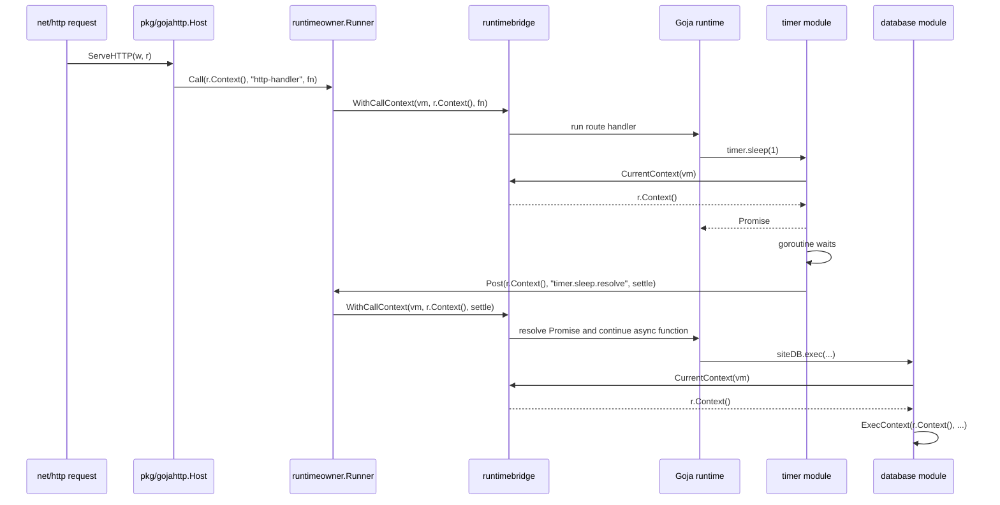

# go-go-goja Context Management: Runtime, Request, and Async Call Context

This article explains how context management works inside `go-go-goja`. The codebase embeds a single-threaded JavaScript runtime in Go, exposes Go modules to JavaScript, runs HTTP handlers inside the runtime, and lets Go goroutines settle JavaScript Promises later. Those requirements create a precise context problem: every piece of JavaScript must execute on the runtime owner thread, while every request-specific operation must still see the Go `context.Context` that started it.

The important distinction is that `go-go-goja` has more than one kind of context. A runtime has a lifecycle context. A call has a request or operation context. The owner runner has an internal owner context used for safe reentrant execution. Async modules must capture the current call context before leaving the owner thread and restore it when they settle a Promise. These contexts are related, but they are not interchangeable.

> [!summary]
> - `runtimeowner.Runner` serializes access to `*goja.Runtime` and wraps every owner-thread callback in a current call context.
> - `runtimebridge.CurrentContext(vm)` is the API that native modules use to discover the Go context active for the JavaScript call currently executing on that runtime.
> - Async modules must capture `CurrentContext(vm)` at JavaScript entry time and pass it to `Owner.Post(...)`; otherwise `await` continuations resume under the runtime lifecycle context instead of the request context.
> - The database module depends on this mechanism so `query` and `exec` inherit HTTP cancellation, deadlines, and tracing parent state even after an `await`.

## Why this note exists

The immediate source was PR #37 in `go-go-goja`, which added call-context propagation to native database operations and optimized the UI DSL attribute path. A code review found a gap in the async path. Direct JavaScript calls into `database.exec()` received the request context correctly, but a call after `await timer.sleep()` could fall back to the runtime lifecycle context.

The failing shape was this:

```javascript
async function handler(req, res) {
  const timer = require("timer");
  const database = require("database");

  await timer.sleep(10);
  database.exec("INSERT INTO visits(path) VALUES (?)", req.path);

  return "ok";
}
```

The HTTP host entered JavaScript with `r.Context()`. The database module read `runtimebridge.CurrentContext(vm)`. Those two pieces were correct for direct calls. The missing piece was that `timer.sleep()` settled its Promise by posting back to the owner runner with the runtime lifecycle context. The `await` continuation therefore executed under the lifecycle context, not under the request context. The database module then saw the wrong context.

The fix was to change async modules such as `timer` and `fs` so they capture `runtimebridge.CurrentContext(vm)` when their JavaScript-exported function is called, then use that captured context for the later `Owner.Post(...)` that resolves or rejects the Promise. A regression test in `modules/database/database_test.go` now proves that `database.exec()` after `await timer.sleep(1)` receives the original request context.

## The context vocabulary

The code is easier to read if the main terms are separated first. Each term has a different lifetime and a different job.

| Term | Concrete representation | Lifetime | Primary purpose |
| --- | --- | --- | --- |
| Runtime lifecycle context | `Runtime.runtimeCtx`, stored in `runtimebridge.Bindings.Context` | From `Factory.NewRuntime` until `Runtime.Close` | Cancel runtime-owned background work during shutdown. |
| Request context | Usually `http.Request.Context()` | One HTTP request | Carry cancellation, deadline, tracing, and request-scoped values. |
| Owner call context | The `ctx` passed to `Runner.Call` or `Runner.Post`, after owner metadata is attached | One owner-thread callback | Make the operation context active while Go code executes against the VM. |
| Current call context | Top entry in `runtimebridge`'s per-VM call context stack | Dynamic extent of the current owner callback | Let native module exports discover the active Go context without receiving it as a JavaScript argument. |
| Owner context marker | Private value inserted by `runtimeowner.withOwnerContext` | One owner-thread callback, tied to a goroutine id | Permit safe reentrant calls when already on the owner goroutine and prevent leaked contexts from bypassing scheduling. |
| Async captured context | A saved result of `runtimebridge.CurrentContext(vm)` | From async function entry until Promise settlement | Preserve request context across goroutine and Promise boundaries. |

The key rule is that the runtime lifecycle context is not a substitute for the request context. It answers the question, "is this runtime shutting down?" It does not answer the question, "has this HTTP request been canceled?" A database query, outbound API call, trace span, or request-scoped log field must use the call context when there is one.

## The runtime lifecycle context

A runtime instance is created in `engine/factory.go` by `Factory.NewRuntime`. The factory creates the Goja runtime, starts the Node-compatible event loop, constructs a `runtimeowner.Runner`, and then creates a runtime-owned context:

```go
vm := goja.New()
loop := eventloop.NewEventLoop()
go loop.Start()

owner := runtimeowner.NewRunner(vm, loop, runtimeowner.Options{
    Name:          "go-go-goja-runtime",
    RecoverPanics: true,
})

runtimeCtx, runtimeCtxCancel := context.WithCancel(context.Background())
```

That lifecycle context is stored in the `Runtime` object and in `runtimebridge` bindings:

```go
runtimebridge.Store(vm, runtimebridge.Bindings{
    Context: runtimeCtx,
    Loop:    loop,
    Owner:   runtimebridgeOwner{owner: owner},
})
```

`Runtime.Close` cancels this context, deletes the runtimebridge state for the VM, runs registered closers, shuts down the owner runner, and stops the event loop:

```go
if r.runtimeCtxCancel != nil {
    r.runtimeCtxCancel()
}
if r.VM != nil {
    runtimebridge.Delete(r.VM)
}
```

This context exists even when no request is executing. It is the correct context for runtime-scoped resources, module managers, background watchers that belong to the runtime, and default fallback behavior. It is also the fallback returned by `runtimebridge.CurrentContext(vm)` when there is no active owner call context.

The lifecycle context deliberately starts from `context.Background()`, not from the `ctx` passed to `NewRuntime`. The `NewRuntime` parameter is used for construction failure cleanup and API consistency; it is not the lifetime of the runtime. If runtime lifetime followed the setup call's context, a setup timeout or short-lived parent context could accidentally cancel a valid runtime after creation.

## The owner runner

Goja requires single-threaded access to a runtime. `go-go-goja` enforces this through `pkg/runtimeowner`. The runner is a small scheduler-aware API:

```go
type Runner interface {
    Call(ctx context.Context, op string, fn CallFunc) (any, error)
    Post(ctx context.Context, op string, fn PostFunc) error
    Shutdown(ctx context.Context) error
    IsClosed() bool
}
```

`Call` is for request/response work. It schedules a function on the runtime owner thread and waits for the result. `Post` is for fire-and-forget work. It schedules a function on the owner thread and returns once the work has been accepted, not once the callback has completed.

The runner's first responsibility is VM safety. It takes work from arbitrary goroutines and executes that work through a `Scheduler`, usually the `goja_nodejs/eventloop.EventLoop`:

```go
type Scheduler interface {
    RunOnLoop(fn func(*goja.Runtime)) bool
}
```

The runner's second responsibility is context preservation. When `Call` schedules a callback, it wraps the incoming context in an owner context and then invokes the callback through `runtimebridge.WithCallContext`:

```go
ownerCtx := r.withOwnerContext(ctx)
v, err := r.invoke(ownerCtx, op, fn)
```

Inside `invoke`:

```go
return runtimebridge.WithCallContext(r.vm, ctx, func() (any, error) {
    return fn(ctx, r.vm)
})
```

The same pattern exists for `Post` through `invokePost` and `WithCallContextVoid`.

This design means a native module export does not need an explicit `context.Context` argument in its JavaScript signature. It can ask `runtimebridge` for the current context associated with the VM. That is what `database.exec()` does.

## Owner context and call context are different

`runtimeowner` stores a private owner marker in the context:

```go
type ownerCtxValue struct {
    r   *runner
    gid uint64
}
```

The marker exists to answer one narrow question: is this code already running on this runner's owner goroutine? If yes, `Runner.Call` can execute the nested call immediately instead of scheduling it and waiting for itself. That avoids reentrant deadlocks.

The marker includes a goroutine id. This is important because a context can be passed to another goroutine. If a context marked as an owner context could be used from a different goroutine, code outside the owner thread could bypass scheduling and touch the VM unsafely. The runner checks both the runner identity and the current goroutine id:

```go
func (r *runner) isOwnerContext(ctx context.Context) bool {
    v, ok := ctx.Value(ownerCtxKey{}).(ownerCtxValue)
    if !ok || v.r != r || v.gid == 0 {
        return false
    }
    return v.gid == currentGoroutineID()
}
```

Tests in `pkg/runtimeowner/runner_test.go` cover this directly. `TestRunnerCallWithLeakedOwnerContextStillSchedules` and `TestRunnerPostWithLeakedOwnerContextStillSchedules` pass an owner-marked context to a new goroutine and assert that the nested operation is still scheduled instead of running immediately.

The call context stack in `runtimebridge` answers a different question: which semantic operation context should native modules inherit while this VM callback is executing? It carries cancellation, deadlines, values, and tracing. It is not a permission token for touching the VM. It is a dynamic context lookup for module code.

The distinction matters because a context passed through the system may contain both:

- an internal owner marker used only by `runtimeowner`, and
- request values, deadlines, and tracing state used by modules.

The owner marker decides how to run VM code safely. The current call context decides which operation the VM code belongs to.

## runtimebridge as the boundary between modules and the owner runner

`pkg/runtimebridge` exists so native modules can access runtime-owned scheduling primitives without importing the full `engine` or `runtimeowner` packages. That avoids import cycles and keeps module code small.

The bridge stores bindings per `*goja.Runtime`:

```go
type Bindings struct {
    Context context.Context
    Loop    *eventloop.EventLoop
    Owner   OwnerRunner
}
```

`OwnerRunner` is intentionally narrower than `runtimeowner.Runner`:

```go
type OwnerRunner interface {
    Post(ctx context.Context, op string, fn func(context.Context, *goja.Runtime)) error
}
```

Async modules need to settle Promises later. They do not need the full request/response `Call` API. The bridge therefore exposes only the owner-thread post operation to modules that need async settlement.

The bridge also stores the current call context stack per runtime:

```go
var callContextsByVM sync.Map

type callContextStack struct {
    mu    sync.Mutex
    stack []context.Context
}
```

`CurrentContext(vm)` checks the stack first, then falls back to lifecycle bindings, then to `context.Background()`:

```go
func CurrentContext(vm *goja.Runtime) context.Context {
    if st, ok := lookupCallContextStack(vm); ok {
        if ctx, ok := st.peek(); ok && ctx != nil {
            return ctx
        }
    }
    if bindings, ok := Lookup(vm); ok && bindings.Context != nil {
        return bindings.Context
    }
    return context.Background()
}
```

`WithCallContext` pushes a context, runs a function, and pops the context with `defer`:

```go
st := getCallContextStack(vm)
st.push(ctx)
defer st.pop()
return fn()
```

The stack exists for nested owner calls. If JavaScript calls a native module, and that module performs a reentrant owner call, the inner call must temporarily become current and then restore the outer one. `TestWithCallContextPushesAndRestoresNestedContext` proves this behavior. `TestWithCallContextPopsAfterPanic` proves that the stack is restored even when the callback panics.

## How an HTTP request enters the runtime

The HTTP host in `pkg/gojahttp/host.go` is the clearest request-context entry point. `ServeHTTP` receives a normal Go `*http.Request`, builds JavaScript request and response objects, and invokes the registered JavaScript route handler through the owner runner:

```go
ret, err := h.owner.Call(r.Context(), "http-handler", func(ctx context.Context, vm *goja.Runtime) (any, error) {
    result, err := route.Handler(goja.Undefined(), vm.ToValue(req.Map()), res.JSObject(vm))
    if err != nil {
        return nil, err
    }
    if promise, ok := result.Export().(*goja.Promise); ok {
        return promise, nil
    }
    return nil, h.finishHandlerResult(vm, res, result)
})
```

This call establishes `r.Context()` as the current call context while the handler initially runs. Any native module called synchronously by that handler can retrieve the request context with `runtimebridge.CurrentContext(vm)`.

If the handler returns a Promise, the host does not block the owner thread waiting for it. It returns the Promise out of the owner call and polls the Promise state with short owner calls:

```go
ret, err := h.owner.Call(ctx, "http-handler.promise-state", func(_ context.Context, vm *goja.Runtime) (any, error) {
    snapshot := promiseSnapshot{State: promise.State(), Result: promise.Result()}
    if snapshot.State == goja.PromiseStateFulfilled {
        return snapshot, h.finishHandlerResult(vm, res, snapshot.Result)
    }
    return snapshot, nil
})
```

The polling call uses the request context for cancellation. If the client disconnects or the request deadline expires, the host stops waiting and returns the context error.

However, the JavaScript continuation after `await` is not driven by this polling loop. It is driven by whichever module resolves the Promise. That is why async modules must post Promise settlement with the request context.

## Direct native module calls

A direct native module call stays inside one owner callback. The flow is:

1. Go code calls `Owner.Call(ctx, op, fn)`.
2. `runtimeowner` schedules `fn` on the owner thread.
3. `runtimeowner.invoke` wraps `fn` in `runtimebridge.WithCallContext(vm, ctx, ...)`.
4. JavaScript calls a native module export.
5. The native module calls `runtimebridge.CurrentContext(vm)`.
6. The module receives the same context that entered `Owner.Call`.

The database module implements this pattern in `modules/database/database.go`:

```go
modules.SetExport(exports, m.Name(), "query", func(query string, args ...any) ([]map[string]any, error) {
    return m.QueryContext(runtimebridge.CurrentContext(vm), query, args...)
})
modules.SetExport(exports, m.Name(), "exec", func(query string, args ...any) (map[string]any, error) {
    return m.ExecContext(runtimebridge.CurrentContext(vm), query, args...)
})
```

The module still exposes `Query` and `Exec` methods for direct Go use. Those methods call `QueryContext(context.Background(), ...)` and `ExecContext(context.Background(), ...)`. The JavaScript exports are different: they inherit the active runtime call context.

When the underlying database handle implements contextual SQL methods, the module uses them:

```go
func execResult(ctx context.Context, qe QueryExecer, query string, args ...any) (sql.Result, error) {
    if qec, ok := qe.(QueryExecerContext); ok {
        return qec.ExecContext(ctx, query, args...)
    }
    return qe.Exec(query, args...)
}
```

This fallback is necessary for legacy `QueryExecer` implementations. It also defines the limit of context propagation. If a database implementation exposes only `Exec` and `Query`, Go cannot force it to observe cancellation or deadlines.

## Async calls and why context must be captured

An async module has two execution phases:

1. The JavaScript-facing function runs on the owner thread and creates a Promise.
2. A background goroutine performs work and later posts a settlement callback back to the owner thread.

The current call context exists during phase 1. It does not automatically cross into phase 2. Go's `context.Context` values can be passed explicitly, but Goja Promises do not carry Go contexts. The module must capture the context at the boundary.

The correct pattern is:

```go
func exportedAsync(vm *goja.Runtime, bindings runtimebridge.Bindings) goja.Value {
    promise, resolve, reject := vm.NewPromise()

    callCtx := runtimebridge.CurrentContext(vm)
    runtimeCtx := bindings.Context
    if runtimeCtx == nil {
        runtimeCtx = context.Background()
    }

    go func() {
        result, err := doBackgroundWork(callCtx)
        if err != nil {
            _ = bindings.Owner.Post(callCtx, "module.op.reject", func(context.Context, *goja.Runtime) {
                _ = reject(vm.ToValue(err.Error()))
            })
            return
        }
        _ = bindings.Owner.Post(callCtx, "module.op.resolve", func(context.Context, *goja.Runtime) {
            _ = resolve(vm.ToValue(result))
        })
    }()

    return vm.ToValue(promise)
}
```

There are two context uses here:

- `callCtx` carries request cancellation, deadlines, trace state, and request values into the async operation and back into the owner-thread settlement callback.
- `runtimeCtx` lets the module stop runtime-owned work when the runtime closes.

The exact handling depends on whether the background operation can accept a context. A timer can wait on both contexts in a `select`. File-system helper functions in this repository currently use ordinary blocking file operations, so the async wrapper checks cancellation before starting and uses the captured call context for settlement. If a future async operation accepts context directly, it should pass `callCtx` to the operation and also arrange for runtime shutdown to cancel or suppress runtime-owned work.

## The timer module after the fix

`modules/timer/timer.go` now captures the call context as soon as `sleep` is called:

```go
callCtx := runtimebridge.CurrentContext(vm)
runtimeCtx := bindings.Context
if runtimeCtx == nil {
    runtimeCtx = context.Background()
}
```

The background goroutine observes both contexts while waiting for the timer:

```go
select {
case <-callCtx.Done():
    return
case <-runtimeCtx.Done():
    return
case <-timer.C:
    _ = bindings.Owner.Post(callCtx, "timer.sleep.resolve", func(context.Context, *goja.Runtime) {
        _ = resolve(goja.Undefined())
    })
}
```

The important line is the `Owner.Post(callCtx, ...)`. `runtimeowner.Post` will schedule the callback on the owner thread and then run it inside `runtimebridge.WithCallContextVoid(vm, callCtx, ...)`. When `resolve` runs and JavaScript continues after `await`, `runtimebridge.CurrentContext(vm)` is again the request context.

Before the fix, the code posted with `bindings.Context`. That made the Promise settlement safe for VM ownership, but wrong for request semantics. The continuation still ran on the owner thread, but the current call context was the runtime lifecycle context.

## The fs module after the fix

The async file-system helper follows the same rule. It captures `CurrentContext(vm)` at JavaScript entry:

```go
promise, resolve, reject := vm.NewPromise()
callCtx := runtimebridge.CurrentContext(vm)
runtimeCtx := bindingContext(bindings)
```

It then uses that context for reject and resolve posts:

```go
_ = bindings.Owner.Post(callCtx, op+".reject", func(context.Context, *goja.Runtime) {
    _ = reject(fsErrorValue(vm, err))
})

_ = bindings.Owner.Post(callCtx, op+".resolve", func(context.Context, *goja.Runtime) {
    _ = resolve(vm.ToValue(value))
})
```

`asyncReadFile` has a separate path because encoding file bytes into a Buffer touches Goja values. The background goroutine reads bytes, but `buffer.EncodeBytes(vm, data, enc)` runs inside the owner-thread post callback:

```go
_ = bindings.Owner.Post(callCtx, "fs.readFile.resolve", func(context.Context, *goja.Runtime) {
    _ = resolve(buffer.EncodeBytes(vm, data, enc))
})
```

This preserves both invariants: Goja values are constructed on the owner thread, and the settlement callback runs under the captured call context.

## The database-after-await regression

The regression test added for PR #37 records the context seen by a preconfigured database module. It uses a fake database implementation whose `ExecContext` stores the received context:

```go
type contextRecordingDB struct {
    got context.Context
}

func (db *contextRecordingDB) ExecContext(ctx context.Context, _ string, _ ...any) (sql.Result, error) {
    db.got = ctx
    return fakeResult{rowsAffected: 1}, nil
}
```

The test then enters the runtime with a context value:

```go
ctx := context.WithValue(context.Background(), key, "from-request")
ret, err := rt.Owner.Call(ctx, "database.context.async-start", func(_ context.Context, vm *goja.Runtime) (any, error) {
    value, err := rt.VM.RunString(`
        (async () => {
            const timer = require("timer");
            const siteDB = require("site-db");
            await timer.sleep(1);
            return siteDB.exec("INSERT INTO widgets(name) VALUES (?)", "Ada").success;
        })();
    `)
    return value.Export(), err
})
```

The polling loop intentionally checks the Promise state through owner calls that use `context.Background()`. That detail matters. If polling used the request context, the test could accidentally reintroduce the request context while observing the Promise and hide the bug. The point is to prove that the continuation itself preserved the original request context.

At the end, the assertion is direct:

```go
require.Equal(t, "from-request", db.got.Value(key))
```

This test covers the exact failure mode from the review: a native database call after an `await` must see the request context that entered the original JavaScript handler.

## End-to-end flow: HTTP handler, timer, database

The complete path for a successful request looks like this:



The key edge is `Timer -> Owner: Post(r.Context(), ...)`. If that edge uses `bindings.Context`, the rest of the sequence still executes on the owner thread, but `DB -> Bridge: CurrentContext(vm)` returns the lifecycle context.

## Why the current context is a stack

A single runtime can have nested owner calls. The code must preserve the outer context when an inner operation temporarily runs with another context. A stack gives the correct dynamic scoping behavior:

```text
push outer request context
  JavaScript handler runs
  push inner operation context
    native callback runs
  pop inner operation context
  JavaScript handler resumes with outer request context
pop outer request context
```

The stack is per runtime because each `*goja.Runtime` has its own owner thread and module bindings. It is protected by a mutex because owner calls can be scheduled from many goroutines, even though the actual VM work is serialized. The mutex protects the bookkeeping map and stack operations; it does not make Goja itself concurrent.

The stack also handles panics. `WithCallContext` defers `pop`, so recovered panics do not leak the top context into the next owner callback. This is important because `runtimeowner` can recover panics when `RecoverPanics` is enabled.

## What JavaScript can and cannot see

JavaScript code does not receive a Go `context.Context`. The context remains a Go-side control plane. JavaScript sees ordinary request objects, response objects, Promises, and module exports. Native modules use the context internally when they perform Go operations.

This separation is intentional:

- JavaScript authors do not need to pass an opaque Go context through every function call.
- Native modules can honor cancellation and deadlines without changing their JavaScript API.
- Request tracing can remain a Go concern while JavaScript code stays focused on application behavior.
- Context values remain type-safe Go values rather than becoming loosely typed JavaScript properties.

If JavaScript needs explicit cancellation semantics at the API level, that should be modeled as a JavaScript API such as an `AbortSignal` or a module-specific cancel method. That is separate from preserving the Go request context for host operations.

## Common failure modes

### Posting async settlement with the runtime lifecycle context

This is the failure fixed in PR #37. The code is VM-safe but context-wrong:

```go
_ = bindings.Owner.Post(bindings.Context, "timer.sleep.resolve", func(context.Context, *goja.Runtime) {
    _ = resolve(goja.Undefined())
})
```

The callback runs on the owner thread, but it runs under the runtime lifecycle context. Any JavaScript continuation triggered by the Promise will inherit that lifecycle context through `runtimebridge.CurrentContext(vm)`.

Correct code captures the call context before starting async work:

```go
callCtx := runtimebridge.CurrentContext(vm)
_ = bindings.Owner.Post(callCtx, "timer.sleep.resolve", func(context.Context, *goja.Runtime) {
    _ = resolve(goja.Undefined())
})
```

### Calling Goja APIs from a background goroutine

This remains invalid even if the correct context is available. Context propagation does not change Goja's single-threaded runtime rule. Code must not create `goja.Value`, call JS functions, resolve Promises, or touch `*goja.Runtime` from a background goroutine. It must post back to the owner runner.

Incorrect:

```go
go func() {
    _ = resolve(vm.ToValue(result))
}()
```

Correct:

```go
go func() {
    _ = bindings.Owner.Post(callCtx, "module.resolve", func(context.Context, *goja.Runtime) {
        _ = resolve(vm.ToValue(result))
    })
}()
```

### Reading `CurrentContext` too late

`runtimebridge.CurrentContext(vm)` is meaningful while an owner callback is executing. A background goroutine must not wait and then call `CurrentContext(vm)` later. At that later time, some other request may be active, or no request may be active. Capture the context synchronously at the JavaScript entry point.

Incorrect:

```go
go func() {
    callCtx := runtimebridge.CurrentContext(vm) // too late
    _ = bindings.Owner.Post(callCtx, "module.resolve", settle)
}()
```

Correct:

```go
callCtx := runtimebridge.CurrentContext(vm)
go func() {
    _ = bindings.Owner.Post(callCtx, "module.resolve", settle)
}()
```

### Treating owner context as a general-purpose request marker

The private owner marker exists only so `runtimeowner` can detect safe reentrant calls. Module code should not inspect it, store it, or depend on it. The public module-facing API is `runtimebridge.CurrentContext(vm)`.

### Blocking the owner thread while waiting for owner-thread settlement

A common async deadlock occurs when owner-thread code blocks waiting for a goroutine, and that goroutine needs `Owner.Post` to finish. The owner thread cannot run the posted callback because it is blocked. The repository documentation in `pkg/doc/03-async-patterns.md` calls this out as a deadlock safety rule.

The general rule is: owner-thread callbacks should create Promises, start background work, post settlement callbacks, and return. They should not synchronously wait for work that needs to re-enter the owner thread.

## Implementation rules for native modules

Use these rules when adding or reviewing a module.

### Synchronous JavaScript export

A synchronous export can read the current context at the point where it performs Go work:

```go
modules.SetExport(exports, mod.Name(), "op", func(arg string) (any, error) {
    ctx := runtimebridge.CurrentContext(vm)
    return doGoWork(ctx, arg)
})
```

This is the database module's pattern for `query` and `exec`.

### Promise-based export

A Promise-based export must capture the current context before it starts a goroutine:

```go
modules.SetExport(exports, mod.Name(), "op", func(arg string) goja.Value {
    promise, resolve, reject := vm.NewPromise()
    callCtx := runtimebridge.CurrentContext(vm)

    go func() {
        result, err := doGoWork(callCtx, arg)
        if err != nil {
            _ = bindings.Owner.Post(callCtx, "module.op.reject", func(context.Context, *goja.Runtime) {
                _ = reject(vm.ToValue(err.Error()))
            })
            return
        }
        _ = bindings.Owner.Post(callCtx, "module.op.resolve", func(context.Context, *goja.Runtime) {
            _ = resolve(vm.ToValue(result))
        })
    }()

    return vm.ToValue(promise)
})
```

If the module also owns long-lived work, it should observe the runtime lifecycle context as well. Request cancellation and runtime shutdown are separate cancellation sources.

### Callback-style export

A callback-style export follows the same owner-thread rule. If a background goroutine later invokes a JavaScript callback, it must post that invocation through the owner runner with the captured call context or an explicit operation context.

```go
callCtx := runtimebridge.CurrentContext(vm)
go func() {
    payload := buildPayloadWithoutGoja()
    _ = bindings.Owner.Post(callCtx, "module.callback", func(context.Context, *goja.Runtime) {
        _, _ = callback(goja.Undefined(), vm.ToValue(payload))
    })
}()
```

### Long-lived host resource

Long-lived resources often have contexts that are not tied to a single HTTP request. `pkg/jsevents` shows this pattern. `EmitterRef.Emit(ctx, ...)` accepts a context from the caller and posts the event delivery to the owner runner. If the caller passes `nil`, the manager uses its runtime-level manager context:

```go
if ctx == nil {
    ctx = r.manager.ctx
}
return r.manager.owner.Post(ctx, "jsevents.emit."+r.id+"."+name, func(_ context.Context, vm *goja.Runtime) {
    args, err := builder(vm)
    if err == nil {
        _, err = r.emitter.Emit(name, args...)
    }
})
```

This is a different case from an HTTP request handler. A filesystem watcher may outlive the request that registered it. In that situation the resource should use an explicit resource or manager context, not a stale request context.

## A practical review checklist

When reviewing context-sensitive code in `go-go-goja`, ask these questions in order.

1. Does this code touch `*goja.Runtime`, `goja.Value`, a JavaScript function, or a Promise resolver? If yes, it must run on the owner thread.
2. Does this code perform request-scoped Go work from a JavaScript export? If yes, it should use `runtimebridge.CurrentContext(vm)`.
3. Does this code start a goroutine and later resume JavaScript? If yes, it must capture `CurrentContext(vm)` before starting the goroutine.
4. Does the later owner-thread post use the captured context? If no, `await` continuations may lose request context.
5. Does the background work need to stop when the runtime closes? If yes, it must also observe `bindings.Context` or a resource-specific lifecycle context.
6. Does the code pass an owner-marked context to another goroutine? That should not bypass scheduling, and tests exist to protect this behavior.
7. Does the code support a legacy interface without context-aware methods? If yes, document that cancellation cannot be enforced below that interface boundary.

## The current code paths to know

The context-management implementation is concentrated in a small set of files:

| File | Role |
| --- | --- |
| `/home/manuel/code/wesen/go-go-golems/go-go-goja/pkg/runtimeowner/runner.go` | Schedules `Call` and `Post`, attaches owner markers, wraps callbacks in `runtimebridge.WithCallContext`. |
| `/home/manuel/code/wesen/go-go-golems/go-go-goja/pkg/runtimeowner/types.go` | Defines `Runner`, `Scheduler`, `CallFunc`, `PostFunc`, and runner options. |
| `/home/manuel/code/wesen/go-go-golems/go-go-goja/pkg/runtimebridge/runtimebridge.go` | Stores per-runtime bindings and implements `CurrentContext`, `WithCallContext`, and the call context stack. |
| `/home/manuel/code/wesen/go-go-golems/go-go-goja/engine/factory.go` | Creates the runtime, owner runner, lifecycle context, and runtimebridge bindings. |
| `/home/manuel/code/wesen/go-go-golems/go-go-goja/engine/runtime.go` | Cancels lifecycle context and deletes runtimebridge state during close. |
| `/home/manuel/code/wesen/go-go-golems/go-go-goja/pkg/gojahttp/host.go` | Enters JavaScript HTTP handlers with `r.Context()` and polls returned Promises. |
| `/home/manuel/code/wesen/go-go-golems/go-go-goja/modules/database/database.go` | Uses `CurrentContext(vm)` for JavaScript `query` and `exec`, then calls contextual SQL methods where available. |
| `/home/manuel/code/wesen/go-go-golems/go-go-goja/modules/timer/timer.go` | Captures call context for Promise settlement after `sleep`. |
| `/home/manuel/code/wesen/go-go-golems/go-go-goja/modules/fs/fs_async.go` | Captures call context for async filesystem Promise settlement. |
| `/home/manuel/code/wesen/go-go-golems/go-go-goja/modules/database/database_test.go` | Contains the database-after-await regression test. |

## What changed in PR #37

PR #37 made the database module context-aware by exposing JavaScript `query` and `exec` wrappers that call `runtimebridge.CurrentContext(vm)`. It also added `runtimebridge` call context tracking and runner integration so owner calls make their context available to native modules.

The review fix completed the async side:

- `timer.sleep` now captures the current call context before launching its goroutine and posts Promise settlement with that captured context.
- async `fs` helpers now capture the current call context before launching goroutines and post resolve/reject callbacks with that captured context.
- `modules/database/database_test.go` now verifies that `database.exec()` after `await timer.sleep(1)` receives the original request context, even when Promise polling uses `context.Background()`.

The final commit for the review fix was `9a342a2` with message `Propagate async call context`.

## Design boundaries and remaining considerations

This mechanism solves propagation inside Go-backed JavaScript execution. It does not make all operations cancelable automatically. Cancellation still depends on the lower-level operation accepting and honoring `context.Context`. SQL drivers that implement `QueryContext` and `ExecContext` can observe cancellation. Legacy interfaces that expose only `Query` and `Exec` cannot.

The mechanism also does not provide JavaScript-level cancellation. JavaScript code can `await timer.sleep()`, but there is no JavaScript `AbortSignal` integration in this path today. If a module needs user-visible cancellation, that should be designed as part of the JavaScript API while still using Go context internally.

The current async pattern requires module authors to capture context correctly. That is explicit and easy to review, but it is not automatic. Future abstractions could reduce repetition by adding a helper such as `runtimebridge.AsyncPromise(vm, op, work, settle)` or a small context-capturing wrapper around `Owner.Post`. Any such helper should preserve the same rules: capture at JS entry, do Goja work only on owner, post with the captured call context, and observe runtime shutdown separately.

## Key points

- The runtime lifecycle context belongs to the runtime, not to any request. It is canceled by `Runtime.Close`.
- The request context enters JavaScript through `runtimeowner.Runner.Call(r.Context(), ...)` in the HTTP host.
- `runtimeowner` makes a call context current by wrapping owner-thread callbacks in `runtimebridge.WithCallContext`.
- `runtimebridge.CurrentContext(vm)` returns the active call context, then the lifecycle context, then `context.Background()`.
- Native modules should use `CurrentContext(vm)` instead of inventing their own request-context plumbing through JavaScript APIs.
- Async modules must capture `CurrentContext(vm)` before starting background work and use that captured context when they post Promise settlement.
- Owner-thread safety and context propagation are separate requirements. Correct code must satisfy both.
- The database-after-await test is the reference behavior: request context must survive `await` and be visible to `database.exec()`.

## Related notes

- Source repository: `/home/manuel/code/wesen/go-go-golems/go-go-goja`
- Pull request: [go-go-golems/go-go-goja#37](https://github.com/go-go-golems/go-go-goja/pull/37)
- Review fix commit: `9a342a2 Propagate async call context`
