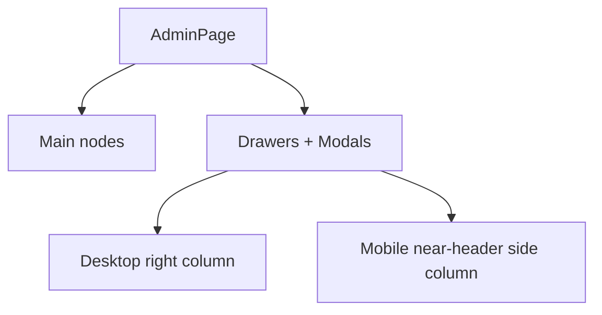
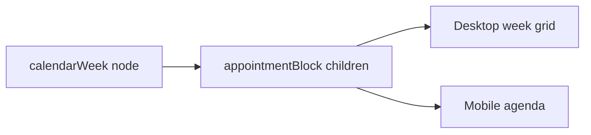

# Fringe Admin DSL and React Renderer Technique Deep Dive

This report explains the Admin DSL and React renderer technique developed in the Fringe hair booking project. The focus is not the salon domain itself. The focus is the engineering pattern: how to represent backend-admin screens as plain JSON, how to author those screens with a fluent TypeScript API, how to interpret the JSON into React components, how to keep desktop and mobile layouts reviewable, and how to test the result without committing to one application's database schema.

The repository is:

```text
/home/manuel/workspaces/2026-04-21/hair-v2/hair-booking
```

The primary implementation lives in:

```text
web/src/admin-dsl/
```

> [!summary]
> The Admin DSL is a JSON-emitting UI language for backend-admin screens. Authors use ergonomic builders such as `admin.page`, `resource.row`, `field.text`, and `action.open`, but the output is plain JSON.
>
> React does not receive arbitrary JSX from the backend. It receives a page tree. The renderer is an interpreter that switches on `node.kind`, extracts JSON props, and renders known components or layout structures.
>
> Storybook is the proving ground. The project now includes broad desktop/mobile layout catalog stories for commerce, education, CMS, support, media, operations, team settings, and salon administration.
>
> The important next evolution is semantic: richer action metadata, formal surfaces, lifecycle-aware forms, adaptive desktop/mobile views, and resource-page semantics that stay generic enough for application-owned database schemas.

## 1. Why a UI DSL exists here

A React admin screen can be written directly as JSX. That is usually the fastest approach for one screen. The problem appears when the same application wants backend-authored pages, inspectable JSON contracts, durable layout examples, stable Storybook fixtures, mobile/desktop visual review, and action dispatch that can later be connected to a Goja runtime or backend API.

JSX is executable UI code. It is not a transport format. It cannot be safely generated by a backend without turning the browser into a code execution target. JSON is a transport format, but JSON cannot contain functions, React elements, or closures. The DSL resolves this difference by separating **authoring**, **transport**, and **rendering**.

The author writes a page with fluent helpers:

```ts
resource.page("services", "Services & pricing")
  .shell("resource", { active: "services" })
  .toolbar(action.open("editService", "Add service"))
  .content(
    admin.section("Service menu", {},
      resource.list("services", {},
        resource.row("cut", { title: "Cut", subtitle: "60 min · $80+" })
          .actions(action.open("editService", "Edit")),
      ),
    ),
  )
  .toJSON();
```

The renderer receives plain JSON:

```json
{
  "schemaVersion": 1,
  "id": "admin-services",
  "title": "Services & pricing",
  "shell": { "kind": "resource", "props": { "active": "services" } },
  "nodes": [
    {
      "kind": "toolbar",
      "props": {
        "actions": [
          { "type": "open", "target": "editService", "label": "Add service" }
        ]
      }
    }
  ]
}
```

The React renderer interprets that JSON. It does not evaluate it as code. This is the central technique.

## 2. The lineage: from intake pages to backend admin pages

The Admin DSL did not start from nothing. It builds on the earlier page DSL work in HAIR-032 through HAIR-034.

The original page DSL files are:

```text
web/src/page-dsl/schema.ts
web/src/page-dsl/builder.ts
web/src/page-dsl/render.tsx
web/src/page-dsl/BackendDslPage.tsx
```

That system established the core rules:

- A page is a JSON object with `schemaVersion`, `id`, `title`, `shell`, and `nodes`.
- A node is a JSON object with `kind`, `props`, `children`, and `meta`.
- The renderer is an interpreter over `kind`.
- Local actions and backend actions are represented as data, not functions.
- Backend-driven flows receive action events and return new page states.

The Admin DSL keeps those rules but changes the vocabulary. Intake pages need selections, upload tiles, progress bars, and focused step shells. Admin pages need resource lists, dashboards, settings forms, search, filters, overlays, drawers, activity feeds, media grids, calendar views, and layout policies.

The current Admin DSL files are:

```text
web/src/admin-dsl/schema.ts
web/src/admin-dsl/builder.ts
web/src/admin-dsl/render.tsx
web/src/admin-dsl/calendar.tsx
web/src/admin-dsl/examples.ts
web/src/admin-dsl/layoutExamples.ts
web/src/admin-dsl/AdminDsl.stories.tsx
web/src/admin-dsl/AdminDslLayouts.stories.tsx
web/src/admin-dsl/AdminDsl.test.tsx
```

The implementation is frontend-first, but it is shaped so that backend-driven pages can adopt it later.

## 3. The core data model

The data model is intentionally small. The contract is in `web/src/admin-dsl/schema.ts`.

A page has the following shape:

```ts
export interface AdminPage {
  schemaVersion: 1;
  id: string;
  title: string;
  description?: string;
  shell: {
    kind: AdminShellKind;
    props?: AdminJsonObject;
  };
  nodes: AdminNode[];
  modals?: AdminNode[];
  drawers?: AdminNode[];
  meta?: {
    storyTitle?: string;
    tags?: string[];
    source?: string;
    notes?: string[];
  };
}
```

A node has the following shape:

```ts
export interface AdminNode<P extends AdminJsonObject = AdminJsonObject> {
  kind: AdminNodeKind;
  props?: P;
  children?: AdminNode[];
  meta?: {
    id?: string;
    name?: string;
    region?: "main" | "side" | "toolbar" | "modal" | "drawer";
    dataComponent?: string;
    dataSection?: string;
    dataPart?: string;
    note?: string;
  };
}
```

The JSON value type is explicit:

```ts
export type AdminJsonPrimitive = string | number | boolean | null;
export type AdminJsonValue =
  | AdminJsonPrimitive
  | AdminJsonValue[]
  | { [key: string]: AdminJsonValue };
export type AdminJsonObject = { [key: string]: AdminJsonValue };
```

This is a strict boundary. If a value is not JSON-compatible, it should not enter the page tree. That rule makes the DSL suitable for Storybook fixtures, backend transport, protobuf mapping, screenshot workflows, and deterministic tests.

## 4. The authoring API

The authoring API lives in `web/src/admin-dsl/builder.ts`. It exports namespaces rather than one large class:

```ts
import { admin, resource, field, view, action, query } from "./builder";
```

Each namespace describes a conceptual part of admin UI:

| Namespace | Purpose |
| --- | --- |
| `admin` | Page shells, sections, panels, metrics, forms, modals, drawers, dashboard widgets, calendars. |
| `resource` | Resource pages, resource lists, rows, and details. |
| `field` | Form/display fields such as text, textarea, money, duration, select, switch, image. |
| `view` | View descriptors such as list or calendar modes. |
| `action` | UI/backend event references such as open, mutation, confirm, refresh, upload. |
| `query` | Query references such as `services.list` or `appointments.range`. |

The builder API is allowed to use fluent methods and TypeScript conveniences, but `toJSON()` must return plain data. The internal helper is deliberately simple:

```ts
function clone<T>(value: T): T {
  return JSON.parse(JSON.stringify(value));
}
```

This clone operation is not a performance optimization. It is a contract check. If a builder accidentally stores a function, symbol, class instance, or other non-JSON value, that value will not survive JSON serialization. The tests also assert JSON round-tripping.

## 5. The renderer as an interpreter

The renderer lives in `web/src/admin-dsl/render.tsx`. It contains a function with this shape:

```ts
export function renderAdminNode(
  node: AdminNode,
  ctx?: AdminRenderContext,
  key?: Key,
): ReactNode {
  const props = node.props || {};
  const common = dataAttrs(node);

  switch (node.kind) {
    case "toolbar":
      return ...;
    case "section":
      return ...;
    case "resourceRow":
      return ...;
    case "calendarWeek":
      return <AdminCalendarWeek node={node} context={ctx} attrs={common} />;
    default:
      return <pre>{JSON.stringify(node, null, 2)}</pre>;
  }
}
```

This switch statement is a deliberate design. It is more verbose than dynamic component lookup, but it has important properties:

- every supported node kind is visible in code;
- unknown nodes render as inspectable JSON rather than failing silently;
- prop extraction is explicit;
- action dispatch is centralized;
- the renderer can enforce accessibility and responsive policies;
- a backend cannot cause arbitrary React components to load by naming them in JSON.

The renderer converts JSON into React. It does not execute the page as code.

## 6. Actions: data instead of callbacks

React components usually receive callbacks:

```tsx
<Button onClick={() => saveService(service)} />
```

A JSON DSL cannot do that. It needs an action descriptor:

```json
{
  "type": "mutation",
  "target": "services.save",
  "label": "Save service",
  "payload": { "id": "color" }
}
```

The current action type is:

```ts
export type AdminActionRef = AdminJsonObject & {
  type: "open" | "close" | "navigate" | "mutation" | "confirm" | "refresh" | "upload";
  target: string;
  label?: string;
  payload?: AdminJsonValue;
  options?: AdminJsonObject;
};
```

The renderer receives a context:

```ts
export interface AdminRenderContext {
  dispatch?: AdminRenderDispatch;
  overrides?: Record<string, ReactNode>;
}
```

When a button is clicked, the renderer dispatches a structured event:

```ts
void ctx.dispatch({
  nodeId: node.meta?.id || str(node.props, "id", ""),
  nodeKind: node.kind,
  action: actionRef,
  value,
  meta,
});
```

This is the same fundamental technique used by the backend-driven intake DSL: the browser reports an event; the backend or story context decides what the event means.

The implementation currently supports two action shapes:

```ts
.actions(action.open(...), action.confirm(...))
```

which emits an array, and:

```ts
.action("open", action.open(...))
```

which emits a keyed action map. The calendar extraction exposed this distinction because calendar blocks were using keyed action maps. The action extractor now accepts both.

## 7. Surfaces: modals, drawers, and static review state

The Admin DSL currently supports `modal`, `drawer`, and `confirmDialog` node kinds. They render as static panels in Storybook so visual review can see them without interaction state.

This is useful for layout exploration, but it is not the final interactive model. Real overlays need:

- presentation mode: right drawer, bottom sheet, centered modal, full-screen mobile sheet;
- open/closed state;
- close affordance;
- focus trap;
- scroll lock;
- backdrop;
- safe-area-aware sticky footer;
- relationship to selected row or resource.

The current implementation uses a pragmatic compromise. On desktop, side nodes render in a right column. On mobile, the renderer duplicates side nodes into a mobile side column near the top of the page and hides the desktop side column with CSS. This makes static Storybook review useful: a selected detail or edit panel appears near the header rather than after a long list.



This is not a complete overlay system, but it is a good intermediate state for static layout catalog stories.

## 8. Resource rows and action density

The broad layout catalog exposed a specific mobile problem. Generic action rendering made row buttons too large. A resource row with `Open` and `Refund` became a tall card with full-width buttons. That was acceptable for a modal footer but bad for a high-volume queue.

The current fix is scoped CSS:

```css
.adminDslResourceRow .adminDslActions {
  display: grid;
  grid-template-columns: repeat(auto-fit, minmax(112px, 1fr));
  width: 100%;
}

.adminDslResourceRow .adminDslActionButton {
  min-height: 40px;
  padding-block: 8px;
}
```

This is a renderer-level policy: row actions are denser than save-bar actions. The next DSL evolution should make this semantic rather than only CSS. An action should be able to say:

```ts
action.danger("order.refund", "Refund")
  .placement("overflow")
  .priority("secondary")
```

Then the renderer can move destructive row actions into overflow menus, detail sheets, or confirmation surfaces depending on viewport.

## 9. The calendar as the first adaptive widget

The calendar became the first widget that needed two different interaction models.

A desktop calendar can use a week grid because there is enough horizontal space. The user can scan day columns and time rows. A mobile calendar should not require nested horizontal scrolling. The final implementation renders both views and uses CSS to choose by viewport:

- desktop/tablet: week grid;
- mobile: day-grouped agenda.

The implementation lives in `web/src/admin-dsl/calendar.tsx`.

The desktop grid places appointments with CSS Grid:

```ts
style={{
  gridColumn: column,
  gridRow: `${row} / span ${span}`,
}}
```

The mobile agenda groups child nodes by `props.column`:

```ts
const groups = days.map((day, dayIndex) => ({
  day,
  nodes: nodes.filter((node) =>
    clamp(num(node.props, "column", 1), 1, days.length) === dayIndex + 1,
  ),
}));
```

The important lesson is that responsive UI is not always a matter of shrinking the same layout. Sometimes the correct mobile UI is a different view of the same data.



The DSL should eventually encode this as an adaptive view policy:

```ts
admin.calendarWeek("week", {
  responsive: {
    desktop: "weekGrid",
    mobile: "agenda",
  },
});
```

## 10. Storybook as a design laboratory

Storybook is not only a component catalog here. It is the development environment for the DSL.

The current story files are:

```text
web/src/admin-dsl/AdminDsl.stories.tsx
web/src/admin-dsl/AdminDslLayouts.stories.tsx
```

The first file contains the salon-oriented Admin DSL pages:

- Services & Pricing,
- Dashboard,
- Calendar,
- JSON contract.

The second file contains the broader layout catalog:

- Commerce Orders,
- Course Builder,
- CMS Publishing,
- Support Inbox,
- Media Library,
- Analytics Ops,
- Team Settings.

Each layout catalog page has desktop, mobile, and matrix variants. The desktop and mobile variants explicitly set Storybook viewport parameters to avoid sticky viewport state:

```ts
const desktopParameters = {
  viewport: { defaultViewport: "desktop1440" },
  globals: { viewport: { value: "desktop1440", isRotated: false } },
};

const mobileParameters = {
  viewport: { defaultViewport: "iPhone14" },
  globals: { viewport: { value: "iPhone14", isRotated: false } },
};
```

The matrix story shows mobile and desktop together in one frame. This is useful for manual review. For automated screenshots, the individual desktop/mobile stories are better because each has one stable viewport.

## 11. Screenshot-driven review

The project uses `css-visual-diff` to capture cropped screenshots of just the rendered DSL page or story root. This avoids Storybook chrome and browser whitespace.

A tracked script exists for the original Admin DSL mobile pages:

```text
ttmp/2026/05/15/HAIR-039--admin-design-system-and-dsl-for-one-stylist-salon-management/scripts/01-capture-mobile-admin-dsl.sh
```

The manual capture pattern is:

```bash
css-visual-diff compare \
  --url1 "http://127.0.0.1:6006/iframe.html?id=admin-dsl-rendered-pages--calendar&viewMode=story" \
  --selector1 '[data-admin-dsl-page]' \
  --url2 "http://127.0.0.1:6006/iframe.html?id=admin-dsl-rendered-pages--calendar&viewMode=story" \
  --selector2 '[data-admin-dsl-page]' \
  --viewport-w 390 \
  --viewport-h 844 \
  --wait-ms1 1000 \
  --wait-ms2 1000 \
  --threshold 0 \
  --out ".../mobile-calendar"
```

For the broader layout catalog, screenshots were captured in pairs and reviewed with an image analysis tool. This found practical issues that code review alone would not reliably catch:

- sticky iPhone viewport on desktop stories;
- oversized mobile headings;
- row actions making mobile cards too tall;
- redundant search labels;
- side panels too far below context;
- confusing metric typography.

The lesson is that a UI DSL needs visual tests as much as type tests. The JSON may be valid while the rendered layout is wrong.

## 12. Testing the DSL

The core tests live in:

```text
web/src/admin-dsl/AdminDsl.test.tsx
```

They cover three important properties.

First, builders emit plain JSON:

```ts
const page = admin.page("test-admin", "Test admin")
  .shell("admin", { active: "test" })
  .content(...)
  .toJSON();

expect(JSON.parse(JSON.stringify(page))).toEqual(page);
```

Second, rendered row actions dispatch structured events:

```ts
fireEvent.click(screen.getAllByRole("button", { name: "Edit" })[0]);

expect(dispatch).toHaveBeenCalledWith(expect.objectContaining({
  nodeKind: "resourceRow",
  action: expect.objectContaining({ type: "open", target: "editService" }),
}));
```

Third, the mobile calendar agenda structure is present and grouped:

```ts
const agenda = container.querySelector(".adminDslCalendarAgenda");

expect(agenda).toHaveTextContent("Mon");
expect(agenda).toHaveTextContent("Tue");
expect(agenda).toHaveTextContent("Lena Ortiz");
expect(agenda).toHaveTextContent("Personal errand");
```

The validation command is:

```bash
cd web && npx tsc --noEmit
cd web && pnpm test -- --runInBand
```

At the current checkpoint, the frontend suite passes:

```text
7 passed
29 passed
```

## 13. Technology involved

The technique combines several technologies, each with a narrow responsibility.

| Technology | Role |
| --- | --- |
| TypeScript | Defines the JSON contracts, builder APIs, and renderer prop extraction. |
| React | Renders interpreted page trees into actual UI. |
| Storybook | Provides a stable visual review environment for DSL examples and layout catalog pages. |
| Vitest + Testing Library | Tests JSON stability and renderer action dispatch. |
| css-visual-diff | Captures cropped screenshots for visual review and future regression workflows. |
| Goja runtime | Backend JavaScript runtime used by the existing backend-driven page DSL; future Admin DSL pages can use the same model. |
| Protobuf JSON | Current transport foundation for backend-driven DSL pages in the broader system. |
| docmgr | Ticket documentation, diaries, design guides, and file relations. |

The important engineering point is that the DSL technique does not depend on one backend schema. The frontend only needs a page tree. The backend application can decide how queries and mutations map to its own `configDb`, `stateDb`, or application database.

## 14. The boundary between platform and application

A major design decision is that the Admin DSL should not prescribe a database schema. Application builders own their config database schema and write semantics.

The generic platform should provide:

- page and node JSON contracts;
- action references;
- query references;
- renderer behavior;
- admin layout primitives;
- responsive/adaptive presentation policies;
- Storybook and test workflows.

The application should provide:

- data schema;
- query implementation;
- mutation implementation;
- authorization;
- validation;
- draft/publish semantics if the application needs them;
- domain-specific business rules.

This boundary keeps the DSL reusable. A commerce app, a course platform, a CMS, and a salon booking app can all use the same layout language while storing data differently.

## 15. What became tricky after building many screens

The layout catalog made several weak points clear.

### 15.1 Actions need more semantics

An action is not only a button. It has intent, placement, priority, danger level, confirmation requirements, and viewport-specific presentation. The current action model is adequate for prototypes but should evolve.

The next version should support metadata like:

```ts
action.mutation("order.refund", "Refund")
  .intent("danger")
  .priority("secondary")
  .placement("detail")
  .confirm({ title: "Refund order?" })
```

### 15.2 Overlays need a subsystem

Static `modal` and `drawer` nodes are enough for Storybook screenshots. Real admin apps need surfaces with presentation policies:

```ts
surface.drawer("orderDetail")
  .desktop("right")
  .mobile("sheet")
  .content(orderDetail)
```

This should eventually own focus, close behavior, safe areas, and sticky footers.

### 15.3 Forms need lifecycle semantics

Admin forms need dirty state, validation, errors, submit lifecycle, pending state, and cancel/reset behavior. Field nodes are not enough.

A future form API should look more like:

```ts
form.resource("serviceForm")
  .values(service)
  .fields(...)
  .validate("service.validate")
  .submit(action.primary("service.save", "Save"))
  .dirtyPolicy("stickyFooter")
```

### 15.4 Layout policies should be explicit

A split pane can collapse by stacking. A drawer can become a bottom sheet. A calendar can become an agenda. These choices are not only CSS; they are interaction policies. The DSL should expose them.

```ts
admin.splitPane({
  desktop: { columns: ["320px", "1fr"] },
  mobile: { mode: "stack", order: ["detail", "list"] },
})
```

## 16. Recommended implementation direction

The next engineering phase should not start with backend writes. It should strengthen the DSL internals.

The recommended sequence is:

1. Extract renderer utilities into `renderUtils.ts` and action handling into `actions.ts`.
2. Add richer action metadata while keeping current helpers working.
3. Add a `surface.*` builder namespace that initially emits the current modal/drawer/confirm nodes with better props.
4. Add Storybook stories specifically for row-action density and overlay presentation variants.
5. Formalize resource-page metadata without removing low-level composition.
6. Add lifecycle-aware form props and tests.
7. Add adaptive view policies for calendar, table/card, split-pane, and drawer/sheet behavior.

This order keeps the current working system intact while adding semantic structure where the implementation already feels pressure.

## 17. Why this technique matters

The Admin DSL technique is useful because it separates concerns without removing expressiveness.

React remains responsible for rendering real UI. TypeScript remains responsible for contracts and builder ergonomics. Storybook remains responsible for visual review. The backend remains responsible for data and business logic. JSON remains the boundary between authored page descriptions and rendered UI.

The DSL does not replace React. It uses React as the execution engine for a constrained UI language. That constraint is what makes backend-driven pages, screenshot review, stable test fixtures, and broad layout catalogs possible.

The most important discipline is to keep the DSL semantic enough that the renderer can adapt, but not so specific that every application is forced into the same design. The current implementation is a strong first version. The next version should encode more admin intent: actions, surfaces, resources, forms, and adaptive views.

## 18. Key file guide

Start here when studying the implementation:

| File | Why it matters |
| --- | --- |
| `web/src/admin-dsl/schema.ts` | Defines the JSON contract. |
| `web/src/admin-dsl/builder.ts` | Defines the fluent authoring API. |
| `web/src/admin-dsl/render.tsx` | Interprets most admin node kinds into React. |
| `web/src/admin-dsl/calendar.tsx` | Shows adaptive widget rendering: desktop grid and mobile agenda. |
| `web/src/admin-dsl/examples.ts` | Salon-oriented Admin DSL pages. |
| `web/src/admin-dsl/layoutExamples.ts` | Broad backend-admin layout catalog. |
| `web/src/admin-dsl/AdminDslLayouts.stories.tsx` | Desktop/mobile/matrix Storybook variants. |
| `web/src/admin-dsl/AdminDsl.test.tsx` | Tests JSON stability, action dispatch, and calendar agenda behavior. |
| `web/src/page-dsl/render.tsx` | Original page DSL renderer pattern. |
| `pkg/dslgoja/runtime.go` | Backend runtime model for page versions and action lifecycle. |
| `proto/fringe/dsl/v1/dsl.proto` | Protobuf transport context for backend-driven pages. |

## 19. Current status

The Admin DSL currently has:

- a working schema;
- fluent builders;
- a renderer;
- extracted calendar renderer;
- salon admin examples;
- broad layout catalog examples;
- desktop/mobile/matrix Storybook variants;
- devctl-managed Storybook profile;
- css-visual-diff screenshot artifacts;
- tests passing.

The system is ready for design review and for the next round of semantic refinement. It is not yet a complete backend-admin product framework, and it should not be treated as one. It is a working DSL technique with enough coverage to guide the next design step.

## 20. Related notes

- [[PROJECT REPORT - Fringe UI DSL Pattern Backend Frontend Walkthrough]]
- [[PROJECT REPORT - Fringe Go Host Modules Walkthrough]]
- [[PROJECT REPORT - Fringe Admin DSL Backend Driven Admin Interfaces Deep Dive]]

The first related note explains the backend-driven intake DSL pattern that inspired the Admin DSL. This report focuses on the Admin DSL and React renderer technique after the broader layout catalog work. The backend-driven Admin interfaces deep dive continues the story through the Goja Admin runtime, protobuf Admin DSL transport, `/admin/services`, `/admin/intake`, and the real persisted intake admin backend.
