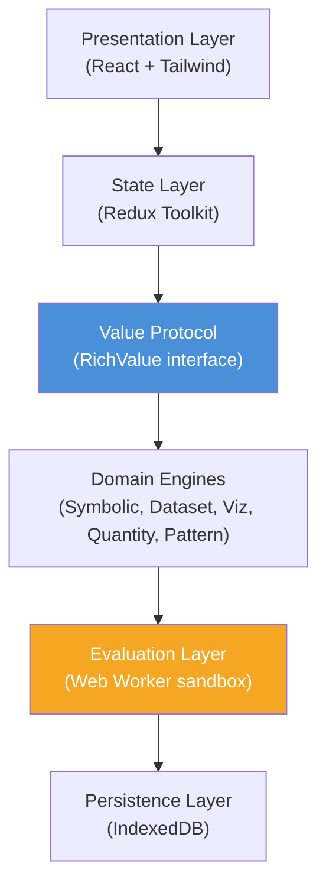

# Building a WolframJS REPL: Rich Object Representation in a JavaScript Notebook

This article documents the design and implementation of a browser-based JavaScript REPL where every evaluation result becomes a rich, inspectable, transformable object. The project is called **WolframJS REPL**, and it borrows its interaction model from Wolfram Mathematica's notebook interface — not its syntax, but its commitment to treating every output as a structured value that can be inspected from multiple perspectives, explained in natural language, and composed into subsequent computations.

The target audience is someone who wants to understand how to build a system where JS evaluation produces something richer than a string. The article explains the architecture from the protocol layer up, with enough detail to rebuild the system from scratch.

![[wolframjs-repl-article-1.png]]

> [!summary]
> - The central abstraction is a **RichValue protocol** — every result implements `summary()`, `views()`, `explain()`, and optional serialization methods. This separates evaluation from display.
> - A **Web Worker sandbox** evaluates user code and serializes results across the `postMessage` boundary. Specialized serializers handle every JS type: functions carry their source code, promises are auto-awaited, dates carry multiple time representations, errors carry their stack.
> - The **domain engines** (symbolic math, dataset, visualization, quantities, pattern matching) each implement RichValue independently. A `Dataset` knows how to render itself as a table, a schema, a summary, and a chart. A `SymbolicExpr` knows its pretty-printed form, its LaTeX, its full-form AST, and its tree structure.
> - The **React UI** renders inline values (numbers, strings, expressions) on a single line beside `Out[n]=`, and block values (tables, charts, interactive widgets) with the summary on the label line and the rich view below. View-switching tabs sit above the content so they do not jump when the user switches between representations.

---

## Why this project exists

A standard JavaScript REPL evaluates code and prints a string. The Node.js REPL prints `[1, 2, 3]` when you evaluate `[1, 2, 3].map(x => x + 1)`. The browser console does the same, with a small tree expander for objects. These are useful for debugging, but they are not useful for computation. You cannot ask the REPL to show you the same value as a chart. You cannot ask it to explain how a result was derived. You cannot ask it to convert the value into a different representation — SQL, LaTeX, JSON — without writing additional code yourself.

Wolfram Mathematica solved this problem forty years ago. In Mathematica, every output is a symbolic expression. You can display it in traditional mathematical notation, in full-form AST notation, as LaTeX, as a tree. You can reference previous outputs with `%` and `Out[n]`. You can explain them, simplify them, plot them, compose them. The REPL becomes a computational environment, not just a debugger.

The question this project answers: can you build the same kind of computational environment on top of JavaScript, without inventing a new language?

The answer is yes, provided you introduce a **value protocol** that separates what a result *is* from how it *displays*. JavaScript already has the runtime diversity — numbers, strings, dates, regexes, maps, sets, typed arrays, promises, errors, functions — but it has no protocol for rich display. So we define one.

![[wolframjs-repl-article-2.png]]

---

## The core mental model

The system has six layers. Data flows downward through evaluation and upward through display.



The **Presentation Layer** renders cells and their outputs. It knows nothing about how results are computed.

The **State Layer** manages which cells exist, their evaluation status, and their outputs. It coordinates the async evaluation lifecycle.

The **Value Protocol** defines the `RichValue` interface. This is the single most important design decision in the system. It creates a clean contract between evaluation and display: the evaluator produces `RichValue` objects, the renderer consumes them.

The **Domain Engines** implement `RichValue` for specific value types. Each engine is independently testable and extensible.

The **Evaluation Layer** runs user code in a Web Worker. It instruments the code, captures the result, wraps it as a `RichValue`, and serializes it back to the main thread.

The **Persistence Layer** stores notebooks in IndexedDB for save and reload.

The crucial observation: these layers are independent. You can replace the charting library without touching the evaluator. You can add a new domain engine without modifying the React components. You can swap the persistence layer from IndexedDB to a remote server without affecting how results are rendered. This independence comes from the value protocol sitting between the layers.

---

## The RichValue protocol

### The interface

```typescript
interface RichValue {
  readonly type: string;
  summary(): string;
  views(): View[];
  explain?(): string;
  toLatex?(): string;
  toJSON?(): unknown;
  toHTML?(): string;
  transform?(op: Operation): RichValue;
  fullForm?(): string;
  inputForm?(): string;
}

interface View {
  readonly viewType: string;
  readonly label: string;
  readonly data: unknown;
}

interface Operation {
  readonly name: string;
  readonly args?: unknown[];
}
```

Every method is optional except `type`, `summary`, and `views`. This means a minimal implementation — say, a wrapper for `null` — needs only to declare its type, produce a one-line summary, and list its available views. Richer types add more: `SymbolicExpr` provides `toLatex()` and `fullForm()`, `Dataset` provides `transform()` for chained operations, `Quantity` provides unit conversion through `transform({ name: "to", args: ["mph"] })`.

The `views()` method returns an array of `View` objects. Each view has a `viewType` string that maps to a React renderer component, a `label` for the tab button, and a `data` payload. When the user switches from the "Value" tab to the "JSON" tab, the `RichValueRenderer` looks up the renderer for `"json"` and passes it the view's `data`.

This design was chosen over a single `render()` method for two reasons. First, React renderers cannot cross the Web Worker boundary — the worker produces data, the main thread renders it. Splitting views into declarative data payloads makes serialization straightforward. Second, tab switching becomes cheap: the renderer just reads a different data payload from the pre-computed view list, no re-evaluation required.

### Why this protocol works

The protocol works because it sits at the boundary between two fundamentally different execution contexts. The Web Worker runs user code and produces results. The main thread renders those results and handles user interaction. These two contexts communicate only through `postMessage`, which uses structured clone for serialization. Functions, DOM nodes, and some other JS values cannot cross this boundary.

Rather than trying to make RichValue objects themselves cross the boundary (which would require complex proxying), the system **pre-computes everything on the worker side and serializes the results**. The `summary()` string, the `views()` array with its data payloads, the `explain()` text, the `toLatex()` string — all of these are computed in the worker and sent as plain data. The main thread receives a `SerializedRichValue` and reconstructs a `DeserializedRichValue` that implements the same `RichValue` interface, but backed by pre-computed data instead of live computation.

This is the same split that Mathematica uses internally. The kernel evaluates and produces boxes (structured display representations). The frontend renders those boxes. The kernel does not know about pixels; the frontend does not know about evaluation.

---

## The Web Worker evaluator

### Why a worker

User code runs in a Web Worker for three reasons. First, an infinite loop in user code must not freeze the UI. Second, the worker provides scope isolation — user code cannot accidentally modify the REPL's own state. Third, the worker can be terminated and restarted when code goes wrong.

### The evaluation pipeline

When the user evaluates a cell, the following sequence occurs:

1. The `Cell` component dispatches the `evaluateCode` async thunk to Redux.
2. The thunk sends a `{ type: "evaluate", id, code }` message to the Web Worker.
3. The worker preprocesses the code: it detects whether the last line is an expression or a statement, wraps it in a `new Function()` call with REPL globals injected as parameters, and evaluates it.
4. The result is wrapped as a `RichValue` using specialized serializers for each JS type.
5. The `RichValue` is serialized into a `SerializedRichValue` — a plain object with no functions.
6. The serialized value is posted back to the main thread.
7. The Redux thunk receives the response and updates the cell's state.
8. The `RichValueRenderer` reconstructs a `DeserializedRichValue` and renders it.

### Handling special types

The worker has specialized serializers for every JS type that cannot be trivially structured-cloned:

- **Functions**: `postMessage` cannot clone functions. The serializer captures the function's source code via `fn.toString()`, its name, and its declared parameter count. The main thread displays the source in a "Source" view tab and the parameter list in a "Parameters" tab.
- **Promises**: A pending promise cannot be cloned. The worker detects promise return values via `result instanceof Promise` and awaits them before responding. A resolving promise becomes its resolved value. A rejecting promise becomes an error.
- **Dates**: Serialized with ISO string, local string, Unix timestamp, UTC string, date-only, and time-only representations — six views that a Date object should always have available but that most debuggers never show.
- **RegExps**: Serialized with pattern, source, flags, and an explanation of what each flag does.
- **Maps and Sets**: Serialized as entry tables and value tables respectively, since their contents cannot be represented as plain JSON without conversion.
- **Errors**: Serialized with name, message, and stack trace.
- **TypedArrays**: Serialized as regular arrays with type and byte-length metadata.

### The globals injection

REPL globals — `dataset`, `expr`, `quantity`, `simplify`, `diff`, `manipulate`, and so on — are defined in a `createREPLGlobals()` function that the worker imports at startup. The evaluator injects these into the evaluation scope by passing them as parameters to `new Function()`:

```javascript
const fn = new Function(...globalNames, wrappedCode);
return fn(...globalValues);
```

This gives user code access to `dataset()` and `expr()` as unqualified names without polluting the global scope.

---

## Domain engines

### The symbolic expression engine

The symbolic engine wraps **math.js** as its CAS backend. math.js provides expression parsing (`math.parse()`), a node tree hierarchy (`OperatorNode`, `SymbolNode`, `ConstantNode`, `FunctionNode`, `ParenthesisNode`), and symbolic operations (`math.simplify()`, `math.derivative()`). Our `Expr` class wraps a `math.Node` tree and implements `RichValue`.

The user enters symbolic expressions through a tagged template literal:

```javascript
expr`x^2 + 2*x + 1`
```

The `expr` function preprocesses the input string to handle implicit multiplication (`2x` becomes `2*x`) and then passes it to `math.parse()`. The resulting node tree is wrapped in an `Expr` object that provides four views:

- **Math**: Unicode pretty-printed output using proper symbols — `x²`, `2·x`, `cos(x)`.
- **LaTeX**: The `math.Node.toTex()` output, rendered with KaTeX.
- **Full Form**: A Mathematica-style AST representation — `Plus[Power[x, 2], Times[2, x], 1]`.
- **Tree**: A recursive JSON structure for tree visualization.

Operations on expressions (`simplify`, `diff`, `factor`, `expand`, `solve`) return new `Expr` objects, preserving the chainability that makes the REPL feel like a computation system rather than a string printer.

The design choice of using math.js rather than building a CAS from scratch was deliberate. math.js has a mature expression parser, supports operator precedence and implicit multiplication, and its node tree is well-typed and traversable. It does not provide every operation Mathematica offers — definite integration, differential equations, and assumption-driven simplification are absent — but it covers the operations that matter for a first version: differentiation, simplification, evaluation, and expression manipulation.

### The dataset engine

The `Dataset` class provides a DataFrame-like API on top of plain JavaScript arrays. It stores data in a column-oriented layout for efficient aggregation and provides chainable operations that each return a new `Dataset`:

```javascript
dataset([{name: "Alice", age: 30}, {name: "Bob", age: 25}])
  .groupBy("name")
  .sum("age")
```

The `Dataset` implements `RichValue` with four views:

- **Table**: A sortable, scrollable HTML table. Column headers are clickable for sorting. Numeric columns are right-aligned with monospaced tabular figures. The table caps at 200 rows with a "Showing 200 of N rows" indicator.
- **Schema**: Column names, types, null counts, unique counts, and for numeric columns: min, max, and mean.
- **Summary**: A compact statistical overview.
- **JSON**: The raw data as formatted JSON.

The `Dataset` also provides visualization shortcuts (`barChart()`, `lineChart()`, `histogram()`, `scatter()`) that return `Plot` objects, and an `autoViz()` method that picks a reasonable chart based on the data's shape and column types. A single numeric column gets a histogram. Two numeric columns get a scatter plot. A categorical column gets a bar chart of value counts.

![[wolframjs-repl-article-3.png]]

### The visualization engine

Charts are specified declaratively using **Vega-Lite**. Each `Plot` object holds a Vega-Lite specification and a data array, and implements `RichValue` with two views: the rendered chart and the raw spec. The `ChartView` renderer on the main thread uses `vega-embed` to render the spec as SVG.

Vega-Lite was chosen over D3 because it is declarative. You describe what you want (a bar chart of revenue by country) and it determines how to render it. This maps directly to our model: each `Plot` is a Vega-Lite spec, and the renderer just hands it to `vega-embed`. The alternative — imperative D3 code — would require the worker to produce rendering instructions, not data, which breaks the separation between evaluation and display.

The chart styling is configured to match the REPL's design language: Inter for axis labels, transparent view background, no grid chrome. Charts render as SVG, which scales cleanly and allows DOM inspection.

### The interactive widget engine

The `manipulate()` function creates an `InteractiveWidget` that provides live slider controls. The design challenge: the render function is a JavaScript closure that cannot cross the `postMessage` boundary. The solution: capture the render function's source code via `.toString()` and send it as a string. The main thread's `InteractiveView` component reconstructs the function using `new Function()` and re-evaluates it whenever a slider moves.

```javascript
manipulate(
  { a: slider(-5, 5), b: slider(0, 10) },
  ({ a, b }) => a * a + b
)
```

The worker serializes this as `{ controls: {a: {...}, b: {...}}, renderSrc: "({ a, b }) => a * a + b", paramNames: ["a", "b"] }`. The main thread's `InteractiveView` parses the source string, extracts the destructured parameter names, and builds a function that takes a params object and evaluates the body. When the user drags a slider, React updates the `params` state, the `useMemo` hook re-evaluates the render function with the new params, and the result updates immediately.

![[wolframjs-repl-article-4-manipulate.png]]

### The quantity engine

The `Quantity` class pairs a numeric value with a unit string and provides arithmetic operations that track units through computation. Division produces derived units: `quantity(10, "km").div(quantity(45, "min"))` yields `0.2222 km/h`. The engine has a built-in conversion table covering SI base units, common imperial units, and derived compound units (km/h, m/s, mph). Unit conversion works by decomposing each unit to its SI base, computing the conversion factor, and reconstructing the target unit.

---

## The type system — what the REPL understands

Every value that the worker produces is wrapped by a specialized serializer. The serializers are not wrappers that delegate to a generic `JSValue` — each one produces a distinct `RichValue` with views appropriate to the type.

### Primitive types

| Input | RichValue type | Summary | Views |
|-------|---------------|---------|-------|
| `42` | Number | `42` | Value, Type, Hex, Binary, Octal, Scientific |
| `3.14` | Number | `3.14159` | Value, Type, Hex, Binary, Octal, Scientific |
| `"hello"` | String | `"hello"` | Value, Type, Length, Char Codes |
| `true` | Boolean | `true` | Value, Type |
| `null` | Null | `null` | Value |
| `undefined` | Undefined | `undefined` | Value |

Numbers carry more views than any other primitive because numeric representation is context-dependent. A user inspecting a bitmask needs hex and binary. A user checking a physical constant needs scientific notation. A user who typed `42` just wants to see `42`. The "Value" tab shows the straightforward representation; the other tabs provide context on demand.

### Object types

| Input | RichValue type | Summary | Views |
|-------|---------------|---------|-------|
| `[1,2,3]` | Array | `Array[3]` | Value, JSON, Type |
| `[10,20,30]` | Array | `Array[3]` | Value, JSON, **Statistics**, Type |
| `[{a:1}]` | Array | `Array[1]` | Value, JSON, **Table**, **Schema**, Type |
| `{name:"A"}` | Object | `Object{name}` | Value, JSON, **Properties**, Type |
| `function add()` | Function | `Function add(a, b)` | Source, Type, Parameters |
| `new Date(...)` | Date | local time string | ISO, Local, Unix, UTC, Date, Time, Type |
| `/^test$/gi` | RegExp | `/^test$/gi` | Pattern, Source, Flags, Type, Test |
| `new Map(...)` | Map | `Map[3 entries]` | Entries table, JSON, Type |
| `new Set(...)` | Set | `Set[5 values]` | Values table, JSON, Type |
| `new Error(...)` | Error | `Error: message` | Message, Stack, Type |
| `new Int32Array(...)` | TypedArray | `Int32Array[5]` | Values, JSON, Type |

Several design decisions are visible in this table. Arrays of numbers get a **Statistics** view showing count, sum, mean, median, min, max, and standard deviation — computed inline by the worker. Arrays of objects get **Table** and **Schema** views, treating them as informal datasets. Objects get a **Properties** view showing key, value, and type in a three-column table, which is far more useful than JSON when the object has many keys.

Dates deserve special attention. The worker produces six time representations — ISO 8601, locale-formatted, Unix timestamp, UTC, date-only, and time-only. This is not gratuitous; it reflects how people actually use dates. A timestamp is useful for debugging. A local string is useful for reading. A date-only view is useful when the time component is irrelevant. The REPL provides all of them because it can, and because doing so costs nothing at serialization time.

### Domain types

| Input | RichValue type | Summary | Views |
|-------|---------------|---------|-------|
| `dataset([...])` | Dataset | `Dataset[N rows × M cols]` | Table, Schema, Summary, JSON |
| `expr\`x^2+1\`` | SymbolicExpr | `x² + 1` | Math, LaTeX, Full Form, Tree |
| `quantity(10,"km")` | Quantity | `10 km` | Value, Unit Info |
| `manipulate(...)` | InteractiveWidget | `Manipulate[a, b]` | Interactive |
| `rule\`a_->b_\`` | Object | `Object{...}` | Value, JSON, Properties, Type |

Domain types are the ones that make the REPL feel like a computational environment rather than a debugger. A `Dataset` is not just a JavaScript array of objects — it is a structured table with column types, schemas, and visualization capabilities. A `SymbolicExpr` is not just a string — it is a tree structure with multiple representations. A `Quantity` is not just a number — it carries unit semantics through arithmetic.

---

## The React UI

### Cell-based notebook layout

The UI follows Mathematica's cell model. Each cell is an independent input-output pair. Cells are stacked vertically with generous padding. Input is labeled `In[n]:=` in monospace at the left margin. Output is labeled `Out[n]=` on the same line for inline values, or above the view for block values.

The cell is the fundamental unit. It is created empty when the user presses the "New Cell" button or navigates past the last cell. Code is entered via a **CodeMirror 6** editor with JavaScript syntax highlighting. Evaluation is triggered by Shift+Enter (single-line) or Ctrl+Enter. A "Run" button appears on hover for accessibility.

### Inline versus block layout

This is a subtle but important design decision. In Mathematica, simple values appear inline:

```
In[1]:= 42
Out[1]= 42
```

Not:

```
In[1]:= 42
Out[1]= 42
        42     ← redundant
```

The REPL distinguishes between **inline view types** (`text`, `math`, `latex`) and **block view types** (`table`, `chart`, `interactive`, `schema`, `properties`). Inline views render on the same line as `Out[n]=`. Block views render the summary on the `Out[n]=` line and the rich content below.

This means switching from the "Value" tab to the "JSON" tab on a number causes a layout change — the inline value is replaced by a block JSON view. Switching back collapses it. This is intentional: it mirrors how Mathematica handles the transition from `Out[n]= 42` to a full-form display that requires vertical space. The view-switching tabs sit **above the content**, not below it, so they do not jump when the user switches between representations.

### View switching

When a `RichValue` has multiple views, a row of small tab buttons appears above the output content. The active tab is highlighted with the accent color. Switching tabs is instant — the renderer just reads a different view's data payload from the pre-computed array.

The tab buttons use `font-mono` at `text-xs` size. They are intentionally understated. The output is the content, not the chrome. The tabs exist to provide access to additional perspectives, not to dominate the visual hierarchy.

### The CodeMirror integration

CodeMirror 6 is used for code input. It provides JavaScript syntax highlighting, bracket matching, close-brackets, and line numbers. The theme is minimal: transparent background, thin caret, no visible borders. The font is JetBrains Mono at 14px. The editor expands to fit the code. Line wrapping is enabled.

A `useRef` guard prevents React StrictMode's double-`useEffect` from creating duplicate cells on startup. A `code` prop syncs external code changes (from Redux) into the editor, so that programmatically-evaluated code appears in the input field.

---

## The serialization boundary

The most technically challenging part of the system is the boundary between the Web Worker and the main thread. `postMessage` uses the structured clone algorithm, which cannot handle functions, Promises, DOM nodes, Symbols, or objects with circular references. Every value that the worker produces must be reduced to a plain, clonable structure before it can be sent to the main thread.

The worker handles this with a dispatch table. For each recognized type — number, string, boolean, null, undefined, array, object, function, Date, RegExp, Map, Set, Error, TypedArray, ArrayBuffer, Promise — a dedicated serializer converts the value into a `SerializedRichValue` containing only strings, numbers, booleans, arrays, and plain objects.

The serializer for functions captures the source code, name, and parameter count. The serializer for Dates captures six time representations. The serializer for Errors captures the name, message, and stack. The serializer for Maps converts entries to a table structure. Every serializer produces a `type` discriminator, a `summary` string, an array of `views` with their data payloads, and a `raw` fallback for rehydration.

The main thread receives these `SerializedRichValue` objects and wraps them in `DeserializedRichValue`, which implements the same `RichValue` interface backed by the pre-computed data. The React renderers consume `DeserializedRichValue` through the same interface they would use for a live `RichValue`. The rendering layer never knows whether the data came from a live computation or a deserialized payload.

---

## Project structure

```
wolframjs-repl/
├── index.html
├── vite.config.ts
├── tailwind.config.ts
├── tsconfig.json
├── package.json
│
├── packages/
│   ├── core/          # RichValue protocol, JSValue, serialization
│   ├── eval/          # Web Worker, evaluator, REPL globals
│   ├── dataset/       # Dataset class, GroupedDataset, csv(), json()
│   ├── viz/           # Plot, InteractiveWidget, StreamWatch
│   ├── symbolic/      # Expr, expr``, math.js bridge
│   ├── pattern/       # Rule, rule``, rewrite()
│   ├── quantity/      # Quantity, unit conversion
│   ├── persistence/   # IndexedDB notebook storage
│   └── ui/            # React, Redux, Tailwind, CodeMirror
│       ├── src/store/          # Redux slices, RTK Query
│       ├── src/components/    # Notebook, Cell, RichValueRenderer
│       ├── src/renderers/     # TextView, JsonView, TableView, ChartView...
│       └── src/styles/        # Tailwind globals, theme tokens
│
└── public/fonts/     # STIX Two Math, JetBrains Mono
```

The project uses a monorepo layout with path aliases (`@core`, `@eval`, `@dataset`, etc.) resolved by Vite's `resolve.alias` configuration. TypeScript compiles cleanly across all packages. The production build produces a single bundle (currently 1.7 MB, pending code-splitting).

---

## Implementation sequence

The system was built in six phases, each producing a working increment:

**Phase 1 — Foundation.** Project scaffold, RichValue protocol, Web Worker evaluator, core React UI (Notebook, Cell, CodeMirror input, output display), Redux state management.

**Phase 2 — Dataset Engine.** `Dataset` class with chainable operations, `TableView` and `SchemaView` renderers, CSV and JSON loading.

**Phase 3 — Visualization.** Vega-Lite integration, `ChartView` renderer, auto-visualization, `manipulate()` (initially non-functional across the worker boundary).

**Phase 4 — Symbolic Math.** math.js integration, `expr` tagged template, `Expr` class with Math/LaTeX/Full Form/Tree views, `simplify`, `diff`, `factor`, `expand`, `solve`.

**Phase 5 — Pattern Matching and Quantities.** `Rule` type and `rule` tagged template, rewrite engine, `Quantity` class with unit arithmetic and SI/imperial conversion.

**Phase 6 — Polish.** IndexedDB persistence, interactive widget rendering, keyboard shortcuts, specialized serializers for every JS type, inline vs block layout, view tabs above content.

Each phase was committed separately, producing a clean git history that documents the construction sequence.

---

## What we learned

### The value protocol is the architecture

The single most important design decision was defining `RichValue` as an interface with `summary()`, `views()`, and optional extensions. Every domain engine, every renderer, and the serialization layer all orbit this protocol. The protocol creates the boundaries between layers. Without it, the system would be a monolith where the evaluator knows about React and the renderer knows about math.js. With it, each layer can be developed, tested, and replaced independently.

### Serialization drives design

The Web Worker boundary forced a discipline that improved the design. Because functions cannot cross `postMessage`, the worker must pre-compute everything — summaries, view data, explanations, LaTeX strings. This means every `RichValue` is self-describing at serialization time. The main thread never needs to ask the worker for more information; it has everything it needs to render. This is a stronger guarantee than most debugging systems provide, and it produces a better user experience because rendering is instantaneous — there is no round-trip to the worker for each tab switch.

### Not every type is a RichValue class

The initial design had every JS type as a separate class implementing `RichValue`. This was clean in theory but impractical in practice — there are too many JS types, and some (like `Proxy` or `WeakMap`) cannot be meaningfully serialized. The final design uses a dispatch table in the worker: a `wrapAndSerialize()` function that pattern-matches on `typeof`, `instanceof`, and constructor names to select the right serializer. This is less elegant than a class hierarchy but more honest about what the system actually supports.

### Inline versus block layout matters for perception

The difference between showing `Out[1]= 42` on one line and showing `Out[1]= 42` followed by a separate block with `42` in it is small in pixels but large in perception. The inline layout says "this value is simple." The block layout says "this value has structure." Getting this wrong — showing a number as a block — makes the REPL feel heavy. Getting it right makes it feel precise.

---

## Open questions

- **Code splitting.** The production bundle is 1.7 MB. Vega-Lite, KaTeX, and math.js account for most of this. Lazy-loading these per cell output would reduce initial load time.
- **Tree-level pattern matching.** The pattern engine currently works at the string level. Full tree-level pattern matching — matching subexpressions within an `Expr` tree and binding pattern variables — requires a recursive matching algorithm against the math.js node tree.
- **Dataset explain and toSQL.** The `Dataset` class tracks operations internally, but it does not yet produce explanations or SQL queries. This requires maintaining an operation log that records each `filter`, `groupBy`, and `sort` call.
- **Interactive widget extensibility.** The `manipulate()` function captures render functions as source strings. This works for simple expressions but breaks for closures that capture variables from the surrounding scope. A declarative spec approach — where the user describes the computation declaratively and the REPL evaluates it — would be more robust.
- **Dark mode.** The Tailwind theme defines dark mode tokens but there is no toggle in the UI yet.

---

## Working rules

- Every evaluation result implements the `RichValue` protocol. There are no special cases that bypass it.
- The Web Worker is the sole execution context for user code. The main thread never evaluates user code.
- Serialization happens at the worker boundary. All view data is pre-computed before `postMessage`.
- View tabs sit above content, always. Tabs that jump when switching views are a bug.
- Simple values render inline. Complex values render as summary + block.
- Math expressions use the serif font. Everything else uses monospace.
- One cell on startup, created via a `useRef` guard against StrictMode double-fire.

---

## Related notes

- Source vision document: `/tmp/repl.md`
- Design document: `/home/manuel/code/wesen/2026-05-16--js-repl-wolfram/ttmp/2026/05/16/JSREPL-001--js-repl-with-rich-object-representation-wolfram-style/design-doc/01-architecture-and-implementation-guide.md`
- Ticket workspace: `JSREPL-001` in the project's `ttmp/` directory
