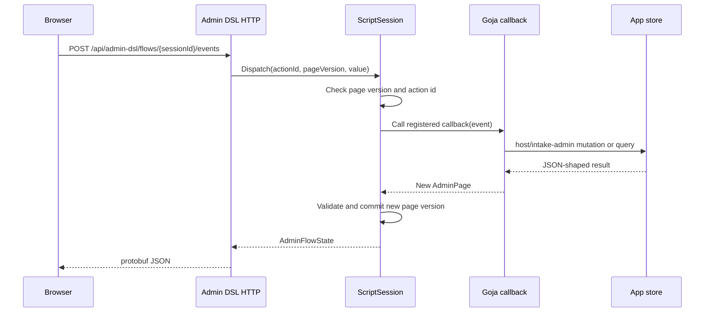

# Fringe Admin DSL Backend Driven Admin Interfaces Deep Dive

This report explains the Admin DSL work in the Fringe hair booking project after the transition from static Storybook fixtures to a backend-driven, Goja-executed, protobuf-transported admin runtime. The subject is the engineering technique: how to define admin interfaces as data, how to execute admin behavior on the backend, how to persist domain state separately from UI runtime state, and how to grow a reusable Admin DSL without turning it into an application-specific framework.

The repository is:

```text
/home/manuel/workspaces/2026-04-21/hair-v2/hair-booking
```

The current implementation spans frontend, backend, runtime, persistence, and documentation:

```text
web/src/admin-dsl/
pkg/admindsl/
pkg/server/handlers_admin_dsl.go
pkg/server/host_intake_admin_module.go
pkg/intakeadmin/
proto/fringe/admin_dsl/v1/admin_dsl.proto
```

> [!summary]
> The Admin DSL represents admin screens as plain JSON trees. Builders make authoring ergonomic, but the transport format remains data.
>
> The renderer is an explicit interpreter. React receives `AdminPage` objects and switches on `node.kind`; it does not evaluate backend code or dynamically instantiate arbitrary components.
>
> The backend runtime uses Goja to execute application-authored admin flows. The browser sends opaque action ids and receives a new page state; the browser never receives callback functions.
>
> The real intake admin backend validates the design under pressure: submitted customer intake requests are written to disk, `/admin/intake` reads persistent data, and new DSL primitives were added only when real screens required them.

## 1. Why the Admin DSL exists

A backend-admin application has two different responsibilities that are often mixed together. It must present interface structure to the user, and it must perform domain mutations against application data. If those responsibilities are written directly as React screens, the result is usually fast to start but difficult to move across the backend/frontend boundary. If they are moved entirely to the backend, the browser can become a remote code execution target or a collection of one-off endpoints that are hard to test as coherent pages.

The Admin DSL separates the responsibilities. The page is data. The renderer interprets that data. The backend owns action callbacks and domain writes. The application owns its schema. The generic Admin DSL owns UI semantics such as tables, forms, surfaces, resource rows, preview frames, action metadata, and responsive layout policy.

The central rule is simple and strict:

```text
Authoring may be fluent.
Transport must be JSON/protobuf data.
Rendering must be explicit interpretation.
Domain writes must stay app-owned.
```

This rule affects every implementation choice. A builder such as `admin.resourceTable(...)` may be convenient, but it must produce a serializable node. An action such as `request.open` may look like a button click, but the browser only sees an opaque action id. A request review screen may show domain data, but the generic renderer does not know what an intake request means.

The first Admin DSL work, HAIR-039, proved the frontend design system and renderer. HAIR-040 proved a Goja-backed route at `/admin/services`. HAIR-041 turned the pattern into a real backend foundation for the intake app.

## 2. The core model: pages, nodes, surfaces, and actions

The Admin DSL data model is intentionally small. A page contains shell metadata, top-level nodes, optional modal surfaces, optional drawer surfaces, and metadata. A node contains a `kind`, `props`, children, and metadata.

The frontend schema is in:

```text
web/src/admin-dsl/schema.ts
```

The Go schema is in:

```text
pkg/admindsl/types.go
```

The protobuf transport is in:

```text
proto/fringe/admin_dsl/v1/admin_dsl.proto
```

A simplified page looks like this:

```json
{
  "schemaVersion": 1,
  "id": "admin-intake-requests",
  "title": "Intake Requests",
  "shell": {
    "kind": "resource",
    "props": {
      "active": "requests",
      "eyebrow": "Real Admin · Intake"
    }
  },
  "nodes": [
    {
      "kind": "resourceTable",
      "props": {
        "id": "requests",
        "columns": [
          { "id": "status", "label": "Status" },
          { "id": "customer", "label": "Customer" }
        ],
        "rows": [
          { "id": "req_1", "status": "new", "customer": "Maya" }
        ],
        "actions": [
          { "id": "admin_act_...", "type": "open", "target": "request.open", "label": "Open" }
        ]
      }
    }
  ]
}
```

The renderer does not need to know what request `req_1` means. It knows how to render a `resourceTable`, how to render the columns and rows, and how to dispatch a row action with the selected row as the value. The backend flow knows what to do with that row id.

The action model is also data. An action includes semantic metadata:

```ts
export type AdminActionRef = {
  type: "open" | "close" | "navigate" | "mutation" | "confirm" | "refresh" | "upload";
  target: string;
  label?: string;
  intent?: "neutral" | "primary" | "danger";
  priority?: "primary" | "secondary" | "tertiary";
  presentation?: "button" | "icon" | "menuItem" | "overflow" | "link";
  placement?: "toolbar" | "row" | "footer" | "detail" | "overflow";
  id?: string;
  event?: string;
};
```

The browser-visible `id` is generated by the runtime. It is not a trusted command name. The backend maps that id to the callback that was registered during the current page render.

## 3. The renderer is an interpreter

The React renderer lives in:

```text
web/src/admin-dsl/render.tsx
```

The renderer switches on `node.kind` and renders known structures. This matters because the renderer remains inspectable. Adding a new node requires adding a renderer case, schema support, tests, and Storybook stories. There is no hidden mapping from backend strings to arbitrary React imports.

A simplified version of the rendering algorithm is:

```ts
function renderAdminNode(node, ctx) {
  switch (node.kind) {
    case "section":
      return <section>{renderChildren(node.children, ctx)}</section>;

    case "resourceTable":
      return renderResourceTable(node, ctx);

    case "imageGallery":
      return renderImageGallery(node, ctx);

    case "form":
      return renderForm(node, ctx);

    case "modal":
    case "drawer":
      return renderSurface(node, ctx);

    default:
      return <pre>{JSON.stringify(node, null, 2)}</pre>;
  }
}
```

This style has two important consequences.

First, unsupported UI is visible. If a backend flow emits an unknown node kind, the renderer shows a fallback instead of silently executing unknown code. In the Go runtime, validation usually catches invalid node kinds before the page reaches the browser.

Second, component growth is explicit. During HAIR-041, the real admin work needed denser tables, image review, availability editing, previews, and change summaries. Those needs became new semantic node kinds:

```text
resourceTable
imageGallery
editableList
monthAvailabilityGrid
previewFrame
diffView
```

Each was added to the schema, validator, Go builder, Goja module export, frontend schema, renderer, tests, and Storybook. This process slows down uncontrolled expansion. That is a feature of the approach.

## 4. Backend execution with Goja

The backend runtime lives in:

```text
pkg/admindsl/script_runtime.go
```

A Goja-authored admin flow exports `initialState` and `render`. The runtime creates a session, installs modules, calls `initialState`, and calls `render(ctx)`. During render, the flow calls `ctx.bind(actionBuilder, callback, event?)`. The runtime assigns an opaque id to the action and records the callback in the session.

A simplified session lifecycle is:

```mermaid
flowchart TD
  Start[POST /api/admin-dsl/flows/{flowId}/start]
  Registry[Look up flow definition]
  Runtime[Start Goja ScriptRuntime]
  Initial[Call initialState]
  Render[Call render(ctx)]
  Bind[ctx.bind registers callbacks]
  Page[Validate AdminPage]
  Proto[Convert to protobuf JSON]
  Browser[React AdminPageRenderer]

  Start --> Registry --> Runtime --> Initial --> Render --> Bind --> Page --> Proto --> Browser
```

The dispatch path is the inverse direction:



The page version check is important. If the browser dispatches an action from an old page, the session returns an informational effect instead of applying a stale mutation:

```go
if event.PageVersion != s.Version {
    return &FlowResult{
        SessionID: s.ID,
        PageVersion: s.Version,
        Page: s.page,
        Effects: []FlowEffect{{
            Kind: "toast",
            Tone: "info",
            Message: "This admin page was already updated.",
        }},
    }, nil
}
```

The pattern keeps callbacks on the backend. The browser receives a page tree and action ids. It does not receive executable callbacks.

## 5. The real intake admin backend

HAIR-041 changed the project from an admin UI demonstration to a persisted admin backend foundation. The customer intake flow is in:

```text
pkg/dslgoja/flows/intake.flow.js
```

The real admin route is:

```text
/admin/intake
```

The backend flow id is:

```text
fringe.admin.intake.v1
```

The flow source is:

```text
pkg/admindsl/flows/intake_admin.flow.js
```

The frontend route is wired in:

```text
web/src/App.tsx
web/src/admin-dsl/BackendAdminDslPage.tsx
```

The backend flow registry is in:

```text
pkg/server/handlers_admin_dsl.go
```

The registry currently serves both the original services demo and the real intake admin flow:

```go
flows: map[string]adminFlowDefinition{
    "fringe.admin.services.v1": {ID: "fringe.admin.services.v1", Source: admindsl.ServicesFlowSource},
    "fringe.admin.intake.v1":   {ID: "fringe.admin.intake.v1", Source: admindsl.IntakeAdminFlowSource},
}
```

The intake admin flow renders a dashboard, request queue, request detail screen, config version table, and preview stub. The request queue now uses `filterBar`, `searchBox`, and `resourceTable`. The request detail screen uses summary cards, image gallery, modal surfaces, and status actions.

A simplified flow excerpt shows the intended style:

```js
function requestTable(ctx, requests, emptyTitle) {
  const openRequest = ctx.bind(
    admin.open("request.open", "Open").Placement("row"),
    function(event) {
      ctx.state.selectedRequestId = event.value && event.value.id;
      ctx.state.screen = "requestDetail";
      return render(ctx);
    }
  );

  return admin.resourceTable("requests", {
    columns: [
      { id: "status", label: "Status" },
      { id: "customer", label: "Customer" },
      { id: "service", label: "Service" },
      { id: "estimate", label: "Estimate" },
      { id: "booking", label: "Booking" },
      { id: "photos", label: "Photos" }
    ],
    rows: requestRows(requests),
    emptyTitle: emptyTitle || "No intake requests"
  }).Actions(openRequest);
}
```

The table is generic. The application meaning appears in row data and callbacks.

## 6. Persistence is app-owned

The persistent admin domain package is:

```text
pkg/intakeadmin/
```

The schema is:

```text
pkg/intakeadmin/schema.sql
```

The store is:

```text
pkg/intakeadmin/store.go
```

The most important tables are:

```text
intake_requests
intake_request_events
admin_audit_events
admin_flow_sessions
```

`intake_requests` is the first domain table that connects the customer intake flow to the admin backend. The customer completes the intake flow, submits the confirm step, and the backend writes an intake request row. The admin backend reads those rows.

The design keeps this persistence outside `pkg/admindsl`. The Admin DSL package should not know what an intake request is. It should know how to render a table, a form, a gallery, a modal, a preview frame, and a diff view. The `pkg/intakeadmin` package knows how to create and update intake requests.

A simplified request creation path is:

```mermaid
flowchart TD
  Customer[Customer intake confirm step]
  Action[submitIntakeRequest action]
  Host[host/intake.createRequest]
  Store[pkg/intakeadmin.Store]
  DB[(State SQLite DB)]
  Admin[/admin/intake]

  Customer --> Action --> Host --> Store --> DB --> Admin
```

The customer flow now calls a narrow host module rather than writing SQL directly:

```js
function submitIntakeRequest(ctx) {
  const intake = require("host/intake");
  var request = intake.createRequest({
    sessionId: ctx.sessionId,
    configVersionId: configVersion(ctx),
    serviceCategory: ctx.state.category,
    serviceValue: ctx.state.service,
    tones: ctx.state.tones || [],
    damage: ctx.state.damage,
    photos: ctx.state.photos || {},
    budgetValue: ctx.state.budget,
    dayValue: ctx.state.day,
    timeValue: ctx.state.time,
    estimateLabel: estimateRange(ctx)
  });
  ctx.state.submittedRequestId = request.id;
  return request;
}
```

The host module is installed by the server. The DSL runtime accepts native module factories so app-owned modules can be registered per session:

```go
type NativeModuleFactory func(*FlowSession) NativeModuleLoader

type RuntimeHost struct {
    ConfigDB *sql.DB
    StateDB  *sql.DB
    BlobStore storage.BlobStore
    NativeModules map[string]NativeModuleFactory
}
```

The Admin DSL runtime has a similar extension point:

```go
func WithNativeModule(name string, loader NativeModuleLoader) ScriptRuntimeOption
```

The first admin modules are:

```text
host/intake-admin
host/intake-preview
```

`host/intake-admin` exposes queries and mutations for the admin flow:

```js
intakeAdmin.dashboardStats()
intakeAdmin.listRequests({ status: "new", limit: 50 })
intakeAdmin.getRequest(id)
intakeAdmin.updateRequestStatus(id, "reviewing", "Marked reviewing")
intakeAdmin.listConfigVersions()
intakeAdmin.createDraftFromActive("Admin draft")
```

The host module returns JSON-shaped values. This detail matters. Go structs use JSON tags such as `configVersionId`, but Goja struct export does not always produce exactly the camelCase shape expected by JavaScript flow code. The implementation round-trips through JSON before returning values to Goja:

```go
func gojaJSONValue(value any) any {
    payload, err := json.Marshal(value)
    if err != nil { return value }
    var out any
    if err := json.Unmarshal(payload, &out); err != nil { return value }
    return out
}
```

That small conversion makes the boundary predictable.

## 7. Component growth driven by real screens

The Admin DSL did not receive all possible widgets at the beginning. It received new primitives when real admin screens needed them.

During HAIR-041, the request queue needed denser layout than `resourceRow`, so `resourceTable` was added. Photo review needed a specific missing-blob state, so `imageGallery` was added. Config editing and publishing will need reorderable option lists, availability grids, preview frames, and diff summaries, so first-pass primitives were added for those as Phase 5 preparation.

The current Phase 5 primitives are:

| Primitive | Purpose | Current status |
| --- | --- | --- |
| `resourceTable` | Dense admin rows with columns, row actions, optional pagination and bulk action UI. | First pass implemented with tests and stories. |
| `imageGallery` | Intake photo tiles, stored/missing state, selected-image dispatch. | First pass implemented with modal use in request detail. |
| `editableList` | Service/tone/budget/time-slot ordering and row editing. | First pass visual/edit action support; drag-and-drop remains future work. |
| `monthAvailabilityGrid` | Config-level calendar day availability editing. | First pass day grid with disabled/dot/selected states. |
| `previewFrame` | Customer intake preview route or placeholder. | First pass iframe/placeholder frame. |
| `diffView` | Before/after change summaries for publish/conflict workflows. | First pass field-level summary. |
| actionable `tabs`/`filterBar`/`searchBox` | Backend-dispatched navigation and filtering controls. | First pass dispatch support. |

The rule is not to add app-specific widgets such as `HairRequestQueue`. The reusable primitive is `resourceTable`. The app-specific meaning is encoded in the data and callbacks.

## 8. Storybook as a contract surface

Storybook is not only a presentation tool in this project. It is a contract surface for the DSL. Every new node kind needs stories that show normal state, empty state, mobile behavior, and error state when relevant.

The new Storybook catalogs are:

```text
web/src/admin-dsl/AdminDslDataComponents.stories.tsx
web/src/admin-dsl/AdminDslAdvancedComponents.stories.tsx
```

`Admin DSL/Data Components` covers:

```text
RequestTableWithRowActions
RequestTableDenseDesktop
RequestTableMobileScroll
RequestTableEmptyState
ConfigVersionsTable
ImageGalleryStored
ImageGalleryMixedMissingBlob
ImageGalleryEmptyState
ImageGalleryModalMissingPhoto
ComposedRequestReview
ComposedRequestReviewMobile
```

`Admin DSL/Advanced Components` covers:

```text
ActionableControls
EditableList
EditableListDense
EditableListEmpty
MonthAvailabilityGrid
MonthAvailabilityReadOnly
MonthAvailabilityDense
PreviewFramePlaceholder
PreviewFrameIframe
PreviewFrameMobile
DiffViewPublish
DiffViewConflict
DiffViewEmpty
ResourceTablePaginationBulk
AdvancedMatrix
AdvancedMatrixMobile
```

This coverage serves several purposes.

First, it makes every new primitive reviewable without running the live backend. A reviewer can inspect `resourceTable` or `diffView` directly.

Second, it forces edge states into the design. Empty queues, missing photos, dense tables, mobile layouts, publish diffs, and conflict summaries are all fixtures, not only future intentions.

Third, it keeps the renderer honest. If a primitive cannot be described with a stable JSON fixture, its design is probably not ready.

## 9. Protobuf transport and plain JSON pages

The Admin DSL uses protobuf for the HTTP envelope while preserving dynamic node props as structured JSON values.

The proto file is:

```text
proto/fringe/admin_dsl/v1/admin_dsl.proto
```

The main envelope is:

```proto
message AdminFlowState {
  string session_id = 1;
  uint32 page_version = 2;
  AdminPage page = 3;
  repeated AdminEffect effects = 4;
}
```

`AdminPage`, `AdminNode`, and `AdminShell` are modeled explicitly, while `props` remains a `google.protobuf.Struct`:

```proto
message AdminNode {
  string kind = 1;
  google.protobuf.Struct props = 2;
  repeated AdminNode children = 3;
  AdminNodeMeta meta = 4;
}
```

This is a practical compromise. The top-level contract is stable and typed. Widget-specific props can evolve with the DSL. The runtime still validates node kinds and JSON-compatibility in Go before sending the page.

The frontend then converts protobuf JSON into plain TypeScript objects for the renderer:

```text
web/src/admin-dsl/backendClient.ts
web/src/admin-dsl/BackendAdminDslPage.tsx
```

The renderer remains independent of protobuf. It receives `AdminPage` objects.

## 10. The important invariants

The Admin DSL approach depends on a small set of invariants. These are more important than any single component.

- A page is data. The browser receives page structure, not executable backend code.
- A node kind is explicit. The renderer must know how to interpret each kind.
- An action id is opaque. The browser does not construct callback names or trusted mutation identifiers.
- A page version scopes actions. Stale browser actions return effects instead of mutating current state.
- Host modules are narrow. Goja flows call app-owned APIs such as `host/intake-admin`, not arbitrary generic write access.
- App schemas remain app-owned. The Admin DSL does not prescribe what an intake request, config version, or service option means.
- Storybook fixtures are part of the design. New node kinds need visual coverage across normal and edge states.
- Tests cover the boundary. Unit tests should exercise builder invariants, renderer dispatch, runtime dispatch, and HTTP flow behavior.

These invariants are what make the DSL maintainable. Without them, the system would become a set of stringly typed backend instructions and renderer special cases.

## 11. Current implementation status

The current implementation has completed the main HAIR-039 through HAIR-041 foundation.

Implemented:

- Admin DSL TypeScript schema, builders, renderer, tests, and Storybook catalogs.
- Admin DSL Go schema, builders, validation, Goja module, runtime, and protobuf conversion.
- Protobuf HTTP transport for Admin DSL flows.
- Real `/admin/services` Goja-backed route.
- Real `/admin/intake` route using `fringe.admin.intake.v1`.
- Persistent `pkg/intakeadmin` store and schema.
- Customer intake confirm step that creates durable `intake_requests` rows.
- Request dashboard, request queue, request detail, photo modal, status transitions, and config-version table.
- Phase 5 primitives and extensive Storybook coverage.

Validation commands used during the work:

```bash
go test ./... -count=1
cd web && npx tsc --noEmit
cd web && pnpm test -- --runInBand
```

At the most recent validation point, frontend tests passed:

```text
10 test files passed
46 tests passed
```

The recent HAIR-041 commit sequence is:

```text
b1909a2 HAIR-041 Step 1: Plan real intake admin backend
43bf4a3 HAIR-041 Step 2: Add intake admin store
741a155 HAIR-041 Step 3: Persist intake submissions
03af3fc HAIR-041 Step 4: Add intake admin flow registry
b107e2c HAIR-041 Step 5: Record validation and upload
0011a39 HAIR-041 Step 6: Add request review screens
e078ab9 HAIR-041 Step 7: Add photo review modal
5e30bed HAIR-041 Step 8: Add data component stories
cd4b276 HAIR-041 Step 9: Complete phase 5 components
```

## 12. What remains unfinished

The current system is a strong foundation, not a finished production admin backend.

The most important remaining backend items are:

- admin authentication and role guards for `/admin/intake`,
- upload ownership verification when creating intake requests,
- fully audited mutation wrappers for all admin writes,
- persisted Admin DSL sessions if long-running admin edits must survive process restart,
- idempotency for customer submit actions,
- config editing and publishing beyond the initial config version table,
- real service/tone/budget/price/availability editors,
- draft preview connected to the customer DSL runtime,
- richer publish validation and diff summaries,
- appointment creation from intake requests.

The most important DSL refinement items are:

- drag-and-drop or explicit reorder events for `editableList`,
- real selection state for `resourceTable` bulk actions,
- production-grade pagination events,
- field-level validation semantics across all form field types,
- stronger accessibility review for tables, filters, galleries, and modal flows,
- screenshot/visual regression automation for every new Storybook section.

These remaining items are not failures of the approach. They are the next points where the approach must become more precise.

## 13. Recommended implementation sequence from here

The next phase should use the Phase 5 primitives to build config editing and publishing. That work will test whether the new components are sufficient.

A good order is:

1. Build the service options editor using `resourceTable`, `editableList`, drawers, and form actions.
2. Build tone and budget editors using `editableList` and simple form drawers.
3. Build price range editor using `resourceTable`, money fields, validation errors, and `diffView`.
4. Build availability editor using `monthAvailabilityGrid` and time-slot `editableList`.
5. Build draft preview using `previewFrame` and a backend preview route.
6. Build publish validation using `diffView`, `confirmDialog`, and app-owned publish transactions.
7. Add Playwright or css-visual-diff coverage for dashboard, request queue, request detail, config editor, availability editor, preview, and publish failure states.

Each step should keep the same discipline:

```text
Add app-owned store method.
Expose it through a narrow host module.
Render it through generic Admin DSL primitives.
Add tests for the Go boundary.
Add renderer tests for event/value dispatch.
Add Storybook stories for visual and edge states.
```

## 14. The reusable principle

The reusable principle is not specific to hair booking. The important technique is to define a small, explicit UI language for a class of backend-owned screens, then keep strict boundaries around it.

The language should be expressive enough to describe real screens. It should not be a general-purpose programming language. The backend runtime should execute application behavior. The browser should render data and dispatch events. The application store should own domain writes. The renderer should interpret known nodes. The Storybook catalog should document and test the vocabulary.

That combination gives the project a path from static UI examples to backend-authored production workflows without giving up type checks, visual review, testability, or domain ownership.

The Admin DSL now has enough surface area to continue into configuration editing and publishing. The next work will show whether the primitives remain stable under deeper write workflows. If they do not, the remedy is to add or refine semantic primitives, not to bypass the DSL boundary.
