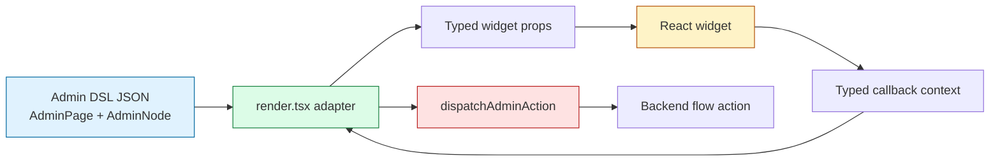
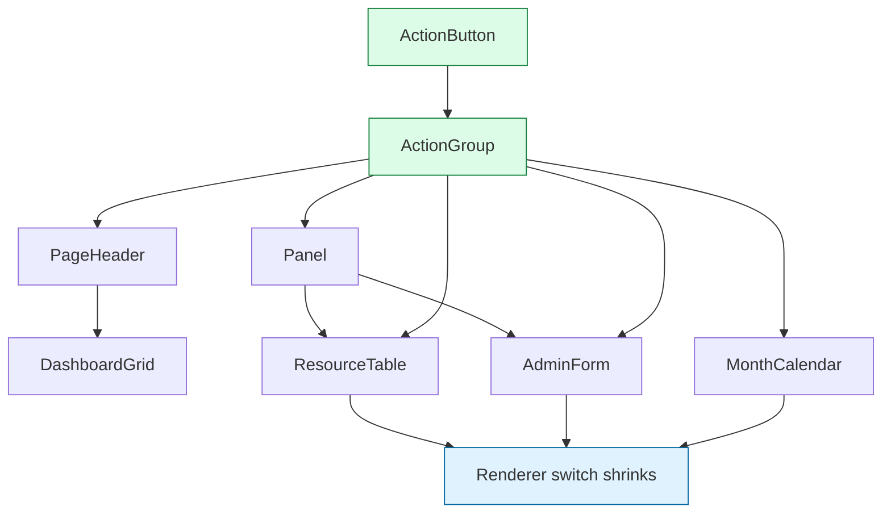

# Report: Bottom-Up Admin DSL Widget IR

🏷️ **compiler, ui-dsl** — first IR extracted from `render.tsx` to YAML, then used for code generation back into TypeScript and TSX.

This report explains the bottom-up exploration of an Admin DSL widget intermediate representation in the Fringe hair booking project. The work started from a live renderer that already knew how to display real admin screens, then extracted that knowledge into a structured Widget Definition IR, a code generator, generated React scaffolds, metadata sidecars, and the first real component extraction.

The important result is not a finished component library yet. The important result is a disciplined path from existing renderer behavior to typed, documented, implementation-ready widgets. The IR is not only a schema. It is a design artifact that records purpose, adapter boundaries, action contexts, Storybook scenarios, output files, implementation todos, and source mappings. That matters because the Admin DSL is backend-driven: the UI is rendered from JSON, while trusted behavior remains behind opaque backend-bound action IDs.

> [!summary]
> - The Widget Definition IR was built bottom-up from concrete renderer code, not top-down from an abstract UI language design.
> - The current durable unit is a schema-v2 YAML widget definition with structured props, action slots, examples, stories, outputs, and implementation todos.
> - The scaffold generator now reads schema-v2 YAML and emits TypeScript contracts, React scaffolds, Storybook stories, and metadata sidecars.
> - `WorkbenchShell` is the first proof that the generated boundary can become a real widget: its HTML and styling were extracted from `render.tsx`, while `render.tsx` became an adapter.

## Why this report exists

The Admin DSL work had already reached a functional v2 state before the widget IR exploration began. Backend Go and Goja flows emitted semantic admin pages. The frontend renderer displayed those pages through a controlled set of node kinds such as `pageHeader`, `dashboardGrid`, `panel`, `resourceTable`, `comparisonTable`, `monthCalendar`, `form`, and overlay surfaces. Storybook scenarios and Playwright screenshots provided visual evidence that the system worked.

That success exposed a structural problem. The renderer had become the place where too many meanings met. It parsed raw Admin DSL JSON, interpreted node kinds, rendered HTML, applied styling, handled responsive behavior, displayed action buttons, and lowered browser events back into backend action dispatch. The system was still explicit and controlled, but the implementation shape was too concentrated.

The bottom-up IR exploration asked a practical question: can we rebuild the renderer as a set of typed React widgets without losing the semantic Admin DSL boundary? The answer required a representation that could be read by humans and tools. A type-only schema was not enough because the hard part was not only the TypeScript shape of props. The hard part was knowing why a widget exists, what existing renderer code it replaces, which action contexts it owns, which Storybook scenarios prove it, and what must remain in the adapter.

## Starting point: a working semantic renderer

The starting frontend architecture had these main files:

```text
/home/manuel/workspaces/2026-04-21/hair-v2/hair-booking/web/src/admin-dsl/schema.ts
/home/manuel/workspaces/2026-04-21/hair-v2/hair-booking/web/src/admin-dsl/render.tsx
/home/manuel/workspaces/2026-04-21/hair-v2/hair-booking/web/src/admin-dsl/actions.ts
/home/manuel/workspaces/2026-04-21/hair-v2/hair-booking/web/src/admin-dsl/renderUtils.ts
/home/manuel/workspaces/2026-04-21/hair-v2/hair-booking/web/src/admin-dsl/calendar.tsx
/home/manuel/workspaces/2026-04-21/hair-v2/hair-booking/web/src/admin-dsl/AdminDslWorkbench.stories.tsx
```

The renderer accepted an `AdminPage`. Each page carried a shell, an ordered list of nodes, optional modals, and optional drawers. Each node had a `kind`, `props`, children, and metadata. The renderer switch interpreted the node kind and emitted React elements.

A simplified version of the old shape looked like this:

```tsx
export function renderAdminNode(node: AdminNode, ctx?: AdminRenderContext): ReactNode {
  switch (node.kind) {
    case "pageHeader":
      return <header>...</header>;
    case "panel":
      return <article>...</article>;
    case "resourceTable":
      return <table>...</table>;
    case "form":
      return <form>...</form>;
    default:
      return <pre>{JSON.stringify(node, null, 2)}</pre>;
  }
}
```

This code was useful because it encoded real decisions. A `resourceTable` was not just a generic table. It knew how row actions should be displayed, how bulk actions should be lowered, how mobile rows should become card-like blocks, how badge cells should look, and how pagination actions should appear. A `panel` knew about header actions and footer actions. The workbench shell knew about fixed sidebars, mobile topbars, user identity, and dense content spacing.

The renderer was therefore the best source of implementation facts. The IR work did not discard it. It treated the renderer as the current concrete implementation to be decomposed.

## The core design rule

The core design rule is:

> The widget receives typed props. The adapter reads Admin DSL JSON and dispatches Admin DSL actions.

This rule keeps the React widget library independent from the transport format and backend action execution. A widget such as `ResourceTable` should not know what an `AdminNode` is. It should receive typed props such as `columns`, `rows`, `bulkActions`, `rowActions`, and callbacks. When a row action is clicked, the widget emits a typed callback. The adapter turns that callback into `dispatchAdminAction`.

The boundary looks like this:



The backend trust boundary remains intact. The browser does not gain arbitrary backend execution authority. It only renders action metadata and sends opaque action IDs through the existing action dispatch path.

## From widget catalog to schema-v2 YAML

The first durable artifact was a prose widget catalog:

```text
ttmp/2026/05/15/HAIR-041--real-admin-backend-for-intake-app/design-doc/08-admin-dsl-react-widget-ir-catalog.md
```

That catalog studied the current renderer and grouped constructs into widget families:

| Family | Examples | Purpose |
|---|---|---|
| Shell | `WorkbenchShell`, `DefaultAdminShell` | Page-level frame, navigation, user identity, content region. |
| Actions | `ActionButton`, `ActionGroup`, `OverflowActionButton` | Consistent action display and callback contexts. |
| Layout | `PageHeader`, `DashboardGrid`, `Panel`, `Tabs`, `FilterBar`, `SearchBox` | Admin workbench structure and local controls. |
| Resource | `ResourceTable`, `ResourceTableCell`, `BulkActionBar`, `PaginationBar` | Dense data review, row actions, selection, and paging. |
| Display | `MetricCard`, `ComparisonTable`, `KeyValueList`, `ActivityFeed`, states | Read-only status, audit, and summary displays. |
| Media | `PreviewFrame`, `ImageGrid`, `ImageGallery` | Customer preview and photo review. |
| Calendar | `MonthCalendar`, `CalendarWeek`, `CalendarEventBlock` | Availability and appointment surfaces. |
| Forms | `AdminForm`, `FieldGroup`, `SaveBar` | Editing workflows and submit state. |
| Surfaces | `OverlaySurface`, `ConfirmDialog` | Modals, drawers, sheets, confirmations. |

The first YAML conversion captured this catalog in files under:

```text
ttmp/2026/05/15/HAIR-041--real-admin-backend-for-intake-app/sources/admin-dsl-widget-ir/
```

The first pass was useful but too close to the Markdown structure. It preserved TypeScript snippets and story lists, but it did not have a clean machine-readable contract. That led to schema v2.

The schema-v2 format is specified in:

```text
ttmp/2026/05/15/HAIR-041--real-admin-backend-for-intake-app/design-doc/09-widget-definition-ir-yaml-format-spec.md
```

A schema-v2 widget has this conceptual shape:

```yaml
schema_version: 2
artifact_type: admin_dsl_widget_definition_ir
category: shell_widgets
widgets:
  - id: admin.shell.workbench
    name: WorkbenchShell
    status: scaffolded
    classification: ...
    source_mapping: ...
    intent:
      purpose: ...
      design_rationale: ...
      adapter_boundary: ...
      implementation_notes: ...
      accessibility_notes: ...
    contract:
      props: ...
      action_slots: ...
    examples: ...
    stories: ...
    outputs: ...
    implementation_todos: ...
```

The major decision was to treat natural language as first-class IR data. Scripts can read `contract.props`, but humans and future LLM passes need `purpose`, `design_rationale`, `adapter_boundary`, story docs, examples, and todos. The IR is therefore both formal and explanatory.

## Why natural language belongs in the IR

A UI widget contract is not fully described by field names and TypeScript types. Consider a table row action. A field named `rowActions: ActionViewModel[]` says that actions exist. It does not say what context a row action receives, whether the widget may call backend dispatch directly, how bulk actions differ from row actions, or what Storybook scenario should prove the behavior.

The Widget IR stores that information explicitly:

```yaml
action_slots:
  rowActions:
    doc: Row actions receive table and row context.
    callback: onRowAction
    action_type: ActionViewModel
    cardinality: many
    context_type: RowActionsContext
    lowering:
      adapter: dispatchAdminAction
```

This text is not decoration. It prevents future implementation drift. A developer implementing `ResourceTable` can see that row actions and bulk actions are semantically different even if they both lower to the same runtime dispatch helper.

## The generator as a projection of the IR

The scaffold generator lives at:

```text
ttmp/2026/05/15/HAIR-041--real-admin-backend-for-intake-app/scripts/05-scaffold-admin-dsl-widgets.py
```

It originally consumed the older YAML shape. It was then rewritten to consume schema v2 directly. The generator now reads:

- `contract.props` to create TypeScript interfaces;
- `contract.action_slots` to preserve callback intent;
- `intent` to explain purpose and adapter boundaries;
- `examples` to keep usage examples close to code;
- `stories` to generate Storybook exports with docs, fixtures, and assertions;
- `outputs` to decide where files should be written.

The generator produces:

```text
<Widget>.types.ts
<Widget>.metadata.ts
<Widget>.tsx
<Widget>.stories.tsx
index.ts
```

The important addition was `<Widget>.metadata.ts`. When a generated scaffold becomes a hand-written component, the scaffold diagnostics should not disappear. The metadata sidecar preserves the full source context beside the implementation.

A generated component now has this intended structure:

```tsx
import { actionButtonWidgetMetadata } from "./ActionButton.metadata";
import type { ActionButtonProps } from "./ActionButton.types";

export function ActionButton(props: ActionButtonProps) {
  return (
    <button data-admin-dsl-widget-id={actionButtonWidgetMetadata.widgetId}>
      ...
    </button>
  );
}
```

The metadata can also feed docs, Storybook, validation, and future code review tooling.

## WorkbenchShell as the first extraction proof

`WorkbenchShell` was the first generated widget promoted into a real implementation. This was a good first candidate because it wraps already-rendered children. It does not require solving every node-kind rendering problem at once.

The relevant files are:

```text
web/src/admin-dsl/widgets/organisms/WorkbenchShell/WorkbenchShell.tsx
web/src/admin-dsl/widgets/organisms/WorkbenchShell/WorkbenchShell.types.ts
web/src/admin-dsl/widgets/organisms/WorkbenchShell/WorkbenchShell.metadata.ts
web/src/admin-dsl/render.tsx
```

Before extraction, `render.tsx` owned the workbench shell HTML directly. It parsed `page.shell.props.sidebar`, rendered the mobile topbar, rendered the fixed desktop sidebar, rendered sidebar actions, rendered the user footer, and rendered page nodes in the content region.

After extraction, the work is split:

| Responsibility | Owner after extraction |
|---|---|
| Parse `page.shell.props.sidebar` | `render.tsx` adapter |
| Convert sidebar JSON into typed `SidebarNavItem[]` | `render.tsx` adapter |
| Render page body nodes | `render.tsx` adapter via `renderAdminNode` |
| Render root workbench frame | `WorkbenchShell.tsx` |
| Render desktop sidebar and mobile topbar | `WorkbenchShell.tsx` |
| Render optional user footer | `WorkbenchShell.tsx` |
| Emit sidebar action callback | `WorkbenchShell.tsx` |
| Lower sidebar callback to backend action dispatch | `render.tsx` adapter |
| Preserve purpose/action-slot/source context | `WorkbenchShell.metadata.ts` |

The adapter now has this shape:

```tsx
function renderWorkbenchShell({ page, context }) {
  const sidebar = jsonObject(page.shell.props, "sidebar");
  const items = jsonArray(sidebar, "items");
  const sidebarItems = items.map(normalizeSidebarItem);

  return (
    <WorkbenchShell
      pageId={page.id}
      title={page.title}
      shellKind={page.shell.kind}
      schemaVersion={page.schemaVersion}
      sidebar={{ activeItemId, items: sidebarItems }}
      user={normalizedUser}
      onSidebarAction={(action, actionContext) => {
        dispatchAdminAction(context, navNode, action, actionContext.item);
      }}
    >
      {page.nodes.map((node) => renderAdminNode(node, context))}
    </WorkbenchShell>
  );
}
```

The implementation file now owns the frame:

```tsx
export function WorkbenchShell({ pageId, title, sidebar, user, children, onSidebarAction }) {
  return (
    <main className="adminDslRoot adminDslWorkbenchRoot" data-admin-dsl-page={pageId}>
      <div className="adminDslWorkbenchTopbar">...</div>
      <aside className="adminDslWorkbenchSidebar">...</aside>
      <section className="adminDslWorkbenchContent">{children}</section>
    </main>
  );
}
```

This proved that the migration can proceed incrementally. The renderer can keep rendering all other nodes while one shell component becomes a typed widget.

## The HTML and CSS source of truth during migration

The Widget IR does not invent final HTML and CSS. During migration, the first implementation source for existing widgets is the current renderer. That is important because the renderer has already been validated through Storybook screenshots and smoke tests.

For `WorkbenchShell`, the HTML and inline styles came from the old inline function in `render.tsx`. The metadata came from the YAML. The props came from the YAML contract plus the adapter seam needed by the renderer.

This leads to a practical implementation sequence:

```text
YAML intent + current renderer HTML + typed adapter = first finished widget
```

The generated scaffold is not discarded. It supplies file layout, TypeScript interface shape, Storybook structure, provenance, and metadata. The renderer supplies the working markup and visual details. The adapter connects both to the existing Admin DSL runtime.

## Action contexts are the central correctness issue

Many UI refactors focus on component shape and styling. In this system, action context is equally important. A backend-driven Admin DSL can only be safe if the browser renders action metadata but does not gain uncontrolled backend capabilities.

Each action slot needs a context:

| Slot | Context | Why it matters |
|---|---|---|
| `pageHeader` | Page identity | Page-level actions should not receive row or form data. |
| `panelFooter` | Panel identity | Panel-local actions need local context but not table selection. |
| `row` | Table id, row, optional row id | Row actions mutate or open details for one resource. |
| `bulkToolbar` | Table id, selected rows, scope | Bulk actions operate on a set of resources. |
| `formFooter` | Form id, values | Form actions submit field values. |
| `calendarCell` | Calendar id, date | Calendar actions operate on a specific date. |
| `sidebarNav` | Item and active item id | Navigation actions update the workbench state. |

The IR records these distinctions before they lower to generic runtime action dispatch. That keeps authoring and validation precise even if the runtime transport is intentionally generic.

## The playbook that emerged

The process has now been written as a ticket playbook:

```text
ttmp/2026/05/15/HAIR-041--real-admin-backend-for-intake-app/reference/03-widget-ir-to-finished-widget-playbook.md
```

The playbook defines the complete workflow:

1. Read the widget YAML.
2. Read current renderer source.
3. Generate or refresh scaffold.
4. Preserve metadata before replacing scaffold JSX.
5. Promote the scaffold to a real component.
6. Keep `render.tsx` as adapter.
7. Preserve the backend action trust boundary.
8. Move CSS deliberately.
9. Update types and YAML together.
10. Update Storybook.
11. Validate.
12. Capture screenshots for visual changes.
13. Commit at natural boundaries.
14. Update ticket documentation.

It also defines a recommended extraction order:

```text
ActionButton
ActionGroup
Panel
PageHeader
DashboardGrid
ResourceTable
AdminForm
MonthCalendar
```

The order matters because action rendering is a dependency of many later widgets. Extracting `ActionButton` and `ActionGroup` first reduces duplication when `Panel`, `ResourceTable`, forms, and surfaces are promoted.

## What was learned

The first lesson is that the useful IR is not just the transport AST. The current Admin DSL JSON is a runtime transport shape. The Widget Definition IR is a design and generation shape. It can include fields that should never cross the backend/frontend transport boundary, such as source mappings, implementation todos, Storybook assertions, and generator output paths.

The second lesson is that generated scaffolds need provenance and local design memory. A scaffold file without intent becomes low-value boilerplate as soon as it is edited. A scaffold with metadata remains connected to the reason it exists.

The third lesson is that bottom-up extraction is safer than a wholesale renderer rewrite. `WorkbenchShell` could be extracted without changing `ResourceTable`, `Panel`, forms, or calendar rendering. That makes the migration reviewable and keeps the live Admin DSL functional.

The fourth lesson is that action contexts must be typed before they are lowered. A row action, a bulk action, and a form action may all become `dispatchAdminAction` calls, but they should not be authored, validated, or tested as the same kind of interaction.

The fifth lesson is that CSS ownership must move gradually. Inline token styles can move with a widget immediately. Shared responsive CSS should move only when the class rules can be isolated safely. For now, `render.tsx` still owns a shared `responsiveCss` string that affects several widget families.

## Current status

The current state of the bottom-up Widget IR work is:

- The widget catalog exists as prose in `08-admin-dsl-react-widget-ir-catalog.md`.
- The schema-v2 YAML format is specified in `09-widget-definition-ir-yaml-format-spec.md`.
- All widget YAML files under `sources/admin-dsl-widget-ir/` have been migrated to schema v2.
- Generated placeholder/TODO text in the non-shell widget YAML has been replaced with concrete first-pass intent and docs.
- The scaffold generator consumes schema-v2 YAML directly.
- Generated scaffolds compile with TypeScript.
- The generator can emit metadata sidecars.
- `WorkbenchShell` has been promoted from scaffold to real implementation.
- `render.tsx` now adapts workbench shell JSON into typed `WorkbenchShell` props.
- The widget implementation playbook exists in the HAIR-041 ticket.

Recent relevant commits include:

```text
a1bd2d6 HAIR-041 Step 47: Migrate widget IR YAML to v2
e555038 HAIR-041 Step 48: Fill widget IR YAML intent
81a1973 HAIR-041 Step 49: Teach widget scaffold generator schema v2
baf8866 HAIR-041 Step 50: Regenerate widget scaffolds from schema v2
80e8400 HAIR-041 Step 51: Record widget generator update
327169f HAIR-041 Step 52: Extract WorkbenchShell widget
47874f5 HAIR-041 Step 53: Preserve WorkbenchShell widget metadata
3b12f7e HAIR-041 Step 54: Generate widget metadata sidecars
baec498 HAIR-041 Step 55: Record widget metadata preservation
f210f84 HAIR-041 Step 56: Add widget implementation playbook
```

## Open technical work

The next technical step is not to extract the most complex widget first. The next step should be action rendering.

`render.tsx` still has `renderActions`, which controls button styling, primary/danger/subtle behavior, loading and disabled state, form footer behavior, row action behavior, and dispatch. That helper is used by many renderer cases. Promoting `ActionButton` and `ActionGroup` gives later widgets a shared action surface.

After that, `Panel`, `PageHeader`, and `DashboardGrid` can move with lower risk. `ResourceTable` should wait until action rendering is stable because it contains row actions, overflow actions, bulk actions, pagination actions, selection, badge cells, mobile table behavior, and empty state substitution.

The remaining work can be represented as a staged plan:



Each extraction should follow the playbook: preserve metadata, move proven renderer HTML, keep adapters in `render.tsx`, validate TypeScript, update stories, and commit at a reviewable boundary.

## Risks and constraints

The main risk is drift between YAML, generated types, hand-written implementation, and renderer adapters. The mitigation is to treat public widget props and action slots as schema-owned. If implementation needs a new public prop, the YAML should change too.

The second risk is losing design context when generated files become hand-written. The metadata sidecar solves this for `WorkbenchShell` and the generator now supports it for future widgets. The rule should be: every promoted widget keeps a local metadata sidecar.

The third risk is moving backend dispatch into widgets. That would make widgets harder to test and would weaken the action trust boundary. The rule should remain strict: widgets emit typed callbacks; adapters dispatch.

The fourth risk is splitting CSS too early. The current `responsiveCss` string still includes rules for many classes. Moving CSS should follow widget extraction, not precede it.

## The durable engineering pattern

The reusable pattern is this:

1. Start from the working renderer.
2. Catalog concrete widgets and their responsibilities.
3. Convert the catalog into a prose-rich, script-readable IR.
4. Generate scaffolds, types, stories, and metadata from the IR.
5. Promote one scaffold at a time into a real component by extracting existing working code.
6. Keep the renderer as an adapter from transport JSON to typed props.
7. Preserve metadata beside implementation so future modifications retain intent.

This pattern is useful when a UI DSL has grown from a practical renderer and needs to become a maintainable component system. It avoids two failure modes: keeping all behavior in one renderer switch, and designing an abstract component grammar that is disconnected from the code that already works.

The current Admin DSL work is still in progress, but the bottom-up IR path is now concrete. There is a format, a generator, generated outputs, a metadata preservation rule, a first extracted widget, and a repeatable playbook for the remaining widgets.

## Related project artifacts

- `/home/manuel/workspaces/2026-04-21/hair-v2/hair-booking/ttmp/2026/05/15/HAIR-041--real-admin-backend-for-intake-app/design-doc/08-admin-dsl-react-widget-ir-catalog.md`
- `/home/manuel/workspaces/2026-04-21/hair-v2/hair-booking/ttmp/2026/05/15/HAIR-041--real-admin-backend-for-intake-app/design-doc/09-widget-definition-ir-yaml-format-spec.md`
- `/home/manuel/workspaces/2026-04-21/hair-v2/hair-booking/ttmp/2026/05/15/HAIR-041--real-admin-backend-for-intake-app/reference/03-widget-ir-to-finished-widget-playbook.md`
- `/home/manuel/workspaces/2026-04-21/hair-v2/hair-booking/ttmp/2026/05/15/HAIR-041--real-admin-backend-for-intake-app/sources/admin-dsl-widget-ir/`
- `/home/manuel/workspaces/2026-04-21/hair-v2/hair-booking/ttmp/2026/05/15/HAIR-041--real-admin-backend-for-intake-app/scripts/05-scaffold-admin-dsl-widgets.py`
- `/home/manuel/workspaces/2026-04-21/hair-v2/hair-booking/web/src/admin-dsl/render.tsx`
- `/home/manuel/workspaces/2026-04-21/hair-v2/hair-booking/web/src/admin-dsl/widgets/organisms/WorkbenchShell/`

## Closing

The bottom-up Widget IR work changed the Admin DSL refactor from an abstract goal into a reproducible process. The project now has a way to describe widgets, generate implementation scaffolds, preserve intent, and extract renderer code without breaking the backend-driven DSL boundary. The next phase is implementation discipline: promote one widget family at a time, keep metadata close to code, and reduce `render.tsx` until it is primarily a set of adapters from Admin DSL JSON to typed React components.
