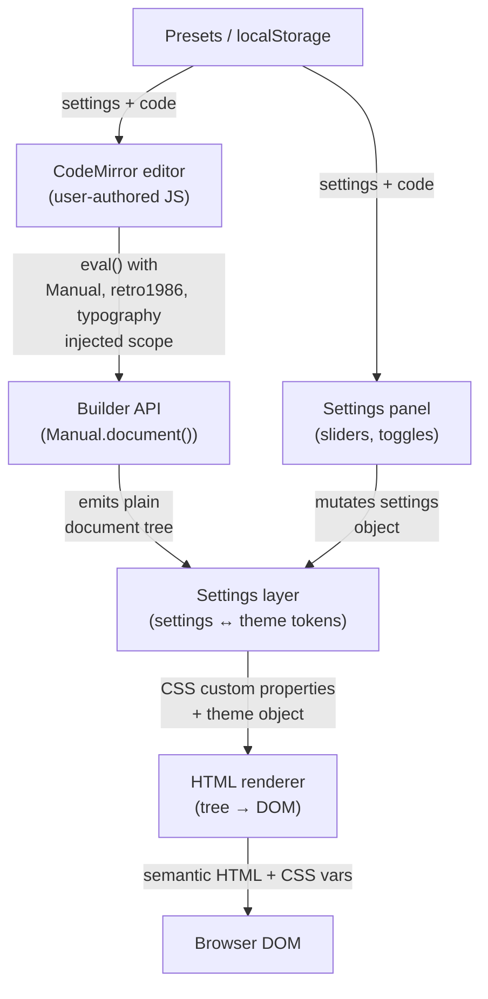

# Building a Semantic Print-Layout DSL: The Berkeley Mono Manual Specimen Lab

This article documents the architecture and implementation of a browser-based typography experiment lab that renders 1980s technical-manual pages using a semantic JavaScript builder DSL. The system separates document authoring from visual placement, supports live code editing with eval-based refresh, and exposes every typographic and layout parameter as an adjustable control. The result is a tool where you write *what* the page contains, not *where* each element sits.

The reference implementation lives at `/home/manuel/code/wesen/2026-05-18--us-graphics-template` and uses Berkeley Mono as the specimen typeface.

> [!summary]
> - A three-layer architecture separates theme/typography, layout primitives, and domain components so that the authoring surface is semantic while the rendered output is rigid.
> - The builder API emits a plain serializable document tree; an HTML renderer consumes that tree. The same tree could later feed SVG, PDF, or canvas renderers.
> - A live eval loop turns the CodeMirror editor into the primary authoring surface: editing the DSL code re-renders the page in 180 ms.
> - A small control-declaration DSL (`typographyLab`) defines the settings panel declaratively, making the experiment surface part of the design system rather than hard-coded UI.
> - Presets persist both settings and editor code to localStorage, so an entire experiment state survives page reloads.

## Why this note exists

Building design-system tools for print-inspired layouts presents a specific engineering tension: the visual output is rigid and mechanical, but the authoring experience should be fluid and semantic. This article captures the architectural decisions that resolve that tension, the interpreter that makes live editing work, and the control surface that makes every parameter adjustable without touching code.

## When to use this pattern

Use a semantic builder DSL with live eval when:

- the visual output has strong grid/rhythm constraints (technical manuals, specimen sheets, data sheets, form layouts) but the author should not need to know pixel coordinates
- you want to expose layout and typography parameters as interactive controls, not as code edits
- the same document model should be renderable to multiple output formats
- the typeface itself is the subject of experimentation and needs per-feature toggles

Do not use this pattern when:

- a static HTML/CSS page is sufficient and there is no need for adjustable parameters
- coordinate-based drawing (canvas, SVG with absolute positions) is the actual goal
- the document structure varies so much that a fixed component vocabulary would be constraining rather than helpful

## Project shape

The application is a single-page Vite app with no build-time framework. The source tree contains 2,022 lines of JavaScript and CSS across nine files:

```
src/
├── main.js              # 451 lines — app shell, eval loop, control wiring
├── specimen.js          # 109 lines — canonical page built via the public API
├── styles.css           # 556 lines — specimen + chrome CSS
├── manual/
│   ├── theme.js         # 181 lines — typography tokens, retro1986 theme, CSS var mapping
│   ├── builder.js       # 218 lines — fluent Manual.document() API, plain tree emission
│   └── renderHtml.js    # 171 lines — document tree → semantic DOM
├── lab/
│   ├── controls.js      #  53 lines — typographyLab DSL for declaring settings
│   └── editor.js        #  80 lines — CodeMirror 6 wrapper with vim compartment
└── settings.js          # 203 lines — defaults, lab declaration, preset I/O
```

The build produces a 582 KB JS bundle (dominated by CodeMirror) and 8.8 KB of CSS.

## Architecture

The system has five distinct layers. Data flows downward through them; no layer reaches upward.



### Layer 1: Theme and typography

The theme system owns all visual constants. It does not deal with document structure.

`typography()` returns a token set with named scales and measures:

```js
const type = typography({
  family: {
    mono: "Berkeley Mono, IBM Plex Mono, Courier New, monospace",
  },
  scale: {
    body:  { size: 16, line: 21, tracking: 0.02 },
    label: { size: 16, line: 21, weight: 700, tracking: 0.04 },
    title: { size: 18, line: 24, weight: 700, tracking: 0.06 },
    code:  { size: 15, line: 21, tracking: 0.01 },
  },
  measure: {
    body: "68ch",
    wide: "80ch",
  },
});
```

`retro1986()` produces a full theme object that includes page dimensions, ink/paper colors, a spacing scale, stroke widths, OpenType feature defaults, and per-component overrides (binder rail hole diameter, panel border weight, gutter marker size, title-card padding). The theme is a frozen data object; there are no methods on it.

`applySettingsToTheme()` takes the base theme and the current settings object and produces a derived theme where every numeric value comes from the settings. This means the settings panel controls the theme without the theme knowing about the settings panel.

`themeToCssVars()` flattens the theme into a `Record<string, string>` of CSS custom properties. The renderer applies these as inline styles on the page root element. This means one settings change updates all derived CSS in a single operation.

The OpenType feature layer is worth noting: `featureSettings()` produces a `font-feature-settings` string from a simple boolean map:

```js
// settings.features = { zero: true, tnum: true, liga: false, calt: true }
// produces: 'zero' 1, 'tnum' 1, 'lnum' 1, 'liga' 0, 'calt' 1
```

This is the mechanism that makes slashed zeros, tabular figures, and stylistic sets toggleable from the settings panel without touching the CSS file.

### Layer 2: Builder API

The builder is a fluent interface that produces a plain JSON-serializable tree. It does not render anything.

The key design constraint: **every builder method returns `this` or emits a child node; no method produces side effects or DOM mutations.**

```js
const tree = Manual.document()
  .using(theme)
  .sheet(sheet =>
    sheet
      .number(340)
      .section("12.6")
      .brand("US GRAPHICS", "BERKELEY MONO")
      .titleCard("API DOCUMENTATION", "MACHINE MX-4000", {
        width: 246,
        offset: [0, 0],
        padding: [10, 17],
        weight: 700,
      })
      .operation("CONFIRM TRANSACTION", op =>
        op
          .endpoint("POST", "/v2/TX/:ID/CONFIRM")
          .response("JSON", "202 ACCEPTED")
          .sample({ ID: "TX_19BCA2...", STATUS: "SUCCESSFUL" })
      )
      .notes(notes =>
        notes
          .p("Once payment method has been provided...")
          .spacer("lg")
          .p("At the time of printing, MX-5000 machines are in beta testing.")
          .rule()
      )
      .footer("CANADA", "Machines as a Service™", "Page 340")
  )
  .toJSON();
```

The resulting tree is:

```js
{
  type: "document",
  props: { theme: { name: "retro1986", ... } },
  children: [
    {
      type: "sheet",
      props: { number: 340, section: "12.6", brand: ["US GRAPHICS", "BERKELEY MONO"] },
      children: [
        { type: "titleCard", props: { lines: [...], width: 246, ... } },
        { type: "operation", props: { title: "CONFIRM TRANSACTION" }, children: [...] },
        { type: "notes", children: [...] },
        { type: "footer", props: { left: "CANADA", center: "Machines as a Service™", right: "Page 340" } },
      ]
    }
  ]
}
```

The builder has three levels:

| Level | Class | Methods | Purpose |
|-------|-------|---------|---------|
| Document | `DocumentBuilder` | `.using()`, `.sheet()`, `.toJSON()` | Root entry, theme binding |
| Sheet | `SheetBuilder` | `.brand()`, `.titleCard()`, `.operation()`, `.notes()`, `.footer()` | Domain components |
| Component | `OperationBuilder`, `NotesBuilder` | `.endpoint()`, `.response()`, `.sample()`, `.p()`, `.spacer()`, `.rule()` | Nested domain content |

The `BaseBuilder` class provides shared primitives (`.text()`, `.stack()`, `.row()`, `.panel()`, `.rule()`) for lower-level use. The domain builders extend or delegate to it.

The `node()` factory function is the only place where tree nodes are created. It enforces the `{ type, props, children }` shape. Because the tree is plain data, it can be serialized, diffed, logged, and tested without any renderer attached.

### Layer 3: HTML renderer

`renderHtml(documentTree, target)` walks the tree and produces semantic DOM elements with `data-node` attributes. It does not set any visual properties directly; all styling comes from CSS classes and CSS custom properties set by the theme layer.

The renderer maps node types to element creation functions:

| Node type | DOM element | Key CSS class |
|-----------|-------------|---------------|
| `sheet` | `<article>` | `.manual-page` |
| `binderRail` | `<aside>` | `.manual-rail` |
| `manualHeader` | `<header>` | `.manual-header` |
| `titleCard` | `<section>` | `.title-card` |
| `operation` | `<section>` | `.operation` |
| `endpoint` | `<div>` | `.endpoint` |
| `response` | `<dl>` | `.response-list` |
| `codeBlock` | `<pre><code>` | `.code-block` |
| `notes` | `<section>` | `.notes` |
| `paragraph` | `<p>` | `.note-paragraph` |
| `footer` | `<footer>` | `.manual-footer` |

Rail holes are generated as repeated `<span class="rail-hole">` elements inside a flex column. The count is derived from `Math.ceil((pageHeight - holeOffsetTop) / holeSpacing)`. The seam line is an inline SVG `<line>` with a dashed stroke, sized to the full page height.

The renderer applies the theme CSS variables to the page root element via `applyVars()`. This means the entire visual surface is controlled by approximately 40 CSS custom properties, all derived from the theme object, all adjustable from the settings panel.

`htmlForTree()` captures the rendered DOM as a formatted HTML string for the HTML output tab. It re-parses the DOM into a container element and serializes each node with proper indentation, producing human-readable markup without depending on the builder API.

### Layer 4: The live eval loop

This is the mechanism that makes the CodeMirror editor drive the preview in real time.

When the user edits code in the editor, `onEditorChange(doc)` fires. It stores the new document, writes it to `localStorage` (key `berkeley-mono-editor:v1`), and starts a 180 ms debounce timer. When the timer fires, `liveRefresh()` executes:

```js
function liveRefresh() {
  try {
    const result = evalBuilderCode(state.editorContent);
    if (result && result.type === 'document') {
      state.evalError = null;
      evalStatus.textContent = '';
      evalStatus.className = 'eval-status eval-ok';
      renderFromTree(result);
      return;
    }
    state.evalError = 'No document returned';
  } catch (err) {
    state.evalError = err.message;
  }
  evalStatus.textContent = state.evalError ? `⚠ ${state.evalError}` : '';
  evalStatus.className = 'eval-status eval-err';
}
```

`evalBuilderCode(code)` constructs a `Function` with four injected bindings — `Manual`, `retro1986`, `typography`, `applySettingsToTheme` — and evaluates the user's code in that scope. The user code must call `.toJSON()` at the end and `return` the result. A successful eval produces a document tree that is passed directly to `renderFromTree()`. A failed eval shows the error message in the status indicator next to the tab bar.

The injected bindings are real module instances, not mocks. This means the user can call any public method: `typography()` to define custom type scales, `applySettingsToTheme()` to derive a theme from the current settings, or even `Manual.document()` multiple times to compare page variants in the same code block (though only the last returned tree would render).

The editor content that ships as the default snippet is not a static template — it is the output of `currentApiSnippet(settings)`, which generates eval-able JS that mirrors the current settings state. This means the default code is always consistent with the settings panel on first load, and resetting the app regenerates the snippet from scratch.

### Layer 5: The settings and control declaration system

The settings panel is not hand-coded HTML. It is declared through a small DSL called `typographyLab()`:

```js
export const settingGroups = typographyLab(lab =>
  lab
    .group("Typography", g =>
      g
        .slider("typography.baseSize", "Base size", { min: 10, max: 26, step: 0.5 })
        .slider("typography.lineHeight", "Line height", { min: 12, max: 36, step: 0.5 })
        .slider("typography.titleWeight", "Title weight", { min: 300, max: 800, step: 100 })
    )
    .group("Title card", g =>
      g
        .slider("titleCard.width", "Width", { min: 120, max: 480 })
        .slider("titleCard.paddingX", "Padding X", { min: 0, max: 48 })
    )
    .group("OpenType features", g =>
      g
        .toggle("features.zero", "Slashed zero")
        .toggle("features.tnum", "Tabular numbers")
    )
);
```

The DSL has five control types: `.slider()` (range input), `.toggle()` (checkbox), `.color()` (color picker), `.text()` (text input), and group nesting via `.group()`. Each control declaration produces a tuple `[path, type, label, min?, max?, step?]` that the generic `renderControls()` function consumes without needing to know the domain.

The `defaultSettings` object defines the actual values. Path strings like `"typography.baseSize"` are resolved at runtime by `getPath()` and `setPath()`, which walk the settings object by splitting on `.`. This means adding a new control requires two steps: add the value to `defaultSettings` and add the declaration to the `typographyLab()` call. The renderer and the settings panel pick up both changes automatically.

When a control value changes, the event handler writes the new value into `state.settings` via `setPath()`, then calls `renderFromSettings()`. This rebuilds the theme via `applySettingsToTheme()`, rebuilds the document tree via `makeSpecimenDocument()`, and re-renders the page. The full pipeline (settings → theme → document → DOM) runs on every slider tick, which is fast enough at 60 fps because the DOM operations are small (one `<article>` with ~30 children).

The "Lab controls" drawer tab shows the `currentLabSnippet()` — the actual `typographyLab()` declaration code, syntax-highlighted. This makes the control surface inspectable and teaches the user how to extend it.

## The CodeMirror integration

The editor uses CodeMirror 6 with a custom monochrome theme that matches the Mac OS 1 aesthetic of the outer chrome. The theme is defined via `EditorView.theme()`:

```js
const monochromeTheme = EditorView.theme({
  '&': { background: '#fff', color: '#000' },
  '.cm-cursor': { borderLeftColor: '#000' },
  '.cm-activeLine': { backgroundColor: '#eee' },
  '.cm-selectionBackground': { backgroundColor: '#000 !important', color: '#fff' },
  '.cm-gutters': { backgroundColor: '#fff', borderRight: '1px solid #000', color: '#888' },
});
```

Vim mode is implemented via a `Compartment` so it can be toggled at runtime without rebuilding the editor state. The `setVim(enabled)` method dispatches a `reconfigure` effect on the vim compartment:

```js
setVim(enabled) {
  view.dispatch({
    effects: vimCompartment.reconfigure(
      enabled ? [vim({ status: true })] : []
    ),
  });
}
```

The editor fills its flex container because the `.cm-editor` rule sets `height: 100%` and the `.lab-editor-area` container uses `flex: 1 1 0` in the two-row split layout. As the browser window grows, the editor grows proportionally with the preview area above it.

Autosave is triggered on every document change (debounced by 180 ms) and writes to `localStorage` under a versioned key (`berkeley-mono-editor:v1`). On the next page load, the saved content is passed as the `doc` option to `createEditor()`, replacing the generated default snippet.

## Presets

Presets store both settings and editor code as a single object:

```js
presets[name] = {
  settings: cloneSettings(state.settings),
  code: editor.doc,
};
```

This design choice matters. An experiment state is not just the slider positions — it is the combination of what the sliders say and what the code does. If presets stored only settings, loading a preset would restore the visual parameters but lose any custom builder code the user had written. By storing both, a preset captures the full reproducible state.

Presets are serialized as JSON to `localStorage` under `berkeley-mono-manual-presets:v1`. There is no server-side storage. The versioned key scheme allows the schema to change in the future without colliding with older saved data.

## The reference overlay

The overlay system allows the user to place a semi-transparent copy of the original specimen image on top of the generated page and align it using x/y offsets, width/height scaling, and opacity control. The overlay is rendered as an absolutely positioned `` inside the `.manual-page` container with `pointer-events: none` and `mix-blend-mode: multiply`.

The toolbar provides both number inputs and nudge buttons (1 px per click, 10 px per Shift+click). The keyboard shortcut `Alt+Arrow` nudges by 1 px (10 px with Shift), which is useful for fine alignment while looking at the preview rather than the controls.

The overlay is not part of the document tree. It is injected after rendering by `renderOverlay()`, which removes any previous overlay and appends a fresh one. This keeps the eval'd builder code and the overlay independent — the code does not need to know about the overlay, and the overlay does not interfere with the document structure.

## The CSS architecture

The specimen page uses CSS custom properties for every adjustable value. There are approximately 40 properties, set as inline styles on the page root by the theme layer:

```css
.manual-page {
  width: var(--page-width);
  height: var(--page-height);
  color: var(--ink);
  background: var(--paper);
  font-size: var(--body-size);
  line-height: var(--body-line);
  letter-spacing: var(--body-track);
  font-feature-settings: var(--feature-settings);
}
```

This pattern means a single property change on the root element cascades through the entire page. There are no per-component style recalculations and no JavaScript DOM manipulation for visual updates. The settings panel writes to the settings object, the theme layer produces new CSS var values, and the renderer applies them in one `applyVars()` call.

The outer chrome uses a different aesthetic than the specimen. The chrome is Mac OS 1 monochrome: pure black on white, 1 px solid borders, no gradients, no shadows, no rounded corners. Buttons invert to white-on-black on `:active`. Active tabs are black with white text. The specimen page retains its warm paper tones and has a hard 3 px offset shadow (`box-shadow: 3px 3px 0 #000`) that references the original Macintosh drag shadow.

The layout is a full-viewport two-column flex layout. The left column is split vertically into a preview area (top) and an editor area (bottom), each using `flex: 1 1 0`. The right column is a fixed 340 px settings panel. Neither column has a fixed height; they fill the viewport and scroll independently.

## Implementation sequence

The project was built in seven commits, each adding a coherent layer:

1. **Document Berkeley Mono specimen UI plan** — created the docmgr ticket with specimen analysis, builder API design, and implementation guide before writing any application code.
2. **Build Berkeley Mono specimen lab** — scaffolded the Vite app, copied WOFF2 font assets, implemented the core DSL (theme, builder, renderer), and produced a first rendered page.
3. **Add overlay presets and output drawer** — added the reference image overlay, localStorage preset system, and a bottom drawer with builder code and HTML output tabs.
4. **Add typography lab control DSL** — extracted the settings panel into a declarative `typographyLab()` DSL, added title-card controls, and exposed the lab controls tab.
5. **Make settings groups foldable** — converted fieldsets to `details/summary` elements with the first three groups open by default.
6. **Add CodeMirror editor with vim toggle, live eval, and autosave** — replaced the read-only code display with a CodeMirror 6 instance, added eval-based live refresh, vim mode toggle, and localStorage autosave.
7. **Mac OS 1 monochrome chrome with full-viewport editor** — redesigned the outer chrome to pure monochrome, made the editor flex to fill vertical space, and replaced the CodeMirror one-dark theme with a custom monochrome theme.

The pre-implementation documentation step (commit 1) was deliberate. The specimen has enough competing concerns — font loading, print-layout fidelity, semantic API design, live experimentation, eval safety — that writing the design first produced better architectural boundaries than starting with code would have.

## Failure modes and tricky details

**Footer overlap.** The specimen page uses absolute positioning for the footer (`bottom: 22px`) and absolute positioning for the content region (`inset: margin...`). When body text extends beyond the content region, it overflows under the footer. The fix was to set the content region's `bottom` to `calc(marginBottom + 46px)` and clip overflow. This is fragile: if the user increases the footer font size or adds more footer content, the reserved space may not be enough. A better solution would be for the renderer to measure the footer height and set the content bottom dynamically.

**Eval safety.** The live eval loop runs user-authored JavaScript with `new Function()`. The injected bindings (`Manual`, `retro1986`, `typography`, `applySettingsToTheme`) are real module instances, so eval'd code has full access to the builder API. There is no sandbox. If the user writes an infinite loop or throws an unhandled error, the browser tab will freeze or show an error. The 180 ms debounce timer prevents rapid re-evals during fast typing, but it does not protect against slow-running code.

**Overlay alignment.** The original specimen image is 818×812 px while the generated page defaults to 794×794 px. The overlay width and height controls allow the image to be stretched to match the page dimensions, but the aspect ratio difference means exact pixel parity requires either cropping or scaling distortion. The overlay `mix-blend-mode: multiply` helps visually because it darkens overlapping ink and leaves paper-colored gaps where the generated content does not match.

**CSS custom property count.** Approximately 40 CSS custom properties are set on the page root. This is manageable but approaching the limit of what is convenient to debug in browser DevTools. A future improvement would group related properties (rail, panel, title-card) into sub-objects and flatten them at render time.

**Bundle size.** CodeMirror 6 and its dependencies account for roughly 580 KB of the 582 KB JS bundle. The application code itself is only ~5 KB minified. Code-splitting the editor into a dynamic import would reduce the initial load for users who just want to adjust sliders, but the current single-bundle approach is simpler.

## Open questions

- Should the builder API support multiple pages (`.sheet()` called more than once)? The current renderer handles only the first sheet.
- Should the document tree include style references (e.g., `.text("HELLO", "label")`) that resolve through the theme, or should all visual properties be passed as explicit props?
- Should the eval loop use a Web Worker to protect the main thread from slow user code?
- Should the overlay be part of the document tree (so it appears in the HTML output tab) or remain a post-render decoration?
- Should presets support import/export as JSON files for sharing experiments between machines?

## Near-term next steps

- Use the overlay controls to create a named base-alignment preset that matches the original specimen image position and size.
- Refine the generated page's visual parity with the specimen: match header spacing, code-block indentation, and gutter-marker positioning.
- Add per-control units (`px`, `em`, `ch`) and tooltip descriptions to the lab DSL.
- Code-split CodeMirror into a dynamic import to reduce initial bundle size.
- Add a document-tree tab to the output drawer for debugging the intermediate representation.
- Consider adding a CSS-only rendering mode where the builder emits CSS Grid declarations instead of absolute-positioned regions.

## Working rules

- The builder API is the public surface. It should never expose coordinates or pixel values. If a caller needs to place something at a specific position, add a semantic method that wraps the coordinate logic.
- Theme tokens own spacing. Code that uses `42px` directly is a bug; it should use `var(--space-lg)` or a named theme value.
- The document tree is plain data. No class instances, no circular references, no DOM nodes. If it cannot be passed to `JSON.stringify()`, it is wrong.
- Settings mutations flow through `setPath()` and trigger `renderFromSettings()` or `liveRefresh()`. Direct DOM manipulation for visual updates is not allowed.
- Presets must capture the full experiment state (settings + code). A preset that only captures half the state is a bug.

## Related notes

- The docmgr ticket `USGRAPHICS-MANUAL-UI` in the project repo contains the original specimen analysis, builder API design document, and implementation playbook.
- The diary at `ttmp/.../reference/01-diary.md` records the step-by-step implementation narrative including failures and recovery.
