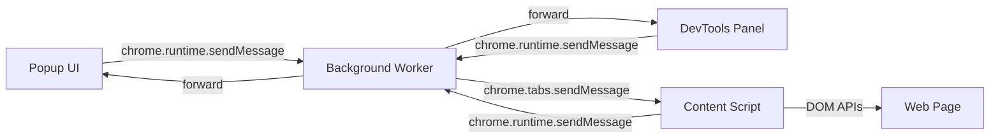

# TypoScope

TypoScope is a Firefox browser extension that measures typographic reality on web pages. It does not show what the CSS *declares* — it shows what the browser *renders*. The distinction matters: a `font-family` stack may list Inter, Arial, and sans-serif, but if the Inter webfont failed to load, the reader sees Arial. Existing tools like Firefox's DevTools Font panel display the declared stack and the computed pixel values. TypoScope detects the actually rendered font, overlays baseline and x-height guide lines on the page, checks vertical rhythm alignment against a grid unit, analyzes line-length distribution and rag quality, extracts the page's type scale, scores the full-page typography on a 0–100 scale, and exports structured reports. It is a measuring instrument, not a CSS inspector.

> [!summary]
> The project currently has three important identities:
> 1. a rendered-font detection engine that distinguishes what CSS says from what the reader sees
> 2. a typography quality auditor that scores readability, contrast, rhythm, scale, font loading, and responsive behavior
> 3. a design token extractor that turns page typography into `:root { --font-... }` CSS custom properties

## Why this project exists

Web typography is judged by what the reader sees, not what the developer wrote. A paragraph declared at `font-family: "Inter", Arial, sans-serif` may render in Arial because the webfont failed. A `line-height: normal` may produce 22.4px on one element and 19.2px on another because different fonts have different internal metrics. A body text set to 86 characters per line exceeds the 45–75 range recommended for long-form reading. A 24px baseline grid may be broken by a 20px paragraph margin.

Firefox DevTools shows computed CSS values. It does not detect which font actually rendered, measure baseline positions from pixel geometry, check rhythm alignment, analyze line-length distributions, extract the type scale, parse `clamp()` fluid typography, or produce an audit score. TypoScope fills each of those gaps.

The project exists because typographic quality on the web is a measurable property, and the existing tools measure the wrong thing — they measure the developer's intent, not the reader's experience.

## Current project status

The repository is in an active development state across four implementation phases, three of which are complete.

What already works:

- **Phase 1 — Core Inspector**: hover-to-select and click-to-pin inspection of any text element; rendered font detection via width comparison; font geometry measurement via Canvas `TextMetrics`; WCAG contrast ratio calculation; baseline/x-height/cap-height overlay rendering; popup UI with metric display and CSS copy
- **Phase 2 — Rhythm and Layout**: vertical rhythm checker that flags misaligned line-heights and margins; full-page baseline grid overlay; click-drag spacing ruler; page-level type scale extraction with ratio detection; DevTools panel scaffold
- **Phase 3 — Quality Audit**: full-page typography audit scoring 0–100 across readability, contrast, rhythm, type scale, font loading, and responsive behavior; line-length, rag quality, and widow/orphan analysis; CSS design token extraction; JSON and Markdown report generation with clipboard export
- **Phase 4 (partial) — Fluid Type**: `clamp()` parser that solves for viewport scaling ranges; raw CSS rule extraction via stylesheet traversal

What remains incomplete:

- responsive comparison mode (desktop vs mobile viewport typography diff)
- PDF export (requires a rendering library like jsPDF)
- typography loupe (pixel-level glyph magnifier)
- element comparison mode (side-by-side two elements)
- screenshot annotation with overlaid measurements
- kerning and tracking analyzer
- optical alignment checker
- multilingual typography checks
- variable font playground

What changed during development:

- the initial build used ES module `import`/`export` syntax in content scripts, which caused `SyntaxError` in Firefox because `chrome.scripting.executeScript()` injects as classic scripts, not modules — resolved by adding esbuild bundling
- `web-ext run` does not work with snap Firefox on Ubuntu; the extension must be loaded via `about:debugging` → Load Temporary Add-on

## Project shape

At a high level, the project has four layers:

1. **Measurement libraries** (`src/lib/`) — pure functions that compute typography data: font detection, font metrics, contrast ratio, rhythm checking, type scale extraction, line analysis, design token extraction, fluid type parsing
2. **Content scripts** (`src/content/`) — code that runs inside the web page: element inspector, overlay renderer, spacing ruler, audit engine, report exporter
3. **Extension plumbing** (`src/background/`, `src/shared/`) — message routing, type constants, utility functions
4. **UI layer** (`src/popup/`, `src/devtools/`) — the popup interface, DevTools panel, and their styles

The build step bundles the content scripts and background script with esbuild into `dist/content-main.js` and `dist/background.js` as IIFE bundles, because Firefox's `scripting.executeScript()` API injects files as classic scripts rather than ES modules.

## Architecture

The extension follows the standard Firefox Manifest V3 pattern: a background service worker routes typed JSON messages between the popup UI, an optional DevTools panel, and a content script injected into the active tab.



The content script is the only context with DOM access. It reads `getComputedStyle()`, creates canvas elements for `TextMetrics`, injects overlay `<div>` elements, and traverses stylesheets for raw CSS declarations. The popup and DevTools panel display data and send control messages. The background worker is a thin message router that also handles idempotent content script injection.

### Message protocol

Every message has a `type` field and an optional `payload`. The content script listens for these types:

| Type | Direction | Purpose |
|------|-----------|---------|
| `START_INSPECT` | popup → content | Enable hover-to-select inspection |
| `STOP_INSPECT` | popup → content | Disable inspection, clear overlays |
| `ENABLE_OVERLAY` | popup → content | Render baseline or grid overlay |
| `DISABLE_OVERLAY` | popup → content | Remove all overlays |
| `START_RULER` | popup → content | Enable click-drag measurement |
| `STOP_RULER` | popup → content | Disable ruler |
| `RUN_AUDIT` | popup → content | Execute full-page audit |
| `EXTRACT_TYPE_SCALE` | popup → content | Inventory all font sizes |
| `EXPORT_REPORT` | popup → content | Generate and copy report |
| `EXTRACT_TOKENS` | popup → content | Extract CSS custom properties |
| `INSPECT_FLUID_TYPE` | popup → content | Parse `clamp()` for selected element |
| `TYPO_DATA` | content → popup | Typography metrics for inspected element |
| `RULER_DATA` | content → popup | Measurement from ruler |

The protocol is synchronous for most operations: the content script receives a message, computes the result, and returns it via `sendResponse`. The background worker forwards the popup's message to the content script and returns the content script's response back to the popup.

### File structure

```
src/
├── shared/
│   ├── message-types.js    # Message type constants
│   └── utils.js            # parsePx, parseColor, sanitize, roundTo, average, variance
├── lib/
│   ├── font-detect.js      # Rendered font detection (width comparison)
│   ├── font-metrics.js     # Canvas TextMetrics wrapper
│   ├── contrast.js         # WCAG contrast ratio calculator
│   ├── rhythm.js           # Vertical rhythm checker + baseline grid overlay
│   ├── type-scale.js       # Type scale extraction and ratio detection
│   ├── line-analysis.js    # Line-length, rag, widow/orphan analysis
│   ├── design-tokens.js    # CSS custom property extraction
│   └── fluid-type.js       # clamp() parser and viewport range solver
├── content/
│   ├── content-main.js     # Entry point: message listener, module wiring
│   ├── inspector.js        # Hover/click inspection + metric computation
│   ├── overlays.js         # Baseline/x-height/cap-height guide lines
│   ├── ruler.js            # Click-drag spacing measurement
│   ├── audit.js            # Full-page audit scoring
│   └── export.js           # JSON and Markdown report generation
├── background/
│   └── background.js       # Message hub, content script injection
├── popup/
│   ├── popup.html           # Popup markup
│   ├── popup.css            # Dark-themed popup styles
│   └── popup.js             # Popup logic and data rendering
├── devtools/
│   ├── devtools.html        # DevTools page (invisible)
│   ├── devtools.js          # Creates TypoScope panel
│   └── panel/
│       ├── panel.html       # Panel markup
│       ├── panel.css         # Panel styles
│       └── panel.js          # Panel logic
└── icons/
    ├── icon-48.png
    └── icon-96.png
```

## Implementation details

### Rendered font detection

The browser provides `getComputedStyle(element).fontFamily`, but this returns the *declared* font stack, not the font that actually rendered. TypoScope detects the rendered font using a width-comparison heuristic.

The algorithm works because different fonts assign different glyph widths to the same text. If you measure a sample string with the full declared stack and then measure the same string with each candidate font individually, the candidate whose width matches the rendered width is the one the browser used.

```pseudocode
function detectRenderedFont(element):
  declaredStack = split getComputedStyle(element).fontFamily by ','
  renderedWidth = measure(hiddenSpan with fullStack, sampleText)
  
  for candidate in declaredStack:
    candidateWidth = measure(hiddenSpan with candidate, sampleText)
    if abs(candidateWidth - renderedWidth) < 1px:
      return candidate
  
  return last item in stack  // generic family fallback
```

The 1px tolerance accounts for subpixel rounding differences. A second verification pass uses a different sample string to disambiguate fonts with coincidentally similar widths (e.g., variable fonts at different axes).

The hidden test `<span>` is positioned at `left: -9999px` to avoid visual flicker. It inherits the element's computed `font-size`, `font-weight`, `font-style`, `letter-spacing`, and `word-spacing` to match the rendering context as closely as possible.

### Font geometry measurement

The Canvas 2D `measureText()` API returns a `TextMetrics` object that includes vertical metrics relative to the baseline:

- `actualBoundingBoxAscent` — distance from baseline to top of the glyph bounding box
- `actualBoundingBoxDescent` — distance from baseline to bottom
- `fontBoundingBoxAscent` — the font-level ascender (larger than per-glyph ascent)
- `fontBoundingBoxDescent` — the font-level descender

TypoScope renders reference glyphs on a hidden canvas and reads their metrics to determine the font's geometry:

| Glyph | Metric revealed |
|-------|----------------|
| `x` | x-height (distance from baseline to top of lowercase 'x') |
| `H` | cap-height (distance from baseline to top of uppercase 'H') |
| `b` | ascender (distance from baseline to top of ascender line) |
| `p` | descender (distance from baseline to bottom of descender line) |

```pseudocode
function measureFontMetrics(fontFamily, fontSize, fontWeight):
  ctx.font = fontWeight + ' ' + fontSize + ' ' + fontFamily
  xHeight = ctx.measureText('x').actualBoundingBoxAscent
  capHeight = ctx.measureText('H').actualBoundingBoxAscent
  ascender = ctx.measureText('b').actualBoundingBoxAscent
  descender = ctx.measureText('p').actualBoundingBoxDescent
  return { xHeight, capHeight, ascender, descender }
```

The overlay renderer reconciles these canvas-derived values with DOM positions. The element's `getBoundingClientRect()` gives the box; a `Range` over the first text node gives the exact line box. The baseline Y position is computed as `lineRect.bottom - metrics.descender`, and the other guide lines are offset from the baseline by their respective metric values.

### WCAG contrast calculation

The contrast ratio between foreground and background colors follows the WCAG 2.x algorithm:

1. Convert each sRGB color to linear RGB.
2. Compute relative luminance: `L = 0.2126 * R + 0.7152 * G + 0.0722 * B`.
3. Contrast ratio: `(L_lighter + 0.05) / (L_darker + 0.05)`.

The sRGB-to-linear conversion uses the standard threshold at 0.03928: values below are divided by 12.92, values above are linearized as `((c + 0.055) / 1.055) ^ 2.4`.

One practical challenge is determining the effective background color. `getComputedStyle().backgroundColor` returns `rgba(0, 0, 0, 0)` (transparent) for most elements because background is typically set on ancestor elements. TypoScope walks up the DOM tree until it finds the first non-transparent background color. If no ancestor provides one, it defaults to white.

### Vertical rhythm checking

A vertical rhythm exists when all vertical spacings — line-heights, margins, and paddings — are multiples of a single grid unit. TypoScope detects the grid unit as the body element's computed line-height (or falls back to 24px) and then checks each text element:

```pseudocode
function checkRhythm(elements, gridUnit):
  issues = []
  for element in elements:
    if lineHeight % gridUnit != 0:
      issues.append("line-height " + lineHeight + " not aligned to " + gridUnit)
    if marginBottom % gridUnit != 0:
      issues.append("margin-bottom " + marginBottom + " not aligned")
  return issues
```

The checker uses exact modulo comparison. A tolerance of ±1px or ±2px would reduce false positives from subpixel rounding, but the current implementation requires exact alignment. This is a known tradeoff: strict checking catches real problems but also flags elements where the computed value differs from the declared value by rounding.

The baseline grid overlay renders horizontal lines across the full document height at `gridUnit` intervals. The overlay container is positioned with `position: absolute` and `pointer-events: none` to avoid intercepting page interactions.

### Line-length, rag, and widow analysis

For each paragraph, TypoScope:

1. Creates a `Range` over the text node and calls `getClientRects()` to get one `DOMRect` per line box.
2. Estimates characters per line by dividing line width by the average character width (measured via canvas).
3. Computes the average measure across all lines.
4. Assesses rag quality by computing the variance of right-edge positions: high variance means uneven rag.
5. Detects widows by checking if the last line is shorter than 40% of the average.
6. Detects orphans by checking if the last segment contains no space character.

The recommended measure range for long-form reading is 45–75 characters per line, following established typographic practice.

### Type scale extraction

The extractor queries all text-bearing elements on the page, reads their computed `font-size`, and builds a size map. It then:

1. Sorts sizes from largest to smallest.
2. Tests eight common type scale ratios (Minor Second 1.067, Major Second 1.125, Minor Third 1.2, Major Third 1.25, Perfect Fourth 1.333, Augmented Fourth 1.414, Perfect Fifth 1.5, Golden Ratio 1.618) by comparing the log-space distance between each pair of adjacent sizes and the candidate ratio.
3. Flags near-duplicate sizes within 2px of each other (e.g., 15px and 16px).

### Audit scoring system

The audit scores typography on a 0–100 scale across six weighted categories:

| Category | Weight | What it checks |
|----------|--------|---------------|
| Readability | 25% | Body font size ≥ 16px, line-height ratio ≥ 1.4, measure 45–75 characters |
| Contrast | 20% | All text meets WCAG AA (4.5:1 for normal, 3:1 for large) |
| Rhythm | 20% | Spacings align to a consistent grid unit |
| Type scale | 15% | No near-duplicate sizes, consistent heading hierarchy |
| Font loading | 10% | No load errors, not too many font files |
| Responsive | 10% | No extreme measure on wide viewports |

Each category starts at its maximum weight and loses points for each issue found. The total is the weighted sum of category scores.

### Fluid typography inspection

Fluid typography uses the CSS `clamp()` function to scale font sizes across viewport widths without breakpoints. The syntax is `clamp(min, preferred, max)`, where `preferred` is typically a viewport-width formula like `2.5vw + 0.5rem`.

TypoScope parses the `clamp()` value by:

1. Matching the three comma-separated components with a regular expression.
2. Resolving `min` and `max` to pixel values using a temporary DOM element.
3. Extracting the `vw` coefficient and fixed intercept from the `preferred` formula.
4. Solving two linear equations: at what viewport width does `preferred` equal `min` (scaling starts), and at what viewport width does `preferred` equal `max` (scaling ends).

One challenge is that `getComputedStyle().fontSize` returns the *computed* pixel value, not the original `clamp()` expression. TypoScope recovers the raw declaration by iterating `document.styleSheets` and finding the rule whose `selectorText` matches the element. Cross-origin stylesheets throw a security exception when accessing `cssRules`, which is caught and skipped.

### Content script injection and bundling

Firefox's `chrome.scripting.executeScript()` API injects files as **classic scripts**, not ES modules. This means `import` and `export` statements cause `SyntaxError` at the top of every file. The solution is an esbuild build step that bundles all `lib/` and `content/` modules into a single `dist/content-main.js` file in IIFE format (immediately invoked function expression). The background script is similarly bundled into `dist/background.js`.

The popup uses `<script type="module">` in its HTML, which Firefox supports for extension pages. The popup's imports are resolved by the browser's native module loader, so the popup does not need bundling.

The build command is `npm run build`, which runs `node build.mjs`. The `build.mjs` script configures esbuild with `format: 'iife'` and `target: 'firefox120'`.

### Overlay rendering

Overlays are `<div>` elements positioned absolutely in a container that covers the full document. The container uses `pointer-events: none` and `z-index: 2147483647` to avoid intercepting page interactions while remaining on top.

Guide lines are colored by metric type: baseline (red), x-height (green), cap-height (blue), ascender (purple), descender (olive). Each line has a small label positioned to its left showing the metric name.

The overlay positions update on scroll and resize events. The current implementation re-renders all overlays on every scroll event without debouncing, which can be a performance concern on long pages. A future improvement would add requestAnimationFrame-based debouncing.

## Current user-facing commands

The extension is loaded via `about:debugging` → Load Temporary Add-on → select `manifest.json`. After loading:

1. Click the **TypoScope** toolbar icon (the "Ts" icon)
2. Click **⌖ Inspect Text** — hover over text to see metrics; click to pin
3. Click **≋ Baseline Guides** — overlay baseline/x-height/cap-height lines (requires a pinned element)
4. Click **▦ Baseline Grid** — full-page repeating grid lines
5. Click **▦ Layout Ruler** — click and drag to measure distances
6. Click **Aa Type Scale** — extract and display the page's font size inventory
7. Click **✓ Type Audit** — run the full-page audit and display the score
8. Click **Export MD** / **Export JSON** — copy a report to the clipboard
9. Click **Tokens CSS** — copy extracted `:root { --font-... }` custom properties

Source changes require a rebuild (`npm run build`) and then reloading the extension in `about:debugging`.

Two test pages are included in `test-pages/`:

- `bad-typography.html` — intentionally poor typography that triggers many audit warnings
- `good-typography.html` — proper type scale, rhythm, and contrast that should score well

## Important project docs

- `/home/manuel/code/wesen/2026-05-18--firefox-typography-extension/typography.md` — the original 23-feature specification with ASCII UI mockups
- `/home/manuel/code/wesen/2026-05-18--firefox-typography-extension/ttmp/2026/05/18/TYPO-001--typoscope-firefox-typography-measurement-extension/design-doc/01-analysis-and-implementation-guide.md` — 63KB intern-ready design guide covering Firefox extension architecture, typography measurement techniques, and phased implementation plan
- `/home/manuel/code/wesen/2026-05-18--firefox-typography-extension/ttmp/2026/05/18/TYPO-001--typoscope-firefox-typography-measurement-extension/reference/01-diary.md` — chronological implementation diary with 5 steps

## Open questions

- Should the rhythm checker use a tolerance (±1px or ±2px) instead of exact modulo comparison to reduce false positives from subpixel rounding?
- Should the audit category weights be configurable via a settings panel?
- Should the extension request `host_permissions` for all URLs instead of relying on `activeTab`, which requires a user gesture each session?
- How should Shadow DOM elements be handled? `getComputedStyle()` works across shadow boundaries, but `getBoundingClientRect()` may return unexpected values for elements inside shadow roots.
- Should the typography loupe (pixel-level magnifier) use a canvas-based renderer or capture the screen via `getDisplayMedia`?

## Near-term next steps

- Add requestAnimationFrame-based debouncing to overlay scroll/resize handlers
- Handle tab navigation (`webNavigation.onCompleted`) to re-inject content scripts when the user navigates within the same tab
- Write unit tests for `lib/` modules (contrast, font-metrics, font-detect, rhythm)
- Complete Phase 4 features: responsive comparison mode, element comparison, typography loupe
- Add the DevTools sidebar panel with full metric display and overlay controls
- Implement PDF export using a rendering library

## Project working rule

> [!important]
> Run `npm run build` after any source change before reloading the extension.
> The popup uses native ES modules; the content script and background use bundled IIFE.
> When adding a new lib module, add it to the import chain in `src/content/content-main.js` so esbuild includes it in the bundle.
