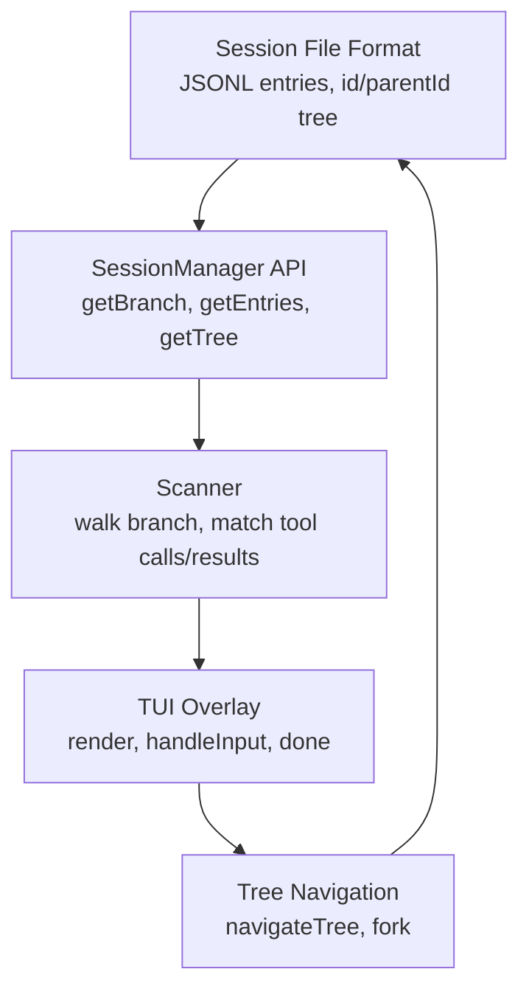
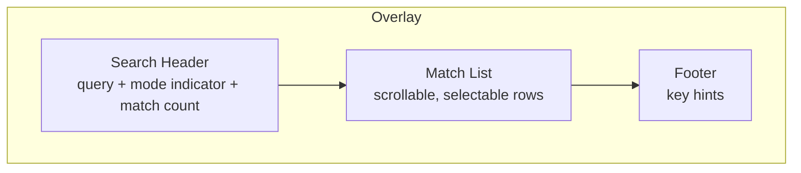
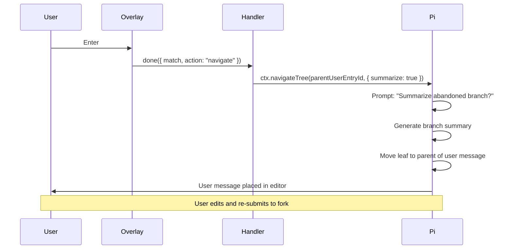

# Building a Session Search Extension for Pi: Searching Tool Call History and Navigating to Fork Points

This article is a deep technical account of building a Pi extension called `session-search`. The extension searches tool call arguments and results across the session history, displays matches in a terminal UI overlay, and lets the user navigate to match points to fork the conversation. It covers every subsystem that had to be understood, the architecture that emerged, the scanning algorithm, the bugs that surfaced during development, and the design decisions that shaped the final implementation.

The target reader is someone who knows TypeScript and terminal UI basics, has read the Pi extension documentation once, but has not yet built a non-trivial extension. By the end, that reader should understand not just what the extension does, but why each piece is shaped the way it is and what it takes to wire session data, interactive overlays, and conversation-tree navigation into a working tool.

> [!summary]
> This article has four important themes:
> 1. Pi session entries form a tree, not a flat log — understanding the tree structure is the prerequisite for every search and navigation feature
> 2. Tool calls are split across assistant messages (the call) and tool result messages (the response), linked only by a `toolCallId` — matching them requires a pending-call map
> 3. `ctx.navigateTree()` rewinds the session to a chosen entry and places the original user message in the editor for re-submission — this is the mechanism for forking from a search match
> 4. `getBranch()` returns entries in root-to-leaf chronological order, not leaf-to-root — getting this wrong produces zero matches silently

## Why this extension exists

Pi coding sessions run for hours. The agent reads dozens of files, writes code, runs shell commands, edits files, and iterates. The session file on disk records every interaction, including the full text of every `read` call and the exact content of every `write` call. But Pi provides no built-in way to search through those tool calls from inside a session.

The problem is concrete: you remember that somewhere around turn 15 the agent wrote a specific string into a file, and now you want to go back to that moment. Without a search tool, you scroll through the session or manually read the JSONL file. The `session-search` extension solves this by scanning the session branch for tool calls that mention the search string, displaying a chronological match list, and providing navigation to the match point so you can fork the conversation from there.

## The five subsystems you need to understand

Building this extension required understanding five Pi subsystems. Each one is documented separately in the Pi docs, but the extension is the place where they all connect.



### 1. Session file format

Every Pi session is stored as a JSONL file under `~/.pi/agent/sessions/`. Each line is a JSON object with a `type` field. The entries form a tree via `id` and `parentId` fields. The entry types that matter for search are:

| Entry type | `type` field | What it contains |
|---|---|---|
| `SessionMessageEntry` | `"message"` | An `AgentMessage` — user, assistant, toolResult, bashExecution, or custom |
| `CompactionEntry` | `"compaction"` | A summary of older messages (the originals are still on disk) |
| `BranchSummaryEntry` | `"branch_summary"` | Summary of an abandoned branch when navigating `/tree` |

The session file is append-only. Compaction replaces older messages in the *active context sent to the LLM*, but the original entries remain in the JSONL file. This distinction matters: after compaction, `getBranch()` no longer returns the compacted entries, but they are still on disk if you parse the file directly.

### 2. AgentMessage types and the tool call split

Each `SessionMessageEntry` wraps an `AgentMessage`. The relevant message roles for tool-call searching are:

```typescript
// An assistant message containing tool calls
interface AssistantMessage {
  role: "assistant";
  content: (TextContent | ThinkingContent | ToolCall)[];
  timestamp: number;
  // ... other fields: api, provider, model, usage, stopReason
}

// A tool call within assistant content
interface ToolCall {
  type: "toolCall";
  id: string;           // Links to the matching ToolResultMessage
  name: string;         // "read", "write", "edit", "bash", etc.
  arguments: Record<string, any>;  // The actual arguments
}

// A tool result message
interface ToolResultMessage {
  role: "toolResult";
  toolCallId: string;   // Matches the ToolCall.id
  toolName: string;
  content: (TextContent | ImageContent)[];  // The result
  isError: boolean;
  timestamp: number;
}
```

The critical detail: tool calls and tool results are **separate messages**. The assistant message contains the `ToolCall` block with the arguments. The tool result is a separate `ToolResultMessage` that comes later, linked only by `toolCallId`. This is not a simple flat list — it is a two-pass matching problem.

For `read` calls, `arguments` contains `{ path: string, offset?: number, limit?: number }`. For `write` calls, `arguments` contains `{ path: string, content: string }`. For `edit` calls, `arguments` contains `{ path: string, edits: [{ oldText: string, newText: string }] }`. The search must traverse both the arguments (where the agent *asked* to do something) and the results (what came back).

### 3. The SessionManager API

The `SessionManager` is accessible via `ctx.sessionManager` in extension handlers. It provides read-only access to the session tree.

```typescript
// Get all entries on the current branch (root to leaf, chronological)
ctx.sessionManager.getBranch(): SessionEntry[]

// Get all entries across all branches
ctx.sessionManager.getEntries(): SessionEntry[]

// Get the current leaf entry ID
ctx.sessionManager.getLeafId(): string | null

// Get the session file path (for direct JSONL parsing)
ctx.sessionManager.getSessionFile(): string | undefined
```

The `getBranch()` method returns only the entries on the current active path, in root-to-leaf chronological order. The `getEntries()` method returns entries across all branches. After compaction, `getBranch()` no longer includes the compacted entries — they are replaced by the compaction summary.

### 4. Tree navigation and forking

Pi's session tree allows branching. The `/tree` command lets users navigate to any point and fork from there. The extension needs a subset of that functionality: when the user selects a match, navigate to the entry where the tool call happened so they can fork.

Two navigation methods exist:

- **`ctx.navigateTree(targetId, options?)`** — Changes the leaf pointer in the *same* session file. This is what `/tree` uses internally. When navigating to a user message, the leaf is set to the parent of that message, and the message text is placed in the editor for re-submission.
- **`ctx.fork(entryId, options?)`** — Creates a *new* session file containing the path from root to the selected entry. The old session is preserved.

The key insight for this extension: to fork from a match, we navigate to the **parent user message** of the tool call, not the tool call itself. A tool call is inside an assistant message, which is a response to a user message. If we navigate to the user message, the editor gets the original prompt, and the user can modify and re-submit it to create a new branch.

### 5. The extension registration framework

Extensions in the shared repo framework use `registerPiExtension()` from `extensions/_shared/registry.ts`. This provides a unified contract for declaring actions, documentation, settings, and widgets:

```typescript
interface PiExtensionRegistration {
  id: string;            // Stable machine name
  name: string;          // Display name
  description: string;   // One-line explanation
  commands?: string[];   // Slash commands
  run?: PiExtensionActionHandler;  // Default action
  actions?: PiExtensionAction[];   // Named operations
  docs?: PiExtensionDoc[];         // Help pages
  widgets?: PiDashboardWidget[];   // Dashboard/status cards
}
```

The `/px` launcher discovers extensions through this registry. Each extension calls `registerPiExtension()` at load time, and the launcher presents the contributions through a common UI surface.

## Architecture

The extension has four layers: types, scanner, overlay UI, and command handler. Each layer has a single responsibility.

```mermaid
graph TD
    SM[SessionManager<br/>getBranch] --> SC[Scanner<br/>scanBranch]
    SC --> TL[ToolCallMatch[]<br/>match data]
    TL --> UI[Overlay UI<br/>SessionSearchOverlay]
    UI --> NAV[Command Handler<br/>navigateTree / fork]
    NAV --> SM
```

### Data model

The scanner produces `ToolCallMatch` objects. Each one links back to the session entries where the tool call occurred.

```typescript
interface ToolCallMatch {
  assistantEntryId: string;     // Session entry with the tool call
  resultEntryId: string;         // Session entry with the tool result
  parentUserEntryId: string | null;  // User message that started the turn
  toolName: string;              // "read", "write", "edit", "bash"
  toolCallId: string;            // Links assistant to result
  arguments: Record<string, unknown>;
  resultText: string;            // Concatenated result text
  timestamp: number;
  turnIndex: number;             // 0-based turn count
  matchLocation: "arguments" | "result" | "both";
  matchLines: number[];          // 1-based line numbers
  snippet: string;              // Context around first match
}
```

### Key design decisions

Five decisions shaped the architecture:

1. **Search the current branch, not all entries.** The current branch represents the conversation the user is actually in. Searching all entries across all branches would return matches from abandoned explorations. The full-file JSONL parsing is available as a follow-up option.

2. **Search both arguments and results.** A search for "validateAuth" should find both the `write` call where the agent wrote the function into a file (in arguments) and the `read` result where the agent read a file containing the function (in the result text).

3. **Navigate to the parent user message, not the tool call.** `navigateTree()` with a user message entry ID restores that prompt in the editor for re-submission. This is the ideal UX for forking — the user can modify the original prompt before re-submitting.

4. **Build the search index on demand, not incrementally.** Sessions are not large enough to warrant persistent indexing. Walking the branch and searching is fast (sub-millisecond for typical sessions).

5. **Offer both navigate and fork as actions.** `navigateTree` rewinds the current session (for "go back and try a different approach"). `fork` creates a new session (for "try an alternative in a new session").

## The scanning algorithm

The scanner walks the current branch entries in chronological order, tracking turn boundaries and collecting tool calls from assistant messages. When it encounters a tool result, it matches it against the pending tool call and searches both the arguments and the result text for the query string.

### Pseudocode

```
FUNCTION scanBranch(sessionManager, query, mode):
  branch = sessionManager.getBranch()  // root→leaf, chronological

  matches = []
  currentUserEntryId = null
  turnIndex = -1
  pending = {}  // toolCallId → { entryId, arguments, toolName, timestamp, parentUserEntryId, turnIndex }

  FOR EACH entry IN branch:
    IF entry.type != "message": CONTINUE
    message = entry.message

    // Track turn boundaries
    IF message.role == "user":
      currentUserEntryId = entry.id
      turnIndex++

    // Collect tool calls from assistant messages
    IF message.role == "assistant":
      FOR EACH block IN message.content:
        IF block.type == "toolCall":
          pending[block.id] = {
            assistantEntryId: entry.id,
            arguments: block.arguments,
            toolName: block.name,
            timestamp: message.timestamp,
            parentUserEntryId: currentUserEntryId,
            turnIndex
          }

    // Match tool results against pending calls
    IF message.role == "toolResult":
      pendingCall = pending[message.toolCallId]
      IF pendingCall == null: CONTINUE

      resultText = concatenate text blocks from message.content
      argMatch = searchInObject(pendingCall.arguments, query, mode)
      resultMatch = matchesQuery(resultText, query, mode)

      IF argMatch OR resultMatch:
        matchLocation = argMatch AND resultMatch ? "both"
                      : argMatch ? "arguments" : "result"
        matchLines = findMatchLines(matchText, query, mode)
        snippet = buildSnippet(matchText, query, mode)

        matches.push({
          assistantEntryId, resultEntryId: entry.id,
          parentUserEntryId, toolName, toolCallId,
          arguments, resultText, timestamp, turnIndex,
          matchLocation, matchLines, snippet
        })

      DELETE pending[message.toolCallId]

  RETURN matches
```

The pending-call map is the key data structure. It bridges the gap between the assistant message (where the tool call appears) and the tool result message (where the response appears). Without this map, there is no way to know which tool call a given result belongs to.

### Searching tool call arguments recursively

Tool call arguments are not flat strings. The `edit` tool has `edits: [{ oldText: "...", newText: "..." }]`, which is a nested array of objects. The `searchInObject` function traverses recursively:

```typescript
function searchInObject(obj: unknown, query: string, mode: "plain" | "regex"): boolean {
  if (typeof obj === "string") return matchesQuery(obj, query, mode);
  if (Array.isArray(obj)) return obj.some(item => searchInObject(item, query, mode));
  if (typeof obj === "object" && obj !== null)
    return Object.values(obj).some(v => searchInObject(v, query, mode));
  return false;
}
```

This function handles every tool's argument shape without special-casing. The `edit` tool's nested `edits[].oldText` is searched correctly because `searchInObject` recurses into arrays and objects.

### Regex mode

The scanner supports two matching modes. In plain mode, it uses `String.includes()`. In regex mode, it compiles the query as a JavaScript regular expression with the `i` flag (case-insensitive) and tests each string value against it.

```typescript
function matchesQuery(text: string, query: string, mode: "plain" | "regex"): boolean {
  if (mode === "regex") {
    try { return new RegExp(query, "i").test(text); }
    catch { return false; }  // Invalid regex: treat as no match
  }
  return text.includes(query);
}
```

Invalid regex patterns are caught by the `try/catch` block. The overlay validates the pattern before scanning using `isValidRegex()`, which attempts `new RegExp(pattern)` and returns the error message if it throws. This prevents the scanner from silently returning zero matches when the user types an incomplete regex like `[`.

## The overlay UI

The search overlay is a TUI component that opens when the user invokes `/session-search`. It follows the Pi TUI contract: a `Component` class with `render(width)` and `handleInput(data)` methods, displayed via `ctx.ui.custom()`.



### Layout

```
╭─────────────────── Session Search ───────────────────╮
│ Search: interface\s+\w+█ [regex]                       │
│ 1 match in 3 tool calls · 0.4ms                       │
├───────────────────────────────────────────────────────┤
│ ▸ T1 20:44:22 read · src/types.ts → result L12       │
├───────────────────────────────────────────────────────┤
│ r:regex · ?:help · Esc:close · Ctrl+U:clear           │
╰───────────────────────────────────────────────────────╯
```

### The search mode / browse mode toggle

The overlay has two input modes. In **search mode**, typing printable characters appends to the query. In **browse mode**, arrow keys navigate matches and action keys (Enter, f, Tab) operate on the selected match.

The key design insight: action keys must work even in search mode. When matches are visible, pressing Enter should navigate, pressing f should fork, and pressing r should toggle regex mode — these should not be interpreted as query characters. The `handleInput()` method checks action keys before falling through to printable-character handling:

```
handleInput(data):
  Escape → close
  Enter (with matches) → navigate
  f (with matches) → fork
  r → toggle regex/plain mode
  ? → toggle help
  ↑/↓ → exit search mode, move selection
  Ctrl+U → clear query
  Backspace → delete last query character
  Tab (with matches) → cycle detail level
  printable char → append to query
```

This ordering ensures that action keys always take priority. The alternative — requiring the user to press an arrow key first to exit search mode, then press Enter — is slower and confusing for a tool that is used dozens of times per session.

### Three detail levels

Each match can be displayed in three levels of detail, cycled with Tab:

- **Compact** — one-line summary: `T1 20:44:22 read · src/types.ts → result L12`
- **Expanded** — compact plus a snippet of the matching context
- **Full** — expanded plus the full arguments and result text (truncated to 10 KB)

### Navigation actions

When the user selects a match and presses Enter, the command handler calls `ctx.navigateTree()` with the `parentUserEntryId` from the match. This rewinds the session to that point and places the user's original prompt in the editor. When the user presses `f`, the handler calls `ctx.fork()` instead, creating a new session file with the conversation up to the match point.

## The critical bug: getBranch() order

The most important finding during development was that `getBranch()` returns entries in root-to-leaf chronological order, not leaf-to-root as the Pi documentation suggests.

The Pi docs say "Walk from entry to root," which I interpreted as leaf-to-root return order. I added `branch.reverse()` to get chronological order. But testing showed that after the reverse, the scanner processed tool results *before* their corresponding tool calls — the pending map was empty when results arrived, producing zero matches.

Debugging required adding a temporary command that dumped branch entry details to a file, then comparing the raw and reversed arrays:

```
Raw branch[0]    = ed3d5e65 (model_change, the root)
Raw branch[last] = e41f648a (final assistant, the leaf)
Reversed[0]      = e41f648a (the leaf)
Reversed[last]  = ed3d5e65 (the root)
```

The raw order is root-to-leaf — already chronological. The `reverse()` call inverted it to leaf-to-root, which is the wrong direction for the scanner's pending-call matching. Removing the `reverse()` call fixed the problem immediately.

This bug was particularly insidious because it produced zero matches silently rather than throwing an error. The scanner simply never found any pending tool calls when it encountered tool results, because it had already processed the results before the calls that created them.

## The navigation flow

When the user selects a match and presses Enter, the following sequence occurs:



The `navigateTree()` call does three things: it generates a summary of the abandoned branch (if the user accepts), moves the leaf pointer to the parent of the target user message, and places the user message text in the editor. The user can then edit the prompt and re-submit, creating a new branch in the session tree.

## Extension registration

The extension registers through the shared framework:

```typescript
registerPiExtension({
  id: "session-search",
  name: "Session Search",
  description: "Search tool call arguments and results in session history.",
  commands: ["session-search"],
  tags: ["search", "history", "fork", "navigation"],
  run: async (ctx) => openSearchOverlay(ctx),
  actions: [
    { id: "search", title: "Search session history", default: true, run: ... },
    { id: "search-file", title: "Search current file history", run: ... },
  ],
  docs: [{ id: "overview", title: "Session Search overview", markdown: "..." }],
  widgets: [{
    id: "last-search",
    title: "Session Search Status",
    defaultZone: "statusBar",
    defaultVariant: "short",
    priority: 70,
    render: ({ variant }) => {
      if (!lastSearchSummary) return "";
      if (variant === "short") return `search:${lastSearchSummary}`;
      return ["Session Search", `Last: ${lastSearchSummary}`];
    },
  }],
});
```

This registration makes the extension discoverable through `/px`, provides documentation, and adds a dashboard widget showing the last search summary. The `run` action is the default — pressing Enter on the extension in `/px` opens the search overlay.

## Edge cases and limitations

### Compacted entries

After compaction, `getBranch()` only returns entries from `firstKeptEntryId` onward. Tool calls in the compacted region are not in the branch. The compaction summary is a text string, not structured tool-call data. The initial implementation searches only the current branch. A `scanFullFile()` function exists that parses the raw JSONL file, but it is not yet wired into the UI.

### Very long tool results

Bash commands and `read` results can be thousands of lines. The scanner truncates `resultText` to 10 KB per match to keep memory usage bounded. A `resultTruncated` flag indicates when truncation occurred. The full result is available in the session entry if needed.

### Parallel tool calls

Pi executes multiple tool calls in parallel within a single assistant message. All tool calls from the same message have the same parent user message. The scanner handles this through the `pending` map — each tool call is tracked independently by its `toolCallId`, and each result matches its specific call.

### The first user message

If a tool call happens in response to the very first user message, there is no parent entry to navigate to. The handler checks for `parentUserEntryId === null` and shows a warning.

### The 'r' key conflict

The 'r' key toggles regex/plain mode. This means 'r' cannot be typed as part of a search query. The tradeoff is acceptable for a search tool — the alternative (requiring a separate mode-exit keystroke before action keys work) is slower for the common case.

## File layout

```
extensions/session-search/
  index.ts        # Extension registration, command handler, navigation flow
  scanner.ts      # scanBranch(), scanFullFile(), formatTime(), matchSummaryLine()
  ui.ts           # SessionSearchOverlay component
  types.ts        # ToolCallMatch, ScanResult, SessionSearchResult,
                  # matchesQuery(), isValidRegex(), searchInObject(),
                  # findMatchLines(), buildSnippet(), truncateResultText()
  README.md       # User-facing documentation
```

| File | Lines | Responsibility |
|------|-------|---------------|
| `types.ts` | 198 | Data model, search utilities, regex validation |
| `scanner.ts` | 353 | Branch scanning, JSONL parsing, match formatting |
| `ui.ts` | 617 | Overlay component, keyboard handling, rendering |
| `index.ts` | 193 | Registration, command handler, navigation logic |

## Key bindings reference

| Key | Action |
|-----|--------|
| `↑` / `↓` | Move selection (exits search mode) |
| `Enter` | Navigate to match (rewind session) |
| `f` | Fork from match (new session) |
| `r` | Toggle regex/plain search mode |
| `Tab` | Cycle detail: compact → expanded → full |
| `/` | Enter search mode / clear query |
| `Ctrl+U` | Clear query |
| `Backspace` | Delete last search character |
| `PageUp` / `PageDown` | Scroll by page |
| `Home` / `End` | Jump to first/last match |
| `?` | Toggle help overlay |
| `Esc` | Close overlay |

## Implementation sequence

The recommended build order, which is the order that worked in practice:

1. **types.ts** — Define the data model and utility functions first. These are testable in isolation.
2. **scanner.ts** — Build the scanning algorithm against the data model. Test with mock session data.
3. **ui.ts** — Create the overlay component. Test interactively via `/session-search`.
4. **index.ts** — Wire the registration, command handler, and navigation. Test end-to-end.

The most important validation step is testing the scanner with real session data. The `getBranch()` order bug was invisible until tested against a live Pi session.

## Lessons learned

**The `getBranch()` return order is root-to-leaf, not leaf-to-root.** The Pi docs say "Walk from entry to root," but the actual return order is chronological. This is the single most important fact for anyone building a scanner against Pi session data. Getting it wrong produces zero matches with no error message.

**Tool calls and results are separate messages linked by `toolCallId`.** There is no single message that contains both the call and the result. The scanner must maintain a pending-call map to bridge the gap. This is not optional — it is the only way to associate a result with its call.

**Action keys must take priority over text input in TUI overlays.** When matches are visible, users expect Enter to navigate, not to type a newline. The `handleInput()` method must check action keys before falling through to printable-character handling.

**`ctx.navigateTree()` is the right API for forking from a search match.** It rewinds the session, generates a branch summary, and places the original user message in the editor. This is the same mechanism `/tree` uses, but invoked programmatically from the extension.

**Pi has no public API for opening `/tree` with a pre-selected entry.** The extension must call `navigateTree()` directly. A future Pi feature like `ctx.showTree({ preselectEntryId })` would provide a better UX — the user would see the tree navigation UI with the match already highlighted.

## Open questions

- Should the scanner search compacted regions by default, or only on request? Parsing the full JSONL file is more expensive and requires a separate code path.
- Should regex mode support case-sensitive matching as a toggle? Currently it is always case-insensitive.
- Could the extension provide cross-session search, scanning all sessions in `~/.pi/agent/sessions/`?
- Is there a way to integrate with Pi's `/tree` UI directly, rather than navigating programmatically?

## Near-term next steps

- Wire `scanFullFile()` into the UI as a "search compacted" toggle
- Add a "search current file" action that pre-fills the active file path
- Add fuzzy search as a third mode (like the `/px` launcher)
- Explore `ctx.showTree({ preselectEntryId })` as an upstream feature request

## Working rules

- Always check the `getBranch()` return order before writing a scanner. The order is root-to-leaf, not leaf-to-root.
- When matching tool calls to results, always use a pending-call map keyed by `toolCallId`. There is no other way to bridge the gap between the assistant message and the tool result message.
- When building TUI overlays, check action keys before printable characters in `handleInput()`. This is the only way to make action keys work during search mode.
- Navigate to the **parent user message**, not the tool call entry, when forking from a match. `navigateTree()` restores the prompt in the editor only when the target is a user message.
- Validate regex patterns before scanning. Invalid regex produces zero matches silently — the same symptom as the `getBranch()` order bug, but with a different cause.

## Related notes

- The extension lives at `/home/manuel/code/wesen/2026-04-21--pi-extensions/extensions/session-search/`
- The design document is at `ttmp/.../design/01-analysis-design-implementation-guide.md` in the same repo
- The Pi extension API is documented at `~/.nvm/versions/node/v22.22.1/lib/node_modules/@mariozechner/pi-coding-agent/docs/extensions.md`
- The session file format is documented at `~/.nvm/versions/node/v22.22.1/lib/node_modules/@mariozechner/pi-coding-agent/docs/session.md`
- The tree navigation system is documented at `~/.nvm/versions/node/v22.22.1/lib/node_modules/@mariozechner/pi-coding-agent/docs/tree.md`
