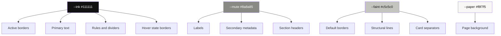

# From Print Pastiche to Intentful Language — Evolving a Design System by Subtraction

This article records how we transformed a mock prototype's visual language from a decorative print pastiche into a consistent, intentful design system. The project is an image collector — a private, single-user archive application for saving images, text fragments, files, and URLs. The prototype had the right aesthetic instinct but carried too much decoration that served no informational purpose. The production build needed every visual element to justify its existence.

> [!summary]
> 1. Start with a prototype's aesthetic, then strip every element that cannot answer "what does this communicate?"
> 2. A typography programme (two sizes, four roles) replaces ad-hoc font-size declarations and enforces visual discipline at the CSS level.
> 3. Border language must be uniform: same weight, same color token, same state transitions everywhere.
> 4. Removing decoration is not minimalism for its own sake — it is making room for the information that matters.

## Why this note exists

Design systems often grow by accretion. A designer adds a decorative element because it looks good in isolation. Another element mirrors it for symmetry. Within a few iterations, the interface carries visual weight that communicates nothing. This note documents the reverse process: starting from a decorated prototype and systematically removing every element that lacks design justification, then tuning what remains until the visual language is uniform and intentful.

The process is specific to this project, but the principle generalizes. If you are building a production interface from a prototype, the question is not "what can we add?" but "what can we remove without losing meaning?"

## When to use this pattern

Apply this subtraction-based design evolution when:

- You have a working prototype that looks right but carries decorative baggage.
- Multiple people will maintain the CSS, and you need rules that prevent drift.
- The prototype uses multiple font sizes, border styles, or color tokens that serve no distinct purpose.
- You need a visual language where every element can be traced to an informational or structural reason.

Do not apply it when the prototype is already sparse, or when decoration is itself the product (art-directed portfolios, editorial layouts, brand-first marketing sites).

## The starting point: a decorated prototype

The original prototype lived in `original-design/` as a set of standalone HTML files. It used CDN-loaded React, Babel in-browser transpilation, and a global `window.__DATA` mock. The visual language was monochrome, monospace, and print-inspired — thin 1px rules, crop marks in the margins, halftone dot patterns, and binary strings as decorative elements.

The prototype had two versions. Version 1 (v1) offered three switchable font families — IBM Plex Mono, Courier Prime, and VT323 — at multiple sizes. Version 2 (v2) tightened this into what the designer called "Programme № 1": one font family, one weight, two sizes, four typographic roles. The v2 programme was the intended target.

The prototype's margin decorations included:

- Crop marks (L-shaped corner borders mimicking print registration marks)
- Binary strings ("1010   0101   1010") repeated at multiple positions
- A tick column of pipe characters and plus signs running down the left margin
- Halftone SVG smudges (60 random circles)
- A tag column ("/  A /  X /  B /  C C C") on the right margin
- A dot matrix grid (6×8 circles)
- Code reference strings ("00_142 / AA_09 / ZX_17 / Q1")
- A quarter-circle arc SVG
- An "└" L-mark at bottom center
- A scattering of 80 tiny dots near the top

The status bar carried decorative center elements: slash patterns ("/ / / / / / /"), plus signs, dot leaders ("· · · · · · ·"), and three inline dot squares. The search bar had a faux-terminal blinking cursor implemented as a CSS animation. The topbar showed the binary string and four decorative filled squares.

These elements created a print-technical-manual atmosphere. The question was whether any of them communicated something the user needed to know.

## The typography programme

The v2 prototype established a binding rule called Programme № 1:

```
1 family · 1 weight · 2 sizes · 2 cases · 3 values · 4 roles
```

The four roles compose size, color, case, and tracking together:

| Role      | Size    | Color     | Case     | Tracking |
|-----------|---------|-----------|----------|----------|
| `.body`   | 13px    | #111111   | as-typed | 0        |
| `.label`  | 13px    | #8a8a85   | UPPERCASE| 0.06em   |
| `.caption`| 13px    | #111111   | UPPERCASE| 0.06em   |
| `.display`| 28px    | #111111   | as-typed | -0.005em |

The difference between `.label` and `.caption` is color alone: labels recede (mute grey), captions stand out (full ink). Both share the same size, tracking, and case. This distinction is subtle but deliberate. In a metadata row, the key ("TYPE") is a label and the value ("image") is a caption. The eye reads the value first.

This programme has a hard constraint: no other `font-size` or `font-weight` declarations are permitted anywhere in the application. If you find yourself writing `font-size: 14px`, you are violating the programme. This rule is enforced by convention and verified by grep:

```bash
grep -rn "font-size" src/ --include="*.jsx" --include="*.js" | grep -v programme.css
# must return zero results
```

In the production build, we carried this programme forward but changed the font family from Google-hosted IBM Plex Mono to self-hosted Berkeley Mono. The programme's structure remained identical; only the `--family` token's value changed.

## Phase 1: Removing decoration without informational content

The first round of subtraction removed every margin element that could not answer "what does this communicate?" The binary strings, the tick columns, the halftone smudges, the tag columns, the dot matrices, the code references, the arc, the L-mark, and the scatter dots all carried no user-facing information. They established a mood, but mood is not meaning.

Crop marks were initially retained because they frame the content as a "page" — a print registration metaphor that supports the monospace aesthetic. On further review, the user identified these as purely decorative too. They frame nothing that needs framing; the browser window already provides the boundary. They were removed.

The topbar's binary string and four filled squares were removed. The status bar's decorative center elements (slash patterns, dot leaders, plus signs) were replaced with three small indicator dots — a minimal state signal rather than ornamental pattern.

The search bar's blinking cursor was removed. The native text cursor in the input field already communicates "this field is editable." A faux-terminal blink adds a visual-identity signal that conflicts with the application's actual purpose: this is an archive manager, not a terminal emulator.

The brand square (a filled 10×10 black square next to "LINK-COLLECTOR") was removed. The text already identifies the application. A square adds no information.

The status bar's filled dot next to "A PRIVATE ARCHIVE" was removed. The label text already communicates the state; a dot does not add meaning.

## Phase 2: Establishing a border language

With decoration removed, the next problem was structural clarity. In the sparse grid view, item cards had no visual separation. Cards floated in whitespace with no indication of where one ended and the next began. Full borders (all four sides) felt too heavy for the aesthetic.

The solution was a bottom border on each item — a single line beneath each card that provides visual grouping without boxing the content. This border went through several iterations:

**Iteration 1**: Dashed, ink-colored. A dashed line at the bottom of each card. The dashes read as too decorative at this scale — they introduced a rhythm that distracted from the content.

**Iteration 2**: Solid, ink-colored. Cleaner, but felt heavy. Every card had a strong black line beneath it, demanding attention that the border itself did not deserve.

**Iteration 3**: Solid, ink-colored, fainter by default, full on hover. The border used `var(--mute)` (#8a8a85) by default and switched to `var(--ink)` (#111111) on hover. This introduced a state-dependent border — the card becomes more defined when the user points at it.

**Iteration 4**: Solid, mute-colored, with full-card opacity. The entire card dims to 60% opacity by default and snaps to 100% on hover. The border color stays mute at rest and turns full ink on hover. This makes the hovered card the focal point — the card the user is considering acting on.

**Iteration 5**: Dotted borders on all components. Buttons, tags, inputs, badges, collection cards, the search bar, the modal, the detail viewer — everything got `2px dotted var(--mute)` borders. The idea was that dotted borders would be lighter than solid ones. In practice, at 1px, CSS `border-style: dotted` renders as a near-solid line because the dot spacing is too tight. At 2px, the dots are visible but feel fussy — they introduce a visual vibration that distracts from content.

**Iteration 6**: Solid 1px faint grey everywhere. All borders became `1px solid var(--faint)` where `--faint` is `#c5c5c0` — a very light grey, lighter than `--mute` (#8a8a85). The border is present enough to show structure but recedes far enough to not compete with content. On hover or active state, borders flip to `1px solid var(--ink)` (#111111) — full black.

This final state is the current border language:

- **Default**: `1px solid var(--faint)` — visible but receding
- **Hover / active / on**: `1px solid var(--ink)` — full presence
- **Selected / on-state buttons**: Solid ink, no faint border — the button is already highlighted by its inverted fill

The key insight is that border weight and style must be uniform across the entire interface. If one component uses a dotted border and another uses a solid border, the viewer spends cognitive energy trying to determine whether the difference is meaningful. Uniformity removes that question.

## The color token hierarchy

The evolution of borders also produced a three-level grey hierarchy:

| Token      | Hex       | Purpose                                           |
|------------|-----------|---------------------------------------------------|
| `--ink`    | `#111111` | Primary text, active borders, rules, full-strength signals |
| `--mute`   | `#8a8a85` | Labels, secondary text, dimmed metadata            |
| `--faint`  | `#c5c5c0` | Default borders, structural lines that should recede |

This hierarchy serves a specific reading order. When the user scans a page, ink elements hold attention first, mute elements provide context, and faint elements define spatial structure without demanding focus. The three tokens prevent the common failure mode where a single mid-grey is used for both borders and text, making borders too prominent or text too faint.

## Phase 3: Removing structural decoration

The header and footer were originally separated from the content area by solid horizontal rules — 1px black lines spanning the full width. These rules acted as section dividers, but the spacing and typography already establish the hierarchy. The header's grid layout, the content's grid, and the footer's grid are each visually distinct. A rule between them adds a visual break that the layout already provides through whitespace.

Removing the rule between header and content, and the `border-top` on the status bar, produces a cleaner separation. The space between sections is enough. If it is not enough, the spacing tokens (`--u3`, `--u4`, `--u8`) should be adjusted rather than inserting a line to compensate for insufficient spacing.

## The display size removal

The metabar's item count ("016 items") originally used the `.display` role — 28px text, the largest size on the page. This made the count the visual focal point of the metabar, drawing the eye before the sort controls or view toggles. The count is reference information, not the primary action. Changing it to the same 13px uppercase tracked text as labels removes its visual dominance and integrates it into the metabar's information hierarchy.

This change also enforces the programme more strictly. The `.display` role should be reserved for moments that genuinely need to hold the eye — an item's name in a detail view, a collection's name, a modal title. An item count does not warrant that weight.

## The background color adjustment

The original background was `#f4f1ea` — a warm, distinctly beige off-white. The warmth comes from the yellow-brown undertone in the hex value. Changing to `#f8f7f5` reduces the warmth while preserving the off-white quality that distinguishes the background from pure white (#ffffff). Pure white reads as digital and clinical; an off-white reads as paper. The adjustment keeps the paper metaphor but makes it less pronounced, so the background does not announce itself as "beige" to the viewer.

## Working rules

These rules emerged from the evolution and should govern future changes to this design system:

1. **Every element must answer "what does this communicate?"** If the answer is "it sets a mood" or "it looks like a print artifact," the element belongs in a museum, not in the interface.

2. **Border language must be uniform.** Same weight (1px), same default token (`--faint`), same hover token (`--ink`), same style (solid). Exceptions require explicit justification.

3. **The programme is binding.** No `font-size` or `font-weight` outside `programme.css`. Four roles only. If a piece of text needs to be larger, it should use `.display`. If it needs to be smaller, reconsider whether it needs to exist.

4. **Spacing does the work of lines.** If two sections need separation, increase the spacing between them before inserting a rule. Rules are for structural breaks within a section, not for separating sections that already have distinct layouts.

5. **State transitions preserve dimensions.** When a border changes width or color on hover, compensate the padding so the box dimensions remain stable. A 1px border becoming 2px without padding compensation causes a 1px layout shift — visible as a jitter.

6. **Faint is for structure, mute is for text.** Borders use `--faint`. Labels and secondary text use `--mute`. If a border and a label share the same grey, the border competes with the text for attention.

7. **Subtraction before addition.** When something feels visually wrong, the first move should be to remove an element, not to add one. The prototype had too many visual signals competing for attention. Removing the loudest ones let the remaining signals do their job.

## Anti-patterns observed

**Decorative consistency trap.** It is tempting to add decorative elements consistently — if one margin has a binary string, all margins should have one. Consistency in decoration is still decoration. Consistent removal is the better direction.

**Dotted-border lightness assumption.** CSS `border-style: dotted` is often chosen because it feels "lighter" than solid. At 1px, the dots merge into a near-solid line. At 2px, the dots are individually visible but introduce visual vibration. Solid 1px in a faint color achieves the "light but present" quality that dotted borders promise but do not reliably deliver.

**Hover as emphasis rather than state.** Early iterations made hovered borders thicker (1px → 2px), which caused layout shifts. Hover should communicate "this element is being considered for action," not "this element is now more important." A color shift (faint → ink) and an opacity shift (0.6 → 1.0) communicate state without changing dimensions.

**The display-size temptation.** When a number feels important, the instinct is to make it big. The item count at 28px dominated the metabar without adding information that 13px could not convey. Reserve large type for moments where the user needs to identify something from a distance or where the text is the primary content of the view.

## Pseudocode: the border state machine

The border language follows a simple state machine. Every bordered component defaults to the same state and transitions on the same triggers:

```
State: default
  border: 1px solid var(--faint)
  opacity: varies by component (1.0 for chrome, 0.6 for cards)

On hover:
  border: 1px solid var(--ink)
  opacity: 1.0

On active/selected:
  background: var(--ink)
  color: var(--paper)
  border: 1px solid var(--ink)

On ghost (transparent borders):
  border: 1px solid transparent
  On hover:
    border: 1px solid var(--ink)
    background: transparent
    color: var(--ink)
```

The important constraint is that `1px` never changes. The border width is constant across all states. Only the color and the element's fill change. This eliminates layout shifts entirely.

## Architecture: CSS token flow



## Implementation sequence for applying this pattern

1. **Audit the prototype.** List every visual element and categorize it: informational, structural, or decorative. Remove every decorative element.

2. **Establish the colour token hierarchy.** Define at minimum three greys (ink, mute, faint) plus the background. Document what each is for.

3. **Write the programme CSS.** Two sizes, four roles. No other font-size or font-weight permitted. Enforce by convention and grep.

4. **Unify the border language.** One weight, one default token, one hover token, solid style only. Apply to every bordered component.

5. **Remove structural decoration.** Rules between major sections, brand marks, indicator dots — remove them and let spacing and typography do the work.

6. **Verify with subtraction tests.** Hide each remaining element in turn. If the interface still communicates its content without that element, the element is decorative. Consider removing it.

7. **Check for dimension stability.** Hover every interactive element. If anything shifts, compensate padding or ensure border width is constant across states.

## Related notes

The ticket workspace for this project is at `ttmp/2026/05/19/IC-001--image-collector-react-rtk-query-vite-production-build/` in the repository. The implementation guide and design system document there contain the full technical specification. The diary records each step of the evolution with exact errors and commit hashes.
