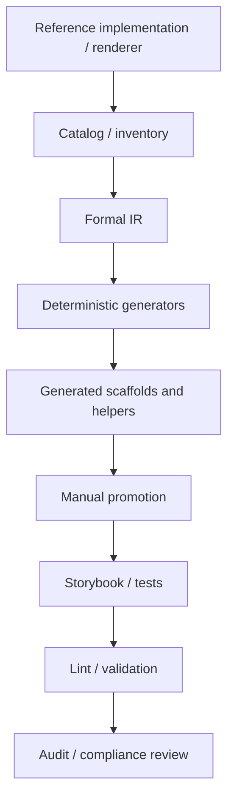
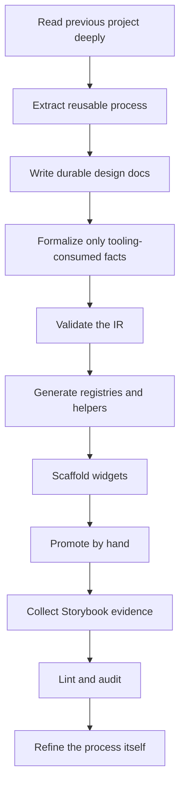

# Meta-Design Systems: Carrying HAIR-041 into a Reusable Design-System Factory

When teams talk about "building a design system," they usually mean one of two things. Sometimes they mean a component library: a set of tables, drawers, panels, badges, menus, and utility hooks that a frontend team can import and compose. At other times they mean a visual language: a set of tokens, spacing rules, typography roles, and interaction expectations that make many screens feel like they belong to the same family.

The work around DMETA started from a third interpretation. A design system can also be a **factory**: a rigorous authoring process with documents, schema artifacts, validators, generators, review passes, promotion rules, and audit loops. In that interpretation, the design system is not merely the output. The design system is also the method by which the output is produced, checked, and evolved.

That is the real subject of this note. It is not mainly about the particular dense operational UI system now being built in DMETA. It is about the meta-approach that emerged when we carried a large body of work out of HAIR-041 and tried to understand what in it was local to the hair-booking admin DSL and what in it was a reusable engineering process.

> [!summary]
> - HAIR-041 provided more than widgets and YAML files; it provided a **process architecture** for design-system work.
> - DMETA reused that process architecture, then inserted a new earlier semantic layer: archetypes, capabilities, presentations, and typed actions.
> - The key engineering move was to keep **Markdown for reasoning** and **YAML for machine-consumed facts**, instead of pretending everything should be formalized at once.
> - The current value of DMETA is not yet a finished design system. It is a disciplined pipeline: source reading, durable documents, compact IR, validator, planned generators, and audit-friendly boundaries.

## Why this note exists

If you only look at the resulting files, you can miss the hard part of the work. The hard part was not writing one more YAML file or inventing one more visual theme. The hard part was learning how to **read a previous design-system project as a knowledge source**.

HAIR-041 was already a serious piece of work. It had a widget IR catalog, a widget-definition YAML format, a design-language IR, scaffolding scripts, promotion playbooks, Storybook coverage tracking, review guides, audit diaries, and compliance reports. In other words, it already contained the answer to a more interesting question than "how do we style a table?"

The more interesting question was this:

> What does it take to make design-system work rigorous enough that it can be taught, reviewed, generated, linted, audited, and reused?

That question is relevant to both designers and programmers.

- Designers need to know how visual and interaction rules become durable artifacts rather than vague taste.
- Programmers need to know how to keep a design-system codebase from collapsing into undocumented local conventions.
- Both groups need a way to move from examples and references to a structure that can survive the next project.

This note exists to make that structure explicit.

## The first lesson: do not start from a blank whiteboard

There is a recurring failure mode in technical design work: a team begins a new project and assumes that the correct way to be principled is to start over at the most abstract level. They draw a new architecture diagram, rename every concept, and act as if the previous project's hard-earned constraints are an embarrassment to be escaped rather than a body of knowledge to be mined.

That is almost always a mistake.

What made the DMETA work productive was that it started by **importing and reading** a substantial amount of HAIR-041 material before trying to define the new system. The imported materials were not only source code. They included:

- a widget IR catalog;
- a widget-definition YAML specification;
- a design-language IR;
- a pass model;
- shared type YAML;
- widget family YAMLs;
- a Storybook coverage manifest;
- implementation playbooks;
- review playbooks;
- audit guides;
- review diaries;
- technical articles written after the fact.

This matters because a previous project rarely gives you a perfect answer. But it often gives you something better: **a landscape of solved and unsolved problems**. That landscape is what a good follow-on project should read.

## Reading a previous project correctly

The naive way to read HAIR-041 would have been: "Here are some widget YAML files and a generator. Let's copy that pattern."

The more useful way was slower.

First, identify the different classes of artifact in the older project.

| Artifact class | Question it answers |
| --- | --- |
| Design docs | What did the team think it was building, and why? |
| YAML IR | Which facts had become formal enough for tools to consume? |
| Scripts/generators | Which transformations were already deterministic? |
| Playbooks | Which manual procedures were considered important enough to standardize? |
| Audit/review docs | Where did the process still drift or fail? |
| Diaries | What actually happened in practice, including mistakes and course corrections? |

Second, distinguish **local structure** from **reusable structure**.

For example, HAIR-041 had widget families like:

- shell widgets;
- action widgets;
- layout widgets;
- resource widgets;
- calendar widgets;
- form widgets;
- form-field widgets;
- surface widgets.

Those family names were partly specific to the admin DSL domain. But the underlying pattern was reusable: widgets had a catalog, a formal IR, generated scaffolds, metadata sidecars, stories, validation, and review.

Third, read the negative evidence. Audit reports and compliance diaries are often more educational than polished architecture notes, because they show what breaks when a system is used at scale.

That is one of the strongest lessons from HAIR-041: the rigorous framework did not come only from forward design. It also came from review, drift detection, and process repair.

## The second lesson: the process itself is an architecture

A project like HAIR-041 does not just produce a frontend. It produces an architecture of **work stages**.

A simple way to draw that architecture is this:



What matters here is not whether every project uses exactly these names. What matters is the recognition that a design-system effort has multiple artifact layers and that each layer has different responsibilities.

This is why the process is itself an architecture.

- The catalog says what exists.
- The IR says what is formal.
- The generator says what is deterministic.
- The promoted code says where human judgment is still required.
- The Storybook and review artifacts say what evidence exists.
- The validator and linter say what invariants can be checked.

Once you see a project this way, you stop asking only "what components should we have?" and start asking more useful questions:

- What belongs in the IR and what belongs in prose?
- Which transformations should be generated, and which should be promoted by hand?
- Where should design decisions become lintable rules?
- Which artifacts carry the design memory of the system?
- Which stage catches drift when the implementation diverges from the intended semantics?

Those are the questions that produce a reusable framework.

## What DMETA inherited directly from HAIR-041

Several parts of the older project transferred almost unchanged.

### 1. Markdown for reasoning, YAML for tool inputs

This is the most deceptively important rule.

HAIR-041 did not try to encode all design reasoning in YAML. Its most useful durable materials were split cleanly:

- Markdown for explanations, guides, analysis, audits, and reviews.
- YAML for source artifacts that generators and validators would actually consume.

DMETA kept that rule deliberately.

The result is a layered documentation structure:

```text
Markdown:
  vision and scope
  semantic model rationale
  visual archetype rationale
  concrete system specs
  implementation guides
  diaries and changelogs

YAML:
  source IR package
  design-language package
  widget IR
```

This is not clerical housekeeping. It is a design decision about what is stable enough to be formalized.

If a team ignores this distinction, one of two bad things happens:

- either too much stays in prose and never becomes executable;
- or too much is forced into configuration before the concepts are stable enough to deserve it.

The HAIR-041 inheritance is the judgment about where to draw that line.

### 2. Deterministic generation plus manual promotion

A generator is valuable when it handles the repetitive structural work that humans should not repeat by hand. It becomes dangerous when it starts pretending to replace design and implementation judgment.

HAIR-041 showed a good boundary. Generation handled:

- layout of source files;
- type scaffolds;
- metadata sidecars;
- helper modules;
- story stubs.

Promotion handled:

- final React structure;
- nuanced interaction;
- accessibility behavior;
- local visual detail;
- the parts of the implementation where correctness depends on interpretation.

DMETA inherited this boundary exactly. The validator exists. The TypeScript core registry generator is designed. Future design-helper and widget-scaffold generators are planned. But no one is pretending that a dense operational table or drawer should be fully generated and considered finished.

The phrase to remember is simple:

> Generate structure. Promote behavior.

### 3. Storybook as evidence, not decoration

HAIR-041 treated Storybook as a coverage system rather than a gallery of nice-looking screenshots. That move is easy to underestimate. It means that a story is not just a demo. It is evidence that a widget state, configuration, or semantic scenario is actually represented in the implementation.

DMETA inherits this mindset even before the Storybook layer exists. The future widget scaffolding and validation plan assume that stories will prove states such as:

- selected;
- candidate for action argument filling;
- different semantic tones;
- compact versus regular density;
- relation-rich detail states.

This is a direct carry-over of process discipline.

### 4. Audit and diary culture

The diaries and audit artifacts in HAIR-041 are one of the strongest signals that the project understood itself as a process. They capture not only what was planned, but what broke, what drifted, and what had to be cleaned up.

DMETA adopts the same habit:

- every ticket has a diary;
- source imports are recorded;
- scope corrections are recorded;
- design changes are recorded;
- concrete spec changes and validator updates are recorded.

For a meta-design-system effort, this is not optional documentation. It is part of the system’s memory.

## What DMETA changed

If DMETA had only copied HAIR-041, it would have been a weaker project. The whole point was to reuse the process while changing the conceptual starting point.

### The shift from widget-first to semantic-first

HAIR-041 was grounded in a widget-definition IR derived from a concrete admin/backend renderer. DMETA inserted a new layer **before** widgets:

- archetypes;
- capabilities;
- presentations;
- typed actions.

This changes the question from:

> What widgets exist?

to:

> What kinds of semantic things can appear on the screen, and what operations become valid when they do?

That shift is the real conceptual move of DMETA.

### The shift from domain nouns to archetypes

A dense operational system almost always has recurring structures, but the names differ by domain.

- In agent systems: agent, tool run, tool event, session.
- In logistics: carrier, shipment, scan event, warehouse.
- In monitoring: service, incident, metric, alert event.

DMETA's archetype model exists so that these differences do not force the process to start over. The point is not to erase domain distinctions. The point is to ask whether two domain objects are structurally similar enough that they should share presentation, action, and widget logic.

That is why `ToolRun` and `Shipment` both become `WorkItem` under the right conditions.

### The shift from one visual theme to a visual archetype

HAIR-041 provided the idea of a design-language IR. DMETA pushed that idea toward a reusable visual archetype rather than one fixed skin.

The current target is a sober dense operational UI:

- subtle cool-grey or neutral surfaces;
- no decorative background noise;
- low chrome;
- typographic hierarchy;
- compact density modes;
- semantic status color;
- explicit states for focus, selection, action candidates, and active context.

This is an important change in how designers and programmers collaborate. The design language is not merely a theme library. It is a constrained semantic system whose rules can later become helper functions and lint checks.

## The third lesson: design-system rigor requires a trust boundary

At some point, every meta-system has to become executable. Otherwise it remains a very elaborate conversation.

DMETA-002 was important because it established the first trust boundary: the validator.

Before a generator exists, before widgets are scaffolded, before React code is emitted, the project can now ask:

> Is the current IR coherent enough to trust?

That is a profound moment in a design-system effort. The work moves from architecture prose to executable semantics.

The command is simple:

```bash
GOWORK=off go run ./cmd/dmeta validate-ir --root ./sources/dmeta-ir --include-info --output table
```

But the significance is larger than the command suggests. A validator does three things.

1. It defines a machine-checkable boundary around the authoring language.
2. It establishes that generators should build on a trusted loaded package rather than on ad hoc file parsing.
3. It gives the team confidence that future tool output is based on coherent references.

The validator is therefore not only a utility. It is the enforcement point that makes the process rigorous.

## The fourth lesson: context itself has to become a formal artifact

One of the latest changes to DMETA may look minor from the outside but is actually central to the process.

The first `01-core-model.yaml` was becoming too large, and the user pointed out something crucial: the model needed **more prose**, not less. The archetypes and capabilities needed longer written explanations so that interns, reviewers, future generators, and LLM-assisted workflows would have enough context to interpret the IDs and projections correctly.

That requirement forced a design change:

```text
01-core-model.yaml
  -> package/index file
core-model/
  -> core-model.yaml
  -> archetypes.yaml
  -> capabilities.yaml
  -> presentations.yaml
  -> examples/*.yaml
```

This is a beautiful example of the meta-approach working correctly. The project did not respond by saying, "No, formal IR should be terse." Instead, it recognized that **context is part of the system**.

The consequence was twofold:

- the semantic package was split into reviewable subfiles;
- short descriptions and long-form prose were both made first-class.

That is exactly the kind of move that a rigorous framework enables. The process can change its own artifact structure when the team learns something important about what future readers and tools will need.

## What this means for designers

A designer reading this process should notice something subtle. The design contribution is not only in choosing a look. It is also in deciding which distinctions deserve names and which names deserve persistence.

For example:

- `status_badge` is not merely a visual snippet. It is the expression of `stateful`.
- `compact_ref` is not merely a small line of text. It is the expression of identifiable and labelable subjects.
- focus, selected, candidate, and active are not only CSS states. They are interaction semantics that must remain consistent across many widgets.

This means design work enters the system at multiple levels:

- reference images and implemented prototypes;
- visual archetype documents;
- design-language ranges;
- style recipes;
- lintable rules;
- Storybook evidence;
- review playbooks.

That is a much richer role than "create a token palette."

## What this means for programmers

A programmer reading this process should notice that the main job is not writing component code first. The main job is preserving the boundaries between:

- prose reasoning;
- formal IR;
- validation;
- generation;
- runtime adapter code;
- promoted implementation;
- audit and review.

If those boundaries hold, the system can grow. If they collapse, the project becomes a tangle of one-off conventions.

That is why several rules keep recurring:

- load the IR through the validator package;
- validate before generation;
- sort keys and keep generated output deterministic;
- generate metadata and helpers before generating UI;
- keep runtime transport separate from widget contracts;
- preserve manual promotion as a first-class step.

Programmers often want to move quickly toward the visible code. The HAIR-041 → DMETA carry-over says: move just slowly enough that the visible code will still make sense when there are fifty more files and three more domains.

## A concrete mental model

If you want one compact picture of the whole approach, use this:



The final step matters. A rigorous framework is not static. It learns by being used.

## What comes next

At the moment, DMETA has:

- long-term design and process documents;
- a split semantic package with richer prose context;
- a design-language package;
- a widget IR;
- a working validator;
- a reviewed design for the next generator.

The next implementation step is not another conceptual rewrite. It is the TypeScript core registry generator. That generator should prove that the validated semantic package can become a usable frontend API.

If that works, the next steps follow naturally:

- design helper generation;
- widget scaffolding;
- Storybook coverage;
- promotion of the first concrete widgets;
- instantiation of the process in multiple domains.

At that point the meta-approach will have justified itself. It will not only describe a way of thinking about design systems. It will produce them.

## Working rules

The practical rules that emerged from this work are worth stating directly.

- Read previous projects as process knowledge, not just as code to mine.
- Keep long-form reasoning in Markdown and tooling facts in YAML.
- Treat validators and generators as part of the design system, not as optional automation.
- Preserve manual promotion where judgment still matters.
- Use review, audit, and diary artifacts to detect drift.
- Generalize from concrete domains to semantic archetypes, but do not erase domain pressure.
- Give formal IR enough prose context to be understandable without chat history.
- Let the process evolve when the artifacts reveal a new need.

## Related notes

- [[ARTICLE - Playbook - A DSL for Creating Design Systems]]
- [[ARTICLE - Playbook - Self-Contained Go Wasm and JavaScript Browser Applications]]
- [[ARTICLE - From Print Pastiche to Intentful Language - Evolving a Design System by Subtraction]]
- [[ARTICLE - DMETA Design System Factory - From Semantic Archetypes to Validated IR]]
