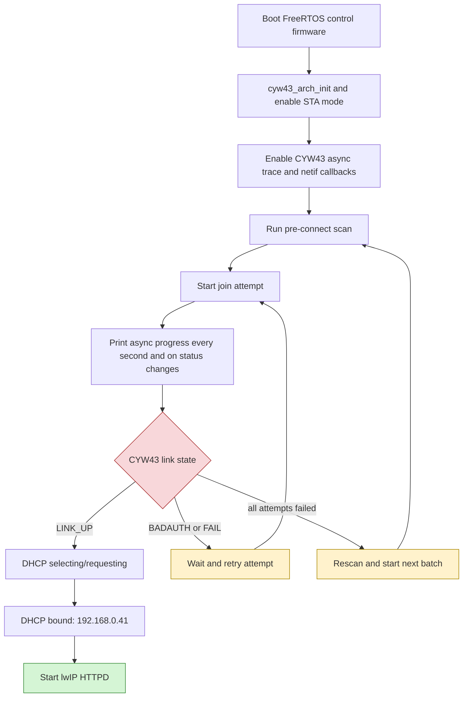

# Pico 2 W Wi-Fi Association Debugging: A CYW43/FreeRTOS Deep Dive

This article records a debugging session around Pico 2 W Wi-Fi reliability inside a PicoCalc. The immediate project goal was to build a PicoCalc terminal-client firmware: a Pico SDK application that exposes HTTP rendering endpoints for the PicoCalc display and later streams keyboard events over WebSocket. The work reached the point where the display, keyboard, HTTP endpoints, and host-facing protocol shape were clear, but station-mode Wi-Fi reachability on the existing `yolobolo` network became the gating issue.

The final lesson of this investigation is precise: the most important observed failures were not HTTP failures, not display failures, and not DHCP failures. They occurred before DHCP. The CYW43 radio could scan the target AP, and successful joins could bind DHCP quickly, but many attempts failed during 802.11 association, authentication, or WPA key exchange. The trace evidence showed `SET_SSID` reporting no network, `AUTH` reporting no ACK, and `PSK_SUP` reporting deauthentication before the supplicant reached the keyed state.

> [!summary]
> - The PicoCalc terminal-client design depends on stable Pico 2 W station networking before WebSocket keyboard streaming is worth implementing.
> - FreeRTOS/lwIP SYS mode proved the path can work by serving HTTP at `192.168.0.41`, but connection success remained intermittent.
> - Detailed CYW43 traces narrowed the failure to pre-DHCP Wi-Fi association/authentication/WPA handshake events.
> - The next controlled experiments are BSSID-pinned joins, a simple WPA2-only hotspot, router compatibility settings, and Pico SDK 2.2.0.

## 1. The project context

The terminal-client firmware is meant to turn the PicoCalc into a network-attached display and keyboard endpoint. A host program sends drawing operations to the PicoCalc over HTTP, and the PicoCalc executes those operations against its 320 × 320 display. A later WebSocket endpoint will stream normalized keyboard events back to the host. That design makes the PicoCalc usable as a small remote terminal, dashboard, handheld UI surface, or application-specific console.

The repository already had the two required hardware tracks. `pico-sdk-picocalc-wm/` proved that the display and keyboard could be driven from Pico SDK code without Arduino libraries. `pico-sdk-wifi-repl/` proved that a Pico 2 W target could expose raw-lwIP HTTP diagnostics and Wi-Fi controls. The new `pico-sdk-terminal-client/` combined these ideas into one firmware: display initialization, keyboard polling, serial diagnostics, raw-lwIP HTTP request handling, and first rendering endpoints.

The first render API was intentionally simple:

```text
GET  /v1/info
POST /v1/display/clear?color=0000
POST /v1/draw/fill-rect?x=...&y=...&w=...&h=...&color=...
POST /v1/display/blit?x=...&y=...&w=...&h=...&fmt=rgb565
POST /v1/terminal/write
```

This was enough to validate that the PicoCalc could be treated as a remotely drawn surface. The next protocol step would normally be WebSocket keyboard streaming. Instead, the investigation shifted to Wi-Fi because a terminal protocol is only useful when the device can be reached reliably.

## 2. The first symptom: packets moved only after CYW43 interactions

The earliest station-mode behavior was inconsistent. The Pico 2 W could scan the target network, often associate enough to obtain or almost obtain an IP address, and sometimes respond to pings. But traffic frequently appeared to flush only after local CYW43 interactions such as `pm none`, `pm get`, or other status operations.

A representative diagnostic state looked like this:

```text
wifi=1(joined) tcpip=1(joined) netif-up=1 link-up=0 dhcp=6(selecting)
tries=2 ip=0.0.0.0 offered=0.0.0.0 gw=192.168.0.1 mask=255.255.255.0
```

Later, after DHCP restarts or enough local activity, the device sometimes reached a bound address:

```text
NETIF status name=w0 up=1 link=1 dhcp=10(backing-off) tries=0
ip=192.168.0.41 gw=192.168.0.1 mask=255.255.255.0
```

The `dhcp=10(backing-off)` label was later corrected. In the lwIP version used here, state `10` is `bound`; state `12` is `backing-off`. That correction matters because it changes the interpretation of successful traces: once the CYW43 link reached the proper keyed/link-up state, DHCP usually completed quickly and correctly.

The initial packet-flush symptom created several hypotheses:

- The firmware might not be polling CYW43/lwIP often enough.
- CYW43 power management might be preventing timely receive wakeups.
- The AP might be interacting badly with the CYW43439 radio or its firmware.
- The PicoCalc enclosure might be weakening or detuning the antenna.
- RP2350-specific SDK or DMA/runtime behavior might be affecting the CYW43 path.

The rest of the investigation progressively eliminated or narrowed these hypotheses.

## 3. Why a control firmware was necessary

The terminal-client firmware contained display, keyboard, HTTP routing, render queues, and station diagnostics. That made it useful as an integration target but too complex as the only Wi-Fi test case. A good debugging strategy separates the failing subsystem from unrelated code. The investigation therefore added control firmwares that were closer to Raspberry Pi examples.

The controls were:

```text
pico-sdk-official-httpd-control/
  A local copy of the Pico SDK HTTPD example using pico_lwip_http.

pico-sdk-freertos-httpd-control/
  A local copy of the Pico SDK FreeRTOS HTTPD example using
  pico_cyw43_arch_lwip_sys_freertos.
```

The important distinction is the lwIP service model. The original terminal-client and Wi-Fi REPL used NO_SYS-style raw-lwIP or poll/background integration. The FreeRTOS control used the lwIP SYS integration with `pico_cyw43_arch_lwip_sys_freertos`. If the FreeRTOS control could serve HTTP reliably, it would indicate that the AP, hardware, and laptop path were not fundamentally impossible.

The first FreeRTOS result was promising. It connected, got an IP address, and served the website:

```text
Starting FreeRTOS on core 0:
Connecting to WiFi ssid='yolobolo' timeout=120000ms...
wifi pm none err=0
before-connect wifi=0(down) tcpip=0(down) netif-up=1 link-up=0 ip=0.0.0.0

after-connect wifi=1(joined) tcpip=3(up) netif-up=1 link-up=1
ip=192.168.0.41 gw=192.168.0.1 mask=255.255.255.0
Connected.
mdns host name PicoW2E7A.local

Ready, running httpd at 192.168.0.41
```

That run proved the network path could work. The same firmware later panicked with an lwIP timeout-pool exhaustion:

```text
*** PANIC ***

sys_timeout: timeout != NULL, pool MEMP_SYS_TIMEOUT is empty
```

The fix was to increase the lwIP timeout pool:

```c
#define MEMP_NUM_SYS_TIMEOUT (LWIP_NUM_SYS_TIMEOUT_INTERNAL + 16)
```

That panic was a resource-sizing issue, not the association failure. After the pool change, another boot failed to connect with `err=-8`, so the FreeRTOS control was not a complete solution. It was still the best diagnostic base because it had already served HTTP once.

## 4. The control firmware became a measurement instrument

The initial FreeRTOS HTTPD example was designed to demonstrate serving a page, not to diagnose intermittent Wi-Fi. The investigation turned it into a measurement instrument. Each change had one purpose: expose the hidden state transition that explained the next failure.

The first change was a retry loop. A single failed call to `cyw43_arch_wifi_connect_timeout_ms()` is not enough evidence in an intermittent environment. The control firmware was changed to run multiple attempts:

```text
WIFI_CONNECT_TIMEOUT_MS       45000
WIFI_CONNECT_ATTEMPTS         6
WIFI_CONNECT_RETRY_DELAY_MS   2000
```

Each attempt performed the same basic recovery sequence:

```text
cyw43_wifi_leave()
delay 250 ms
cyw43_arch_enable_sta_mode()
cyw43_wifi_pm(CYW43_NONE_PM)
print before-connect status
connect
print after-connect status
```

The retry loop immediately proved its value. In one run, attempts 1 through 4 failed and attempt 5 succeeded. That observation changed the problem statement. The question was no longer whether the Pico 2 W could join the network. It could. The question was why the same join sequence succeeded on one attempt and failed on another.

The second change was scan and RSSI logging. The firmware printed every scan result, marked the target SSID with `target=1`, and recorded connected RSSI through `cyw43_wifi_get_rssi()`.

A successful scan showed the target AP clearly:

```text
scan target=1 ssid='yolobolo' rssi= -61 chan=  1 sec=5(wpa2+privacy)
bssid=12:a7:93:fc:99:3e
```

Successful joins reported connected RSSI around `-59` to `-63 dBm`:

```text
after-connect wifi=1(joined) tcpip=3(up) netif-up=1 link-up=1
ip=192.168.0.41 rssi=-61 bssid=12:a7:93:fc:99:3e
```

Those numbers are not excellent, but they are adequate. They also weaken the simplest antenna-only explanation. If the target AP is visible at approximately `-60 dBm` and can sometimes complete DHCP quickly, then the radio path exists. Enclosure and antenna placement may still contribute to the failure rate, but they do not fully explain the behavior.

The third change was to avoid parking forever after a failed batch. A diagnostic harness should not stop after six failures when the observed system is intermittent. The firmware was changed to run an outer loop:

```text
scan
six connection attempts
if all fail:
    print cycle-failed
    wait 5000 ms
    scan again
    retry forever
```

This produced unattended evidence. Some cycles saw no target AP. Some cycles saw the target AP and failed anyway. Some cycles eventually connected.

## 5. Blocking connect hid the important part

The most important instrumentation change was replacing the blocking connection call with an async join and an observable wait loop.

The SDK wrapper hides intermediate states:

```c
cyw43_arch_wifi_connect_timeout_ms(...)
```

With that call, the log shows only two points:

```text
before-connect ...
```

then a long pause, then:

```text
after-connect ...
```

That is insufficient. A failed connection can fail at many layers: scan, authentication, association, link-up, WPA key exchange, DHCP, address conflict detection, ARP, or application reachability. The control firmware needed to print progress while the join was happening.

The custom async join loop had this shape:

```c
start = now()
deadline = start + WIFI_CONNECT_TIMEOUT_MS
err = cyw43_arch_wifi_connect_async(ssid, password, CYW43_AUTH_WPA2_AES_PSK)

while now() < deadline:
    status = cyw43_tcpip_link_status(&cyw43_state, CYW43_ITF_STA)

    if status changed or one second elapsed:
        print wifi status, tcpip status, netif link, DHCP state, RSSI, BSSID

    if status == CYW43_LINK_UP:
        return success

    if status == CYW43_LINK_BADAUTH:
        return bad auth

    if status == CYW43_LINK_FAIL:
        return connect failed

    if status == CYW43_LINK_NONET:
        restart async join

    delay 250 ms

return timeout
```

The status printer included both CYW43 and lwIP state:

```text
wifi=<n>(<name>) tcpip=<n>(<name>)
netif-up=<0|1> link-up=<0|1>
dhcp=<n>(<name>) tries=<n> xid=<hex>
ip=<addr> offered=<addr> gw=<addr> mask=<addr>
rssi=<dBm> bssid=<mac>
```

This was the step that separated association failures from DHCP failures.

A repeated failed attempt looked like this:

```text
connect[1]+54ms wifi=1(joined) tcpip=1(joined)
netif-up=1 link-up=0 dhcp=2(init) tries=0 xid=00000000
ip=0.0.0.0 offered=0.0.0.0 rssi=0 bssid=00:00:00:00:00:00

connect[1]+2182ms wifi=1(joined) tcpip=1(joined)
netif-up=1 link-up=0 dhcp=2(init) tries=0 xid=00000000
ip=0.0.0.0 offered=0.0.0.0 rssi=0 bssid=00:00:00:00:00:00

connect[1]+3020ms wifi=-1(fail) tcpip=-1(fail)
netif-up=1 link-up=0 dhcp=2(init) tries=0 xid=00000000
```

The key detail is `dhcp=2(init)` with `xid=00000000`. DHCP never started. There was no DHCP discover, no offer, no request, and no bind. The netif link never came up, the BSSID remained all zeroes, and RSSI remained zero. These attempts failed before lwIP had a real link to configure.

A successful attempt looked different:

```text
connect[1]+3020ms wifi=1(joined) tcpip=2(no-ip)
netif-up=1 link-up=1 dhcp=6(selecting) tries=1 xid=56f9b8d9
ip=0.0.0.0 offered=0.0.0.0 rssi=-60 bssid=12:a7:93:fc:99:3e

connect[1]+4814ms wifi=1(joined) tcpip=3(up)
netif-up=1 link-up=1 dhcp=10(bound) tries=0 xid=56f9b8d9
ip=192.168.0.41 offered=192.168.0.41 rssi=-59 bssid=12:a7:93:fc:99:3e
```

Once `link-up=1`, BSSID and RSSI appeared. DHCP then completed in less than two seconds. The DHCP path was healthy after the CYW43 link became real.

## 6. The CYW43 async event trace identified the failure layer

The next diagnostic layer was CYW43 async event tracing:

```c
cyw43_state.trace_flags |= CYW43_TRACE_ASYNC_EV;
```

The firmware also installed lwIP netif callbacks:

```text
NETIF link name=w0 up=1 link=1 ip=0.0.0.0
NETIF status name=w0 up=1 link=1 dhcp=10(bound) ip=192.168.0.41
```

With these enabled, failed and successful attempts had distinct event signatures.

### 6.1 Failure mode A: active join cannot lock onto the AP

One repeated failure signature was:

```text
ASYNC(...,SET_SSID,3,0,0)
connect[...] wifi=-2(no-net)

ASYNC(...,AUTH,5,0,0)
ASYNC(...,SET_SSID,1,0,0)
connect[...] wifi=-1(fail)
```

The CYW43 status constants decode these lines:

```text
SET_SSID status 3  = CYW43_STATUS_NO_NETWORKS
AUTH status 5      = CYW43_STATUS_NO_ACK
SET_SSID status 1  = CYW43_STATUS_FAIL
```

This is not a DHCP failure. The firmware had just scanned the target network in some runs:

```text
scan target=1 ssid='yolobolo' rssi= -60 chan= 1 bssid=12:a7:93:fc:99:3e
```

Yet the join path reported no networks or failed to get an ACK during authentication. That suggests active join/search behavior, management-frame reliability, AP compatibility, or multi-BSSID selection behavior.

### 6.2 Failure mode B: association succeeds, then WPA key exchange is interrupted

A second failure signature went farther:

```text
ASYNC(...,ASSOC_REQ_IE,0,0,0)
ASYNC(...,AUTH,0,0,0)
ASYNC(...,ASSOC_RESP_IE,0,0,0)
ASYNC(...,ASSOC,0,0,0)
ASYNC(...,LINK,0,0,0)
ASYNC(...,PSK_SUP,4,14,0)
ASYNC(...,DEAUTH_IND,0,2,0)
ASYNC(...,LINK,0,2,0)
```

This means association and authentication began successfully. The failure happened during the WPA supplicant phase.

The relevant CYW43 definitions are:

```text
PSK_SUP status 4   = CYW43_SUP_AUTHENTICATED / waiting for key exchange M1
PSK_SUP reason 14  = CYW43_REASON_SUP_DEAUTH / received FC_DEAUTH
PSK_SUP status 6   = CYW43_SUP_KEYED
```

The successful path must reach `PSK_SUP,6,0,0`. In this failure, it reached `PSK_SUP,4,14,0`, which means the supplicant was authenticated but received a deauthentication before completing the key exchange.

The password was not statically wrong, because later attempts succeeded with the same credentials. The event should be interpreted as transient WPA handshake failure, AP policy/compatibility behavior, management-frame loss, or driver/AP timing sensitivity.

### 6.3 Successful sequence

The clean successful sequence looked like this:

```text
ASYNC(...,ASSOC_REQ_IE,0,0,0)
ASYNC(...,AUTH,0,0,0)
ASYNC(...,ASSOC_RESP_IE,0,0,0)
ASYNC(...,ASSOC,0,0,0)
ASYNC(...,LINK,0,0,0)
ASYNC(...,PSK_SUP,6,0,0)
NETIF link name=w0 up=1 link=1 ip=0.0.0.0
ASYNC(...,JOIN,0,0,0)
ASYNC(...,SET_SSID,0,0,0)
NETIF status name=w0 up=1 link=1 dhcp=10(bound) ip=192.168.0.41
```

The correct sequence is therefore:

```text
AUTH success
ASSOC success
LINK event
PSK_SUP keyed
JOIN success
SET_SSID success
netif link up
DHCP selecting
DHCP bound
HTTPD starts
```

The table below summarizes the decisive evidence.

| Layer | Failed traces | Successful traces | Interpretation |
|---|---|---|---|
| Scan | Sometimes sees `yolobolo`, sometimes does not | Often sees target BSSID | Scan visibility is variable, but not sufficient to predict success. |
| 802.11 auth | `AUTH,5` | `AUTH,0` | Some attempts fail because auth frames are not ACKed. |
| Association | Often absent | `ASSOC,0` | Success requires association events that failed attempts often never reach. |
| WPA supplicant | `PSK_SUP,4,14` | `PSK_SUP,6,0` | Some attempts are deauthenticated before the 4-way handshake completes. |
| lwIP link | `link-up=0` | `link-up=1` | lwIP cannot start DHCP until CYW43 link-up occurs. |
| DHCP | `dhcp=2(init)` | `dhcp=6(selecting)` then `dhcp=10(bound)` | DHCP is not the failing layer in most observed failures. |
| HTTP | Never starts | `Ready, running httpd at 192.168.0.41` | HTTPD is downstream of successful Wi-Fi. |

## 7. Architecture of the diagnostic firmware

The diagnostic firmware evolved into a small state machine. It is useful to describe it because this is the pattern to reuse for future embedded network debugging: do not ask a single API call for a final answer; expose each layer as it changes.



The firmware contains three nested loops:

1. A scan cycle, which gives the current RF view of nearby BSSIDs.
2. A batch of join attempts, because individual attempts are unreliable.
3. A per-attempt async monitor, because the blocking SDK wrapper hides the relevant transitions.

In pseudocode:

```text
initialize cyw43, FreeRTOS, lwIP, trace, callbacks

while not connected:
    scan all APs
    print target count and best RSSI

    for attempt in 1..6:
        leave current STA state
        disable CYW43 power management
        start async join

        while attempt not timed out:
            print CYW43 status, lwIP status, DHCP state, RSSI, BSSID

            if CYW43_LINK_UP:
                start HTTPD and monitor link
                return

            if CYW43_LINK_BADAUTH or CYW43_LINK_FAIL:
                break

            if CYW43_LINK_NONET:
                restart async join

            sleep 250 ms

    wait 5 seconds
```

This structure converted an opaque failure into a layered diagnosis. It also allowed the firmware to recover without manual reflashing. In a production terminal-client firmware, the logging would be reduced, but the recovery model should remain: station networking should be treated as a state machine with explicit join, link, DHCP, and service phases.

## 8. Antenna and enclosure findings

The antenna investigation was necessary because the Pico 2 W is installed inside a PicoCalc. The Pico 2 W datasheet says the onboard antenna is on the bottom edge and has a 14 mm × 9 mm keep-out area. It also says that material close to the antenna reduces effectiveness, the board should be placed at the edge of a carrier board, and it should not be enclosed in metal.

Those facts matter for PicoCalc integration. The antenna should not be pressed against the display back, battery, keyboard PCB, ground planes, shielding, or dense wiring. A useful hardware test is to compare three configurations:

```text
A. PicoCalc closed in normal orientation.
B. PicoCalc open with the Pico 2 W antenna exposed and away from nearby material.
C. PicoCalc close to a simple AP or phone hotspot.
```

The observed RSSI values around `-59` to `-63 dBm` do not indicate a completely broken antenna path. They do indicate a moderate link in a crowded environment. Antenna placement can still affect failure rate because management frames and WPA handshake frames need reliable bidirectional exchange. The correct conclusion is not that an external antenna is mandatory. The correct conclusion is that antenna placement is one controlled variable, but not the only variable.

An external antenna modification should remain a later hardware intervention. Pico W and Pico 2 W boards do not expose a standard U.FL connector. Modifying the RF path requires board-level work and may affect regulatory assumptions. Before doing that, the software and AP controls should be tested.

## 9. AP configuration is now a primary suspect

The network environment showed many APs across channels 1, 6, and 11. The target network had related BSSIDs near the same MAC block:

```text
12:a7:93:fc:99:3b  hidden SSID
12:a7:93:fc:99:3e  yolobolo
12:a7:93:fc:99:3f  hidden SSID
```

The successful BSSID was consistently:

```text
12:a7:93:fc:99:3e
```

This led to a BSSID-pinning experiment. Instead of asking the driver to join by SSID alone, the diagnostic firmware can call `cyw43_wifi_join()` with a specific BSSID and channel:

```c
cyw43_wifi_join(&cyw43_state,
                strlen(WIFI_SSID), (const uint8_t *)WIFI_SSID,
                strlen(WIFI_PASSWORD), (const uint8_t *)WIFI_PASSWORD,
                CYW43_AUTH_WPA2_AES_PSK,
                bssid,
                WIFI_CONNECT_CHANNEL);
```

The configured diagnostic default became:

```text
WIFI_CONNECT_BSSID="12:a7:93:fc:99:3e"
WIFI_CONNECT_CHANNEL=1
```

The expected serial line for the pinned build is:

```text
join pinned bssid=12:a7:93:fc:99:3e channel=1
```

Pinning is not a final product policy for all deployments. A product that must roam across APs should not hard-code one BSSID. It is a control experiment. If BSSID pinning improves reliability, the failure is likely related to AP selection, hidden sibling BSSIDs, mesh behavior, or scan/join ambiguity. If it does not improve reliability, the failure is more likely a direct CYW43/AP compatibility or WPA handshake issue.

The router settings most worth testing are the ones that affect association and WPA handshakes:

```text
2.4 GHz only
WPA2-Personal only
AES/CCMP only
no WPA3 transition mode
PMF / 802.11w disabled or optional, not required
802.11r fast roaming disabled
band steering disabled
mesh/client steering disabled if possible
20 MHz channel width
fixed channel 1, 6, or 11
visible SSID
```

A phone hotspot or a temporary dedicated embedded-device SSID is the cleanest control. If the Pico 2 W joins a simple WPA2-only hotspot reliably, the PicoCalc hardware and firmware are less suspect, and the original AP configuration becomes the primary variable.

## 10. Why Pico SDK 2.2.0 is a serious control axis

The current builds use Pico SDK 2.1.0:

```text
/home/manuel/.pico-sdk/sdk/2.1.0
```

Pico SDK 2.2.0 contains changes close to the observed failure area. It does not contain a release-note line that says this exact `AUTH NO_ACK` or `PSK_SUP DEAUTH` failure is fixed. It does include enough adjacent changes to justify a controlled test.

Relevant changes include:

- `cyw43_driver` updated to revision `c1075d4b`.
- A rare Wi-Fi firmware loading issue fixed.
- Wi-Fi firmware partition support for RP2350 boards such as Pico 2 W.
- `pico_async_context` fixes, including FreeRTOS-related race/deinit fixes.
- Prior 2.1.1 CYW43 changes that allow user configuration of Wi-Fi pins and SPI clock, including runtime SPI clock configuration.
- RP2350 DMA and runtime fixes.
- FreeRTOS RP2350 support improvements and upstreaming guidance.

The correct test is not to migrate the whole project immediately. The correct test is a parallel control build:

```text
same FreeRTOS HTTPD control firmware
same BSSID pinning
same AP
same PicoCalc physical setup
only change: PICO_SDK_PATH points to SDK 2.2.0
```

The output to compare is the CYW43 event signature:

```text
SET_SSID,3
AUTH,5
PSK_SUP,4,14
DEAUTH_IND
```

If SDK 2.2.0 reduces these failures, then the terminal-client firmware should move to 2.2.0. If it does not, router settings and hotspot tests become more important.

## 11. What the investigation ruled out

Good debugging is partly the process of ruling out incorrect explanations. This session ruled out or weakened several early hypotheses.

HTTP was not the primary failure. HTTPD served the page once and later served it after successful joins. The failing attempts did not reach HTTPD.

DHCP was not the primary failure in the final traces. In most failures, DHCP stayed at `init`, transaction ID stayed zero, and no offered address existed. In successful attempts, DHCP selected and bound quickly after link-up.

The password was not statically wrong. The same credentials sometimes produced `BADAUTH` or deauth traces and later succeeded without being changed. That makes the observed bad-auth state a transient handshake outcome rather than a static configuration error.

Antenna failure was not sufficient as a complete explanation. The AP was often visible around `-60 dBm`, and successful connected RSSI was also around `-60 dBm`. Physical placement can affect reliability, but it does not explain the entire state machine.

The terminal-client application code was not required to reproduce the problem. The FreeRTOS HTTPD control, much closer to a stock example, showed the same class of intermittent association behavior.

## 12. The current working model

The current model is:

```text
The Pico 2 W can scan and sometimes join the target AP.
The target AP is visible at a usable RSSI around -60 dBm.
The network environment is crowded and the AP exposes related hidden sibling BSSIDs.
Most failures occur before DHCP.
Failed attempts show CYW43 SET_SSID NO_NETWORKS, AUTH NO_ACK, or WPA supplicant deauth before KEYED.
Successful attempts show AUTH, ASSOC, LINK, PSK_SUP KEYED, JOIN, SET_SSID success, then DHCP bound.
```

This model predicts the following:

- Retrying helps because some attempts complete the management-frame and WPA handshake sequence.
- BSSID pinning may help if AP selection or hidden sibling BSSIDs are involved.
- A simple WPA2-only hotspot should be more reliable if router features are involved.
- SDK 2.2.0 may help if CYW43 driver, async context, or RP2350 runtime behavior is involved.
- HTTP rendering and WebSocket work should remain paused until the connection baseline is known.

## 13. Recommended next implementation sequence

The next work should be deliberately comparative. Only one variable should change at a time.

### Step 1: Verify the BSSID-pinned build

Flash the current BSSID-pinned FreeRTOS control and confirm this line appears:

```text
join pinned bssid=12:a7:93:fc:99:3e channel=1
```

Collect at least ten boot/join cycles if practical. Record:

```text
cycle number
attempt number
scan target count
target best RSSI
CYW43 failure events
success or failure
connected RSSI
connected BSSID
```

### Step 2: Test unpinned versus pinned

Build once with pinning disabled:

```bash
make flash-freertos-httpd FREERTOS_HTTPD_CONNECT_BSSID=
```

Compare the frequency of:

```text
SET_SSID,3
AUTH,5
PSK_SUP,4,14
```

If pinning improves reliability, keep the mechanism available as a diagnostic option and continue investigating AP selection.

### Step 3: Test a simple WPA2-only hotspot

Create a temporary visible 2.4 GHz SSID with WPA2-Personal/AES. Build the same control firmware against that SSID. If the hotspot is reliable, the original AP configuration is implicated.

### Step 4: Test Pico SDK 2.2.0

Install or point to SDK 2.2.0 and rebuild the same firmware. The test should keep all other variables fixed. Compare the CYW43 event sequence, not only whether the final page loads.

### Step 5: Decide terminal-client networking architecture

If FreeRTOS SYS mode becomes stable, the terminal-client firmware should move toward:

```text
pico_cyw43_arch_lwip_sys_freertos
```

The network/HTTP/WebSocket work should run in a FreeRTOS task, while display and keyboard work should have explicit queues and bounded handoff. The initial terminal-client monolith was useful for bring-up; the stable version should separate network protocol, display operations, keyboard events, and diagnostics.

## 14. Working rules for future debugging

The session produced a set of reusable rules for Pico W/Pico 2 W network debugging.

- Print the layer, not only the final error code. A single `err=-8` hides whether the failure happened during scan, auth, association, WPA key exchange, DHCP, or application serving.
- Treat `CYW43_LINK_JOIN` as an intermediate state, not as proof of a usable link. A real usable link shows BSSID, RSSI, netif link-up, and eventually DHCP progress.
- Record DHCP transaction state. `dhcp=init` with `xid=00000000` means DHCP has not started. It should not be debugged as a DHCP server problem.
- Decode CYW43 async events. `SET_SSID,3`, `AUTH,5`, and `PSK_SUP,4,14` are much more informative than a final `connect failed` status.
- Keep retry logic in diagnostic firmware. Intermittent embedded Wi-Fi failures require repeated observations under the same code path.
- Use control firmware. A stock-ish HTTPD control can distinguish application bugs from radio/SDK/AP behavior.
- Change one variable at a time. BSSID pinning, SDK version, hotspot, router settings, and physical antenna placement should each be tested independently.

## 15. Key traces to remember

The most compact summary of the investigation is the contrast between the failed and successful traces.

Failed before DHCP:

```text
connect[1]+54ms wifi=1(joined) tcpip=1(joined) link-up=0 dhcp=2(init)
rssi=0 bssid=00:00:00:00:00:00

ASYNC(...,SET_SSID,3,0,0)   # no networks
ASYNC(...,AUTH,5,0,0)       # no ACK
ASYNC(...,SET_SSID,1,0,0)   # fail

connect[...] wifi=-1(fail) tcpip=-1(fail) link-up=0 dhcp=2(init)
```

Failed during WPA key exchange:

```text
ASYNC(...,AUTH,0,0,0)
ASYNC(...,ASSOC,0,0,0)
ASYNC(...,LINK,0,0,0)
ASYNC(...,PSK_SUP,4,14,0)   # authenticated, received deauth
ASYNC(...,DEAUTH_IND,0,2,0)
```

Successful:

```text
ASYNC(...,AUTH,0,0,0)
ASYNC(...,ASSOC,0,0,0)
ASYNC(...,LINK,0,0,0)
ASYNC(...,PSK_SUP,6,0,0)    # keyed
NETIF link name=w0 up=1 link=1 ip=0.0.0.0
ASYNC(...,JOIN,0,0,0)
ASYNC(...,SET_SSID,0,0,0)
NETIF status name=w0 up=1 link=1 dhcp=10(bound) ip=192.168.0.41
Ready, running httpd at 192.168.0.41
```

These traces are the reason the next work should focus on AP compatibility, BSSID pinning, hotspot comparison, and SDK 2.2.0 rather than rewriting HTTPD or DHCP code.

## Related project files

Source repository:

```text
/home/manuel/code/wesen/2026-05-05--ulisp-picocalc
```

Primary firmware and diagnostic paths:

```text
pico-sdk-terminal-client/src/main.cpp
pico-sdk-wifi-repl/src/main.cpp
pico-sdk-official-httpd-control/src/main.c
pico-sdk-freertos-httpd-control/src/main.c
pico-sdk-freertos-httpd-control/lwipopts.h
Makefile
```

Ticket documentation:

```text
ttmp/2026/05/18/picocalc-terminal-client--picocalc-terminal-client-over-http-and-websocket/design-doc/01-picocalc-terminal-client-design-and-implementation-guide.md
ttmp/2026/05/18/picocalc-terminal-client--picocalc-terminal-client-over-http-and-websocket/reference/01-diary.md
ttmp/2026/05/18/picocalc-terminal-client--picocalc-terminal-client-over-http-and-websocket/reference/02-pico-w-cyw43-wifi-debug-research.md
```

Related notes:

- [[PROJ - ZK Tool]]
- [[ARTICLE - Playbook - Self-Contained Go Wasm and JavaScript Browser Applications]]
