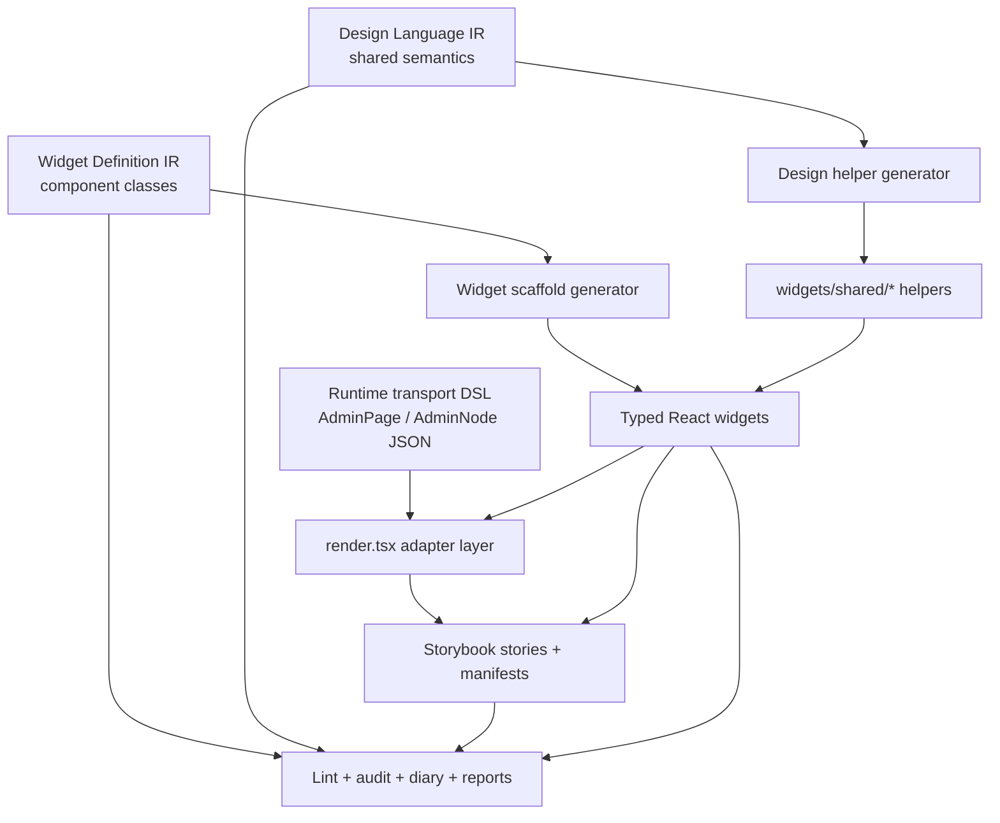
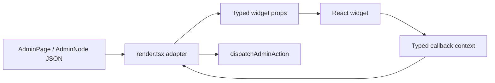

# Playbook: A DSL for Creating Design Systems

This note explains a reusable engineering pattern that emerged from the HAIR-041 Admin DSL work in the Fringe hair-booking project: instead of treating a design system as a collection of hand-written React components, treat it as the output of a small language stack. One language describes **component classes**: what a widget is, why it exists, what props it accepts, what action contexts it emits, which stories prove it, and where its generated files should live. A second language describes **shared design conventions**: token aliases, typography roles, action styles, layout policies, and data-attribute helpers. Deterministic generators then project those languages into scaffolds and shared helpers, after which humans promote the scaffolds into production widgets under a disciplined review process.

The important point is not that everything is generated. The important point is that design-system work becomes a structured pipeline with stable artifacts, explicit boundaries, and auditable passes. Manual implementation remains essential, but it stops being improvised.

> [!summary]
> - A design system can be treated as the output of a **meta-language** rather than a pile of ad hoc components.
> - The durable units are not only React files. They are **artifacts**: widget class definitions, design-language definitions, scaffold generators, metadata sidecars, Storybook manifests, lint rules, and audit playbooks.
> - The winning boundary is: **the adapter reads raw transport JSON; the widget receives typed props; the widget emits typed callbacks; the adapter lowers callbacks to backend action dispatch**.
> - The workflow only becomes reliable when code generation, manual promotion, Storybook hardening, linting, diary updates, and intern-style audits are all part of the same process.

## Why this note exists

A frontend team can build a design system by hand. That is the normal starting point. The problem appears when the system becomes large enough that the cost of remembering rules exceeds the cost of writing them down. At that point, the hard part is no longer the JSX. The hard part is maintaining consistency across these questions:

- Which widgets exist and why do they exist as separate boundaries?
- Which props are real semantic contracts and which are local implementation accidents?
- Which callbacks are legal for a given widget, and what context do they receive?
- Which files should be generated and which should stay hand-written?
- Which shared style rules belong to a central design-language layer rather than local CSS objects?
- Which Storybook stories prove that a widget is real rather than scaffold-shaped?
- Which checks catch design drift before it reaches production?

The HAIR-041 work answered those questions by building a meta-layer above the React components. This note exists so that the next project can begin from that meta-layer instead of rediscovering it.

## When to use this pattern

Use this pattern when the following conditions are true:

- the UI is semantic enough that widgets represent domain-visible concepts rather than incidental HTML fragments;
- the same UI vocabulary must be rendered from a stable data boundary such as JSON, protobuf, or another typed transport contract;
- the system needs more than one implementation pass, such as scaffolding, design helper generation, Storybook planning, test generation, review, and manual promotion;
- multiple engineers or agents will touch the system, so tacit conventions are no longer sufficient;
- backend-driven or server-driven UI is involved, so the trust boundary between transport data and executable behavior matters.

Do not use this pattern when the UI is still in rapid exploratory sketch mode and component boundaries are not yet stable. In that phase, a fast hand-written renderer is often the right first artifact. The meta-layer becomes valuable when the exploratory renderer has already accumulated enough truth to be mined into stable component classes.

## The central mental model

The design system has two distinct products.

The first product is the **runtime UI system**. This is what the browser uses: typed widgets, adapters, story files, tests, and shared helpers. It must be small, explicit, and safe.

The second product is the **design-system authoring system**. This is what engineers use: YAML IR files, generators, playbooks, review reports, and coverage manifests. It does not ship to users, but it determines how the runtime system is built and maintained.

This separation matters because it prevents a common failure mode. Without it, every new widget forces the team to answer the same questions again from scratch. With it, those questions become part of the authoring system.

A concise statement of the model is:

1. The runtime transport format describes pages and nodes.
2. The component-class language describes the widgets that should exist.
3. The design-language IR describes shared visual semantics.
4. Deterministic generators create structure.
5. Human promotion adds the final HTML, accessibility behavior, and interaction details.
6. Review artifacts and validation scripts keep the process honest.

## The artifact stack

The HAIR-041 implementation eventually settled on a stack like this:



Each layer answers a different question:

| Layer | Question it answers |
| --- | --- |
| Transport DSL | What page/state did the backend ask the frontend to render? |
| Widget Definition IR | What component classes exist, and what contracts do they expose? |
| Design Language IR | What shared layout, typography, action, and data-attribute conventions exist? |
| Generators | Which files should exist, and what structure should they start with? |
| Manual promotion | What is the final implementation behavior for this widget? |
| Validation/review | Did the implementation actually follow the process and preserve the contract? |

## The two languages

The pattern is easier to reuse when the two languages are described separately.

### 1. Widget Definition IR: the component-class language

This language describes component classes. It does not describe runtime pages. It describes the widgets that a runtime page may eventually use.

In HAIR-041 the canonical files live under:

```text
/home/manuel/workspaces/2026-04-21/hair-v2/hair-booking/ttmp/2026/05/15/HAIR-041--real-admin-backend-for-intake-app/sources/admin-dsl-widget-ir/
```

Representative category files include:

```text
03-shell-widgets.yaml
04-action-widgets.yaml
05-layout-widgets.yaml
06-resource-widgets.yaml
07-data-display-widgets.yaml
08-media-widgets.yaml
09-calendar-widgets.yaml
10-form-widgets.yaml
10a-form-field-widgets.yaml
11-surface-widgets.yaml
```

The schema-v2 shape is specified in:

```text
.../design-doc/09-widget-definition-ir-yaml-format-spec.md
```

A widget definition contains these sections:

- `classification`
- `source_mapping`
- `intent`
- `contract`
- `examples`
- `stories`
- `outputs`
- `implementation_todos`

The key insight is that natural language belongs in the IR. A widget is not fully specified by its prop types. It also needs purpose, rationale, adapter boundary, and story intent.

A simplified grammar for the component-class language looks like this:

```text
WidgetDefinitionFile ::= Header WidgetList
Header ::= schema_version artifact_type category summary source_document schema_document
WidgetList ::= widgets: [WidgetDefinition+]

WidgetDefinition ::= id name status classification source_mapping intent contract examples stories outputs implementation_todos
classification ::= level [role] description
source_mapping ::= current_constructs current_files
intent ::= purpose design_rationale adapter_boundary implementation_notes accessibility_notes
contract ::= props action_slots
examples ::= named Example+
stories ::= named StoryScenario+
outputs ::= component types stories barrel [tests]
```

The language does not try to encode the final React implementation. It encodes the stable class contract that many later passes need.

### 2. Design Language IR: the shared-semantics language

The second language lives in:

```text
.../sources/admin-dsl-widget-ir/15-design-language.yaml
```

This file does not define widgets. It defines design-system conventions that should not be duplicated inside widgets. In the HAIR-041 system, this generator eventually produced shared helpers such as:

```text
web/src/admin-dsl/widgets/shared/designTokens.ts
web/src/admin-dsl/widgets/shared/actionStyles.ts
web/src/admin-dsl/widgets/shared/layoutStyles.ts
web/src/admin-dsl/widgets/shared/typography.ts
web/src/admin-dsl/widgets/shared/dataAttributes.ts
```

The language answers questions like these:

- Which token aliases should promoted widgets use?
- How are action variants inferred from semantic placement and intent?
- Which layout helpers should page shells and panels share?
- Which typography roles are stable enough to generate?
- Which repeated `data-*` attribute patterns should be centralized?

The design-language IR exists because design drift is easier to prevent at the source than to clean up later. The review diaries show this clearly: repeated pill styling, raw token imports, and duplicated badge colors were real failures before the shared helper layer was mature.

## The pass model

The project began to work once “pass” stopped meaning “one step in one fixed compiler pipeline” and started meaning “a transformation defined by its input and output artifacts.”

That distinction matters. Some passes are deterministic generators. Some are manual promotion passes. Some are review passes. Some are reporting passes.

A good reusable pass inventory looks like this:

| Pass | Requires | Produces |
| --- | --- | --- |
| Renderer inventory pass | current renderer, schema, fixtures | widget-class catalog |
| Widget IR formalization pass | prose catalog | schema-v2 widget YAML |
| Scaffold generation pass | widget YAML | `.types.ts`, `.tsx`, `.stories.tsx`, `.metadata.ts`, `index.ts` |
| Design helper generation pass | design-language YAML | `widgets/shared/*` |
| Manual promotion pass | generated scaffold, current renderer branch | final widget implementation |
| Adapter migration pass | widget implementation, runtime schema | adapter branch in renderer |
| Storybook hardening pass | generated stories, implementation | meaningful reviewable stories |
| Compliance audit pass | code, playbooks, stories, history | report + diary + follow-up tasks |
| Coverage manifest pass | existing stories and exports | current Storybook coverage manifest |

The point is not to automate everything. The point is to make every stage explicit.

## The runtime boundary

The runtime boundary is where many server-driven UI systems fail. A backend-driven JSON page format is only safe if the frontend does **not** treat it as executable code.

The HAIR-041 rule became:

> The adapter reads raw JSON. The widget receives typed props. The widget emits typed callbacks. The adapter lowers those callbacks into backend-bound action dispatch.

That gives the following boundary:



This solves several problems at once:

- widgets do not import `AdminNode`, `AdminPage`, or arbitrary JSON helpers;
- widgets can be tested in Storybook with fake callbacks;
- the backend action trust boundary remains in the adapter;
- runtime transport shape can evolve without turning every widget into a parser.

The diaries and reviews show that this rule was not only documented. It was enforced. One of the strong outcomes of the intern review was that the adapter boundary stayed clean even when several story and design-system issues still needed remediation.

## What generation should and should not do

A recurring mistake in code generation projects is asking the generator to solve implementation questions that require judgment. HAIR-041 worked because the generator did less.

The scaffold generator should do these things:

- create stable file layout;
- emit type files from the IR contract;
- emit metadata sidecars;
- emit story skeletons from scenario definitions;
- preserve provenance headers;
- make missing work obvious with TODOs and manual-edit changelog conventions.

The generator should **not** do these things:

- invent final HTML structure for complex widgets;
- decide nuanced accessibility behavior from type information alone;
- decide how to preserve compatibility with older tests or runtime quirks;
- collapse all semantic differences into one mega-widget just because they look structurally similar.

This is the correct balance:

```text
IR + generator = structure
renderer branch = proven current behavior
manual promotion = final implementation judgment
review process = drift control
```

## The metadata sidecar is not optional

One of the most important local inventions in this workflow is the metadata sidecar. Once a scaffold is promoted into a real widget, the original YAML intent must not disappear.

The metadata sidecar preserves:

- widget id and classification;
- purpose and design rationale;
- adapter boundary;
- action slots and callback context meaning;
- story intent;
- implementation todos;
- source mapping.

This means the design memory stays next to the component even after the scaffold body is replaced.

Without it, the source of truth fragments across:

- ticket docs,
- old diary entries,
- generator code,
- memory.

That is exactly the state a reusable process should avoid.

## The review loop is part of the language system

A design-system DSL is incomplete if it only generates code. It also needs review artifacts that can express whether the generated and promoted system still follows its own rules.

The HAIR-041 review loop ended up containing these pieces:

1. **Implementation playbook**
   - how to go from YAML widget to finished widget.

2. **Design-system review playbook**
   - how to detect drift such as raw token imports, duplicated pill styling, or manual data attributes.

3. **Compliance audit guide**
   - how to verify whether the implementation actually followed the playbook.

4. **Lint script**
   - a static check over promoted widgets for token usage, hardcoded colors, manual data attributes, and structural button classification.

5. **Coverage manifest**
   - a current map from desired Storybook coverage to real stories, exports, and gaps.

These are not secondary documentation. They are part of the authoring system. If they are missing, the process regresses to “generate, hand-edit, and hope.”

## The role of intern review

The intern review artifacts were especially valuable because they forced the process to answer a harder question: not “does the code compile?” but “does the process actually produce reviewable evidence?”

The review diaries and reports found concrete gaps such as:

- story files that still looked scaffold-generated even after widgets were promoted;
- duplicated design-system rules expressed in different widgets;
- missing metadata sidecars for some promoted files;
- stale support artifacts that no longer matched the chosen architecture;
- missing coverage manifests linking intended scenarios to actual story exports.

That pressure improved the system in a way pure implementation work would not have done. The resulting process became stricter:

- generated stories are only scenario plans until hardened;
- metadata sidecars must survive promotion;
- stale artifacts should be reconciled or deleted, not left as distractions;
- task state must be kept accurate enough that the remaining open work is real.

This is an important reusable lesson. A design-system DSL effort should budget for audit and compliance work from the start. If it does not, the meta-layer becomes documentation theater rather than an operational system.

## A recommended structured grammar

If this pattern is reused in another project, I would preserve and slightly simplify the grammar into three formal artifacts.

### Artifact A: runtime transport DSL

Purpose: represent what the application wants to render.

Examples:

- `AdminPage`
- `AdminNode`
- action refs
- query refs

Rules:

- must be transport-safe;
- must contain no functions;
- must be stable enough for tests and backend/frontend communication.

### Artifact B: component-class IR

Purpose: represent the design-system classes from which the runtime UI is built.

Sections:

- identity and classification;
- source mapping;
- intent and rationale;
- contract;
- examples;
- story scenarios;
- output paths;
- implementation todos.

### Artifact C: design-language IR

Purpose: represent shared design conventions that should not be reimplemented widget by widget.

Sections:

- token aliases;
- typography roles;
- action variants and placements;
- layout helpers;
- data-attribute conventions;
- special structural-control exceptions.

This grammar is enough to support the process without forcing a speculative full compiler too early.

## A recommended toolchain

A reusable toolchain for this pattern should contain at least the following tools.

### 1. Scaffold generator

Input:
- widget definition IR

Output:
- `.types.ts`
- `.metadata.ts`
- `.tsx`
- `.stories.tsx`
- `index.ts`

### 2. Design helper generator

Input:
- design-language IR

Output:
- shared helper modules

### 3. Design-system lint

Input:
- promoted widget implementation files

Output:
- structured findings

Rules should include at least:
- raw token imports,
- hardcoded colors,
- duplicated style helpers,
- manual `data-admin-dsl-*` literals,
- structural button classification.

### 4. Storybook coverage manifest

Input:
- story files,
- expected scenarios,
- promoted widget list

Output:
- coverage map,
- prioritized gaps,
- screenshot review targets.

### 5. Compliance audit workflow

Input:
- playbooks,
- implementation history,
- validation history,
- story coverage

Output:
- audit diary,
- audit report,
- remediation tasks.

## Recommended implementation sequence

The implementation sequence matters. The order below worked because it reduces rework.

1. Build a working renderer first.
2. Inventory the renderer and define component classes from real code.
3. Formalize the widget IR.
4. Formalize the design-language IR.
5. Build generators.
6. Generate scaffolds.
7. Promote foundational widget families first.
   - shell
   - action
   - layout
8. Promote denser semantic families next.
   - resource
   - display
   - media
   - calendar
   - form
   - fields
   - surfaces
9. Add linting and compliance audit.
10. Reconcile support artifacts and coverage manifests.
11. Keep task state, diary, and changelog synchronized.

In pseudocode:

```text
build renderer
if renderer is useful:
    inventory renderer
    define widget classes
    define design-language rules
    generate scaffolds
    for each widget family in dependency order:
        validate scaffold freshness
        promote implementation from current renderer
        keep metadata sidecar
        harden stories
        validate
        update diary/changelog/tasks
    run design lint
    run compliance audit
    reconcile stale planning artifacts
    maintain coverage manifest
```

## Common failure modes

The HAIR-041 work surfaced several failure modes that should be treated as first-class rules.

### 1. The generator becomes over-ambitious

Symptom:
- generated code tries to guess final implementation semantics.

Consequence:
- generated output becomes hard to trust and hard to review.

Rule:
- generate structure, not final judgment.

### 2. Widgets become parsers

Symptom:
- widgets import `AdminNode`, `AdminPage`, `str(...)`, `jsonObject(...)`, or backend dispatch helpers.

Consequence:
- runtime and implementation boundaries collapse.

Rule:
- the adapter reads JSON; widgets receive typed props only.

### 3. Storybook stories exist but do not prove anything

Symptom:
- many exports exist, but they all render the same `defaultArgs`.

Consequence:
- the coverage looks better than it is.

Rule:
- generated stories are plans; promoted widgets require hardened fixtures and callback probes.

### 4. Shared style rules drift into local implementations

Symptom:
- different widgets recreate the same action, pill, badge, or spacing semantics with raw tokens.

Consequence:
- design drift and review fatigue.

Rule:
- move repeated semantics into the design-language IR and regenerate helpers.

### 5. Metadata disappears after promotion

Symptom:
- once a scaffold becomes hand-written, the original rationale is gone.

Consequence:
- future edits become context-free.

Rule:
- metadata sidecars stay next to promoted widgets.

### 6. Stale planning artifacts remain in the active source tree

Symptom:
- files continue recommending architectures the project has already rejected.

Consequence:
- the source tree stops communicating the actual architecture.

Rule:
- reconcile or delete stale support artifacts.

## Working rules

These are the working rules I would carry into the next project.

1. **Treat the design system as a language product, not just a component library.**
2. **Keep runtime transport and authoring artifacts separate.**
3. **Use one IR for component classes and another for shared design semantics.**
4. **Make natural-language rationale first-class in the IR.**
5. **Generate scaffolds and helpers, but promote implementations by hand.**
6. **Preserve metadata sidecars after promotion.**
7. **Keep adapters explicit and controlled.**
8. **Treat Storybook coverage as a manifest, not just a folder of files.**
9. **Run lint and compliance audit as part of the process, not as optional cleanup.**
10. **Keep the diary, changelog, and task state current while the system evolves.**

## What I would do next in a new project

If I were starting the next system from this pattern, I would make these changes earlier than HAIR-041 did.

- Introduce the metadata sidecar convention from the first scaffold generation pass.
- Introduce the Storybook coverage manifest before broad widget promotion begins.
- Introduce the design-system lint script before promoting more than a handful of widgets.
- Define the support-artifact lifecycle up front: active, reconciled, or deleted.
- Make the review pass a normal scheduled phase rather than a rescue step.

These are small process changes, but they matter because the meta-layer only pays off when it remains trustworthy.

## Related notes

- [[ARTICLE - Report - Bottom-Up Admin DSL Widget IR]]
- [[PROJECT REPORT - Fringe Admin DSL and React Renderer Technique Deep Dive]]
- [[PROJECT REPORT - Fringe Interactive DSL and Goja Backend Runtime Deep Dive]]
- [[ARTICLE - Go-Side JavaScript DSLs for Discord Bots - Types, Errors, and In-Place Updates]]

## Practical takeaway

The reusable result of HAIR-041 is not merely a set of Admin DSL widgets. It is a method for building design systems through explicit intermediate artifacts. The method begins with a working renderer, extracts component classes into a formal IR, extracts shared visual semantics into a design-language IR, projects those artifacts into scaffolds and helpers, and then uses playbooks, audits, lint rules, and Storybook coverage manifests to keep the generated and hand-written parts aligned.

That is the real pattern. The design system is not only the output. The design system is also the process that makes the output repeatable.
