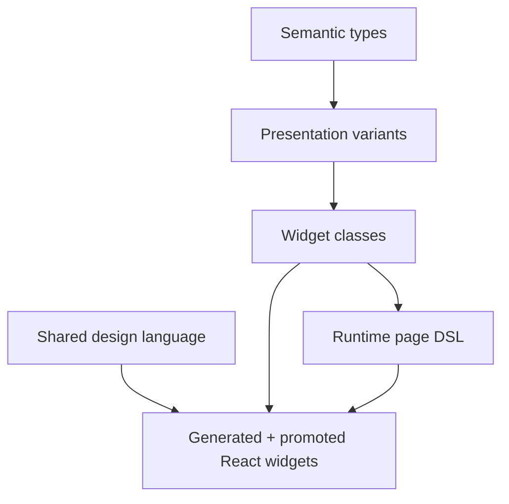

# Playbook: Collaborative Schema Design Sessions for Presentation-Based UI

This playbook describes how to run a collaborative design session in which a human provides intent and examples, while a coding agent is responsible for formalizing the design into stable YAML schemas, clarifying ambiguities, proposing tradeoffs, drafting initial artifacts, and then driving the now-established widget workflow from schema to React implementation. The target architecture is **Proposal A**: retain the existing successful widget and design-language workflow, but extend it with explicit support for presentation-based UI.

The purpose of the playbook is not only to help design a schema. Its purpose is to define a reliable research-and-design process that starts from incomplete intent and ends with a precise, testable, reviewable artifact set. In this process, the human does not have to arrive with a complete schema in mind. The human provides goals, examples, and semantic pressure. The agent turns those into a structured model.

> [!summary]
> - The human provides **intent, examples, domain pressure, and acceptance criteria**.
> - The coding agent provides **formalization, disambiguation, artifact structure, schema proposals, and implementation sequencing**.
> - Proposal A means **keeping the current widget IR workflow** and extending it with a small number of new schema artifacts rather than inventing a full compiler stack up front.
> - The most important architectural move is to separate **semantic types**, **presentations**, **widget classes**, and **shared design semantics** before writing new YAML.
> - The output of the session is not only a schema sketch. It is a package of artifacts: glossary, decisions, example instances, schema sections, validation rules, generation targets, and follow-up implementation tasks.

## Why this playbook exists

When a team says, "we want a presentation-based UI," it usually means several different things at once. It may mean that domain objects should be rendered through typed presentations rather than strings. It may mean that actions should be expressed over semantic objects rather than raw UI events. It may mean that widgets should be able to choose among multiple valid presentations of the same value. It may also mean that the same object needs different renderings in different contexts without duplicating widget code.

These are good goals, but they are not yet a schema. If a team jumps directly from that intent to writing YAML, two things usually happen.

First, the schema mixes levels. A widget definition starts carrying domain-type semantics, rendering policies, display variants, action routing, and styling hints all at once. Second, the team spends effort arguing inside the schema rather than clarifying the model first. The file becomes large quickly, but not stable.

The HAIR-041 work suggests a better sequence. Preserve the existing successful pieces:

- a widget-definition IR for component classes,
- a design-language IR for shared visual semantics,
- deterministic generators for scaffolds and helpers,
- manual promotion to real React widgets,
- Storybook and audit workflows.

Then add the smallest new abstraction layer that presentation-based UI requires: a semantic type and presentation layer that sits *before* widgets. This playbook is the process for doing that deliberately.

## What Proposal A means in practice

Proposal A is conservative in implementation and explicit in structure. It does **not** introduce a new fully general compiler architecture at the outset. It extends the current workflow with a few additional artifact types while keeping the existing pipeline recognizable.

The expected artifact set under Proposal A is:

```text
types.yaml               # semantic object types and projections
presentations.yaml       # presentation variants for semantic types
widgets.yaml             # widget class definitions (existing Widget IR style)
design-language.yaml     # shared visual and interaction conventions
stories/coverage.yaml    # Storybook coverage manifest
```

This is deliberately modest. It says:

- keep the current widget IR rather than replacing it,
- keep the current design-language IR rather than replacing it,
- add a semantic type layer,
- add a presentation layer,
- integrate those into the existing generator/promotion workflow.

The playbook assumes that later projects may evolve beyond Proposal A, but Proposal A is the correct first implementation path because it preserves the known-good structure while creating room for new concepts.

## The collaboration contract

The session works when the human and the coding agent have different but complementary jobs.

### The human is responsible for

- the product and domain intent;
- examples of important objects and interactions;
- naming pressure from the real problem domain;
- deciding which tradeoffs are acceptable;
- choosing among proposed schema directions;
- rejecting abstractions that are too broad or too speculative.

### The coding agent is responsible for

- extracting and stabilizing terminology;
- identifying the required schema layers;
- translating examples into candidate data structures;
- finding ambiguities and surfacing them early;
- proposing concrete schema shapes and alternatives;
- turning accepted decisions into structured artifacts;
- sequencing generation, validation, and implementation work.

This division is important because it prevents a common failure mode. The human should not have to arrive with a formal schema in their head. The agent should not invent domain semantics without prompting and validation from the human.

## Session outputs

A successful session should produce more than a note. At minimum, it should leave behind the following outputs.

### Required outputs

1. **Glossary**
   - a list of stable terms and definitions.

2. **Decision log**
   - explicit choices and rejected alternatives.

3. **Example set**
   - 3–5 concrete domain examples that the schema must support.

4. **Artifact inventory**
   - which YAML files will exist and what each one is responsible for.

5. **Schema sections**
   - field-level outline or first draft for each artifact.

6. **Invariants**
   - what validation rules must hold.

7. **Generation targets**
   - what scripts and outputs consume the schema.

8. **Implementation sequence**
   - the order in which to build and test the system.

### Optional outputs

- prototype YAML examples,
- pseudocode validators,
- migration notes from an older widget system,
- a Storybook scenario manifest,
- audit checklists.

## The layer model

The playbook should begin each session by restating the layer model. This prevents the discussion from collapsing into a single overburdened file format.



Each layer answers a different question.

| Layer | Question |
| --- | --- |
| Semantic types | What kinds of domain objects exist? |
| Presentations | How can each kind of object be shown? |
| Widget classes | What UI component classes consume those values and presentations? |
| Design language | What shared visual and interaction rules exist? |
| Runtime page DSL | How are actual pages assembled from those classes? |
| React implementation | How are the classes rendered and tested concretely? |

The important rule is that a layer should not absorb the responsibility of the layer above or below it unless there is a strong reason.

## Phase 1: Elicit the domain model

The first session phase is not about widgets. It is about semantic objects.

The agent should ask for 3–5 concrete examples of important domain entities and the operations users perform on them. For a presentation-based UI, this is mandatory, because presentation choice only makes sense relative to a stable semantic type.

Examples of good questions:

- What are the domain objects that appear repeatedly?
- Which of those objects have stable identities?
- Which properties are canonical and which are only one rendering of the object?
- Which objects participate in actions?
- Which objects have multiple useful renderings in different contexts?

The goal is to produce a type inventory like this:

```yaml
types:
  User:
    identity:
      key: id
    projections:
      id: string
      email: string
      username: string
      display_name: string
      avatar_url: string
  Order:
    identity:
      key: id
    projections:
      id: string
      order_number: string
      total_cents: integer
      customer_name: string
      status: string
```

This phase should not yet define how these types are rendered. It defines what exists.

### Exit criterion

Phase 1 is complete when the team can say, for each important object:

- what the object is,
- how it is identified,
- which projections are important enough to name,
- which operations conceptually act on the object.

## Phase 2: Elicit the presentation model

Once semantic types are known, the next step is to ask how each type may appear on screen.

This is the most important addition for presentation-based UI. The system needs an explicit **presentation registry** layer.

A presentation is not just a string formatting rule. It is a named display contract for a semantic type. A `User` shown as `avatar`, `email`, or `compact_chip` is still a `User`, but the UI is intentionally choosing one of several renderings.

A useful session prompt is:

- For each semantic type, what are the distinct renderings you actually care about?
- Which renderings are minimal?
- Which renderings are dense operational summaries?
- Which renderings are detail-heavy?
- Which projections are required for each presentation variant?

A good output shape is:

```yaml
presentations:
  User:
    display_name:
      requires: [display_name]
      renders_as: text
    email:
      requires: [email]
      renders_as: text
    avatar:
      requires: [avatar_url, display_name]
      renders_as: media
    compact_chip:
      requires: [display_name]
      renders_as: chip
    full_card:
      requires: [display_name, email, avatar_url]
      renders_as: card
```

The presentation file should also record fallback behavior and context sensitivity where needed, but the first draft should stay simple.

### Exit criterion

Phase 2 is complete when every important semantic type has:

- named presentation variants,
- clear required projections,
- a rough rendering category,
- clear separation from the widget class layer.

## Phase 3: Define widget classes

Only after the team has semantic types and presentations should the session define widget classes. This is where the existing HAIR-041 widget IR workflow becomes immediately reusable.

The questions now change.

- Which widgets consume semantic objects directly?
- Which widgets consume already-selected presentation variants?
- Which widgets choose among a set of legal presentations?
- Which widgets expose action surfaces?
- Which widgets are atoms, molecules, or organisms?

The key danger in this phase is allowing widget definitions to absorb the whole domain model. The playbook should prevent that.

A widget should describe:

- its class identity,
- its purpose,
- its contract,
- its action slots,
- its Storybook scenarios,
- its generated outputs,
- its adapter boundary.

It should **not** redefine the semantic type or the design-language layer.

A widget that references presentations might look conceptually like this:

```yaml
widgets:
  - id: pbui.user-reference
    name: UserReference
    classification:
      level: molecule
    intent:
      purpose: Render a user value using one of several approved presentation variants.
      adapter_boundary: Runtime adapters must bind a semantic User object plus a selected presentation variant.
    contract:
      props:
        UserReferenceProps:
          fields:
            subject:
              type: UserValue
              required: true
            presentation:
              type: UserPresentationVariant
              required: true
            onAction:
              type: UserActionHandler
              required: false
```

The actual type names can differ, but the structural principle should remain.

### Exit criterion

Phase 3 is complete when the first widget inventory can be written without argument over what belongs in the type layer versus the widget layer.

## Phase 4: Define the design-language delta

Proposal A assumes that a lot of the HAIR-041 design-language workflow remains reusable. The session therefore should not redesign the entire design-language file unless there is real pressure.

Instead, the session should ask:

- What new shared concepts does presentation-based UI introduce?
- Are there new presentation chromes that recur across widgets?
- Do some presentation variants imply shared tones, labels, or shells?
- Are there new structural controls that need lint exceptions or shared helpers?

The result should be a **delta** to the design-language IR, not a wholesale redesign.

Typical additions might include:

- presentation badges,
- inline reference chips,
- object-summary card styles,
- projection-label typography,
- presence/identity affordances,
- typed relation link styles.

### Exit criterion

Phase 4 is complete when the team can identify which new concepts belong in `design-language.yaml` and which should remain local to individual widgets.

## Phase 5: Draft example YAML before final schema rules

This phase is one of the most important. Do not finalize the schema before writing examples.

The agent should take the decisions from the earlier phases and draft:

- one `types.yaml` fragment,
- one `presentations.yaml` fragment,
- one `widgets.yaml` fragment,
- optionally one runtime page snippet that uses them.

The example does two jobs.

First, it tests whether the schema is coherent. Second, it reveals awkwardness that a verbal discussion misses.

For example, if the same object’s identity, display label, and presentation selection have to be repeated four times in the example YAML, that is a sign the schema is carrying the wrong data at the wrong level.

A useful minimal example is:

```yaml
types:
  User:
    identity:
      key: id
    projections:
      id: string
      email: string
      display_name: string
      avatar_url: string

presentations:
  User:
    compact_chip:
      requires: [display_name]
      renders_as: chip
    full_card:
      requires: [display_name, email, avatar_url]
      renders_as: card

widgets:
  - id: pbui.user-list
    name: UserList
    classification:
      level: organism
    contract:
      props:
        UserListProps:
          fields:
            users:
              type: UserValue[]
              required: true
            itemPresentation:
              type: UserPresentationVariant
              required: true
```

This is not yet the final schema. It is a pressure test.

## Phase 6: Formalize the schema

Once example YAML feels coherent, the session can formalize the schema.

This is where the agent should produce:

- required fields,
- optional fields,
- normalized names,
- validation rules,
- migration notes if reusing the HAIR-041 structure.

The formalization section of the playbook should require the following questions for every field:

1. What artifact consumes this field?
2. Is this field for generation, validation, runtime interpretation, or review?
3. Could the same fact be derived more cleanly from another layer?
4. What invariant can be checked over this field?

If the field has no good answer, it should probably not exist.

## Phase 7: Define validation rules

The schema is only useful if the system can reject invalid combinations.

The playbook should require at least four classes of invariants.

### 1. Type invariants

- every semantic type id is unique;
- every type defines its identity correctly;
- every referenced projection exists.

### 2. Presentation invariants

- every presentation references a known type;
- every required projection exists on that type;
- fallback chains are acyclic;
- variant names are unique within a type.

### 3. Widget invariants

- every widget references only known semantic types or presentation variants;
- every action slot references known action signatures;
- every output path is deterministic;
- every required story is declared.

### 4. Runtime invariants

- runtime page nodes reference known widget kinds;
- selected presentations are valid for the bound semantic type;
- adapters can derive the required props from runtime values.

A useful validation pseudocode skeleton is:

```text
for each type:
    validate identity
    validate projection names

for each presentation group:
    validate subject type exists
    validate required projections exist
    validate fallback graph has no cycles

for each widget:
    validate referenced semantic types exist
    validate referenced presentation variants exist
    validate action slot types exist
    validate output paths are present and unique
```

## Phase 8: Define generation targets

The playbook should explicitly connect schema fields to generation outputs.

A simple table is enough.

| Input | Output |
| --- | --- |
| `types.yaml` | TS/Go semantic type definitions, validators |
| `presentations.yaml` | presentation registry, presentation helper types |
| `widgets.yaml` | component scaffolds, metadata sidecars, story scaffolds |
| `design-language.yaml` | shared token/layout/action/data-attribute helpers |
| storybook manifest | audit/check tooling |

This section matters because it prevents the schema from accumulating fields that have no consumer.

## Phase 9: Define the implementation workflow

Once the schemas exist, the project should return to the now well-tested HAIR-041 promotion model.

The implementation playbook should be reused almost unchanged:

1. read the YAML;
2. read the current implementation or choose the first implementation path;
3. validate scaffold freshness;
4. generate scaffolds;
5. promote the scaffold by hand;
6. preserve metadata sidecars;
7. keep the adapter boundary explicit;
8. harden Storybook;
9. run lint and validation;
10. update diary, tasks, changelog.

The presentation-based UI extension changes *what the schemas describe*, but it should not discard the now-proven build and review workflow.

## Phase 10: Run the session as a protocol

A good collaborative session is easier to repeat when it has a fixed protocol.

I recommend this session structure.

### Session 1: orientation and examples

Inputs:
- user intent,
- 3–5 important domain examples,
- constraints,
- success criteria.

Outputs:
- glossary,
- type inventory,
- first decision log.

### Session 2: presentations

Inputs:
- type inventory,
- real display contexts.

Outputs:
- presentation inventory,
- projection requirements,
- fallback ideas,
- first `presentations.yaml` sketch.

### Session 3: widget classes

Inputs:
- types,
- presentations,
- existing widget workflow.

Outputs:
- first `widgets.yaml` sketch,
- adapter-boundary rules,
- story requirements.

### Session 4: design-language delta

Inputs:
- widgets,
- repeated visual patterns.

Outputs:
- `design-language.yaml` additions,
- generation targets.

### Session 5: example-driven formalization

Inputs:
- all previous sketches.

Outputs:
- example YAML,
- first formal schema outline,
- invariants.

### Session 6: implementation kickoff

Inputs:
- accepted schema draft,
- chosen pilot widgets.

Outputs:
- scaffold targets,
- implementation sequence,
- validation plan.

## What the agent should do during the session

This playbook only works if the agent actively formalizes rather than merely transcribes.

The agent should:

- summarize the intent back in stricter technical language;
- identify hidden layers;
- propose at least one conservative and one more ambitious schema option when ambiguity exists;
- write concrete examples early;
- point out where the current HAIR-041 toolchain can be reused directly;
- keep a decisions section and a list of unresolved questions;
- draft schemas incrementally rather than producing a huge format in one pass.

The agent should not:

- flatten semantic types, presentations, widgets, and design language into one schema too early;
- force a fully general compiler architecture before real examples exist;
- assume presentation-based UI means every widget chooses its own presentations dynamically;
- invent domain concepts that the user has not signaled.

## Recommended document structure for the actual schema-design document

When the team moves from this playbook into the actual design document, use this chapter structure.

1. Purpose and scope
2. Terminology
3. Layer model
4. Proposal A architectural stance
5. Semantic type schema
6. Presentation schema
7. Widget class schema
8. Design-language delta
9. Example YAML
10. Validation rules
11. Generation targets
12. Implementation sequence
13. Open questions
14. Decision log

That chapter order matters. It ensures that the final schema grows from the conceptual model rather than the other way around.

## Anti-patterns to avoid

### 1. One giant schema

If one YAML file tries to define semantic types, presentations, widget classes, runtime page instances, and visual tokens at once, the layers will drift into each other.

### 2. Widget-first modeling

If the team starts by defining widgets before defining semantic types and presentations, the widgets become accidental type systems.

### 3. Presentation rules hidden in runtime nodes

If runtime page authors choose ad hoc visual encodings without a presentation registry, there is no stable place to review or validate presentation policy.

### 4. Design-language overreach

Do not move every local visual choice into shared design-language IR. Only recurring conventions belong there.

### 5. Premature compiler generality

If the team designs for every possible target before validating the first concrete examples, the schema will become abstract without becoming useful.

## Working rules

Use these rules strictly.

1. Start from examples, not from abstract grammar.
2. Separate semantic types from presentations.
3. Separate presentations from widget classes.
4. Keep the current widget IR workflow unless a real pressure forces change.
5. Reuse the design-language IR rather than bypassing it.
6. Only formalize fields that have a generator, validator, adapter, or review consumer.
7. Keep every session artifact in a durable document, not only in chat history.
8. Keep a decision log and unresolved questions log.
9. Pilot the schema with a small number of semantic types before expanding it.
10. Re-enter the established scaffold → promotion → Storybook → lint → audit workflow once the schema is accepted.

## Suggested first pilot

For the first real use of this playbook, keep the pilot deliberately small.

I would choose:

- `User`
- `Money`
- `Photo`

Then define:

- 2–4 presentation variants per type,
- 2–3 widgets that consume them,
- one small design-language delta,
- one generated scaffold pass,
- one manual promotion pass.

That is enough to reveal whether the schema is well factored without forcing a full-system rewrite.

## Practical takeaway

Proposal A is the correct next move because it preserves the strongest part of the HAIR-041 work: the disciplined workflow from widget description to generated scaffold to promoted React implementation. The novelty of presentation-based UI should change the schema inputs, not discard the successful process.

The right collaborative design session therefore has a simple pattern:

- the human provides intent and examples;
- the agent identifies layers and formalizes them;
- the team reviews example YAML before committing to a schema;
- the accepted schema is plugged into the existing generator and promotion workflow.

That is the playbook to test next.

## Related notes

- [[ARTICLE - Playbook - A DSL for Creating Design Systems]]
- [[ARTICLE - Technical Specification - Design System DSL Data Structures and Toolchain]]
- [[ARTICLE - Presentation-Based UI for Log Viewing]]
