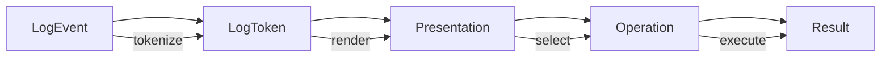
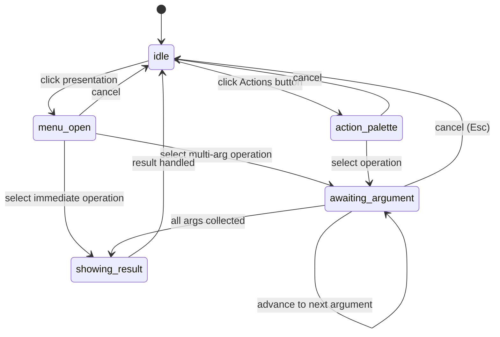

# Presentation-Based UI for Log Viewing

This article explains how to build a log viewer that treats every displayed value as a typed presentation rather than raw text, and how that decision reshapes the interaction model, the data layer, the visual system, and the command architecture of the application. The reference implementation is a React application using RTK Query, Tailwind, Storybook, and a retro Mac OS 1 visual aesthetic, but the core pattern — separating domain objects from their presentations and their operations — applies to any stack.

The article is written for an engineer who is new to the codebase and needs to understand what the system is, why it works the way it does, and how to extend it without breaking the invariant that keeps the interaction model sound.

> [!summary]
> This article covers three connected ideas:
> 1. **Presentations, not strings**: Every log value is a typed presentation that knows its semantic type, not a bare string that the UI must parse at render time.
> 2. **Operations as data**: Every action the user can take is a registered definition with declared argument types, candidate resolution, and execution logic — not a hardcoded event handler.
> 3. **Tufte density, retro aesthetics**: The visual system maximizes data-ink ratio using alternating row tints instead of borders, stacked sparkline segments, and a generative entity color system, all constrained by a monochrome-first design token layer.

## Why this article exists

Most log viewers treat log rows as text. Clicking a user ID opens a context menu that was wired by hand for that specific column. Adding a new interaction — say, "follow agent" — requires touching the table component, the menu component, and the state management layer in three separate places. The result is a system where behavior is attached to components because they happen to be buttons, not because the data they display supports the operation.

This article documents a different approach. The log viewer described here borrows its interaction model from presentation-based UI systems like CLIM (Common Lisp Interface Manager) and OpenGenera. In those systems, the display, the input, and the commands are all mediated by typed presentations. A presentation of a user ID is not just styled text — it is an object that carries its semantic type, the operations valid for that type, and the context needed to execute those operations. The UI does not guess what happens when you click a value. It asks the presentation.

This approach produces a system where adding a new operation — "follow agent", "run tool", "compare agents" — requires registering a definition in one place. The table, the menu, the command strip, and the drawer all derive their behavior from that definition. No component needs to know about the operation in advance.

## When to use this pattern

Use a presentation-based UI for log viewing when:

- the log data has multiple semantic fields (user, agent, session, tool, timestamp, status) and each field supports different operations
- users need to chain operations across fields — for example, selecting a user, then selecting a tool call by that user, then opening its details
- the set of operations is expected to grow over time, and you want to avoid scattering new behavior across component files
- the visual density needs to be high (hundreds of rows visible) and every pixel of ink should carry information

Do not use this pattern when:

- the log viewer is read-only with no interaction beyond scrolling
- the fields are flat strings with no semantic distinction
- the interaction model is simple enough that hardcoded context menus are sufficient and will not grow

## Core mental model

The system is built around a four-stage pipeline:



A **LogEvent** is the raw domain object from the backend. A **LogToken** is a displayable field extracted from that event, carrying a semantic type and a tone. A **Presentation** is a rendered LogToken that the user can interact with. An **Operation** is a typed command that starts from a presentation, may ask for more arguments, and produces a result. A **Result** is what happens — a filter is applied, a drawer opens, a value is copied.

The important invariant is this: behavior is never attached to a component because the component is a button. Behavior is attached because the presentation's semantic type is declared to support that operation. The component is just the rendering surface.

## Architecture

### Data layer

The data layer has three responsibilities: fetch log events, tokenize them into displayable tokens, and hold them in a normalized store.

```text
RTK Query (logsApi)
  → LogEvent[]
  → tokenizeLogEvent(event) → LogToken[]
  → Redux store (logQuery, live, drawer, presentationCommand)
```

**LogEvent** is the canonical shape from the API. It has an id, a timestamp, a level, optional fields like agentId, sessionId, userId, eventName, toolName, toolcallId, durationMs, status, and a payload object. It also carries a `tokens` array that is populated on the frontend, not by the backend.

**LogToken** is the display unit. Each token has:

- `id`: a stable key like `log_004:user-id`, derived from the event id and the field kind
- `kind`: the display category — `timestamp`, `level`, `agent-id`, `session-id`, `user-id`, `event-name`, `tool-name`, `toolcall-id`, `duration`, `status`, `payload-value`, `message`
- `semanticType`: the type system key — `time-instant`, `log-level`, `agent-id`, `session-id`, `user-id`, `event-name`, `tool-name`, `toolcall-id`, `status`, `payload-field`, `free-text`
- `label`: the display string
- `value`: the raw value (may differ from label — a timestamp label might be `21:44:13.103` but the value is the full ISO string)
- `tone`: a display hint — `normal`, `info`, `success`, `warning`, `danger`, `muted`

The `semanticType` field is the bridge between the data layer and the command layer. When the user clicks a token, the UI does not look at the text content. It looks at the `semanticType` and asks the operation registry what operations are valid for that type.

The tokenization function is deterministic. Given the same LogEvent, it always produces the same tokens with the same ids. This is important: candidate highlighting in the command system depends on matching tokens by value across events, and unstable ids would break that.

### Command layer

The command layer is a finite-state machine with five states:



**idle**: Nothing is happening. The table is in its normal state.

**menu-open**: The user clicked a presentation. A popup menu shows the operations valid for that presentation's semantic type. The source presentation is stored so the selected operation knows where it started.

**action-palette**: The user clicked the ⚡ Actions button in the header. A categorized palette shows all operations that can be launched without a source presentation (follow agent, trace session, compare agents, run tool, and so on).

**awaiting-argument**: The user selected an operation that requires arguments. The command strip shows what is being asked for. The current argument's resolution mode determines what the user sees:

- **select**: candidates are highlighted in the table; non-candidates are muted
- **input**: a text field appears in the command strip for free-form entry
- **confirm**: a yes/no prompt appears in the command strip

For multi-argument operations (like "compare agents", which needs two agents), the state machine advances through each argument in sequence. Already-collected arguments are shown as chips in the command strip.

**showing-result**: The operation executed. The result is dispatched (filter applied, drawer opened, value copied) and the state returns to idle.

### Operation registry

Operations are data, not code scattered across components. Each operation is an `OperationDefinition` with these fields:

```ts
type OperationDefinition = {
  id: string;
  label: string;
  description: string;
  category: 'filter' | 'navigate' | 'inspect' | 'action';
  startsFrom: string[];
  requiredArgs: OperationArgument[];
  resolveArgument: (arg, ctx) => ArgumentMode;
  execute: (ctx) => OperationResult;
};
```

The `startsFrom` array lists which semantic types can launch this operation. The `resolveArgument` function is called for each required argument and returns an `ArgumentMode` that tells the UI whether to show candidates, a text input, or a confirmation prompt. The `execute` function receives all collected arguments and produces a result.

This structure means that adding a new operation requires exactly one file change: register the definition. The table, the menu, the command strip, and the drawer all respond to the new operation without modification because they derive their behavior from the registry.

Built-in operations at the time of writing:

| Category | Operation | Starts from | Arguments |
|----------|-----------|-------------|-----------|
| filter | Include filter | user, agent, session, level, event, tool, status | none |
| filter | Exclude filter | same | none |
| filter | Drill into errors | palette, level | none |
| filter | Clear all filters | palette | none |
| inspect | Copy value | user, agent, session, toolcall, event, tool, time, payload | none |
| inspect | Examine tool calls | user | toolcall (select) |
| inspect | Summarize user | palette, user | user (select/confirm) |
| navigate | Set time range | time-instant | none |
| action | Follow agent | palette, agent | agent (select/confirm) |
| action | Trace session | palette, session | session (select/confirm) |
| action | Compare agents | palette | agent-a (select), agent-b (select) |
| action | Run tool | palette, tool | tool (select), query (text input) |

The "Run tool" operation demonstrates the full power of the multi-argument flow. It starts by resolving the `tool` argument with candidates from the visible events. Once the user selects a tool, it advances to the `query` argument, which resolves as a text input with a placeholder like "Enter input for search.query...". The user types a query and presses Enter. Both arguments are now collected, and the operation executes, opening a tool-runner drawer.

### Visual system

The visual system follows Edward Tufte's data-ink principle: every visual element should carry information, and anything that does not carry information should be removed.

**Rows have no borders.** Instead, alternating rows use a barely-visible tint (`bg-ink/[0.025]`). This preserves the scanning rhythm without adding 50 horizontal lines to a 50-row view.

**Hover is minimal.** Row hover applies `bg-ink/[0.015]` — a barely perceptible shift that does not shock the eye. Token hover uses a light underline. The goal is to confirm where the cursor is without breaking the reader's scan.

**The sparkline has no axes, no grid, no labels.** It shows stacked bars where each bar's height represents the event count in that time bucket, and the color segments inside each bar represent the log level composition (error at the bottom in red, warn in orange, info in blue, debug in gray). Hovering a single bar reveals a compact "count timestamp" tooltip — per-bar, not all-at-once.

**Entity fields use generative muted colors.** Agent IDs, session IDs, and user IDs are colored using an FNV-1a hash of their value, mapped to HSL with saturation 30% and lightness 42%. The low saturation keeps them from competing with the event-type column.

**Event types use an explicit vivid palette.** Each event name maps to a hand-picked color: `tool.call` is blue, `model.response` is violet, `session.start` is emerald, `cache.hit` is lime, `cache.miss` is yellow, `rate_limit` is red, `heartbeat` is gray. Unknown events fall back to a generative color.

**Level and event tokens are bold.** These are the two columns the eye should land on first when scanning a row. The remaining columns — timestamp, agent, session, user, details — use regular weight.

**Column margins create rhythm.** The LVL column has extra right padding (pr-3). The EVENT column has extra left and right padding (pl-3 pr-3). This creates visual breathing room around the two most important columns without adding vertical rules.

**Columns are resizable.** Each column header has an invisible drag handle on its right edge. Dragging changes the column width. The grid template is updated in state and shared between the header row and all data rows, keeping alignment exact.

### Design token layer

The visual system is constrained by a small set of CSS custom properties defined in `tokens.css` and mapped into Tailwind's `@theme` block:

```css
:root {
  --paper: 44 37% 93%;
  --ink: 0 0% 7%;
  --muted: 45 5% 55%;
  --info: 214 72% 44%;
  --success: 119 39% 36%;
  --warning: 31 72% 42%;
  --danger: 0 65% 45%;
}
```

The default theme is paper and ink. Status colors are accents applied only where color carries meaning (log levels, status badges, sparkline segments). There are no decorative colors.

The font is Berkeley Mono in two weights: regular (400) and bold (700). No other weights or styles are loaded. The two-weight restriction is enforced in `fonts.css` and in the Tailwind theme — there is no `font-light`, no `font-extrabold`, no italic. If a future design needs emphasis, it should use bold weight or color, not a new font variant.

Tailwind 4 requires explicit `--spacing-*` and `--text-*` theme variables for custom utilities. The application defines `--spacing-u` (8px), `--spacing-u2` (16px), and so on through `--spacing-u8` (64px), plus `--text-a` (13px) and `--text-b` (24px). Standard Tailwind spacing values (gap-1, px-1.5, py-px) are used alongside these custom values.

### RTK Query integration

The API layer uses RTK Query with four endpoints:

- `searchLogs`: POST `/api/logs/search` — returns events matching query, filters, range, sort, with cursor-based pagination
- `getLogEvent`: GET `/api/logs/:id` — returns a single event for the detail drawer
- `getHistogram`: POST `/api/logs/histogram` — returns time-bucketed counts with per-level breakdowns
- `getFacets`: POST `/api/logs/facets` — returns top values and counts per field

The current implementation runs against MSW (Mock Service Worker) handlers that return deterministic fixture data. The fixture generator uses a seeded PRNG so the same 50 events are produced on every page load, with timestamps spaced 30–530ms apart to stay within a single second window (no midnight crossing).

The store has four slices for UI-only state:

- `logQuery`: current query string, active filters, time range, sort direction, density toggle
- `presentationCommand`: the command state machine (idle, menu-open, awaiting-argument, action-palette, showing-result)
- `drawer`: whether the detail drawer is open and which event it shows
- `live`: whether live mode is enabled, whether it is paused, and why (manual vs scroll)

Server data lives entirely in RTK Query's cache. UI state lives in slices. This separation means that changing a filter refetches data without touching local state, and advancing the command state machine does not trigger API calls.

## Key implementation decisions

### Why tokens live on the event, not computed at render time

Tokenization is done once when the event enters the frontend, not on every render. The `tokens` array is populated by `tokenizeLogEvent` and stored as part of the event object. This has three consequences:

1. Token ids are stable. Candidate matching in the command system depends on comparing `token.value` and `event.id` across events. If tokens were recomputed on each render, React's reconciliation would break because keys would shift.
2. Tone assignment is deterministic. The same event always produces tokens with the same tones. There is no risk of a level badge flashing between colors on re-render.
3. Payload tokenization is selective. Only a curated list of payload keys (query, hits, model, tokens, error, result) are extracted as display tokens. The full payload object is available for the detail drawer but does not clutter the table.

### Why the operation registry is a class, not a switch statement

A `switch` statement in the menu component would require updating the component every time a new operation is added. The registry pattern means the component asks "what operations are valid for semantic type X?" and gets a list. Adding a new operation changes one file. The menu, the command strip, and the drawer never need to know about the new operation in advance.

The registry also supports the action palette, which needs to list all operations that can be launched without a source presentation. The `getPaletteActions()` method filters by `startsFrom.includes('action-palette')`. This is a different query than the per-type lookup, but it uses the same data.

### Why FNV-1a for entity colors, not a simple hash

A simple additive hash (summing character codes) produces nearly identical results for strings that share a common prefix. "agent-1", "agent-2", "agent-3", and "agent-4" all hash to roughly the same value because the "agent-" prefix dominates the sum. FNV-1a, which XORs each byte into an accumulator and then multiplies by a prime constant, is sensitive to every character. The trailing digit makes a large difference in the final hash value, producing well-separated hues.

The entity color function also mixes in the string length and applies a golden-ratio offset (`PHI = 0.618...`) to the final hue calculation. The golden ratio produces well-distributed hues even when the raw hash values are clustered.

### Why the sparkline uses per-bar hover, not group hover

The initial implementation used `group-hover/sparkline` on the parent container. This meant that hovering anywhere in the sparkline activated all tooltips simultaneously — a solid strip of black boxes across the chart. The fix was to use `group/bar` on each individual bar element. Only the hovered bar shows its tooltip. All other bars remain in their default state.

### Why timestamps are float seconds, not integer seconds

The fixture generator starts at `21:44:12` (78252 seconds since midnight) and adds millisecond deltas (30–530ms) between events. If the accumulator were an integer, 50 events with an average delta of 280ms would add only 14 seconds, keeping the window well within a single minute. But the initial implementation used integer seconds with a delta of `si(30, 600)` (30–600 seconds), which added an average of 315 seconds per event — enough to cross midnight after event 40. The fix was to use float seconds (`ts += sr() * 0.5 + 0.03`) so the accumulator stays monotonic and the formatter always produces valid timestamps.

## Pseudocode

### Tokenization

```text
function tokenizeLogEvent(event):
  tokens = []
  add token: kind=timestamp, semanticType=time-instant, tone=muted
  add token: kind=level, semanticType=log-level, tone=levelTones[event.level]

  if event.agentId:
    add token: kind=agent-id, semanticType=agent-id, tone=normal
  if event.sessionId:
    add token: kind=session-id, semanticType=session-id, tone=normal
  if event.userId:
    add token: kind=user-id, semanticType=user-id, tone=normal

  add token: kind=event-name, semanticType=event-name, tone=normal

  if event.toolName:
    add token: kind=tool-name, semanticType=tool-name, tone=normal
  if event.toolcallId:
    add token: kind=toolcall-id, semanticType=toolcall-id, tone=info
  if event.durationMs:
    add token: kind=duration, semanticType=payload-field, tone=normal
  if event.status:
    add token: kind=status, semanticType=status, tone=statusTones[event.status]

  for key in [query, hits, model, tokens, error, result]:
    if event.payload[key] exists:
      add token: kind=payload-value, semanticType=payload-field, tone=muted

  if event.message:
    add token: kind=message, semanticType=free-text, tone=muted

  return tokens
```

### Multi-argument command flow

```text
when user clicks a presentation:
  source = { semanticType, value, eventId }
  operations = registry.getBySemanticType(source.semanticType)
  enter state: menu-open

when user selects an operation:
  if operation has no required args:
    result = operation.execute(source, {}, eventById)
    handle result
    return idle

  firstArg = operation.requiredArgs[0]
  argumentMode = operation.resolveArgument(firstArg, { source, events, collectedArgs={} })

  if argumentMode is confirm and this is the only arg:
    result = operation.execute(source, { [firstArg.name]: source.value }, eventById)
    handle result
    return idle

  enter state: awaiting-argument(argIndex=0, collectedArgs={})

when user submits a value for the current argument:
  collectedArgs[currentArg.name] = value
  nextIndex = currentArgIndex + 1

  if nextIndex < operation.requiredArgs.length:
    nextArg = operation.requiredArgs[nextIndex]
    nextMode = operation.resolveArgument(nextArg, { source, events, collectedArgs })
    advance to: awaiting-argument(argIndex=nextIndex, collectedArgs updated)
  else:
    result = operation.execute(source, collectedArgs, eventById)
    handle result
    return idle
```

### Entity color generation

```text
function entityColor(key):
  hash = fnv1a(key)          // 32-bit FNV-1a hash
  normalized = hash / maxUint32
  hue = floor(((normalized + PHI) % 1) * 360)
  return hsl(hue, 30%, 42%)  // muted saturation for entity fields

function eventColor(eventName):
  if eventName in explicitPalette:
    return explicitPalette[eventName]
  // generative fallback
  hash = fnv1a(eventName)
  normalized = hash / maxUint32
  hue = floor(((normalized + PHI) % 1) * 360)
  return hsl(hue, 55%, 40%)  // vivid saturation for event types
```

## Common failure modes

### All agents get the same color

This happens when the hash function is dominated by a common prefix. The additive hash `sum(charCodes)` is the most common culprit. Switch to FNV-1a, which XORs each byte into the accumulator before multiplying, making the trailing characters significant.

### Sparkline shows all tooltips at once

This happens when hover is scoped to a parent container using `group-hover/parentName`. Every child with `group-hover:parentName:block` becomes visible simultaneously. Fix by scoping hover to each individual bar with `group/bar`.

### Timestamps cross midnight and break the histogram

This happens when the event generator uses integer seconds and a large delta (30–600 seconds). For 50 events, the total elapsed time can exceed an hour, crossing midnight and wrapping via `% 24`. Fix by using float-second timestamps and small deltas (30–530ms).

### Custom Tailwind classes silently produce no CSS

Tailwind 4 does not generate utilities for arbitrary CSS variable names. Classes like `gap-u3` or `p-u3` produce no output unless `--spacing-u3` is defined in the `@theme` block. This is not a runtime error — it is a silent layout failure. Define all custom spacing and text-size tokens in `@theme` before using them.

### Candidate highlighting breaks after live updates

If live updates add or remove events while the command state is `awaiting-argument`, candidates may become stale. The current implementation computes candidates from `visibleEvents` at the time the argument is resolved. If the underlying data changes, the candidates do not update. The fix is to either recompute candidates when the event list changes (which requires a Redux middleware or a `useEffect`) or to show a command error when a selected candidate no longer exists.

## Anti-patterns

### Attaching behavior to component type

Do not wire `onClick` handlers that check `event.target.textContent` to decide what to do. The text content is a rendering artifact, not a semantic identifier. Use the `semanticType` from the token instead.

### Adding new operations by modifying the menu component

Do not add a new `if` branch to the menu component for each new operation. Register the operation in the registry and let the menu ask the registry what to show.

### Using Tailwind arbitrary values for one-off colors

Do not hardcode colors like `text-[#3b82f6]` in component files. Define the color in `tokens.css`, map it to a Tailwind theme token, and use the token class. This keeps the color palette auditable and prevents the retro aesthetic from degrading into a rainbow.

### Rendering log lines as a single string

Do not render a log event as `<div>{event.message}</div>`. The message is a concatenation of fields that lost their semantic types. Tokenize the event into individual fields and render each as a presentation.

## Recommended implementation sequence

1. **Data model first.** Define `LogEvent`, `LogToken`, and `semanticType` before writing any components. The type system is the foundation.
2. **Tokenizer with tests.** Implement `tokenizeLogEvent` and verify stable ids, correct tones, and deterministic output with unit tests.
3. **Visual system.** Set up `tokens.css`, `fonts.css`, and the Tailwind `@theme` block. Verify that custom utilities generate CSS before building components.
4. **Retro base components.** Build `RetroButton`, `RetroInput`, `RetroPanel`, `RetroMenu`, `RetroBadge`, and `Divider` in Storybook before building the log page.
5. **Table with column grid.** Build `LogTable` and `LogRow` with CSS grid alignment. Add resizable columns. Verify alignment before adding interactions.
6. **Operation registry and command state machine.** Register operations, implement the state machine, and test state transitions before wiring them into the page.
7. **Presentation menu and command strip.** Wire click → menu → argument flow → result. Verify the full chain with Storybook fixtures before connecting to RTK Query.
8. **RTK Query and MSW.** Add API endpoints, mock handlers, and wire data fetching. Verify that changing filters refetches data.
9. **Detail drawer.** Add the inspector panels. Verify that opening a drawer does not lose table state.
10. **Live mode and keyboard shortcuts.** Add polling, auto-scroll, pause/resume, and keyboard help. Test that live updates do not break command state.

## Working rules

1. Every clickable log value must have a `semanticType`. No raw-string click handlers.
2. Every operation must be registered in the `OperationDefinition` registry. No hardcoded menus.
3. The visual system uses two font weights (400, 700) and no others. If emphasis is needed, use bold weight or color.
4. Entity colors are muted (saturation ≤ 30%). Event colors are vivid (saturation ≥ 55%). This hierarchy is intentional and should not be inverted.
5. Column widths are user-adjustable. Do not hardcode `grid-template-columns` in the CSS. Compute it from state.
6. The sparkline shows per-bar tooltips on hover, not group tooltips. Do not scope hover to the container.
7. Token ids must be stable across renders. Do not use array indices as keys.
8. All new operations get a Storybook story. If the operation is user-visible, it gets a story.

## File reference

Key source files in the repository at `/home/manuel/code/wesen/2026-05-19--log-presentation-based-ui/app/`:

| File | Responsibility |
|------|---------------|
| `src/features/logs/model/types.ts` | Core type definitions: LogLevel, TokenKind, SemanticType, LogToken, LogEvent |
| `src/features/logs/model/tokenizeLogEvent.ts` | Field-to-token mapping with tone assignment |
| `src/features/logs/model/entityColors.ts` | FNV-1a hash, generative entity colors, explicit event palette |
| `src/features/logs/operations/commandTypes.ts` | PresentationRef, ArgumentMode, OperationResult, PresentationCommandState |
| `src/features/logs/operations/operationRegistry.ts` | Operation registry class, getBySemanticType, getPaletteActions |
| `src/features/logs/operations/builtinOperations.ts` | All 13 built-in operation definitions |
| `src/features/logs/operations/commandStateSlice.ts` | Redux slice for the command state machine |
| `src/features/logs/components/LogExplorerPage.tsx` | Main page composing all parts |
| `src/features/logs/components/LogTable.tsx` | Table with resizable column headers |
| `src/features/logs/components/LogRow.tsx` | Single row with CSS grid, candidate highlighting |
| `src/features/logs/components/PresentationToken.tsx` | Typed token with semantic color and bold weight |
| `src/features/logs/components/Histogram.tsx` | Stacked sparkline with per-bar hover |
| `src/features/logs/components/ActionPalette.tsx` | Categorized action launcher |
| `src/features/logs/components/ActiveCommandStrip.tsx` | Multi-arg command strip with input/confirm/select modes |
| `src/styles/tokens.css` | CSS custom properties for the retro theme |
| `src/styles/tailwind.css` | Tailwind @theme block with custom spacing and type tokens |

## Related notes

- [[ARTICLE - Playbook - Self-Contained Go Wasm and JavaScript Browser Applications]] — similar project-structure and build patterns for Go + browser apps
- [[PROJ - ZK Tool]] — Obsidian automation patterns that informed the append-only vault writing workflow
