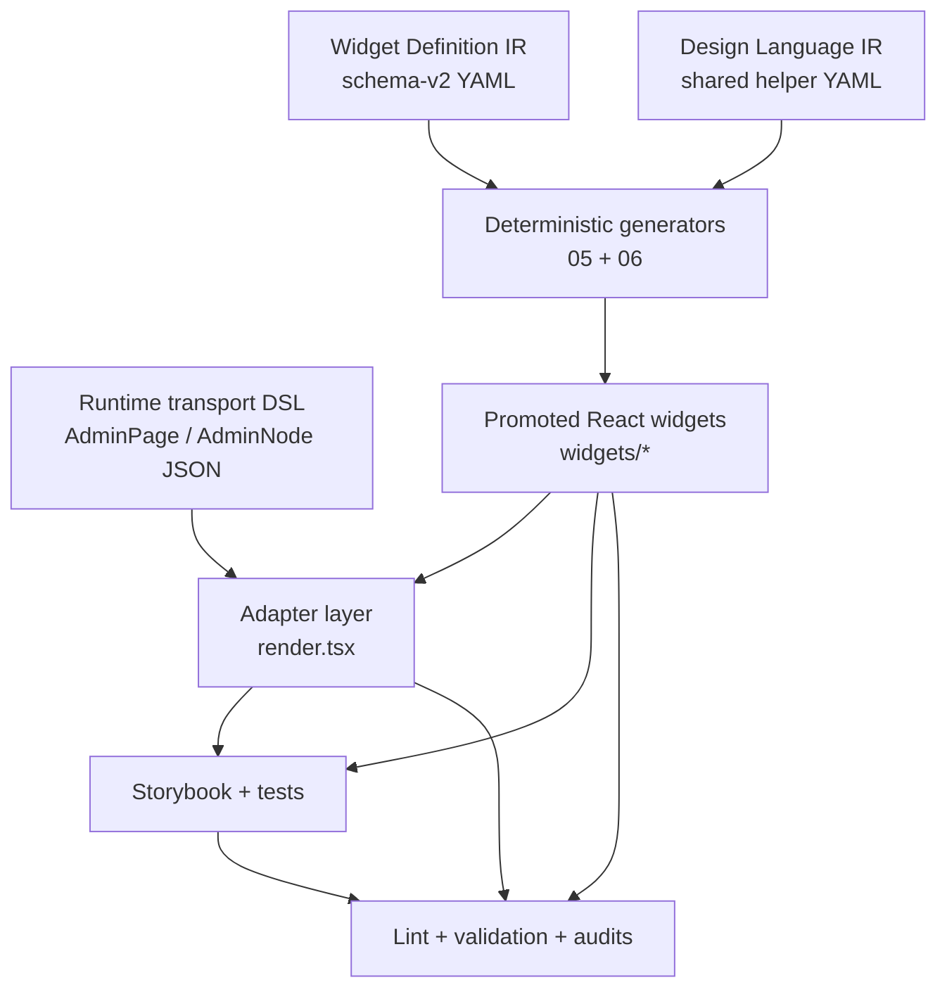

# Technical Specification: Design System DSL Data Structures and Toolchain

This note is a practitioner-facing technical specification for the design-system meta-toolchain built during HAIR-041. It is not a project narrative. Its purpose is to explain the concrete data structures, algorithms, scripts, invariants, and review loops that make the system operable.

The core claim is simple. A reusable design system is easier to maintain when its authoring process is formalized as a small language stack with deterministic projections and explicit manual promotion steps. In this model, React component files are important, but they are not the only important artifact. The source of truth is distributed across a set of related artifacts that each answer a different class of engineering question.

> [!summary]
> - The runtime transport format is not the same artifact as the component-class definition language.
> - Widget Definition IR YAML files describe component classes, not runtime pages.
> - A separate Design Language IR YAML file describes shared token, action, layout, typography, and data-attribute semantics.
> - `05-scaffold-admin-dsl-widgets.py` and `06-generate-admin-dsl-design-language.py` are deterministic projections from those IRs into code.
> - `07-lint-admin-dsl-design-system.py` and `08-validate-widget-promotion.py` are part of the system, not optional tooling around it.
> - Manual promotion remains essential. The system is explicitly designed for code generation plus human extraction, not code generation instead of human extraction.

## 1. System overview

The system has five technical layers.



The relationship between these layers is not optional design decoration. It determines where work is allowed to happen.

- The **runtime transport DSL** defines what the backend can send to the frontend.
- The **Widget Definition IR** defines what component classes exist and what their typed contracts are.
- The **Design Language IR** defines what visual and semantic rules should be shared across widgets.
- The **generators** create scaffolds and helpers from those IRs.
- The **promoted widgets** contain the final HTML, CSS, accessibility behavior, and local interaction implementation.
- The **adapter layer** converts raw runtime JSON into typed props and lowers typed callbacks into backend action dispatch.
- The **validation and audit tools** verify that the implementation still matches the rules.

## 2. Repository layout

The system spans a runtime implementation tree and a ticket-owned authoring tree.

```text
/home/manuel/workspaces/2026-04-21/hair-v2/hair-booking/
├── web/src/admin-dsl/
│   ├── schema.ts
│   ├── builder.ts
│   ├── render.tsx
│   ├── examples.ts
│   ├── AdminDsl.stories.tsx
│   ├── AdminDslWorkbench.stories.tsx
│   └── widgets/
│       ├── atoms/
│       ├── molecules/
│       ├── organisms/
│       └── shared/
└── ttmp/2026/05/15/HAIR-041--real-admin-backend-for-intake-app/
    ├── design-doc/
    ├── playbooks/
    ├── reference/
    ├── scripts/
    └── sources/admin-dsl-widget-ir/
```

The runtime files under `web/src/admin-dsl/` are what the application actually imports. The ticket files under `ttmp/...` are the authoring and process layer.

This split is intentional. It keeps the generated and reviewable design artifacts close to the code, but not mixed into the runtime package namespace.

## 3. Runtime transport data structures

The runtime transport DSL is defined in `web/src/admin-dsl/schema.ts`.

### 3.1 JSON primitives

The runtime format is intentionally JSON-safe.

```ts
export type AdminJsonPrimitive = string | number | boolean | null;
export type AdminJsonValue =
  | AdminJsonPrimitive
  | AdminJsonValue[]
  | { [key: string]: AdminJsonValue };
export type AdminJsonObject = { [key: string]: AdminJsonValue };
```

This gives the following invariants:

- widgets cannot receive closures or JSX from the runtime page tree;
- pages can be serialized, diffed, logged, stored, and tested deterministically;
- the backend can own page creation without becoming a code execution source for the browser.

### 3.2 Page and node structures

A page describes shell-level and node-level UI.

```ts
export interface AdminPage {
  schemaVersion: 2;
  id: string;
  title: string;
  description?: string;
  shell: {
    kind: AdminShellKind;
    props?: AdminJsonObject;
  };
  nodes: AdminNode[];
  modals?: AdminNode[];
  drawers?: AdminNode[];
  meta?: {
    storyTitle?: string;
    tags?: string[];
    source?: string;
    notes?: string[];
  };
}
```

A node describes one semantic construct.

```ts
export interface AdminNode<P extends AdminJsonObject = AdminJsonObject> {
  kind: AdminNodeKind;
  props?: P;
  children?: AdminNode[];
  meta?: {
    id?: string;
    name?: string;
    region?: "main" | "side" | "toolbar" | "modal" | "drawer";
    dataComponent?: string;
    dataSection?: string;
    dataPart?: string;
    note?: string;
  };
}
```

The important runtime point is that the transport model is an AST-like structure for page rendering, not a component implementation graph.

### 3.3 Action references

Actions are also runtime data, not closures.

```ts
export type AdminActionRef = AdminJsonObject & {
  type: "open" | "close" | "navigate" | "mutation" | "confirm" | "refresh" | "upload";
  target: string;
  label?: string;
  payload?: AdminJsonValue;
  options?: AdminJsonObject;
  intent?: "neutral" | "primary" | "danger";
  priority?: "primary" | "secondary" | "tertiary";
  presentation?: "button" | "icon" | "menuItem" | "overflow" | "link";
  placement?: "toolbar" | "pageHeader" | "panelToolbar" | "panelFooter" | "row" | "rowOverflow" | "bulkToolbar" | "formFooter" | "calendarCell" | "sidebarNav" | "footer" | "detail" | "overflow";
  requiresConfirmation?: boolean;
  disabled?: boolean;
  loading?: boolean;
  accessibilityLabel?: string;
};
```

The browser therefore sees opaque action metadata. Trusted behavior remains in the adapter/backend side.

## 4. The component-class language: Widget Definition IR

The component-class language is the center of the meta system. It answers the question: *what widgets should exist?*

The schema is documented in:

```text
.../design-doc/09-widget-definition-ir-yaml-format-spec.md
```

The category files are under:

```text
.../sources/admin-dsl-widget-ir/
```

### 4.1 Top-level document structure

A widget-definition file uses this shape:

```yaml
schema_version: 2
artifact_type: admin_dsl_widget_definition_ir
category: shell_widgets
summary: Shell widget definitions extracted from AdminPageRenderer and WorkbenchShell.
source_document: ttmp/.../design-doc/08-admin-dsl-react-widget-ir-catalog.md
schema_document: ttmp/.../design-doc/09-widget-definition-ir-yaml-format-spec.md
widgets:
  - ...
```

### 4.2 Widget object structure

A single widget definition contains:

```yaml
- id: admin.shell.workbench
  name: WorkbenchShell
  status: promoted
  classification: ...
  source_mapping: ...
  intent: ...
  contract: ...
  examples: ...
  stories: ...
  outputs: ...
  implementation_todos: ...
```

This data structure is not accidental. It separates concerns.

| Section | Purpose |
| --- | --- |
| `classification` | Atomic design level and semantic role |
| `source_mapping` | Which renderer constructs or files the widget was extracted from |
| `intent` | Human rationale and constraints |
| `contract` | Machine-readable prop and action-slot definitions |
| `examples` | Usage examples |
| `stories` | Storybook plan and required review scenarios |
| `outputs` | File paths to generate |
| `implementation_todos` | Explicit unfinished work |

### 4.3 Why `intent` is first-class

A component class is not fully described by field names.

For example, this is not enough:

```yaml
props:
  footerActions:
    type: ActionViewModel[]
```

What matters is also:

- why this widget has footer actions;
- whether those actions are visual only or backend-bound;
- what callback they use;
- what typed context they receive;
- how the adapter lowers them;
- which Storybook stories should prove them.

That is why `intent` and `stories` are part of the schema rather than documentation stored elsewhere.

## 5. Shared type model

The support artifact `02-shared-types.yaml` captures the shared type vocabulary used by widget IR files. The concrete generated output ends up in:

```text
web/src/admin-dsl/widgets/shared/types.ts
```

### 5.1 Action view model

The generated shared type file defines the typed action model used by widgets.

```ts
export interface ActionViewModel {
  id?: string;
  type: "open" | "close" | "navigate" | "mutation" | "confirm" | "refresh" | "upload" | string;
  target: string;
  label: string;
  intent?: "neutral" | "primary" | "danger" | string;
  priority?: "primary" | "secondary" | "tertiary" | string;
  presentation?: "button" | "icon" | "menuItem" | "overflow" | "link" | string;
  placement?: AdminActionPlacement | string;
  disabled?: boolean;
  loading?: boolean;
  accessibilityLabel?: string;
  requiresConfirmation?: boolean;
  confirmation?: {
    title?: string;
    body?: string;
    confirmLabel?: string;
    cancelLabel?: string;
  };
  [key: string]: unknown;
}
```

This type is deliberately richer than the runtime transport minimum because the widget layer needs a stable typed representation.

### 5.2 Contextual callback signatures

The shared type model also standardizes callback contexts.

```ts
export type PageActionHandler = (action: ActionViewModel, context: { pageId?: string }) => void;
export type PanelActionHandler = (action: ActionViewModel, context: { panelId?: string }) => void;
export type TableRowActionHandler<Row> = (action: ActionViewModel, context: { tableId: string; row: Row; rowId?: string }) => void;
export type TableBulkActionHandler<Row> = (action: ActionViewModel, context: {
  tableId: string;
  scope: "visible" | "selected" | "allMatching";
  rows: Row[];
  selectedRowIds: string[];
}) => void;
export type FormActionHandler<Values> = (action: ActionViewModel, context: { formId: string; values: Values }) => void;
export type CalendarCellActionHandler = (action: ActionViewModel, context: { calendarId: string; date: string }) => void;
```

This solves a concrete problem. The same action shape can appear in many semantic places, but the context is not interchangeable. The callback type names force the distinction to remain visible.

### 5.3 Common widget props

```ts
export interface CommonWidgetProps {
  id?: string;
  className?: string;
  style?: CSSProperties;
  density?: "compact" | "normal" | "spacious";
  tone?: AdminTone;
  dataAttributes?: Record<string, string | number | boolean | undefined>;
}
```

This type is generated and shared because many widgets need these fields, but the IR still allows category-specific props to remain explicit in each widget definition.

## 6. The design-language IR

The design-language IR is defined in:

```text
.../sources/admin-dsl-widget-ir/15-design-language.yaml
```

Its `artifact_type` is different from the widget-definition files because it is not a component-class definition. It is a design-semantics definition.

### 6.1 Top-level structure

The file contains sections such as:

- `source_tokens`
- `intent`
- `outputs`
- `token_aliases`
- `typography_roles`
- `action_variants`
- `button_sizes`
- `selection_controls`
- `badge_tones`
- `action_placement_defaults`
- `layout_primitives`
- `data_attributes`

### 6.2 Token aliases

This section maps project-specific raw design tokens to Admin DSL semantic tokens.

Example categories:

- `surfaces.page`
- `surfaces.calendarPage`
- `surfaces.panel`
- `surfaces.muted`
- `text.primary`
- `text.muted`
- `text.danger`
- `text.accent`
- `borders.default`
- `borders.soft`
- `borders.danger`
- `radii.control`
- `radii.panel`
- `radii.pill`

This is useful because promoted widgets should talk in terms of Admin DSL design semantics, not in terms of ad hoc imports from `fringe-ui/tokens`.

### 6.3 Typography roles

Typography roles define stable semantic text styles like:

- `pageTitle`
- `productMark`
- `panelTitle`
- `eyebrow`
- `body`
- `bodyLarge`
- `bodyMuted`
- `actionLabel`
- `subtleActionLabel`
- `navLabel`

These are then projected into `adminTextStyle(role)` helpers.

### 6.4 Action variants and placement defaults

This is one of the most important algorithmic parts of the system.

The IR contains:

- semantic action variants (`solid`, `soft`, `formPrimary`, `subtle`, `danger`, `overflow`);
- button size presets (`sm`, `md`, `touch`, `subtle`, `overflow`);
- placement defaults (`pageHeader`, `panelToolbar`, `panelFooter`, `rowOverflow`, etc.).

The generated code then implements algorithms like:

```text
if explicit variant is given:
    use it
else if action intent is danger:
    use danger
else if action priority is primary:
    use formPrimary for formFooter, otherwise solid
else if action presentation/placement is overflow:
    use overflow
else:
    use placement default variant
```

This algorithm is important because it centralizes action presentation semantics. Widgets do not each reinvent “what should a row overflow action look like?” or “what should a form footer primary action look like?”

### 6.5 Selection controls and badge tones

The review artifacts showed repeated pill styling and badge-tone duplication. The design-language IR solved that by adding sections like:

- `selection_controls.pill`
- `badge_tones.neutral|warning|success|danger`

This is an example of a healthy feedback loop. A review finding becomes a new design-language concept, and then a generator projects that concept back into shared helper code.

## 7. The scaffold generator algorithm

The widget scaffold generator lives at:

```text
.../scripts/05-scaffold-admin-dsl-widgets.py
```

### 7.1 Inputs

Inputs are one or more widget-definition YAML files plus optional filters.

The generator performs these major steps:

```text
parse CLI args
resolve repo root and widget root
load YAML files
filter for artifact_type == admin_dsl_widget_definition_ir
validate schema_version == 2
for each widget:
    normalize contracts
    normalize stories
    infer output directory
    build scaffold plan
for each scaffold plan:
    render types file
    render metadata file
    render component scaffold
    render stories scaffold
    render index barrel
write files unless dry-run
```

### 7.2 Key internal data structures

The generator converts YAML into explicit Python dataclasses.

```py
@dataclass
class PropField:
    name: str
    ts_type: str
    required: bool
    doc: str

@dataclass
class InterfaceContract:
    name: str
    doc: str
    fields: list[PropField]
    extends: str | None = None

@dataclass
class StoryContract:
    name: str
    doc: str
    viewport: str = "desktop"
    fixtures: dict[str, Any] = field(default_factory=dict)
    asserts: list[str] = field(default_factory=list)

@dataclass
class ScaffoldPlan:
    widget_id: str
    name: str
    props_type: str
    output_dir: Path
    level: str
    category: str
    source_yaml: Path
    classification: dict[str, Any]
    source_mapping: dict[str, Any]
    intent: dict[str, Any]
    contracts: list[InterfaceContract]
    stories: list[StoryContract]
    action_slots: dict[str, Any]
    examples: dict[str, Any]
    implementation_todos: list[dict[str, Any]]
    outputs: dict[str, Any]
    repo_root: Path
    script_path: Path
    generated_at: str
```

This is not an incidental implementation detail. It is the internal typed representation of the component-class language.

### 7.3 Normalization algorithms

Several normalization algorithms are worth carrying into other systems.

#### `normalize_contracts(widget)`

Purpose:
- turn freeform YAML `contract.props` into a list of typed interface contracts.

Algorithm:

```text
for each interface in contract.props:
    collect fields
    normalize type text
    normalize required flag
    normalize documentation
    preserve extends clause
return list of interface contracts
```

#### `normalize_stories(widget)`

Purpose:
- turn YAML stories into structured story contracts.

Algorithm:

```text
if stories is a map:
    for each story name:
        collect doc, viewport, fixtures, asserts
else if stories is a list:
    create minimal story contracts
if empty:
    create Default fallback story
```

#### `infer_output_dir(widget, widget_root)`

Purpose:
- decide where files should be generated.

Algorithm:

```text
if explicit outputs.component.path exists:
    use its parent directory
else:
    map classification level to atoms/molecules/organisms
    place widget under widget_root/<level>/<WidgetName>
```

### 7.4 Provenance header algorithm

Every generated file gets a provenance header. The generator computes:

- generator path;
- generation timestamp;
- source YAML path;
- source YAML last git commit;
- target file previous git commit.

This matters because it gives every generated file an audit trail. The next engineer can answer: *where did this file come from and what source artifact produced it?*

### 7.5 Output guarantees

The scaffold generator intentionally does not write shared helper files. That ownership belongs to the design-language generator.

This guarantee is one of the strongest process rules in the system:

```text
05-scaffold-admin-dsl-widgets.py -> widget-local files only
06-generate-admin-dsl-design-language.py -> widgets/shared/* only
```

That prevents two generators from silently fighting over the same files.

## 8. The design helper generator algorithm

The design helper generator lives at:

```text
.../scripts/06-generate-admin-dsl-design-language.py
```

### 8.1 Inputs and outputs

Input:
- `15-design-language.yaml`

Outputs:
- `shared/types.ts`
- `shared/designTokens.ts`
- `shared/actionStyles.ts`
- `shared/layoutStyles.ts`
- `shared/typography.ts`
- `shared/dataAttributes.ts`
- `shared/index.ts`

### 8.2 Major rendering functions

The generator uses rendering functions such as:

- `render_types`
- `render_design_tokens`
- `render_typography`
- `render_action_styles`
- `render_layout_styles`
- `render_data_attributes`

Each of these is a deterministic projection from the IR to a TypeScript file.

### 8.3 Example: rendering shared types

`render_types` converts semantic lists from YAML into exported TypeScript unions and interfaces:

- `AdminActionPlacement`
- `AdminActionVariant`
- `AdminActionSize`
- `AdminTypographyRole`
- `ActionViewModel`
- `SidebarNavItem`
- `SidebarNavProps`
- `CommonWidgetProps`
- `ResourceTableColumnKind`
- `OverlaySurfaceKind`
- callback type aliases

This matters because widget-local type files should not have to redefine platform-wide semantic types.

### 8.4 Example: rendering action styles

The generator emits the placement-default tables and the helper functions:

- `actionPlacementDefaults`
- `actionPlacement(...)`
- `inferActionVariant(...)`
- `inferActionSize(...)`
- `actionButtonStyle(...)`
- `sidebarNavButtonStyle(...)`
- `shellMenuButtonStyle(...)`
- `selectionPillStyle(...)`
- `badgeToneStyle(...)`

The key algorithmic idea is that action presentation is derived from semantic placement plus explicit overrides, not from widget-local guesswork.

### 8.5 Example: rendering data-attribute helpers

The design-language generator also emits:

```ts
export function dataAttrsFromRecord(values?: Record<string, string | number | boolean | undefined>): Record<string, string>
export function widgetDataAttributes(widgetId: string, level?: string): Record<string, string>
export function actionDataAttributes(action: ActionViewModel): Record<string, string | undefined>
```

These are more important than they first appear. The intern review artifacts found repeated manual `data-admin-dsl-*` literals. Once the helper layer existed, those patterns could be centralized and linted.

## 9. The adapter layer

The runtime adapter remains in:

```text
web/src/admin-dsl/render.tsx
```

The project explicitly chose an explicit adapter switch instead of a generic dynamic registry. This is a deliberate design choice.

### 9.1 Adapter responsibilities

For each node kind, the adapter must:

1. read raw JSON using helper functions such as `str`, `bool`, `jsonArray`, `jsonObject`, `num`, `style`;
2. normalize that JSON into typed widget props;
3. render children first when the widget expects `children`;
4. lower widget callbacks back to `dispatchAdminAction`.

### 9.2 Example adapter shape

A conceptual adapter branch looks like this:

```tsx
case "resourceTable":
  return (
    <ResourceTable
      tableId={...}
      columns={normalizeColumns(props)}
      rows={normalizeRows(props)}
      onRowAction={(action, context) => dispatchWidgetAction(ctx, node, action, context.row)}
      onBulkAction={(action, context) => dispatchWidgetAction(ctx, node, action, context)}
    />
  );
```

This structure is what keeps the widgets ignorant of `AdminNode` and backend dispatch.

### 9.3 Why no adapter registry file remains

A support file once suggested a registry plan. It was eventually deleted because it no longer reflected the chosen architecture. The project converged on explicit adapter branches plus named widget components, not a generic registry object. This is an important practical lesson.

A design-system toolchain should only preserve support artifacts that continue to match the chosen architecture.

## 10. Manual promotion algorithm

The implementation playbook defines the promotion workflow. In operational terms, the algorithm is:

```text
read widget YAML
read current renderer branch
validate scaffold freshness
if stale and still scaffold-only:
    regenerate target widget
    commit generated refresh
promote the scaffold by hand
preserve metadata sidecar
update render.tsx adapter
harden Storybook stories
run validation
update diary/changelog/tasks
commit implementation
```

The most important human rule is:

> Never force-regenerate over a hand-promoted widget unless rebuilding it is the explicit task.

This rule exists because the generated scaffold and the promoted widget serve different purposes.

## 11. Storybook as a coverage system

The system eventually stopped treating Storybook as a folder of demos and started treating it as a coverage system.

The current coverage manifest lives in:

```text
.../sources/admin-dsl-widget-ir/13-storybook-scenario-matrix.yaml
```

The manifest records:

- integration story coverage;
- widget story coverage;
- status per area;
- prioritized gaps;
- screenshot review status.

This solved a practical process problem. Story files can exist without proving anything. The manifest makes the review target explicit.

### 11.1 Storybook gap-closing algorithm

A useful Storybook follow-up loop is:

```text
reconcile desired scenarios to actual files/exports
mark missing stories as prioritized gaps
implement stories
validate tsc + tests + storybook build
update manifest
repeat until prioritized gaps are empty
```

This algorithm became concrete in Phase 24, where the matrix was reconciled and then exhausted.

## 12. Lint and validation algorithms

The system includes two key enforcement tools.

### 12.1 Design-system lint

File:

```text
.../scripts/07-lint-admin-dsl-design-system.py
```

The lint algorithm scans promoted widget implementation files and reports:

- raw token imports;
- hardcoded colors;
- duplicated local style helpers;
- manual `data-admin-dsl-*` literals;
- structural button classification issues;
- undocumented `as unknown as` casts in the renderer.

A simplified version of the algorithm is:

```text
for each widget implementation file:
    if file is promoted:
        find raw token imports
        find hardcoded colors
        find local helper names that indicate drift
        find manual data-admin-dsl-* literals
        if file contains button:
            require ActionButton/ActionGroup or documented structural exception
scan render.tsx for dead helpers and undocumented casts
report findings
```

The shell widgets were intentionally treated as exceptions until they received their own cleanup pass. That pass eventually ran, and the design lint reached zero findings.

### 12.2 Local validation bundle

File:

```text
.../scripts/08-validate-widget-promotion.py
```

This script bundles several checks into one command.

Algorithm:

```text
run story scaffold triage
optionally fail if triage is strict
run design-system lint
run TypeScript
run Vitest
optionally run Storybook build
```

The crucial design decision is that the script can run in report-only or stricter modes. That lets the team introduce validation before every historical issue is fixed, then gradually tighten the rules as backlog is burned down.

## 13. The role of diary and audit artifacts

The diary is not an afterthought in this system. It is part of the technical memory.

Key artifact classes include:

- step-by-step project diary;
- review diary;
- audit reports;
- playbooks;
- coverage manifest;
- task list.

This matters because some process rules only become visible after failures.

Examples from the HAIR-041 evolution:

- metadata sidecars became mandatory after context was lost when scaffold JSX was replaced by real code;
- story hardening became explicit after scaffold stories existed but did not prove distinct states;
- stale support artifacts were either reconciled or removed once they stopped matching the architecture;
- intern review exposed process failures that a build-green implementation pass would not have caught.

If this system is reused elsewhere, the diary and audit layer should be planned as part of the implementation, not as post-hoc project reporting.

## 14. Minimal portable specification for the next project

If another team wanted to rebuild this system from scratch, I would require the following minimum specification.

### Required data structures

1. Runtime page AST
2. Runtime node AST
3. Action reference type
4. Widget Definition IR schema
5. Design Language IR schema
6. Shared type model
7. Storybook coverage manifest schema

### Required tools

1. Widget scaffold generator
2. Design helper generator
3. Design-system lint
4. Widget validation bundle
5. Playbook for manual promotion
6. Audit guide / compliance review process

### Required invariants

1. Runtime transport is JSON-safe.
2. Widgets do not parse raw runtime JSON.
3. Widgets do not dispatch backend actions directly.
4. Shared helper files are generated by exactly one tool.
5. Metadata sidecars survive manual promotion.
6. Generated stories are not treated as finished coverage until hardened.
7. Task state, diary, and changelog are updated at reviewable boundaries.

## 15. Implementation checklist for a new team

Use this as the practical bootstrap checklist.

### Phase A: establish the source artifacts

- Create a working renderer or renderer inventory.
- Write a prose widget catalog.
- Formalize the widget catalog as schema-v2 YAML.
- Formalize the design language as a separate YAML.

### Phase B: build the deterministic tools

- Implement scaffold generator.
- Implement design helper generator.
- Generate shared types/helpers.
- Generate widget-local files.

### Phase C: promote foundations

- Promote shells.
- Promote actions.
- Promote layout.
- Confirm adapter boundaries remain explicit.

### Phase D: promote dense semantic families

- Resource widgets.
- Data display widgets.
- Media widgets.
- Calendar widgets.
- Form and field widgets.
- Surface widgets.

### Phase E: build the process guardrails

- Add lint.
- Add validation bundle.
- Add coverage manifest.
- Add audit workflow.
- Reconcile stale support artifacts.

### Phase F: close the loop

- Keep tasks current.
- Keep diary current.
- Keep changelog current.
- Capture visual review evidence.
- Treat new review findings as design-language or process inputs, not only code defects.

## 16. Final engineering judgment

The most reusable lesson from HAIR-041 is not “use YAML” or “generate TypeScript.” Those are incidental implementation choices.

The reusable lesson is this:

A design system becomes more dependable when the project separates:

- runtime transport semantics,
- component-class semantics,
- shared design semantics,
- deterministic projection tools,
- manual implementation judgment,
- validation and audit.

Once these layers exist, the team can improve each of them independently. That is the actual leverage of the meta approach.

A design system built this way is not only a set of React components. It is a structured process with a grammar, a toolchain, and a review model.

## Related notes

- [[ARTICLE - Playbook - A DSL for Creating Design Systems]]
- [[ARTICLE - Report - Bottom-Up Admin DSL Widget IR]]
- [[PROJECT REPORT - Fringe Admin DSL and React Renderer Technique Deep Dive]]
- [[PROJECT REPORT - Fringe Interactive DSL and Goja Backend Runtime Deep Dive]]
