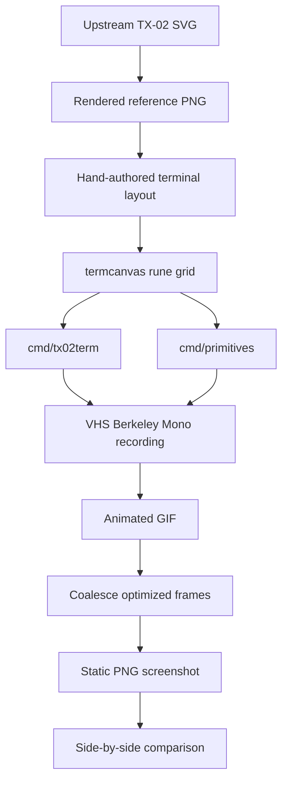

# TX-02 Terminal Recreation - Berkeley Mono Box Drawing

This project recreates the TX-02 typographic box-drawing composition from US Graphics as a Go-generated terminal printout. The target is not a pixel-perfect vector conversion; it is a terminal-native interpretation that preserves the poster's typography, boxes, arrows, shaded offsets, joke labels, and overall information-architecture while rendering in Berkeley Mono.

> [!summary]
> The project currently has three important identities:
> 1. a Go terminal-art renderer for a specific typographic composition,
> 2. a small reusable Unicode canvas for box drawing, arrows, and shadows,
> 3. a repeatable VHS screenshot workflow for Berkeley Mono visual review.

## Why this project exists

The source composition is a 600×600 SVG at `https://usgraphics.com/static/products/TX-02/images/TX-02-box-drawing.541f94d73270.svg`. It looks like a faux-enterprise architecture diagram: `UWORK®INC`, `CONTAINERIZATION ARCHITECTURE OF SCALABLE TECHNOLOGIES`, `NO SQL`, `PAAS`, `WEBSCALE™ MICROSERVICE`, `DATA SEWAGE`, `KUBERPODS`, `ERR/NOP/SOE`, and a large `DISTRIBUTED` frame.

The interesting constraint is that the reproduction should live in a terminal. That changes the problem from vector tracing into typographic translation: the implementation has to choose a grid, a font, box-drawing glyphs, arrowheads, and a shadow character that look convincing in a monospace terminal.

The repo is also an experiment in how to review terminal art. Ordinary terminal screenshots were unreliable under i3 tiling, so the project evolved toward a VHS-based capture pipeline where the font, canvas size, and screenshot extraction are scripted.

## Current project status

The repository is active and has a working full renderer plus a smaller primitive study.

What exists now:

- a Go module: `/home/manuel/code/wesen/2026-05-19--recreate-berkeley-design`
- a terminal canvas package: `internal/termcanvas/canvas.go`
- the full composition renderer: `cmd/tx02term/main.go`
- a primitive study renderer: `cmd/primitives/main.go`
- a docmgr ticket: `ttmp/2026/05/19/TX02-TERM--recreate-tx-02-box-drawing-composition-in-terminal/`
- local source reference artifacts:
  - `artifacts/reference/goal-composition.svg`
  - `artifacts/reference/goal-composition.png`
- VHS screenshot artifacts:
  - `artifacts/screenshots/primitives-berkeley.png`
  - `artifacts/screenshots/tx02-terminal-vhs-berkeley-crop.png`
- side-by-side comparison output:
  - `artifacts/comparison/reference-vs-terminal-vhs-berkeley.png`

The full composition is recognizably in place, but still needs local polish: shadow offsets, connector joins, label centering, and a few header spacing details.

## Project shape

The project has four layers:

1. **Reference capture**
   - download and preserve the source SVG,
   - render it to a local PNG,
   - inspect the visual layout as the target.
2. **Terminal canvas primitives**
   - write runes into a 2D grid,
   - draw boxes, labels, lines, arrows, and shadows.
3. **Composition renderers**
   - `cmd/primitives` validates individual glyph patterns,
   - `cmd/tx02term` encodes the full TX-02 poster layout.
4. **Visual review pipeline**
   - VHS captures the output using Berkeley Mono,
   - ImageMagick extracts a static PNG frame,
   - comparison images place the reference and terminal output side by side.



## Architecture

The architecture is deliberately small. There is no terminal UI framework and no external Go dependency. The Go code produces plain text; VHS and ImageMagick are outside the Go program and only support review artifacts.

```text
go run ./cmd/tx02term
  -> render()
  -> termcanvas.New(width, height)
  -> draw shadows, boxes, text, connectors, arrowheads
  -> fmt.Println(canvas.String())
  -> VHS captures terminal output with Berkeley Mono
```

The renderer treats terminal art as a hand-authored diagram on a fixed grid. That is the right abstraction because the SVG is path-heavy and does not expose semantic text nodes or connector objects that could be parsed into a diagram automatically.

## Implementation details

### The canvas model

`internal/termcanvas/canvas.go` defines a small `Canvas` type:

```go
type Canvas struct {
    W, H  int
    cells [][]rune
}
```

The core operations are intentionally direct:

- `Set(x, y, r)` writes one rune if coordinates are in bounds.
- `Text(x, y, s)` writes a string as runes.
- `HLine` and `VLine` draw box-drawing strokes.
- `Box` and `DoubleBox` draw rectangular frames.
- `LabeledBox` and `LabeledDoubleBox` center text inside frames.
- `Shadow` fills empty cells with `░`.
- `ArrowRight`, `ArrowLeft`, `ArrowUp`, and `ArrowDown` add simple shafts and arrowheads.

The important design choice is that `Shadow` only writes into empty cells:

```go
func (c *Canvas) Shadow(x, y, w, h int) {
    for yy := y; yy < y+h; yy++ {
        for xx := x; xx < x+w; xx++ {
            if c.At(xx, yy) == ' ' {
                c.Set(xx, yy, '░')
            }
        }
    }
}
```

That lets the full renderer draw broad shadow regions without overwriting box borders or text if a shadow rectangle overlaps something already drawn. It also means draw order matters: most shadows are drawn before boxes and connectors, but the empty-cell guard makes the renderer more forgiving.

### Primitive study first

The project originally tried to tune the whole poster directly. That drifted: terminal windows wrapped under i3, shadows looked like a checkerboard, and line corners overlapped into `┼` where a clean elbow was intended.

The fix was to create `cmd/primitives/main.go`, a small test sheet with six cases:

1. a simple box,
2. a shaded box,
3. a straight arrow,
4. a multi-corner arrow,
5. an arrow above a shaded box,
6. a vertical feed.

This turned abstract visual preferences into concrete rendering rules:

- use solid `░` blocks for shadows, not sparse dot patterns,
- use compact boxes with no empty bottom padding,
- place explicit corners (`┐`, `└`, `┘`, `┌`) for elbow arrows,
- use VHS instead of i3-managed terminal screenshots.

The primitive sheet is now the project's visual unit test. Before changing the full poster, it is worth running:

```bash
go run ./cmd/primitives
```

and regenerating the screenshot:

```bash
ttmp/2026/05/19/TX02-TERM--recreate-tx-02-box-drawing-composition-in-terminal/scripts/05-render-primitives-vhs.sh
```

### Full composition renderer

`cmd/tx02term/main.go` encodes the full poster by drawing named regions onto a `118×47` grid. The sequence is:

1. top header boxes,
2. shadow rectangles,
3. left-side `NO SQL` / `PAAS` / `WEB 3.0` trunk,
4. central microservice / JS / OOP loop,
5. `LOG4J`, `DATA SEWAGE`, and right-side stack,
6. lower-left `AI ENGINE → GIF → JIF`,
7. lower-right `DISTRIBUTED` frame.

A representative section looks like this:

```go
c.LabeledBox(55, 12, 29, 4, "WEBSCALE™", "MICROSERVICE")
c.HLine(45, 53, 15)
c.ArrowDown(45, 15, 25)
c.LabeledBox(38, 26, 14, 3, "JS LIB")
c.ArrowRight(52, 58, 27)
c.LabeledBox(61, 24, 16, 4, "OOP", "FACTORY")
c.Set(69, 18, '▲')
c.VLine(69, 19, 22)
c.Set(69, 23, '┘')
c.HLine(55, 68, 23)
```

This is intentionally hand-authored. It is closer to typesetting than to data-driven layout. Future improvements should not try to make this generic too early; the better next step is to add a few reusable helpers for common patterns such as shadowed boxes and elbow arrows.

## Screenshot and comparison workflow

VHS is now the preferred capture path. It avoids i3 floating/tiled window issues and gives the repo a repeatable font-controlled screenshot pipeline.

For the primitive study:

```bash
ttmp/2026/05/19/TX02-TERM--recreate-tx-02-box-drawing-composition-in-terminal/scripts/05-render-primitives-vhs.sh
```

For the full composition:

```bash
ttmp/2026/05/19/TX02-TERM--recreate-tx-02-box-drawing-composition-in-terminal/scripts/07-render-full-vhs.sh
```

The key implementation detail is that VHS writes optimized GIF frames. Extracting `gif[0]` gives the initial prompt, and extracting `gif[-1]` directly can produce a tiny partial frame. The scripts therefore coalesce frames first:

```bash
convert artifacts/screenshots/tx02-terminal-vhs-berkeley.gif -coalesce "$tmpdir/frame-%03d.png"
last_frame="$(find "$tmpdir" -name 'frame-*.png' | sort | tail -1)"
cp "$last_frame" artifacts/screenshots/tx02-terminal-vhs-berkeley.png
```

The full renderer also crops the VHS terminal screenshot before making the side-by-side comparison because the terminal viewport contains extra whitespace around the art.

## Important project docs

The docmgr ticket is the best narrative record of the work:

- Diary: `ttmp/2026/05/19/TX02-TERM--recreate-tx-02-box-drawing-composition-in-terminal/reference/01-diary.md`
- Design plan: `ttmp/2026/05/19/TX02-TERM--recreate-tx-02-box-drawing-composition-in-terminal/design-doc/01-terminal-recreation-plan.md`
- Changelog: `ttmp/2026/05/19/TX02-TERM--recreate-tx-02-box-drawing-composition-in-terminal/changelog.md`
- Scripts: `ttmp/2026/05/19/TX02-TERM--recreate-tx-02-box-drawing-composition-in-terminal/scripts/`

The most useful review images are:

- `artifacts/reference/goal-composition.png`
- `artifacts/screenshots/primitives-berkeley.png`
- `artifacts/screenshots/tx02-terminal-vhs-berkeley-crop.png`
- `artifacts/comparison/reference-vs-terminal-vhs-berkeley.png`

## What was tricky

### The SVG is not semantically useful

The SVG is mostly path data. There are no convenient text objects to extract and no meaningful diagram graph to parse. The project therefore had to begin with visual inspection and a hand-authored layout plan.

### Terminal screenshots were harder than rendering

The first screenshot attempts used real terminal windows. Under i3, the terminal tiled into a narrow column or scrolled unexpectedly, so the screenshot did not represent the intended output. VHS solved this by making the terminal capture declarative.

### Shadows needed primitive validation

The first shadow attempts used sparse dot/checker patterns. They looked wrong because the source artwork's shadow reads as a filled halftone block. The project settled on `░` as the terminal-native equivalent.

### Corners cannot be accidental intersections

The canvas can merge perpendicular lines into `┼`, which is useful for crossings but wrong for arrows that should visibly turn. The primitive study established that elbows need explicit glyph placement.

## Current limitations and open questions

The composition is usable but not finished. The highest-priority fixes are:

1. standardize shadow offsets and trim overshooting shadows,
2. snap connector joins and arrowheads to boxes more consistently,
3. recenter labels such as `DATA SEWAGE`, `OOP FACTORY`, `GIF`, `JIF`, `DISTRIBUTED`, and `WEB 3.0`,
4. polish header box spacing,
5. replace hard-coded crop bounds with either documented constants or a computed crop.

The biggest open design question is whether the renderer should stay as a coordinate script or grow a small layout vocabulary. A good compromise would be to keep the full composition hand-authored, but add helpers for repeated visual motifs:

```go
ShadowedBox(x, y, w, h, dx, dy, lines...)
ElbowArrow(points...)
BusWithTaps(x, y1, y2, taps...)
```

## Near-term next steps

- Keep the primitive study as a visual regression target.
- Apply polish to the full composition in small commits, each with a regenerated VHS comparison.
- Add helpers only after the repeated patterns are stable enough to name.
- Prefer VHS artifacts over the older i3/xterm screenshots when reviewing progress.

## Project working rule

This project should be treated like terminal typography, not like image conversion. The right workflow is:

1. preserve the visual reference,
2. validate primitive glyph choices,
3. hand-place the composition on a monospace grid,
4. capture with the intended font,
5. compare visually,
6. make small typographic corrections.

That loop is slower than dumping a raster image into blocks, but it produces an output that actually belongs in a terminal.
