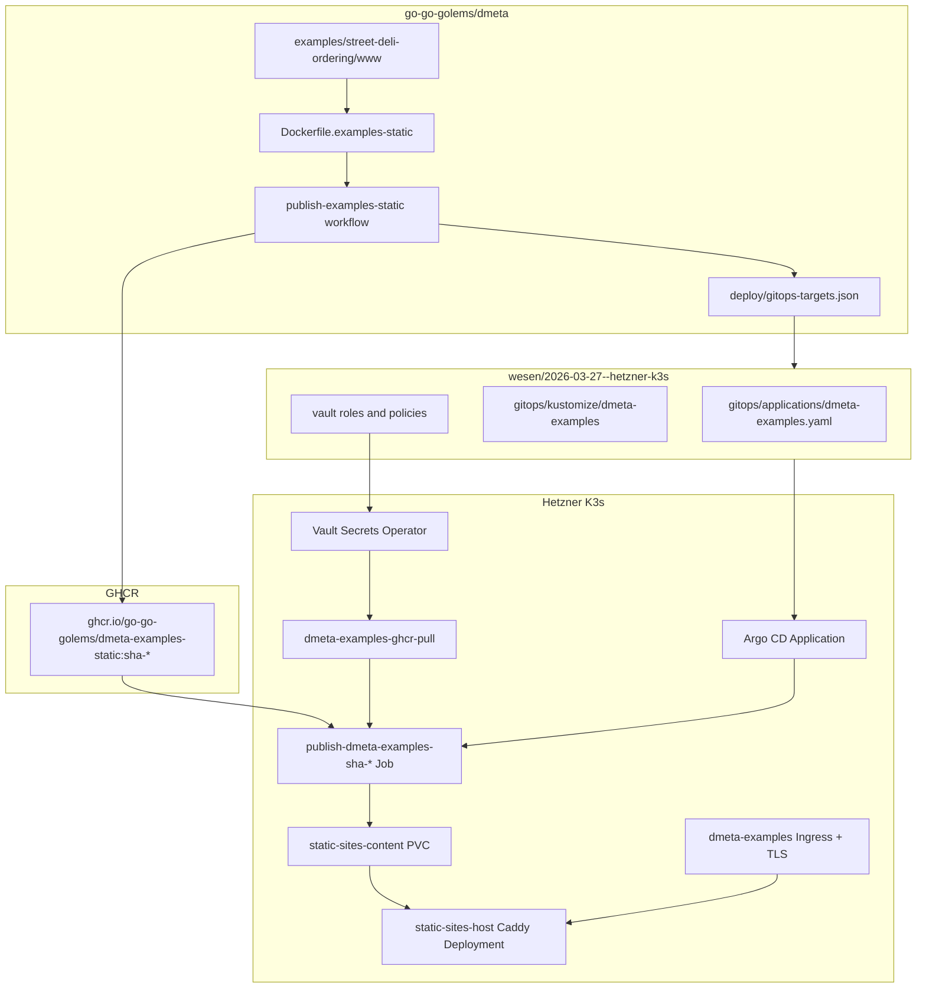

# DMETA Examples Production Rollout: Static Publisher Jobs, Vault OIDC, and GitOps Automation

This report explains the production rollout of the DMETA Street Deli examples to `https://dmeta-examples.yolo.scapegoat.dev`. The deployed site contains the mobile ordering prototype and the CLIM-style presentation UI prototype, both packaged from the `dmeta/examples/street-deli-ordering/www/` tree and served through the Hetzner K3s static-sites stack.

The rollout was not just a static file upload. It established a repeatable release path: the DMETA repository publishes an immutable GHCR image containing `/site`; the K3s GitOps repository declares a publisher Job that copies that artifact into the shared static-sites volume; Argo CD reconciles the desired state; Vault Secrets Operator supplies private GHCR pull credentials; and the shared `infra-tooling` automation opens future GitOps image bump PRs through Vault OIDC.

> [!summary]
> - The production site is live at `https://dmeta-examples.yolo.scapegoat.dev/`, with `/mobile/` and `/clim/` returning HTTP 200.
> - The release artifact is `ghcr.io/go-go-golems/dmeta-examples-static`, built from `Dockerfile.examples-static` and published by `.github/workflows/publish-examples-static.yaml`.
> - The cluster does not run a dedicated DMETA web Deployment. It runs a one-shot publisher Job that copies static files into the existing `static-sites-host` content volume.
> - The rollout exposed a real automation gap: generic image patching is sufficient for Deployments but incomplete for immutable publisher Jobs. `infra-tooling` now has `patch_strategy: static-publisher-job` to update Job name, image tag, release label, and shell release variable together.

## Why this report exists

The DMETA examples began as local prototypes. The mobile prototype demonstrated a touch-first customer ordering interface for intelligent ingredient replacement. The CLIM prototype demonstrated the same domain model through typed presentations, commands, and action dispatch. Both prototypes had already been promoted into a static `www/` directory under the DMETA repository:

```text
/home/manuel/workspaces/2026-05-19/dmeta-dsl/dmeta/examples/street-deli-ordering/www/
├── index.html
├── mobile/
│   ├── index.html
│   ├── app.js
│   └── styles.css
└── clim/
    ├── index.html
    ├── app.js
    ├── styles.css
    ├── js/
    └── fonts/
```

The missing step was production. The desired outcome was not only that the files should be reachable from a public URL. The desired outcome was that future changes to those examples should follow the same release discipline as the other K3s-hosted applications: immutable artifacts, reviewed GitOps changes, Argo CD reconciliation, and explicit operational evidence.

This report preserves the technical decisions behind that rollout. It also records the failure modes we hit, because those failures shaped the final automation.

## Final state

The final production state is:

| Surface | Value |
|---|---|
| Public root | `https://dmeta-examples.yolo.scapegoat.dev/` |
| Mobile prototype | `https://dmeta-examples.yolo.scapegoat.dev/mobile/` |
| CLIM prototype | `https://dmeta-examples.yolo.scapegoat.dev/clim/` |
| Source repo | `/home/manuel/workspaces/2026-05-19/dmeta-dsl/dmeta` |
| GitHub source repo | `go-go-golems/dmeta` |
| GitOps repo | `/home/manuel/code/wesen/2026-03-27--hetzner-k3s` |
| Static image | `ghcr.io/go-go-golems/dmeta-examples-static` |
| Final automated image | `ghcr.io/go-go-golems/dmeta-examples-static:sha-72238d0` |
| Final Argo revision observed | `b182e07ec4ccc16c62de1f62688d8291d0858b86` |
| Final publisher Job observed | `publish-dmeta-examples-sha-72238d0` |
| Argo status observed | `Synced Healthy` |

The final validation returned HTTP 200 for the root pages and assets:

```text
https://dmeta-examples.yolo.scapegoat.dev/                         HTTP/2 200
https://dmeta-examples.yolo.scapegoat.dev/mobile/                  HTTP/2 200
https://dmeta-examples.yolo.scapegoat.dev/clim/                    HTTP/2 200
https://dmeta-examples.yolo.scapegoat.dev/mobile/app.js            HTTP/2 200
https://dmeta-examples.yolo.scapegoat.dev/clim/app.js              HTTP/2 200
https://dmeta-examples.yolo.scapegoat.dev/clim/fonts/BerkeleyMono-Regular.woff2  HTTP/2 200
```

The relevant PRs were:

| PR | Repository | Purpose |
|---|---|---|
| `go-go-golems/dmeta#1` | source | Add packaging, source workflow, and GitOps PR metadata. |
| `wesen/2026-03-27--hetzner-k3s#87` | GitOps | Add initial K3s Application, static-sites manifests, Vault/VSO private image pull wiring, and Vault OIDC role/policy. |
| `wesen/2026-03-27--hetzner-k3s#88` | GitOps | Automated image bump opened by the source workflow after source PR #1 merged. |
| `wesen/2026-03-27--hetzner-k3s#89` | GitOps | Fix immutable Job drift by aligning the Job name and release token with `sha-a291e27`. |
| `go-go-golems/infra-tooling#4` | tooling | Add `patch_strategy: static-publisher-job` to the shared GitOps PR action. |
| `go-go-golems/dmeta#3` | source | Configure DMETA to use the new static publisher patch strategy. |
| `wesen/2026-03-27--hetzner-k3s#90` | GitOps | Prove the fixed automation by opening and merging a correct static publisher Job bump to `sha-72238d0`. |

## The architecture in one view

The final release chain has four repositories or systems with different responsibilities. The source repository owns the files and the artifact. GHCR owns immutable artifact storage. The GitOps repository owns desired cluster state. The cluster owns the live reconciliation result.



The important boundary is that publishing the image does not deploy the site. Deployment happens only when the GitOps repository changes and Argo CD reconciles that change. This boundary matters because it gives the operator a concrete review point: the GitOps PR says exactly which immutable artifact should become live.

## Why this is a Job, not a Deployment

A normal web application usually deploys as a long-running Kubernetes Deployment. The pod serves HTTP. Updating the application means changing the Deployment image and allowing Kubernetes to roll pods.

The DMETA examples site is different. The cluster already has a shared static-sites host, implemented as a Caddy Deployment named `static-sites-host`. That Deployment owns the long-running HTTP server. It reads files from a shared persistent volume and serves the directory selected by the request host.

The DMETA-specific workload therefore does not need to serve HTTP. It has one task: copy a versioned static site artifact into the shared content volume and atomically update the host's `current` symlink.

That task is finite. A Kubernetes Job is the correct workload type for finite work.

The publisher Job performs this sequence:

```sh
set -eu
host="dmeta-examples.yolo.scapegoat.dev"
release="sha-72238d0"
base="/srv/sites/${host}"
target="${base}/releases/${release}"
tmp="${target}.tmp"

rm -rf "${tmp}" "${target}"
mkdir -p "${tmp}"
cp -a /site/. "${tmp}/"
mv "${tmp}" "${target}"
ln -sfn "releases/${release}" "${base}/current"
find "${target}" -maxdepth 3 -type f | sort | head -100
```

This command has a small but important shape:

1. It copies into a temporary release directory.
2. It moves the temporary directory into its final versioned release path.
3. It updates `current` to point at the new release.
4. It leaves older releases on disk for inspection or rollback.

A Deployment would be the wrong abstraction for this work because there is no DMETA-specific server process to keep alive. The long-running server is shared infrastructure. The DMETA release is content publication.

The static-sites host uses this content layout:

```text
/srv/sites/
└── dmeta-examples.yolo.scapegoat.dev/
    ├── current -> releases/sha-72238d0
    └── releases/
        ├── sha-3697432/
        ├── sha-a291e27/
        └── sha-72238d0/
```

The Caddy configuration in the static-sites host resolves the request host to a content root:

```caddyfile
root * /srv/sites/{host}/current
try_files {path} {path}/ /index.html
file_server
```

The consequence is that each static site gets independent release history while sharing one Caddy runtime.

## Packaging the source artifact

The source package is deliberately simple. `Dockerfile.examples-static` does not build a server. It produces an artifact image whose content contract is `/site`.

```dockerfile
FROM alpine:3.20

WORKDIR /
COPY examples/street-deli-ordering/www/ /site/

RUN find /site -type f | sort > /site-manifest.txt \
  && test -f /site/index.html \
  && test -f /site/mobile/index.html \
  && test -f /site/mobile/app.js \
  && test -f /site/mobile/styles.css \
  && test -f /site/clim/index.html \
  && test -f /site/clim/app.js \
  && test -f /site/clim/styles.css \
  && test -f /site/clim/fonts/BerkeleyMono-Regular.woff2
```

Alpine is used because the publisher Job overrides the container command and needs `sh`, `cp`, `mv`, `ln`, and `find`. A scratch image would be a smaller artifact, but it would not satisfy the runtime contract of the publisher Job.

The source workflow calls the shared `infra-tooling` reusable workflow:

```yaml
jobs:
  release:
    uses: go-go-golems/infra-tooling/.github/workflows/publish-ghcr-image.yml@main
    secrets: inherit
    with:
      dockerfile: ./Dockerfile.examples-static
      build_context: .
      test_command: test -f examples/street-deli-ordering/www/index.html && test -f examples/street-deli-ordering/www/mobile/index.html && test -f examples/street-deli-ordering/www/clim/index.html
      image_name: ghcr.io/go-go-golems/dmeta-examples-static
      gitops_target_config: deploy/gitops-targets.json
      push_image: ${{ github.event_name != 'pull_request' }}
      open_gitops_pr: ${{ github.event_name != 'pull_request' && github.ref == 'refs/heads/main' }}
      gitops_pr_token_source: vault
      vault_role: dmeta-gitops-pr
      vault_secret_path: kv/data/ci/github/dmeta/gitops-pr-token
```

The `test_command` is intentionally file-oriented rather than `go test ./...`. The DMETA Go module uses a local `replace` directive for `../glazed`, which works in the local multi-repository workspace but fails in a clean GitHub Actions checkout. For this static artifact, the correct CI assertion is that the static site content required by the Dockerfile exists.

The workflow has two jobs inside the reusable workflow:

1. Publish the immutable GHCR image.
2. When running on `main`, authenticate to Vault through GitHub Actions OIDC, read the GitOps PR token, patch the GitOps target, and open or update a GitOps PR.

## Vault OIDC for GitOps PR creation

The source repository should not store a long-lived GitOps token as a GitHub repository secret. The platform pattern is to let GitHub Actions request an OIDC token, present that token to Vault, and read a repo-specific GitOps PR credential from Vault.

The K3s repo contains the Vault role and policy for this source workflow:

```hcl
# vault/policies/github-actions/dmeta-gitops-pr.hcl
path "kv/data/ci/github/dmeta/gitops-pr-token" {
  capabilities = ["read"]
}
```

```json
{
  "role_type": "jwt",
  "user_claim": "repository",
  "bound_audiences": ["https://vault.yolo.scapegoat.dev"],
  "bound_claims": {
    "repository_owner": "go-go-golems",
    "repository": "go-go-golems/dmeta",
    "ref": "refs/heads/main",
    "event_name": "push"
  },
  "policies": ["gha-dmeta-gitops-pr"],
  "ttl": "10m",
  "max_ttl": "30m",
  "token_explicit_max_ttl": "30m"
}
```

The bound claims are part of the security model. A pull request run cannot read the token. A feature branch run cannot read the token. A different repository cannot read the token. Only a `push` run from `go-go-golems/dmeta` on `refs/heads/main` can authenticate with this role.

That role was exercised successfully after DMETA PR #1 merged. The main workflow published the image and opened K3s PR #88. After `infra-tooling` was updated, the same path opened K3s PR #90 with the correct static publisher Job diff.

## Private GHCR image pulls through Vault Secrets Operator

The GHCR package is private. An anonymous pull test returned `unauthorized`. The solution was not to make the package public. The existing K3s pattern, already used by `retro-obsidian-publish`, is to store registry credentials in Vault and let Vault Secrets Operator render a Kubernetes Docker config secret.

The dmeta-examples GitOps package therefore includes:

```text
gitops/kustomize/dmeta-examples/serviceaccount.yaml
gitops/kustomize/dmeta-examples/vault-connection.yaml
gitops/kustomize/dmeta-examples/vault-auth.yaml
gitops/kustomize/dmeta-examples/vault-static-secret-image-pull.yaml
vault/policies/kubernetes/dmeta-examples.hcl
vault/roles/kubernetes/dmeta-examples.json
```

The Vault role is bound to a ServiceAccount in the `static-sites` namespace:

```json
{
  "bound_service_account_names": ["dmeta-examples"],
  "bound_service_account_namespaces": ["static-sites"],
  "policies": ["dmeta-examples"],
  "token_ttl": "1h"
}
```

The policy allows reading only the image-pull path:

```hcl
path "kv/data/apps/dmeta-examples/prod/image-pull" {
  capabilities = ["read"]
}

path "kv/metadata/apps/dmeta-examples/prod/image-pull" {
  capabilities = ["read"]
}
```

The `VaultStaticSecret` renders the Kubernetes secret:

```yaml
apiVersion: secrets.hashicorp.com/v1beta1
kind: VaultStaticSecret
metadata:
  name: dmeta-examples-ghcr-pull
spec:
  vaultAuthRef: dmeta-examples
  mount: kv
  type: kv-v2
  path: apps/dmeta-examples/prod/image-pull
  destination:
    name: dmeta-examples-ghcr-pull
    create: true
    overwrite: true
    type: kubernetes.io/dockerconfigjson
    transformation:
      excludes:
        - ".*"
      templates:
        .dockerconfigjson:
          text: |
            {"auths":{"{{ .Secrets.server }}":{"username":"{{ .Secrets.username }}","password":"{{ .Secrets.password }}","auth":"{{ .Secrets.auth }}"}}}
```

The publisher Job references that secret:

```yaml
spec:
  template:
    spec:
      serviceAccountName: dmeta-examples
      imagePullSecrets:
        - name: dmeta-examples-ghcr-pull
```

This is why the private image can be pulled by the cluster even though anonymous `docker pull` fails. The cluster does not pull anonymously. It uses a VSO-rendered pull secret.

## The first deployment sequence

The first K3s PR added the new Argo Application and Kustomize package. A new `gitops/applications/*.yaml` file is not enough by itself in this repo. There is no app-of-apps layer that automatically applies every new Application object. The Application must be bootstrapped once:

```bash
cd /home/manuel/code/wesen/2026-03-27--hetzner-k3s
export KUBECONFIG=$PWD/.cache/kubeconfig-tailnet.yaml
kubectl apply -f gitops/applications/dmeta-examples.yaml
kubectl -n argocd annotate application dmeta-examples argocd.argoproj.io/refresh=hard --overwrite
```

After that, Argo CD created the Kubernetes resources declared by the Kustomize package:

```text
ServiceAccount/dmeta-examples
VaultConnection/vault
VaultAuth/dmeta-examples
VaultStaticSecret/dmeta-examples-ghcr-pull
Secret/dmeta-examples-ghcr-pull
Ingress/dmeta-examples
Job/publish-dmeta-examples-sha-3697432
```

The publisher Job completed. cert-manager issued `dmeta-examples-tls`. Argo reported `Synced Healthy`.

The initial public smoke tests returned HTTP 200. At that point the site was live.

## The immutable Job failure

The first main-branch image bump exposed a design issue in the shared GitOps PR action. The generic image-bump action was built for Deployments. It finds a named container and changes its `image:` field. That behavior is correct for most long-running applications.

For a static publisher Job, the immutable release token appears in several places:

```yaml
metadata:
  name: publish-dmeta-examples-sha-a291e27

labels:
  static.wesen.dev/release: sha-a291e27

containers:
  - name: publish
    image: ghcr.io/go-go-golems/dmeta-examples-static:sha-a291e27
    command:
      - sh
      - -c
      - |
        release="sha-a291e27"
```

The first automated GitOps bump changed only the image field. Argo tried to patch the existing Job, and Kubernetes rejected it:

```text
Job.batch "publish-dmeta-examples-sha-3697432" is invalid:
spec.template: Invalid value ... field is immutable
```

This error is specific to Jobs. A Deployment is designed to roll pods when the pod template changes. A Job records a completed execution. Mutating the pod template of an existing Job would change the definition of work that has already been created, so Kubernetes rejects the patch.

The manual fix was K3s PR #89. It aligned the Job name and release token with the image tag and added:

```yaml
argocd.argoproj.io/sync-options: Replace=true
```

The deeper fix was to update `infra-tooling` so the source workflow no longer generates partial static publisher Job bumps.

## Updating infra-tooling

The shared `open-gitops-pr` action now supports an optional `patch_strategy` field in `deploy/gitops-targets.json`.

The default remains the original behavior:

```json
"patch_strategy": "container-image"
```

For DMETA examples, the target now uses:

```json
{
  "targets": [
    {
      "name": "dmeta-examples-prod",
      "gitops_repo": "wesen/2026-03-27--hetzner-k3s",
      "gitops_branch": "main",
      "manifest_path": "gitops/kustomize/dmeta-examples/publish-job.yaml",
      "container_name": "publish",
      "patch_strategy": "static-publisher-job"
    }
  ]
}
```

The new strategy has two responsibilities:

1. Update the named container image.
2. Replace every `sha-*` release token in the manifest with the release token derived from the new image tag.

The core implementation is small:

```python
SHA_RE = re.compile(r"^(?:sha-)?[0-9a-fA-F]{7,40}$")
RELEASE_RE = re.compile(r"sha-[0-9a-fA-F]{7,40}")


def release_from_image(image: str) -> str:
    if ":" not in image:
        raise ValueError(
            f"static-publisher-job strategy requires an image tag in {image!r}; "
            "expected an immutable sha-<git-sha> tag"
        )
    return normalize_release(image.rsplit(":", 1)[1])


def patch_static_publisher_job(manifest_path: Path, container_name: str, image: str):
    original = manifest_path.read_text(encoding="utf-8")
    new_release = release_from_image(image)
    _, with_image = replace_manifest_image_text(
        manifest_path=manifest_path,
        original=original,
        container_name=container_name,
        image=image,
    )
    releases = sorted(set(RELEASE_RE.findall(with_image)))
    if not releases:
        raise ValueError(f"no sha-* release token found in static publisher manifest {manifest_path}")
    updated = RELEASE_RE.sub(new_release, with_image)
    if updated == original:
        return False, original, original
    manifest_path.write_text(updated, encoding="utf-8")
    return True, original, updated
```

The tests assert that a static publisher manifest is updated in all four relevant locations:

- `metadata.name`
- `static.wesen.dev/release`
- container `image:`
- shell `release="sha-..."`

The validation command was:

```bash
cd /tmp/infra-tooling
python -m unittest tests.gitops.test_open_gitops_pr
```

The code was developed in a temporary clone at `/tmp/infra-tooling` because the repository was not already checked out under `/home/manuel/code/wesen`. That was a scratch working copy only. The changes were committed to a branch, pushed to GitHub, reviewed through PR #4, and merged into `go-go-golems/infra-tooling` main. The authoritative copy is the GitHub repository, not the temporary directory.

## Proving the tooling change

After `infra-tooling` PR #4 merged, DMETA PR #3 updated `deploy/gitops-targets.json` to use `patch_strategy: static-publisher-job`. Merging that PR triggered the source workflow again.

The workflow published a new image:

```text
ghcr.io/go-go-golems/dmeta-examples-static:sha-72238d0
```

It then opened K3s PR #90. The important evidence is the diff. The PR changed all release tokens together:

```diff
-metadata:
-  name: publish-dmeta-examples-sha-a291e27
+metadata:
+  name: publish-dmeta-examples-sha-72238d0

-    static.wesen.dev/release: sha-a291e27
+    static.wesen.dev/release: sha-72238d0

-          image: ghcr.io/go-go-golems/dmeta-examples-static:sha-a291e27
+          image: ghcr.io/go-go-golems/dmeta-examples-static:sha-72238d0

-              release="sha-a291e27"
+              release="sha-72238d0"
```

That PR was merged. Argo CD reconciled successfully. The new publisher Job completed:

```text
job.batch/publish-dmeta-examples-sha-72238d0  Complete  1/1
```

The Application returned to:

```text
Synced Healthy b182e07ec4ccc16c62de1f62688d8291d0858b86
```

This proves the automation path that matters for future releases:

```text
DMETA main push
  -> publish GHCR image sha-<source-sha>
  -> Vault OIDC obtains GitOps PR token
  -> infra-tooling patches static publisher Job using static-publisher-job strategy
  -> GitOps PR updates every release token
  -> merge PR
  -> Argo runs a new publisher Job
  -> static-sites-host serves the new release
```

## Failure modes and what they taught us

### Local GitOps pushes are the wrong default

The first attempt to push local K3s `main` failed because `origin/main` had advanced. Rebasing then conflicted in unrelated `retro-obsidian-publish` work. This was useful evidence. The right deployment path is not to force local `main` forward. The right path is a GitOps PR.

The final process used GitHub PRs for source, GitOps, and tooling changes. That made each control-plane boundary explicit.

### Go tests were the wrong validation for this static artifact

The first reusable workflow attempt used `go test ./...` and failed because the clean GitHub runner did not have the local `../glazed` replacement directory:

```text
github.com/go-go-golems/glazed@v0.0.0: replacement directory ../glazed does not exist
```

For a Go service, this failure would indicate a source packaging issue. For this static artifact, it did not test the right contract. The static release depends on `examples/street-deli-ordering/www`, not on compiling the DMETA CLI. The workflow now validates the required static entrypoints directly.

### Private GHCR requires explicit cluster credentials

Publishing an image to GHCR does not make it pullable by the cluster. Private GHCR packages require either public package visibility or an image pull secret. The rollout followed the existing `retro-obsidian-publish` pattern and used Vault Secrets Operator to render `dmeta-examples-ghcr-pull`.

### Job release tokens are part of the deployment contract

For Deployments, changing `image:` is enough. For static publisher Jobs, the release token appears in object identity, labels, and shell logic. Those tokens must move together. This is now encoded in `infra-tooling` rather than relying on manual follow-up PRs.

## Commands that validate the live system

The following commands validate the final live state:

```bash
cd /home/manuel/code/wesen/2026-03-27--hetzner-k3s
export KUBECONFIG=$PWD/.cache/kubeconfig-tailnet.yaml

kubectl -n argocd get application dmeta-examples
kubectl -n static-sites get vaultauth dmeta-examples
kubectl -n static-sites get vaultstaticsecret dmeta-examples-ghcr-pull
kubectl -n static-sites get secret dmeta-examples-ghcr-pull dmeta-examples-tls
kubectl -n static-sites get job publish-dmeta-examples-sha-72238d0

curl -fsSI https://dmeta-examples.yolo.scapegoat.dev/
curl -fsSI https://dmeta-examples.yolo.scapegoat.dev/mobile/
curl -fsSI https://dmeta-examples.yolo.scapegoat.dev/clim/
```

Expected results:

```text
Application: Synced Healthy
VaultAuth: HEALTHY True, READY True
VaultStaticSecret: SYNCED True, HEALTHY True, READY True
Secret dmeta-examples-ghcr-pull: kubernetes.io/dockerconfigjson
Secret dmeta-examples-tls: kubernetes.io/tls
Job publish-dmeta-examples-sha-72238d0: Complete 1/1
HTTP: 200 for /, /mobile/, /clim/
```

## Working rules for future static-site rollouts

The rollout establishes a set of rules that should be reused for future static sites on this cluster.

- Static sites should publish immutable artifact images with content under `/site`.
- The K3s repo should use a publisher Job when the runtime is the shared `static-sites-host` Caddy service.
- Private GHCR images should use Vault/VSO image pull secrets rather than depending on public package visibility.
- New Argo CD Applications still require a one-time `kubectl apply` bootstrap unless an app-of-apps layer is added later.
- Source repos should use Vault OIDC to obtain GitOps PR credentials; they should not store a long-lived GitOps token in GitHub repository secrets.
- Static publisher Jobs should use `patch_strategy: static-publisher-job` in `deploy/gitops-targets.json`.
- Publisher Job manifests should keep every release token synchronized: object name, image tag, release label, and shell `release` variable.
- Publisher Jobs should include `argocd.argoproj.io/sync-options: Replace=true` when future changes may otherwise attempt to mutate immutable Job fields.

## Remaining improvements

The rollout is complete, but two improvements would make the platform cleaner.

First, the image-pull credential stored at `kv/apps/dmeta-examples/prod/image-pull` should ideally use a narrow package-read token rather than a broad operator token. The current shape is operationally correct, but the credential can be reduced in scope.

Second, the completed publisher Jobs may accumulate in `static-sites`. That is acceptable for short-term release evidence, but the platform may eventually want a retention policy for old completed publisher Jobs and old release directories.

Neither improvement blocks the production site. They are follow-up hardening tasks.

## Conclusion

The DMETA examples rollout converted local prototypes into a production-hosted static site with a repeatable release path. The mobile and CLIM prototypes are now public, served by the cluster's shared static-sites host, and updated through immutable image publication and GitOps PRs.

The most important technical result is not the public URL itself. The important result is that the rollout exposed and fixed a class of automation bug: static publisher Jobs cannot be treated exactly like Deployments. The release token is part of the Job identity and filesystem publication path. The shared tooling now understands that distinction through `patch_strategy: static-publisher-job`.

A future DMETA example update should now follow the full automated path: merge source changes, publish a new static artifact image, open a GitOps PR that updates all release tokens together, merge the PR, and let Argo CD run a new publisher Job. The live site is the result of that pipeline, and the pipeline is now ready for the next release.
