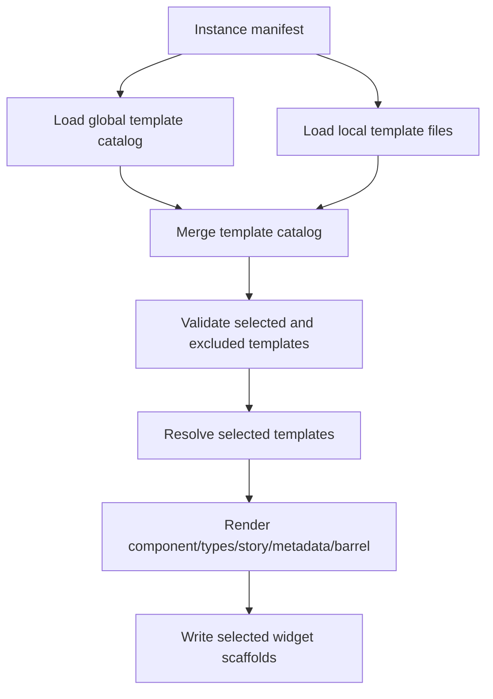

# Project Report: Widget Templates and Street Deli Menu Instantiations

This report explains the widget-template work in DMETA as a technical sequence. It starts with the original problem: a meta design-system cannot treat every widget definition as a mandatory component. It then explains the clean cutover from a monolithic widget IR to a split template catalog, the instance manifest model, the generator changes, and the expansion of the Street Deli example from one sandwich-specific flow into a flexible menu-ordering design system.

The goal is not only to record what changed. The goal is to make the design understandable enough that a new intern can extend it without copying patterns mechanically. The important idea is that DMETA now separates **template availability** from **instance selection**. A widget template says what the factory knows how to scaffold. An instance manifest says which templates a concrete design system actually chooses.

## 1. The problem: widget definitions were becoming product commitments

DMETA began with a small widget IR in:

```text
sources/dmeta-ir/03-widgets.yaml
```

That file listed generic dense-operational widgets such as:

- `PresentationToken`
- `StatusBadge`
- `CompactReference`
- `MetricCell`
- `RecordStream`
- `DenseTable`
- `DetailDrawer`
- `ActionPalette`

These widgets are useful in many dense/event-oriented applications. The early design also identified helper widgets from the Hair Booking admin system: shells, panels, toolbars, filters, search boxes, split panes, tabs, key-value lists, comparison tables, confirmation dialogs, and form fields. That inventory was valuable, but it created a semantic risk. If all of those widgets live in one file called `03-widgets.yaml`, a reader can easily infer that every generated design system should contain every listed widget.

That inference is wrong for a meta design system. DMETA is not a single component library. It is a factory for creating concrete design systems. A concrete instance may be a log console, a logistics queue, a restaurant ordering app, a book OCR dashboard, a monitoring wallboard, or a workflow debugger. Those applications need different widget subsets.

A book OCR dashboard might need one large dashboard display and a specialized autocomplete search over books, authors, ISBNs, batches, pages, and OCR jobs. It may not need tabs, split panes, drawers, comparison tables, or a generic key-value inspector. A mobile sandwich-ordering app may need composition cards, ingredient rows, substitution chips, a cart, and order tracking. It does not need `DenseTable` or `ActionPalette`. An agent event console may need the reverse: `RecordStream`, `FilterBar`, `SearchBox`, `DetailDrawer`, and `ActionPalette`, but no sandwich customizer.

The original widget IR did not represent that distinction. It described possible widgets, but the file shape made them look like a fixed catalog. The project therefore needed a new model.

## 2. The key design decision: templates are available; instances select

The core design decision was to rename the meaning of widget records. A widget record in the global DMETA IR is now a **template**. It is a selectable and adaptable starting point. It does not become generated code until an instance manifest selects it.

The distinction is precise:

| Concept | Meaning | File location |
|---|---|---|
| Widget template | A reusable scaffoldable pattern with contracts, selection guidance, variants, and adaptation points. | `sources/dmeta-ir/widget-templates/*.yaml` |
| Instance manifest | A concrete application's selected and excluded templates, aliases, variants, and reasons. | `examples/.../instantiations/*.yaml` |
| Generated widget scaffold | Concrete component/type/story/metadata files generated from selected templates. | `examples/.../generated/...` |
| Promoted widget | A generated scaffold that has been manually implemented and should no longer be overwritten casually. | Future promoted package path |

The generator therefore changed from this model:

```text
read 03-widgets.yaml
  -> scaffold every widget in the file
```

to this model:

```text
read global template catalog
read local instance template files
read instance manifest
resolve selected templates
validate selections and exclusions
scaffold only selected concrete widgets
```

The new model prevents unused widgets from becoming accidental requirements. It also lets concrete applications specialize. A search widget can be a simple text input in one instance and an entity-autocomplete search surface in another. Both may originate from the same template family, but the selected variant and adaptations belong to the instance.

## 3. The clean cutover: `03-widgets.yaml` became a package index

The user explicitly requested no backwards-compatibility wrappers. The project therefore made a clean cutover. The global `03-widgets.yaml` no longer contains the monolithic widget list. It is now an index for a split template package:

```text
sources/dmeta-ir/
  03-widgets.yaml
  widget-templates/
    00-index.yaml
    actions.yaml
    dashboards.yaml
    data-display.yaml
    filters.yaml
    forms.yaml
    layout.yaml
    presentations.yaml
    states.yaml
    streams.yaml
    surfaces.yaml
    tables.yaml
```

The top-level file now declares the package type:

```yaml
schema_version: 0
artifact_type: dmeta_widget_template_package
summary: Widget template package index for DMETA v0.
files:
  index: ./widget-templates/00-index.yaml
  presentations: ./widget-templates/presentations.yaml
  streams: ./widget-templates/streams.yaml
  tables: ./widget-templates/tables.yaml
  surfaces: ./widget-templates/surfaces.yaml
  actions: ./widget-templates/actions.yaml
  filters: ./widget-templates/filters.yaml
  layout: ./widget-templates/layout.yaml
  dashboards: ./widget-templates/dashboards.yaml
  forms: ./widget-templates/forms.yaml
  states: ./widget-templates/states.yaml
  data_display: ./widget-templates/data-display.yaml
```

The validator was updated to require this package type. There is no monolithic fallback. That matters because compatibility shims would allow two meanings of the same artifact to coexist. The clean cutover forces authors, validators, and generators to agree that widgets are templates.

The loader path is now:

```text
validator.LoadPackage(root)
  -> load 00-index.yaml
  -> load 01-core-model.yaml and split core-model files
  -> load 02-design-language.yaml
  -> load 03-widgets.yaml as dmeta_widget_template_package
  -> load each widget-templates/*.yaml file listed in files
  -> merge templates into Package.Widgets.Widgets
```

The relevant implementation files are:

```text
pkg/dmeta/validator/model.go
pkg/dmeta/validator/load.go
pkg/dmeta/validator/validate.go
```

The loader deliberately fails if `03-widgets.yaml` is not a `dmeta_widget_template_package`. This is a structural invariant of the new system.

## 4. Anatomy of a widget template

A template keeps the useful parts of the earlier widget IR: component name, classification, intent, consumed semantic concepts, props, action slots, stories, and output paths. It adds `template` metadata that explains how a concrete instance should decide whether to select it.

A simplified template looks like this:

```yaml
- id: dmeta.search_box
  name: SearchBox
  status: template
  classification:
    level: molecule
    role: search_control
  intent:
    purpose: Render scoped text search or autocomplete search for a searchable result target.
    adapter_boundary: Receives normalized view models and typed semantic refs; emits typed callbacks.
  template:
    category: filters
    selection: optional
    maturity: draft
    default_importance: common
    selection_questions:
      - Does this concrete instance need this widget behavior, or is it better represented by a domain-specific local template?
      - Which selected presentations/actions should this template expose?
    adaptation_points:
      - autocomplete_sources
      - suggestion_grouping
      - query_syntax
      - scope_labels
      - keyboard_behavior
    common_variants:
      - simple_text_search
      - scoped_search
      - autocomplete_entity_search
    avoid_when:
      - Search is not a primary workflow or fixed filters are sufficient.
  consumes:
    capabilities: [searchable]
    presentations: [search_summary, compact_ref, inline_token]
  contract:
    props:
      SearchBoxProps:
        fields:
          target:
            type: FilterTargetRef
            required: true
          query:
            type: string
            required: false
          suggestions:
            type: SearchSuggestion[]
            required: false
    action_slots:
      onSearch:
        accepts: SearchExpression
      onChooseSuggestion:
        accepts: PresentationRef
```

The new metadata does real work:

- `selection` says whether the template is common, optional, rare, or only selected by a broader pattern.
- `selection_questions` guide design sessions and instance authors.
- `adaptation_points` tell the author where specialization is expected.
- `common_variants` support validation of instance manifests.
- `avoid_when` prevents optional widgets from being treated as defaults.

A template without selection guidance is incomplete. It describes how to scaffold a component, but not when the component belongs in a concrete design system.

## 5. The global template catalog after expansion

The global catalog now contains 48 templates across 11 category files. These are not automatically generated. They are available for selection.

| Category | File | Examples |
|---|---|---|
| Presentations | `presentations.yaml` | `PresentationToken`, `StatusBadge`, `CompactReference`, `MetricCell` |
| Streams | `streams.yaml` | `RecordStream` |
| Tables | `tables.yaml` | `DenseTable`, `PresentationCell`, `BulkActionBar` |
| Surfaces | `surfaces.yaml` | `DetailDrawer` |
| Actions | `actions.yaml` | `ActionPalette`, `ActionButton`, `ActionGroup`, `ContextMenuTrigger` |
| Filters | `filters.yaml` | `FilterBar`, `SearchBox`, `FacetPanel`, `ResultSummary`, `SavedFilterMenu`, `ResultWindowControls` |
| Layout | `layout.yaml` | `WorkbenchShell`, `PageHeader`, `Panel`, `Toolbar`, `SplitPane`, `Tabs` |
| Dashboards | `dashboards.yaml` | `OperationalDashboard`, `DashboardRegion`, `MetricSummaryStrip`, `QueueHealthPanel` |
| Forms | `forms.yaml` | `ActionParameterForm`, `FieldGroup`, `FieldShell`, `TextField`, `SelectField`, `DateTimeField` |
| States | `states.yaml` | `EmptyState`, `LoadingState`, `InlineError`, `DisconnectedState`, `StaleDataIndicator` |
| Data display | `data-display.yaml` | `KeyValueList`, `ComparisonTable`, `MarkdownBlock`, `PreviewFrame` |

The important entries are not only the common ones. The rare entries are important because their rarity is now explicit. `KeyValueList` and `ComparisonTable` exist in the catalog, but they are marked `selection: rare`. Their `avoid_when` guidance explains that they should not be selected unless the concrete instance has a real inspector or comparison workflow.

This is the correct behavior for a meta design system. The catalog should know how to produce a comparison table. It should not imply that every application needs one.

## 6. Instance manifests: the concrete selection layer

An instance manifest is the document that turns templates into concrete generated widgets. It lives under an `instantiations/` directory. For Street Deli:

```text
examples/street-deli-ordering/instantiations/
  street-deli-ordering.yaml
  street-deli-coffee-counter.yaml
```

A manifest has four jobs:

1. It names the concrete design-system instance.
2. It declares global and local template sources.
3. It selects templates with concrete component names, variants, and reasons.
4. It excludes templates with reasons so omissions are intentional.

The selected-template entry is the key structure:

```yaml
selected_templates:
  - template: deli.composition_customizer
    as: StreetDeliCompositionCustomizer
    variant: bottom_sheet
    reason: Ingredient removal and intelligent substitutions are the core sandwich customization workflow.
```

The exclusion entry is also part of the design:

```yaml
excluded_templates:
  - template: dmeta.dense_table
    reason: The street-deli flow is card/customizer/cart oriented, not table oriented.
```

Exclusions are useful because they record design decisions. A missing `DenseTable` can mean two different things: the author forgot it, or the instance does not need it. An explicit exclusion removes the ambiguity.

## 7. Planning before scaffolding

The project added `dmeta plan-instance` before extending the scaffolder further. Planning should happen before writing files because instance manifests are now design artifacts, not just generator input.

The command is:

```bash
GOWORK=off go run ./cmd/dmeta plan-instance \
  --instance ./examples/street-deli-ordering/instantiations/street-deli-ordering.yaml \
  --output table
```

The planner loads the global catalog, merges local template files, and validates the instance manifest. It reports:

- selected template id;
- generated component name;
- selected variant;
- template category;
- status;
- selection reason;
- exclusions;
- warnings or errors.

The relevant implementation files are:

```text
pkg/dmeta/cmds/plan_instance.go
pkg/dmeta/generator/widgets/load.go
pkg/dmeta/generator/widgets/model.go
```

The planner currently validates:

- selected template ids exist;
- excluded template ids exist;
- selected component aliases are unique;
- selected and excluded entries have reasons;
- selected variants are declared in `template.common_variants`.

It caught a real issue during development. The Street Deli coffee-counter instance selected `single_item` for `QuantitySelector` and `scheduled` for `AvailabilityBadge`, but those variants were not declared. The plan emitted warnings. The local templates were fixed by adding the variants to `common_variants`.

That is the value of planning. It catches metadata drift before scaffolding creates files.

## 8. Scaffolding selected templates

The project added `dmeta scaffold-instance` to generate concrete widget scaffolds only for selected templates:

```bash
GOWORK=off go run ./cmd/dmeta scaffold-instance \
  --instance ./examples/street-deli-ordering/instantiations/street-deli-ordering.yaml \
  --force \
  --output table
```

The generator performs this sequence:



The current scaffolds are intentionally simple. They generate:

```text
<Component>.tsx
<Component>.types.ts
<Component>.metadata.ts
<Component>.stories.tsx
index.ts
```

The metadata sidecar is the most important generated file because it preserves the template lineage:

```ts
export const StreetDeliCompositionCustomizerMetadata = {
  generatedBy: "dmeta scaffold-instance",
  instanceId: "street_deli_ordering",
  templateId: "deli.composition_customizer",
  selectedAs: "StreetDeliCompositionCustomizer",
  variant: "bottom_sheet",
  reason: "Ingredient removal and intelligent substitutions are the core sandwich customization workflow.",
  category: "customization",
  adaptations: null
} as const;
```

This metadata allows future tooling and reviewers to answer basic questions:

- Which template produced this widget?
- Which instance selected it?
- Why was it selected?
- Which variant did it use?
- Was it globally defined or locally defined?

The scaffolded component is not the final product implementation. It is a structured starting point with explicit lineage.

## 9. Why Street Deli needed local templates

The global DMETA catalog covers dense operational patterns: streams, filters, tables, actions, dashboards, forms, and state widgets. A restaurant ordering application needs more specific patterns. Those patterns do not belong in the global catalog because they encode domain-specific food-ordering concepts:

- menu sections;
- simple menu items;
- composed menu items;
- variants;
- modifier groups;
- ingredients;
- substitutions;
- bundles;
- availability windows;
- pickup and preparation state.

The Street Deli example therefore owns a local template package:

```text
examples/street-deli-ordering/widget-templates/
```

The local package uses the same template format as the global catalog. This is deliberate. A concrete instance can come with its own templates, and the generator can merge them with global templates. Local templates are not second-class; they are how domain-specific design systems express the parts that should not become global defaults.

## 10. From one ordering flow to menu-ordering families

The first Street Deli template file was `ordering-flow.yaml`. It described one sandwich-oriented mobile ordering flow. It was useful but narrow. It assumed:

- menu items are compositions;
- ingredients are first-class;
- substitutions are important;
- customization is ingredient based;
- order flow is menu → customize → cart → tracking.

That is correct for the Hudson Street Deli sandwich prototype. It is not enough for a flexible menu-ordering design system. A deli menu can also include bottled drinks, chips, cookies, coffee, soup sizes, breakfast specials, combos, catering trays, and build-your-own items.

The local package was therefore split into family files:

```text
menu-browsing.yaml
item-cards.yaml
customization.yaml
modifiers.yaml
substitutions.yaml
ordering.yaml
availability.yaml
tracking.yaml
```

Each family describes one kind of menu-ordering behavior. This is better than one large ordering-flow file because concrete instances can select at the family level.

## 11. Street Deli family catalog

### Menu browsing

`menu-browsing.yaml` contains templates for finding and narrowing menu items:

- `MenuBrowser`
- `MenuSection`
- `MenuCategoryNav`
- `MenuSearchBox`
- `DietaryFilterBar`

This family is about discovery. It does not assume that every item is customizable. It only assumes there is a menu surface with sections, categories, search/filter affordances, and selectable items.

### Item cards

`item-cards.yaml` contains templates for different menu item shapes:

- `CompositionCard`
- `SimpleMenuItemCard`
- `VariantMenuItemCard`
- `BundleMenuItemCard`
- `SpecialMenuItemCard`

This is the main flexibility point. A sandwich uses `CompositionCard`. A bottled drink uses `SimpleMenuItemCard`. Coffee or soup can use `VariantMenuItemCard`. A lunch combo or boxed lunch can use `BundleMenuItemCard`. A soup of the day can use `SpecialMenuItemCard`.

### Customization

`customization.yaml` contains templates for editing or building items:

- `CompositionCustomizer`
- `BuildYourOwnCustomizer`
- `CustomizerSummary`
- `ChoiceConstraintHint`

This family distinguishes editing an existing composed item from building one from scratch. It also isolates constraint messaging, such as required choices or choose-up-to limits.

### Modifiers

`modifiers.yaml` contains option and quantity templates:

- `ModifierGroup`
- `ModifierOption`
- `VariantSelector`
- `QuantitySelector`
- `PriceDeltaText`

This family is required for coffee, soup, size, milk, sweetener, bread, dressing, and similar choice-based menus. These are not substitutions; they are explicit choices.

### Substitutions

`substitutions.yaml` contains ingredient and replacement templates:

- `IngredientRow`
- `SubstitutionChip`
- `SubstitutionDetailSheet`
- `DietaryConflictNotice`
- `RoleTag`

This family is central to the sandwich/composition instance but intentionally absent from the coffee-counter instance.

### Ordering

`ordering.yaml` contains cart and checkout templates:

- `OrderCart`
- `CartLineItem`
- `CheckoutSummary`
- `PickupSelector`
- `CustomerNoteField`

Most menu-ordering instances will select at least part of this family, but not necessarily all of it.

### Availability

`availability.yaml` contains time/state availability templates:

- `AvailabilityBadge`
- `SoldOutState`
- `MenuScheduleNotice`
- `SpecialsBadge`

This family is important for breakfast windows, soup of the day, limited specials, and sold-out items.

### Tracking

`tracking.yaml` contains order-status templates:

- `OrderTracker`
- `PrepStatusBadge`
- `PrepTimeline`
- `PickupReadyNotice`

A customer-facing app may select tracking. A counter-only order-entry system may exclude it.

## 12. Two Street Deli instantiations

The project now has two concrete instantiations. They prove that local templates are a menu-ordering catalog, not one fixed widget list.

### 12.1 Sandwich/composition ordering

The original instance is:

```text
examples/street-deli-ordering/instantiations/street-deli-ordering.yaml
```

It selects:

| Template | Component | Why |
|---|---|---|
| `deli.menu_browser` | `StreetDeliMenuBrowser` | The mobile ordering entrypoint needs category browsing and menu item cards. |
| `deli.composition_card` | `StreetDeliCompositionCard` | Sandwiches and bowls need composition summaries. |
| `deli.composition_customizer` | `StreetDeliCompositionCustomizer` | Ingredient removal and substitutions are core to the sandwich workflow. |
| `deli.ingredient_row` | `StreetDeliIngredientRow` | The customizer needs explicit ingredient rows. |
| `deli.substitution_chip` | `StreetDeliSubstitutionChip` | Replacement suggestions need a compact action presentation. |
| `deli.order_cart` | `StreetDeliOrderCart` | The flow needs cart review and submit behavior. |
| `deli.order_tracker` | `StreetDeliOrderTracker` | Users need prep status and pickup state. |
| `deli.role_tag` | `StreetDeliRoleTag` | Ingredient roles explain composition and substitutions. |

It excludes:

- `dmeta.detail_drawer`
- `dmeta.dense_table`
- `dmeta.record_stream`
- `dmeta.action_palette`
- `deli.simple_menu_item_card`
- `deli.bundle_menu_item_card`

The generated scaffolds live in:

```text
examples/street-deli-ordering/generated/widgets/
```

### 12.2 Coffee-counter ordering

The alternate instance is:

```text
examples/street-deli-ordering/instantiations/street-deli-coffee-counter.yaml
```

It selects:

| Template | Component | Why |
|---|---|---|
| `deli.menu_browser` | `CoffeeCounterMenuBrowser` | Coffee, tea, pastries, and bottled drinks still need category browsing. |
| `deli.simple_menu_item_card` | `CoffeeCounterSimpleItemCard` | Many counter items are fixed grab-and-go products. |
| `deli.variant_menu_item_card` | `CoffeeCounterVariantItemCard` | Coffee and soup vary by size or similar variants. |
| `deli.variant_selector` | `CoffeeCounterVariantSelector` | Size and hot/iced choices should be selected inline. |
| `deli.modifier_group` | `CoffeeCounterModifierGroup` | Milk, sweetener, and shot choices are modifier groups. |
| `deli.quantity_selector` | `CoffeeCounterQuantitySelector` | Simple items need quantity adjustment. |
| `deli.order_cart` | `CoffeeCounterOrderCart` | Counter orders still need cart review. |
| `deli.availability_badge` | `CoffeeCounterAvailabilityBadge` | Breakfast, soup, and specials may have availability windows. |

It excludes:

- `deli.composition_customizer`
- `deli.ingredient_row`
- `deli.substitution_chip`
- `deli.bundle_menu_item_card`
- `dmeta.dense_table`

The generated scaffolds live in:

```text
examples/street-deli-ordering/generated/coffee-counter-widgets/
```

This second instance is the proof of the template model. The same local design-system catalog can produce a sandwich composition app and a coffee counter app without generating irrelevant widgets.

## 13. Commands used to validate the model

The key commands are:

```bash
# Validate the global DMETA IR package.
GOWORK=off go run ./cmd/dmeta validate-ir \
  --root ./sources/dmeta-ir \
  --include-info \
  --output table

# Plan the sandwich/composition instance.
GOWORK=off go run ./cmd/dmeta plan-instance \
  --instance ./examples/street-deli-ordering/instantiations/street-deli-ordering.yaml \
  --output table

# Plan the coffee-counter instance.
GOWORK=off go run ./cmd/dmeta plan-instance \
  --instance ./examples/street-deli-ordering/instantiations/street-deli-coffee-counter.yaml \
  --output table

# Generate sandwich/composition widgets.
GOWORK=off go run ./cmd/dmeta scaffold-instance \
  --instance ./examples/street-deli-ordering/instantiations/street-deli-ordering.yaml \
  --force \
  --output table

# Generate coffee-counter widgets.
GOWORK=off go run ./cmd/dmeta scaffold-instance \
  --instance ./examples/street-deli-ordering/instantiations/street-deli-coffee-counter.yaml \
  --force \
  --output table

# Run Go tests.
GOWORK=off go test ./...
```

These commands define the review loop for future instance work. Plan first. Scaffold second. Validate and test after changes.

## 14. Implementation responsibilities

The implementation is split across source artifacts and Go code.

### Source IR

```text
sources/dmeta-ir/03-widgets.yaml
sources/dmeta-ir/widget-templates/*.yaml
```

These define the global widget-template package. They answer: what templates does DMETA know about?

### Street Deli local templates

```text
examples/street-deli-ordering/03-widgets.yaml
examples/street-deli-ordering/widget-templates/*.yaml
```

These define a local menu-ordering template package. They answer: what food-ordering templates does this example provide?

### Instance manifests

```text
examples/street-deli-ordering/instantiations/*.yaml
```

These select templates. They answer: which templates become concrete widgets for this instance, under what names, and why?

### Generator and planner code

```text
pkg/dmeta/cmds/plan_instance.go
pkg/dmeta/cmds/scaffold_instance.go
pkg/dmeta/generator/widgets/load.go
pkg/dmeta/generator/widgets/render.go
pkg/dmeta/generator/widgets/write.go
pkg/dmeta/generator/widgets/model.go
```

These implement loading, planning, validation, rendering, and writing.

### Generated code

```text
examples/street-deli-ordering/generated/widgets/
examples/street-deli-ordering/generated/coffee-counter-widgets/
```

These are generated scaffolds. They are not final promoted implementations.

### Ticket scripts

```text
ttmp/2026/05/19/DMETA-001--design-system-factory-first-runthrough-of-presentation-based-ui-dsl-for-high-volume-data-applications/scripts/01-expand-widget-templates.py
ttmp/2026/05/19/DMETA-001--design-system-factory-first-runthrough-of-presentation-based-ui-dsl-for-high-volume-data-applications/scripts/02-generalize-street-deli-menu-templates.py
```

These scripts record repeatable ticket transformations. They live in the ticket workspace because they are part of the implementation record.

## 15. Design invariants

Several invariants now guide the widget system.

- A global widget record is a template, not a mandatory generated component.
- A concrete widget is generated only when an instance manifest selects a template.
- A concrete instance may include local templates in addition to global templates.
- Exclusions are design facts and should be recorded with reasons.
- Planning should run before scaffolding.
- Scaffolding should not generate unselected templates.
- Generated metadata must preserve template lineage.
- Domain-specific widgets should live near the domain example unless they are broadly reusable.
- Rare templates should be marked rare or optional so they do not become accidental baseline widgets.
- Ticket scripts belong in the ticket workspace, not in `/tmp`.

These invariants are more important than any one file. They define how DMETA stays a meta design system rather than becoming a fixed component kit.

## 16. What remains to improve

The implementation is functional but not complete. Several next steps are clear.

### Required adaptation-point schemas

Templates currently list adaptation points as names. The planner can validate selected variants, but it cannot yet validate that a selected variant supplied all required adaptations. A future schema should allow:

```yaml
adaptation_points:
  autocomplete_sources:
    type: list
    required_for_variants: [autocomplete_entity_search]
  suggestion_grouping:
    type: enum
    values: [flat, by_entity_type]
```

Then `plan-instance` can emit errors for missing required adaptations.

### Instance manifest validation in the main validator

`plan-instance` validates instance manifests. The main `validate-ir` command validates the global IR package. A future command or validator mode should validate all known instance manifests under `examples/**/instantiations/`.

### Promotion workflow

Generated scaffolds are still simple. When a scaffold becomes a real widget, the system needs a promotion marker and a regeneration policy that does not overwrite promoted code by default.

### More example instantiations

A catering or bundle-oriented Street Deli instance would exercise:

- `BundleMenuItemCard`
- `QuantitySelector`
- `CheckoutSummary`
- `PickupSelector`
- `MenuScheduleNotice`

That would provide a stronger test of bulk ordering and bundles.

### Documentation updates

The long-term design docs should be updated to reflect the implemented template package and instance manifest model:

```text
design-docs/04-concrete-dmeta-system-spec.md
design-docs/05-dmeta-core-model-and-widget-ir-spec.md
README.md
```

## 17. Key points

- DMETA widgets are now templates by default. A template is available to be selected; it is not automatically generated.
- Instance manifests are the concrete selection layer. They decide which templates become widgets, under which names, with which variants, and for what reasons.
- Local templates are first-class. Street Deli owns menu-ordering templates that do not belong in the global dense-operational catalog.
- Planning is part of the generation workflow. `plan-instance` validates references, aliases, reasons, and variants before `scaffold-instance` writes files.
- Street Deli now demonstrates flexibility through two instantiations: a sandwich/composition ordering flow and a coffee-counter variant/modifier flow.
- The generated code is scaffold code. The metadata sidecars preserve lineage so future promotion and regeneration can be handled deliberately.

## 18. Closing

The widget-template work changes the role of DMETA's widget layer. The system no longer asks, "Which widgets does every generated app contain?" It asks, "Which templates are available, and which ones does this concrete instance select?" That change is essential for a meta design system.

The Street Deli expansion shows the result. The same local menu-ordering catalog can produce a sandwich customization design system and a coffee-counter design system. The difference is not hidden in code branches. It is declared in instance manifests, validated by `plan-instance`, and reflected in generated widget scaffolds. That is the pattern future DMETA instances should follow.
