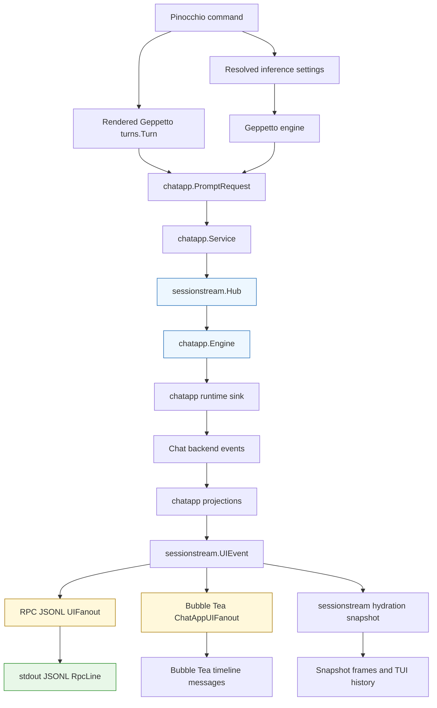

# Pinocchio Structured Streams: Protobuf JSONL RPC and Chatapp TUI Migration

This report explains the migration that changed Pinocchio command execution from several independent streaming paths into a shared chat application stream built on `sessionstream` and `pinocchio/pkg/chatapp`. The work began as a request for script-friendly JSONL/RPC output for Pinocchio verbs. It became a broader stream consolidation project: define a protobuf JSONL subprocess protocol, expose it from CLI verbs, route command TUI mode through the same chatapp/sessionstream projection path, and remove the old raw TUI forwarders that duplicated Geppetto event mapping.

The implementation lives in `/home/manuel/workspaces/2026-05-20/pinocchio-structured-data-cli/pinocchio`. The ticket workspace is `/home/manuel/workspaces/2026-05-20/pinocchio-structured-data-cli/pinocchio/ttmp/2026/05/20/PIN-20260520-CLI-RPC-JSONL--add-jsonl-rpc-output-mode-to-pinocchio-verbs`.

> [!summary]
> - Pinocchio now has a protobuf-defined JSONL/RPC output mode where every stdout line is a `pinocchio.chatapp.rpc.v1.RpcLine` encoded with `protojson`.
> - CLI RPC and command TUI mode now both route through `chatapp.Runner`, `sessionstream.Hub`, chatapp projections, and `sessionstream.UIFanout` adapters.
> - The migration removed the old command TUI raw Geppetto forwarding path, the standalone `switch-profiles-tui` helper, and the profile-switch TUI package that kept that path alive.
> - Real tmux smoke tests validated RPC and TUI behavior with `PINOCCHIO_PROFILE=gpt-5-nano-low` and `PINOCCHIO_PROFILE=gpt-5-mini`, including TAB-submitted multi-turn TUI conversations.

## Why this project existed

Pinocchio verbs already produced useful model output, but their streaming surfaces were not shaped for subprocess automation. The existing raw Geppetto printers emitted human-oriented markers such as `--- Output started ---` and `--- Output ended ---`, and structured output modes were tied to raw provider/backend event details rather than a stable application contract. That made the CLI difficult to consume from scripts that need a stream of machine-readable records with clear frame boundaries.

The first requirement was therefore simple: add a JSONL/RPC mode. The important design question was where that mode should attach. A minimal implementation could have mapped raw Geppetto events directly to JSON maps inside `pkg/cmds`. That would have been fast, but it would have created a second event model beside the web chat stream. The same backend event would have been interpreted once for the web UI, once for the TUI, and once for CLI RPC. Every future reasoning event, tool-call event, or provider metadata event would then require repeated mapping work.

The repository already contained a better center of gravity. `sessionstream` provides command/event/session/projection infrastructure. `pinocchio/pkg/chatapp` defines chat-domain commands, events, projections, and protobuf payloads. Web chat already depended on this direction. The migration therefore made `chatapp` and `sessionstream` the canonical application stream, then attached transports to that stream.

The resulting rule is direct:

- backend and provider details enter the system through Geppetto events and chatapp runtime sinks;
- chatapp converts them into application-level events such as `ChatTextPatch`, `ChatTextSegmentFinished`, and `ChatRunFinished`;
- sessionstream stores and projects those events;
- CLI RPC and TUI rendering are transport adapters over projected UI events.

## The final architecture

The final architecture has one central application stream and several transport adapters. The backend engine still runs through Geppetto. What changed is the level at which Pinocchio exposes state to users and subprocesses. Instead of exposing raw provider events directly, Pinocchio exposes chatapp/sessionstream UI events.



The key dependency direction is that transports depend on projections, not on raw provider events. This decision keeps the CLI and TUI aligned with web chat. If a provider emits a streaming text delta, the runtime sink and chatapp projection decide what that means for the application. The JSONL writer and the TUI fanout only decide how to encode or render the projected event.

## The protobuf JSONL contract

The subprocess boundary is protobuf-defined. The schema lives at:

```text
proto/pinocchio/chatapp/rpc/v1/rpc.proto
```

The generated Go code lives under:

```text
pkg/chatapp/pb/proto/pinocchio/chatapp/rpc/v1/rpc.pb.go
```

The generated TypeScript code for web consumers lives under:

```text
cmd/web-chat/web/src/chatapp/pb/proto/pinocchio/chatapp/rpc/v1/rpc_pb.ts
```

The outer frame is `RpcLine`. Each stdout line is one `protojson`-encoded `RpcLine` message. This is not an ad hoc JSON object and not a raw event dump. The line boundary is the protocol boundary.

The important shape is:

```protobuf
message RpcLine {
  uint32 version = 1;
  string session_id = 2;
  string request_id = 3;

  oneof frame {
    HelloFrame hello = 10;
    SnapshotFrame snapshot = 11;
    UiEventFrame ui_event = 12;
    BackendEventFrame backend_event = 13;
    ErrorFrame error = 14;
    DoneFrame done = 15;
  }

  reserved 100 to 199;
}
```

The UI event and snapshot payloads use `google.protobuf.Any`. That choice is central to the contract. It lets a JSONL line preserve the exact protobuf message type of its payload:

```json
{
  "version": 1,
  "sessionId": "46c72580-2e96-4f78-958a-f51bc2719b26",
  "uiEvent": {
    "ordinal": "8",
    "name": "ChatTextSegmentFinished",
    "payload": {
      "@type": "type.googleapis.com/pinocchio.chatapp.v1.ChatTextSegmentFinished",
      "messageId": "chat-msg-1:text:...",
      "role": "assistant",
      "text": "rpc smoke ok",
      "content": "rpc smoke ok",
      "status": "finished",
      "final": true,
      "finishReason": "completed"
    }
  }
}
```

There are two details to notice in this example.

First, `payload` contains an `@type` field. A client does not have to infer the payload shape from the event name alone. It can unpack the protobuf `Any` into `pinocchio.chatapp.v1.ChatTextSegmentFinished` or any later concrete payload type.

Second, `ordinal` is a JSON string. This follows protobuf JSON encoding rules for `uint64`. A shell pipeline that wants to sort or compare ordinals must convert them explicitly, for example with `jq '(.uiEvent.ordinal | tonumber)'`.

## The JSONL writer and fanout

The low-level JSONL writer is intentionally small. It holds a writer, a mutex, and `protojson.MarshalOptions`. Its main responsibility is to make line writes atomic enough for concurrent publishers and to reject nil messages so the stream never emits `{}` by accident.

```go
var defaultMarshalOptions = protojson.MarshalOptions{
    EmitUnpopulated: false,
    UseProtoNames:   false,
}

func (w *Writer) WriteLine(line *chatapprpcv1.RpcLine) error {
    if w == nil || w.w == nil {
        return fmt.Errorf("jsonl writer is not initialized")
    }
    if line == nil {
        return fmt.Errorf("rpc line is nil")
    }
    b, err := w.marshal.Marshal(line)
    if err != nil {
        return err
    }
    b = append(b, '\n')

    w.mu.Lock()
    defer w.mu.Unlock()
    _, err = w.w.Write(b)
    return err
}
```

The `sessionstream.UIFanout` adapter turns projected UI events into `RpcLine_UiEvent` frames. Its core operation is to pack the typed protobuf payload and write one line per UI event.

```go
func (f *UIFanout) PublishUI(
    _ context.Context,
    sid sessionstream.SessionId,
    ord uint64,
    events []sessionstream.UIEvent,
) error {
    for i, ev := range events {
        payload, err := packPayload(ev.Payload)
        if err != nil {
            return fmt.Errorf("ui event %d %q: %w", i, ev.Name, err)
        }
        line := &chatapprpcv1.RpcLine{
            Version:   1,
            SessionId: string(sid),
            Frame: &chatapprpcv1.RpcLine_UiEvent{
                UiEvent: &chatapprpcv1.UiEventFrame{
                    Ordinal: ord,
                    Name:    strings.TrimSpace(ev.Name),
                    Payload: payload,
                },
            },
        }
        if err := f.writer.WriteLine(line); err != nil {
            return err
        }
    }
    return nil
}
```

This fanout is the transport seam. It does not know how Geppetto encodes provider events. It does not know how web chat renders messages. It only knows how to encode already-projected sessionstream UI events as protobuf JSON lines.

## The command RPC path

The command RPC path lives in `pkg/cmds/cmd.go` as `runRPCJSONL`. It starts by rendering the Pinocchio command into a Geppetto `turns.Turn`. This matters because Pinocchio verbs can contain more than a plain prompt string. They can contain system prompts, pre-seeded message blocks, templated content, and images. Losing that structure would make RPC mode semantically different from the existing command path.

The function then creates a JSONL fanout, emits a hello frame, creates the chatapp runner, emits an initial snapshot, creates the inference engine, and submits a `chatapp.PromptRequest`.

The ordering is deliberate:

1. Create the transport writer and emit `hello` before expensive runtime setup.
2. Create the chatapp runner and emit an initial snapshot so clients know the session identity and starting state.
3. Create the provider engine after the transport exists, so engine construction errors can be represented as terminal error frames.
4. Submit the prompt and wait for chatapp idle.
5. Emit a final snapshot and `done` frame.

The central code path is:

```go
seed, err := g.buildInitialTurn(rc.Variables, rc.ImagePaths)
sid := commandSessionID(seed)
prompt := displayPromptForTurn(seed)

fanout, err := chatapprpcjsonl.NewUIFanout(rc.Writer)
_ = fanout.WriteHello(sid, []string{"ui-events", "snapshot", "done"})

runner, err := chatapp.NewRunner(chatapp.RunnerOptions{UIFanout: fanout})
initialSnap, err := runner.Service.Snapshot(ctx, sid)
_ = fanout.WriteSnapshot(initialSnap)

engine, err := rc.EngineFactory.CreateEngine(rc.InferenceSettings)
req := chatapp.PromptRequest{
    Prompt:      prompt,
    InitialTurn: seed,
    Runtime: &infruntime.ComposedRuntime{
        Engine: engine,
    },
}

_ = runner.Service.SubmitPromptRequest(ctx, sid, req)
_ = runner.Service.WaitIdle(ctx, sid)
snap, err := runner.Service.Snapshot(ctx, sid)
_ = fanout.WriteSnapshot(snap)
_ = fanout.WriteDone(sid, "ok")
```

The behavior of `--rpc` and `--output jsonl` is the same. Both select this path. The older `--output text`, `--output json`, and `--output yaml` modes remain on the blocking command path; they are separate user-facing output modes, not the RPC protocol.

## Rich command input and `PromptRequest.InitialTurn`

The original `chatapp.PromptRequest` carried a `Prompt string`. That was sufficient for a simple web chat input box, but it was not sufficient for Pinocchio command verbs. A Pinocchio command renders a full Geppetto turn. Treating that turn as just a string would lose system messages, preloaded blocks, images, and the exact structure of templated input.

The migration added `InitialTurn *turns.Turn` to `chatapp.PromptRequest`:

```go
type PromptRequest struct {
    Prompt         string
    IdempotencyKey string
    Runtime        *infruntime.ComposedRuntime
    InitialTurn    *turns.Turn
}
```

`Prompt` still has a role. It is used for display, user-message content, and the simple chat API. `InitialTurn` is the authoritative seed for command and TUI execution when Pinocchio has already rendered a structured turn.

In `runRuntimeInference`, an explicit initial turn bypasses turn-store history loading:

```go
if pending.InitialTurn != nil {
    sess.Append(pending.InitialTurn.Clone())
} else {
    // Load persisted history, then append Prompt as a user block.
}
```

This ordering is important. If a caller provides an explicit turn, the caller is saying: this is the context the model should see. Loading persisted history on top of that would be a second source of context and could duplicate or reorder messages. The first implementation therefore treats `InitialTurn` as authoritative.

## The TUI migration

The command TUI path is now another adapter over chatapp/sessionstream. It does not use the old raw Geppetto `StepChatForwardFunc` path. The old standalone `switch-profiles-tui` executable and the raw simple-chat backend were removed after the command TUI path was migrated.

The TUI has three new pieces:

- `pkg/ui/chatapp_backend.go`
- `pkg/ui/chatapp_fanout.go`
- `pkg/ui/fanout_proxy.go`

`ChatAppBackend` implements the `bobatea/pkg/chat.Backend` interface. When the user submits a prompt with TAB, the backend creates a new `PromptRequest`, submits it to `chatapp.Service`, waits for the run to become idle, then snapshots the session to reconstruct conversation state for the next turn.

The core start path is:

```go
func (b *ChatAppBackend) Start(ctx context.Context, prompt string) (tea.Cmd, error) {
    prompt = strings.TrimSpace(prompt)

    b.mu.Lock()
    initialTurn := turnWithUserPrompt(b.currentTurn, prompt)
    b.running = true
    b.mu.Unlock()

    req := chatapp.PromptRequest{
        Prompt:      prompt,
        InitialTurn: initialTurn,
        Runtime:     b.runtime,
    }
    if err := b.service.SubmitPromptRequest(ctx, b.sid, req); err != nil {
        // reset running state and return error
    }

    return func() tea.Msg {
        err := b.service.WaitIdle(ctx, b.sid)
        if err == nil {
            snap, err := b.service.Snapshot(ctx, b.sid)
            if err == nil {
                b.currentTurn = turnFromSnapshot(b.seed, snap)
            }
        }
        if err != nil {
            return boba_chat.ErrorMsg(err)
        }
        return boba_chat.BackendFinishedMsg{}
    }, nil
}
```

The snapshot reconstruction step is the part that makes multi-turn TUI conversations work. The TUI does not append raw strings to an unrelated chat buffer. It reconstructs a Geppetto turn from the chatapp/sessionstream snapshot, preserving the original seed system blocks and then appending user/assistant messages in timeline order.

```go
func turnFromSnapshot(seed *turns.Turn, snap sessionstream.Snapshot) *turns.Turn {
    out := &turns.Turn{}
    if seed != nil {
        for _, block := range seed.Blocks {
            if block.Role == turns.RoleUser || block.Role == turns.RoleAssistant {
                continue
            }
            turns.AppendBlock(out, block)
        }
    }

    entities := append([]sessionstream.TimelineEntity(nil), snap.Entities...)
    sort.SliceStable(entities, func(i, j int) bool {
        return entities[i].CreatedOrdinal < entities[j].CreatedOrdinal
    })

    for _, entity := range entities {
        msg, ok := entity.Payload.(*chatappv1.ChatMessageEntity)
        if !ok || msg == nil {
            continue
        }
        text := strings.TrimSpace(firstNonEmpty(msg.GetContent(), msg.GetText()))
        switch msg.GetRole() {
        case "user":
            turns.AppendBlock(out, turns.NewUserTextBlock(text))
        case "assistant":
            turns.AppendBlock(out, turns.NewAssistantTextBlock(text))
        }
    }
    return out
}
```

The TUI fanout maps projected chatapp UI events to Bubble Tea timeline messages. It renders assistant text, final completion, run failures, reasoning segments, and snapshot hydration. It intentionally ignores live `ChatUserMessageAccepted` events, because the bobatea chat model already renders the user's submitted text immediately. Without this suppression, the command prompt appeared twice in the TUI.

```go
case *chatappv1.ChatUserMessageAccepted:
    // The bobatea chat model renders submitted user messages immediately.
    // Live fanout ignores this event to avoid duplicate user messages.
case *chatappv1.ChatTextPatch:
    id := firstNonEmpty(p.GetMessageId(), p.GetStreamId())
    text := p.GetText()
    if strings.TrimSpace(text) != "" {
        f.ensureAssistant(id, p.GetRole(), text)
    }
    if f.has(id) {
        f.sender.Send(timeline.UIEntityUpdated{
            ID: timeline.EntityID{LocalID: id, Kind: "llm_text"},
            Patch: map[string]any{
                "text":      text,
                "streaming": !p.GetFinal(),
            },
            Version:   time.Now().UnixNano(),
            UpdatedAt: time.Now(),
        })
    }
```

The command `runChat` function now creates the chatapp runner directly:

```go
fanoutProxy := pinui.NewUIFanoutProxy()
runner, err := chatapp.NewRunner(chatapp.RunnerOptions{UIFanout: fanoutProxy})
backend, err := pinui.NewChatAppBackend(
    runner.Service,
    sid,
    &infruntime.ComposedRuntime{Engine: eng},
    seed,
)

model := bobatea_chat.InitialModel(
    backend,
    bobatea_chat.WithTitle("pinocchio"),
    bobatea_chat.WithStatusBarView(statusBar),
)
p := tea.NewProgram(model, options...)
uiFanout, err := pinui.NewChatAppUIFanout(p)
_ = fanoutProxy.SetTarget(uiFanout)
```

The `UIFanoutProxy` exists because the runner needs a fanout at construction time, while the actual Bubble Tea program does not exist until after the backend and model are created. The proxy makes that construction order explicit without resorting to global state.

## Why the old TUI path was removed

After command chat mode moved to chatapp/sessionstream, the repository still had a separate raw forwarding path:

- `pkg/ui/backend.go`
- `StepChatForwardFunc`
- `pkg/ui/runtime/builder.go`
- `pkg/ui/profileswitch`
- `cmd/switch-profiles-tui`
- several profile-switch smoke scripts

Those files were not harmless. They encoded the same class of event mapping that the migration was trying to eliminate. Keeping them would have kept two definitions of simple chat streaming behavior in the tree: one based on raw Geppetto Watermill events and one based on chatapp/sessionstream projections.

The final cleanup removed the standalone `switch-profiles-tui` command, the `profileswitch` package, the raw simple-chat backend/forwarder, and the scripts that exercised the deleted command. Documentation was updated so simple chat TUI guidance now points to `ChatAppBackend`, `ChatAppUIFanout`, and `chatapp.Runner`.

This removal narrows the surface area. Main command chat now has one implementation path. RPC JSONL has one implementation path. Both go through chatapp/sessionstream.

## The fallback assistant text bug

During multi-turn validation, a non-streaming fake engine exposed a subtle fallback issue. When an engine returns a final `turns.Turn` without publishing streaming text events, chatapp publishes fallback assistant text by extracting assistant blocks from the returned turn. Before the fix, that extraction collected all assistant blocks in the turn. In a multi-turn session, that meant prior assistant text could be concatenated with the new assistant text.

The fix records the number of assistant blocks before starting inference, then extracts only assistant blocks added by the current run.

```go
assistantBlockOffset := countAssistantBlocks(sess.Latest())
handle, err := sess.StartInference(ctx)
output, err := handle.Wait()

if !sink.HasTextSegment() {
    _ = e.publishFallbackAssistantText(
        publishContext(ctx),
        sid,
        pub,
        messageID,
        prompt,
        output,
        assistantBlockOffset,
    )
}
```

The extractor skips the already-existing assistant blocks:

```go
func assistantTextFromTurnAfter(turn *turns.Turn, skip int) string {
    parts := make([]string, 0, len(turn.Blocks))
    seen := 0
    for _, block := range turn.Blocks {
        if block.Role != turns.RoleAssistant {
            continue
        }
        if seen < skip {
            seen++
            continue
        }
        seen++
        text, _ := block.Payload[turns.PayloadKeyText].(string)
        if strings.TrimSpace(text) != "" {
            parts = append(parts, text)
        }
    }
    return strings.Join(parts, "")
}
```

This is a good example of why transport consolidation needs real multi-turn tests. A one-shot prompt can validate frame encoding and streaming. It cannot validate whether turn reconstruction and fallback output preserve conversation semantics.

## Real validation

The implementation was validated at several levels.

### Unit and integration tests

The new tests cover:

- protobuf round trips for `RpcLine`;
- JSONL writer newline and concurrency behavior;
- JSONL fanout packing of `Any` payloads;
- CLI RPC output where every line unmarshals as `RpcLine`;
- streaming `ChatTextPatch` emission;
- terminal error frames;
- chatapp `InitialTurn` behavior;
- TUI fanout mapping for streaming text, final completion, failures, reasoning, and snapshot hydration;
- `ChatAppBackend` multi-turn reconstruction from sessionstream snapshots.

The final broad validation passed:

```bash
go test ./... -count=1
```

The commit hooks also ran:

- `go generate ./...`
- frontend install/build
- `go build ./...`
- `golangci-lint`
- `go vet`
- `go test ./...`

### RPC smoke tests in tmux

RPC mode was tested with real profiles.

For `PINOCCHIO_PROFILE=gpt-5-nano-low`:

```bash
PINOCCHIO_PROFILE=gpt-5-nano-low \
  /tmp/pinocchio-smoke run-command ttmp/manual/rpc-smoke.yaml \
  --output jsonl > /tmp/pin-rpc-nano.out 2> /tmp/pin-rpc-nano.err
```

Result:

- exit status `0`;
- stdout contained `14` JSONL lines;
- stderr was empty;
- every stdout line parsed as JSON;
- frames included `hello`, initial `snapshot`, `uiEvent`, final `snapshot`, and `done`;
- assistant output included `rpc smoke ok`.

For `PINOCCHIO_PROFILE=gpt-5-mini`:

```bash
PINOCCHIO_PROFILE=gpt-5-mini \
  /tmp/pinocchio-smoke run-command ttmp/manual/rpc-thinking-smoke.yaml \
  --output jsonl > /tmp/pin-rpc-mini.out 2> /tmp/pin-rpc-mini.err
```

Result:

- exit status `0`;
- stdout contained `26` JSONL lines;
- stderr was empty;
- every stdout line parsed as JSON;
- the stream included `15` real `ChatTextPatch` frames and a `ChatRunFinished` frame.

### TUI smoke tests in tmux

The TUI was tested in tmux because a terminal UI must be observed and controlled in a real terminal session. Submission in this TUI is done with TAB.

For `PINOCCHIO_PROFILE=gpt-5-nano-low`, the captured multi-turn pane showed:

```text
(user): Now reply with exactly the token nano_second_ok
(assistant): nano_second_ok
profile: gpt-5-nano-low
```

For `PINOCCHIO_PROFILE=gpt-5-mini`, the captured multi-turn pane showed:

```text
(user): Now reply with exactly the token tab_second_ok
(assistant): tab_second_ok
profile: gpt-5-mini
```

One testing detail matters: `tmux send-keys` should use `-l` when sending prompt text that includes punctuation or characters that tmux might interpret. The reliable pattern is:

```bash
tmux send-keys -t pin-tui-mini2 -l 'Now reply with exactly the token tab_second_ok'
tmux send-keys -t pin-tui-mini2 Tab
```

This is the correct way to test TAB submission from automation.

## Commit sequence

The work was committed in small phases. The important commits are:

| Commit | Purpose |
|---|---|
| `f4adcba` | Planned the protobuf JSONL RPC design in the ticket. |
| `268cd31` | Added the protobuf RPC envelope and generated bindings. |
| `18c1513` | Added the protojson JSONL writer. |
| `b6ab166` | Added the sessionstream JSONL fanout. |
| `4f36ae0` | Added reusable non-web `chatapp.Runner`. |
| `86e2305` | Added `PromptRequest.InitialTurn` for rich command input. |
| `cfaf7fb` | Routed CLI `--rpc` / `--output jsonl` through chatapp/sessionstream. |
| `72a3d17` | Added the Bubble Tea chatapp fanout. |
| `9366950` | Removed transitional TUI wrapper APIs. |
| `69e2bd2` | Routed command chat mode through chatapp/sessionstream and validated TAB multi-turn TUI. |
| `73ef704` | Removed `switch-profiles-tui`, `profileswitch`, and the raw simple-chat TUI backend/forwarder. |

The sequence matters because it shows the migration discipline. First define the protocol. Then build a writer. Then attach sessionstream. Then build a reusable runner. Then route the CLI. Then migrate the TUI. Then delete the old path.

## Working rules from this migration

The project produced several working rules that are worth preserving.

- A subprocess protocol needs a schema, not just a JSON convention. The schema gives clients a stable frame boundary and concrete payload types.
- The transport boundary should be lower than UI rendering but higher than provider events. `sessionstream.UIEvent` is the right level for CLI RPC and TUI fanout because it is already application-shaped.
- A full command input is a `turns.Turn`, not a string. Any path that reduces Pinocchio verbs to strings risks losing system prompts, image blocks, and seeded context.
- A TUI backend must be tested as a multi-turn system. One-shot tests cannot prove that snapshot reconstruction, fallback assistant output, and TAB submission preserve conversation state.
- Legacy stream paths should be removed once the new path is live. Keeping raw and projected mappers in parallel creates future disagreement about event semantics.
- Real terminal smoke tests need tmux. A terminal UI can pass unit tests and still fail due to keybindings, alt-screen behavior, stdout/stderr routing, or prompt submission mechanics.

## What remains

The core migration is complete for command RPC and command TUI. The remaining work is mostly documentation and polishing:

- Add or expand user-facing CLI help for `--rpc` and `--output jsonl`.
- Include `jq` examples for `ChatTextPatch`, final text, `done`, and `error` frames.
- Explain protobuf JSON `uint64` strings and `Any` `@type` payloads in command docs.
- Decide whether additional agent/tool-loop TUI paths should also expose sessionstream fanouts.
- Continue checking that web chat, command RPC, and command TUI stay aligned as new chatapp event types are added.

The main technical result is that Pinocchio now has one command stream model for script output and terminal chat. The model is chatapp/sessionstream. The CLI JSONL writer and the Bubble Tea TUI are adapters over that model, not separate interpretations of raw provider events.
