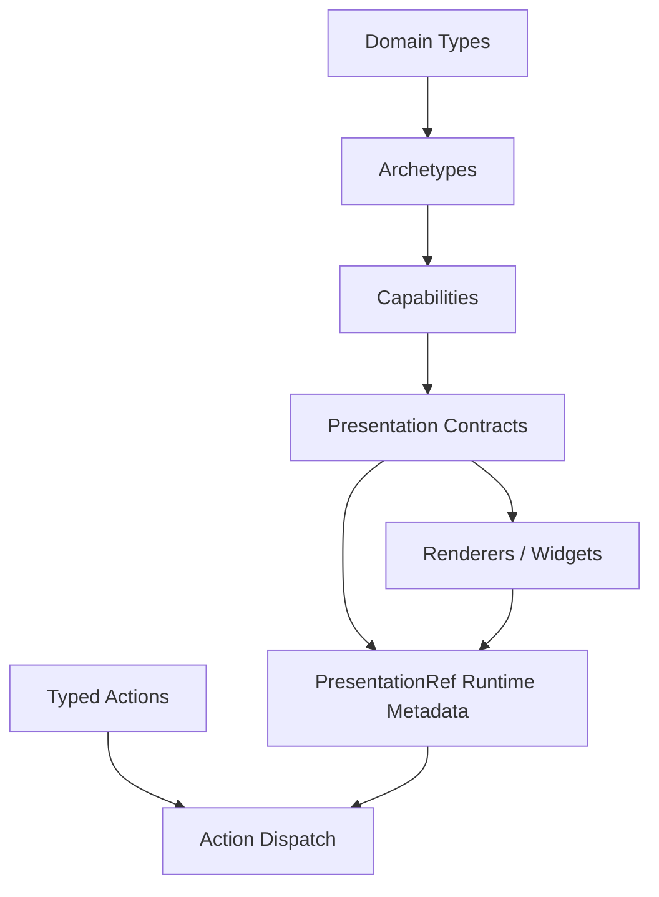

# Presentation-Based User Interfaces: AITR-794, CLIM, and the DMETA Implementation Model

This report is a technical textbook on presentation-based user interfaces. It introduces the model described in MIT Artificial Intelligence Laboratory Technical Report AITR-794, *Presentation Based User Interface*, by Eugene C. Ciccarelli IV, and connects that model to the DMETA design-system work and the Hudson Street Deli CLIM-style prototype. The goal is to make the concept precise enough that a reader can design and implement a presentation-based interface, not merely recognize one.

A presentation-based user interface is organized around visible objects that retain semantic identity. A menu item shown on the screen is not only text. It is a presentation of a menu item. An ingredient shown in a customizer is not only a row. It is a presentation of an ingredient, with a type, an identity, and a set of actions that can accept it as an argument. A command such as `DESCRIBE` or `REMOVE-INGREDIENT` does not operate on a screen coordinate or a string label. It operates on a semantic object selected through its presentation.

> [!summary]
> - A presentation is visible text or graphics that conveys information while remaining connected to the application object it represents.
> - A presentation-based UI separates application data, presentation data, rendering, user manipulation, recognition, and command execution.
> - A command-oriented presentation UI has two complementary interaction paths: object-first (`select presentation → choose action`) and action-first (`choose action → select compatible presentation`).
> - DMETA was shaped by this idea: archetypes, capabilities, presentations, and actions are separate layers because the UI must know what objects are, how they can be presented, and what actions can accept them.
> - The Hudson Street Deli CLIM prototype demonstrates the implementation pattern with typed text presentations such as `<MenuItem>`, `<Ingredient>`, `<Substitution>`, and `<OrderItem>`.

## 1. The central idea

The central idea is simple but strict: the visible interface should preserve semantic relationships to the application domain. A string on the screen that says `Classic BLTA` can be more than a label. It can be a presentation record with the type `MenuItem`, the identity `classic-blta`, a displayed representation, a source path, and a set of commands that can accept it.

This design changes how interaction is implemented. In a conventional direct-manipulation interface, a click handler is often attached to a button or DOM node. The handler knows what to do because the UI designer placed it there. In a presentation-based interface, the system can derive possible actions from the type of the presentation. If the selected object is a `<MenuItem>`, then `CUSTOMIZE`, `ADD-TO-ORDER`, and `DESCRIBE` are valid. If the selected object is a `<Substitution>`, then `APPLY` and `DESCRIBE` are valid. The command table, not the spatial arrangement alone, determines action eligibility.

The difference matters because a presentation-based UI supports both directions of interaction:

```text
Object first:
  click <MenuItem Classic BLTA>
  show actions that accept <MenuItem>
  click DESCRIBE
  execute DESCRIBE(Classic BLTA)

Action first:
  type DESCRIBE
  mark visible presentations that DESCRIBE can accept
  click <MenuItem Classic BLTA>
  execute DESCRIBE(Classic BLTA)
```

The two paths are equivalent at the command layer. They differ only in the order in which the user supplies the command and its argument.

## 2. AITR-794: the original model

MIT AI Lab Technical Report AITR-794, *Presentation Based User Interface*, was issued in August 1984 by Eugene C. Ciccarelli IV. Its abstract describes a prototype presentation system base and a general user interface model organized around the concept of a presentation. The report defines a presentation as visible text or graphics for conveying information. It emphasizes domain independence and style independence so that the same underlying model can apply to a wide range of interfaces.

The report's primitive model treats the interface as a system of processes that maintain a semantic relation between two databases:

- an **application database**, which contains the application objects and their semantic relationships;
- a **presentation database**, which contains the symbolic screen description, including presentations.

The processes that connect these databases have distinct responsibilities:

| Component | Responsibility |
|---|---|
| Application database | Stores domain objects and semantic state. |
| Presentation database | Stores symbolic descriptions of visible presentations. |
| Presenter | Updates the presentation database from the application database. |
| Presentation editor | Allows the user to manipulate presentations. |
| Recognizer | Translates presentation manipulation into application database commands. |
| Application command executor | Applies commands to the application database. |

The report's abstract also states that the primitive presentation system can be extended by attaching additional presentation systems. It notes that the base supports application and presentation databases linked into a uniform network, including descriptions of classes of objects as well as the objects themselves. It describes tools for creating and controlling presenters and recognizers, and reports three operating-system interfaces constructed in different styles: icons, menu, and graphical annotation.

These facts are important because they show that presentation-based UI is not a visual style. Icons, menus, and graphical annotation can all be presentation-based if they preserve the semantic relation between application objects and their rendered presentations. The interface style can change while the presentation model remains stable.

## 3. The primitive presentation loop

The primitive loop has four phases:

1. The application database changes.
2. The presenter updates the presentation database.
3. The user manipulates a presentation.
4. The recognizer translates that manipulation into an application command.

A minimal version can be written as pseudocode:

```text
loop:
  changed_objects = application_database.take_changes()

  for object in changed_objects:
    presentation = presenter.present(object)
    presentation_database.update(presentation)

  manipulation = presentation_editor.read_user_event()

  if manipulation.targets_presentation():
    command = recognizer.recognize(manipulation, presentation_database)
    application_database.apply(command)
```

The important point is that the user event is not interpreted only as a coordinate event. It is interpreted in relation to a presentation. The recognizer asks what presentation was manipulated, what semantic object it represents, and which commands are valid for that object.

In a modern browser implementation, the same loop can be expressed with DOM nodes and JavaScript objects:

```text
application state:
  MENU, SUBS, cart, current customization

presentation state:
  DOM nodes with data-type, data-id, data-idx

presenter:
  renderMenu(), renderDetail(), renderCart(), renderHelp()

presentation editor:
  click, right-click, command line input, keyboard escape

recognizer:
  handlePresentationClick(), executeCommand(), getActionsForType()

application command executor:
  removeIngredient(), applySubstitution(), addToCart(), describeObject()
```

The browser version does not need to use the word "database" literally. What matters is the separation of responsibilities. Application state and presentation state are different. Rendering creates presentations. Recognition maps interactions with presentations back to semantic commands.

## 4. Presentations, presentation types, and presentation records

A presentation has at least four pieces of information:

| Field | Purpose |
|---|---|
| Type | Determines which actions can accept the presentation. |
| Identity | Identifies the represented application object. |
| Display | Provides visible text or graphics for the user. |
| Context | Records where the presentation came from and how it should be interpreted. |

The Hudson Street Deli CLIM prototype uses direct DOM attributes for the first two fields:

```html
<span
  class="pres pres-block"
  data-type="MenuItem"
  data-id="classic-blta">
  <span class="pres-type">&lt;MenuItem&gt;</span>
  Classic BLTA
  <span class="pres-id">#classic-blta</span>
  <span class="role">$11.95</span>
</span>
```

The visible output is:

```text
<MenuItem> Classic BLTA #classic-blta $11.95
```

The semantic presentation is:

```js
{
  type: 'MenuItem',
  id: 'classic-blta',
  display: 'Classic BLTA',
  sourceSurface: 'menu',
}
```

A production DMETA runtime would likely use a richer `PresentationRef` structure:

```ts
type PresentationRef = {
  semanticId: string
  domainType: string
  archetypes: string[]
  capabilities: string[]
  presentationId: string
  label: string
  value?: unknown
  copyValue?: string
  sourceSurface: string
  sourcePath?: string
}
```

The prototype uses `data-type` and `data-id` because the implementation is intentionally small. The conceptual role is the same. The DOM node carries enough semantic metadata for the recognizer to dispatch commands.

## 5. Commands and typed arguments

A presentation-based UI needs a command table. The command table states which actions exist, which presentation types they accept, where they apply, and how they execute.

The CLIM prototype uses this structure:

```js
const ACTIONS = [
  {
    id: 'CUSTOMIZE',
    label: 'CUSTOMIZE',
    argTypes: ['MenuItem'],
    applicableTo: ['menu'],
    description: 'Open customizer for <MenuItem>. Modify ingredients, apply substitutions.',
    fn: (id) => openDetail(id),
  },
  {
    id: 'REMOVE-INGREDIENT',
    label: 'REMOVE-INGREDIENT',
    argTypes: ['Ingredient'],
    applicableTo: ['detail'],
    description: 'Remove <Ingredient> from composition. Triggers substitution search.',
    fn: (id) => removeIngredient(id),
  },
  {
    id: 'APPLY',
    label: 'APPLY',
    argTypes: ['Substitution'],
    applicableTo: ['detail'],
    description: 'Apply <Substitution> candidate to replace removed ingredient.',
    fn: (id, idx) => applySubstitution(id, idx),
  },
]
```

This table is the operational form of the presentation-based design. It prevents action eligibility from being scattered across arbitrary event handlers. It also lets the system compute the available actions for a presentation:

```js
function getActionsForType(type, view) {
  return ACTIONS.filter(action => {
    if (!action.applicableTo.includes('*') &&
        !action.applicableTo.includes(view)) {
      return false
    }

    if (action.argTypes.length === 0) return true

    return action.argTypes.includes(type)
  })
}
```

The command table supports three interfaces at once:

- the action bar after selecting a presentation;
- the right-click context menu for a presentation;
- the `HELP` view that lists actions and argument types.

When all three read from the same table, the UI remains consistent. If `REMOVE-INGREDIENT` changes its accepted argument type, the action bar, context menu, and help text change together.

## 6. Object-first and action-first interaction

A presentation-based UI should support both object-first and action-first interaction.

### Object-first interaction

Object-first interaction begins with a visible presentation. The user selects it, then chooses from actions that can accept its type.

```text
click <Ingredient Cheddar Cheese>
  -> selected = { type: "Ingredient", id: "cheddar" }
  -> action bar = MENU CART BACK HELP REMOVE-INGREDIENT SHOW-SUBSTITUTIONS DESCRIBE

click REMOVE-INGREDIENT
  -> removeIngredient("cheddar")
  -> render substitutions for Cheddar Cheese
```

This path requires these functions:

```js
function handlePresentationClick(type, id, idx, event) {
  if (state.mode === 'select') {
    executePendingAction(type, id, idx)
    return
  }

  selectPresentation(event.currentTarget, type, id, idx)
}

function selectPresentation(el, type, id, idx) {
  state.selected = { type, id, idx }
  el.classList.add('selected')
  showActionsFor(type, id, idx)
}
```

The normal click does not perform a domain action. It selects. This was an important correction during development. Direct execution made the interface behave like a conventional click UI rather than a presentation-based command UI.

### Action-first interaction

Action-first interaction begins with a command. The user chooses the action, then supplies an argument by selecting a compatible presentation.

```text
type REMOVE-INGREDIENT + Enter
  -> pendingAction = REMOVE-INGREDIENT
  -> all visible <Ingredient> presentations turn red

click <Ingredient Cheddar Cheese>
  -> removeIngredient("cheddar")
  -> exit select mode
```

The code is:

```js
function executeCommand(cmd) {
  const action = findAction(cmd)

  if (!action) return unknownCommand(cmd)

  if (action.argTypes.length === 0) {
    action.fn()
    return
  }

  enterSelectMode(action)
}

function enterSelectMode(action) {
  state.mode = 'select'
  state.pendingAction = action

  for (const el of document.querySelectorAll('.pres')) {
    const type = el.dataset.type
    if (action.argTypes.includes(type)) {
      el.classList.add('selectable')
    } else {
      el.classList.add('select-disabled')
    }
  }
}

function executePendingAction(type, id, idx) {
  const action = state.pendingAction

  if (!action.argTypes.includes(type)) {
    setHint(`Need <${action.argTypes.join('> or <')}>`)
    return
  }

  action.fn(id, idx, type)
  exitSelectMode()
}
```

The red select state is not a theme choice. It is the visible argument set for the pending command. A command-first interface must show the user which visible objects can legally complete the command.

## 7. Recognizers and translators

AITR-794 uses the term recognizer for the process that translates a user's presentation manipulation into application database commands. In the browser prototype, recognition is implemented by the combination of event handlers, presentation metadata, and the action registry.

The recognizer has four jobs:

1. Determine whether the user is in normal mode or select mode.
2. Determine which presentation was manipulated.
3. Determine whether the manipulation can produce a command.
4. Execute the command or ask for a compatible argument.

A simplified recognizer is:

```js
function recognizeClick(event) {
  const presentation = nearestPresentation(event.target)

  if (!presentation) return noPresentationClick(event)

  if (state.mode === 'normal') {
    selectPresentation(presentation)
    return
  }

  if (state.mode === 'select') {
    if (pendingActionAccepts(presentation.type)) {
      execute(state.pendingAction, presentation)
    } else {
      reportTypeMismatch(state.pendingAction, presentation)
    }
  }
}
```

In the prototype, the presentation metadata is passed through inline event handlers rather than found through `nearestPresentation`. This is acceptable for a small prototype, but a more robust implementation should use delegated event handling:

```js
container.addEventListener('click', event => {
  const el = event.target.closest('[data-type][data-id]')
  if (!el) return

  handlePresentationClick(
    el.dataset.type,
    el.dataset.id,
    el.dataset.idx ? Number(el.dataset.idx) : null,
    event,
  )
})
```

Delegation avoids the ES module/global function problem that occurred during development. It also keeps the rendered markup closer to data and farther from executable strings.

## 8. From presentation-based UI to DMETA

The concept of presentation-based UI influenced DMETA at the architectural level. DMETA does not begin with components. It begins with semantic layers:

1. **Domain types** describe concrete application objects.
2. **Archetypes** describe reusable operational roles.
3. **Capabilities** describe cross-cutting affordances and projections.
4. **Presentations** describe display contracts for semantic objects.
5. **Actions** describe typed operations over presentations, capabilities, archetypes, or domain types.
6. **Widgets** render presentations and emit typed callbacks.

This layering exists because a presentation-based UI needs more than visual components. It needs to know what the object is, which facts can be projected from it, how it can be displayed, and which actions can accept it.

The DMETA `presentations.yaml` file defines presentations and actions in this spirit. A simplified action entry looks like this:

```yaml
actions:
  inspect:
    description: Open detail view for any inspectable subject.
    category: inspect
    accepts:
      - capability: inspectable
    arguments:
      subject:
        mode: selected_presentation
        required: true
        accepts:
          - capability: inspectable
    result:
      kind: open_detail
```

This is the model-level form of command dispatch. The CLIM prototype uses concrete presentation types for simplicity:

```js
{
  id: 'DESCRIBE',
  argTypes: ['MenuItem', 'Ingredient', 'Substitution', 'OrderItem'],
  fn: (id, idx, type) => describeObject(id, idx, type),
}
```

A production DMETA runtime should move from direct presentation types toward capability-based matching:

```text
pending action accepts capability inspectable
  -> find rendered PresentationRefs whose capabilities include inspectable
  -> mark them as candidates
  -> click candidate supplies PresentationRef
  -> dispatch action with typed semantic argument
```

This is the direct bridge between AITR-794's presentation model and DMETA's schema-first design system.

## 9. Deriving concrete implementation from a core model

A presentation-based UI can be derived from a core model through a repeatable sequence.

### Step 1: Define domain types

Start with concrete domain objects. For the street deli:

| Domain type | Meaning |
|---|---|
| `MenuItem` | A food item that can be ordered and customized. |
| `Ingredient` | A part of a composition. |
| `SubstitutionRule` | A mapping from a removed ingredient to replacement candidates. |
| `Order` | A customer order moving through preparation. |
| `OrderItem` | A customized line item in the order. |
| `PrepEvent` | A preparation status event. |

These are not UI objects yet. They are application objects.

### Step 2: Map domain types to archetypes

Each domain type maps to one or more semantic roles:

| Domain type | Archetype mapping |
|---|---|
| `MenuItem` | `Composition` + `ActionSpec` |
| `Ingredient` | `Resource` |
| `SubstitutionRule` | `Substitution` + `Relation` |
| `Order` | `WorkItem` + `TimelineSpan` |
| `OrderItem` | `WorkItem` + `Composition` |
| `PrepEvent` | `Event` |

The mapping determines which generic presentations and actions can apply.

### Step 3: Attach capabilities

Capabilities define reusable projections. A `MenuItem` is `identifiable`, `labelable`, `composable`, `configurable`, and `dietary`. An `Ingredient` is `identifiable`, `labelable`, and `dietary`. A `SubstitutionRule` is `identifiable`, `labelable`, `substitutable`, and `relatable`.

This is where the UI gains enough information to render and act. Without `composable`, the UI cannot list parts. Without `substitutable`, the UI cannot show replacement candidates. Without `dietary`, the UI cannot warn about allergens.

### Step 4: Define presentations

For each important semantic subject, define presentations. The street-deli model defines presentations such as:

| Presentation | Applies to | Purpose |
|---|---|---|
| `composition_card` | `Composition` | Browsable menu-item summary. |
| `ingredient_list` | `composable` | Parts with roles and dietary facts. |
| `substitution_badge` | `substitutable` | Inline replacement suggestion. |
| `substitution_detail` | `Substitution` | Full replacement candidate list. |
| `order_item_row` | `WorkItem` + `Composition` | Cart line item. |
| `prep_status_indicator` | `stateful` | Order preparation state. |

A CLIM-style implementation can choose text renderers for these presentations rather than graphical widgets. For example:

```text
<Composition> Grilled Cheese $8.95
  <Ingredient★> Sourdough Bread [structural]
  <Ingredient> Cheddar Cheese [protein, richness, umami]
  <Ingredient> American Cheese [richness, moisture, binding]
```

The same presentation could also be rendered as a mobile card. Presentation contracts precede renderer choice.

### Step 5: Define actions

Actions should be typed. For the CLIM prototype:

| Action | Accepted presentation types |
|---|---|
| `CUSTOMIZE` | `<MenuItem>` |
| `DESCRIBE` | `<MenuItem>`, `<Ingredient>`, `<Substitution>`, `<OrderItem>` |
| `REMOVE-INGREDIENT` | `<Ingredient>` |
| `SHOW-SUBSTITUTIONS` | `<Ingredient>`, `<RemovedIngredient>` |
| `APPLY` | `<Substitution>` |
| `REMOVE-FROM-CART` | `<OrderItem>` |

For a fuller DMETA runtime, actions should accept capabilities or archetypes rather than only concrete presentation types. The prototype uses direct types because it is a small hand-built implementation.

### Step 6: Render presentations with metadata

Every rendered presentation should carry the metadata needed for recognition:

```html
<span
  class="pres"
  data-type="Substitution"
  data-id="cheddar"
  data-idx="0">
  &lt;Substitution ★auto&gt; Avocado [richness, moisture, freshness] +$1.50
</span>
```

The recognizer can now map a click to:

```js
{
  type: 'Substitution',
  id: 'cheddar',
  idx: 0,
}
```

That is enough to execute:

```js
applySubstitution('cheddar', 0)
```

### Step 7: Implement recognition and dispatch

The recognizer should be mode-aware:

```text
if normal mode:
  click presentation -> select it -> show actions that accept its type

if select mode:
  click compatible presentation -> execute pending action
  click incompatible presentation -> report expected type
```

The dispatcher should be table-driven:

```js
function dispatch(action, presentation) {
  if (!action.argTypes.includes(presentation.type)) {
    return typeError(action, presentation)
  }

  action.fn(presentation.id, presentation.idx, presentation.type)
}
```

This keeps the UI extensible. Adding a new action should primarily mean adding a new command-table entry, not modifying every renderer.

## 10. The Hudson Street Deli CLIM prototype as a case study

The CLIM prototype is intentionally minimal:

```text
prototype-clim/
  index.html
  styles.css
  app.js
  js/data.js
  js/app-main.js
  fonts/BerkeleyMono-*.woff2
```

It uses Berkeley Mono, one font size, black background, grey/white text, and red only for select-mode candidates. Its views are text-based:

- Menu view renders `<MenuItem>` presentations.
- Detail view renders `<Ingredient>`, `<RemovedIngredient>`, `<SubstitutedIngredient>`, and `<Substitution>` presentations.
- Cart view renders `<OrderItem>` presentations.
- Help view renders the action table and presentation type reference.

The application state is small:

```js
const state = {
  view: 'menu',
  mode: 'normal',
  selected: null,
  pendingAction: null,
  customizing: null,
  cart: [],
  orderNum: 0,
  cmdBuffer: '',
  cmdHistory: [],
  contextMenu: null,
}
```

The important fields are `mode`, `selected`, and `pendingAction`. They define the presentation-based interaction model.

The implementation currently uses inline event attributes and exposes handlers to `window` because ES modules do not publish top-level functions globally. This is a documented compromise. The next implementation should use delegated event listeners instead.

## 11. Failure modes and corrections

The development process exposed several common failure modes.

### Failure mode 1: treating presentations as buttons

The first CLIM prototype made clicks execute default actions. Clicking a menu item opened it. Clicking an ingredient removed it. This behavior was too close to ordinary direct manipulation. It did not teach the command/argument relationship.

The correction was to make normal click select only. Execution happens when the user chooses an action.

### Failure mode 2: not making argument compatibility visible

After command-first interaction was added, the UI needed to show which visible presentations could satisfy the pending command. The correction was select mode. Compatible presentations turn red. Incompatible presentations dim and stop accepting pointer events.

### Failure mode 3: hiding results in hint text

Action output originally appeared in the same grey line used for hints. That made successful execution hard to see. The correction was a white `#action-result` area above `Command:`. Hints remain grey. Results are white.

### Failure mode 4: mixing ES modules with inline handlers

After `app.js` became a module, inline handlers such as `onclick="handlePresentationClick(...)"` failed because module functions are not globals. The short-term correction was `exposeInlineHandlers()`. The better correction is event delegation.

### Failure mode 5: keeping data and dispatch in one file

The original CLIM `app.js` contained menu data, substitution rules, action registry, renderers, command handling, context menu, and actions. The correction was a minimal split:

```text
app.js          # entrypoint
js/data.js      # data and substitution lookup
js/app-main.js  # behavior and rendering
```

Further splitting is still justified, but this first split made the data model easier to inspect.

## 12. Implementation checklist

A new presentation-based UI can follow this checklist.

### Model checklist

- Define domain types before widgets.
- Map domain types to archetypes or semantic roles.
- Attach capabilities that define available projections.
- Define presentations for visible semantic subjects.
- Define actions with accepted argument types or capabilities.
- Decide which action results need visible output.

### Runtime checklist

- Render presentations with semantic metadata.
- Maintain a command table with action ids, labels, accepted types, and implementations.
- Implement normal mode: click presentation, select it, show actions.
- Implement select mode: type action, mark compatible presentations, click argument.
- Implement right-click context menus from the same command table.
- Implement a help view from the same command table.
- Separate result output from hint text.
- Avoid inline handlers in module-based implementations when possible.

### Testing checklist

Test both interaction directions for every action that accepts arguments:

```text
Presentation first:
  click presentation
  verify action appears
  click action
  verify result

Action first:
  type action
  verify compatible presentations are marked
  click compatible presentation
  verify result
```

Also test invalid conditions:

```text
type APPLY when no substitutions are visible
  -> no incompatible object should execute APPLY

type REMOVE-INGREDIENT on menu view
  -> no menu items should be accepted

press ESC in select mode
  -> select mode should clear
```

The tests should inspect both visible behavior and console errors. Syntax checks alone are insufficient because browser event binding and module scoping errors may only appear at runtime.

## 13. How this shaped DMETA

The presentation-based UI concept influenced DMETA in three concrete ways.

First, DMETA separates semantic model from widget implementation. The system defines archetypes and capabilities before it defines components. This is necessary because action eligibility depends on semantic type, not on component class.

Second, DMETA treats presentations as contracts. A presentation specifies what projections it requires, which semantic layer it applies to, what interactions it supports, and which style recipe may render it. This is why the same street-deli model can produce both a mobile card and a CLIM text line.

Third, DMETA treats actions as typed semantic operations. A widget should emit a typed action request or `PresentationRef`, not perform arbitrary side effects. The adapter or backend dispatch layer decides how to execute the action. This is the modern equivalent of separating the presentation editor, recognizer, and application command executor.

The DMETA architecture can be summarized as:



This is not only a documentation structure. It is an implementation strategy. If the system can generate or validate each layer, then UI behavior becomes explainable and testable.

## 14. Closing

Presentation-based UI is a design model for preserving semantic identity through rendering and interaction. A presentation is visible information connected to the object it represents. A recognizer turns manipulation of that presentation into a typed command. A command table defines which actions accept which presentations. A presenter keeps the visible presentation state synchronized with application state.

AITR-794 states the foundational model in terms of application databases, presentation databases, presenters, presentation editors, and recognizers. The Hudson Street Deli CLIM prototype implements the same responsibilities in a small browser application. DMETA generalizes the idea into a design-system factory: archetypes define roles, capabilities define projections, presentations define display contracts, actions define typed operations, and widgets render presentations while preserving metadata.

The key implementation rule is stable: do not let visible UI elements lose their semantic identity. Once the system knows what a visible object is, it can derive what actions are valid, what arguments are compatible, what output should be produced, and how the same model can be rendered in more than one interface style.
