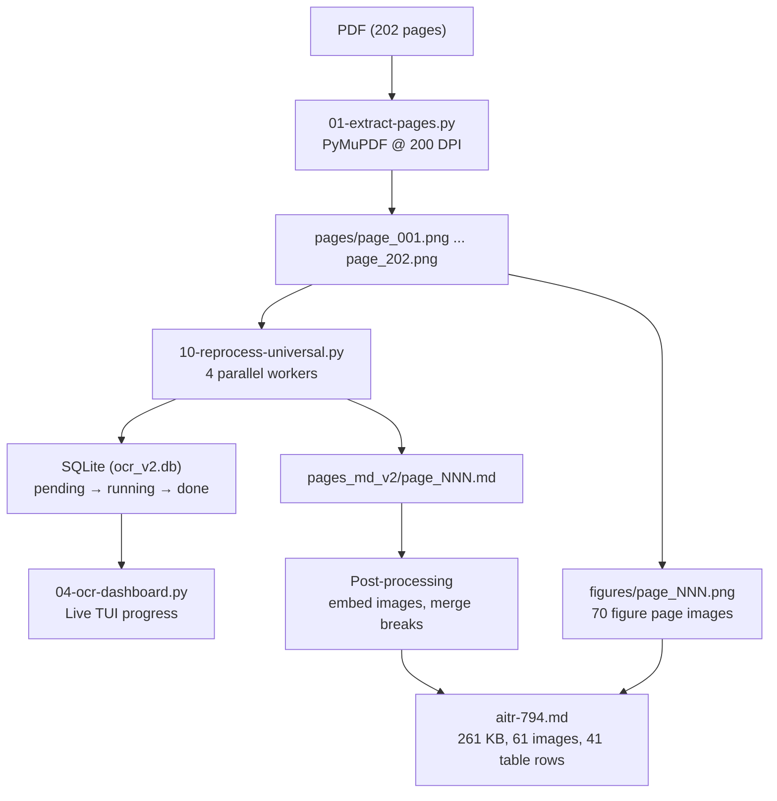

# VLM OCR Pipeline for Scanned PDFs: From Sequential to Parallel to Universal

This article documents the design and iteration of a pipeline that transcribes a fully scanned 202-page PDF into clean, structured markdown using a vision-language model (VLM). The pipeline evolved through seven major revisions, each solving a concrete failure of the previous version. The final system processes all pages in parallel with a single universal prompt, tracks progress in SQLite, provides a live terminal dashboard, and produces markdown with embedded images, proper tables, and code fences.

The source document is AITR-794, "Presentation Based User Interfaces" by Eugene C. Ciccarelli IV (MIT AI Lab, 1984) — a 202-page scanned PhD thesis with no extractable text, approximately 70 figure pages, half a dozen data tables, and several pages of Lisp source code. The techniques described here apply to any scanned PDF where traditional OCR produces poor results and a VLM can provide better transcription through visual understanding.

> [!summary]
> - A VLM can transcribe scanned PDFs with higher quality than traditional OCR, but the prompt must be designed carefully to handle all page types consistently
> - Parallel processing with SQLite as a work queue requires `BEGIN IMMEDIATE` to prevent race conditions where multiple workers claim the same page
> - A single universal prompt that detects page types (blank, full-image, mixed, text, table, code) produces more consistent output than multiple specialized prompts
> - Image descriptions should use parseable tokens (`[IMAGE: description]`) that can be embedded as markdown image references in a post-processing step

## Why this note exists

Scanned PDFs are common in academic and historical archives. Traditional OCR (Tesseract, pdftotext) fails on these documents because the text is embedded as bitmap images, not as selectable text. VLMs offer a better path: they can read the rendered page image and produce structured output. But VLM-based OCR introduces its own failure modes — hallucinated duplicate text, inconsistent formatting, missed images, and race conditions in parallel processing. This article captures what we learned building such a pipeline, so that the next person facing a 200-page scanned document does not repeat the same mistakes.

## The document

AITR-794 is a letter-sized PDF created in 2001 by Acrobat Distiller 4.0 from a 1984 thesis. It has 202 pages, each containing a single scanned image at 2550×3300 pixels (300 DPI). There is no extractable text — every `pdftotext` call returns empty output. The content mix is typical of a CS thesis: dense body text, hand-drawn diagrams and flowcharts, Xerox Star and Steamer screenshots, spreadsheet-like data tables (the PPSCalc example), and Lisp code with `(defun)` and `(defvar)` forms.

## Stage 1: Rendering and sequential OCR

The first step is converting each PDF page into a PNG image that the VLM can process. PyMuPDF renders pages at 200 DPI, producing 1700×2200 pixel images — sufficient for the VLM to read small text while keeping file sizes manageable. The rendering script (`01-extract-pages.py`) takes a PDF path and an output directory, then iterates through every page:

```python
import fitz  # PyMuPDF

doc = fitz.open(pdf_path)
for i in range(len(doc)):
    page = doc[i]
    pix = page.get_pixmap(dpi=200)
    pix.save(f"output/pages/page_{i+1:03d}.png")
```

With page images in hand, the next step is OCR. The pinocchio CLI provides a VLM interface:

```bash
PINOCCHIO_PROFILE=gpt-5-nano-low \
  pinocchio code professional \
  --images page_010.png \
  "Transcribe all visible text..."
```

The initial OCR script (`02-ocr-pages.py`) processes pages one at a time, saving each transcription as a separate markdown file and concatenating them into a combined document. It also strips pinocchio's output markers (`--- Output started ---`, `--- Output ended ---`, `[i] reasoning-summary`) using a regex that captures the text between the output delimiters.

This sequential approach verified the concept but exposed three problems immediately. First, the VLM sometimes duplicates paragraphs — on page 10, it repeated an entire paragraph about PSBase verbatim. Second, the VLM inserts `<!-- FIGURE: page_NNN image_N -->` placeholders where images appear, but provides no description of what the images contain. Third, at roughly 30 seconds per page, processing all 202 pages sequentially takes over 100 minutes.

## Stage 2: Parallel batch processing with SQLite

The 100-minute sequential runtime is unacceptable for interactive work. Running four workers in parallel reduces this to roughly 25 minutes. The challenge is coordinating those workers so that no page is processed twice and no page is skipped.

The coordination mechanism is a SQLite database where each row represents a page with a status field (`pending`, `running`, `done`, `error`). Workers claim pages atomically, process them, and mark them as done. The batch script (`03-ocr-batch.py`) initializes the database and launches workers in tmux windows, each running the worker loop:

```
tmux session: aitr794-ocr
  window 0: dashboard
  window 1: worker 1
  window 2: worker 2
  window 3: worker 3
  window 4: worker 4
```

Each worker runs an infinite loop: claim a page, OCR it, mark it done, repeat until no pending pages remain. The dashboard (`04-ocr-dashboard.py`) reads the SQLite database every 2 seconds and renders a terminal UI with a progress bar, page grid (using Unicode symbols ●/◐/◌/✗), throughput estimate, and ETA.

### The race condition

The first implementation of `claim_page()` used a single SQL statement:

```sql
UPDATE pages
SET status = 'running', started_at = ?, attempts = attempts + 1
WHERE page_num = (
    SELECT page_num FROM pages
    WHERE status = 'pending'
    ORDER BY page_num
    LIMIT 1
)
```

This looks atomic — the subquery and the update are in a single statement. Under concurrent access, however, it is not. SQLite's default autocommit mode allows two connections to both evaluate the subquery, both see the same row as `pending`, and both update it. The symptom: all four workers claimed page 17 simultaneously, each processing it and overwriting the others' output. Eighteen pages ended up stuck in `running` status because the workers that claimed them had already moved on.

The fix is `BEGIN IMMEDIATE`:

```python
def claim_page(db_path):
    conn = sqlite3.connect(db_path, isolation_level=None)
    try:
        conn.execute("BEGIN IMMEDIATE")  # exclusive lock before any reads
        c = conn.cursor()
        c.execute("SELECT page_num FROM pages WHERE status = 'pending' ORDER BY page_num LIMIT 1")
        row = c.fetchone()
        if row is None:
            conn.execute("COMMIT")
            return None
        page_num = row[0]
        conn.execute(
            "UPDATE pages SET status = 'running', started_at = ?, attempts = attempts + 1 "
            "WHERE page_num = ?",
            (time.strftime('%Y-%m-%d %H:%M:%S'), page_num)
        )
        conn.execute("COMMIT")
        return page_num
    except Exception:
        conn.execute("ROLLBACK")
        return None
    finally:
        conn.close()
```

`BEGIN IMMEDIATE` acquires an exclusive lock on the database before any reads occur. This ensures that the SELECT and the UPDATE happen as a single indivisible operation — no other connection can read or write between them. After the fix, the v2 re-processing (Stage 7) completed 202 pages with zero stuck pages and zero duplicate claims.

### Tmux layout lessons

The first attempt used pane-based layout (`tmux split-window -h`), which is unreliable. `send-keys` targets panes by index, but pane indices shift after splits, causing commands to land in the wrong pane. Window-per-worker layout (`tmux new-window -n w1`) is stable: window names do not shift, and `send-keys -t session:window` reliably targets the intended worker. Eight workers fail because tmux panes have a minimum width; four workers fit comfortably in a 220-column terminal.

## Stage 3: Image description and the `[IMAGE:]` token

The initial OCR prompt asked the VLM to insert `<!-- FIGURE: page_NNN image_N -->` placeholders where images appear, but provided no description of the image content. A page showing a Xerox Star desktop screenshot would get a placeholder but no information about what the screenshot contains.

The second prompt (`05-reprocess-images.py`) explicitly asks for image descriptions using a parseable token:

```
For each distinct image/figure/diagram/screenshot on the page, output EXACTLY:
   [IMAGE: brief description of what the image shows]
```

The `[IMAGE: ...]` format serves two purposes. First, it is parseable by regex (`re.findall(r'\[IMAGE:\s*([^\]]+)\]', text)`) for automated processing. Second, it is human-readable — someone reviewing the markdown can understand what the image shows without seeing the original. Example output:

```
### Figure 4-4: Xerox Star -- Desktop Display

[IMAGE: A schematic diagram representing the Xerox Star desktop user interface.
The image shows a large, dotted background with numerous small icon-like
rectangles arranged across the page, depicting files and folders.]
```

One failure mode: the VLM sometimes splits the token across multiple lines, placing the closing `]` on the next line. A post-processing step collapses these using `re.DOTALL`:

```python
text = re.sub(
    r'\[IMAGE:\s*((?:[^]]*?\n)*?[^]]*?)\]',
    lambda m: '[IMAGE: ' + ' '.join(m.group(1).split()) + ']',
    text, flags=re.DOTALL
)
```

## Stage 4: Table conversion

The PPSCalc example in the thesis includes several spreadsheet-style data tables (pages 32–34, 47–49). Without explicit instruction, the VLM describes these as images rather than converting them to markdown tables. The table prompt explicitly requests pipe-syntax tables:

```
For each TABLE or SPREADSHEET on the page, convert it to a markdown table
using | col1 | col2 | syntax.
Use | for column separators, |---| for header separators.
```

This produces correct output for simple grids:

```markdown
### Figure 2-11: PPSCalc -- Value Moved

|   | A    | B  | C    |
|---|------|----|------|
| 1 | 100  | 20 | 2000 |
| 2 | 75   | 5  | 375  |
| 3 | 2375 |    |      |
```

The VLM does not reliably produce markdown tables from all visual grids. It defaults to `[IMAGE: ...]` descriptions for complex or hand-drawn diagrams that happen to have tabular layout. The explicit instruction helps for simple data tables but does not guarantee conversion for all table-like visual structures.

## Stage 5: Code and formula recognition

Pages containing Lisp source code (notably page 182 with `defvar`, `def-command`, and `defun` forms) need code fences. The prompt includes:

```
For CODE blocks:
- Wrap all code in triple backtick fences with the language: ```lisp for Lisp code
- Preserve indentation and line breaks exactly

For MATH/FORMULAS:
- Use LaTeX notation: $inline$ for inline math, $$display$$ for display math
- Convert Greek letters, subscripts, superscripts to LaTeX
```

In practice, the VLM follows the code transcription instruction but often omits the backtick fences, producing indented code without delimiters. The formula instruction is followed when mathematical notation is visually distinct (display equations, Greek letters), but simple inline expressions like "C1 + C2" are left as-is, which is usually the correct choice for a CS thesis.

## Stage 6: The universal prompt

The initial pipeline used multiple specialized prompts (text, image, table) applied to different pages in separate processing passes. This creates a version management problem: each page exists in multiple versions across `pages_md/`, `pages_md_images/`, `pages_md_final/`, and `pages_md_clean/` directories. Merging these versions requires careful priority logic and produces inconsistencies.

The universal prompt (`10-reprocess-universal.py`) handles all page types in a single pass. It begins with page type detection rules:

```
Determine what kind of page this is:
- BLANK: A blank page or pagination placeholder only
- FULL_IMAGE: The entire page is a single figure/diagram/screenshot with minimal text
- MIXED: Body text that also contains embedded images/figures/diagrams
- TEXT: Pure body text (no images)
- TABLE: Contains a data table or spreadsheet grid
```

Each page type gets specific output rules. Blank pages produce empty output. Full-image pages start with the figure caption and a single `[IMAGE: ...]` token. Mixed pages interleave text and `[IMAGE: ...]` tokens. Tables use pipe syntax. Code uses backtick fences. The key anti-hallucination rule applies to all types:

```
Do NOT duplicate or repeat any text — transcribe each piece of text exactly once
```

This single rule eliminated the duplicate-paragraph problem that plagued the earlier prompts.

### Results comparison

| Metric | V1 (specialized prompts) | V2 (universal prompt) |
|--------|------------------------|----------------------|
| Pages processed | 202 | 202 |
| Processing passes | 3 (text, image, table) | 1 |
| Errors | 18 stuck (race condition) | 0 |
| Duplicate paragraphs | Yes (page 10) | No |
| Page type detection | Manual classification | Automatic (118 text, 64 mixed, 14 blank, 5 code, 1 table) |
| Embedded images | 65 | 61 |
| Table rows | 45 | 41 |
| Code blocks | 9 | 9 |
| Final document size | 310 KB | 261 KB |

The v2 document is smaller primarily because blank pages produce empty output and duplicate paragraphs are eliminated.

## Architecture: the complete pipeline



The pipeline has four stages: rendering, OCR, post-processing, and assembly. Each stage is idempotent — re-running it produces the same output given the same inputs. The SQLite database makes the OCR stage resumable: if a worker crashes, its `running` pages can be reset to `pending` with `--reset-stale 0`, and a new worker will pick them up.

## Common failure modes

### VLM hallucination: duplicated paragraphs

The VLM sometimes repeats a paragraph from earlier on the same page. This is not a scanning artifact — the original page does not contain the duplicated text. The fix is a prompt rule ("Do NOT duplicate or repeat any text — transcribe each piece of text exactly once"). In testing, this rule eliminated the duplication on page 10 and did not introduce new problems. Without the rule, roughly 5–10% of body-text pages contain some form of duplication.

### SQLite race condition in claim_page

The `UPDATE ... WHERE page_num = (SELECT ... LIMIT 1)` pattern looks atomic but is not under concurrent access. Two connections can both evaluate the subquery before either's UPDATE commits. The fix is `BEGIN IMMEDIATE`, which acquires an exclusive lock before any reads. This pattern should be used for any SQLite-based work queue where multiple processes claim tasks concurrently.

### Tmux pane targeting

`send-keys -t session.pane_index` is unreliable because pane indices shift after splits. Window names are stable. Always use `tmux new-window -n name` and `send-keys -t session:name` for worker processes.

### Multiline [IMAGE:] tokens

The VLM sometimes splits `[IMAGE: ...]` across lines, placing the closing bracket on the next line. Single-line parsing breaks. The fix is a post-processing regex with `re.DOTALL` that collapses internal whitespace and newlines into single spaces.

### Inconsistent FIGURE placeholder formats

The VLM produces many variants of `<!-- FIGURE: page_NNN image_N -->` placeholders: `image_1`, `image_2-10`, `image_6-16`, `image_`, `image_N`, and broken closings like `--` instead of `-->`. A two-pass cleanup handles this: first a structured replacement script, then a targeted regex with `image_([\w.-]+)` to catch remaining variants.

### Cross-page sentence breaks

Approximately 70 of 202 pages end mid-sentence, with the sentence continuing on the next page. This is inherent to page-by-page OCR — the VLM processes each page independently and cannot know that "state transition" at the bottom of page 24 continues with "(networks) are one technique" at the top of page 25. A post-processing step can detect these breaks (pages ending without sentence-terminal punctuation) and concatenate the trailing fragment with the start of the next page. This is an area of ongoing work.

## Working rules

- **Render at 200 DPI.** Higher DPI consumes more tokens without proportional quality gain for text transcription. 200 DPI produces 1700×2200 pixel images that are readable by current VLMs.
- **Use `BEGIN IMMEDIATE` for SQLite work queues.** Never assume that a SQL subquery-in-UPDATE is atomic under concurrent access.
- **Use window-per-worker tmux layout.** Pane indices shift; window names do not.
- **Use a single universal prompt.** Multiple specialized prompts create version management complexity without proportional quality gain. The VLM can detect page type and apply the appropriate rules.
- **Use `[IMAGE: description]` tokens.** They are parseable, embeddable, and human-readable. Enforce single-line output in the prompt and fix violations in post-processing.
- **Include "do not duplicate" in the prompt.** This eliminates the most common VLM hallucination for scanned document transcription.
- **Make the pipeline resumable.** The SQLite progress database allows workers to be killed and restarted without re-processing completed pages.
- **Process in tmux.** Long-running VLM calls need a persistent terminal. Tmux windows provide isolation and allow attaching to check worker logs.
- **Post-process, don't re-prompt.** When the VLM produces slightly wrong formatting (multiline tokens, missing code fences, inconsistent headings), fix it with regex and scripts rather than re-running the VLM with a modified prompt. Re-prompting is expensive and may introduce new inconsistencies.

## Script inventory

| Script | Purpose |
|--------|---------|
| `01-extract-pages.py` | Render PDF pages as 200 DPI PNGs |
| `02-ocr-pages.py` | Sequential single-page OCR (original test) |
| `03-ocr-batch.py` | Parallel batch runner with SQLite queue and tmux |
| `04-ocr-dashboard.py` | Live TUI progress dashboard |
| `05-reprocess-images.py` | Re-OCR image pages with `[IMAGE:]` tokens |
| `06-merge-and-clean.py` | Merge image descriptions into main transcripts |
| `07-extract-figures.py` | Copy figure page PNGs to `figures/` directory |
| `08-reprocess-tables.py` | Re-OCR table pages with markdown table syntax |
| `09-build-final.py` | Assemble final markdown with embedded images |
| `10-reprocess-universal.py` | Universal v2 re-processing with single prompt |
| `11-postprocess.py` | Fix cross-page breaks and clean markers |

## Output structure

```
output/books/presentation-based-uis/
├── aitr-794.md              # Final clean markdown (261 KB)
├── aitr-794-raw.md          # V1 combined raw markdown (300 KB)
├── ocr_progress.db          # V1 SQLite progress database
├── ocr_v2.db                # V2 SQLite progress database
├── figures/                 # 70 figure page PNGs
│   ├── page_006.png
│   ├── page_013.png
│   └── ...
├── pages/                   # 202 page PNGs (200 DPI)
│   ├── page_001.png
│   └── ...
├── pages_md/                # V1 original per-page transcripts
├── pages_md_images/         # V1 image-enhanced transcripts
├── pages_md_clean/          # V1 cleaned/merged transcripts
├── pages_md_final/          # V1 table/image final transcripts
└── pages_md_v2/             # V2 universal prompt transcripts
```

## Open questions

- **Cross-page sentence merging.** The current pipeline processes pages independently, leaving 70 mid-sentence breaks. A post-processing step that detects and merges these breaks would significantly improve readability and PDF generation quality.
- **Table detection accuracy.** The VLM classified only 1 page as "table" despite the document containing more spreadsheet-like structures. The prompt's table detection rules may need to be more specific, or a dedicated table-detection pass may be necessary.
- **Code fence compliance.** The VLM often ignores the backtick-fence instruction for code blocks. A post-processing step that detects Lisp forms (`defun`, `defvar`, `setq`) and wraps them in fences would be more reliable than prompt engineering.
- **Figure sub-region extraction.** The current pipeline embeds entire page images as figures. Many figure pages are mostly blank space with a diagram in the center. Cropping to the figure bounding box would produce cleaner embedded images and smaller file sizes.
- **PDF generation.** The final markdown document (261 KB, 61 embedded images, proper tables) is designed for clean PDF generation. The next step is converting it to a typeset PDF using a tool like `pandoc` or `weasyprint`.

## Related notes

- Source ticket: `ttmp/2026/05/20/AITR-794--clean-markdown-transcription-of-aitr-794-pdf/`
- Implementation diary: `ttmp/2026/05/20/AITR-794--clean-markdown-transcription-of-aitr-794-pdf/reference/01-diary.md`
