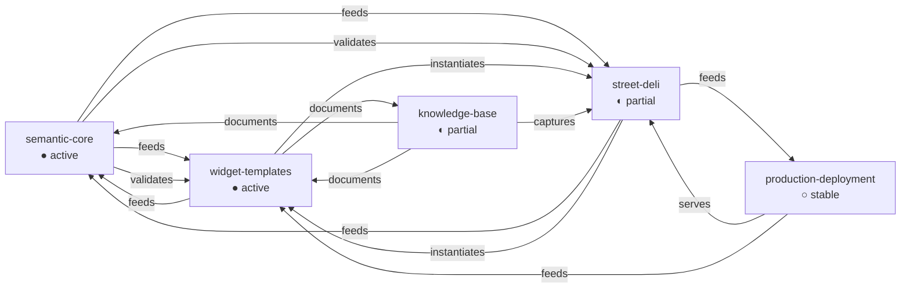

# Micro-Context Maps: Extracting Navigable Work Boundaries from Project Diaries

This is the compact-context and ticket-navigation branch of the [[docmgr]] project map.

This article documents the design and implementation of the micro-context map package: a reusable workflow and YAML format for distilling a project's accumulated history into a small number of named work boundaries that a worker can select from before starting a session. The package was built to solve a concrete problem — the DMETA design-system factory had accumulated 18 diary steps across three ticket workspaces, 48 widget templates, two working prototypes, a production deployment, and seven design documents. Returning to the project required reading thousands of lines of narrative prose before knowing where to start. The micro-context map reduced that orientation cost to five labeled contexts with file paths, open questions, and connectivity.

The package is self-contained: a playbook, a YAML specification, a template, a validator, a renderer, and a worked example. It is designed to be copied into any project that uses structured diaries and ticket workspaces.

> [!summary]
> - A micro-context map is a YAML snapshot of 3–7 named work boundaries derived from project diaries, task lists, git history, and file inventories.
> - The workflow operates in four layers: discovery (raw artifact inventory), extraction (structured per-ticket summaries), correlation (grouping into contexts), and synthesis (the navigable YAML output).
> - Each context carries files, open questions with severity and impact, activity state, task counts, tricky operational bits with symptoms, and named connections to other contexts.
> - The package includes a validator that checks the YAML against a controlled vocabulary and a renderer that produces an ASCII box diagram for terminal viewing.
> - The key insight is that diaries contain operational knowledge — especially in "What was tricky to build" and "What didn't work" sections — that is not recorded anywhere else and must be extracted by reading, not by parsing.

## Why this note exists

Projects that maintain structured diaries accumulate a valuable but inaccessible knowledge store. Each diary step records what changed, why, what worked, what failed, and what should be done next. Over weeks, a project like DMETA produces dozens of these steps across multiple ticket workspaces. The information is all there, but it is not navigable. A returning worker must read the diaries linearly, hold the open questions in memory, and manually cross-reference file paths before they can answer the simplest question: "what should I work on today, and what do I need to know first?"

This problem is not solved by a task list alone. Task lists record what is unfinished, but not why it is unfinished, what sharp edges surround it, or what else is affected. It is not solved by a README alone. A README records the project's self-description, but not its operational history. It is not solved by git log alone. Git log records what changed, but not what was tried and failed, what invariants must hold, or what questions are still open.

The micro-context map solves the problem by treating diaries, task lists, git logs, and file inventories as raw material for a synthesis step. The output is a single YAML file that a worker can read in under a minute to select which area of the project to focus on.

## When to use this pattern

A micro-context map is useful when:

- You are resuming work on a project after a gap of days or weeks
- A new person is joining the project and needs orientation
- The project has multiple ticket workspaces and you need to see the whole
- You are planning a work session and want to pick the right focus area

A micro-context map is not useful when:

- The project has no structured diaries or ticket documentation
- The project has only one active area of concern
- You are already deep in a work session and do not need orientation

## Core mental model

The workflow operates at four abstraction layers. Each layer consumes the output of the previous layer and produces a more structured artifact. Skipping a layer produces a shallower or inaccurate map.

```
┌─────────────────────────────────────────────────────────────┐
│  Layer 4: SYNTHESIS    →  Micro-context map YAML           │
│  Layer 3: CORRELATION  →  Grouped clusters + status        │
│  Layer 2: EXTRACTION   →  Per-ticket structured summaries │
│  Layer 1: DISCOVERY    →  Raw artifact inventory           │
└─────────────────────────────────────────────────────────────┘
```

**Layer 1, DISCOVERY**, finds every persistent artifact that records what happened in the project: diaries, task files, changelogs, design documents, source IR files, generated code, prototype directories, instantiation manifests, git logs, and the project README. The output is a flat list of paths and their roles.

**Layer 2, EXTRACTION**, reads every diary end-to-end and extracts structured summaries: steps completed, open questions, tricky bits, failures with verbatim errors, commit hashes, related files, and task counts. This is the most labor-intensive layer because diaries are narrative prose, not databases. The "What was tricky to build" and "What didn't work" sections contain operational knowledge that is not recorded anywhere else. You cannot extract it with regex; you must read it.

**Layer 3, CORRELATION**, groups the extracted information into 3–7 named clusters called micro-contexts. The primary clustering boundary is the ticket, because each ticket defines a concern. Within a ticket, sub-contexts are identified by artifact type (IR vs. generator vs. prototype vs. deployment) and by whether they have independent open questions. Cross-ticket artifacts (promoted design docs, playbooks) get their own cluster. Each cluster is assigned a status indicator: active, partial, or stable.

**Layer 4, SYNTHESIS**, produces the final YAML document. Each micro-context receives: an id, a name, a status, a one-line summary, a multi-sentence description, a file list with roles, open questions with severity and impact, activity state, task counts, connections to other contexts, and tricky operational bits with symptoms.

## The YAML format

The YAML format is designed around several concrete requirements. First, the number of contexts must be small (3–7) so that a worker can hold the whole map in their head. Second, every context must have a rich human description of at least three sentences, because the map's primary value is orientation, not just file listing. Third, open questions must include what breaks if the question is ignored, not just that the question exists. Fourth, connections between contexts must be explicit so a worker knows what else is affected by their changes.

### Top-level structure

```yaml
schema_version: "0"

map:
  title: "Project Name"
  summary: "One-line description"
  captured_at: "2026-05-21T10:00:00-04:00"
  workspace_root: "."
  context_count: 5

  contexts:
    - id: "semantic-core"
      name: "Semantic Core Model IR"
      status: "active"      # active | partial | stable
      summary: "One-line summary"
      description: >        # at least 3 sentences
        ...
      files: [...]
      open_questions: [...]
      activity: {...}
      tasks: {...}
      connections: [...]
      tricky_bits: [...]
```

### Files

Each file entry has a path (relative to `workspace_root`), a role from a controlled vocabulary, and a human note explaining what the file is and why it matters.

```yaml
files:
  - path: sources/dmeta-ir/core-model/archetypes.yaml
    role: source-of-truth
    note: "13 archetypes including ResultSet and FilterCriterion"
```

The file role vocabulary is: `source-of-truth`, `generated`, `prototype`, `docs`, `tooling`, `config`, `deployment`. These roles are important because they tell a worker whether a file should be edited directly, regenerated, or left alone.

### Open questions

Each open question has four required fields: the question itself, the impact if ignored, the source (which diary step or task file it came from), and a severity level.

```yaml
open_questions:
  - question: >
      Is ResultSet an archetype or widget/adapter state?
    impact_if_ignored: >
      The filter model stays ambiguous at the boundary between
      "what the system knows" and "what the UI is currently showing".
    source: "DMETA-001 diary Step 10"
    severity: important   # blocking | important | nice-to-have
```

The severity vocabulary has three levels. `blocking` means the question must be answered before further work on the context can proceed safely. `important` means the question should be answered soon because the current state is ambiguous. `nice-to-have` means the question is worth answering but does not block progress.

### Connections

Connections are named, directed relationships between contexts in the same map.

```yaml
connections:
  - to: widget-templates
    type: feeds
    note: "Archetypes and capabilities are referenced by widget templates."
```

The connection type vocabulary is: `feeds`, `validates`, `serves`, `instantiates`, `captures`, `patterns`, `documents`, `tests`. Each type has a specific meaning. `feeds` means this context produces artifacts that the target consumes. `validates` means this context checks the target's output. `serves` means this context deploys the target's output. `instantiates` means this context is a concrete instance of the target. `captures` means this context records the target's knowledge. `patterns` means this context provides reference patterns for the target. `documents` means this context describes the target's current state. `tests` means this context exercises the target's behavior.

### Tricky bits

Tricky bits are operational knowledge extracted from diaries. Each entry has three fields: what the tricky thing is, what symptom you see if you forget it, and which diary step it was learned from.

```yaml
tricky_bits:
  - what: >
      Long YAML descriptions must use folded block scalars (">")
      when they contain colons. Plain scalars with unquoted colons
      cause YAML parse errors.
    symptom: >
      yaml.scanner.ScannerError: mapping values are not allowed here
    learned_from: "DMETA-001 diary Step 10"
```

Tricky bits are the most concentrated form of operational knowledge in the map. They capture the "don't do this" and "watch out for this" information that experienced workers carry in their heads but that is rarely written down in specs or READMEs.

### Status indicators

Status is a snapshot, not a permanent label. The three values are:

| Status | ASCII | Criteria |
|--------|-------|----------|
| `active` | ● | Unchecked tasks AND (recent commits OR blocking open questions) |
| `partial` | ◐ | Documented gaps but no blockers; validation passes |
| `stable` | ○ | All tasks checked, validation passing, no open blockers |

A context marked `stable` becomes `active` again when someone starts working on it. The map should be regenerated or updated when resuming work after a gap.

## Validation

The validator (`validate.py`) checks a micro-context-map.yaml against the specification. It verifies:

1. `context_count` equals the actual number of contexts
2. Every `connections[].to` references a valid context id in the same map
3. Status values are from the controlled vocabulary
4. Severity values are from the controlled vocabulary
5. Connection types are from the controlled vocabulary
6. File roles are from the controlled vocabulary
7. Every context has at least one file entry
8. Every context has at least one open question
9. Every description is at least three sentences
10. YAML notes containing colons are properly quoted

The validator outputs errors and warnings. Errors indicate structural problems (missing fields, invalid vocabulary values, dangling cross-references). Warnings indicate soft violations (short descriptions, missing tricky-bit fields).

```bash
$ python3 micro-context-map/validate.py ./micro-context-map.yaml

  ✓ ./micro-context-map.yaml is valid
```

## ASCII rendering

The renderer (`render.py`) produces a box-drawing ASCII diagram from the YAML. This is useful for terminal viewing, quick scanning, and pasting into chat or documentation.

```
╔══════════════════════════════════════════════════════════════╗
║  DMETA-DSL                                                  ║
║  A meta design-system factory for dense operational...      ║
║  Captured: 2026-05-21T10:00:00-04:00                        ║
╠══════════════════════════════════════════════════════════════╣
║  [●] semantic-core: Semantic Core Model IR                   ║
║      The foundational IR that defines archetypes...          ║
║      Files: 11  Open: 4  Tasks: 3/6                          ║
║      Open: Is ResultSet an archetype or widget state?        ║
║                                                              ║
║  [●] widget-templates: Widget Template System                ║
║      ...                                                      ║
║                                                              ║
╠══════════════════════════════════════════════════════════════╣
║  SELECT FOR TODAY:                                           ║
║  [ ] semantic-core        ● Semantic Core Model IR           ║
║  [ ] widget-templates     ● Widget Template System           ║
║  [ ] street-deli          ◐ Street Deli Ordering Example      ║
║  [ ] production-deployment ○ Production Deployment Pipeline   ║
║  [ ] knowledge-base        ◐ Design Documentation & KB       ║
╠══════════════════════════════════════════════════════════════╣
║  CONNECTIONS:                                                ║
║  semantic-core ──feeds──→ widget-templates                   ║
║  semantic-core ──validates──→ widget-templates               ║
║  widget-templates ──instantiates──→ street-deli              ║
╠══════════════════════════════════════════════════════════════╣
║  HOTSPOTS:                                                   ║
║  widget-templates: GitOps release-token bump... [blocking]   ║
║  semantic-core: ResultSet archetype status... [important]    ║
╚══════════════════════════════════════════════════════════════╝
```

The rendered diagram has four sections: the context overview with status indicators and file counts, the selector checklist, the connectivity graph, and the hotspot summary showing the most severe open question per active or partial context.

## The DMETA-DSL example

The package includes a worked example: the DMETA-DSL project, distilled from three ticket diaries (DMETA-001 with 18 steps, STREET-DELI-001 with 9 steps, and DMETA-EXAMPLES-PROD-001 with 6 steps), 25 git commits, 48 widget templates, two working prototypes, and seven design documents.

The five contexts that emerged from the correlation step are:

1. **Semantic Core Model IR** (● active) — the foundational IR defining archetypes, capabilities, presentations, and actions for dense operational design systems. This context has 11 files, 4 open questions, and 3 of 6 tasks checked. The most important open question is whether `ResultSet` should be an archetype or widget state.

2. **Widget Template System** (● active) — the selectable/adaptable template catalog, the instance planning and scaffolding tooling, and the generated code output pipeline. This context has 6 files, 4 open questions, and 6 of 8 tasks checked. The blocking question is whether the GitOps image-bump automation should also update Job release-token fields.

3. **Street Deli Ordering Example** (◐ partial) — the first concrete DMETA instantiation, with an intelligent ingredient substitution engine, two working prototypes (warm mobile and monochrome CLIM), and two instance manifests. This context has 9 files, 3 open questions, and 4 of 5 tasks checked.

4. **Production Deployment Pipeline** (○ stable) — the CI/GitOps path that packages the prototypes as an immutable static-site image and deploys them through Argo CD. All 7 tasks are checked; the site is live at `dmeta-examples.yolo.scapegoat.dev`.

5. **Design Documentation and Knowledge Base** (◐ partial) — seven long-term design documents, two playbooks, and three Obsidian vault articles. This context has 12 files, 3 open questions, and 1 of 3 tasks checked. The most important open question is whether design-doc 05 should be fully rewritten to replace old monolithic widget examples.

### What the connectivity map reveals

The 15 connections between these five contexts reveal a dependency structure that is not obvious from the file tree alone:



The `semantic-core` and `widget-templates` contexts are tightly coupled: each feeds the other and each validates the other. Changes to the core model ripple into widget template references, and widget template additions may require new core-model symbols. The `street-deli` context instantiates the widget template system and feeds the production deployment pipeline. The `knowledge-base` context documents the semantic core and widget templates and captures the street-deli implementation history.

A worker selecting `semantic-core` for today's session should be aware that changes there will likely require updates in `widget-templates` and `street-deli`. A worker selecting `street-deli` should be aware that changes to the prototype output may need to be reflected in `production-deployment`. This cross-context awareness is the primary benefit of making the connectivity map explicit.

## Common failure modes

Several failure modes emerged during the development of this package. Each is worth documenting because it applies to any future use of the workflow.

### Skimming diaries instead of reading them

The "What was tricky to build" and "What didn't work" sections of structured diaries contain operational knowledge that is not recorded anywhere else — not in specs, not in code comments, not in task lists. If you skim the diary headers and skip the narrative sections, you will miss the sharp edges. The DMETA-001 diary Step 10 records a YAML parsing failure caused by unquoted colons in folded scalars. That failure is not visible from the current state of the files (because it was fixed), but the knowledge that unquoted colons cause parse errors is essential for anyone editing the YAML IR in the future.

The workflow explicitly requires reading every diary end-to-end. This is the most labor-intensive step and the most tempting to shortcut. Shortcuts produce maps with empty `tricky_bits` sections and vague `open_questions` that say "needs work" instead of stating the specific unresolved question.

### Too many contexts

If the correlation step produces more than seven contexts, the map becomes harder to navigate than the diaries it was meant to replace. The DMETA project initially produced 18 micro-contexts when each artifact type and each prototype was treated as a separate context. Merging by concern boundary (semantic core IR + design language IR + validator + registry generator → one "semantic core" context) reduced this to five.

The merging heuristic is: if two contexts share the same file directory, consider merging them. If two contexts never appear in separate diary steps, consider merging them. If one context is purely a tool that operates on another, keep them separate but note the tight connection.

### Vague open questions

An open question that says "needs work" or "could be improved" provides no orientation value. The question must be specific enough that a future worker can answer it. "Is ResultSet an archetype or widget state?" is specific. "The core model needs work" is not.

The `impact_if_ignored` field is equally important. A question without an impact statement tells the reader what is unresolved but not why they should care. "The filter model stays ambiguous at the boundary between what the system knows and what the UI is currently showing" tells the reader what breaks if they ignore the question.

### Unquoted colons in YAML notes

YAML plain scalars that contain colons cause parse errors. This is not a formatting preference; it is a parser constraint. The micro-context-map YAML format uses short `note:` fields throughout, and many of those notes contain colons (e.g., `note: "CLI command: dmeta validate-ir"`). The first version of the DMETA example failed validation because nine note fields contained unquoted colons.

The fix is straightforward: wrap any note value that contains a colon in double quotes, or use a folded block scalar for longer text. The validator checks for this class of error.

### Stale status indicators

A context marked `stable` that has unchecked tasks is incorrect. Status is a snapshot that must be rechecked against current task state and recent git activity whenever the map is regenerated. The DMETA example was captured at a specific timestamp (`2026-05-21T10:00:00-04:00`). If work resumes on the `production-deployment` context, its status should change from `stable` to `active` before the next commit.

## The playbook

The package includes a six-phase playbook for producing a micro-context map from any project that uses structured diaries and ticket workspaces.

**Phase 1: DISCOVERY** locates every persistent artifact. It starts from `.ttmp.yaml` to find the docmgr root, enumerates all git worktrees, walks the `ttmp/` tree by date, reads recent git logs per worktree, and reads the project README. The output is a flat inventory of paths and their roles.

**Phase 2: EXTRACTION** reads every diary end-to-end and every tasks file. For each diary step, it extracts: what was done, open questions, tricky bits, failures with verbatim errors, commit hashes, and related files. For each tasks file, it counts checked and unchecked tasks and identifies the most important unchecked task.

**Phase 3: CORRELATION** groups the extracted information into 3–7 micro-contexts. The primary clustering boundary is the ticket. Within a ticket, sub-contexts are identified by artifact type and by whether they have independent open questions. Cross-ticket artifacts and upstream repositories get their own clusters. The step collapses clusters if there are more than seven.

**Phase 4: STATUS ASSIGNMENT** checks each context for unchecked tasks, blocking open questions, and recent commits, then assigns one of three status indicators: active, partial, or stable.

**Phase 5: WRITE THE YAML** fills in the template using the information gathered in Phases 1–4. It adds connections between contexts, tricky bits from diaries, and validates the result with `validate.py`.

**Phase 6: MAINTAIN** specifies when and how to update the map. Minor updates (a few tasks checked) can be done directly in the YAML. Major updates (new artifacts, new tickets, structural changes) should re-run Phases 1–5. The map carries a `captured_at` timestamp so it is clear when the snapshot was taken.

## Package contents

The micro-context-map package is a self-contained directory that can be copied into any project.

| File | Size | Purpose |
|------|------|---------|
| `README.md` | 1.7 KB | Overview, quick start, file listing |
| `playbook.md` | 11.8 KB | Six-phase step-by-step guide |
| `spec.md` | 11.3 KB | YAML format specification with schema, vocabularies, validation rules |
| `template.yaml` | 1.8 KB | Empty skeleton to copy and fill in |
| `example.yaml` | 36.6 KB | Worked example (DMETA-DSL project, 5 contexts) |
| `validate.py` | 6.5 KB | Validates YAML against the spec |
| `render.py` | 3.9 KB | Renders YAML to ASCII box diagram |

Usage for a new project:

```bash
cp micro-context-map/template.yaml /your/project/micro-context-map.yaml
# follow playbook.md to fill it in
python3 micro-context-map/validate.py /your/project/micro-context-map.yaml
python3 micro-context-map/render.py /your/project/micro-context-map.yaml
```

## What the micro-context map enables

The micro-context map serves four concrete purposes beyond simple orientation.

**Session selection.** Before starting a work session, a worker can scan the selector checklist and pick one or two contexts to focus on. The connectivity map tells them what else is affected. The open questions tell them what to resolve. The tricky bits tell them what to watch out for.

**Handoff documentation.** When a project is handed off to a new person, the micro-context map provides a compressed orientation that would otherwise require reading every diary. The DMETA-DSL example compresses 18 diary steps, 9 diary steps, and 6 diary steps into five contexts that can be read in under a minute.

**Impact assessment.** The connectivity map makes cross-context dependencies explicit. Changing the core model affects widget templates, which affects instance planning, which affects generated code. Without the map, these dependencies are implicit and discovered only when a change in one context breaks something in another.

**Operational knowledge preservation.** The `tricky_bits` section captures the "don't do this" knowledge that experienced workers carry in their heads. In the DMETA example, three tricky bits were extracted from diaries: the YAML colon quoting rule, the requirement to update all four core-model layers simultaneously, and the Go module local-replace constraint that breaks GitHub Actions. None of these are recorded in specs or READMEs. They exist only in the diaries, and the micro-context map makes them accessible without reading the full diary.

## Open questions and future work

The current package is a v0. Several aspects may need refinement as it is applied to more projects.

**Automation potential.** Phases 1, 2 (partial), 4, and 5 could be partially automated. The discovery step is scriptable. The extraction step is harder to automate because it requires reading narrative prose and identifying operational knowledge. The correlation step requires the most judgment: deciding what constitutes a micro-context versus a sub-topic within a context.

**Rendering quality.** The current ASCII renderer produces functional but roughly aligned output. A more sophisticated renderer could produce properly aligned box diagrams, Markdown tables, or even interactive HTML.

**Context count guidance.** The spec says 3–7 contexts but does not provide strong guidance on when to use 3 versus 7. Experience across more projects may produce clearer heuristics.

**Bidirectional tool integration.** The YAML format could be consumed by docmgr or other ticket management tools. For example, `docmgr doctor` could check whether the micro-context map is stale and needs regeneration.

**Historical tracking.** The current format is a snapshot. A future version could track context status changes over time, producing a timeline of when contexts became active or stable.
