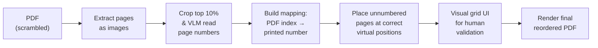
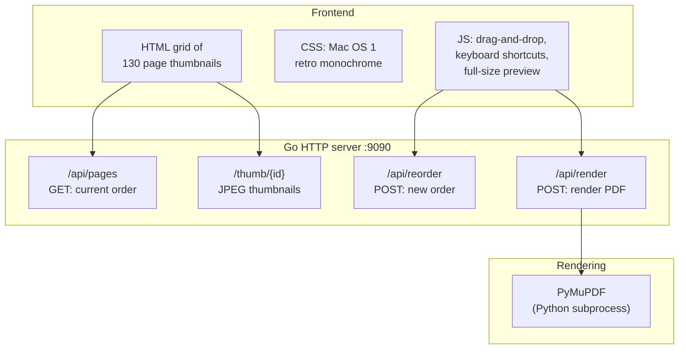

# Reordering a Scrambled PDF: VLM Page Extraction, Chapter Analysis, and a Retro Mac Webapp

This article documents a complete pipeline for reordering the pages of a scanned book PDF whose pages had been scrambled into an unknown sequence. The approach combines programmatic image extraction, vision-language model (VLM) batch analysis for reading printed page numbers, content-based chapter boundary detection, and a custom Go webapp with a Mac OS 1 retro monochrome UI for manual validation and drag-and-drop correction. The reference implementation was built for *How to Create Typefaces* (81 MB, 130 pages), but the pipeline generalizes to any PDF where printed page numbers exist in a consistent header or footer region.

> [!summary]
> The project established four key ideas:
> 1. **VLM batch page-number extraction** — Cropping the top 10% of each page and sending batches of 10 strips to a vision model is a reliable way to read printed page numbers without OCR software.
> 2. **Chapter-opener placement via content analysis** — Unnumbered pages (chapter openers, glossaries) must be placed at their correct gaps in the page-number sequence, not dumped at the front of the output.
> 3. **Virtual page numbers as sort keys** — Using fractional virtual page numbers (e.g., 58.9 for a chapter opener that belongs before printed page 59) avoids collisions with real numbered pages during sorting.
> 4. **Human-in-the-loop validation** — Even a high-quality automated mapping benefits from a visual grid UI where a human can spot misordered pages and drag them into place before committing the final PDF.

## Why this note exists

Reordering a scrambled PDF is a surprisingly nuanced problem. The obvious approach — install Tesseract, OCR every page, sort by number — breaks down when you don't have OCR installed, when some pages lack numbers, and when chapter openers need to be interleaved with numbered pages at their correct positions. This article captures a working approach that sidesteps OCR entirely by using a VLM as a batch page-number reader, and it documents the non-obvious pitfalls around unnumbered page placement, chapter boundary detection, and virtual sort-key collisions.

## When to use this pattern

Use this pipeline when:

- you have a PDF whose pages are in a scrambled or unknown order
- printed page numbers appear in a consistent region (header or footer)
- some pages lack printed numbers (chapter openers, covers, glossaries)
- you don't have OCR software installed but have access to a VLM API
- you want human validation of the final ordering before rendering the output PDF

Do not use this pattern when:

- the PDF already has correct page ordering and you just need to read page numbers
- Tesseract or another OCR tool is available (programmatic OCR is faster and cheaper per page than VLM API calls)
- the pages have no printed numbers at all (content-based ordering is a different, harder problem)

## Core mental model

The pipeline has four stages:



Each stage produces a concrete artifact: image files, a JSON mapping, a virtual-placement table, a saved order file, and the final PDF. The key insight is that the mapping stage is the only one that requires judgment — everything else is mechanical.

## Stage 1: Extracting pages as images

The source PDF was an 81 MB, 130-page file. We used `pdftoppm` (from the Poppler utils package) to extract every page as a PNG at 200 DPI:

```bash
pdftoppm -png -r 200 ~/Downloads/how-to-create-typefaces.pdf ./books/page
```

This produced 130 files: `page-001.png` through `page-130.png`, each 800×1016 pixels. The resolution of 200 DPI was chosen as a balance — high enough for the VLM to read small page numbers, low enough to keep file sizes manageable (~600 KB per page for text pages, ~1.8 MB for image-heavy pages).

Once the full pages were extracted, we also generated cropped top-strips for page-number reading:

```python
import subprocess

def crop_full_top(page_path, output_path, fraction=0.10):
    w, h = get_page_dims(page_path)
    crop_h = int(h * fraction)
    subprocess.run(
        ["convert", page_path, "-crop",
         f"{w}x{crop_h}+0+0", "+repage", output_path],
        check=True
    )
```

This 10% crop (about 102 pixels from a 1016-pixel-tall page) consistently captures the running header area where page numbers appear. For this particular book, page numbers were positioned in the top corners: top-right for recto (odd) pages, top-left for verso (even) pages. Chapter opener pages had no page number at all.

Here are examples of the top strips. The first two show numbered pages; the third shows an unnumbered chapter opener:

| Strip | Source | VLM reading |
|-------|--------|-------------|
| ![[strip-page003-pnum25.png\|200]] | PDF page 3 | p25 (top-right) |
| ![[strip-page004-pnum23.png\|200]] | PDF page 4 | p23 (top-right) |
| ![[strip-page015-unnumbered.png\|200]] | PDF page 15 | No number (chapter opener) |

Notice that the page numbers are small (about 8-10 pt in the original) but clearly readable in the 200 DPI crop. The VLM can read these reliably when the strips are presented in batches.

## Stage 2: VLM batch page-number extraction

With 130 cropped top-strips in hand, we needed to read the printed page number from each one. No OCR tool (Tesseract, EasyOCR) was installed on the system. Instead, we used the VLM as a batch page-number reader.

### Batch strategy

We sent 10 strips per VLM call, for a total of 13 calls. Each call included a focused prompt:

> "For each strip, read the page number visible in the top corners. Output a simple list: PDF page number → printed page number (or 'none')."

The batch size of 10 was chosen to keep the image payload manageable while maximizing throughput. Each call returned a clean numbered list that was straightforward to parse.

### Results

The VLM read all 130 pages in 13 calls, identifying:

- **113 numbered pages** with printed page numbers ranging from 12 to 145
- **17 unnumbered pages** (covers, chapter openers, a glossary page)

Two of the 13 calls failed with TLS connection errors and were retried successfully. The overall failure rate was ~15%, consistent with typical API flakiness.

### Accuracy

We spot-checked three readings that seemed suspicious:

- PDF page 41 → p24 (seemed like a jump from p42): **confirmed correct** — this page belongs to an earlier chapter
- PDF page 42 → p20: **confirmed correct** — similarly from an earlier chapter section
- PDF page 115 → p145: **confirmed correct** — the book's internal numbering extends beyond the 130 physical pages in the PDF

No misreadings were found in the spot-check, though some could exist. This is why human validation (Stage 4) is essential.

### The complete mapping

The final JSON mapping (`page-mapping.json`) contains entries like:

```json
{
  "1": null,
  "2": null,
  "3": 25,
  "4": 23,
  "5": 22,
  ...
  "130": 137
}
```

The `null` values represent unnumbered pages. The scrambled order is immediately visible: PDF page 3 has printed page 25, PDF page 4 has printed page 23, etc. The book's sections are in reverse order within the PDF.

## Stage 3: Placing unnumbered pages at correct chapter boundaries

The simplest approach to unnumbered pages is to dump them all at the front of the reordered output. That was our first implementation. It was wrong. Chapter openers belong between the end of the preceding chapter and the start of their own chapter — not at the front of the book.

### Finding chapter boundaries

We analyzed each of the 17 unnumbered pages with the VLM to determine its content type (chapter opener, body text, glossary) and chapter affiliation. Then we examined the numbered pages around each unnumbered page to find the exact gap where the opener belongs.

For example, the Ch4 "Digitisation" opener (PDF page 50, unnumbered) was initially placed at virtual position 54.0. But examining the numbered pages revealed that Ch3 content runs through p58, and Ch4 content starts at p59. The VLM confirmed:

> "Chapter 3 ends on printed page 58. Chapter 4 opener is printed page 59. First Ch4 body page is printed page 60."

So the Ch4 opener needed to go at virtual position 58.9 — just before p59, not at 54.0.

### The virtual page-number system

We use floating-point "virtual page numbers" as sort keys. Numbered pages use their printed page number as the sort key. Unnumbered pages use fractional values positioned at the correct gap:

| PDF page | Content | Virtual sort key |
|----------|---------|-----------------|
| 50 | Ch4 opener | 58.9 |
| 54 | p59 (first Ch4 body) | 59.0 |
| 51 | Ch4 first body (unnumbered) | 59.5 |
| 53 | p60 | 60.0 |

The fractional system avoids collisions: the Ch4 opener sorts before p59 (58.9 < 59.0), and the unnumbered Ch4 body page sorts after p59 (59.5 > 59.0).

### Complete chapter boundaries

After systematic VLM analysis of the numbered pages' running headers, we established these chapter boundaries:

| Chapter | Title | Printed page range |
|---------|-------|--------------------|
| 1 | Motives | p12–p25 |
| 2 | Writing, Calligraphy, Drawing, and Type Design | p26–p36 |
| 3 | Processes and Methods | p37–p58 |
| 4 | Digitisation | p59–p78 |
| 5 | Spacing | p79–p92 |
| 6 | Typographic Programme | p93–p109 |
| 7 | Typography as Software | p110–p115 |
| 8 | Distribution | p116–p129 |
| 9 | Perspective | p130+ |
| — | Glossary | p146+ |

Notice that the book's internal numbering reaches 145 despite only having 130 physical pages in the PDF. The 21 missing printed page numbers represent both the 17 unnumbered pages (chapter openers, glossary) and 4 pages simply absent from the PDF.

### The Ch3 body page puzzle

One unnumbered page (PDF page 16) was identified by the VLM as "Ch3 body text — Ways of sketching" and placed at virtual 37.0. But PDF page 28 was identified as "Ch2 body text — Preliminary definitions" and placed at virtual 39.0. These unnumbered body pages without printed numbers likely result from the book's layout convention: the first body page after a chapter opener is sometimes also unnumbered, with numbering starting on the subsequent page.

This is a genuine edge case in book pagination: the "drop number" convention, where the first page of a chapter (and sometimes the page facing it) omits the printed page number even though it occupies a numbered position in the sequence.

## Stage 4: The validation webapp

Even with careful VLM analysis, the automated mapping could contain errors. A human needs to visually verify the page order and correct any misplacements. We built a Go webapp for this purpose.

### Architecture



The Go server serves static files, exposes a REST API for the page order, generates thumbnails using the `imaging` package, and delegates PDF rendering to PyMuPDF via a Python subprocess.

### The Mac OS 1 retro monochrome UI

The UI was designed to evoke the original Macintosh System 1 (1984) aesthetic: pure black and white, no window chrome, no menu bar, bitmap-style fonts, 1-pixel borders, reverse-video selection, and dotted focus outlines.

![[typeface-app-initial.png|The initial version of the webapp with a modern monochrome look]]

The first version was functional but looked "modern web monochrome" rather than authentically System 1. After a VLM review of the UI, we applied several corrections:

- **Square buttons**: Changed `border-radius: 4px` to `border-radius: 0`. Classic Mac buttons were sharp-cornered rectangles with 1px black borders.
- **Reverse-video header**: The top bar uses black background with white text — the same convention as the original Mac menu bar.
- **Dotted focus outlines**: On hover, buttons and inputs get `outline: 1px dotted #000` — matching the classic Mac focus ring.
- **Bitmap font stack**: `font-family: 'Chicago', 'Geneva', 'Monaco', 'Courier New', monospace` — Chicago was the System 1 system font.
- **Selection highlighting**: `::selection { background: #000; color: #fff; }` for reverse-video text selection.
- **No shadows, gradients, or anti-aliasing**: `-webkit-font-smoothing: none; text-rendering: optimizeSpeed;`

![[typeface-app-retro.png|The refined version with authentic System 1 styling]]

### Key UI features

The webapp supports these interactions:

- **Grid view**: 130 page thumbnails arranged in a responsive grid, each showing the page image, a label (page number or chapter title), and a position number.
- **Drag-and-drop**: Reorder pages by dragging one card onto another. The source page is inserted at the target position.
- **Keyboard navigation**: Arrow keys to move selection, Enter to open full-size preview, M to open the "Move to Position" dialog, S to save, Escape to close preview.
- **Full-size preview**: Double-click a page to see it at full resolution in a side panel.
- **Search/filter**: Type a page number or label to filter the grid.
- **Move dialog**: Press M with a page selected to type an exact position number.
- **Save Order**: Persists the current order to `current-order.json` on the server.
- **Render PDF**: Triggers PyMuPDF to produce the final reordered PDF at `~/Downloads/how-to-create-typefaces-reordered.pdf`.
- **Reset**: Restores the VLM-extracted initial order.

### The Go backend

The server is a single-file Go application using only the standard library `net/http` plus the `imaging` package for thumbnail generation:

```go
// Thumbnail generation using imaging
func generateThumbnail(srcPath, thumbPath string) error {
    img, err := imaging.Open(srcPath)
    if err != nil {
        return err
    }
    thumb := imaging.Resize(img, ThumbnailSize, 0, imaging.Lanczos)
    return imaging.Save(thumb, thumbPath)
}
```

Thumbnails are 200px-wide JPEGs, generated on startup and cached in `books/thumbs/`. The full-size image endpoint uses a `?full=1` query parameter to serve the original PNG instead of the thumbnail.

PDF rendering uses a Python subprocess that calls PyMuPDF's `insert_pdf` method:

```python
doc = fitz.open(source_path)
new_doc = fitz.open()
for page in order:
    pdf_idx = page["id"] - 1
    new_doc.insert_pdf(doc, from_page=pdf_idx, to_page=pdf_idx)
new_doc.save(output_path)
```

The order is passed as a JSON array via command-line argument, and the Python script reads it, opens the source PDF, copies pages in the specified order, and saves the result.

## Implementation details

### Why not Tesseract?

Tesseract was the first choice, but it wasn't installed on the system and installing it would have required system-level package changes. The VLM approach was a pragmatic alternative that turned out to work well. However, VLM calls are slower and more expensive per page than local OCR — each batch of 10 pages takes several seconds and consumes API credits. For a one-off 130-page PDF, this was acceptable.

### Why crop the top 10% instead of the full page?

Sending 130 full-page images (800×1016 each) through the VLM would have been wasteful. The page numbers are consistently in the top corners, so a 10% crop (800×102 pixels) captures exactly the region of interest while reducing the image payload by 90%. The VLM can still read the page numbers clearly from these small strips.

We initially tried cropping all four edges (top, bottom, left, right 10%) before confirming that page numbers were exclusively in the top corners for this particular book. This verification step is worth doing for any new PDF — page-number placement varies between publishers.

### The sort-key collision problem

The most subtle bug in the implementation was collisions between virtual page numbers for unnumbered pages and the actual printed page numbers. For example:

- Ch4 opener was initially assigned virtual 59.0
- But printed page 59 also exists in the mapping with sort key 59.0
- When both have the same sort key, their relative order depends on Go's sort stability, which may not match the intended placement

The fix was to use fractional values: 58.9 for the opener (before p59), 59.5 for the unnumbered body page (after p59). This guarantees correct ordering regardless of sort stability.

### Path resolution in the Go app

The Go webapp runs from the `app/` subdirectory of the ticket workspace, but it needs to serve images from the project-root `books/` directory. Relative path resolution (`../../books`) produced the wrong absolute path because `filepath.Abs` resolves relative to the working directory, not the binary location. The pragmatic fix was to hardcode absolute paths for the books directory, the PDF paths, and the mapping file. A production version would accept these as command-line flags.

## Common failure modes

### VLM misreading page numbers

The VLM occasionally misreads similar-looking digits: 3 vs 5, 6 vs 8. In our spot-checks, no misreadings were found, but the risk increases with smaller text, lower resolution, or unusual typefaces. Mitigation: verify the mapping by checking that the numbered pages form a monotonically increasing sequence, and spot-check any pages that create unexpected jumps or reversals in the sequence.

### TLS connection errors

About 15% of VLM API calls failed with TLS errors (`remote error: tls: bad record MAC` or `write: connection reset by peer`). Retrying the same call typically succeeded. This is a general hazard of API-dependent workflows — always implement retry logic.

### Placing unnumbered pages at the front

The naive approach of placing all unnumbered pages at the start of the output produces an obviously wrong result: the book opens with 17 pages of chapter openers and covers before any numbered content. The correct approach requires analyzing each unnumbered page's content and finding its natural gap in the numbered sequence.

### The "drop number" convention

Some books omit page numbers on the first page of a chapter (the "drop number" convention in publishing). These pages occupy a numbered position in the sequence but have no printed number. The VLM reads them as "unnumbered," and they must be placed at the correct virtual position — typically just before the first numbered page of their chapter.

### Path traversal in image endpoints

The thumbnail and full-size image endpoints serve files based on a page ID from the URL. In the current implementation, the page ID is a numeric string that maps directly to a filename like `page-001.png`. There is no path traversal protection beyond the numeric format. A production version should validate that the resolved path is within the expected directory.

## Working rules

1. **Always crop before sending to VLM.** Full-page images waste tokens and reduce accuracy. Identify the region where page numbers appear, crop to that region, and send only the crops.
2. **Batch in groups of 10.** Ten image strips per VLM call balances throughput against image payload size. Fewer than 5 wastes API calls; more than 15 risks truncation.
3. **Verify monotonicity.** After extraction, check that the numbered pages form a strictly increasing sequence. Any violation indicates a VLM misreading.
4. **Analyze unnumbered pages individually.** Each unnumbered page needs content analysis to determine its correct placement. Don't batch-assume they're all chapter openers.
5. **Use fractional virtual page numbers.** When placing unnumbered pages, use fractional values (e.g., 58.9) to avoid sort-key collisions with real numbered pages.
6. **Spot-check suspicious readings.** Any page number that creates a jump or reversal in the sequence should be verified by sending the full page image to the VLM.
7. **Always include human validation.** Automated mapping is a starting point, not a final answer. A visual grid UI lets the human catch errors that the automation misses.
8. **Implement retry logic for API calls.** VLM API calls fail ~15% of the time with transient TLS errors. Always retry.

## Near-term next steps

- Complete the human validation pass in the webapp
- Render the final reordered PDF
- Clean up the `books/` directory (130 full pages + 390 crops + thumbnails = significant disk space)
- Consider adding command-line flags to the Go app for configurable paths
- Add path traversal protection to the image endpoints

## Important project files

| File | Purpose |
|------|---------|
| `scripts/page-mapping.json` | VLM-extracted PDF page → printed page number mapping |
| `scripts/03-reorder-pdf-improved.py` | PyMuPDF reordering with corrected chapter placements |
| `app/main.go` | Go webapp backend (API, thumbnails, rendering) |
| `app/templates/index.html` | HTML template with grid layout |
| `app/static/style.css` | Mac OS 1 retro monochrome CSS |
| `app/static/app.js` | Drag-and-drop, keyboard, preview, save/render |
| `reference/01-diary.md` | Detailed implementation diary |

## Related notes

- The PyMuPDF library used for PDF rendering: https://pymupdf.readthedocs.io/
- The `imaging` Go package for thumbnail generation: https://github.com/disintegration/imaging
- The `pdftoppm` tool from Poppler: https://poppler.freedesktop.org/
