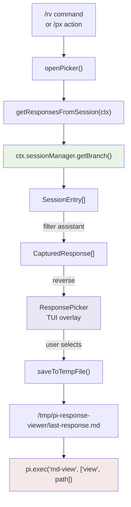

# Response Viewer: A Pi Extension for Browsing and Opening Assistant Responses in a Markdown Viewer

This article is a deep technical walkthrough of the Response Viewer extension for Pi, a terminal-based coding agent. The extension reads all assistant responses from the current session's history, presents them in a scrollable TUI picker, and opens any selected response in an external Markdown viewer (`md-view`). It covers the architecture, the session-history reading pattern, the TUI overlay implementation, the shared extension framework registration, and the design decisions that shaped each layer.

> [!summary]
> This article teaches three things:
> 1. How to read Pi's session history to extract assistant responses without accumulating state in memory
> 2. How to build a TUI overlay picker that renders in the terminal using the `@mariozechner/pi-tui` component contract
> 3. How to register a complete Pi extension using the shared framework (`registerPiExtension`) with actions, settings, docs, and widgets

## Why this note exists

Pi produces long assistant responses — code reviews, analysis documents, design guides — that are uncomfortable to read in a terminal. The Response Viewer extension solves this by extracting the response text, writing it to a temporary Markdown file with YAML frontmatter, and opening it in `md-view view`, which renders the file as HTML in a browser with syntax highlighting, proper headings, and scroll navigation.

The extension also demonstrates a design pattern that matters for Pi extensions generally: reading data from the session history rather than accumulating it in JavaScript state. This pattern makes extensions resilient to `/reload` and ensures that data from before the extension was loaded is available immediately.

## When to use this pattern

The session-history reading pattern applies whenever an extension needs to display or process conversation data that already exists in the session:

- listing assistant responses for review, export, or comparison
- browsing tool call results (edits, writes, bash output) from earlier in the session
- building search or navigation UIs over the conversation timeline
- extracting structured data (code blocks, file paths, decisions) from past turns

Do not use this pattern when:

- you need real-time streaming of partial responses (use `message_update` events instead)
- you need to persist data across sessions (write to disk or use `sessionManager.appendEntry()`)
- the data you need is not in the session history (e.g. external API results)

## Core mental model

The extension has three layers, each with a single responsibility:



- **Layer 1 — Session history reader** (`response.ts: getResponsesFromSession`): Reads the canonical session timeline, filters for assistant messages, extracts text, strips `<summary>` blocks, and returns an array of `CapturedResponse` objects.
- **Layer 2 — TUI picker** (`ui.ts: ResponsePicker`): A terminal overlay component that renders the response list with search, scroll, and selection. When the user presses Enter, it resolves a Promise with the selected response.
- **Layer 3 — File writer and viewer launcher** (`response.ts: saveToTempFile`, `openWithMdView`): Writes the selected response as a Markdown file with YAML frontmatter, then calls `md-view view` as a child process.

The key insight is that Layer 1 has no state. It reads from the session history every time it is called. This means the extension works correctly after `/reload`, after tree navigation, and even for responses that were generated before the extension was loaded.

## Architecture

### File structure

```
extensions/response-viewer/
  index.ts       # Registration, commands, event handlers, action dispatch
  response.ts    # Session reading, temp file management, md-view invocation
  ui.ts          # ResponsePicker TUI component
  README.md      # User-facing documentation
```

The separation follows the shared framework's recommended layout. `index.ts` owns the registration and command wiring. `response.ts` owns the pure logic (session reading, file writing, process execution). `ui.ts` owns the visual component.

### Registration contract

Every Pi extension in this repository calls `registerPiExtension()` from the shared registry. This single call declares the extension's identity, actions, documentation, settings, and dashboard widgets. The `/px` launcher and the dashboard discover these contributions through the registry — extensions do not need to know about the launcher.

```typescript
registerPiExtension({
  id: "response-viewer",       // stable machine key
  name: "Response Viewer",     // human display name
  description: "...",          // one-paragraph summary
  commands: ["rv", "response-view", "rv-last", "rv-preview", "rv-reopen"],
  tags: ["response", "viewer", "markdown", "md-view"],
  run: async (ctx) => ...,     // default action when selected in /px
  actions: [...],              // named verbs in the /px action picker
  docs: [...],                 // help pages accessible from /px
  settings: {...},             // schema-based settings view
  widgets: [...],              // status bar / dashboard cards
});
```

The `id` field is a database primary key. If you rename it, saved dashboard configurations and widget layouts break. The `run` field is the safest, most common action — it should not be destructive. Named actions with `dangerous: true` get a visual warning in the launcher.

### Data flow for the picker interaction

When the user types `/rv`, the following sequence occurs:

1. Pi's command dispatcher matches the string `"rv"` to the registered command handler
2. The handler calls `getResponsesFromSession(ctx)`, which reads `ctx.sessionManager.getBranch()`
3. The branch returns a flat `SessionEntry[]` — all entries on the current conversation branch, from root to leaf
4. Entries with `type === "message"` and `message.role === "assistant"` are filtered out
5. Each assistant message's `content` array is walked; text blocks are concatenated and `<summary>` tags are stripped
6. The resulting `CapturedResponse[]` is reversed (most recent first) and passed to the picker
7. `ctx.ui.custom<ResponsePickerResult>()` opens a TUI overlay and returns a Promise
8. The user navigates, searches, and selects — the picker resolves the Promise
9. The selected response is written to `/tmp/pi-response-viewer/last-response.md`
10. `pi.exec("md-view", ["view", path])` opens the file in the browser

Steps 1–6 are synchronous reads from an in-memory session tree. Steps 7–8 are an interactive TUI loop. Steps 9–10 are a file write followed by a child process spawn.

## Implementation details

### Reading session history without accumulating state

The most important design decision in this extension is how it acquires the list of assistant responses. The initial implementation used a `turn_end` event handler that appended each assistant message to a JavaScript array (`state.responses`). This is the pattern used by the existing `response-capture` extension.

The problem with the accumulator pattern is that `/reload` destroys the JavaScript state. After a reload, the extension's `state.responses` is empty, even though the session file still contains all the conversation data. The user would see `rv:no-responses` in the status bar immediately after reloading, which is incorrect — the responses are still in the session, just not in the extension's memory.

The fix reads from `ctx.sessionManager.getBranch()` instead. This method returns the full conversation timeline for the current branch, regardless of when the extension was loaded. It is the same data source that Pi uses to build its own context window.

```typescript
export function getResponsesFromSession(ctx: ExtensionContext): CapturedResponse[] {
  const entries = ctx.sessionManager.getBranch();
  const sessionId = ctx.sessionManager.getSessionId();
  const responses: CapturedResponse[] = [];
  let turnIndex = 0;

  for (const entry of entries) {
    if (entry.type !== "message") continue;
    const message = (entry as any).message;
    if (!message || message.role !== "assistant") continue;
    if (!Array.isArray(message.content)) continue;

    const text = extractTextFromContent(message.content);
    if (!text) continue;

    responses.push({
      turnIndex,
      capturedAt: entry.timestamp,
      sessionId,
      entryId: entry.id,
      modelProvider: ctx.model?.provider,
      modelId: ctx.model?.id,
      modelName: ctx.model?.name,
      text,
      textLength: text.length,
    });
    turnIndex++;
  }

  return responses;
}
```

The `turnIndex` is a local counter, not the session's internal turn index. It counts only assistant messages, so `T1` in the picker means "the first assistant response," not "entry 1 in the session tree." This matters because the session tree interleaves user messages, tool results, compaction entries, and model change entries — only a subset are assistant messages.

The `extractTextFromContent` function walks the `message.content` array and collects blocks where `block.type === "text"". Assistant messages can also contain tool call blocks (`type: "toolCall"`) and thinking blocks, but those are not text the user wants to read in a Markdown viewer, so they are filtered out.

### Stripping summary blocks

Pi enforces a mandatory `<summary>...</summary>` block at the end of every assistant response. These blocks contain session metadata that is useful for the agent's context management but irrelevant for a human reading the response in a browser. The `stripSummary` function removes them before the text is displayed or saved:

```typescript
function stripSummary(text: string): string {
  return text.replace(/\n?<summary>[\s\S]*?<\/summary>\n?/g, "").trim();
}
```

The regex uses `[\s\S]*?` (lazy match including newlines) rather than `.*?` because the summary block typically spans multiple lines. The surrounding `\n?` pairs ensure that removing the block does not leave double blank lines or trailing whitespace.

### The TUI picker overlay

The `ResponsePicker` class implements the `Component` interface from `@mariozechner/pi-tui`. This interface has three methods: `render(width)`, `handleInput(data)`, and `invalidate()`.

The render method produces an array of strings, one per terminal row. Each string contains literal box-drawing characters and ANSI escape sequences for bold and dim styling. The framework does not provide a layout engine — each line is assembled by hand.

#### Rendering the modal frame

The picker renders as a centered modal overlay with a box-drawing border:

```
╭────────────────────────── Response Viewer ──────────────────────────╮
│ Search: _                                                            │
│ 5 assistant response(s) captured this session                        │
├──────────────────────────────────────────────────────────────────────┤
│ > T  5  15:29     253  GLM-5.1                   Why did the dev…  │
│   T  4  15:28     224  GLM-5.1                   Hello, it's won…  │
│   T  3  15:28     435  GLM-5.1                   I'm not sure wh…  │
│   T  2  15:27     231  GLM-5.1                   Why do programm…  │
│   T  1  15:27     221  GLM-5.1                   Hello there, ho…  │
│                                                                      │
├──────────────────────────────────────────────────────────────────────┤
│ Enter open  ↑/↓ select  PgUp/PgDn jump  / search  Esc close        │
╰──────────────────────────────────────────────────────────────────────╯
```

Each response row shows five columns:

| Column | Width | Source |
|--------|-------|--------|
| Turn | 4 chars | `turnIndex + 1` |
| Time | 5 chars | ISO timestamp → `HH:MM` |
| Chars | 6 chars | `textLength` with K/M suffix |
| Model | 24 chars | `modelId`, left-aligned, truncated |
| Preview | remaining | First line of `text`, truncated with `…` |

The `renderItem` method assembles each row by computing the fixed-width prefix first, then calculating the remaining width for the preview column. The `visibleWidth()` function from `@mariozechner/pi-tui` accounts for CJK double-width characters and ANSI escape sequences, so the column alignment is correct even when model names or preview text contain wide characters.

#### Input handling and search mode

The picker has two modes: normal and search. In normal mode, single-character keys are reserved for actions (`/` enters search, `Enter` confirms selection, arrow keys navigate). In search mode, all printable characters append to the query, and the list filters in real time.

The mode switch prevents ambiguity. If typing immediately searched, pressing `/` could either mean "start searching" or "search for the character /." The explicit mode boundary (`/` to enter, `Enter` or `Esc` to leave) eliminates this ambiguity. The same pattern is used by the `/px` launcher.

```typescript
handleInput(data: string): void {
  if (matchesKey(data, Key.escape)) {
    if (this.searchActive) {
      this.searchActive = false;
      this.markDirty();
      return;
    }
    this.options.done({ action: "cancel" });
    return;
  }
  if (data === "/" && !this.searchActive) {
    this.searchActive = true;
    this.markDirty();
    return;
  }
  // ... search-mode vs normal-mode key handling
}
```

The `filtered()` method implements search by splitting the query on whitespace and requiring every part to match somewhere in the response text, model name, or turn number. This gives a space-separated AND search: `code review T3` finds responses containing both "code" and "review" that are also from turn 3.

#### Scroll management

The picker shows 14 body rows. When the list is longer than 14, scroll management ensures the selected item stays visible:

```typescript
private ensureScroll(visibleRows: number, count: number): void {
  if (this.selected < this.scroll) this.scroll = this.selected;
  if (this.selected >= this.scroll + visibleRows)
    this.scroll = this.selected - visibleRows + 1;
  this.scroll = Math.max(0, Math.min(this.scroll, Math.max(0, count - visibleRows)));
}
```

The two conditions handle the two directions: if the selection moves above the viewport, scroll up; if it moves below, scroll down. The final `Math.max(0, Math.min(...))` clamping prevents the scroll position from exceeding the list bounds or going negative.

#### Render caching

The `render()` method caches its output. If the terminal width has not changed and no `invalidate()` call was made, it returns the cached lines immediately. This is important because the TUI framework may call `render()` on every frame (e.g. when the terminal is resized or when other UI elements trigger a redraw). Without caching, the session history would be re-read and the border strings re-assembled on every frame.

```typescript
render(width: number): string[] {
  if (this.cachedWidth === width && this.cachedLines) return this.cachedLines;
  // ... assemble lines ...
  this.cachedWidth = width;
  this.cachedLines = lines.map(line => truncateToWidth(line, modalWidth, ""));
  return this.cachedLines;
}
```

The cache is invalidated by `markDirty()`, which is called from `handleInput()` after every key press and from `invalidate()` (which the framework may call externally). The `requestRender()` call on the TUI object tells the framework that a redraw is needed.

### Temp file management

When the user selects a response, `saveToTempFile()` writes two files:

1. **`last-response.md`** — always overwritten. This file always contains the most recently opened response. `md-view` can live-reload this file, so if the user opens a different response, the browser tab updates automatically.
2. **`2026-05-21T19-31-13-040Z-turn-5.md`** — a timestamped copy. These files accumulate over the session and provide a history of what was opened.

Both files are written to `$TMPDIR/pi-response-viewer/` (typically `/tmp/pi-response-viewer/` on Linux). Using the OS temp directory means the files are cleaned up on reboot and do not pollute the project directory.

The Markdown file includes YAML frontmatter with metadata:

```yaml
---
Title: "Pi Response — Turn 5"
Source: "pi-response-viewer"
SessionId: "019e4c01-8049-7138-93f3-4eef3ab56de4"
TurnIndex: 4
CapturedAt: "2026-05-21T19:29:09.624Z"
ModelProvider: "wafer"
ModelId: "GLM-5.1"
ModelName: "GLM 5.1"
---

# Pi Response — Turn 5

[response text here]
```

The frontmatter allows downstream tools (e.g. `md-view` templates, static site generators) to access the metadata without parsing the heading. The `Title` field uses the display turn number (`turnIndex + 1`) while `TurnIndex` stores the zero-based index.

### Invoking md-view

The `openWithMdView()` function uses `pi.exec()` to run the `md-view` binary as a child process:

```typescript
export async function openWithMdView(
  pi: ExtensionAPI,
  ctx: ExtensionCommandContext,
  state: ResponseViewerState,
  path: string,
): Promise<void> {
  const args = ["view"];
  if (state.settings.openDark) args.push("--dark");
  if (state.settings.noReload) args.push("--no-reload");
  if (state.settings.browser.trim()) args.push("--browser", state.settings.browser.trim());
  args.push(path);

  const result = await pi.exec("md-view", args, { cwd: ctx.cwd, timeout: 15_000 });
  if (result.code !== 0) {
    ctx.ui.notify(
      [`md-view failed for ${path}`,
       `exit code: ${result.code}`,
       result.stderr.trim() || result.stdout.trim()
      ].filter(Boolean).join("\n"),
      "error",
    );
    return;
  }
  ctx.ui.notify(`Opened in md-view: ${path}`, "info");
}
```

The 15-second timeout matches the pattern established by the `markdown-recent-viewer` extension. The `md-view` daemon auto-starts if it is not already running, so the user does not need to pre-start anything. If the daemon is already running, `md-view view` returns immediately after telling the daemon to open the file.

The settings (`openDark`, `noReload`, `browser`) are applied at invocation time, not at daemon start time. This means the user can change a setting and the next invocation picks it up without restarting the daemon.

### Schema settings

The extension contributes four settings through the shared framework's schema-based settings system:

| Setting | Type | Default | Effect |
|---------|------|---------|--------|
| `openDark` | boolean | false | Pass `--dark` to `md-view view` |
| `noReload` | boolean | false | Pass `--no-reload` to `md-view view` |
| `autoOpen` | boolean | false | Automatically open every new response in md-view |
| `browser` | string | `""` | Override the browser command (empty = default) |

Schema settings are defined as a `PiSettingsSchema` object with sections and fields. The shared settings view automatically renders these as a `SettingsList` component. The `load()` callback provides the current values, and the `onApply()` callback receives the new values when the user saves.

The `autoOpen` setting is the only one that requires an event handler. When enabled, the extension listens to `turn_end` events and automatically saves and opens the latest assistant response. This is the only place where the extension still uses an event listener rather than reading from session history — the reason is that `autoOpen` needs to react at the moment the response finishes, not when the user requests it.

### Status bar widget

The extension registers a status bar widget:

```typescript
widgets: [
  {
    id: "status",
    title: "Response Viewer Status",
    defaultZone: "statusBar",
    defaultVariant: "short",
    priority: 70,
    render: ({ ctx }) => formatStatusShort(ctx),
  },
],
```

The `render` callback reads from the session history on every render call. This is a potential performance concern: if the session has hundreds of entries, `getResponsesFromSession()` iterates them all on every status bar update. The current implementation accepts this cost because the status bar render frequency is low (triggered by session events, not by every keystroke), and typical sessions have fewer than 100 assistant responses. If this becomes a bottleneck, the fix is to cache the response count in the extension state and invalidate it on `turn_end` or `message_end` events.

The status text format is:

```
rv:5turns/last:5/chars:2.3K
```

When no responses exist: `rv:no-responses`.

## Common failure modes

### md-view not installed

If `md-view` is not in the user's `PATH`, `pi.exec()` will return a non-zero exit code. The extension reports this as an error notification with the exit code and stderr. The user needs to install `md-view` separately — it is not bundled with the extension.

### Temp directory permissions

If `$TMPDIR` is not writable, `mkdirSync()` will throw. The extension does not catch this in `saveToTempFile()` — it propagates to the `saveAndOpenResponse()` catch block, which shows the error as a notification. The user can override the temp directory through the settings if the default location is not suitable.

### Lost state after /reload (original bug)

The original implementation used a `turn_end` event handler to accumulate responses in a JavaScript array. After `/reload`, the array was empty, and the status bar showed `rv:no-responses` even though the session contained responses. The fix was to replace the accumulator with `getResponsesFromSession()`, which reads from `ctx.sessionManager.getBranch()` — the same in-memory data structure that Pi uses to build the LLM context. This data survives `/reload` because it is owned by the session manager, not by the extension.

### Widget render cost

The `formatStatusShort()` function calls `getResponsesFromSession()` on every render. For sessions with many entries, this means iterating the full branch on every status bar update. The framework's documentation warns against doing expensive work in dashboard render callbacks. The mitigation strategy is to cache the result and invalidate on session events, but the current implementation has not done this yet.

### tmux extended-keys limitation

When running Pi inside tmux without `set -g extended-keys on`, modified key sequences (including arrow keys in some terminals) may not be delivered correctly to the TUI component. The picker's `handleInput()` method uses `matchesKey(data, Key.up)` and similar, which rely on the terminal encoding the key correctly. The fix is at the terminal level: add `set -g extended-keys on` to `~/.tmux.conf`.

## Commands and actions

| Command | What it does |
|---------|-------------|
| `/rv` | Open the response picker (browse all responses, most recent first) |
| `/response-view` | Alias for `/rv` |
| `/rv-last` | Save and open the most recent response directly |
| `/rv-preview` | Terminal preview (first 1000 chars) of the most recent response |
| `/rv-reopen` | Re-open the last saved file without re-saving |

From the `/px` launcher, the extension exposes these actions:

| Action | Description |
|--------|-------------|
| Browse responses (default) | Opens the picker — the safest, most common action |
| Open last response | Skips the picker, opens most recent directly |
| Preview last response | Terminal text preview |
| Re-open last saved file | Opens `state.lastSavedPath` in md-view again |

The default action (Enter in `/px`) is always the picker, because it is non-destructive and gives the user full control.

## Relationship to other extensions

The Pi extension repository already has two related extensions:

- **response-capture** captures the last assistant response and saves it persistently to `.pi/response-capture/` or imports it into a docmgr ticket. It uses the `turn_end` accumulator pattern. Response Viewer is for quick viewing; response-capture is for archiving.

- **markdown-recent-viewer** browses Markdown files that were created or edited by tool calls (write, edit) during the session, and opens them in `md-view`. It reads from `ctx.sessionManager.getBranch()` — the same session-history pattern that Response Viewer adopted after the `/reload` bug was discovered.

Response Viewer occupies a distinct niche: it targets the assistant's own response text specifically, it accumulates across the entire session, and it provides search. Neither response-capture nor markdown-recent-viewer does this combination.

## Key design decisions

| Decision | Chosen | Alternative | Why |
|----------|--------|-------------|-----|
| Response source | `sessionManager.getBranch()` | `turn_end` accumulator | Survives `/reload`; data available before extension load |
| Temp file location | `$TMPDIR/pi-response-viewer/` | `.pi/response-viewer/` in project dir | Viewing is throwaway; project dir is for persistent data |
| Overwrite strategy | `last-response.md` + timestamped copy | Only timestamped copies | `last-response.md` enables md-view live-reload across selections |
| Picker ordering | Most recent first | Chronological | User wants the most recent response most often |
| Summary stripping | Regex in `extractTextFromContent` | Let the viewer hide it | Summary blocks are Pi-internal metadata, not user content |
| Settings kind | Schema | Custom TUI | Four simple fields do not need a custom component |
| Auto-open mechanism | `turn_end` event handler | Polling or file watch | `turn_end` is the precise moment the response is complete |

## Near-term next steps

- Cache the response count in the widget render callback (invalidate on `turn_end` / `message_end`)
- Add a keyboard shortcut (e.g. `Ctrl+R`) for quick "open last response" without typing a command
- Add a "copy path to clipboard" action in the picker for piping the temp file to other tools
- Consider a preview pane in the picker that shows more of the selected response without leaving the overlay
- Add a "clear temp files" action to remove accumulated timestamped copies

## Project working rule

> [!important]
> Always read from `ctx.sessionManager.getBranch()` rather than accumulating state in JavaScript arrays. Session history is the canonical source; it survives extension lifecycle events and is available before the extension loads.
