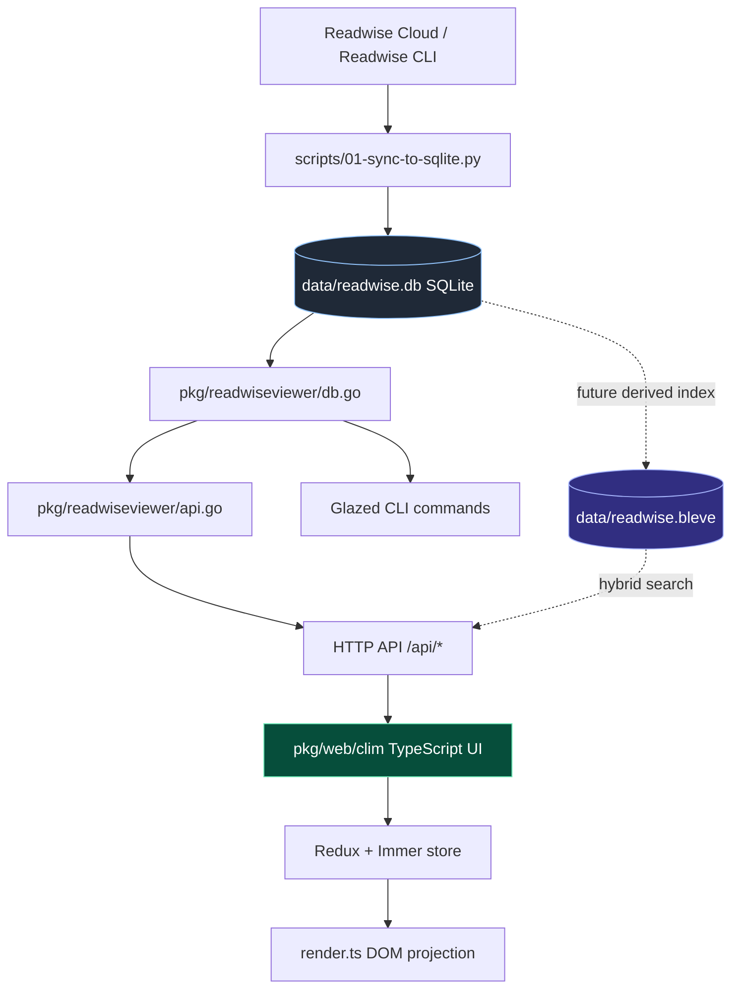
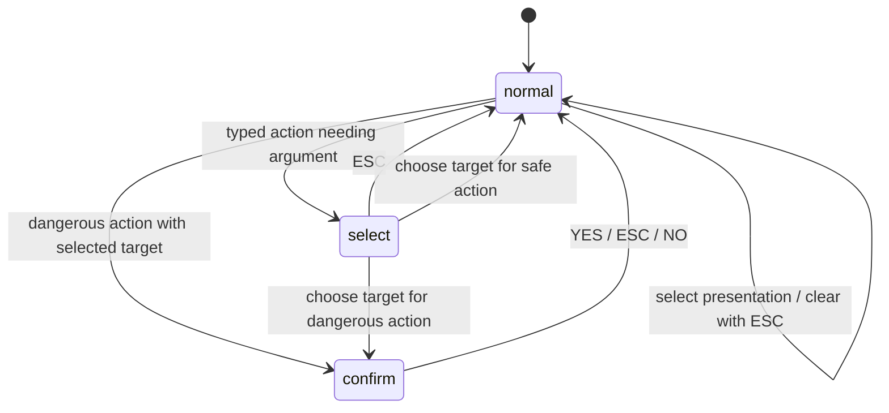
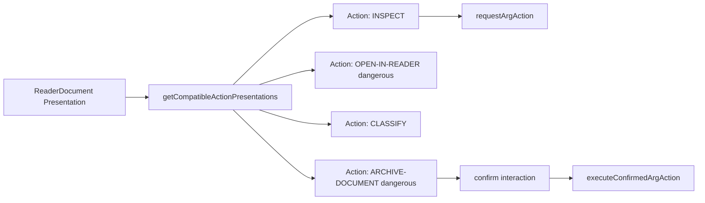

# Readwise Viewer

Readwise Viewer is a local workbench for navigating, inspecting, searching, and eventually classifying a personal Readwise Reader library. It combines a Go backend built on the Glazed command framework with a monochrome CLIM-style web UI built from TypeScript, Redux, Immer, and an embedded browser bundle. The system reads from a local SQLite database populated by a Python sync script, serves a REST API and browser UI from one Go binary, and now has two current design tracks: semantic/Bleve search and a hardened CLIM interaction core.

> [!summary]
> The project currently has four important identities:
> 1. a SQLite-backed Go API server that wraps data rows in typed `PresentationRef` envelopes with semantic capabilities
> 2. a Glazed CLI for terminal-based document browsing, filtering, search, and inspection
> 3. a CLIM-style web UI whose command/action core was hardened around tested parsing, explicit interaction states, and action presentations
> 4. a design path toward embeddings + Bleve hybrid search, documented in `RWVEC-001`, where SQLite stays canonical and Bleve becomes a disposable derived index

## Why this project exists

Readwise Reader accumulates documents faster than any individual can triage them. The local library currently contains 13,848 documents, a very large fraction of which are untagged or only partially described. The Readwise web interface is designed primarily for reading, not for bulk classification, local search experimentation, systematic review, or command-driven curation.

The Viewer exists to fill that gap. It provides dense, fast, local interaction with a large document corpus while keeping the Readwise API/cloud at the boundary. The sync layer brings the data local. SQLite becomes the canonical working store. Go exposes data through typed API and CLI surfaces. The browser UI explores a CLIM-inspired interaction model where every meaningful object carries a type, identity, label, and capabilities.

The project also exists as a real testbed for typed presentations and command/action interaction design. The CLIM idea is no longer just “click rows in a UI”; the current implementation now treats available actions as presentations too, so selecting a document can reveal selectable `Action` presentations such as `INSPECT`, `CLASSIFY`, or `ARCHIVE-DOCUMENT`.

## Current project status

The project is active and now has both implementation work and design/research tickets.

What exists in code today:

- a Go binary `readwise-viewer` with Glazed CLI commands for documents, sources, tags, sync runs, stats, search, clusters, document get, and serve
- a `serve` command that starts an HTTP server on port 8771 and serves both `/api/*` routes and the embedded CLIM UI
- a Python sync script, `scripts/01-sync-to-sqlite.py`, that populates `data/readwise.db` from the Readwise CLI with pagination, retry, and sync state
- a SQLite schema with `documents`, `tags`, `document_tags`, `sync_runs`, `sync_state`, and an FTS5 table `documents_fts`
- a TypeScript CLIM UI under `pkg/web/clim/`, bundled into `pkg/web/clim/app.js` and embedded by Go
- Redux + Immer state management with an explicit `InteractionState` union for normal/select/confirm states
- tested command parsing in `pkg/web/clim/commands.ts` and `pkg/web/clim/commands.test.ts`
- registry-generated HELP output instead of a duplicated hand-written help table
- selected-target actions rendered as `ActionPresentation` objects, not just plain text spans
- a `make check-web` target that runs Bun tests, TypeScript no-emit checking, rebuilds `app.js`, and fails if the embedded bundle is stale

What is documented but not fully implemented yet:

- `RWVEC-001`: embeddings + Bleve hybrid search design
- text-only Bleve indexing baseline
- vector embedding provider and cache
- hybrid BM25+kNN search with RRF
- `/api/search` and UI search integration with Bleve/semantic search
- Python categorization pipeline scripts (`02-categorize.py`, `03-apply-tags.py`, `04-triage-inbox.py`)
- proposal views and accept/reject mutation actions
- durable tag/rule configuration files such as `rules.yaml` and `tag-vocabulary.yaml`

## Recent implementation changes

The newest work focused on the CLIM core and produced a series of focused commits:

| Commit | Change |
|---|---|
| `7246125` | Created the RWCLIM-001 CLIM core review ticket and guide |
| `2b66d07` | Hardened command parsing, ESC cancellation, dangerous hint styling, and confirmation execution split |
| `044171e` | Added pure `commands.ts` parser and Bun parser tests |
| `a9917fe` | Generated HELP from action and prefix-command registries |
| `d2c6a1c` | Introduced `ActionPresentation` and rendered actions as presentation objects |
| `1b9dcae` | Added `make check-web` freshness/type/test/build check |
| `fee350a` | Replaced loose `mode + pendingAction + pendingRef` with explicit `InteractionState` |

The main user-visible fixes are:

- `SEARCH sqlite datasette` now parses as a prefix command instead of falling through to “unknown command”.
- Bare `SEARCH` now reports a missing argument with an example instead of saying it is not a command.
- `SOURCE`, `TAG`, and `LOCATION` received the same prefix-command treatment.
- Clicking a `ReaderDocument` can now be cancelled with `ESC` when it is selected in normal mode.
- Dangerous actions are marked in hint/help surfaces.
- Confirmation no longer re-enters the same request path; confirmed execution is separate from action request.

## Project shape

At a high level, the project has five layers:

1. **Local data pipeline** — Python scripts sync Readwise data into SQLite.
2. **SQLite working store** — local canonical data, tags, sync metadata, and current FTS5 index.
3. **Go backend** — Glazed CLI commands plus HTTP API over the SQLite database.
4. **CLIM web UI** — TypeScript/Redux/Immer frontend with typed presentations, command parsing, action presentations, and explicit interaction states.
5. **Search/retrieval roadmap** — a documented path to derive a Bleve text/vector index from SQLite.



## Architecture

The architecture separates data access, semantic presentation, command/action interpretation, and rendering.

### SQLite and Go backend

The SQLite database is populated by `scripts/01-sync-to-sqlite.py`. It creates the canonical tables:

- `documents`
- `tags`
- `document_tags`
- `sync_runs`
- `sync_state`

It also creates `documents_fts`, an external-content FTS5 table over:

```text
title, author, site_name, summary, source_url, notes
```

The Go backend is organized around:

- `pkg/readwiseviewer/db.go` — domain types and SQL query functions
- `pkg/readwiseviewer/api.go` — HTTP handlers and `PresentationRef` builders
- `pkg/web/serve.go` — embedded static file server
- `cmd/readwise-viewer/cmds/*.go` — Glazed/Cobra CLI commands and `serve`

The backend returns API results in a presentation envelope:

```json
{
  "items": [
    {
      "presentation": {
        "semanticId": "01ks...",
        "domainType": "ReaderDocument",
        "presentationType": "ReaderDocument",
        "label": "Example title",
        "capabilities": ["contentful", "sourceable", "readable", "taggable"]
      },
      "data": { "id": "01ks...", "title": "Example title" }
    }
  ],
  "page": { "limit": 50, "offset": 0, "total": 13848 }
}
```

This envelope is the key contract. The UI does not guess what a row means from its fields; it receives a semantic presentation object.

### CLIM frontend modules

Current CLIM source shape:

| Module | Responsibility | Current approximate size |
|---|---|---:|
| `types.ts` | API, presentation, action, and store-state types | 261 lines |
| `api.ts` | typed fetch wrappers for `/api/*` | 67 lines |
| `commands.ts` | pure command parser and prefix-command metadata | 76 lines |
| `commands.test.ts` | Bun tests for command parsing | 52 lines |
| `store.ts` | Redux store, Immer reducer, action creators | 425 lines |
| `actions.ts` | action registry, action compatibility, thunks, execution bridge | 387 lines |
| `render.ts` | state-to-DOM render functions | 437 lines |
| `app.ts` | DOM event delegation, keyboard handling, boot | 299 lines |
| `styles.css` | monochrome CLIM theme and interaction styling | 314 lines |
| `app.js` | generated embedded browser bundle | 2185 lines |

### CLIM interaction state

The UI used to store interaction as independent fields:

```typescript
mode: 'normal' | 'select' | 'confirm'
pendingAction: ClimAction | null
pendingRef: PresentationRef | null
```

That representation allowed impossible states, such as `confirm` mode without a target ref. It has now been replaced by an explicit discriminated union:

```typescript
type InteractionState =
  | { kind: 'normal' }
  | { kind: 'select'; action: ClimAction }
  | { kind: 'confirm'; action: ClimAction; ref: PresentationRef }
```

This improves robustness because code must narrow on `interaction.kind` before reading action/ref fields.



### Command parsing

Command parsing is now pure and testable in `pkg/web/clim/commands.ts`.

The parser returns one of:

```typescript
type CommandParseResult =
  | { kind: 'empty'; original: string }
  | { kind: 'missing-argument'; command: PrefixCommand; example: string; original: string }
  | { kind: 'prefix'; command: PrefixCommand; value: string; original: string }
  | { kind: 'action'; actionId: string; original: string }
  | { kind: 'unknown'; command: string; original: string }
```

This fixed the earlier `SEARCH` issue. The bug was that command execution normalized whitespace into hyphens before checking `upper.startsWith('SEARCH ')`, making multi-word prefix commands brittle. Now prefix matching preserves spaces, while direct action lookup uses a separate normalized action key.

Example behavior:

| Input | Result |
|---|---|
| `SEARCH` | missing-argument diagnostic with example |
| `SEARCH sqlite datasette` | document search filter `{ q: "sqlite datasette" }` |
| `SOURCE simonwillison.net` | source filter |
| `TAG ai` | tag filter |
| `archive document` | action key `ARCHIVE-DOCUMENT` |

### Actions as presentations

The project now has a local frontend `ActionPresentation` type:

```typescript
interface ActionPresentation extends PresentationRef {
  domainType: 'ClimAction'
  presentationType: 'Action'
  actionId: string
  intents: ActionIntent[]
  accepts: string[]
  requiresConfirmation: boolean
  enabled: boolean
  disabledReason?: string
}
```

When a user selects a `ReaderDocument`, the UI builds compatible action presentations from the `CLIM_ACTIONS` registry. These render as `.pres` elements with `data-type="Action"`, `data-id="action:<ACTION_ID>"`, and `data-action-id="<ACTION_ID>"`.

This is important because action choices now participate in the same presentation-based interaction model as documents, tags, and sources.



### Rendering and validation pipeline

The browser loads `pkg/web/clim/app.js`, not the TypeScript files directly. Therefore every TypeScript change must rebuild the bundle:

```bash
cd pkg/web && bun build clim/app.ts --outdir clim --target browser
```

To prevent source/bundle drift, the project now has:

```bash
make check-web
```

That target runs:

```bash
cd pkg/web && bun test
cd pkg/web && bunx tsc --noEmit
make build-web
git diff --exit-code pkg/web/clim/app.js
```

This check is now the main local validation rule for frontend work.

## Current user-facing commands

### CLI commands

```text
readwise-viewer documents [--location new] [--untagged] [--limit 50]
readwise-viewer sources [--limit 100]
readwise-viewer tags
readwise-viewer runs [--limit 50]
readwise-viewer stats
readwise-viewer search --q "sqlite datasette" [--limit 50]
readwise-viewer clusters
readwise-viewer get <document-id>
readwise-viewer serve [--port 8771] [--db data/readwise.db]
```

### Browser CLIM commands

| Command | Effect |
|---|---|
| `DOCUMENTS` | Show document list |
| `INBOX` | Show documents in inbox (`location=new`) |
| `FEED` | Show feed documents |
| `UNTAGGED` | Show untagged documents |
| `SOURCES` | Show source aggregation |
| `TAGS` | Show tag list |
| `RUNS` | Show sync run history |
| `CLUSTERS` | Show untagged document clusters |
| `SEARCH <query>` | Current FTS5 full-text search/filter |
| `SOURCE <name>` | Filter documents by source/site |
| `TAG <key>` | Filter documents by tag |
| `LOCATION <loc>` | Filter documents by location |
| `INSPECT` | Enter selector mode, then choose a document |
| `HELP` | Show registry-generated command/action reference |

Current search is still SQLite FTS5 keyword search. The semantic/Bleve work is designed but not implemented yet.

## Important project docs

Current documentation tickets in the repo:

- `ttmp/2026/05/21/RWCAT-001--readwise-reader-document-categorization-with-sqlite/` — original SQLite/categorization and CLIM design docs
- `ttmp/2026/05/21/RWVEC-001--readwise-viewer-embeddings-and-bleve-hybrid-search/` — embeddings + Bleve hybrid search design package
- `ttmp/2026/05/21/RWCLIM-001--readwise-viewer-clim-core-architecture-review/` — CLIM core review, implementation diary, and task execution record

reMarkable bundles were uploaded for:

- `RWVEC 001 Readwise Search Guide.pdf` at `/ai/2026/05/21/RWVEC-001`
- `RWCLIM 001 CLIM Core Review.pdf` at `/ai/2026/05/21/RWCLIM-001`

## Open questions

1. Should `OPEN-IN-READER` remain marked `dangerous`, or should it become a separate `external` intent that is styled differently from destructive mutations?
2. Should context menu rows and detail action bars be converted fully to `ActionPresentation` rendering, not just selected-target hint actions?
3. Should `selected` be folded into a richer interaction union such as `objectSelected`, `choosingArgument`, and `confirming`?
4. Should `make check-web` be added to CI?
5. Should the project keep committing generated `pkg/web/clim/app.js`, or move generated assets into a separate `clim-dist` embed directory?
6. Should semantic search use local `fastembed-go` by default, with cloud embeddings only as an opt-in option for privacy reasons?

## Near-term next steps

- Manually smoke-test the browser UI after the CLIM core refactor:
  - `SEARCH`
  - `SEARCH sqlite`
  - click document then `ESC`
  - `INSPECT` then `ESC`
  - dangerous action confirmation and cancellation
  - HELP output
  - action presentation clicks from the selected-document hint bar
- Convert remaining action surfaces, especially context menus, to use `ActionPresentation` metadata.
- Add transition tests for ESC and confirmation behavior.
- Start RWVEC-001 Phase 1: text-only Bleve indexing before vector dependencies.
- Decide whether `check-web` belongs in GitHub Actions.
- Keep diary-style ticket docs updated whenever behavior changes.

## Project working rule

Every meaningful rendered object should carry its type, identity, label, and capabilities. The UI should not infer semantics from raw DOM text or raw SQL fields. Commands should parse into typed command results. Actions should be represented as presentations whenever they appear on screen. Mutations must be visible, reviewable, and cancellable before execution.
