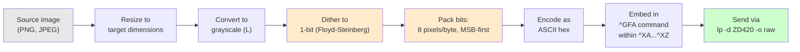

# Printing to a Zebra ZD420 Thermal Label Printer from Linux over USB

This article documents the complete process of connecting a Zebra ZD420-300dpi ZPL thermal label printer to a Linux machine over USB, configuring it through CUPS, and printing both text labels and bitmap images using the ZPL printer language. The ZD420 is a direct-thermal desktop label printer: it has no ink, no toner, and no ribbon. It heats a printhead against heat-sensitive paper to produce black marks. Understanding how to drive it from Linux requires understanding three things: how CUPS discovers and registers USB printers, how ZPL encodes label content, and how bitmap images must be converted to 1-bit packed data before the printer can render them. This article covers all three, with working code.

> [!summary]
> 1. CUPS on modern Linux includes a built-in ZPL driver — no proprietary driver download is needed. Adding the printer requires one `lpadmin` command.
> 2. ZPL (`^GFA`) image fields use 1-bit packed encoding: 8 pixels per byte, MSB-first. Sending one byte per pixel produces a single runaway line of pixels instead of an image.
> 3. The printer's physical label size must be set explicitly in ZPL (`^PW`/`^LL`) because the CUPS PPD defaults do not cover common label dimensions like 4×6 inches.

## Why this note exists

Zebra provides no native Linux driver. Their official recommendation is to use the CUPS driver that ships with most Linux distributions. The CUPS ZPL PPD, however, ships with a set of default label sizes that correspond to small shipping labels — none of which match the common 4×6 inch label stock. The PPD also defaults to 203dpi resolution regardless of the actual printhead, and the `^GFA` graphic field format has a subtle bit-packing convention that, if violated, produces output that looks like a single horizontal line rather than an image. Each of these traps is individually documented in scattered Zebra support articles and StackOverflow answers, but there is no single reference that walks through the entire pipeline from USB detection to rendered bitmap on paper. This article is that reference.

## When to use this approach

Use this approach when:

- You have a Zebra label printer (ZD420, ZD620, ZT411, or any ZPL-speaking model) connected via USB to a Linux machine
- You want to print labels programmatically from scripts, not through a GUI application
- You need to render bitmap images (logos, photos, QR codes) on thermal labels
- You want to understand the ZPL encoding rather than rely on a vendor tool

Do not use this approach when:

- Your printer speaks EPL or CPCL instead of ZPL (different languages, different commands)
- You need bidirectional communication with the printer (reading status, querying media dimensions) — this requires `pyusb` or a `/dev/usb/lp*` device node, which CUPS's USB backend does not expose
- You want to print from graphical applications (LibreOffice, GIMP) — in that case, use CUPS raster mode rather than raw ZPL

## The hardware

The Zebra ZD420 is a direct-thermal desktop label printer. Key specifications for this setup:

| Property | Value |
|----------|-------|
| Model | ZD420-300dpi ZPL |
| Printhead resolution | 300 dots per inch |
| Connection | USB (VID `0a5f`, PID `0122`) |
| Language | ZPL (Zebra Programming Language) |
| Print method | Direct thermal (no ribbon) |
| Label stock in use | 4″ × 6″ gap-notched labels |
| Print width | 4″ = 1200 dots at 300dpi |
| Print length | 6″ = 1800 dots at 300dpi |

The printer has three status LEDs on the front panel: a Status indicator (green/amber/red), a Pause indicator, and a Media indicator. When the Pause indicator is amber (solid orange), the printer is in pause state and will not accept print jobs. Pressing the physical Pause button resumes the printer — the Status LED turns solid green to indicate readiness.

## Phase 1: USB detection and CUPS registration

### Detecting the printer on USB

Linux enumerates USB devices through `lsusb`. The ZD420 identifies itself as:

```
Bus 003 Device 007: ID 0a5f:0122 Zebra Technologies ZTC ZD420-300dpi ZPL
```

CUPS also discovers the printer and constructs a device URI:

```
usb://Zebra%20Technologies/ZTC%20ZD420-300dpi%20ZPL?serial=D2N204100500
```

The device URI encodes the manufacturer, model, and serial number. CUPS uses this URI to route print jobs to the correct USB endpoint. You can verify that CUPS sees the device with:

```bash
lpinfo -v | grep -i usb
```

### Adding the printer to CUPS

CUPS on modern Linux includes a built-in ZPL driver at `drv:///sample.drv/zebra.ppd`. This driver supports ZPL, EPL1, EPL2, and CPCL printers. Adding the ZD420 requires one command:

```bash
sudo lpadmin -p ZD420 \
  -v "usb://Zebra%20Technologies/ZTC%20ZD420-300dpi%20ZPL?serial=D2N204100500" \
  -m drv:///sample.drv/zebra.ppd \
  -E
```

The `-E` flag enables the printer to accept jobs. The `-m` flag specifies the PPD (PostScript Printer Description) file that defines the printer's capabilities and default options. The command produces a deprecation warning ("Printer drivers are deprecated and will stop working in a future version of CUPS") — this warning is cosmetic. CUPS is transitioning to driverless IPP-Everywhere printing, but ZPL printers do not support IPP-Everywhere, so the PPD-based driver remains the working approach.

### Fixing the default resolution

The CUPS ZPL PPD defaults to 203dpi. The ZD420-300dpi has a 300dpi printhead. Printing at the wrong resolution produces misaligned and incorrectly scaled output. Set the correct resolution after adding the printer:

```bash
lpoptions -p ZD420 -o Resolution=300dpi
```

This command writes a user-level preference that overrides the PPD default. Verify it took effect:

```bash
lpoptions -p ZD420 | grep Resolution
# Output includes: Resolution=300dpi
```

### Verifying registration

After adding the printer, verify its state:

```bash
lpstat -p ZD420
# Output: printer ZD420 is idle.  enabled since ...
```

The printer is idle and accepting jobs. It is ready to receive ZPL data.

## Phase 2: Printing text labels with ZPL

### The ZPL language

ZPL (Zebra Programming Language) is a line-oriented command language. Every ZPL label begins with `^XA` (Start of Format) and ends with `^XZ` (End of Format). Between those delimiters, commands specify what to print and where.

The fundamental positioning command is `^FO<x>,<y>` (Field Origin), which sets the cursor position in dots from the top-left corner. Text is rendered with `^A0N,<height>,<width>` (scalable font, normal orientation) followed by `^FD<data>^FS` (Field Data / Field Separator). Boxes are drawn with `^GB<width>,<height>,<thickness>` (Graphic Box).

### A minimal test label

```zpl
^XA
^FO50,50^A0N,50,50^FDHello from Linux!^FS
^FO50,120^A0N,30,30^FDZD420-300dpi Test Label^FS
^FO40,40^GB720,180,3^FS
^XZ
```

This label contains two text fields and a box. The first text field is at position (50, 50) in a 50×50 dot font. The second is at (50, 120) in a 30×30 dot font. The box starts at (40, 40), is 720 dots wide and 180 dots tall, with a 3-dot border thickness.

### Sending ZPL to the printer

CUPS must receive ZPL data as a raw print job. The `-o raw` flag tells CUPS to pass the data directly to the printer without rasterizing it. Without this flag, CUPS would attempt to render the ZPL commands as literal text on the label — you would see `^FO50,50^A0N...` printed as characters rather than interpreted as commands.

```bash
echo -n '^XA^FO50,50^A0N,50,50^FDHello^FS^XZ' | lp -d ZD420 -o raw -
```

Or from a file:

```bash
lp -d ZD420 -o raw label.zpl
```

The job is accepted and sent to the printer. When the queue empties (`lpq -P ZD420` shows "no entries"), the label has been printed.

## Phase 3: Setting label dimensions

### The mismatch between CUPS defaults and physical labels

The CUPS ZPL PPD ships with a set of predefined label sizes in dot units: `w90h18`, `w144h36`, `w288h360`, and so on. The default is `w288h360`, which at 300dpi translates to 0.96″ × 1.20″ — a tiny shipping label. None of the presets correspond to 4″ × 6″ stock.

This mismatch has practical consequences. If you send a ZPL label that assumes a 4″ × 6″ format but CUPS clips it to 288 × 360 dots, most of your content will not appear. The fix is to set the label dimensions explicitly in the ZPL format itself, using two commands:

- `^PW<width>` — Print Width: sets the printable width in dots
- `^LL<length>` — Label Length: sets the label length in dots

For a 4″ × 6″ label at 300dpi:

```zpl
^XA
^PW1200
^LL1800
^FO50,50^A0N,50,50^FD4x6 Label^FS
^XZ
```

These commands override the CUPS media size for the duration of this label format. They are per-format, not persistent — each label that needs 4×6 dimensions must include them.

You can also set the CUPS media option to match:

```bash
lpoptions -p ZD420 -o media=Custom.4x6in
```

But for raw ZPL printing, the `^PW` and `^LL` commands are the authoritative source. CUPS media settings matter more when printing through the CUPS raster pipeline (from graphical applications) than when sending raw ZPL.

## Phase 4: Printing bitmap images

This is where most of the subtle encoding issues arise. A thermal printer produces black dots or white space. There are no gray levels, no color channels, no anti-aliasing. Every pixel in the image must be reduced to a single binary decision: print a dot, or do not print a dot. Getting a recognizable image out of this constraint requires dithering, and getting the dithered data into ZPL requires correct bit packing.

### The ZPL ^GFA command

The `^GFA` (Graphic Field — ASCII hex) command embeds a bitmap image in a ZPL label. Its syntax is:

```
^GFA,<total_bytes>,<total_bytes>,<bytes_per_row>,<hex_data>
```

The parameters:

- **total_bytes**: the total number of bytes in the image data
- **bytes_per_row**: the number of bytes required to encode one row of pixels
- **hex_data**: the image data, encoded as ASCII hexadecimal characters

The critical parameter is `bytes_per_row`. ZPL encodes image data as 1-bit packed: each byte contains 8 pixels, with the most significant bit (bit 7) representing the leftmost pixel in the group. A black pixel is encoded as a 1 bit; a white pixel is encoded as a 0 bit. For an image that is 800 pixels wide, one row requires `(800 + 7) // 8 = 100` bytes.

### The encoding bug that produces a single line

If you encode an 800-pixel-wide image using one byte per pixel (a natural approach for grayscale data), you set `bytes_per_row = 800`. The printer interprets those 800 bytes as 6,400 pixels per row (800 bytes × 8 bits). The image data that was supposed to span 800 columns now wraps across 6,400 columns, and each row of source pixels bleeds far to the right. The visible result is a single horizontal line at the top of the label — the first row of pixels, stretched across the entire label width — followed by empty space.

This is the most common error when first printing images to a Zebra printer. The fix is to pack the bits correctly: 8 pixels per byte, MSB-first.

### Correct 1-bit packing algorithm

The algorithm converts a grayscale or color image to 1-bit (black/white) data, then packs the bits into bytes. Floyd-Steinberg dithering distributes quantization error across neighboring pixels, producing a result that approximates grayscale shading through dot density variation.

```python
from PIL import Image

img = Image.open("photo.png").convert("L")  # grayscale
img = img.resize((800, 800), Image.LANCZOS)
img_1bit = img.convert("1", dither=Image.FLOYDSTEINBERG)  # dither to 1-bit

pixels = img_1bit.load()
img_width, img_height = img_1bit.size
bytes_per_row = (img_width + 7) // 8

hex_rows = []
for y in range(img_height):
    row_bytes = bytearray(bytes_per_row)
    for x in range(img_width):
        if pixels[x, y] == 0:  # black pixel
            byte_idx = x // 8
            bit_idx = 7 - (x % 8)  # MSB first
            row_bytes[byte_idx] |= (1 << bit_idx)
    hex_rows.append(row_bytes.hex())

hex_data = "".join(hex_rows)
total_bytes = bytes_per_row * img_height
```

The bit-index calculation `7 - (x % 8)` ensures that the leftmost pixel in each group of 8 corresponds to the most significant bit (bit 7) of the byte. This is ZPL's convention: bit 7 of the first byte in a row represents column 0, bit 6 represents column 1, and so on. If you reverse this convention (LSB-first), the image will appear horizontally mirrored within each 8-pixel group.

### Assembling the complete ZPL label with an image

```python
LABEL_W = 1200  # 4" at 300dpi
LABEL_H = 1800  # 6" at 300dpi
IMG_W = 800
IMG_H = 800
img_x = (LABEL_W - IMG_W) // 2  # centered horizontally
img_y = 200                      # top margin

zpl = f"""^XA
^PW{LABEL_W}
^LL{LABEL_H}
^FO{img_x},{img_y}^GFA,{total_bytes},{total_bytes},{bytes_per_row},{hex_data}
^FO100,1080^A0N,40,40^FDCat Portrait - Classic Tabby^FS
^FO40,40^GB{LABEL_W-80},{LABEL_H-80},3^FS
^XZ"""
```

The `^FO` before `^GFA` positions the image on the label. The `^PW` and `^LL` commands establish the label dimensions. The `^GB` command draws a border. The `^FD` field adds a text caption below the image.

### Sending to the printer

```bash
lp -d ZD420 -o raw cat-portrait.zpl
```

The printer receives the ZPL, interprets the graphic field, dithered bitmap and all, and prints the image. On 300dpi thermal paper, a Floyd-Steinberg-dithered photograph produces a recognizable rendering with visible tonal gradation — not photographic quality, but clearly identifiable.

## Architecture: the full data pipeline

The path from a source image to a printed label passes through five stages. Each stage transforms the data in a specific way, and errors at any stage produce visible artifacts on the label.



The two yellow stages — dithering and bit packing — are where errors most commonly occur. The dithering stage determines image quality: without it, a grayscale photograph reduces to harsh binary thresholds that lose all tonal detail. The bit-packing stage determines whether the image renders at all: a `bytes_per_row` mismatch of even 1 byte causes the entire image to shift and collapse.

## Common failure modes

| Symptom | Cause | Fix |
|---------|-------|-----|
| ZPL commands print as literal text on the label | Missing `-o raw` flag; CUPS rasterizes the ZPL | Use `lp -d ZD420 -o raw` |
| Single horizontal line instead of image | `bytes_per_row` set to pixel width instead of packed byte count | Use `(width + 7) // 8` for `bytes_per_row` |
| Image appears horizontally scrambled in 8-pixel columns | LSB-first bit order instead of MSB-first | Use `bit_idx = 7 - (x % 8)` |
| Image is dark and muddy, no tonal variation | No dithering; simple threshold applied | Use `img.convert("1", dither=Image.FLOYDSTEINBERG)` |
| Label content is cut off or misaligned | Wrong resolution (203dpi default instead of 300dpi) | Set `lpoptions -p ZD420 -o Resolution=300dpi` |
| Label is tiny, content compressed into corner | CUPS media size is `w288h360` instead of actual label size | Set `^PW1200` and `^LL1800` in ZPL, or set CUPS `media=Custom.4x6in` |
| Printer shows orange LED, does not print | Printer is in Pause state | Press the physical Pause button on the printer |
| `sudo lpadmin` fails with password prompt | Agent/script context has no terminal for password input | Run the command in a real terminal |

## The reusable converter script

The following script converts any image file to a ZPL label. It handles resizing, dithering, bit packing, and positioning. It can write a `.zpl` file or send directly to the printer via CUPS.

```bash
# Print a cat portrait directly
./05-image-to-zpl.py classic-tabby.png --print --title "Classic Tabby"

# Generate a ZPL file for later printing
./05-image-to-zpl.py photo.jpg --border --title "My Photo" -o label.zpl

# Fill the entire label with the image (no margins)
./05-image-to-zpl.py qr-code.png --fill --print
```

Key implementation details of the script:

- **Scale-to-fit**: the image is scaled to the largest size that fits within the label area (minus margins), preserving aspect ratio. This prevents distortion.
- **Floyd-Steinberg dithering**: the `convert("1", dither=Image.FLOYDSTEINBERG)` call distributes quantization error to neighboring pixels, producing natural-looking dot patterns instead of harsh threshold bands.
- **MSB-first packing**: each row of 1-bit pixels is packed into bytes with the leftmost pixel at the most significant bit position. This matches ZPL's convention.
- **Custom label dimensions**: `^PW` and `^LL` are set in the ZPL output, independent of CUPS defaults.

## Working rules

These are the rules derived from this setup that apply to any Zebra ZPL printer on Linux:

1. **Always send ZPL with `-o raw`.** Without it, CUPS rasterizes the ZPL commands as text and you get literal `^FO50,50...` on the label.
2. **Always verify the resolution.** The CUPS PPD defaults to 203dpi regardless of the printer model. Set it explicitly with `lpoptions`.
3. **Always set label dimensions in ZPL.** Do not rely on CUPS media size defaults — they are almost certainly wrong for your label stock. Use `^PW` and `^LL` in every label format.
4. **Pack image bits correctly.** `bytes_per_row = (width + 7) // 8`. Each byte holds 8 pixels. MSB = leftmost pixel. This is non-negotiable.
5. **Dither before packing.** A direct grayscale-to-binary threshold produces unusable images on thermal paper. Floyd-Steinberg dithering is the minimum.
6. **Unpause the printer before printing.** An amber (orange) Pause LED means the printer will queue but not process jobs. Press the physical Pause button to resume.

## Open questions

- **Bidirectional communication**: CUPS's USB backend claims the printer exclusively, preventing direct USB reads for SGD (Set-Get-Do) status queries. Installing `pyusb` would enable direct endpoint communication, but requires detaching the kernel driver. An alternative is to stop the CUPS backend temporarily and access the USB device directly.
- **ZPL compression**: The `^GFB` (byte run-length encoding) and `^GFC` (compressed ASCII hex) formats can reduce the 1-bit hex data size significantly. For a 800×800 image, `^GFA` produces ~160KB of hex; `^GFB` with run-length encoding could reduce this by 50-80% depending on image content.
- **Darkness calibration**: The default darkness setting produces legible but somewhat light output. Higher darkness values (10-15 range on the ZD420) produce bolder dots that may improve dithered image quality at the cost of slower printing and potential ink bleeding on marginal label stock.

## Near-term next steps

- Install `pyusb` and build bidirectional SGD query support for reading media dimensions and printer status programmatically
- Implement `^GFB` run-length encoding in the image-to-ZPL converter for faster data transmission
- Build a label template library (shipping labels, barcode labels, product tags) as reusable ZPL snippets
- Calibrate darkness and print speed settings for optimal dithered image quality
- Print the cat portrait contact sheet (all 17 portraits on one label) as a stress test of the pipeline

## Important project docs

- Ticket workspace: `/home/manuel/code/wesen/claw-stuff/ttmp/2026/05/22/ZD420-LINUX--connect-and-print-to-zebra-zd420-printer-from-linux-over-usb/`
- Implementation diary: `reference/01-diary.md` in the ticket workspace
- Image-to-ZPL converter: `scripts/05-image-to-zpl.py` in the ticket workspace
- Source documents: `sources/` directory in the ticket workspace (9 archived articles from Zebra support, GitHub, and StackOverflow)

## Related notes

- [[ARTICLE - Playbook - Self-Contained Go Wasm and JavaScript Browser Applications]] — another article about bridging a Go-based system to a different runtime environment
