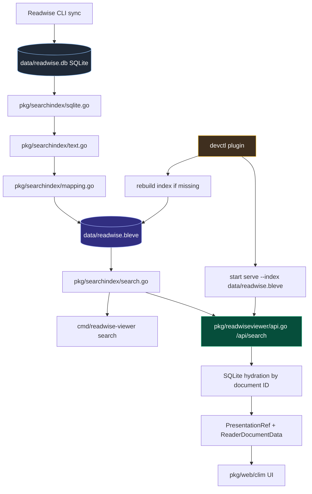
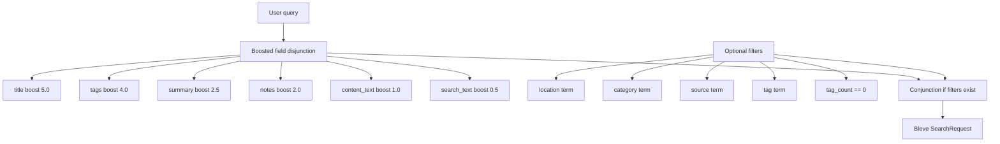

# Readwise Viewer Bleve Search Port

This report explains the Bleve search implementation in Readwise Viewer as it stands after the BM25 cutover. The purpose is not only to record that search was added, but to explain the shape of the system: how documents move from SQLite into a derived Bleve index, how text is normalized before indexing, how queries are constructed, how search results are hydrated back into canonical document records, and how the CLI, API, CLIM interface, and `devctl` workflow use the same search path.

The final design is deliberately simple. SQLite remains the canonical store for Readwise Reader data. Bleve is a derived index that can be deleted and rebuilt. Search is now Bleve-only: the old SQLite FTS5 table, triggers, build tags, CLI branch, and API compatibility path were removed. The system has one full-text search path, one index format, and one operational expectation: rebuild `data/readwise.bleve` from `data/readwise.db` whenever the local Reader database changes.

> [!summary]
> Readwise Viewer now uses a disposable Bleve v2 BM25 index derived from SQLite. Index rebuilds read canonical rows from `documents` and `document_tags`, normalize body text from `content` or `html_content`, build a `SearchDocument`, and write a text-only Bleve index. Runtime search uses boosted field queries, hydrates hits back through SQLite, exposes snippets and scores through the API, renders them in the CLIM UI, and can be started/restarted through `devctl`.

## Why this work happened

Readwise Viewer started with a SQLite FTS5 search path. That path was useful for proving that local search could work, but it was limited in three ways. First, it searched only a subset of metadata fields: title, author, site name, summary, source URL, and notes. It did not search full article content, cleaned HTML content, or tags as first-class index fields. Second, it coupled search ranking to the SQLite schema and to the `documents_fts` virtual table. Third, it created a split future: FTS5 for current search, Bleve for future search, and vector search somewhere later.

The port to Bleve resolved that split by making Bleve the only full-text search backend. The first implementation was text-only BM25. It does not generate embeddings. It does not create vector fields. It does not run a semantic model. It creates the lexical search foundation that vector and hybrid retrieval can later build on.

That decision matters because search quality work has two separate concerns:

- The retrieval system must know which documents contain the words, names, tags, and technical terms in the query.
- The application must have an index lifecycle that can be rebuilt, inspected, started, tested, and debugged without depending on the UI.

The Bleve port addresses both concerns. BM25 provides lexical retrieval over rich text fields, and the new `pkg/searchindex` package provides a clean lifecycle around a derived search artifact.

## The final architecture

The search architecture has four layers. SQLite owns the data. `pkg/searchindex` owns indexing and retrieval. `pkg/readwiseviewer` owns HTTP API hydration and presentation envelopes. The CLI and CLIM UI call the same search path.



The important boundary is between SQLite and Bleve. SQLite is canonical. Bleve is derived. If Bleve contains a document ID that SQLite no longer contains, the API treats that as a stale-index error and asks for a rebuild. If the index is missing, CLI search and server startup fail with a direct rebuild instruction.

The current default paths are:

```text
SQLite database: data/readwise.db
Bleve index:     data/readwise.bleve
HTTP server:     http://127.0.0.1:8771
```

The main user commands are:

```bash
readwise-viewer index rebuild --db data/readwise.db --index data/readwise.bleve
readwise-viewer index stats --index data/readwise.bleve
readwise-viewer search --q "sqlite datasette" --index data/readwise.bleve
readwise-viewer serve --db data/readwise.db --index data/readwise.bleve --port 8771
```

The `devctl` workflow wraps the same commands:

```bash
devctl up --force
devctl restart readwise-viewer
devctl logs --service readwise-viewer --follow
devctl rebuild-index
devctl smoke-search sqlite
devctl down
```

## SQLite remains canonical

The sync script `scripts/01-sync-to-sqlite.py` populates the local database from Readwise Reader. The important tables for search are `documents` and `document_tags`. The `documents` table stores the Readwise document metadata, the summary, notes, source URL, Reader URL, sync metadata, raw JSON, and optionally full `content` and `html_content`. The `document_tags` table stores tag keys associated with each document.

Before the cutover, the sync script also created a `documents_fts` FTS5 virtual table and triggers that kept the FTS table synchronized. Those artifacts were removed during the cutover. The schema setup now drops the old FTS triggers and table:

```sql
DROP TRIGGER IF EXISTS documents_ai;
DROP TRIGGER IF EXISTS documents_ad;
DROP TRIGGER IF EXISTS documents_au;
DROP TABLE IF EXISTS documents_fts;
```

This is a clean break. There is no hidden compatibility branch that still depends on FTS5. The `documents` command lists and filters documents. The `search` command searches. That separation is now enforced in code: `DocumentFilters` no longer has a `Query` field, and the old `documents --q` surface was removed.

The search indexer reads from SQLite with a query shaped around indexing rather than display. The display model `ReaderDocument` is not used as the index payload because it contains `sql.Null*` fields and does not include full article content. Instead, `pkg/searchindex/sqlite.go` reads an `IndexRow` with the fields needed for indexing:

```sql
SELECT
  d.id,
  d.title,
  d.author,
  d.source,
  d.category,
  d.location,
  d.site_name,
  d.word_count,
  d.summary,
  d.source_url,
  d.notes,
  d.saved_at,
  d.updated_at,
  d.content,
  d.html_content,
  COALESCE(GROUP_CONCAT(dt.tag_key, ','), '') AS tag_keys
FROM documents d
LEFT JOIN document_tags dt ON dt.document_id = d.id
WHERE d.is_deleted = 0
GROUP BY d.id
ORDER BY d.saved_at DESC;
```

The query does three important things. It excludes deleted documents. It joins tags into a comma-separated key list. It reads both plain content and HTML content so the indexer can choose the best body text for each document.

## The index document

The Bleve index does not store raw SQLite rows. It stores `SearchDocument`, a normalized JSON-shaped document defined in `pkg/searchindex/doc.go`.

```go
type SearchDocument struct {
    ID          string   `json:"id"`
    Title       string   `json:"title"`
    Author      string   `json:"author"`
    SiteName    string   `json:"site_name"`
    Source      string   `json:"source"`
    SourceURL   string   `json:"source_url"`
    Category    string   `json:"category"`
    Location    string   `json:"location"`
    Tags        []string `json:"tags"`
    TagCount    int      `json:"tag_count"`
    Summary     string   `json:"summary"`
    Notes       string   `json:"notes"`
    ContentText string   `json:"content_text"`
    SearchText  string   `json:"search_text"`
    SavedAt     string   `json:"saved_at"`
    UpdatedAt   string   `json:"updated_at"`
    WordCount   int64    `json:"word_count"`
    ReaderURL   string   `json:"reader_url"`
}
```

This type is the contract between SQLite extraction and Bleve indexing. It removes `sql.NullString` and `sql.NullInt64` from the search layer. It turns tags into a string slice. It adds `TagCount` so the `untagged` filter can be expressed as a numeric range query. It stores both `ContentText`, the chosen body text, and `SearchText`, the structured concatenation used as a low-boost fallback field.

The conversion happens in `SearchDocumentFromRow`. That function is small, but it encodes several design decisions:

```go
func SearchDocumentFromRow(row IndexRow, cfg TextConfig) SearchDocument {
    cfg = cfg.withDefaults()
    tags := splitTags(row.TagKeys)
    contentText := chooseContentText(row, cfg)

    doc := SearchDocument{
        ID:          row.ID,
        Title:       nullString(row.Title),
        Author:      nullString(row.Author),
        SiteName:    nullString(row.SiteName),
        Source:      nullString(row.Source),
        SourceURL:   nullString(row.SourceURL),
        Category:    nullString(row.Category),
        Location:    nullString(row.Location),
        Tags:        tags,
        TagCount:    len(tags),
        Summary:     nullString(row.Summary),
        Notes:       nullString(row.Notes),
        ContentText: contentText,
        SavedAt:     nullString(row.SavedAt),
        UpdatedAt:   nullString(row.UpdatedAt),
        WordCount:   nullInt64(row.WordCount),
    }
    doc.ReaderURL = readerURL(doc.ID)
    doc.SearchText = buildSearchText(doc, cfg)
    return doc
}
```

The conversion step is where the system stops thinking in SQL rows and starts thinking in search documents. That separation keeps future changes local. If Readwise adds another field, the SQLite reader and converter can decide whether it belongs in search. If the API presentation changes, the index document does not need to change unless search needs the field.

## Text extraction

The indexer chooses document body text with a fixed priority order:

1. Use `content` if it is present.
2. Otherwise strip and use `html_content` if it is present.
3. Otherwise use `summary`.
4. Otherwise use `notes`.
5. Otherwise fall back to `title + source_url`.

This logic lives in `chooseContentText`:

```go
func chooseContentText(row IndexRow, cfg TextConfig) string {
    if s := strings.TrimSpace(nullString(row.Content)); s != "" {
        return truncateRunes(collapseWhitespace(s), cfg.MaxContentRunes)
    }
    if s := strings.TrimSpace(nullString(row.HTMLContent)); s != "" {
        return truncateRunes(HTMLToText(s), cfg.MaxContentRunes)
    }
    if s := strings.TrimSpace(nullString(row.Summary)); s != "" {
        return truncateRunes(collapseWhitespace(s), cfg.MaxContentRunes)
    }
    if s := strings.TrimSpace(nullString(row.Notes)); s != "" {
        return truncateRunes(collapseWhitespace(s), cfg.MaxContentRunes)
    }
    fallback := strings.TrimSpace(strings.Join([]string{nullString(row.Title), nullString(row.SourceURL)}, " "))
    return truncateRunes(collapseWhitespace(fallback), cfg.MaxContentRunes)
}
```

This order is important. Readwise documents may have clean text content, HTML content, both, or neither. The indexer prefers clean text because it has fewer artifacts. HTML content is still valuable, but it must be parsed into text first. Summary and notes are fallback sources, not replacements for body content.

HTML stripping uses `golang.org/x/net/html`. The parser walks the tree, skips `script`, `style`, `noscript`, and `svg`, inserts spacing around block-level elements, and collapses whitespace at the end. The implementation is intentionally conservative. It does not try to preserve exact visual layout. Its purpose is to produce searchable text with stable word boundaries.

The indexer also enforces length limits:

```text
DefaultMaxContentRunes = 50,000
DefaultMaxSearchRunes  = 100,000
```

These limits prevent very long documents from producing oversized stored fields and slow indexing runs. The exact values are not a search-quality claim. They are operational defaults that keep the local index practical.

## Structured search text

`SearchText` is a structured concatenation of metadata and body text. It is not the primary ranking field anymore, but it is still useful as a low-boost fallback that lets the query match across the whole document representation.

The generated text has this shape:

```text
Title: <title>
Author: <author>
Source: <site_name or source>
Category: <category>
Location: <location>
Tags: <tag1>, <tag2>
Summary: <summary>
Notes: <notes>
URL: <source_url>
Content: <content_text>
```

The key point is that `SearchText` carries field labels as text. That gives Bleve a single catch-all field that includes all important searchable context. The boosted query still searches individual fields, but `SearchText` remains a useful safety net for cases where a term appears in an unusual part of the document representation.

## Bleve mapping

The text index mapping is defined in `pkg/searchindex/mapping.go`. It uses Bleve v2. Text fields are stored, indexed, included in `_all`, and include term vectors so highlighting works. Keyword fields are stored and indexed but not included in `_all`. Numeric fields support exact/range filters.

The mapped fields are:

| Field | Mapping role | Purpose |
|---|---|---|
| `id` | keyword | stable document identity |
| `title` | text | high-boost title search and highlighting |
| `author` | text | author name search |
| `site_name` | text | source/site name search |
| `source` | keyword | exact source filter |
| `source_url` | text | URL/domain/path search |
| `category` | keyword | exact category filter |
| `location` | keyword | exact Reader location filter |
| `tags` | keyword | exact tag search/filter |
| `tag_count` | numeric | untagged filter |
| `summary` | text | medium-boost summary search and highlighting |
| `notes` | text | medium-boost note search |
| `content_text` | text | body search and highlighting |
| `search_text` | text | low-boost catch-all search |
| `saved_at` | keyword | stored metadata |
| `updated_at` | keyword | stored metadata |
| `word_count` | numeric | stored metadata |
| `reader_url` | keyword | link back to Readwise Reader |

The mapping is text-only. Bleve v2 includes vector-search code paths in the module dependency graph, and `github.com/blevesearch/go-faiss` appears in `go.mod` through Bleve. Normal builds do not compile the FAISS package unless vector-tagged code paths are used. The current implementation does not create vector mappings or run embeddings.

## Rebuilding the index

The rebuild path is in `pkg/searchindex/indexer.go`. It is a full rebuild, not an incremental updater. That choice is correct for the current corpus size and for the role of Bleve as a disposable artifact. During testing, rebuilding the local corpus of 13,848 documents completed successfully in a few seconds after the v2 cutover.

The rebuild algorithm is:

```text
function Rebuild(db, indexPath):
    tmpPath = indexPath + ".tmp"
    backupPath = indexPath + ".old"

    remove tmpPath
    remove backupPath

    idx = bleve.New(tmpPath, NewTextMapping())
    rows = ReadIndexRows(db)

    batch = idx.NewBatch()
    for row in rows:
        doc = SearchDocumentFromRow(row)
        batch.Index(doc.ID, doc)
        if batch.Size() >= batchSize:
            idx.Batch(batch)
            batch = idx.NewBatch()

    if batch has documents:
        idx.Batch(batch)

    idx.Close()

    if indexPath exists:
        rename indexPath to backupPath
    rename tmpPath to indexPath
    remove backupPath
```

The temporary path matters. The indexer does not write into the live index directory. It builds a complete new index under `data/readwise.bleve.tmp`, closes it, and then renames it into place. If an old index exists, it is moved to `.old` first so the replacement can roll back if the final rename fails.

The implementation is local and direct:

```go
tmpPath := cfg.IndexPath + ".tmp"
backupPath := cfg.IndexPath + ".old"
_ = os.RemoveAll(tmpPath)
_ = os.RemoveAll(backupPath)

idx, err := bleve.New(tmpPath, NewTextMapping())
...
if pathExists(cfg.IndexPath) {
    if err := os.Rename(cfg.IndexPath, backupPath); err != nil { ... }
}
if err := os.Rename(tmpPath, cfg.IndexPath); err != nil {
    if pathExists(backupPath) {
        _ = os.Rename(backupPath, cfg.IndexPath)
    }
    return errors.Wrapf(err, "replace index %s", cfg.IndexPath)
}
_ = os.RemoveAll(backupPath)
```

This is not a distributed index protocol. It is a local rebuild operation. That simplicity is an advantage. The application can always recover by rebuilding from SQLite.

## Search query construction

The first Bleve implementation searched only `search_text`. That worked, but it treated every occurrence as if it came from the same field. A term in a title and a term in body text should not have the same ranking effect. The current implementation uses a boosted disjunction across several fields:

```go
func BuildBoostedTextQuery(q string) query.Query {
    fields := []struct {
        name  string
        boost float64
    }{
        {name: "title", boost: 5.0},
        {name: "tags", boost: 4.0},
        {name: "summary", boost: 2.5},
        {name: "notes", boost: 2.0},
        {name: "content_text", boost: 1.0},
        {name: "search_text", boost: 0.5},
    }
    queries := make([]query.Query, 0, len(fields))
    for _, field := range fields {
        mq := bleve.NewMatchQuery(q)
        mq.SetField(field.name)
        mq.SetBoost(field.boost)
        queries = append(queries, mq)
    }
    return bleve.NewDisjunctionQuery(queries...)
}
```

The query is a disjunction because a document should match if any of the fields match. The boosts determine how much each field contributes to the score. Title and tags are highest because they are concise, user-visible labels. Summary and notes are medium because they often contain curated descriptions. Body content is lower because it is longer and can contain incidental mentions. `search_text` is lowest because it is a broad fallback field.

Filters are then added as a conjunction. The text query defines the lexical match. The filter query narrows the result set by exact metadata constraints:

```go
func BuildTextQuery(q string, filters SearchFilters) (query.Query, error) {
    q = strings.TrimSpace(q)
    if q == "" {
        return nil, errors.New("search query is required")
    }

    textQ := BuildBoostedTextQuery(q)
    filterQ := BuildFilterQuery(filters)
    if filterQ == nil {
        return textQ, nil
    }
    return bleve.NewConjunctionQuery(textQ, filterQ), nil
}
```

The resulting structure is:



This gives the system a clear ranking rule that can be tuned later. If manual relevance review shows that content matches are too weak or tags are too strong, the numbers are localized in one function.

## Search execution

`Search` opens the configured Bleve index, builds the query, requests stored fields, enables highlighting, and converts Bleve hits into `SearchResponse`.

The execution path is:

```go
idx, err := bleve.Open(cfg.IndexPath)
...
q, err := BuildTextQuery(cfg.Query, cfg.Filters)
...
req := bleve.NewSearchRequest(q)
req.Size = cfg.Limit
req.From = cfg.Offset
req.Fields = []string{"id", "title", "site_name", "source", "category", "location", "summary", "reader_url", "tags", "tag_count"}
if cfg.Highlight {
    req.Highlight = bleve.NewHighlight()
    req.Highlight.AddField("title")
    req.Highlight.AddField("summary")
    req.Highlight.AddField("content_text")
    req.Highlight.AddField("search_text")
}

result, err := idx.SearchInContext(ctx, req)
```

The selected fields are enough for CLI rendering. The API does not trust those fields as canonical display data. It uses the hit ID to hydrate a fresh `ReaderDocument` from SQLite, then attaches search metadata.

The search response includes:

```go
type SearchHit struct {
    ID        string
    Score     float64
    Fields    map[string]any
    Fragments map[string][]string
}
```

The fragments are used to create the snippet. `FirstFragment` chooses the first useful fragment in this order:

```text
title → summary → content_text → search_text
```

That order makes short, user-visible matches preferable to body snippets. If the title matched, the snippet should usually be the title. If the title did not match but the summary did, the summary fragment is a better UI snippet than a long body fragment.

## CLI search

The CLI search command is now Bleve-only. It no longer accepts `--backend`, and it no longer opens SQLite. Its inputs are the query, index path, limit, offset, and highlight setting:

```bash
readwise-viewer search --q sqlite --index data/readwise.bleve --limit 5
```

The command calls `searchindex.Search` and emits rows with score, snippet, metadata, Reader URL, tags, and tag count. This makes CLI search a direct diagnostic tool for the index. If the CLI returns no results, the issue is in the index or query construction. If CLI search works but the UI does not, the issue is in the API or frontend routing.

That diagnostic boundary was useful immediately. A later UI bug made CLIM `SEARCH datasette` return the full corpus. The CLI and `/api/search` were working; the frontend thunk was still calling `/api/documents?q=...`. The fix was to route `filters.q` to `api.search` instead of `api.documents`.

## API search and hydration

The HTTP endpoint `/api/search` always uses Bleve. It no longer accepts `backend=...` or `index=...` query parameters. The index path is server configuration, supplied by `serve --index`.

The handler performs these steps:

```text
HandleSearch(request):
    query = request.query["q"]
    reject if query is empty
    reject if backend or index query params are present

    call searchindex.Search(indexPath, query, filters, limit, offset)
    for each hit:
        doc = GetDocument(sqliteDB, hit.ID)
        data = readerDocumentData(doc)
        data.searchBackend = "bleve-text"
        data.searchScore = hit.Score
        data.searchSnippet = first highlight fragment
        data.searchHighlights = all fragments
        wrap in ItemWrapper with PresentationRef

    return PaginatedResponse
```

The hydration step is the critical design point. Bleve retrieves IDs and ranking metadata. SQLite supplies canonical document data. This means display fields, presentation labels, tag counts, source URLs, and Reader links remain consistent with the database. If Bleve is stale, the API notices when `GetDocument` fails for a hit ID.

The handler logs search requests and results:

```text
search request q="datasette" limit=50 offset=0 index=data/readwise.bleve
search results q="datasette" total=165 hits=50 duration=8ms
```

Those logs make three debugging questions answerable from `devctl logs`:

- Did the frontend call `/api/search` at all?
- Which index path did the server use?
- How many total hits did Bleve return?

## CLIM integration

The CLIM UI has two document loading paths:

- listing/filtering through `/api/documents`
- full-text search through `/api/search`

After the cutover, a bug remained in the shared frontend thunk. The parser correctly recognized `SEARCH <query>`, but the thunk still sent `{ q: query }` to the document-list endpoint. Since `/api/documents` no longer searches, the UI showed the full document count for every query. The fix was a small but important branch in `pkg/web/clim/actions.ts`:

```ts
const f = filters ?? store.getState().documents.filters
const o = offset ?? store.getState().documents.page.offset
const resp = f.q
  ? await api.search(f.q, 50, o)
  : await api.documents(f, 50, o)
dispatch(actions.loadDocumentsSuccess(resp))
```

This preserves the existing Redux flow. Search results are still loaded into the documents view. Pagination still uses the stored filters. The only change is the endpoint selection.

The UI now renders search metadata when it is present. A search result row shows a `match:` snippet instead of only the document summary, and it shows the score with three decimal places. The detail view includes a Search section with the score and snippet. This is not a ranking debugger, but it gives the user visible evidence that the result came from search rather than from a plain document list.

## Devctl support

The project now includes a repo-local `devctl` plugin:

```text
.devctl.yaml
devctl/readwise_viewer_plugin.py
```

The plugin implements the NDJSON stdio protocol v2 operations:

- `config.mutate`
- `validate.run`
- `launch.plan`
- `command.run`

The launch plan starts one supervised service named `readwise-viewer`. If `data/readwise.bleve` is missing, the service wrapper rebuilds it before starting the server. The health check is `/api/health`.

```mermaid
flowchart TD
    A[devctl up --force] --> B[plugin config.mutate]
    B --> C[plugin validate.run]
    C --> D[plugin launch.plan]
    D --> E[supervised service shell]
    E --> F{data/readwise.bleve exists?}
    F -- no --> G[readwise-viewer index rebuild]
    F -- yes --> H[start server]
    G --> H
    H --> I[/api/health]
    I --> J[devctl marks service healthy]
```

The normal workflow is:

```bash
devctl up --force
devctl status
devctl logs --service readwise-viewer --follow
devctl restart readwise-viewer
devctl down
```

The plugin also exposes helper commands:

```bash
devctl rebuild-index
devctl index-stats
devctl smoke-search sqlite
```

This closes the operational loop. A developer no longer has to remember the exact `go run` command for the server, the index path, the port, or the rebuild command. Those details live in the plugin and remain visible through `devctl plan`.

## Failure modes and current safeguards

The search system is now simpler, but it still has failure modes. The important part is that each failure has a clear boundary.

| Failure | Where it appears | Current behavior |
|---|---|---|
| Missing SQLite DB | `OpenDB` or devctl validation | error telling the user to sync data first |
| Missing Bleve index | CLI search, stats, serve startup | error with rebuild command |
| Stale Bleve hit ID | API hydration | error saying the index references a missing SQLite document |
| Old API params | `/api/search?backend=...` or `index=...` | HTTP 400 with clean-cutover message |
| UI search routing bug | CLIM documents view | fixed by routing `filters.q` to `/api/search` |
| Stale frontend bundle | `make check-web` | fails if `pkg/web/clim/app.js` differs after rebuild |

The missing-index behavior is intentionally direct. `serve` validates the index before it starts. If the index is absent and the user starts through `devctl`, the service wrapper rebuilds it. If the user starts directly with `readwise-viewer serve`, the server fails fast. Both behaviors are useful: devctl is convenient for development, while direct commands expose configuration errors clearly.

## What changed from FTS5

The previous FTS5 implementation was embedded in SQLite. The search query lived inside `ListDocuments`, and the sync script maintained a virtual FTS table through triggers. That model made search feel like a document filter. The Bleve implementation makes search a separate retrieval operation.

| Concern | FTS5 version | Bleve version |
|---|---|---|
| Search storage | SQLite virtual table `documents_fts` | directory index `data/readwise.bleve` |
| Search update | triggers on `documents` | explicit full rebuild |
| Search fields | metadata subset | title, tags, summary, notes, body, structured text |
| Full content | not indexed | indexed through `content` or stripped `html_content` |
| Build tags | required `sqlite_fts5` | no FTS5 tags needed |
| API behavior | `/api/search` delegated to `ListDocuments` | `/api/search` calls Bleve and hydrates SQLite |
| CLI behavior | backend branch between FTS5 and Bleve | Bleve-only search command |
| UI behavior | initially routed `q` to documents endpoint | `SEARCH` routes to `/api/search` |

The most important conceptual change is that search is no longer a filter on listing. Listing answers “which documents satisfy these metadata constraints?” Search answers “which indexed documents match this text query, and how should they be ranked?” Both return document presentations, but they are different operations.

## Tests and validation

The implementation has tests at several levels.

`pkg/searchindex` tests cover:

- HTML-to-text cleanup
- `SearchDocumentFromRow`
- content fallback behavior
- text truncation
- boosted query construction
- filter query construction
- temporary Bleve index search
- untagged filtering through `tag_count`

`pkg/readwiseviewer/api_test.go` covers:

- `/api/search` uses the configured Bleve index
- API search returns the expected document
- API search attaches `searchBackend` and `searchScore`
- removed compatibility parameters are rejected

The web checks cover:

- CLIM command parser tests
- TypeScript no-emit checking
- Bun bundle rebuild
- generated bundle freshness

The practical validation commands are:

```bash
go test ./...
make check-web
make build
devctl up --force
curl -fsS 'http://127.0.0.1:8771/api/search?q=sqlite&limit=1' | jq
```

Manual query examples showed that results now come from Bleve and that the UI route matters. For example, after the CLIM routing fix, `SEARCH datasette` returns a finite search result set rather than the full document count, and `SEARCH foobar` no longer returns the full corpus.

## Current working rules

The implementation now has a clear set of working rules:

- SQLite is canonical. Do not treat stored Bleve fields as canonical document data in the API.
- Bleve is disposable. If search behaves strangely, rebuild the index before investigating deeper.
- Search is not listing. Full-text queries go to `/api/search`, not `/api/documents`.
- The server owns the index path. API clients do not pass arbitrary `index=...` query parameters.
- The UI should show evidence of search. Snippets and scores are part of the result display.
- The generated CLIM bundle is committed. Run `make check-web` after changing TypeScript or CSS.
- Development startup should use `devctl` unless there is a reason to run commands manually.

These rules are more valuable than the current boost values. Boosts can be tuned. The boundaries should remain stable.

## What remains

The next useful step is not another backend. The next useful step is relevance work. The current boosts are reasonable defaults, but they are not derived from a labeled relevance set. A small query set should be collected and used to decide whether title, tag, summary, note, body, and catch-all weights need adjustment.

The second useful step is index freshness metadata. The current index can be rebuilt and counted, but it does not store the SQLite sync time or max document update time. Adding metadata would let the server report whether the index is older than the database.

The third useful step is richer highlight rendering. The API returns fragments that contain `<mark>` tags from Bleve. The current CLIM renderer escapes snippets for safety, so the mark tags appear as text if used directly. A future renderer can sanitize and render allowed mark tags so highlighted matches are visually distinct.

The current system is complete enough to use. It has a single search backend, a rebuild path, a startup path, API tests, UI routing, snippets, scores, and devctl supervision. The remaining work is quality work: better ranking evidence, index freshness, and richer presentation.
