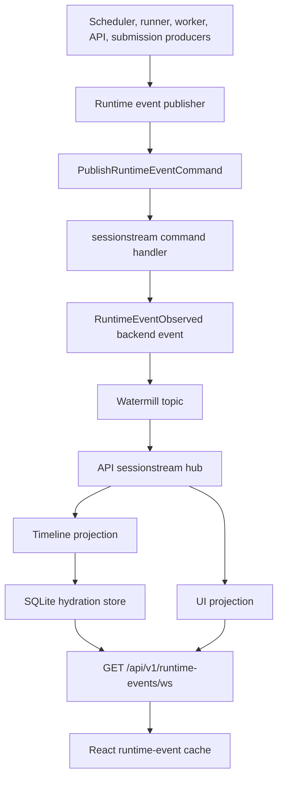
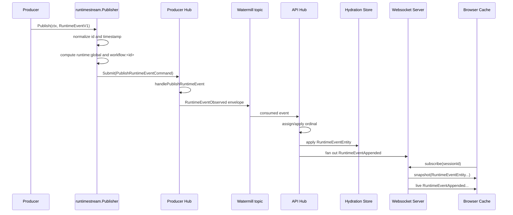

# Sessionstream Runtime Events in Scraper

This note explains how `scraper` now uses `sessionstream` to distribute runtime events from backend producers to browser clients. It is written as a technical deep dive rather than a changelog. The goal is to make the architecture understandable enough that a reader can extend it, debug it, or reproduce the pattern in another application.

> [!summary]
> - Scraper runtime events are domain protobuf messages. Sessionstream is responsible for routing, ordering, projection, hydration, and websocket delivery.
> - Producers submit `PublishRuntimeEventCommand` values into a sessionstream hub. The command handler publishes canonical `RuntimeEventObserved` backend events.
> - The API process consumes sessionstream events from the bus, projects them into live UI events and timeline entities, and serves browser clients through `GET /api/v1/runtime-events/ws`.
> - The old runtime-event REST endpoint, SSE stream, in-memory hub, and scraper-specific Watermill byte codec were removed. The live distribution path is now sessionstream-only.

## Why this note exists

Runtime progress is not a side channel in scraper. It is the way a user sees that a workflow was created, an op was leased, a runner started work, a request was served, or a worker emitted a log line. Before the sessionstream migration, scraper had its own runtime-event distribution stack: producers emitted `RuntimeEventV1` messages, Watermill carried protobuf bytes, the API process decoded them into an in-memory hub, REST returned recent buffered events, and Server-Sent Events delivered live updates.

That implementation worked, but it duplicated responsibilities that already exist in `sessionstream`: typed command submission, typed backend events, session routing, ordered event ordinals, snapshot hydration, UI projection, timeline projection, fanout, and websocket transport. The migration therefore made a deliberate architectural choice: scraper should keep its domain schema, and sessionstream should own the distribution mechanics.

The final implementation is recorded in the scraper repo under:

```text
/home/manuel/workspaces/2026-03-23/js-scraper/scraper
```

The main implementation commits were:

```text
0ea7c29071279544366f5878edf34ac79c63d0db Runtime events: add sessionstream adapter
ee5f4ba936ee0f5ce49d7d9f7d988855518ae567 Runtime events: replace REST SSE backend with sessionstream
d00312f93f504427fd381e5a9d4dc5f50bdd102d Runtime events: use sessionstream websocket in frontend
3232fc0acc1f87541f878247a2419c5d9bc87b51 Frontend: clean stale TypeScript and story code
```

## The design rule

The central rule is simple:

> Scraper owns the meaning of runtime events. Sessionstream owns how those events are distributed, ordered, stored for snapshots, and streamed to clients.

This separation matters because it prevents the runtime-event path from accumulating transport-specific assumptions. A scheduler observer should not know whether there are browser clients. A worker should not know whether the API process is using Redis Streams, an in-memory gochannel, or SQLite hydration. A React component should not know whether an event was originally produced by the scheduler, the runner, submission service, or request middleware. Each layer should see the representation that matches its responsibility.

The result is a layered event path:



The important detail is that the backend event is canonical. UI events and timeline entities are derived from it. This makes it possible to add new views later without changing the producers. A live activity table, a workflow detail panel, and a future worker diagnostics view can all be projections over the same canonical event stream.

## The source event: `RuntimeEventV1`

Scraper already had a useful runtime-event schema before the migration. The message lives in:

```text
proto/scraper/runtime/v1/events.proto
```

The message includes identity, source, kind, severity, timestamp, textual message, routing fields, labels, and an arbitrary structured payload:

```proto
message RuntimeEventV1 {
  uint32 schema_version = 1;
  string id = 2;
  RuntimeEventSource source = 3;
  string component = 4;
  RuntimeEventKind kind = 5;
  RuntimeEventSeverity severity = 6;
  google.protobuf.Timestamp occurred_at = 7;
  string message = 8;
  string workflow_id = 9;
  string op_id = 10;
  string site = 11;
  string queue = 12;
  string worker_id = 13;
  string request_id = 14;
  string artifact_id = 15;
  map<string, string> labels = 16;
  google.protobuf.Struct payload = 17;
}
```

This schema did not need to be replaced. The migration kept it as the domain event because it already describes scraper runtime facts. What changed is the envelope and delivery mechanism around it.

A useful way to read the schema is to separate event identity from event routing:

| Field group | Fields | Responsibility |
| --- | --- | --- |
| Identity | `id`, `schema_version`, `occurred_at` | Makes events stable, sortable, and deduplicatable. |
| Classification | `source`, `component`, `kind`, `severity` | Tells readers what produced the event and how to display it. |
| Routing/filtering | `workflow_id`, `op_id`, `site`, `queue`, `worker_id`, `request_id`, `artifact_id` | Lets projections and clients place an event in the correct scope. |
| Detail | `message`, `labels`, `payload` | Carries human-readable and structured context without changing the schema for every case. |

The sessionstream adapter normalizes events before publication. If an event has no id, it gets a UUID. If it has no timestamp, it gets the current time. This keeps downstream deduplication and sorting predictable.

## The scraper-specific sessionstream schema

Sessionstream is generic. It does not know what a scraper workflow is, what an op is, or what a runtime event means. Scraper therefore defines its own sessionstream application schema in:

```text
proto/scraper/runtime/sessionstream/v1/runtime_stream.proto
```

The first version uses four wrapper messages:

```proto
message PublishRuntimeEventCommand {
  scraper.runtime.v1.RuntimeEventV1 event = 1;
}

message RuntimeEventObserved {
  scraper.runtime.v1.RuntimeEventV1 event = 1;
}

message RuntimeEventAppended {
  scraper.runtime.v1.RuntimeEventV1 event = 1;
}

message RuntimeEventEntity {
  scraper.runtime.v1.RuntimeEventV1 event = 1;
}
```

The wrappers are intentionally separate even though they currently contain the same inner message. They represent different phases of the pipeline:

| Wrapper | Phase | Meaning |
| --- | --- | --- |
| `PublishRuntimeEventCommand` | Command input | A producer asks sessionstream to publish a runtime event into a session. |
| `RuntimeEventObserved` | Backend event | The hub records the canonical fact that a runtime event was observed. |
| `RuntimeEventAppended` | UI event | The frontend should append this runtime event to a live view. |
| `RuntimeEventEntity` | Timeline entity | The hydration store should include this runtime event in snapshots. |

This distinction pays off when the system evolves. A later version could split `RuntimeEventObserved` into narrower backend events such as `WorkflowCreated`, `OpLeased`, and `RunnerLogLine`, while keeping `RuntimeEventAppended` stable for the UI. Or it could keep one backend event and add additional UI projections. The wrappers preserve that design space without forcing it into the first implementation.

## Naming and schema registration

The adapter package lives under:

```text
pkg/runtimeevents/sessionstream
```

The package name is `runtimestream` to avoid colliding with the imported `sessionstream` package name. Its logical names are defined in `names.go`:

```go
const (
    TopicRuntimeEventsSessionstreamV1 = "scraper.runtime.sessionstream.v1.events"

    CommandPublishRuntimeEvent  = "scraper.runtime.PublishRuntimeEvent"
    EventRuntimeEventObserved   = "scraper.runtime.RuntimeEventObserved"
    UIEventRuntimeEventAppended = "scraper.runtime.RuntimeEventAppended"
    EntityRuntimeEvent          = "scraper.runtime.RuntimeEvent"

    SessionRuntimeGlobal sessionstream.SessionId = "runtime:global"
)
```

The names serve two purposes. They give the schema registry stable keys, and they give the frontend stable strings for decoded websocket frames. The name is not just a display label. It is the contract that lets a generic transport frame carry a specific scraper payload.

Registration happens in `schema.go`:

```go
func RegisterSchemas(reg *sessionstream.SchemaRegistry) error {
    if reg == nil {
        return fmt.Errorf("schema registry is nil")
    }
    for _, err := range []error{
        reg.RegisterCommand(CommandPublishRuntimeEvent, &streamv1.PublishRuntimeEventCommand{}),
        reg.RegisterEvent(EventRuntimeEventObserved, &streamv1.RuntimeEventObserved{}),
        reg.RegisterUIEvent(UIEventRuntimeEventAppended, &streamv1.RuntimeEventAppended{}),
        reg.RegisterTimelineEntity(EntityRuntimeEvent, &streamv1.RuntimeEventEntity{}),
    } {
        if err != nil {
            return err
        }
    }
    return nil
}
```

The registry is what lets sessionstream treat payloads as typed protobuf messages while still carrying them through generic command, event, UI event, and entity interfaces. Without this registration, the hub cannot validate command payloads, serialize event envelopes, or hydrate typed timeline entities.

## Session routing

Sessionstream routes by `SessionId`. Scraper currently uses two session scopes:

```text
runtime:global
workflow:<workflow-id>
```

Every event goes to `runtime:global`. Events with a workflow id also go to the workflow session. The routing function is intentionally small:

```go
func RuntimeEventSessionIDs(event *runtimev1.RuntimeEventV1) []sessionstream.SessionId {
    ids := []sessionstream.SessionId{SessionRuntimeGlobal}
    if event == nil {
        return ids
    }
    if workflowID := strings.TrimSpace(event.GetWorkflowId()); workflowID != "" {
        ids = append(ids, WorkflowSessionID(workflowID))
    }
    return dedupeSessionIDs(ids)
}
```

This is a product decision as much as a technical decision. The global session gives an operator a single activity feed. The workflow session gives a workflow detail page a focused view. Op-, worker-, site-, or queue-specific sessions can be added later, but the first implementation avoids multiplying session scopes until the UI needs them.

The frontend mirrors the same rule:

```ts
function runtimeEventSession(params: RuntimeEventsParams): string {
  if (params.workflowId) return `workflow:${params.workflowId}`;
  return 'runtime:global';
}
```

Filters such as `opId`, `site`, and `workerId` are currently applied client-side within the subscribed global or workflow session. This is acceptable for the first implementation because retention is bounded and workflow-scoped sessions already reduce most detail-page traffic.

## Publishing: commands instead of direct event injection

The producer-facing type is still small. Producers receive a publisher interface and call `Publish(ctx, event)`:

```go
type Publisher interface {
    Publish(ctx context.Context, event *runtimev1.RuntimeEventV1) error
}
```

The sessionstream implementation does more work internally. It normalizes the event, computes target session ids, and submits one command per session:

```go
func (p *Publisher) Publish(ctx context.Context, event *runtimev1.RuntimeEventV1) error {
    normalized := NormalizeRuntimeEvent(event)
    ids := RuntimeEventSessionIDs(normalized)
    errs := make([]error, 0, len(ids))
    for _, sid := range ids {
        payload := &streamv1.PublishRuntimeEventCommand{
            Event: proto.Clone(normalized).(*runtimev1.RuntimeEventV1),
        }
        if err := p.hub.Submit(ctx, sid, CommandPublishRuntimeEvent, payload); err != nil {
            errs = append(errs, fmt.Errorf("session %s: %w", sid, err))
        }
    }
    return errors.Join(errs...)
}
```

The command handler then publishes the canonical backend event:

```go
func handlePublishRuntimeEvent(
    ctx context.Context,
    cmd sessionstream.Command,
    _ *sessionstream.Session,
    pub sessionstream.EventPublisher,
) error {
    payload, ok := cmd.Payload.(*streamv1.PublishRuntimeEventCommand)
    if !ok || payload.GetEvent() == nil {
        return fmt.Errorf("publish runtime event payload must be %T, got %T", &streamv1.PublishRuntimeEventCommand{}, cmd.Payload)
    }
    normalized := NormalizeRuntimeEvent(payload.GetEvent())
    return pub.Publish(ctx, sessionstream.Event{
        Name:      EventRuntimeEventObserved,
        SessionId: cmd.SessionId,
        Payload:   &streamv1.RuntimeEventObserved{Event: normalized},
    })
}
```

This command step may look indirect. It is important because it keeps all event publication inside the sessionstream command/event/projection model. The producer submits intent. The handler validates and normalizes that intent. The hub records a backend event. Projections derive UI and storage effects from that backend event.

The design avoids a common error: letting producers write directly to UI fanout or directly to the hydration store. Direct writes would make each producer responsible for distribution details and would quickly duplicate logic across scheduler, runner, worker, API middleware, and submission code.

## Producer runtime and server runtime

The implementation distinguishes producer and server runtimes. They share schema registration and command handling, but they have different responsibilities.

A producer runtime is used where events originate. It opens publish resources, creates a hub with the schema registry, configures the event bus when available, registers commands, and exposes `Publisher`:

```go
func NewProducerRuntime(cfg Config) (*Runtime, error) {
    reg, err := newRegisteredSchemaRegistry()
    resources, err := runtimeevents.OpenPublisher(normalizeEventConfig(cfg.Events))
    hubOptions := []sessionstream.HubOption{sessionstream.WithSchemaRegistry(reg)}
    if resources.Publisher != nil {
        hubOptions = append(hubOptions,
            sessionstream.WithEventBus(resources.Publisher, noopSubscriber{}, sessionstream.WithBusTopic(resources.Topic)))
    }
    hub, err := sessionstream.NewHub(hubOptions...)
    RegisterCommands(hub)
    return &Runtime{Registry: reg, Hub: hub, Publisher: NewPublisher(hub), resources: resources}, nil
}
```

A server runtime is used by the API process. It opens a hydration store, opens publish/subscribe resources, creates a websocket server, configures the hub with store and fanout, installs projections, and starts consuming the bus:

```go
func NewServerRuntime(ctx context.Context, cfg Config) (*Runtime, error) {
    reg, err := newRegisteredSchemaRegistry()
    store, closeStore, err := openHydrationStore(cfg.TimelineDB, reg)
    resources, err := runtimeevents.OpenPublisherSubscriber(normalizeEventConfig(cfg.Events))

    provider := &snapshotProvider{}
    wsServer, err := ws.NewServer(provider)

    hubOptions := []sessionstream.HubOption{
        sessionstream.WithSchemaRegistry(reg),
        sessionstream.WithHydrationStore(store),
        sessionstream.WithUIFanout(wsServer),
        sessionstream.WithProjectionErrorPolicy(sessionstream.ProjectionErrorPolicyAdvance),
    }
    hubOptions = append(hubOptions,
        sessionstream.WithEventBus(resources.Publisher, resources.Subscriber, sessionstream.WithBusTopic(resources.Topic)))

    hub, err := sessionstream.NewHub(hubOptions...)
    provider.hub = hub
    Install(hub, cfg.RecentLimit)
    hub.Run(ctx)

    return &Runtime{Registry: reg, Store: store, Hub: hub, WSServer: wsServer, Publisher: NewPublisher(hub), resources: resources, closeStore: closeStore}, nil
}
```

The producer runtime does not need a websocket server or hydration store. The server runtime needs both because it is responsible for browser-facing views. This separation keeps workers from carrying UI concerns.

## Projection: one backend event, two derived outputs

Sessionstream projections are where canonical backend events become browser-visible views. Scraper installs two projections.

The UI projection maps `RuntimeEventObserved` to `RuntimeEventAppended`:

```go
type UIProjection struct{}

func (UIProjection) Project(
    _ context.Context,
    ev sessionstream.Event,
    _ *sessionstream.Session,
    _ sessionstream.TimelineView,
) ([]sessionstream.UIEvent, error) {
    if ev.Name != EventRuntimeEventObserved {
        return nil, nil
    }
    observed, ok := ev.Payload.(*streamv1.RuntimeEventObserved)
    if !ok || observed.GetEvent() == nil {
        return nil, fmt.Errorf("runtime event projection payload must be %T, got %T", &streamv1.RuntimeEventObserved{}, ev.Payload)
    }
    return []sessionstream.UIEvent{{
        Name: UIEventRuntimeEventAppended,
        Payload: &streamv1.RuntimeEventAppended{
            Event: proto.Clone(observed.GetEvent()).(*runtimev1.RuntimeEventV1),
        },
    }}, nil
}
```

The timeline projection maps `RuntimeEventObserved` to a hydratable `RuntimeEventEntity`. It also applies retention by emitting tombstone entities for old entries when a session exceeds its configured limit:

```go
entities := []sessionstream.TimelineEntity{{
    Kind:             EntityRuntimeEvent,
    Id:               id,
    CreatedOrdinal:   ev.Ordinal,
    LastEventOrdinal: ev.Ordinal,
    Payload: &streamv1.RuntimeEventEntity{
        Event: proto.Clone(event).(*runtimev1.RuntimeEventV1),
    },
}}
entities = append(entities, p.tombstonesForRetention(view, id, ev.Ordinal)...)
```

The distinction between UI projection and timeline projection is one of the most important parts of the design.

| Projection | Output | Used for | Persistence |
| --- | --- | --- | --- |
| UI projection | `RuntimeEventAppended` | Live websocket fanout to connected clients. | Not the durable snapshot state. |
| Timeline projection | `RuntimeEventEntity` | Hydration snapshots for subscribers and reconnecting clients. | Stored in the hydration store. |

A live client receives UI events as events happen. A new client receives a snapshot first, then live UI events. Both views come from the same backend event stream, but they have different delivery semantics.

## Hydration and reconnect semantics

The old frontend flow used two endpoints: a REST request for recent events and an SSE connection for live events. This creates a boundary problem. A client can fetch recent events, then open the SSE stream, and events can happen between those two operations. Some systems work around this with timestamps or `Last-Event-ID`, but the contract is still split.

Sessionstream uses one websocket subscription protocol. A client subscribes to a session and receives a snapshot. After the snapshot, the same connection receives live UI events. The snapshot contains timeline entities from the hydration store. The live stream contains projected UI events from fanout.

The runtime-event websocket endpoint is:

```text
GET /api/v1/runtime-events/ws
```

The old endpoints were removed:

```text
GET /api/v1/runtime-events
GET /api/v1/runtime-events/stream
```

The frontend sends a subscribe frame:

```json
{"subscribe":{"sessionId":"workflow:example","sinceSnapshotOrdinal":"0"}}
```

The current frontend hand-parses the subset of `sessionstream.v1.ServerFrame` JSON that it needs. It uses generated protobuf TypeScript bindings for scraper-specific payloads:

```ts
const UI_EVENT_RUNTIME_EVENT_APPENDED = 'scraper.runtime.RuntimeEventAppended';
const ENTITY_RUNTIME_EVENT = 'scraper.runtime.RuntimeEvent';

function runtimeEventFromSnapshotEntity(entity: SnapshotEntityJson): RuntimeEventV1 | undefined {
  if (entity.kind !== ENTITY_RUNTIME_EVENT || entity.tombstone || !entity.payload) return undefined;
  const decoded = fromJson(RuntimeEventEntitySchema, stripAnyType(entity.payload) as JsonValue);
  return decoded.event;
}

function runtimeEventFromUIEvent(frame: ServerFrameJson['uiEvent']): RuntimeEventV1 | undefined {
  if (!frame || frame.name !== UI_EVENT_RUNTIME_EVENT_APPENDED || !frame.payload) return undefined;
  const decoded = fromJson(RuntimeEventAppendedSchema, stripAnyType(frame.payload) as JsonValue);
  return decoded.event;
}
```

The `stripAnyType` helper exists because protobuf `Any` JSON includes an `@type` field. The concrete scraper wrapper schema expects the wrapper message fields, not the transport `Any` type marker. Removing `@type` before `fromJson` lets the generated `RuntimeEventAppendedSchema` and `RuntimeEventEntitySchema` decode the payload.

## The frontend cache model

The React API module still exposes the same high-level query hook:

```ts
export const { useGetRecentRuntimeEventsQuery } = runtimeEventsApi;
```

The implementation changed underneath. It no longer performs a REST fetch. It uses `fakeBaseQuery`, creates a websocket in `onCacheEntryAdded`, subscribes to the correct session, and updates the RTK Query cache from snapshot and live frames.

The cache still stores protobuf JSON values rather than raw protobuf objects. That choice preserves existing component behavior: UI components can continue calling `decodeRuntimeEvent(json)` when they need a `RuntimeEventV1` object.

The merge path deduplicates by event id, sorts by occurrence time, applies client-side filters, and enforces a local limit:

```ts
function mergeRuntimeEventJson(current: RuntimeEventJson[], incoming: RuntimeEventV1[], params: RuntimeEventsParams): RuntimeEventJson[] {
  const byId = new Map<string, RuntimeEventV1>();
  for (const raw of current) {
    try {
      const event = decodeRuntimeEvent(raw);
      if (event.id) byId.set(event.id, event);
    } catch {
      // ignore malformed cached entries
    }
  }
  for (const event of incoming) {
    if (!matchesParams(event, params)) continue;
    if (event.id) byId.set(event.id, event);
  }
  const limit = params.limit && params.limit > 0 ? params.limit : MAX_CACHED_EVENTS;
  return [...byId.values()]
    .sort((a, b) => runtimeEventOccurredAtMillis(b) - runtimeEventOccurredAtMillis(a))
    .slice(0, limit)
    .map(runtimeEventToJson);
}
```

This cache model is intentionally conservative. It keeps the component contract stable while changing the transport. It also makes malformed websocket frames non-fatal: a bad frame is ignored rather than tearing down the RTK Query cache entry.

## The command-to-client sequence

The following sequence is the shortest complete explanation of what happens when scraper publishes one runtime event:



There are two timing cases to understand.

If the browser is already subscribed when the event arrives, it receives a live `RuntimeEventAppended` UI event. If the browser subscribes after the event was processed, it receives the event as a `RuntimeEventEntity` inside the snapshot, as long as the entity remains within retention. The UI merge logic handles both cases through the same event id deduplication path.

## Why the old REST/SSE path was removed

The migration was intentionally breaking. The old path was not kept as a compatibility layer because doing so would preserve two runtime-event distribution mechanisms with different semantics.

The removed backend pieces included:

```text
pkg/api/handlers/runtime_events.go
pkg/api/server/runtime_event_router.go
pkg/runtimeevents/hub.go
pkg/runtimeevents/watermill.go
```

The old REST/SSE path had a different contract from sessionstream:

| Concern | Old REST/SSE stack | Sessionstream stack |
| --- | --- | --- |
| Initial state | REST query over API-local recent buffer. | Snapshot from hydration store. |
| Live stream | SSE `runtime-event` frames. | Websocket `ServerFrame` UI events. |
| Routing | Query params over one buffer. | Explicit `SessionId` subscription. |
| Persistence | In-memory recent events in API process. | Hydration store with timeline entities. |
| Event typing | Protobuf payload decoded then JSON response/SSE data. | Protobuf command/event/UI/entity schemas. |
| Reconnect semantics | Split REST then SSE behavior. | Snapshot-before-live subscription flow. |

Keeping both would make correctness harder to reason about. New code would have to answer whether a feature should project into the old hub, the sessionstream timeline, or both. Removing the old path makes sessionstream the one place where runtime event distribution semantics live.

## Operational details

The server runtime can use an in-memory hydration store or a SQLite-backed store. The config field for the sessionstream runtime-event timeline database is exposed as:

```text
--events-sessionstream-db
```

When no path is configured, the server runtime uses an in-memory store. When a path is configured, it opens a SQLite hydration store through sessionstream's SQLite store package.

There is also an HTTP middleware detail that matters for websocket correctness. The request logger normally wraps the response writer in a status recorder. Websocket upgrades require hijacking support from the underlying writer. The server therefore bypasses the status recorder for `Upgrade: websocket` requests. Without this, the websocket handshake can fail even though the route is registered correctly.

## Testing and validation

The migration added or updated tests around routing, schema registration, projection behavior, local snapshots, Watermill/gochannel fanout, and API websocket integration. The important validation commands were:

```bash
cd /home/manuel/workspaces/2026-03-23/js-scraper/scraper
go test ./pkg/runtimeevents/... -count=1
go test ./pkg/runtimeevents/... ./pkg/api/server ./pkg/cmd ./pkg/services/submission ./pkg/sites/submitverbs -count=1
go test ./... -count=1
```

The frontend cleanup restored the web build after the websocket migration:

```bash
cd /home/manuel/workspaces/2026-03-23/js-scraper/scraper/web
pnpm test:unit -- --runInBand
pnpm build
```

The final frontend build succeeds. Vite reports a non-fatal chunk size warning for the main JavaScript bundle, which is a separate code-splitting concern rather than a runtime-event correctness issue.

## Failure modes to watch

### Schema names must match on both sides

The frontend checks event/entity names as strings:

```ts
'scraper.runtime.RuntimeEventAppended'
'scraper.runtime.RuntimeEvent'
```

If Go constants change without updating the frontend, live events or snapshots will be ignored. If new wrapper messages are introduced, both `RegisterSchemas` and the TypeScript decoding path must be updated together.

### A missing id breaks deduplication unless normalization runs

The frontend merge path deduplicates by `RuntimeEventV1.id`. The publisher normalizes missing ids. Code paths that bypass the publisher would risk duplicate entries or unstable cache behavior. Producers should publish through the `runtimeevents.Publisher` interface rather than writing sessionstream events directly.

### Retention affects snapshots, not live delivery

The timeline projection emits tombstones when the session exceeds its retention limit. A connected client can still see live events as they arrive, but a new subscriber only gets the retained timeline entities. Increasing or decreasing retention changes what a late subscriber sees.

### Client-side filters are not session routing

The current frontend subscribes to either `runtime:global` or `workflow:<id>`. It applies `opId`, `site`, and `workerId` filters locally. This is correct for the current implementation, but it is not the same as having dedicated `op:`, `site:`, or `worker:` sessions. If those views become high-volume, add explicit session routing rather than relying on client-side filtering.

### Websocket transport frame typing is currently local

The frontend uses local TypeScript types for the subset of `sessionstream.v1.ServerFrame` it consumes. It uses generated protobuf bindings for scraper wrapper payloads. If the frontend begins using more transport-frame features, it should generate TypeScript bindings for sessionstream transport proto as well.

## Extension points

The current implementation is intentionally narrow. It leaves several clean extension points:

- Add narrower backend event messages when `RuntimeEventV1` becomes too broad for some projections.
- Add additional session ids such as `op:<workflow-id>:<op-id>`, `worker:<worker-id>`, or `site:<site>` when the UI needs more focused subscriptions.
- Add new projections over `RuntimeEventObserved`, such as error counters, worker health summaries, or per-site activity windows.
- Generate TypeScript bindings for `sessionstream.v1.transport.proto` if frontend transport handling grows.
- Add a replay or diagnostic UI over the hydration store if operators need to inspect runtime-event history.

The stable rule for each extension is the same: publish canonical backend events first, then derive UI and storage views through projections.

## Implementation checklist for a similar migration

Use this sequence when converting another subsystem to sessionstream-backed delivery:

1. Identify the existing domain event schema. If it is already protobuf and domain-specific, keep it.
2. Define application-specific sessionstream wrappers for command, backend event, UI event, and timeline entity roles.
3. Register all wrappers in a `SchemaRegistry` with stable logical names.
4. Write a producer-facing publisher that hides sessionstream details from domain producers.
5. Route each event to one or more session ids. Start with the smallest session vocabulary that supports the UI.
6. Implement a command handler that validates command payloads and publishes canonical backend events.
7. Implement a UI projection for live client events.
8. Implement a timeline projection for hydratable snapshot entities and retention.
9. Configure the API/server process with hydration store, fanout, websocket server, and bus consumer.
10. Replace old REST/SSE polling or streaming clients with websocket subscription and snapshot handling.
11. Delete the old distribution stack after the new one is validated. Do not leave two competing semantics unless compatibility explicitly requires it.
12. Add tests for routing, schema registration, command handling, projections, snapshots, live fanout, and frontend decoding.

## Key points

- Sessionstream is not a replacement for scraper's domain events. It is the transport, ordering, projection, hydration, and fanout substrate around those events.
- The command/backend-event/UI-event/entity split is deliberate. Even when the payloads are initially wrappers around the same `RuntimeEventV1`, the roles are different.
- Session ids are part of the product contract. They define what a client can subscribe to and what a server must hydrate.
- Snapshot-before-live delivery is the main user-visible improvement over REST plus SSE. It gives one subscription protocol for initial state and subsequent updates.
- Removing the old stack was a correctness decision. It prevents two different runtime-event systems from drifting apart.

## Related implementation files

```text
proto/scraper/runtime/v1/events.proto
proto/scraper/runtime/sessionstream/v1/runtime_stream.proto
pkg/runtimeevents/publisher.go
pkg/runtimeevents/sessionstream/names.go
pkg/runtimeevents/sessionstream/schema.go
pkg/runtimeevents/sessionstream/routing.go
pkg/runtimeevents/sessionstream/publisher.go
pkg/runtimeevents/sessionstream/projections.go
pkg/runtimeevents/sessionstream/runtime.go
pkg/api/server/routes_runtime_events.go
pkg/api/server/server.go
pkg/api/server/middleware_request.go
web/src/api/runtimeEventsApi.ts
web/src/pb/proto/scraper/runtime/sessionstream/v1/runtime_stream_pb.d.ts
```

## Related ticket docs

```text
ttmp/2026/05/22/SCRAPER-SESSIONSTREAM-EVENTS--use-sessionstream-as-the-scraper-runtime-event-distribution-mechanism/design-doc/01-intern-guide-to-sessionstream-backed-scraper-runtime-events.md
ttmp/2026/05/22/SCRAPER-SESSIONSTREAM-EVENTS--use-sessionstream-as-the-scraper-runtime-event-distribution-mechanism/reference/01-investigation-diary.md
ttmp/2026/05/22/SCRAPER-FRONTEND-CLEANUP--frontend-build-and-deprecated-code-cleanup/analysis/01-frontend-cleanup-guide.md
ttmp/2026/05/22/SCRAPER-FRONTEND-CLEANUP--frontend-build-and-deprecated-code-cleanup/reference/01-cleanup-diary.md
```
