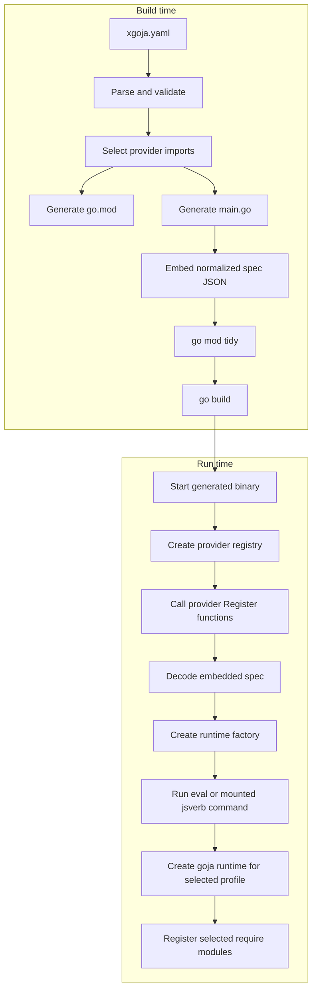
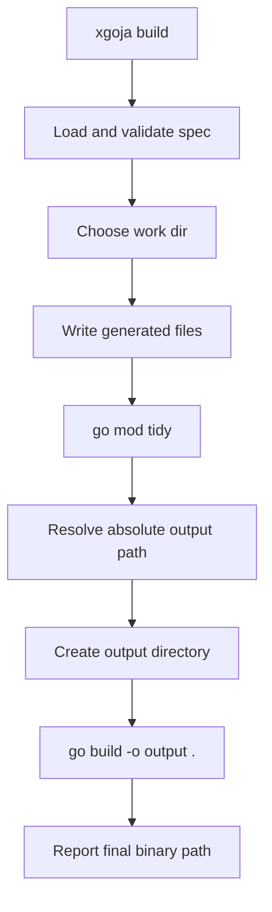

# xgoja: Compile-Time Goja Module Composition and jsverbs Mounting

This is the compile-time composition branch of the [[go-go-goja]] project map.

This note is a technical deep dive into the `xgoja` implementation that now lives inside `go-go-goja`. It explains the project from the outside in: what problem `xgoja` is solving, how the generated binary model works, how the Go code is organized, how runtime profiles are interpreted, how generated programs execute provider modules, how `jsverbs` were mounted, where the current implementation is intentionally minimal, and where the next engineering pressure points are.

The intended reader is someone who writes Go, reads generated code comfortably, and wants to understand the system well enough to extend it without guessing. The goal is not to restate the ticket history. The goal is to describe the design as a working system.

> [!summary]
> - `xgoja` is an xcaddy-style builder for goja-powered CLIs. It takes a declarative build spec, generates Go source, and compiles a new binary instead of loading native plugins into an existing one.
> - The implementation is split into buildspec parsing, provider registration, deterministic source generation, optional local replacement, build execution, and generated runtime/application layers.
> - The generated runtime is still lighter than `engine.Factory`, but it now owns an event loop and runtime-owner bindings so async provider modules and promise-returning jsverbs can settle safely on the runtime owner path.
> - All three jsverb source modes now work: runtime filesystem sources, embedded local sources, and provider-shipped sources selected by `package`/`source`.
> - The project now includes bundled Glazed help topics and runnable examples under `examples/xgoja/` for smoke testing the generated binaries.

## Why this note exists

The xgoja work spanned multiple tickets and touched several layers at once: Glazed CLI wiring, YAML schema handling, provider API design, code generation, generated runtime design, Go toolchain execution, adapter/Cobra target modes, and finally `jsverbs` mounting. That makes it easy to lose the overall shape when reading the code file by file.

This note exists to preserve the architecture as a coherent whole. The implementation is already working, but some design decisions are conditional on current repository constraints. A future contributor needs to see both the current behavior and the reasoning behind it.

## The problem xgoja is solving

A goja-hosted CLI often wants two kinds of extensibility at the same time:

1. **Go-backed native modules**, such as `fetch`, `database`, `yaml`, `fs`, or application-specific bindings.
2. **JavaScript-defined commands**, written as source files and exposed through a CLI command tree.

The problem is that these two kinds of extension behave differently.

A JavaScript file can be loaded dynamically. A Go module cannot be added safely to an already-built binary without re-entering the entire space of Go plugin ABI compatibility, shared package identity, build tags, local replacements, generated files, and toolchain exactness. The reliable boundary for in-process Go extensions is source-level composition followed by a normal Go build.

That is the foundational decision behind xgoja.

The user should be able to write a build spec like this:

```yaml
name: fixture
packages:
  - id: fixture
    import: github.com/go-go-golems/go-go-goja/pkg/xgoja/testprovider
runtimes:
  repl:
    modules:
      - package: fixture
        name: hello
        as: hello
commands:
  repl:
    enabled: true
    runtime: repl
  jsverbs:
    enabled: true
    runtime: repl
    name: verbs
jsverbs:
  - id: local
    path: ./verbs
    embed: false
```

and then run:

```bash
xgoja build -f xgoja.yaml --output ./dist/fixture
```

The result should be a binary that already contains the selected Go-backed modules and knows how to mount the configured JavaScript verb sources.

## The current project shape

The implementation lives in the main `go-go-goja` module rather than a separate repository. The important directories are:

```text
cmd/xgoja/
  main.go
  root.go
  cmd_build.go
  cmd_doctor.go
  cmd_inspect.go
  cmd_list_modules.go
  doc/                 # bundled Glazed help entries
  internal/
    buildexec/
    buildspec/
    generate/
    testprovider/

pkg/xgoja/
  providerapi/
  app/
  testprovider/
  testcobra/
  testadapter/

pkg/jsverbs/
  scan.go
  command.go
  runtime.go

examples/xgoja/
  runtime-filesystem/
  embedded-jsverbs/
  provider-shipped-jsverbs/
```

The system has three major layers.

### Layer 1: the builder CLI

This is the `xgoja` command under `cmd/xgoja`. It parses YAML, validates it, generates source files, runs `go mod tidy`, runs `go build`, and exposes diagnostic commands such as `doctor`, `inspect`, and `list-modules`.

### Layer 2: reusable xgoja runtime packages

These live under `pkg/xgoja`. They are public because generated programs need to import them from a temporary build module. This layer contains the provider registration API and the generated application/runtime helpers.

### Layer 3: generated programs

The builder generates a temporary main module containing:

- a generated `go.mod`,
- a generated `main.go`,
- a normalized embedded spec file,
- copied local JS verb source trees when `embed: true`,
- a conditional `go:embed` declaration when the generated program needs embedded JS verb sources.

The generated program is not an implementation detail in the sense of being opaque. It is intentionally readable and disposable. When a build fails, the work directory should explain why.

## The mental model: build time and run time

The most important distinction in xgoja is between what the build chooses and what the runtime chooses.

At build time, xgoja decides which Go packages become part of the resulting binary. That decision is expressed by the `packages:` section of the build spec. The generator turns that list into real Go imports and calls each provider package's registration function.

At run time, the binary decides which of the compiled-in capabilities are available in a specific command or runtime profile. That decision is expressed by the `runtimes:` and `commands:` sections of the build spec.



This separation is the reason the system stays understandable. The generator decides **what can exist**. The runtime decides **what is active for this invocation**.

## The buildspec layer

The buildspec package is the contract between the user and the builder. It lives under:

- `/home/manuel/workspaces/2026-05-22/xgoja/go-go-goja/cmd/xgoja/internal/buildspec/spec.go`
- `/home/manuel/workspaces/2026-05-22/xgoja/go-go-goja/cmd/xgoja/internal/buildspec/load.go`
- `/home/manuel/workspaces/2026-05-22/xgoja/go-go-goja/cmd/xgoja/internal/buildspec/validate.go`
- `/home/manuel/workspaces/2026-05-22/xgoja/go-go-goja/cmd/xgoja/internal/buildspec/report.go`

The central types are:

- `Spec`
- `TargetSpec`
- `PackageSpec`
- `Runtime`
- `ModuleInstance`
- `CommandsSpec`
- `JSVerbSourceSpec`

A simplified sketch looks like this:

```go
type Spec struct {
    Name     string
    Go       GoSpec
    Target   TargetSpec
    Packages []PackageSpec
    Runtimes map[string]Runtime
    Commands CommandsSpec
    JSVerbs  []JSVerbSourceSpec
    BaseDir  string
}

type PackageSpec struct {
    ID       string
    Import   string
    Version  string
    Register string
    Replace  string
}

type Runtime struct {
    Modules []ModuleInstance
}

type ModuleInstance struct {
    Package string
    Name    string
    As      string
    Config  map[string]any
}
```

### What the loader does

`LoadFile` in `load.go` does four things in order:

1. Resolve the spec path to an absolute path.
2. Read and unmarshal YAML.
3. Record the spec base directory so relative paths can be interpreted correctly.
4. Apply defaults and validate.

The defaults are intentionally simple:

- `name` defaults to `xgoja-app` if missing.
- `go.version` defaults to `1.26`.
- `go.module` defaults to `example.com/generated/<name>`.
- `target.kind` defaults to `xgoja`.
- `target.output` defaults to `dist/<name>`.
- provider register functions default to `Register`.
- command names default to `repl` and `verbs` where appropriate.

### What validation checks

Validation is not trying to prove the entire world. It is trying to catch structural mistakes early.

The validator currently checks:

- supported target kinds,
- required target fields,
- package ID uniqueness,
- package import presence,
- local replace path existence,
- runtime profile existence,
- runtime module references to known package IDs,
- duplicate aliases inside one runtime profile,
- enabled command runtime references,
- jsverb source ID uniqueness,
- embedded filesystem source path existence.

The validator returns a structured report rather than a single flat error string. That is what `xgoja doctor` prints.

### Why the buildspec is internal

The buildspec package is command-local for now. That is deliberate. It is still changing, and generated binaries do not need it directly. The generated program consumes a normalized runtime spec JSON through public `pkg/xgoja/app` types instead.

## The provider API

The provider API is public because generated programs need to import it from outside the repository root when they are built in a temporary main module.

It lives under:

- `/home/manuel/workspaces/2026-05-22/xgoja/go-go-goja/pkg/xgoja/providerapi/module.go`
- `/home/manuel/workspaces/2026-05-22/xgoja/go-go-goja/pkg/xgoja/providerapi/registry.go`
- `/home/manuel/workspaces/2026-05-22/xgoja/go-go-goja/pkg/xgoja/providerapi/verbs.go`

The key concepts are:

- `Registry`
- `Package`
- `Module`
- `VerbSource`
- `ModuleFactory`
- `ModuleContext`

A provider package calls:

```go
//go:embed verbs/*.js
var verbsFS embed.FS

func Register(registry *providerapi.Registry) error {
    return registry.Package("fixture",
        providerapi.Module{
            Name:      "hello",
            DefaultAs: "hello",
            New:       newHelloModule,
        },
        providerapi.VerbSource{
            Name: "verbs",
            FS:   verbsFS,
            Root: "verbs",
        },
    )
}
```

The `FS` field matters for provider-shipped verbs. A source name without a filesystem can describe metadata, but it cannot be scanned into executable commands.

The provider registry enforces a few invariants immediately:

- package IDs must be unique,
- module names inside one provider package must be unique,
- verb source names inside one provider package must be unique,
- module factories must not be nil,
- empty names are rejected.

This is important because it pushes ambiguity out of the runtime path. By the time a generated binary starts, provider declarations should already be structurally sound.

## Deterministic source generation

The generator lives under:

- `/home/manuel/workspaces/2026-05-22/xgoja/go-go-goja/cmd/xgoja/internal/generate/gomod.go`
- `/home/manuel/workspaces/2026-05-22/xgoja/go-go-goja/cmd/xgoja/internal/generate/main.go`
- `/home/manuel/workspaces/2026-05-22/xgoja/go-go-goja/cmd/xgoja/internal/generate/generate.go`

This layer takes a validated buildspec and renders the temporary module.

### Generated go.mod

The generated `go.mod` includes:

- the generated module name,
- the Go version,
- a require on `github.com/go-go-golems/go-go-goja`,
- requires for provider modules when versions are specified,
- replace directives for local development.

The generator currently applies a pragmatic module-path rule:

- if a provider import ends in `/xgoja`, the required module path becomes its parent directory,
- otherwise the import path itself is used as the module path.

That rule is useful now, but it is heuristic. An explicit per-package module path would be more robust in a future revision.

### Generated main.go

The generated `main.go` is the center of the system. It imports:

- `pkg/xgoja/app`,
- `pkg/xgoja/providerapi`,
- every selected provider package,
- optionally a target package for adapter/Cobra modes.

The basic flow is:

1. create a provider registry,
2. call each provider's `Register` function,
3. decode the embedded spec when needed,
4. choose a target mode,
5. execute the resulting Cobra root.

The generator supports three target kinds.

#### Pure xgoja

```go
root, err := app.NewRootCommand(app.Options{Providers: registry, SpecJSON: embeddedSpecJSON})
must(err)
```

#### Adapter target

```go
spec := decodeSpec()
host := app.NewHost(registry, spec)
root, err := target.Build(context.Background(), host)
must(err)
```

#### Cobra attach target

```go
spec := decodeSpec()
host := app.NewHost(registry, spec)
root := target.NewRootCommand()
host.AttachDefaultCommands(root)
```

### Embedded spec JSON

The generated binary embeds a normalized JSON representation of the buildspec fields it needs at runtime. This is intentionally lower-case JSON with stable names rather than raw Go struct field serialization.

That detail matters. The first implementation accidentally emitted `Kind`, `Import`, and similar Go field names. Explicit JSON tags were added to the buildspec structs so the embedded payload is predictable and reasonable to treat as a public shape.

## Build execution

The build executor lives under:

- `/home/manuel/workspaces/2026-05-22/xgoja/go-go-goja/cmd/xgoja/internal/buildexec/buildexec.go`

It is deliberately narrow. It knows how to run:

- `go mod tidy`
- `go build -o ...`

and capture combined output.

The build command under `cmd/xgoja/cmd_build.go` orchestrates the whole flow.



A few details are important here.

### Temporary workspaces

If `--work-dir` is not provided, `xgoja build` creates a temporary directory. Unless `--keep-work` is set, that directory is removed afterward. This keeps the default flow clean while still allowing debugging of failed generated builds.

### Relative output paths

The build happens inside the generated workspace, so the final output path must be resolved before calling `go build`. Otherwise a relative `-o dist/fixture` would be interpreted relative to the workspace instead of the caller's working directory.

### Published module version and optional local replacement

The builder no longer assumes that it is running inside a checkout of `go-go-goja`. This matters because `xgoja` is intended to be installed and used as a normal command. A generated binary imports packages such as `pkg/xgoja/app` and `pkg/xgoja/providerapi`, so its generated `go.mod` must be able to resolve the `github.com/go-go-golems/go-go-goja` module.

The normal installed-tool path is to use the module version recorded in the `xgoja` binary's Go build information. If `xgoja` was installed from a released module version, generated `go.mod` can require that same published version.

Local PR development is different. When `xgoja` is run with `go run ./cmd/xgoja`, the binary does not have a released module version, and the published module may not contain the new xgoja packages yet. In that case the user passes an explicit replacement:

```bash
xgoja build -f xgoja.yaml --xgoja-replace /path/to/go-go-goja
```

This is not a permanent runtime dependency on the source tree. It is the correct way to test an unreleased local branch while still allowing released xgoja binaries to use the published module.

## The generated runtime layer

The generated runtime lives under `pkg/xgoja/app` and is public so the generated binary can import it.

Important files:

- `/home/manuel/workspaces/2026-05-22/xgoja/go-go-goja/pkg/xgoja/app/spec.go`
- `/home/manuel/workspaces/2026-05-22/xgoja/go-go-goja/pkg/xgoja/app/factory.go`
- `/home/manuel/workspaces/2026-05-22/xgoja/go-go-goja/pkg/xgoja/app/root.go`
- `/home/manuel/workspaces/2026-05-22/xgoja/go-go-goja/pkg/xgoja/app/host.go`

### Why the runtime is lightweight but still owned

The generated runtime still does not reuse the full `engine.Factory` composition path. That remains deliberate: importing the full engine path brings in the broad default module registry and, in this workspace, exposes the existing `goja` / `goja_nodejs` workspace mismatch. The generated app only needs the provider modules selected by the xgoja spec.

The runtime is no longer just a raw `goja.New()` plus a `require.Registry`. Code review identified an important missing piece: modules such as async `timer` and async `fs` need runtime-owner bindings so background goroutines can settle promises on the runtime owner path. A plain runtime can execute synchronous provider modules, but it cannot safely host modules that call `runtimebridge.Lookup(vm).Owner`.

The generated runtime therefore creates a small owned runtime:

- `goja.New()` creates the VM.
- `eventloop.NewEventLoop()` provides the scheduler used by the runtime owner.
- `runtimeowner.NewRunner(...)` serializes VM work onto the owner context.
- `runtimebridge.Store(...)` attaches lifecycle context, event loop, and owner bindings to the VM.
- `require.NewRegistry(...)` registers the provider modules selected by the runtime profile.

This is still lighter than `engine.Factory`, but it now has the lifecycle primitives needed by asynchronous native modules and promise-returning jsverbs.

### RuntimeFactory

The `RuntimeFactory` receives:

- a provider registry,
- the decoded runtime spec.

Its job is simple: create a fresh runtime for one profile.

Pseudocode:

```go
func NewRuntime(ctx, profile, opts...) {
    runtimeSpec := spec.Runtimes[profile]

    vm := goja.New()
    loop := eventloop.NewEventLoop()
    owner := runtimeowner.NewRunner(vm, loop, ...)
    runtimeCtx := context.WithCancel(context.Background())

    runtimebridge.Store(vm, Bindings{
        Context: runtimeCtx,
        Loop: loop,
        Owner: owner,
    })

    reqRegistry := require.NewRegistry(opts...)
    for each selected module instance:
        module := providers.ResolveModule(packageID, name)
        configJSON := json.Marshal(instance.Config)
        loader := module.New(ModuleContext{Context: runtimeCtx, ...})
        reqRegistry.RegisterNativeModule(instance.Alias(), loader)

    req := reqRegistry.Enable(vm)
    return JSRuntime{VM: vm, Require: req, Loop: loop, Owner: owner}
}
```

This makes the runtime profile an actual enforcement boundary. If a profile does not select a module, it is not registered.

### Host

The public `Host` type exists for adapter and Cobra attach target modes. It bundles:

- the providers,
- the decoded spec,
- the runtime factory.

It also exposes attachment helpers:

- `AttachDefaultCommands`
- `AttachEval`
- `AttachModules`
- `AttachVerbs`

This is a clean separation. The generated code should not need to know where an existing application wants to attach xgoja commands. It constructs a host and lets the adapter or target application use it.

## The command surface

The current generated app exposes three conceptual command families.

### eval

`eval` is the minimal JavaScript execution path.

```bash
generated-binary eval 'require("hello").greet("intern")'
```

This creates a runtime profile, runs the string, and prints the result if it is non-null.

It is intentionally simple, but it is enough for smoke tests and useful as a debugging primitive.

### modules

`modules` lists the provider modules registered in the generated binary.

It is diagnostic, not operational. It answers the question: which provider modules made it through build-time registration?

### verbs

This is where the implementation changed meaningfully during the project.

The first pass of xgoja only listed configured source IDs. That was a placeholder. The current implementation mounts discovered jsverbs as executable commands from runtime filesystem sources, embedded local sources, and provider-shipped sources.

## How jsverbs works in xgoja

The jsverbs subsystem already existed in the repository. What xgoja needed was a compatible runtime execution path.

### Existing jsverbs model

`pkg/jsverbs` already provided three core capabilities:

1. scan JS files and extract verb/package metadata,
2. build Glazed commands from discovered verbs,
3. invoke those verbs inside an `engine.Runtime`.

The existing runtime entrypoint was:

```go
func (r *Registry) InvokeInRuntime(ctx context.Context, runtime *engine.Runtime, verb *VerbSpec, parsedValues *values.Values) (interface{}, error)
```

That was not sufficient for xgoja because the generated app is currently not using `engine.Runtime`.

### Direct invocation path

The solution was to add a second invocation API in:

- `/home/manuel/workspaces/2026-05-22/xgoja/go-go-goja/pkg/jsverbs/runtime.go`

```go
func (r *Registry) InvokeInGojaRuntime(
    ctx context.Context,
    vm *goja.Runtime,
    req *require.RequireModule,
    verb *VerbSpec,
    parsedValues *values.Values,
) (interface{}, error)
```

This function reuses the existing binding model:

- build the argument binding plan,
- build argument values,
- load the JS module through `req.Require(...)`,
- find the captured function in `__glazedVerbRegistry`,
- call it with converted arguments,
- wait for a promise if the result is async.

The direct invocation path now checks whether runtimebridge owner bindings exist for the VM. If they do, it invokes the verb through the owner and polls promise state through the same owner path. If they do not, it falls back to direct invocation for lightweight callers that still use the API without an owned runtime.

### Why require loader injection matters

This is the part that makes jsverbs mounting work.

A JS verb file is not executed by directly reading the file and evaluating the source in place. It is loaded through the jsverbs source overlay loader, which injects:

- placeholder no-op functions like `__package__`, `__verb__`, and `doc`,
- a capture registry for the discovered functions.

That loader is exposed by:

```go
registry.RequireLoader()
```

The xgoja runtime factory therefore needed one small extension: it now accepts optional `require.Option` values so callers can provide:

```go
require.WithLoader(registry.RequireLoader())
```

That means one runtime can have:

- provider-backed native modules registered normally, and
- JS source modules loaded through the scanned jsverbs overlay.

## Real jsverbs mounting in the generated app

The generated app runtime now mounts jsverbs by replacing the placeholder `verbs` command in `pkg/xgoja/app/root.go`. The command construction path is the same for every source once scanning is complete: a scanned `jsverbs.Registry` produces Glazed commands, and each command invocation creates an xgoja runtime for the configured `commands.jsverbs.runtime` profile.

The source-selection logic is now the important part:

1. provider-shipped sources use `package` and `source`, resolve through `providerapi.Registry.ResolveVerbSource`, and scan the provider's `fs.FS` with `jsverbs.ScanFS`;
2. embedded local sources use `path` and `embed: true`, scan the generated program's embedded `fs.FS`, and do not need the original source directory at runtime;
3. runtime filesystem sources use `path` and `embed: false`, scan disk with `jsverbs.ScanDir`, and require the source directory to exist when the generated binary starts.

For each discovered verb, xgoja builds a Glazed command using `CommandForVerbWithInvoker`, creates a runtime profile, injects the jsverbs source loader with `require.WithLoader(registry.RequireLoader())`, and invokes the verb through `InvokeInGojaRuntime`.

The essential structure is:

```go
for _, source := range spec.JSVerbs {
    registry := scanVerbSource(providers, embeddedJSVerbs, source)
    for _, verb := range registry.Verbs() {
        cmd := registry.CommandForVerbWithInvoker(verb, func(ctx, _, verb, vals) (any, error) {
            rt := factory.NewRuntime(ctx, profile, require.WithLoader(registry.RequireLoader()))
            defer rt.Close(context.Background())
            return registry.InvokeInGojaRuntime(ctx, rt.VM, rt.Require, verb, vals)
        })
        mounted = append(mounted, cmd)
    }
}
```

Then those Glazed commands are attached to the parent with:

```go
glazedcli.AddCommandsToRootCommand(root, mounted, ...)
```

### What this now enables

A generated xgoja app can now mount a filesystem verb like:

```js
__package__({ name: "tools" })
__verb__("greet", {
  name: "greet",
  output: "text",
  fields: {
    name: { type: "string", required: true }
  }
})
function greet(name) {
  const hello = require("hello")
  return hello.greet(name)
}
```

and execute it as a command:

```bash
generated-binary verbs tools greet --name intern
```

The important detail is that this verb is not isolated from the provider modules. It can call `require("hello")`, and that resolves through the selected runtime profile.

## The jsverbs source story: three implemented modes

The buildspec now supports three jsverb source shapes, and all three are executable in generated binaries. The distinction is not cosmetic. Each mode answers a different question about where JavaScript verb files live and when they are copied.

### Runtime filesystem sources

```yaml
jsverbs:
  - id: local-dev
    path: ./verbs
    embed: false
```

Runtime filesystem sources stay on disk. The generated binary scans `path` when it starts and mounts whatever verbs are present at that time. This is the best development mode because editing a verb file does not require rebuilding the generated binary.

The cost is that the generated binary depends on the directory being present at runtime. If the directory is moved, deleted, or not deployed with the binary, the verbs cannot be mounted.

### Embedded local jsverbs

```yaml
jsverbs:
  - id: local
    path: ./verbs
    embed: true
```

Embedded local sources start as ordinary files, but `xgoja build` treats the path as a build-time input. The generator copies the directory into the generated workspace under:

```text
xgoja_embed/jsverbs/<source-id>/
```

It then rewrites the embedded runtime spec so the generated binary scans that generated path from an embedded filesystem. The generated `main.go` imports `embed`, declares `embeddedJSVerbs embed.FS`, and passes that filesystem into `app.NewRootCommand` or `app.NewHostWithOptions`.

This mode produces a self-contained generated binary. After the build completes, the original `./verbs` directory is no longer needed to run the embedded verb commands.

### Provider-shipped verb sources

```yaml
jsverbs:
  - id: provider-defaults
    package: fixture
    source: verbs
```

Provider-shipped sources live inside a Go provider package. The provider registers a source with an `fs.FS` and a root path:

```go
//go:embed verbs/*.js
var verbsFS embed.FS

func Register(registry *providerapi.Registry) error {
    return registry.Package("fixture",
        providerapi.Module{Name: "hello", New: newHelloModule},
        providerapi.VerbSource{Name: "verbs", FS: verbsFS, Root: "verbs"},
    )
}
```

The generated app resolves `package: fixture` and `source: verbs` through the provider registry, then scans the provider's filesystem. This is the right mode for default commands that belong to a provider's native module set.

### Source-mode comparison

| Mode | Where files live before build | Where files are read at runtime | Rebuild needed after editing JS? | Best use |
| --- | --- | --- | --- | --- |
| Runtime filesystem | Local directory from `path` | Same local/runtime directory | No | Local development and externally managed verb packs |
| Embedded local | Local directory from `path` | Generated binary `embed.FS` | Yes | Self-contained generated executables |
| Provider-shipped | Provider package `embed.FS` | Provider package `fs.FS` exposed through `VerbSource` | Yes, rebuild provider/generated binary | Default verbs shipped with provider modules |

## The adapter and Cobra target modes

The current implementation supports three generated binary shapes.

### Pure xgoja

The generated binary is fully owned by xgoja. The root command is created by `app.NewRootCommand(...)`.

### Adapter target

The generated program imports a target package exposing:

```go
Build(context.Context, *app.Host) (*cobra.Command, error)
```

That target package can decide where xgoja commands are attached and how the host is integrated into the application's existing structure.

### Cobra attach target

The generated program imports a package exposing a root constructor such as:

```go
NewRootCommand() *cobra.Command
```

Then xgoja attaches its own commands to the returned root through `Host.AttachDefaultCommands`.

These target modes matter because they are what make xgoja useful beyond pure experiments. Not every application should be rewritten as an xgoja-native root. Some only need new commands added.

## Tests and validation strategy

The implementation is backed by focused tests rather than only manual runs.

Important tests include:

- buildspec parsing and validation tests,
- provider registry tests,
- generator output tests,
- generated app runtime tests,
- generated program tests for pure, Cobra, and adapter modes,
- direct jsverbs runtime invocation tests,
- mounted jsverb command execution tests,
- provider-shipped and embedded jsverb source tests,
- runtime-owner binding tests through the `owner-check` fixture module,
- bundled help topic tests,
- runnable example smoke tests through the `examples/xgoja/*/Makefile` targets.

One important operational detail: some of the xgoja/jsverbs-related tests currently need:

```bash
GOWORK=off
```

because the workspace includes a local `goja` checkout that conflicts with the `goja_nodejs` version expected by some packages. That is not an xgoja design choice. It is a repository/workspace constraint that the implementation had to route around.

## Current limitations

The current system is working, but it is intentionally not pretending to be finished.

### The generated runtime is intentionally lightweight

It still does not reuse the full `engine.Factory` runtime lifecycle. It now has an event loop, a runtime owner, runtimebridge bindings, and a close path, but it does not automatically expose the broad default engine module registry. That is intentional for generated xgoja apps: the buildspec should determine which provider modules exist in each runtime profile.

### jsverb source modes are implemented

Runtime filesystem, embedded local, and provider-shipped jsverb sources all work. The remaining work is not source support; it is polish: better examples, better output capture in tests, and clearer user-facing docs as the command surface grows.

### Glazed output capture in tests is imperfect

Some command output paths for Glazed writer commands do not cleanly respect the root's output buffer in the simplest test harness shape. The current coverage proves command execution, direct runtime return values, generated-binary behavior, and runnable example smoke tests. A future test improvement should assert rendered Glazed output through the same processor path users see.

### REPL integration is still minimal

The generated app has `eval`, not a richer interactive or persistent REPL command. That was a conscious scope boundary.

## The most important engineering decisions

The implementation has a few decisions that should remain visible.

### 1. Build-time composition, not Go plugins

This is the central architectural decision. It is what makes the entire system tractable.

### 2. Public packages only where generated binaries need them

- buildspec stays internal,
- provider API and generated app runtime are public.

That boundary is correct and should be preserved.

### 3. Deterministic generated code

The work directory is a debugging tool, not just a temporary scratch space. Generated files should remain readable.

### 4. Runtime profiles are real enforcement boundaries

The runtime profile determines which provider modules are registered into one invocation. This is not decoration. It is how capability surfaces stay explicit.

### 5. jsverbs mounting is a runtime adaptation problem

The scanner and Glazed command wrappers already existed. The hard part was adapting invocation to the current xgoja runtime shape.

## What happened after the first article draft

The first version of this article was written after filesystem jsverb mounting worked. Several important pieces landed afterward.

### Embedded and provider-shipped jsverb sources were implemented

The largest functional change was completing the source model. `pkg/xgoja/app/root.go` now has a single source-selection path that handles provider-shipped sources, embedded local sources, and runtime filesystem sources. `cmd/xgoja/internal/generate/generate.go` copies embedded local source trees into generated workspaces, and `cmd/xgoja/internal/generate/main.go` conditionally emits the `go:embed` plumbing.

This changed the status of `jsverbs` from a working filesystem prototype to a complete source model. A generated binary can now mount commands from disk during development, embed local commands for distribution, or consume commands owned by provider packages.

### Bundled Glazed help entries were added

`xgoja` now has concise bundled help under `cmd/xgoja/doc/`:

```text
xgoja-overview
xgoja-buildspec
xgoja-tutorial
```

The documentation is intentionally not fragmented into many pages. The overview explains the architecture, the buildspec page is the consolidated reference, and the tutorial gives an end-to-end workflow. The root command loads these pages into the Glazed help system before wiring the `help` command.

### Runnable examples were added

The repository now has smoke-testable examples under `examples/xgoja/`:

```text
examples/xgoja/runtime-filesystem/
examples/xgoja/embedded-jsverbs/
examples/xgoja/provider-shipped-jsverbs/
```

Each directory has a `README.md`, `Makefile`, and `xgoja.yaml`. The examples are deliberately small because their job is to verify the generated binary path, not to demonstrate a large application. They cover the three jsverb source modes and can be run independently with `make smoke`.

### PR review changed the generated build and runtime behavior

Two code review issues were important.

The first issue was that `xgoja build` originally forced a local `replace` for `github.com/go-go-golems/go-go-goja`. That made sense during local development, but it was wrong for installed xgoja binaries. The build command now makes local replacement explicit through `--xgoja-replace` and uses Go build information to choose a module version when available.

The second issue was that the generated runtime originally lacked runtime-owner bindings. That meant provider modules depending on `runtimebridge.Lookup(vm).Owner` could fail at runtime. The generated runtime now starts an event loop, creates a runtime owner, stores runtimebridge bindings, and closes those resources after command execution. `pkg/jsverbs/runtime.go` also invokes verbs through the owner path when owner bindings are present, so promise state is inspected on the same owner path.

### The workspace mismatch was clarified

The repository copy under `/home/manuel/workspaces/2026-05-22/xgoja/go-go-goja` is inside a larger `go.work` that also includes `./goja` and `./go-minitrace`. That workspace can resolve a newer `goja_nodejs` from `go-minitrace` while forcing `goja` to the local `./goja` checkout. The resulting pair is incompatible: the newer `goja_nodejs/goutil` expects `goja.IsNumber`, `goja.IsBigInt`, and `goja.IsString`, but the local `./goja` checkout does not provide them.

The canonical repo copy under `/home/manuel/code/wesen/go-go-golems/go-go-goja` does not have this issue because it is not using that workspace; it resolves the compatible versions pinned in its own `go.mod`. In the xgoja workspace copy, focused validation therefore uses `GOWORK=off`.

## What should happen next

The system is now ready for practical review and example-driven testing. The highest-value follow-up is not another source mode; it is improving the surrounding developer experience.

### Keep examples as the primary smoke path

The examples should remain small and executable. If a future feature changes generated binary behavior, one of the example Makefiles should catch it. The current smoke command is:

```bash
for dir in runtime-filesystem embedded-jsverbs provider-shipped-jsverbs; do
  make -C examples/xgoja/$dir smoke
done
```

### Improve command output assertions

The tests already prove execution, generated-binary behavior, and promise settlement through owner bindings. The remaining gap is asserting rendered Glazed output through the normal output processor path. This is a test harness issue, not a core runtime issue.

### Revisit engine integration only after dependency resolution

The generated runtime has enough lifecycle machinery for the current feature set. Reusing `engine.Factory` should wait until the workspace dependency mismatch is resolved and the desired module-selection semantics are clear. The generated app should not accidentally expose every default engine module when the buildspec is supposed to define the runtime profile.

## Key file references

These are the files I would read first to understand the implementation:

- `/home/manuel/workspaces/2026-05-22/xgoja/go-go-goja/cmd/xgoja/root.go`
- `/home/manuel/workspaces/2026-05-22/xgoja/go-go-goja/cmd/xgoja/cmd_build.go`
- `/home/manuel/workspaces/2026-05-22/xgoja/go-go-goja/cmd/xgoja/internal/buildspec/spec.go`
- `/home/manuel/workspaces/2026-05-22/xgoja/go-go-goja/cmd/xgoja/internal/buildspec/validate.go`
- `/home/manuel/workspaces/2026-05-22/xgoja/go-go-goja/cmd/xgoja/internal/generate/gomod.go`
- `/home/manuel/workspaces/2026-05-22/xgoja/go-go-goja/cmd/xgoja/internal/generate/main.go`
- `/home/manuel/workspaces/2026-05-22/xgoja/go-go-goja/cmd/xgoja/internal/buildexec/buildexec.go`
- `/home/manuel/workspaces/2026-05-22/xgoja/go-go-goja/cmd/xgoja/doc/02-buildspec.md`
- `/home/manuel/workspaces/2026-05-22/xgoja/go-go-goja/examples/xgoja/README.md`
- `/home/manuel/workspaces/2026-05-22/xgoja/go-go-goja/pkg/xgoja/providerapi/registry.go`
- `/home/manuel/workspaces/2026-05-22/xgoja/go-go-goja/pkg/xgoja/app/factory.go`
- `/home/manuel/workspaces/2026-05-22/xgoja/go-go-goja/pkg/xgoja/app/root.go`
- `/home/manuel/workspaces/2026-05-22/xgoja/go-go-goja/pkg/xgoja/app/host.go`
- `/home/manuel/workspaces/2026-05-22/xgoja/go-go-goja/pkg/jsverbs/scan.go`
- `/home/manuel/workspaces/2026-05-22/xgoja/go-go-goja/pkg/jsverbs/command.go`
- `/home/manuel/workspaces/2026-05-22/xgoja/go-go-goja/pkg/jsverbs/runtime.go`

## Final state

The current xgoja implementation is already more than a design sketch.

It can:

- parse and validate a real build spec,
- register provider packages,
- generate deterministic source files,
- build binaries,
- create an owned runtime from selected modules,
- support pure, adapter, and Cobra target modes,
- mount runtime filesystem jsverbs as real commands,
- embed local jsverb files into generated binaries,
- mount provider-shipped jsverbs from provider-owned filesystems,
- let mounted jsverbs call provider-backed native modules through `require(...)`,
- settle promise-returning verbs through runtime-owner bindings,
- ship concise built-in Glazed help,
- provide runnable example directories for manual smoke testing.

That is a substantial, coherent system. The remaining gaps are no longer about proving the source model. They are about release hygiene, example coverage, test harness polish, and deciding how much of the richer engine runtime should be adopted without weakening the buildspec's explicit capability model.
