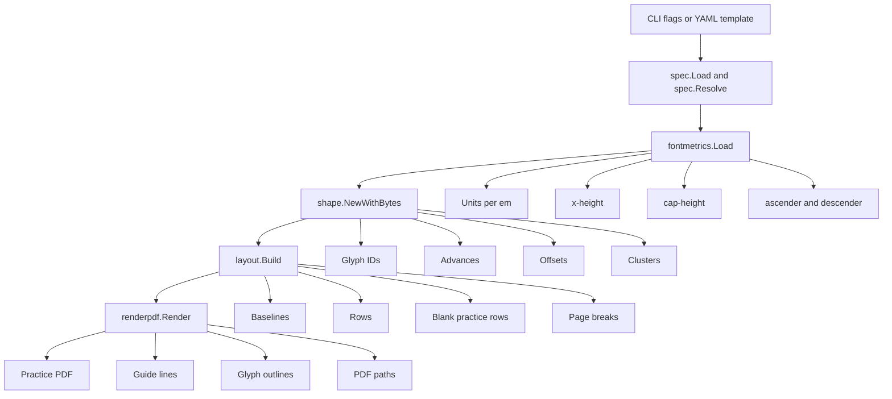
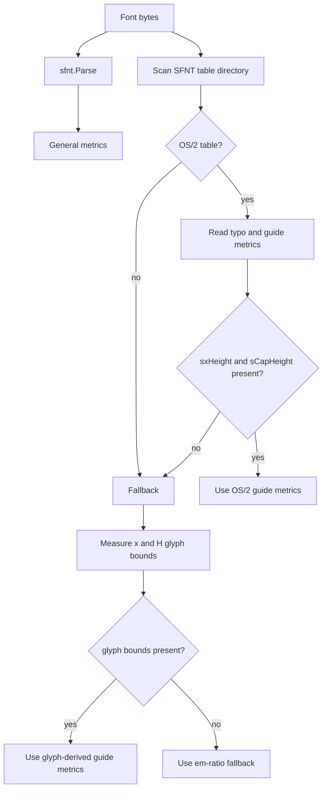

# Typo Copy Generator - Font Practice Sheet CLI

`typo-copy-generator` is a Go command-line project for producing printable typography copy-practice sheets from real font files. It takes an OpenType or TrueType font, turns glyphs, letter pairs, words, and blank practice rows into a structured page layout, and writes a PDF with model letters plus baseline, x-height, and cap-height guide lines. The immediate use case is hand-copying type forms on a reMarkable tablet in order to study letter construction, spacing, counters, contrast, and typeface rhythm.

> [!summary]
> The project has three important identities:
> 1. It is a typography learning tool: it generates copy sheets for studying real typefaces by hand.
> 2. It is a small font-processing pipeline: font metrics, text shaping, layout, and PDF path rendering are separate stages.
> 3. It is a record of an implementation process where visual feedback changed the code: several defects only appeared after opening the generated PDFs.

The repository lives at `/home/manuel/code/wesen/2026-05-22--typo-copy-generator`. The main implementation is under `cmd/typo-copy` and `internal/`. The project documentation, research sources, diary, and scripts are under `ttmp/2026/05/22/TYPO-COPY-001--font-copy-practice-sheet-cli/`.

## Why this project exists

The project exists because typeface design is easier to study when the learner can repeatedly copy large, accurately rendered forms with stable guide lines. A font specimen is useful for reading and comparison, but it does not usually provide the writing scaffolding needed for practice. A handwriting worksheet provides scaffolding, but it is usually disconnected from actual font metrics and modern OpenType shaping. This project connects those two requirements: it renders the actual shaped glyphs from a real font and places them on typographic guide lines derived from that font.

The initial requirement was not only to print single letters. The system had to support letter pairs and words because typography study includes spacing and substitution behavior. `AV`, `To`, and `Wa` show pair spacing. `fi`, `fl`, `ffi`, and `office` test whether shaping produces ligature glyphs. Words such as `affinity`, `minimum`, and `Typography` expose rhythm, stems, joins, bowls, counters, and repeated letter patterns. A tool that only maps one Unicode rune to one glyph would miss these parts of typography.

The project also exists as an automation tool around the reMarkable workflow. The generated PDFs are not just local test artifacts. They are meant to be opened, inspected, uploaded, and copied by hand. The final part of the session generated a typography practice pack and uploaded it to `/Learning/Typography` on reMarkable. This moved the project from code exercise to usable learning material.

## Current project status

The project is an active MVP. It already has a working end-to-end path:

- `typo-copy init-template` writes a starter YAML worksheet template.
- `typo-copy inspect-font` reports font metrics and shaping examples.
- `typo-copy render` generates PDFs from either a YAML template or quick command-line text.
- The renderer draws model glyphs as vector outlines, not as PDF text strings.
- The shaper uses `github.com/go-text/typesetting/harfbuzz` when available and falls back to SFNT-based glyph advances and legacy kerning.
- The layout engine supports row layout, wrapping, cell layout, model rows, and blank practice rows.
- The generated PDFs were visually inspected and corrected after user feedback.
- A practice pack script produces sheets for Didot, Libertine, Inter, Go Mono, Lobster, Cabin, and Go Smallcaps.
- An upload script uses `remarquee cloud put` to place PDFs in `/Learning/Typography`.

Important commits in the implementation history:

| Commit | Purpose |
| --- | --- |
| `a69ac47` | Added the independent design ticket and research sources. |
| `afb3752` | Implemented the first MVP CLI: spec parsing, metrics, shaping, layout, rendering, examples, tests. |
| `c2060e3` | Added cell layout mode. |
| `a05564d` | Integrated HarfBuzz shaping through `go-text/typesetting`. |
| `29bbdec` | Rendered shaped glyph IDs as vector outlines. |
| `1fdef85` | Fixed visual smoke-test issues: glyph orientation, wrapping, quick render behavior. |
| `c8b55cd` | Added typography practice pack generation and upload scripts. |

## The system in one pass

The tool is a deterministic transformation from a font and a worksheet description into a PDF page model and then into PDF graphics commands. The important design choice is that each stage has a narrow responsibility. The CLI does not know how glyph outlines work. The metrics package does not know about page wrapping. The renderer does not parse YAML. This separation made the later visual fixes localized.



The transformation has two separate forms of correctness. The first is typographic correctness: the system must use real font metrics, real shaping, and real glyph outlines. The second is worksheet correctness: the system must put model rows and practice rows in the right order, avoid overflowing the page, and keep guide lines visible and aligned. The visual debugging part of the session showed that both forms matter. A PDF can be non-empty and still be wrong.

## Project layout

The repository layout is deliberately small:

```text
/home/manuel/code/wesen/2026-05-22--typo-copy-generator
├── cmd/typo-copy/main.go
├── internal/
│   ├── cli/root.go
│   ├── spec/spec.go
│   ├── fontmetrics/font.go
│   ├── shape/shape.go
│   ├── layout/layout.go
│   └── renderpdf/render.go
├── examples/
│   ├── kerning-ligatures.yaml
│   └── cells.yaml
├── ttmp/2026/05/22/TYPO-COPY-001--font-copy-practice-sheet-cli/
│   ├── design/01-independent-2-analysis-and-implementation-guide.md
│   ├── reference/01-diary.md
│   ├── scripts/01-generate-typography-practice-pack.sh
│   ├── scripts/02-upload-typography-practice-pack.sh
│   └── sources/
├── README.md
├── Makefile
├── go.mod
└── go.sum
```

The `ttmp` subtree is part of the project because the work was managed as a docmgr ticket. It contains the design guide, diary, source captures, scripts, tasks, and changelog. The root Go module would normally scan subdirectories during `go test ./...`; this became a real problem because earlier documentation captures under `ttmp` contained `.go` files from other work. The fix was to add `ttmp/go.mod`, making the ticket workspace a nested module so the application test command does not try to compile documentation artifacts.

## User-facing commands

The CLI is implemented in `internal/cli/root.go`. It uses the standard library `flag` package rather than Cobra because the command surface is small. The command dispatcher has four subcommands:

```text
typo-copy init-template
typo-copy inspect-font
typo-copy render
typo-copy version
```

The commands are intentionally direct. `init-template` writes YAML. `inspect-font` helps the user see what the tool will use for metrics and shaping. `render` writes the PDF. `version` is a placeholder for build metadata.

Typical usage:

```bash
# Create a starter worksheet template.
go run ./cmd/typo-copy init-template \
  --font /usr/share/fonts/opentype/didot/GFSDidot.otf \
  --out practice.yaml \
  --pdf-out practice.pdf

# Inspect metrics and shaped runs.
go run ./cmd/typo-copy inspect-font \
  --font /usr/share/fonts/opentype/didot/GFSDidot.otf \
  --text "AV,To,fi,office" \
  --json

# Render quickly without a YAML file.
go run ./cmd/typo-copy render \
  --font /usr/share/fonts/opentype/didot/GFSDidot.otf \
  --text "H,O,A,V,n,o,a,e,AV,To,Wa" \
  --blank-lines 1 \
  --out out/didot-practice.pdf

# Render from a template.
go run ./cmd/typo-copy render \
  --template examples/kerning-ligatures.yaml \
  --out out/kerning-ligatures.pdf
```

The quick render path was corrected during visual testing. Initially, it reused the starter template, which also contained a free-practice section. That produced an unexpected extra blank guide row. Quick mode now constructs a minimal one-section `SheetSpec` containing only the requested row. This distinction is important: starter templates are instructional; quick render output should be literal.

## The worksheet specification

The YAML schema lives in `internal/spec/spec.go`. A worksheet describes font input, PDF output, page geometry, visual style, layout behavior, shaping options, and practice sections.

A compact template looks like this:

```yaml
version: 1
font: /usr/share/fonts/opentype/didot/GFSDidot.otf
output: didot-practice.pdf
page:
  size: A4
  orientation: portrait
  margin: {top: 42pt, right: 36pt, bottom: 36pt, left: 48pt}
style:
  point_size: 108pt
  labels: {show: true, font_size: 7pt}
layout:
  mode: row
  row_gap: 24pt
  item_gap: 36pt
  practice_lines_after_model: 1
  wrap: true
sections:
  - title: Didot Regular 2x - capitals and curves
    rows:
      - items: ["H", "O", "A", "V"]
        blank_lines: 1
      - items: ["n", "o", "a", "e"]
        blank_lines: 1
      - items: ["AV", "To", "Wa"]
        blank_lines: 1
```

The specification layer has three jobs. It defines the schema, supplies defaults, and resolves human-readable sizes such as `36pt`, `1in`, `25.4mm`, and `2.54cm` into PDF points. The `Resolved` type holds both the original specification and the point values needed by layout and rendering.

The key point is that all later stages should receive resolved values. The layout engine should not parse `"36pt"`; it should receive `36.0`. The renderer should not decide default line colors; it should receive a line style that has already been defaulted. This keeps policy in the specification layer.

## Font metrics

Typography practice sheets depend on vertical measurements. The baseline, x-height line, cap-height line, ascender line, and descender line are all defined relative to font metrics. The `fontmetrics` package loads a font with `golang.org/x/image/font/sfnt` and extracts the values needed by the worksheet.

The central type is:

```go
type Metrics struct {
    FontName   string `json:"fontName"`
    UnitsPerEm int    `json:"unitsPerEm"`
    GlyphCount int    `json:"glyphCount"`
    Ascender   int    `json:"ascender"`
    Descender  int    `json:"descender"`
    LineGap    int    `json:"lineGap"`
    XHeight    int    `json:"xHeight"`
    CapHeight  int    `json:"capHeight"`
    Source     string `json:"source"`
}
```

The font file defines outlines in font units. The PDF page is measured in points. The conversion is simple and appears throughout the implementation:

```text
scale = point_size / units_per_em
```

If a font has 1000 units per em and the worksheet uses 108pt model text, one font unit corresponds to 0.108 PDF points. If the cap-height is 660 units, the cap-height guide line is 71.28 points above the baseline in the PDF coordinate system used by the renderer.

The code prefers the OpenType OS/2 table when possible. It reads:

- `sTypoAscender`
- `sTypoDescender`
- `sTypoLineGap`
- `sxHeight`
- `sCapHeight`

If `sxHeight` or `sCapHeight` is absent, it falls back to glyph bounds for `x` and `H`. If those are also unavailable, it uses conservative ratios of the em square. This fallback chain is not a refinement; it is required because fonts in the wild are inconsistent. Some provide complete OS/2 metrics. Some do not. The worksheet should still render, but it should expose the metric source through `inspect-font`.



## Text shaping

The `shape` package converts input strings into positioned glyph runs. This is the stage that lets the tool handle more than one character at a time. The input text `AV` is not just `A` followed by `V`; the font may apply pair positioning. The input text `fi` may become a single ligature glyph. The input text `office` may contain a multi-character substitution depending on the font and enabled OpenType features.

The public data structure is:

```go
type Run struct {
    Text          string  `json:"text"`
    Glyphs        []Glyph `json:"glyphs"`
    AdvancePt     float64 `json:"advancePt"`
    MissingGlyphs int     `json:"missingGlyphs"`
    Engine        string  `json:"engine"`
    Note          string  `json:"note,omitempty"`
}

type Glyph struct {
    Rune       string  `json:"rune,omitempty"`
    Cluster    int     `json:"cluster"`
    GlyphID    uint16  `json:"glyphId"`
    XAdvancePt float64 `json:"xAdvancePt"`
    XOffsetPt  float64 `json:"xOffsetPt"`
}
```

The project uses `github.com/go-text/typesetting/harfbuzz` when the font can be parsed by that library. The shaper creates a HarfBuzz buffer, adds the input runes, guesses segment properties, sets the HarfBuzz font scale to `pointSize * 64`, and reads glyph IDs plus positions from `buf.Info` and `buf.Pos`.

The essential sequence is:

```go
buf := harfbuzz.NewBuffer()
runes := []rune(text)
buf.AddRunes(runes, 0, len(runes))
buf.GuessSegmentProperties()

hbf := harfbuzz.NewFont(face)
hbf.XScale = int32(pointSize * 64)
hbf.YScale = int32(pointSize * 64)

buf.Shape(hbf, features)

for i, info := range buf.Info {
    pos := buf.Pos[i]
    glyph := Glyph{
        Cluster:    info.Cluster,
        GlyphID:    uint16(info.Glyph),
        XAdvancePt: float64(pos.XAdvance) / 64.0,
        XOffsetPt:  float64(pos.XOffset) / 64.0,
    }
}
```

There is still an SFNT fallback path. It maps each rune to a glyph ID, reads glyph advances, and applies legacy kerning through `sfnt.Font.Kern` when available. That fallback cannot perform GSUB ligature substitution, but it makes the project robust when the HarfBuzz-compatible parser cannot read a font.

The design rule is that layout and rendering should consume shaped runs, not raw strings. A raw string is user intent. A shaped run is the font-specific drawing plan.

## Layout

The layout engine is in `internal/layout/layout.go`. Its input is the resolved worksheet specification, the extracted font metrics, and the shaper. Its output is an intermediate `Document` model:

```go
type Document struct {
    PageSizeName string
    PageWidth    float64
    PageHeight   float64
    Pages        []Page
    Metrics      fontmetrics.Metrics
}

type Row struct {
    Section   string
    BaselineY float64
    LeftX     float64
    RightX    float64
    PointSize float64
    Model     bool
    Items     []Item
}
```

This intermediate model is a key part of the design. It lets the renderer stay simple. The renderer does not decide which row comes next, whether a model row wraps, or how many blank practice rows to insert. It receives rows with baselines and items. It draws them.

The row height is computed from font metrics:

```go
scale := pointSize / float64(unitsPerEm)
above := max(ascender, capHeight) * scale
below := -descender * scale
rowHeight := above + below + rowGap
```

The baseline is placed at `marginTop + above`, so the region above the baseline has room for capitals and ascenders. The baseline then advances by `rowHeight` for each visual row.

The engine supports two layout modes:

1. **Row mode.** Items are placed left to right with an item gap. If wrapping is enabled and an item would overflow, the current visual row is flushed and a new model row starts. Each visual model row gets its own blank practice rows.
2. **Cell mode.** Items are chunked into fixed-width columns. Each chunk becomes a model row. Items are centered in their cells. Each chunk gets its own blank practice rows.

The visual feedback session established an important policy: practice rows belong to visual model rows, not only to logical YAML rows. If a logical row wraps into two model rows and `blank_lines: 1`, the result should be:

```text
model row 1
blank row
model row 2
blank row
```

This is now covered by `TestRowWrapAlternatesModelAndBlankRows` in `internal/layout/layout_test.go`.

## PDF rendering

The renderer is in `internal/renderpdf/render.go`. It uses `github.com/go-pdf/fpdf` to write PDF pages and path commands. The renderer draws two kinds of objects: guide lines and glyph outlines.

Guide lines are computed from row baselines and font metrics:

```go
capY      := baselineY - capHeight * scale
xHeightY  := baselineY - xHeight * scale
baselineY := baselineY
descY     := baselineY - descender * scale
```

The baseline is black and solid by default. The x-height and cap-height lines are dashed and colored. Ascender and descender lines exist in the schema but are off by default.

The important change in the renderer is that model glyphs are not drawn with `pdf.Text`. They are drawn by glyph ID. For each shaped glyph, the renderer calls `sfnt.LoadGlyph`, converts the returned outline segments into PDF path commands, and fills the path. This means the renderer draws the actual glyph IDs produced by HarfBuzz, including ligature glyph IDs when the font and feature settings produce them.

The core loop is:

```go
func drawRun(pdf *fpdf.Fpdf, font *sfnt.Font, m Metrics, pointSize, x, baseline float64, glyphs []shape.Glyph) {
    cursor := x
    for _, g := range glyphs {
        drawGlyph(pdf, font, m, pointSize, g.GlyphID, cursor+g.XOffsetPt, baseline)
        cursor += g.XAdvancePt
    }
}
```

The path renderer handles four SFNT segment types:

- `MoveTo`
- `LineTo`
- `QuadTo`
- `CubeTo`

PDF supports cubic Bézier curves. TrueType outlines often contain quadratic curves. The renderer converts a quadratic curve from `P0` through control point `P1` to endpoint `P2` into cubic controls:

```text
C1 = P0 + 2/3 * (P1 - P0)
C2 = P2 + 2/3 * (P1 - P2)
```

The coordinate conversion was a real source of error. The first visual render showed glyphs flipped vertically. The fix was to treat the `sfnt.LoadGlyph` coordinates as Y-down in the way Go's own rasterization examples expose them for the tested fonts: negative Y values sit above the Latin baseline. Since `fpdf` also accepts public coordinates in a Y-down page coordinate system, the correct conversion is:

```text
x_pdf = origin_x + font_x * scale
y_pdf = baseline_y + font_y * scale
```

The code now documents that decision where the conversion happens. This is an example of a detail that should stay close to the code because a future maintainer might otherwise change the sign and reintroduce the flipped-glyph bug.

## The visual debugging sequence

The most important implementation lesson from this project is that PDF generation requires visual inspection. The first automated tests passed because the generated PDF existed and was non-empty. That did not prove the worksheet was usable.

The visual smoke test used Go Regular and this quick command:

```bash
go run ./cmd/typo-copy render \
  --font /usr/share/fonts/fonts-go/Go-Regular.ttf \
  --text 'A,V,AV,To,fi,office,O,B,a,e,g,8' \
  --blank-lines 1 \
  --out out/smoke-go-regular-4rows-fixed.pdf \
  --debug-shaping

pdftoppm -png -f 1 -singlefile -r 120 \
  out/smoke-go-regular-4rows-fixed.pdf \
  out/smoke-go-regular-4rows-fixed-page1

open out/smoke-go-regular-4rows-fixed.pdf
```

This exposed several defects:

| Defect | Symptom | Fix |
| --- | --- | --- |
| Glyph Y sign was wrong. | Letters were vertically flipped and hung from the baseline. | Change glyph coordinate conversion to add scaled SFNT Y to the baseline. |
| Row wrapping was incomplete. | Later items overlapped earlier items or continued past the right edge. | Make row wrapping create additional visual model rows. |
| Quick mode did not enable wrapping. | Long quick-mode rows still overflowed. | Set `s.Layout.Wrap = true` in quick mode and starter specs. |
| Header used an en dash. | Header rendered as `—` under built-in Helvetica text. | Use ASCII `-` in the PDF header. |
| Quick mode reused starter sections. | An extra free-practice blank row appeared. | Build a minimal one-section quick-mode spec. |
| Blank-row policy was ambiguous. | Wrapped rows had either too many blanks or blanks in the wrong place. | Emit blank rows after each visual model row; test `model, blank, model, blank`. |

This sequence changed the project. It added tests, but it also clarified what tests cannot cover alone. The project now has both automated tests and a repeatable visual smoke command.

## Typography practice pack

After the CLI worked, the project produced actual learning material. The script `ttmp/2026/05/22/TYPO-COPY-001--font-copy-practice-sheet-cli/scripts/01-generate-typography-practice-pack.sh` generates a set of PDFs in `out/typography-practice-pack`.

The pack includes:

| PDF | Font | Practice focus |
| --- | --- | --- |
| `01-didot-contrast.pdf` | GFS Didot | Contrast, capitals, curves, `AV`, `To`, `Wa`, repeated patterns. |
| `02-libertine-serif.pdf` | Linux Libertine | Serif lowercase, counters, descenders, ligatures, word rhythm. |
| `03-libertine-italic.pdf` | Linux Libertine Italic | Italic forms, joins, descenders, flowing words. |
| `04-inter-modern.pdf` | Inter Regular | Modern sans forms, uppercase structure, interface-like word shapes. |
| `05-inter-black.pdf` | Inter Black | Heavy sans mass, counters, round forms, digits. |
| `06-go-mono.pdf` | Go Mono | Monospace distinctions: `i`, `l`, `I`, `1`, `0`, `O`, punctuation. |
| `07-lobster-script.pdf` | Lobster | Script forms, connected rhythm, large swash-like curves. |
| `08-cabin-humanist.pdf` | Cabin | Humanist sans lowercase, bowls, apertures, pairs. |
| `09-smallcaps.pdf` | Go Smallcaps | Small-cap proportions and uppercase rhythm. |
| `10-didot-regular-2x.pdf` | GFS Didot | Larger 108pt Didot practice for capitals, lowercase, and pairs. |
| `11-didot-regular-3x.pdf` | GFS Didot | Very large 162pt Didot practice for studying stroke contrast and form. |

The upload script `02-upload-typography-practice-pack.sh` uses `remarquee cloud put` because the `remarquee upload md` and `remarquee upload bundle` commands only accept Markdown input and generate PDFs themselves. Existing generated PDFs need the cloud put path.

```bash
remarquee cloud mkdir /Learning --non-interactive 2>/dev/null || true
remarquee cloud mkdir /Learning/Typography --non-interactive 2>/dev/null || true

for pdf in out/typography-practice-pack/*.pdf; do
  remarquee cloud put "$pdf" /Learning/Typography/ --non-interactive
  sleep 2
done
```

The initial attempt to use direct `rmapi put` hit cloud authentication and rate-limit issues. `remarquee cloud put` succeeded after creating the target directory.

## Tests and validation

The project has unit and smoke tests across the main package boundaries:

- `internal/spec/spec_test.go` tests length parsing and starter spec validity.
- `internal/fontmetrics/font_test.go` tests metric extraction against the embedded Go Regular font.
- `internal/cli/root_test.go` tests command smoke paths including YAML generation, inspection, dry-run layout, and PDF generation.
- `internal/layout/layout_test.go` tests cell chunking and wrapped row alternation.
- `internal/shape/shape_test.go` tests the HarfBuzz path.
- `internal/renderpdf/render_test.go` tests quadratic-to-cubic conversion.

The baseline validation command is:

```bash
go test ./...
go build ./cmd/typo-copy
```

The visual validation command is different and should remain part of the workflow:

```bash
go run ./cmd/typo-copy render \
  --font /usr/share/fonts/fonts-go/Go-Regular.ttf \
  --text 'A,V,AV,To,fi,office,O,B,a,e,g,8' \
  --blank-lines 1 \
  --out out/smoke-go-regular-4rows-fixed.pdf \
  --debug-shaping

pdftoppm -png -f 1 -singlefile -r 120 \
  out/smoke-go-regular-4rows-fixed.pdf \
  out/smoke-go-regular-4rows-fixed-page1

open out/smoke-go-regular-4rows-fixed.pdf
```

A future test suite can compare layout JSON deterministically. PDF bytes are less suitable for golden tests because metadata and graphics serialization can change even when the page is visually equivalent. The current best split is: test layout as structured data, test math as unit functions, and visually inspect representative PDF output.

## Design decisions that shaped the implementation

### The tool consumes fonts; it does not create fonts

The first user wording included the phrase "creates a .otf file and a yaml template to create pdf," which was ambiguous. The project settled on consuming `.otf` and `.ttf` files. That interpretation matches the rest of the requirements: choose glyphs, render guide lines, practice pairs and words, and generate PDFs.

Creating or modifying font files would be a separate domain. It would require font generation, naming tables, glyph outlines, cmap tables, OpenType layout tables, and validation. This project is a practice-sheet generator, not a font editor.

### The renderer draws glyph outlines rather than PDF text

The project initially used PDF text drawing because it was the fastest path to visible output. That approach was not good enough for shaped glyph IDs. A PDF text call receives a string, not the exact HarfBuzz output. It may or may not apply the same substitutions depending on the PDF library and viewer. The final renderer draws outlines from glyph IDs, which makes shaping and rendering part of the same pipeline.

### The layout model sits between shaping and rendering

The intermediate `layout.Document` model is not an extra abstraction for its own sake. It lets the code answer questions before writing PDF commands:

- How many visual rows exist after wrapping?
- Where is each baseline?
- Which rows are model rows and which are blank rows?
- What x-position should each shaped run use?
- Does the page need a new page before the next row?

This is also what makes `--dry-run` useful. The layout can be inspected without opening a PDF.

### Visual feedback is part of correctness

The project became correct only after rendering, converting, opening, and inspecting PDFs. The fixes were not cosmetic. They changed coordinate conversion, wrapping behavior, quick-mode spec construction, and row policy. The working rule for this project should be: any change to rendering or layout requires a visual smoke test.

## Open questions

The project is usable, but several decisions remain open:

- Should model glyphs be filled black, stroked outlines, gray, or configurable per sheet?
- Should the worksheet support opacity for model glyphs, making tracing easier?
- Should guide-line spacing and label placement be tuned for reMarkable specifically?
- Should cell mode draw cell boundaries or segmented guide lines instead of full-width lines?
- Should ligature and kerning examples be auto-selected from a font's available features?
- Should the renderer support right-to-left and complex scripts beyond the Latin-focused MVP?
- Should generated practice packs be checked in, or should they remain reproducible artifacts under `out/`?

The current answer to the last question is that `out/` remains untracked. The scripts are committed; generated PDFs are artifacts.

## Near-term next steps

The next useful work is not broad architecture. It is refinement from use:

1. Add glyph style options: filled, outline, gray fill, and trace mode.
2. Add a `--point-size` quick-render flag so large sheets can be made without writing YAML.
3. Add a `--practice-profile` command that generates predefined packs such as `didot-large`, `serif-lowercase`, `sans-caps`, and `mono-disambiguation`.
4. Add layout JSON golden tests for wrapping and blank-row policy.
5. Add visual sample generation to `make smoke-pdf`.
6. Add a short README section explaining how to upload PDFs with `remarquee cloud put`.
7. Add reMarkable-oriented defaults for larger point sizes and fewer items per row.

## Project working rule

Every rendering change must be tested in three ways:

```bash
go test ./...
go run ./cmd/typo-copy render ... --out out/smoke.pdf
pdftoppm -png -f 1 -singlefile -r 120 out/smoke.pdf out/smoke-page1
open out/smoke.pdf
```

The PNG should be inspected before committing. The visual checks should include at least one capital, one lowercase round form, one descender, one kerning pair, and one multi-character word. This rule exists because the most important bugs in this project were visual: flipped glyphs, overflow, unexpected blank rows, and incorrect row grouping.

## Related project documents

- Design guide: `/home/manuel/code/wesen/2026-05-22--typo-copy-generator/ttmp/2026/05/22/TYPO-COPY-001--font-copy-practice-sheet-cli/design/01-independent-2-analysis-and-implementation-guide.md`
- Diary: `/home/manuel/code/wesen/2026-05-22--typo-copy-generator/ttmp/2026/05/22/TYPO-COPY-001--font-copy-practice-sheet-cli/reference/01-diary.md`
- Practice pack generator: `/home/manuel/code/wesen/2026-05-22--typo-copy-generator/ttmp/2026/05/22/TYPO-COPY-001--font-copy-practice-sheet-cli/scripts/01-generate-typography-practice-pack.sh`
- Practice pack upload script: `/home/manuel/code/wesen/2026-05-22--typo-copy-generator/ttmp/2026/05/22/TYPO-COPY-001--font-copy-practice-sheet-cli/scripts/02-upload-typography-practice-pack.sh`
- Main CLI implementation: `/home/manuel/code/wesen/2026-05-22--typo-copy-generator/internal/cli/root.go`
- Font metrics: `/home/manuel/code/wesen/2026-05-22--typo-copy-generator/internal/fontmetrics/font.go`
- Shaping: `/home/manuel/code/wesen/2026-05-22--typo-copy-generator/internal/shape/shape.go`
- Layout: `/home/manuel/code/wesen/2026-05-22--typo-copy-generator/internal/layout/layout.go`
- PDF rendering: `/home/manuel/code/wesen/2026-05-22--typo-copy-generator/internal/renderpdf/render.go`
