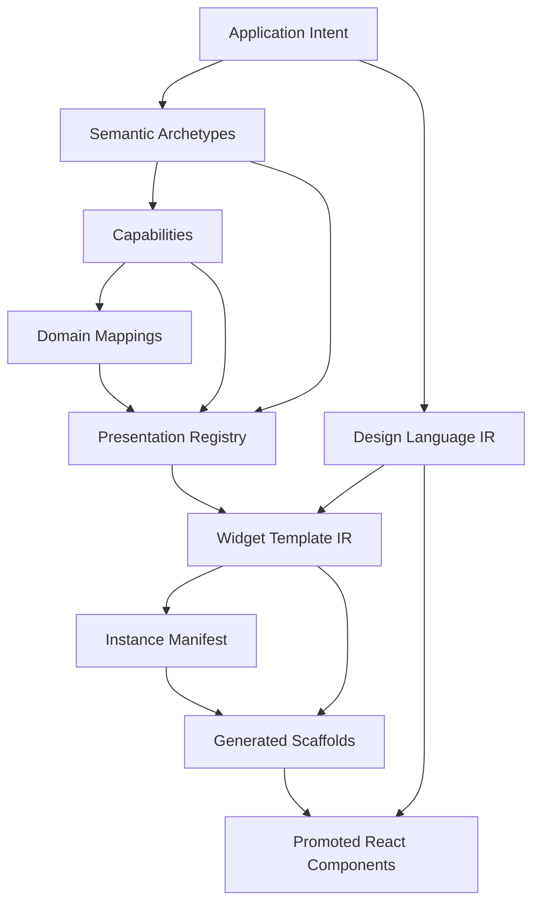
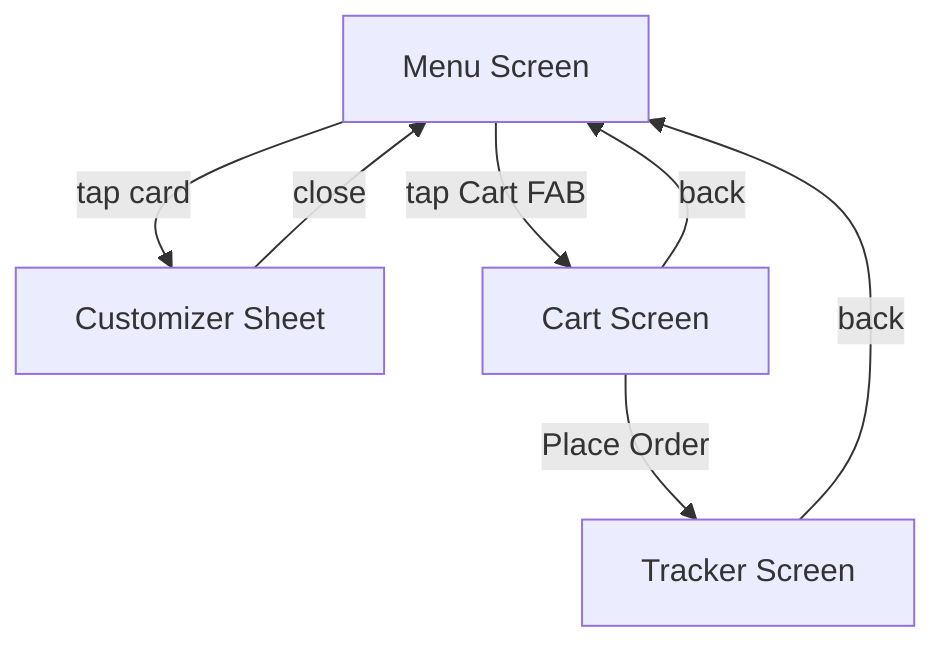
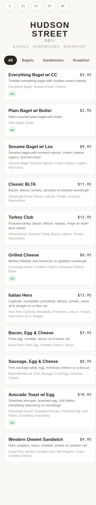
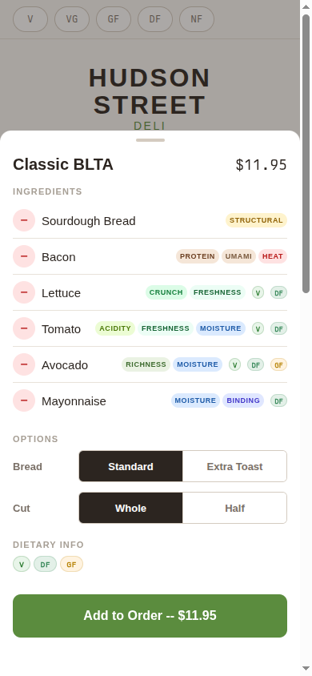
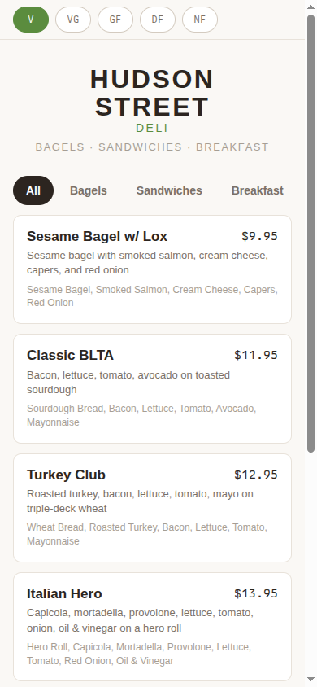
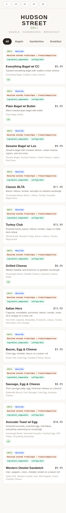

# DMETA Design System Factory: From Semantic Schemas to Generated React Widgets

This article documents the complete workflow of the DMETA design-system factory, from defining semantic archetypes and capabilities in YAML, through defining widget templates with projection hints, to generating and promoting React widget scaffolds for a concrete domain instance. The concrete domain used throughout is the Hudson Street Deli mobile ordering application: a sandwich counter where customers browse a menu, customize compositions by removing or substituting ingredients, review their cart, and track order preparation status.

The article covers the conceptual model (archetypes, capabilities, projections, presentations), the schema definitions (YAML IR structure), the code-generation pipeline (`validate-ir`, `plan-instance`, `scaffold-instance`), the reflection-first scaffold philosophy, and the promotion workflow from generated placeholder to working React component. It walks through every layer of the Street Deli instance in detail: the domain type mappings, the eight selected widget templates, the generated scaffold files, and the promoted React implementation.

> [!summary]
> This article preserves four core ideas:
> 1. DMETA separates *what a UI is semantically about* from *how it renders*. Archetypes, capabilities, and projections define the semantic layer; widget templates and design-language IR define the rendering layer. Code generation bridges them.
> 2. The reflection-first scaffold philosophy means generated widgets carry semantic context as guidance, not as mandatory layout instructions. A scaffold explains *why* a widget was selected and *which projections may matter*, but the implementor decides the final prop shape and markup.
> 3. The Street Deli domain demonstrates the full pipeline end to end: twelve menu items mapped onto ProductComposition and WorkItem archetypes, eight widgets selected from template catalogs, scaffolds generated with metadata sidecars and adapter TODOs, and all eight promoted to working React components.
> 4. The DMETA CLI commands (`validate-ir`, `plan-instance`, `scaffold-instance`) provide computational guardrails. Every archetype reference, capability projection, and widget selection is validated before generation proceeds.

## Why this note exists

The DMETA system spans multiple repositories, YAML schemas, Go code generators, and React implementations. Understanding the full pipeline requires connecting concepts that live in separate files: the semantic archetype model, the widget template catalog, the instance manifest, the design-language IR, the generated scaffold output, and the promoted React components. This article exists to provide a single document that connects all of those layers, with concrete file references, pseudocode, and diagrams. A reader who finishes this article should be able to instantiate a new DMETA domain, define widget templates, run the generation pipeline, and promote scaffolds to working React components without needing to read ten separate spec documents first.

## When to use this pattern

Use the DMETA design-system factory pattern when:

- You need to produce a family of dense operational UIs that share semantic vocabulary but differ in visual surface (mobile cards vs desktop tables vs timeline views).
- You want generated scaffolds that carry semantic provenance rather than blank placeholder components.
- You need computational validation of archetype references, capability projections, and widget selections before code generation.
- You want lint rules derived from a design-language IR that can enforce visual consistency across promoted widgets.

The pattern is not appropriate for a single one-off UI that will not be extended or reused. It is also not appropriate if the domain has no stable semantic structure that can be expressed as archetypes and capabilities.

## The DMETA Layer Model

DMETA organizes the design-system factory into nine layers. Each layer answers a different question and has a different consumer. The layers are ordered from most abstract (closest to human intent) to most concrete (closest to running code).



| Layer | Question it answers | Primary consumer |
|---|---|---|
| Application intent | What app family are we designing for? | Product owner, designer |
| Semantic archetypes | Which reusable operational roles recur across domains? | Capability and presentation authors |
| Capabilities | What affordances can an object have? | Widget and presentation authors |
| Domain mappings | How do app-specific objects map onto archetypes? | Adapter implementors |
| Presentations | How can semantic values appear on screen? | Widget authors, action routers |
| Widget template IR | What React component classes consume those presentations? | Scaffold generator |
| Design language IR | What visual/interaction constraints apply? | React implementor, lint rules |
| Instance manifest | Which widgets are selected for this concrete app? | Scaffold generator |
| Generated scaffolds | What is the starting point for each widget? | React implementor (promotes) |
| Promoted React | What ships? | Users, Storybook, lint, audit |

The key insight is that these layers are not interchangeable. A presentation answers "how can this value appear on screen?" A widget template answers "what component class consumes those presentations?" A design language answers "what visual constraints make the UI dense but calm?" Confusing these layers leads to domain leakage (putting `MenuItem` in the base factory) or premature hardening (fixing exact pixel values in the generic archetype).

## Semantic Archetypes

An archetype is a reusable functional role that appears across many applications. Archetypes form an explicit inheritance tree rooted at the abstract `Archetype` class. The Street Deli domain uses these archetypes:

| Archetype | Extends | Abstract? | Description |
|---|---|---|---|
| `Archetype` | -- | yes | Root of the inheritance tree |
| `Composition` | Archetype | yes | Something assembled from parts |
| `ProductComposition` | Composition | yes | Composition intended to become a sellable product |
| `ProductSpec` | Archetype | yes | Product metadata side (name, description, price) |
| `MenuItem` | ProductSpec, ProductComposition | no | A sellable menu item |
| `WorkItem` | Archetype | no | Something with state and progress |
| `OrderItem` | WorkItem, ProductComposition | no | An item in an order |
| `Resource` | Archetype | no | A reusable thing with identity |
| `Ingredient` | Resource | no | An individual ingredient |
| `Substitution` | Archetype | yes | A replacement rule |
| `SubstitutionSuggestion` | Substitution | no | A concrete replacement suggestion |

Archetypes are defined in YAML files under the `core-model/` directory. The Street Deli domain example file is `examples/street-deli-ordering/core-model/street-deli-ordering.yaml`. An entry looks like this:

```yaml
MenuItem:
  description: Composable food item on the menu (sandwich, bowl, platter, combo).
  archetypes:
    - Composition
    - ActionSpec
  capabilities:
    identifiable:
      id: menu_item_id
    labelable:
      label: item_name
      subtitle: description
    composable:
      parts: ingredients
      part_count: ingredient_count
      required_roles:
        - structural
        - protein
      optional_roles:
        - richness
        - moisture
        - acidity
        - crunch
        - garnish
    configurable:
      config_options:
        - name: size
          values: [half, whole]
          default: whole
    dietary:
      dietary_tags: item_dietary_tags
      allergen_contains: item_allergens
```

The important rule is that concrete domain types like `MenuItem` and `OrderItem` should never become base factory concepts. They map onto archetypes. The factory vocabulary stays domain-neutral. If `MenuItem` were a base archetype, the factory could not serve a retail logistics domain or an agricultural sensor domain. By keeping `MenuItem` as a mapping onto `ProductComposition` and `WorkItem`, the factory vocabulary remains reusable.

Archetypes support multiple inheritance. `MenuItem` extends both `ProductSpec` (which carries product metadata) and `ProductComposition` (which carries ingredient-role semantics). `OrderItem` extends both `WorkItem` (which carries state and progress) and `ProductComposition` (which carries the same composition semantics as `MenuItem`). This inheritance is explicit in the YAML and resolved computationally by the Go inheritance resolver at `pkg/dmeta/validator/inheritance.go`.

## Capabilities and Projections

A capability is a reusable affordance or behavior. Capabilities also form an inheritance tree rooted at the abstract `Capability` class. Each capability declares projections: typed fields that can be rendered on screen.

The Street Deli domain uses these capabilities:

| Capability | Extends | Required projections | Description |
|---|---|---|---|
| `identifiable` | Capability | `id` | Has a stable identity |
| `labelable` | Capability | `label` | Has a display name |
| `stateful` | Capability | `state` | Has operational state |
| `temporal` | Capability | -- | Has time semantics |
| `available` | stateful, temporal | `availability_state`, `state` | Has availability state |
| `measurable` | Capability | `value` | Has numeric value |
| `dietary` | Capability | `dietary_tags` | Carries dietary constraint tags |
| `composable` | Capability | `parts` | Assembled from parts |
| `ingredient_composable` | composable, role_composable | `ingredient_roles`, `parts` | Food composition with ingredient roles |
| `configurable` | Capability | `config_options` | Has customer-configurable options |
| `substitutable` | Capability | `replaces`, `replacement_candidates` | Can be replaced |
| `role_preserving_substitutable` | substitutable | `replaces`, `replacement_candidates` | Substitution that preserves functional roles |
| `dietary_substitutable` | dietary, substitutable | `dietary_tags`, `replaces`, `replacement_candidates` | Substitution filtered by dietary compatibility |
| `price_aware_substitutable` | measurable, substitutable | `value`, `replaces`, `replacement_candidates` | Substitution with price impact |

A projection is a typed field on a capability. The projection `ingredient_composable.parts` refers to the `parts` projection of the `ingredient_composable` capability. The projection `dietary.dietary_tags` refers to the `dietary_tags` projection of the `dietary` capability. Projections are the bridge between the semantic model and the UI: a widget template's projection hints reference projections as `<capability_id>.<projection_name>` strings.

The Go inheritance resolver at `pkg/dmeta/validator/inheritance.go` computes effective projections. If `ingredient_composable` inherits from `composable` and `role_composable`, then `ingredient_composable` has access to all projections declared by its ancestors. The resolver also computes effective presentations, effective actions, and effective filters for each capability.

The resolver's public API is:

```go
func ResolveCoreInheritance(core CoreModelFile) (*ResolvedCoreModel, []Finding)
func (r *ResolvedCoreModel) IsArchetypeA(child, ancestor string) bool
func (r *ResolvedCoreModel) IsCapabilityA(child, ancestor string) bool
```

The TypeScript helpers generated from this resolver allow the React implementor to ask semantic questions at runtime:

```ts
export function isArchetypeA(child: ArchetypeId, ancestor: ArchetypeId): boolean;
export function isCapabilityA(child: CapabilityId, ancestor: CapabilityId): boolean;
```

This means a React component can ask: "Does this OrderItem satisfy WorkItem?" or "Does this substitution satisfy role_preserving_substitutable?" without hard-coding the archetype tree.

## Presentations and Actions

A presentation is a named display contract. It answers the question: "How can a semantic value appear on screen?" Presentations attach at three levels:

| Level | Example | When to use |
|---|---|---|
| Capability | `status_badge` attaches to `stateful`; `dietary_badge` attaches to `dietary` | The presentation represents one reusable affordance |
| Archetype | `composition_card` attaches to `ProductComposition` | The presentation composes multiple capabilities into a recognizable object |
| Domain type | Custom presentation for a domain-specific edge case | Only when the generic presentation is insufficient |

The Street Deli domain uses these key presentations:

| Presentation | Layer | Role | Attached to |
|---|---|---|---|
| `composition_card` | archetype | `summary_card` | ProductComposition |
| `composition_detail` | archetype | `detail_panel` | ProductComposition |
| `ingredient_list` | capability | `composition_list` | ingredient_composable |
| `substitution_badge` | capability | `badge` | substitutable |
| `substitution_pair` | capability | -- | substitutable |
| `substitution_detail` | capability | -- | substitutable |
| `dietary_badge` | capability | -- | dietary |
| `allergen_warning` | capability | -- | dietary |
| `status_badge` | capability | -- | stateful |
| `prep_status_indicator` | capability | -- | available |
| `config_selector` | capability | -- | configurable |
| `order_item_row` | archetype | -- | WorkItem + ProductComposition |

Presentations are selectable and actionable. A user can tap a `composition_card` to open a `composition_detail`. A user can tap a `substitution_badge` to see `substitution_detail` alternatives. An action like `substitute_part` can start from a presentation and fill its argument by selecting another matching presentation on screen. This is what "presentation-based UI" means: actions declare what semantic types they accept, and the UI routes those actions through on-screen presentations rather than through raw domain object references.

Actions for the Street Deli domain include `remove_part`, `add_part`, `substitute_part` (from `ingredient_composable`), `apply_substitution`, `reject_substitution`, `see_alternatives` (from `role_preserving_substitutable`), `filter_by_dietary` (from `dietary`), and `filter_by_state` (from `stateful`).

## The YAML IR Structure

The DMETA IR is organized as a package of YAML files. For the Street Deli instance, the package root is `examples/street-deli-ordering/` and its structure is:

```text
examples/street-deli-ordering/
  00-index.yaml                  # Package index
  01-core-model.yaml            # Core model package index
  02-design-language.yaml       # Design language IR
  03-widgets.yaml               # Widget template catalog (deprecated, now local)
  core-model/
    core-model.yaml             # Shared metadata, logical types, authoring guidance
    archetypes.yaml             # Archetype definitions with inheritance
    capabilities.yaml           # Capability definitions with projections
    presentations.yaml           # Presentation and action definitions
    street-deli-ordering.yaml   # Domain example: concrete type mappings
  instantiations/
    street-deli-ordering.yaml   # Instance manifest: selected/excluded widgets
  widget-templates/
    00-index.yaml               # Local template catalog index
    item-cards.yaml             # Composition card, simple item, variant, bundle, special
    menu-browsing.yaml          # Menu browser template
    customization.yaml          # Composition customizer template
    substitutions.yaml          # Ingredient row, substitution chip templates
    ordering.yaml                # Order cart template
    modifiers.yaml               # Modifier group templates
    availability.yaml            # Availability badge template
    tracking.yaml                # Order tracker template
  generated/
    widgets/                     # Generated scaffold output
      StreetDeliCompositionCard/
      StreetDeliCompositionCustomizer/
      StreetDeliIngredientRow/
      StreetDeliMenuBrowser/
      StreetDeliOrderCart/
      StreetDeliOrderTracker/
      StreetDeliRoleTag/
      StreetDeliSubstitutionChip/
  www/
    mobile/                      # Static HTML/CSS/JS prototype (UX reference)
    mobile-react/                # Promoted React implementation
```

The YAML files carry both machine-readable schema fields and human-readable prose. Every archetype has `description` and `long_description`. Every capability has `description` and `long_description`. Every presentation has `description` and `long_description`. The design-language IR includes `long_summary`, `long_purpose`, and explanatory prose in every section. This is intentional: the YAML must serve as both generator input and intern documentation. A new team member should be able to read the YAML files and understand the domain without needing to cross-reference ten separate spec documents.

The `core-model/street-deli-ordering.yaml` file contains the domain example: concrete type mappings from domain objects (Customer, Station, MenuItem, Ingredient, SubstitutionRule) onto archetypes and capabilities. This file is the bridge between the generic factory vocabulary and the concrete deli domain.

## The Instance Manifest

The instance manifest at `instantiations/street-deli-ordering.yaml` is the single source of truth for which widgets are selected and which are excluded for this concrete application. It defines:

- The instance ID and name.
- The template source paths (global IR root + local template files).
- The generation output directory and package name.
- The selected templates: each with a template ID, component name, variant, and reason.
- The excluded templates: each with a template ID and reason.

For Street Deli, eight templates are selected:

```yaml
selected_templates:
- template: deli.menu_browser
  as: StreetDeliMenuBrowser
  variant: mobile_cards
  reason: Primary mobile ordering entrypoint needs category browsing and menu-item cards.
- template: deli.composition_card
  as: StreetDeliCompositionCard
  variant: mobile_default
  reason: Sandwiches and bowls need compact composition summaries with dietary and price data.
- template: deli.composition_customizer
  as: StreetDeliCompositionCustomizer
  variant: bottom_sheet
  reason: Ingredient removal and intelligent substitutions are the core sandwich customization workflow.
- template: deli.ingredient_row
  as: StreetDeliIngredientRow
  variant: mobile_default
  reason: Customizer needs explicit ingredient rows with remove/substitute actions.
- template: deli.substitution_chip
  as: StreetDeliSubstitutionChip
  variant: mobile_default
  reason: Replacement suggestions need a compact reusable action presentation.
- template: deli.order_cart
  as: StreetDeliOrderCart
  variant: mobile_bottom_sheet
  reason: Ordering flow needs cart review, totals, and submit actions.
- template: deli.order_tracker
  as: StreetDeliOrderTracker
  variant: compact_status
  reason: After order submission, users need preparation status and pickup state.
- template: deli.role_tag
  as: StreetDeliRoleTag
  variant: compact_mode
  reason: Ingredient roles are central to explaining substitutions and composition structure.
```

Six templates are excluded with explicit reasons:

```yaml
excluded_templates:
- template: dmeta.detail_drawer
  reason: The mobile ordering flow uses bottom-sheet/full-screen surfaces instead of desktop detail drawers.
- template: dmeta.dense_table
  reason: The street-deli flow is card/customizer/cart oriented, not table oriented.
- template: dmeta.record_stream
  reason: The customer app does not expose high-volume event streams.
- template: dmeta.action_palette
  reason: The mobile app uses explicit tap actions rather than a command palette.
- template: deli.simple_menu_item_card
  reason: The sandwich instance uses composition cards for its primary items; simple fixed items are deferred.
- template: deli.bundle_menu_item_card
  reason: Bundles/catering are not part of this initial sandwich ordering flow.
```

The exclusion reasons are important. They document *why* certain templates were not selected, which prevents future implementors from accidentally adding them without understanding the original decision. A `dmeta.dense_table` in a mobile card-oriented app would violate the design language's layout primitives, and the exclusion reason makes that explicit.

## Widget Template YAML with Semantic Context

Widget templates are defined in YAML files under `widget-templates/`. Each template declares:

- **`id` and `name`**: The template identifier and display name.
- **`classification`**: Molecule vs organism level and functional role.
- **`intent`**: Purpose and adapter boundary description.
- **`consumes`**: Which presentations, archetypes, and capabilities the template is related to (for validation and compatibility checking).
- **`semantic_context`**: Reflective context explaining what the template is about and why inherited semantics may matter.
- **`projection_hints`**: Which projections are recommended, optional, documentation-only, or require adapter TODOs.
- **`generation`**: Generation policy controlling what the scaffolder emits.
- **`contract`**: The prop shape and action slots the widget exposes.
- **`stories`**: Suggested Storybook story names.

The `deli.composition_card` template is a good example. It consumes the `composition_card` presentation, the `ProductComposition` archetype, and the `ingredient_composable`, `dietary`, and `measurable` capabilities. Its semantic context explains why `MenuItem` satisfies this template without requiring every variant to display the full ingredient role graph. Its projection hints suggest that `labelable.label`, `measurable.value`, `ingredient_composable.parts`, and `dietary.dietary_tags` are recommended, while `available.availability_state` is optional.

```yaml
- id: deli.composition_card
  name: CompositionCard
  consumes:
    archetypes:
      - Composition
    presentations:
      - composition_card
    capabilities:
      - composable
      - dietary
      - measurable
  semantic_context:
    archetypes:
      - ProductComposition
    capabilities:
      - ingredient_composable
      - dietary
      - measurable
      - available
    presentations:
      - composition_card
    intent: >
      Render a mobile menu card for a sellable ingredient composition. The semantic model
      explains why MenuItem fits here without requiring every variant to render the full
      ingredient role graph.
    inherited_context_note: >
      MenuItem extends ProductSpec and ProductComposition, so it satisfies both product
      browsing and composition customization context.
  projection_hint:
    recommended:
      - labelable.label
      - measurable.value
      - ingredient_composable.parts
      - dietary.dietary_tags
    optional:
      - available.availability_state
      - ingredient_composable.required_roles
      - ingredient_composable.ingredient_roles
    documentation_only:
      - ingredient_composable.role_profile
    adapter_todos:
      - Decide whether the selected variant shows a short ingredient summary or full ingredient rows.
      - Keep dietary/allergen information visible when safety-relevant.
  generation:
    scaffold_mode: adapter_todos
    emit_semantic_metadata: true
    emit_doc_comments: true
    emit_adapter_todos: true
    strict_projection_adapter: false
```

The `generation.scaffold_mode` field controls what the scaffolder produces. There are three modes:

| Mode | What gets generated |
|---|---|
| `reflective` | Metadata, doc comments, Storybook docs, README. No adapter TODOs, no projection adapters. |
| `adapter_todos` | Everything from `reflective` plus `.adapter.todo.ts` files with TODO mapping functions and projection hints. |
| `strict` | Everything from `adapter_todos` plus typed projection adapter stubs. Required hints must resolve. Opt-in only. |

The Street Deli templates use `adapter_todos` mode for most widgets and `reflective` for simpler atoms like `RoleTag`. No template uses `strict` mode in the current implementation.

## The Design Language IR

The design-language IR at `02-design-language.yaml` encodes the visual and interaction constraints for the Street Deli instance. It defines typography roles, color semantics, density modes, spacing tokens, ingredient role colors, presentation recipes, interaction states, data attributes, and lint rules.

Typography roles map semantic purposes to font families, sizes, and weights. The Street Deli instance uses eight roles:

| Role | Family | Size | Weight | Purpose |
|---|---|---|---|---|
| `body` | ui_sans | 15--17px | 400--500 | Menu item names, ingredient labels |
| `metadata` | ui_mono | 12--14px | 400--500 | Order numbers, timestamps, prices |
| `label` | ui_sans | 11--13px | 600--700 | Section headers, dietary badges, role tags |
| `title` | ui_sans | 20--28px | 600--700 | Detail view titles |
| `price` | ui_mono | 15--17px | 500--600 | Prices on cards and totals |
| `role_tag` | ui_sans | 10--12px | 600--700 | Ingredient role badges (PROTEIN, RICHNESS) |
| `code` | ui_mono | 12--14px | 400--500 | Identifiers, order numbers |
| `section_heading` | ui_sans | 13--16px | 700--800 | Category and section headings |

The lint rules derived from the design language enforce both visual consistency and accessibility:

| Rule | Severity | What it catches |
|---|---|---|
| `no_raw_colors` | warning | Direct color literals instead of generated tokens |
| `no_unauthorized_type_roles` | warning | Typography that does not use named roles |
| `touch_target_minimum` | **error** | Interactive elements below 44x44pt |
| `dietary_always_visible` | **error** | Dietary tags hidden behind interactions |
| `allergen_warning_visible` | **error** | Allergen conflicts not shown explicitly |
| `focus_visible_all_interactive` | **error** | Missing keyboard focus indicators |
| `substitution_not_upsell` | warning | Substitution suggestions that look like advertising |

The error-severity rules are non-negotiable. A mobile food ordering app that hides dietary information or misses allergen warnings is a safety risk, not just a visual inconsistency.

## The DMETA CLI Pipeline

The DMETA Go CLI provides three main commands that form the generation pipeline.

### `validate-ir`

```bash
go run ./cmd/dmeta validate-ir --root ./examples/street-deli-ordering --include-info --output table
```

This command validates the IR package at the given root. It checks:

- All archetype and capability references are valid and have a path to the abstract root.
- No domain type maps an abstract archetype or abstract capability directly.
- Required projections are mapped by concrete domain types that claim the capability.
- Presentation requirements resolve to projections.
- Widget references resolve to known templates and presentations.

Output for Street Deli:

```text
+----------+---------------+----------+------+-------------------------------------------------+------+
| severity | code          | artifact | path | message                                         | hint |
+----------+---------------+----------+------+-------------------------------------------------+------+
| info     | validation_ok | package  |      | DMETA IR package has no error-severity findings |      |
+----------+---------------+----------+------+-------------------------------------------------+------+
```

### `plan-instance`

```bash
go run ./cmd/dmeta plan-instance --instance ./examples/street-deli-ordering/instantiations/street-deli-ordering.yaml --output table
```

This command reads the instance manifest, resolves the selected and excluded templates, and reports the plan. Output for Street Deli:

```text
| kind     | template                         | component                       | variant             | reason                                                                                               |
|----------+----------------------------------+---------------------------------+---------------------+------------------------------------------------------------------------------------------------------|
| selected | deli.menu_browser               | StreetDeliMenuBrowser           | mobile_cards        | Primary mobile ordering entrypoint needs category browsing and menu-item cards.                      |
| selected | deli.composition_card           | StreetDeliCompositionCard       | mobile_default      | Sandwiches and bowls need compact composition summaries with dietary and price data.                 |
| selected | deli.composition_customizer     | StreetDeliCompositionCustomizer | bottom_sheet        | Ingredient removal and intelligent substitutions are the core sandwich customization workflow.       |
| selected | deli.ingredient_row             | StreetDeliIngredientRow         | mobile_default      | Customizer needs explicit ingredient rows with remove/substitute actions.                            |
| selected | deli.substitution_chip          | StreetDeliSubstitutionChip      | mobile_default      | Replacement suggestions need a compact reusable action presentation.                                 |
| selected | deli.order_cart                 | StreetDeliOrderCart             | mobile_bottom_sheet | Ordering flow needs cart review, totals, and submit actions.                                         |
| selected | deli.order_tracker              | StreetDeliOrderTracker          | compact_status      | After order submission, users need preparation status and pickup state.                              |
| selected | deli.role_tag                   | StreetDeliRoleTag               | compact_mode        | Ingredient roles are central to explaining substitutions and composition structure.                  |
| excluded | dmeta.detail_drawer             |                                 |                     | The mobile ordering flow uses bottom-sheet/full-screen surfaces instead of desktop detail drawers.   |
| excluded | dmeta.dense_table               |                                 |                     | The street-deli flow is card/customizer/cart oriented, not table oriented.                           |
| excluded | dmeta.record_stream             |                                 |                     | The customer app does not expose high-volume event streams.                                          |
| excluded | dmeta.action_palette            |                                 |                     | The mobile app uses explicit tap actions rather than a command palette.                              |
| excluded | deli.simple_menu_item_card      |                                 |                     | The sandwich instance uses composition cards for its primary items; simple fixed items are deferred. |
| excluded | deli.bundle_menu_item_card      |                                 |                     | Bundles/catering are not part of this initial sandwich ordering flow.                                |
```

### `scaffold-instance`

```bash
go run ./cmd/dmeta scaffold-instance --instance ./examples/street-deli-ordering/instantiations/street-deli-ordering.yaml --output table
```

This command generates scaffold files for each selected template. The output directory is specified in the manifest (`generated/widgets/`). Each widget gets a directory with:

```text
StreetDeliCompositionCard/
  StreetDeliCompositionCard.tsx              # Component scaffold (JSON <pre> placeholder)
  StreetDeliCompositionCard.types.ts         # Type stubs (unknown aliases)
  StreetDeliCompositionCard.metadata.ts      # Metadata sidecar with resolved semantic context
  StreetDeliCompositionCard.adapter.todo.ts  # Adapter TODO (if scaffold_mode: adapter_todos)
  StreetDeliCompositionCard.stories.tsx       # Storybook seed
  index.ts                                    # Barrel export
```

The scaffolder can be run with `--dry-run` to preview output without writing files. Running with `--force` overwrites existing files, which is dangerous after promotion.

## The Reflection-First Scaffold Philosophy

The reflection-first principle is the central design decision of the DMETA widget generation system. It states:

> DMETA widget generation should produce semantically informed scaffolds, not semantically mandated components.

What this means in practice: the generated `.metadata.ts` sidecar tells the implementor *why* a widget was selected and *what* semantic context is relevant. The generated `.adapter.todo.ts` lists which projections are worth mapping and which domain decisions still need human judgment. The generated `.tsx` file starts as a JSON `<pre>` placeholder, not as a rigid component with forced prop shapes.

The implementor's job is to promote each scaffold into a real React component. Promotion means:

1. Replacing the `<pre>{JSON.stringify(props)}</pre>` placeholder with real semantic markup.
2. Replacing `unknown` type aliases with concrete view-model types.
3. Implementing callbacks that emit typed presentation/action/filter requests.
4. Adding `data-dmeta-*` attributes to rendered presentations for testing and action routing.
5. Adding Storybook stories for the selected variant and edge states.
6. Preserving the `.metadata.ts` file as an audit trail (do not overwrite it).

The three scaffold modes express different levels of generation ambition:

In `reflective` mode, the scaffolder emits metadata, doc comments, and Storybook descriptions. It does not emit adapter TODOs or projection adapter stubs. This mode is appropriate for simple atoms where the semantic context is obvious and no domain-to-view-model mapping is needed.

In `adapter_todos` mode, the scaffolder also emits `.adapter.todo.ts` files. These files contain a mapping function with TODO comments for each projection hint. The function signature is `mapDomainToXxxProps(input: unknown): XxxProps`, and each TODO comment explains what should be mapped. The implementor fills in the real mapping or deletes the file. Adapter TODO files are intentionally not exported from the component barrel to avoid accidental runtime imports.

In `strict` mode, the scaffolder emits typed projection adapter stubs. Required projection hints must resolve to known capability projections; if they do not, validation fails. This mode is opt-in and should only be used when the projection contract is genuinely required for the widget surface.

The Street Deli instance uses `adapter_todos` mode for five widgets (CompositionCard, CompositionCustomizer, SubstitutionChip, OrderCart, OrderTracker) and `reflective` mode for three widgets (MenuBrowser, IngredientRow, RoleTag).

## Generated Scaffold Output: The Metadata Sidecar

The `.metadata.ts` file is the most information-dense output of the scaffolder. It records template provenance, instance selection, variant, reason, and the full resolved semantic context including ancestor chains and effective projections.

For `StreetDeliCompositionCard`, the metadata includes:

```ts
export const StreetDeliCompositionCardMetadata = {
  "instanceId": "street_deli_ordering",
  "templateId": "deli.composition_card",
  "selectedAs": "StreetDeliCompositionCard",
  "variant": "mobile_default",
  "reason": "Sandwiches and bowls need compact composition summaries with dietary and price data.",
  "semanticContext": {
    "archetypes": ["ProductComposition"],
    "capabilities": ["ingredient_composable", "dietary", "measurable", "available"],
    "intent": "Render a mobile menu card for a sellable ingredient composition...",
    "inheritedContextNote": "MenuItem extends ProductSpec and ProductComposition..."
  },
  "resolvedSemanticContext": {
    "archetypes": [{
      "id": "ProductComposition",
      "abstract": true,
      "ancestors": ["Archetype", "Composition"],
      "effectiveDefaultCapabilities": ["identifiable", "labelable", "composable", "inspectable", "ingredient_composable", "dietary"],
      "effectiveRecommendedPresentations": ["composition_card", "composition_detail", "ingredient_list"]
    }],
    "capabilities": [{
      "id": "ingredient_composable",
      "ancestors": ["Capability", "composable", "role_composable"],
      "effectiveProjectionNames": ["ingredient_roles", "optional_roles", "part_count", "parts", "required_roles", "role_profile"],
      "requiredProjectionNames": ["ingredient_roles", "parts"],
      "effectivePresentations": ["ingredient_list", "composition_card", "composition_detail"],
      "effectiveActions": ["remove_part", "add_part", "substitute_part"],
      "effectiveFilters": ["has_ingredient", "has_role_filled"]
    }, /* ... dietary, measurable, available ... */],
    "presentations": [{
      "id": "composition_card",
      "layer": "archetype",
      "role": "summary_card",
      "requiresAny": ["id", "label"],
      "optional": ["parts", "dietary_tags", "price"]
    }]
  },
  "projectionHints": {
    "recommended": ["labelable.label", "measurable.value", "ingredient_composable.parts", "dietary.dietary_tags"],
    "optional": ["available.availability_state", "ingredient_composable.required_roles", "ingredient_composable.ingredient_roles"],
    "documentationOnly": ["ingredient_composable.role_profile"],
    "adapterTODOs": [
      "Decide whether the selected variant shows a short ingredient summary or full ingredient rows.",
      "Keep dietary/allergen information visible when safety-relevant."
    ]
  },
  "generation": {
    "scaffoldMode": "adapter_todos",
    "strictProjectionAdapter": false
  }
} as const;
```

The implementor reads this metadata to understand:

- **Why** this widget was selected (the `reason` field).
- **Which** archetypes and capabilities are relevant (the `semanticContext` and `resolvedSemanticContext`).
- **Which** projections are recommended, optional, or documentation-only (the `projectionHints`).
- **Which** domain decisions still need human judgment (the `adapterTODOs`).
- **What** the generation policy is (the `generation` field).

The metadata sidecar should be preserved during promotion. It provides audit context for code review and debugging. If a widget is regenerated, the metadata can be compared to detect changes in semantic context or projection hints.

## Generated Scaffold Output: The Adapter TODO

For widgets in `adapter_todos` mode, the scaffolder generates a `.adapter.todo.ts` file. This file is an implementation scaffold, not runtime code. It contains a mapping function with TODO comments for each projection hint:

```ts
import type { StreetDeliCompositionCardProps } from "./StreetDeliCompositionCard.types";

/**
 * TODO adapter for `deli.composition_card`.
 *
 * Semantic context:
 * - ProductComposition
 * - ingredient_composable, dietary, measurable, available
 *
 * Projection hints:
 * Recommended:
 * - labelable.label
 * - measurable.value
 * - ingredient_composable.parts
 * - dietary.dietary_tags
 * Optional:
 * - available.availability_state
 * - ingredient_composable.required_roles
 * - ingredient_composable.ingredient_roles
 */
export function mapDomainToStreetDeliCompositionCardProps(input: unknown): StreetDeliCompositionCardProps {
  return {
    // TODO: consider mapping recommended projection hint labelable.label
    // TODO: consider mapping recommended projection hint measurable.value
    // TODO: consider mapping recommended projection hint ingredient_composable.parts
    // TODO: consider mapping recommended projection hint dietary.dietary_tags
    // TODO: optionally map projection hint available.availability_state when this variant needs it
    // TODO: Decide whether the selected variant shows a short ingredient summary or full ingredient rows.
    // TODO: Keep dietary/allergen information visible when safety-relevant.
    subject: input,
  } as unknown as StreetDeliCompositionCardProps;
}
```

The implementor's job is to fill in the real domain-to-view-model mapping. For the Street Deli React app, this means replacing `unknown` with `MenuItemViewModel` and mapping the menu item's fields onto the widget's typed props. The adapter TODO file is not exported from the component barrel, so it cannot be accidentally imported at runtime.

## The Street Deli Domain: Archetype/Capability Walkthrough

The Street Deli domain maps seven concrete domain types onto the DMETA archetype and capability vocabulary. This section walks through each mapping.

### Customer maps to Actor

```yaml
Customer:
  description: Person placing an order, with dietary profile and order history.
  archetypes:
    - Actor
  capabilities:
    identifiable:
      id: customer_id
    labelable:
      label: display_name
      subtitle: phone_number
    dietary:
      dietary_tags: dietary_preferences
      allergen_contains: personal_allergens
```

A Customer is an Actor because it can initiate actions (place an order, request a substitution). It carries dietary constraints through the `dietary` capability, which means the substitution engine can filter candidates against the customer's dietary profile.

### Station maps to Actor + Resource

```yaml
Station:
  description: Preparation station in the deli (grill, cold prep, fry, assembly, pickup).
  archetypes:
    - Actor
    - Resource
  capabilities:
    identifiable:
      id: station_id
    labelable:
      label: station_name
    stateful:
      state: station_status
    spatial:
      location: station_location
```

A Station is both an Actor (it performs work on orders) and a Resource (it has identity and can be referenced). The `stateful` capability tracks whether the station is idle, active, or offline. The `spatial` capability tracks its physical location in the kitchen.

### MenuItem maps to ProductComposition + ActionSpec

```yaml
MenuItem:
  description: Composable food item on the menu (sandwich, bowl, platter, combo).
  archetypes:
    - Composition
    - ActionSpec
  capabilities:
    identifiable:
      id: menu_item_id
    labelable:
      label: item_name
      subtitle: description
    composable:
      parts: ingredients
      part_count: ingredient_count
      required_roles:
        - structural
        - protein
      optional_roles:
        - richness
        - moisture
        - acidity
        - crunch
        - garnish
    configurable:
      config_options:
        - name: size
          values: [half, whole]
          default: whole
        - name: spice_level
          values: [mild, medium, hot, extra_hot]
          default: medium
        - name: temperature
          values: [hot, cold]
          default: hot
    dietary:
      dietary_tags: item_dietary_tags
      allergen_contains: item_allergens
      allergen_may_contain: cross_contamination_risks
```

MenuItem is the central domain type. It maps to `Composition` (via `ProductComposition`) because it is assembled from ingredients. It also maps to `ActionSpec` because selecting a menu item triggers the customization flow. The `composable` capability declares that a MenuItem has parts (ingredients), a part count, required roles (structural, protein), and optional roles (richness, moisture, acidity, crunch, garnish). The `configurable` capability declares that a MenuItem has configuration options (size, spice level, temperature) that modify the item without changing its role composition. The `dietary` capability declares dietary tags and allergen information.

The multiple inheritance is significant: MenuItem extends both `ProductSpec` (product metadata) and `ProductComposition` (ingredient composition). This means the `composition_card` presentation, which attaches to `ProductComposition`, can render a MenuItem. And the `work_item_row` presentation, which attaches to `WorkItem`, can render an `OrderItem` that also extends `ProductComposition`.

### Ingredient maps to Resource

```yaml
Ingredient:
  description: Individual ingredient that participates in compositions.
  archetypes:
    - Resource
  capabilities:
    identifiable:
      id: ingredient_id
    labelable:
      label: ingredient_name
    dietary:
      dietary_tags: ingredient_dietary_tags
      allergen_contains: ingredient_allergens
```

An Ingredient is a Resource because it has identity and can be referenced. The `dietary` capability on the Ingredient (not just on the MenuItem) is important: the substitution engine uses ingredient-level dietary tags to filter replacement candidates. When a dairy-free customer removes cheese, the engine should not offer more cheese as a replacement, even though the MenuItem itself is not dairy-free.

### SubstitutionRule maps to Substitution + Relation

```yaml
SubstitutionRule:
  description: Declared replacement rule mapping a removed ingredient to ranked alternatives.
  archetypes:
    - Substitution
    - Relation
  capabilities:
    identifiable:
      id: rule_id
    labelable:
      label: rule_name
      subtitle: rule_description
    substitutable:
      replaces: original_ingredient_id
      replacement_candidates: ranked_alternatives
      role_preservation: preserved_roles
      dietary_compatibility: compatible_dietary_tags
      allergen_flags: allergen_deltas
```

The SubstitutionRule maps to `Substitution` (because it defines a replacement) and `Relation` (because it relates two ingredients: the removed and the replacement). The `substitutable` capability carries the replacement candidates, the role preservation specification, the dietary compatibility tags, and the allergen flags.

The intelligent replacement engine in the static prototype (`app.js`) implements the concrete behavior that the `role_preserving_substitutable` capability describes abstractly. Each candidate in the substitution rules carries:

- `name`: the replacement ingredient name.
- `roles`: which ingredient roles the replacement fills.
- `dietary`: dietary tags of the replacement.
- `allergens`: allergens the replacement introduces.
- `flavor`: `similar` or `complementary`.
- `priceDelta`: price change in cents.
- `auto`: whether this is the top auto-suggestion.
- `reasoning`: human-readable explanation.

When a customer removes bacon from a BLTA, the engine finds three candidates: Smoked Tofu (auto, vegan, no extra cost), Tempeh Bacon (auto, vegan, +$2.00), and Turkey Bacon (not auto, no extra cost). The UI shows the top two auto-suggest candidates inline, with a "See all N options" button for the full list.

### OrderItem maps to WorkItem + ProductComposition

```yaml
OrderItem:
  description: An item in an order, with state, customizations, and composition.
  archetypes:
    - WorkItem
    - ProductComposition
  capabilities:
    ingredient_composable:
      parts: customized_ingredients
      ingredient_roles: active_roles
    configurable:
      config_options: selected_config_options
      current_config: current_config
    stateful:
      state: order_item_state
    relatable:
      related_to: related_order_items
```

An OrderItem extends both `WorkItem` (it has state: received, preparing, ready, picked up) and `ProductComposition` (it carries the customized composition with substitutions applied). The dual inheritance means an OrderItem can be rendered both as an `order_item_row` (using WorkItem + ProductComposition context) and as a tracker step (using WorkItem + TimelineSpan context).

## The Static Prototype as UX Reference

Before any React code was written, a complete static prototype existed at `www/mobile/`. This prototype consists of three files:

| File | Lines | Content |
|---|---|---|
| `index.html` | 130 | HTML structure for four screens (menu, customizer, cart, tracker) plus overlay components |
| `styles.css` | 700 | Full CSS with design tokens, component styles, role colors, interaction states |
| `app.js` | 1117 | Menu data (12 items), substitution rules (25+ ingredients), config options, state management, render functions |

The prototype is the ground truth for the React implementation. Every visual detail, interaction pattern, and layout decision in the React app should match the prototype. The prototype also includes DMETA semantic inheritance markers (`.semantic-pill`, `.semantic-kicker` elements) that display archetype and capability badges on menu cards, ingredient rows, and substitution cards. These markers are useful for debugging and review but are optional in the production React app.

The prototype's screen flow is:



Screenshots of the React implementation:



The menu screen shows the dietary filter bar at the top, category tabs, and a vertical list of composition cards. Each card shows the item name, price, description, ingredient list, and dietary badges.



The customizer bottom sheet shows the ingredient list with remove buttons and role tags, configuration selectors (Bread, Cut), dietary summary badges, and the "Add to Order" button.



Activating a dietary filter chip (V for Vegan) filters the menu to show only items that have matching dietary tags on the item or its ingredients.

For comparison, the original static prototype:



## The Promotion Workflow: From Scaffold to React Component

Promotion is the process of transforming a generated scaffold into a working React component. The workflow is:

1. **Read the `.metadata.ts`** to understand semantic context and projection hints.
2. **Read the `.adapter.todo.ts`** (if present) for the mapping checklist.
3. **Read the corresponding section of the static prototype** (HTML structure, CSS, JS render function).
4. **Replace `unknown` types in `.types.ts`** with concrete view-model types.
5. **Replace the `<pre>{JSON.stringify(props)}</pre>`** in `.tsx` with real markup matching the prototype.
6. **Implement callbacks** that emit typed action/presentation/filter requests.
7. **Add `data-dmeta-*` attributes** using the generated data attribute helpers.
8. **Add Storybook stories** for the selected variant and edge cases.
9. **Do not overwrite `.metadata.ts`** -- it stays as the audit trail.
10. **Delete or promote the `.adapter.todo.ts`** file intentionally.

A promoted widget should have real semantic markup, props backed by concrete view-model types, callbacks that emit typed requests, Storybook coverage, no direct backend calls, and preserved metadata. The promotion rule from the design doc is explicit: a promoted widget that regresses to a JSON `<pre>` placeholder or uses `unknown` types has not actually been promoted.

The regeneration rule is equally important: do not blindly overwrite promoted widgets. The scaffolder is safe to re-run for scaffold-stage files (files that still contain JSON placeholders). Once a widget is promoted, generator output should become a migration aid rather than an automatic replacement.

## The React Application Architecture

The promoted React application lives at `www/mobile-react/`. Its structure is:

```text
www/mobile-react/
  src/
    design-tokens/
      tokens.ts              # Color, spacing, radius, typography constants
      dataAttributes.ts       # data-dmeta-* attribute helpers
    state/
      DeliContext.tsx         # React context + provider
      deliReducer.ts          # Main reducer with 17 action types
      types.ts                # State shape and action type definitions
    data/
      menuData.ts             # MENU array (12 items), CONFIG_OPTIONS
    engine/
      substitutionEngine.ts   # resolveSubKey, getAutoSuggestCandidates, formatPrice
    view-models/
      types.ts                # Concrete view-model types replacing `unknown`
    widgets/
      StreetDeliRoleTag/          # Atom: role tag pill
      StreetDeliCompositionCard/  # Molecule: menu item card
      StreetDeliIngredientRow/    # Molecule: ingredient with remove/substitute
      StreetDeliSubstitutionChip/ # Molecule: replacement suggestion
      StreetDeliCompositionCustomizer/  # Organism: full customization sheet
      StreetDeliMenuBrowser/     # Organism: category tabs + card list
      StreetDeliOrderCart/       # Organism: cart review + submit
      StreetDeliOrderTracker/    # Organism: order status steps
    surfaces/
      DietaryFilterBar.tsx    # Sticky dietary chip bar
      BottomSheet.tsx         # Reusable bottom sheet primitive
    App.tsx                    # Screen router + state provider
    App.module.css             # Global layout and CartFab
    index.css                  # :root CSS custom properties from design tokens
    main.tsx                   # Entry point
```

State management uses React context + useReducer. The state shape mirrors the prototype's `state` object:

```typescript
type DeliState = {
  activeScreen: 'menu' | 'cart' | 'tracker';
  activeDietary: Set<string>;
  activeCategory: MenuCategory | 'all';
  cart: CartItemViewModel[];
  customizing: CustomizingState | null;
  placedOrder: PlacedOrderState | null;
  nextOrderNum: number;
  showSubDetail: string | null;
};
```

The reducer handles 17 action types: `SET_ACTIVE_CATEGORY`, `TOGGLE_DIETARY`, `OPEN_CUSTOMIZER`, `CLOSE_CUSTOMIZER`, `REMOVE_INGREDIENT`, `UNDO_INGREDIENT`, `APPLY_SUBSTITUTION`, `CHANGE_CONFIG`, `ADD_TO_ORDER`, `REMOVE_CART_ITEM`, `SHOW_CART`, `BACK_TO_MENU`, `PLACE_ORDER`, `SHOW_SUB_DETAIL`, `CLOSE_SUB_DETAIL`, and `ADVANCE_TRACKER_STEP`.

The substitution engine is ported directly from the prototype's `app.js`. The `resolveSubKey` function resolves alias ingredient IDs (e.g., `bacon-2` resolves to `bacon`) by stripping trailing digits. The `getAutoSuggestCandidates` function returns the top N auto-suggest candidates for a given ingredient. The `formatPrice` function formats cents as dollar strings.

Design tokens are extracted from the prototype's CSS custom properties into TypeScript constants. The `tokens.ts` file exports color palettes, ingredient role color maps, dietary badge color maps, spacing scales, radius constants, typography role definitions, and a function to generate CSS custom property blocks. The `dataAttributes.ts` file exports a `dmetaAttrs` helper function that builds `data-dmeta-*` attribute records suitable for spreading onto React elements.

## Widget Implementation Details

Each of the eight promoted widgets has a concrete implementation that replaces the scaffold placeholder with real markup matching the static prototype.

### StreetDeliRoleTag

The simplest widget. It renders an ultra-compact role tag pill (e.g., "PROTEIN", "RICHNESS", "CRUNCH") by looking up the role color from a role color map and rendering a `<span>` with the role name in uppercase. The typography style is the `role_tag` design token (9--12px, 700 weight, uppercase, 0.06em tracking). The min-height is 18px with 0--5px padding and a 100px border-radius (full pill).

### StreetDeliCompositionCard

Renders a menu item card with name, price, description, ingredient list, and dietary badges. The card uses flex layout with `space-between` for the name/price row, muted secondary text for description and ingredients, and pill dietary badges with semantic colors (green for vegan/vegetarian, amber for gluten-free, teal for dairy-free, purple for nut-free). The card has a `data-dmeta-widget="deli.composition_card"` attribute and `data-dmeta-domain-type="MenuItem"` for testing and action routing. Touch feedback uses `transform: scale(0.98)` on `:active`.

### StreetDeliIngredientRow

Renders one ingredient in the customizer with three visual states: normal (remove button, name, role tags, dietary badges), removed (grayed out, strikethrough, restore button), and substituted (replacement name with "was X" note, replacement role tags, undo button). The min-height is 44px for reliable touch targets. The remove button uses a red circle (28px, `#FEE2E2` background, `#C43B3B` text). The restore button uses a green circle for undo-remove or an amber circle for undo-substitution.

### StreetDeliSubstitutionChip

Renders an inline substitution suggestion card showing `original → replacement`, role tags, and price delta. The auto-suggest variant gets a green border. Applied substitutions get a green background. The price delta is rendered in warning color (amber) for positive amounts and success color (green) for zero cost. The min-height is 44px.

### StreetDeliCompositionCustomizer

The most complex widget. It composes: a header (item name + current price), an ingredient list (using StreetDeliIngredientRow), a substitution zone (using StreetDeliSubstitutionChip, visible when an ingredient has been removed), configuration selectors (segmented button groups for options like toast level, egg style, and cheese melt), a dietary summary (aggregated badges from all active ingredients and substitutions), an allergen warning (danger-toned bar when a substitution introduces new allergens), and the "Add to Order" button with the current total price.

The substitution zone logic requires careful state tracking. When a customer removes an ingredient, the zone appears and shows the top two auto-suggest candidates. When the customer applies a substitution, the zone clears for that ingredient. When all removed ingredients have substitutions applied, the zone shows a hint about tapping substituted ingredients to change them.

### StreetDeliMenuBrowser

The primary browsing surface. It renders the deli header (HUDSON STREET DELI logo with tagline), category tabs (horizontal scroll), and a vertical card list (using StreetDeliCompositionCard). Filtering logic: if any dietary chips are active, show items that match ANY active tag (additive filtering within the dietary bar). Category tabs filter by the item's `category` field.

### StreetDeliOrderCart

The cart review surface. It renders a screen header with back button, a vertical list of cart items (each showing name, config summary, substitution lines, price, and remove button), and a fixed footer with total and "Place Order" button.

### StreetDeliOrderTracker

The post-order tracking surface. It renders a four-step status indicator (Received, Preparing, Ready, Picked Up) with completed steps shown as filled green dots with checkmarks, the active step shown as a pulsing green-bordered dot, and future steps shown as gray-outlined dots. The step advancement is driven by a timer in the App component that dispatches `ADVANCE_TRACKER_STEP` every 2.5 seconds.

## Common Failure Modes

### Domain leakage into the generic layer

If `MenuItem` or `OrderItem` becomes a base factory archetype, the factory vocabulary can no longer serve other domains. The fix is to map concrete types onto archetypes in domain example files, not to add them to the factory core model.

### Capabilities as vague tags

If a capability exists but defines no projections, presentations, actions, or validation rules, it is a tag rather than a semantic contract. Every capability must specify what it contributes to rendering, action routing, filtering, validation, or generation.

### Overconstraining widget props from semantics

If the scaffolder forces every widget that mentions `ingredient_composable` to expose the same `IngredientComposableProps` shape, then a compact card, a detail customizer, a cart row, and a receipt line all get the same prop interface despite having different visual needs. The reflection-first philosophy prevents this by making projection hints guidance rather than requirements.

### Hiding dietary information

In a food ordering context, hiding dietary tags or allergen warnings behind interactions (tabs, modals, progressive disclosure) is a safety risk, not just a design flaw. The `dietary_always_visible` and `allergen_warning_visible` lint rules are error-severity for this reason.

### Overwriting promoted widgets on regeneration

Running `scaffold-instance --force` after promotion overwrites real implementation with placeholder scaffolds. The regeneration rule states: once promoted, generator output is a migration aid, not an automatic replacement.

## Working Rules

- Archetypes and capabilities live in the factory core model. Concrete domain types live in domain example files. Never mix them.
- Every projection hint should have a category (recommended, optional, documentation-only, adapter_todo) that reflects its real importance.
- The `data-dmeta-*` attributes on rendered presentations enable testing, inspection, and action routing. Use the generated helpers rather than writing them manually.
- Dietary and allergen information must always be visible. This is a safety requirement, not a design preference.
- Touch targets must meet 44x44pt minimum. This is a hard boundary, not a suggestion.
- The metadata sidecar is an audit trail. Preserve it during promotion.
- Adapter TODO files are implementation scaffolds. Either fill them in or delete them intentionally. Do not leave them as half-implemented runtime code.

## Open Questions

- Should `semantic_context` default to `consumes` when omitted, or should it only appear when authors explicitly write it? The current implementation requires explicit `semantic_context` in the template YAML.
- Should adapter TODO files be exported from component barrels or kept local? The current recommendation is to not export them to avoid accidental production imports.
- Should `plan-instance` load the core model and report inheritance-aware matches, or should that wait until scaffold generation? Currently, plan-instance reports template selection and exclusion but does not resolve semantic inheritance.
- Should projection hints support aliases such as `labelable.label as title`? Currently, aliasing remains an adaptation point.

## Near-Term Next Steps

- Add Storybook stories for each of the eight promoted widgets.
- Implement the substitution detail sheet ("See all N options" flow).
- Add unit tests for the substitution engine (`resolveSubKey`, dietary filtering, allergen detection).
- Add integration tests for the full ordering flow (browse, customize, substitute, add to cart, place order, track).
- Add visual regression tests comparing the React app to the static prototype.
- Verify all `data-dmeta-*` attributes render correctly on promoted widgets.

## Important Project Files

| File | Purpose |
|---|---|
| `/home/manuel/code/wesen/go-go-golems/dmeta/playbooks/01-collaborative-schema-design-sessions-for-presentation-based-ui.md` | Core layer model and presentation-based UI playbook |
| `/home/manuel/code/wesen/go-go-golems/dmeta/playbooks/02-dmeta-design-system-factory-runthrough-playbook.md` | Phase-by-phase factory playbook |
| `/home/manuel/code/wesen/go-go-golems/dmeta/design-docs/07-generated-instance-widget-review-guide.md` | Promotion and review rules |
| `/home/manuel/code/wesen/go-go-golems/dmeta/ttmp/2026/05/23/DMETA-WIDGET-REFLECTIVE-SCAFFOLDS--reflection-first-widget-scaffolds/design-doc/01-reflection-first-widget-scaffold-implementation-guide.md` | Reflection-first philosophy and YAML model |
| `/home/manuel/code/wesen/go-go-golems/dmeta/examples/street-deli-ordering/core-model/street-deli-ordering.yaml` | Domain type mappings |
| `/home/manuel/code/wesen/go-go-golems/dmeta/examples/street-deli-ordering/02-design-language.yaml` | Design language IR |
| `/home/manuel/code/wesen/go-go-golems/dmeta/examples/street-deli-ordering/instantiations/street-deli-ordering.yaml` | Instance manifest |
| `/home/manuel/code/wesen/go-go-golems/dmeta/examples/street-deli-ordering/widget-templates/` | Local widget template YAML |
| `/home/manuel/code/wesen/go-go-golems/dmeta/examples/street-deli-ordering/generated/widgets/` | Generated scaffold files |
| `/home/manuel/code/wesen/go-go-golems/dmeta/examples/street-deli-ordering/www/mobile/` | Static prototype (UX reference) |
| `/home/manuel/code/wesen/go-go-golems/dmeta/examples/street-deli-ordering/www/mobile-react/` | Promoted React implementation |
| `/home/manuel/code/wesen/go-go-golems/dmeta/pkg/dmeta/validator/inheritance.go` | Go inheritance resolver |
| `/home/manuel/code/wesen/go-go-golems/dmeta/pkg/dmeta/generator/widgets/` | Go scaffold generator |
| `/home/manuel/code/wesen/go-go-golems/dmeta/pkg/dmeta/cmds/` | CLI commands (validate-ir, plan-instance, scaffold-instance) |
